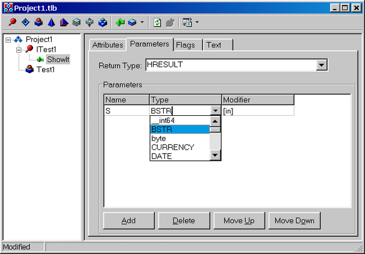

Создание COM-сервера
====================

::: {.date}
01.01.2007
:::

Для создания COM-сервера Delphi предоставляет широкий набор мастеров,
автоматизирующих выполнение рутинных задач и позволяющих программисту
сконцентрироваться на реализации функциональности. Мастера доступны при
помощи команды меню File-\>New, на закладке ActiveX

Чтобы сделать COM-сервером EXE-файл, Вы должны просто добавить в него
модуль с COM-объектом. Для создания COM-сервера в виде DLL Вы должны
сначала создать библиотеку, оформленную с учетом требований COM. Это
делается при помощи мастера «ActiveX Library». При его выборе будет
создан новый проект, реализующий DLL и сгенерирован следующий код:

    library Project1;
     
    uses
      ComServ;
     
    exports
      DllGetClassObject,
      DllCanUnloadNow,
      DllRegisterServer,
      DllUnregisterServer;
     
    {$R *.RES}
     
    begin
    end.

Созданная DLL экспортирует функции, необходимые для работы COM и Вы
можете не заботиться о рутинной работе и сразу приступить к реализации
COM-сервера.Для этого выберите мастер «COM-объект».

От заполнения полей этой формы зависит реализация создаваемого
COM-объекта

`ClassName` - Имя класса Delphi, реализующего COM-сервер. Мастер
создаст заготовку класса с этим именем. Под этим же именем COM-сервер
будет зарегистрирован в реестре.

`Instansing` - Определяет режим создания COM-объектов. Параметр может
принимать следующие значения:  
* `Internal` Объект может использоваться только внутри этого приложения.
* `Single Instance` Создание каждого экземпляра объекта приводит к запуску
нового экземпляра приложения-сервера. После создания объекта «фабрика объектов» приложения
удаляет информацию о себе из системного списка зарегистрированных
фабрик, что заставляет COM при создании нового объекта запустить
приложение сервер в новом процессе
* Multiple Instance - После создания экземпляра объекта «фабрика» не удаляет себя из списка
зарегистрированных. При создании запросе на создание нового объекта COM
обнаружит её в этом списке и запросит создание у той же фабрики и новый
экземпляр объекта будет создан в том же приложении. Другими словами для
создания всех объектов данного типа будт запущено не более одного
экземпляра сервера.  Этот параметр имеет смысл только для EXE-серверов,
для DLL он игнорируется.

`Threading Model` - Потоковая модель сервера. Действие этого
параметра зависит от типа сервера (EXE или DLL):
* `Single` Нет никакой поддержки потоков. Для DLL-сервера при регистрации не будет создан
параметр
* `ThreadingModel - Для EXE-сервера указание этого параметра (в
отличие от любого другого) не приведет к установке флага `IsMultiThread`,
будет создана STA. Обычно эта модель используется для Internal серверов 
* `Apartment` - Для DLL сервера в реестре будет создан параметр 
`ThreadingModel=Apartment`, для EXE - создана `STA`
* `Free` - Для DLL сервера в реестре будет создан параметр `ThreadingModel=Free`,
для EXE - создана MTA
* `Both` - Для DLL сервера в реестре будет создан параметр 'ThreadingModel= Both',
 для EXE - создана MTA

Include Type Library        Установка этого флажка приводит к включению
в сервер библиотеки типов - специального двоичного ресурса,
описывающего реализуемые сервером интерфейсы, их методы и параметры
вызова. COM предоставляет стандартные средства работы с библиотеками
типов. В частности, Delphi может импортировать имеющуюся в сервере
библиотеку типов и автоматически построить по ней интерфейсный модуль
для работы с ним. При использовании библиотеки типов интерфейсы
описываются при помощи Type Library Editor. Объект наследуется от
TTypedComObject Если этот флажок выключен, то объект наследуется от
TComObject. Это более легковесная реализация сервера.      

Implemented Interfaces        Это поле разрешено, только если объект не
использует библиотеку типов. В этом случае Вы должны сами описать
интерфейсы в коде своей программы и перечислить их в этом поле, например
«ITest, IAnotherTest»

Mark interface Oleautomation        Установка этого флага делает
COM-сервер совместимым с OLE Automation. Вы должны использовать в
методах интерфейса только совместимые с OLE Automation типы данных. Это
необходимо, если Вы хотите передавать ссылку на интерфейс между разными
«комнатами». Такая операция, называемая маршаллингом интерфейсов требует
написания специальной proxy/stub DLL. Однако, если интерфейс помечен как
Oleautomation эту работу выполняет маршаллер OLE и Вы будете избавлены
от лишней работы.      

!        Для поддержки Oleautomation маршаллинга необходимо, чтобы:

::: {style="text-align: left; text-indent: 0px; padding: 0px 0px 0px 0px; margin: 0px 0px 0px 24px;"}
  --- ---------------------------------------------------------------------------------
  •   сервер был унаследован от TTypedComObject (реализация IDispatch не обязательна)
  --- ---------------------------------------------------------------------------------
:::

::: {style="text-align: left; text-indent: 0px; padding: 0px 0px 0px 0px; margin: 0px 0px 0px 24px;"}
  --- -----------------------------------------------------------------------------------------------------------------------------------------------------------------------------------------------------------------------------------------------------------------------------------------------------------------------------------------------------------------------
  •   все методы интерфейса должны быть объявлены как safecall. Если Вы создаете интерфейс унаследованный от IUnknown, то по умолчанию все его методы объявляются как stdcall. Чтобы создать safecall методы необходимо в диалоге Tools-\>Environment Options на закладке Type Library установить переключатель Safecall function mapping в значение All v-table interfaces
  --- -----------------------------------------------------------------------------------------------------------------------------------------------------------------------------------------------------------------------------------------------------------------------------------------------------------------------------------------------------------------------
:::

Сервер без библиотеки типов

Такой сервер, если он не реализует интерфейс IMarshall, может работать
только в одной «комнате» с клиентом, поэтому его следует использовать
только для In-Process серверов с потоковой моделью идентичной клиенту.

При создании сервера, не включающего библиотеку типов Вы должны указать
мастеру реализуемые им интерфейсы. Укажем имя интерфейса ITest. По
завершении работы мастера будет создан следующий модуль:

    unit Unit1;
     
    interface
     
    uses
      Windows, ActiveX, Classes, ComObj;
     
    type
      TTest = class(TComObject, ITest)
      protected
      end;
     
    const
      Class_Test: TGUID = '{1302FB00-703F-11D4-84DD-825B45DBA617}';
     
    implementation
     
    uses ComServ;
     
    initialization
      TComObjectFactory.Create(ComServer, TTest, Class_Test,
        'Test', '', ciMultiInstance, tmApartment);
    end.

!        Если Вы создаете COM-сервер, который может использоваться
различными клиентами (а не только в рамках конкретного проекта, в
котором спецификации клиентов жестко заданы) не рекомендуется делать
серверы без поддержки маршаллинга данных, поскольку в этом случае
невозможно обеспечить гарантированное нахождение его в одной «комнате» с
клиентом. Если вы все же делаете такой сервер - необходимо отразить
требуемые спецификации клиента в документации на него.

Посмотрим на сгенерированный код подробнее. Особый интерес вызывает
секция Initialization. В ней создается экземпляр «фабрики объектов» -
COM-сервера, реализующего интерфейс IClassFactory2. К нему COM будет
обращаться для создания экземпляра объекта Test. VCL автоматически
реализует всю рутинную работу по взаимодействию с COM.

Для реализации сервера требуется написать интерфейсный модуль с
описанием реализуемого интерфейса. Кроме этого, вынесем в него описание
константы Class\_Test и добавим его в строку uses модуля Unit1

    unit TestInterface;
     
    interface
     
    const
      Class_Test: TGUID = '{1302FB00-703F-11D4-84DD-825B45DBA617}';
     
    type
      ITest = interface
      ['{1C986802-6D6D-11D4-84DD-996A491CE716}']
        procedure ShowIt(S: String);
      end;
     
    implementation
     
    end.

Этот модуль содержит всю необходимую информацию для использования
сервера и должен использоваться при компиляции клиента.

Дополним код COM-объекта реализацией методов реализуемого интерфейса:

    unit Unit1;
     
    interface
     
    uses
      Windows, ActiveX, Classes, ComObj, TestInterface;
     
    type
      TTest = class(TComObject, ITest)
      protected
        procedure ShowIt(S: String);
      end;
     
    implementation
     
    uses ComServ;
     
    { TTest }
     
    procedure TTest.ShowIt(S: String);
    begin
      MessageBox(0, PChar(S), NIL, 0);
    end;
     
    initialization
      TComObjectFactory.Create(ComServer, TTest, Class_Test,
        'Test', '', ciMultiInstance, tmApartment);
    end.

Откомпилировав проект, мы получим файл Project1.dll

Последним шагом является регистрация COM-сервера.

Введем в командной строке: «regsvr32 project1.dll»

Если все было проделано правильно, на экране должно появиться сообщение
об успешной регистрации: «DllRegisterServer in Project1.dll succeeded».

Можно приступать к написанию клиента. Для этого создадим новый проект,
добавим в модуль с его главной формой строку uses TestInterface и
напишем следующий код:

    uses TestInterface, ComObj;
     
    procedure TForm1.Button1Click(Sender: TObject);
    var
      Test: ITest;
    begin
      Test := CreateComObject(Class_Test) as ITest;
      Test.ShowIt('Hi');
    end;

Как видно из этого примера создание и использование COM-сервера не
сложнее, чем работа с обычными классами Delphi. Сервер без библиотеки
типов является хорошим выбором для реализации COM-серверов, используемых
внутри проекта, поскольку для его использования нужен интерфейсный
модуль. При передаче сервера другим разработчикам Вам придется передать
им этот модуль и, при необходимости, перевести его на другой язык
(например, С).

Сервер с библиотекой типов

Библиотека типов - это специальный двоичный ресурс, описывающий
интерфейсы и методы, реализуемые COM-сервером. Кроме наличия библиотеки
типов сервер должен поддерживать интерфейс IProvideClassInfo. В Delphi
такой сервер реализуется путем наследования его от TTypedComObject. Для
этого оставьте флажок Include Type Library в мастере создания
COM-объекта включенным.

Создадим COM-сервер в виде EXE (разумеется, он может быть также создан и
виде DLL).

Сначала создадим новый проект (File-New Application), а затем добавим в
него COM-объект.

Если не отключать флажок Include Type Library, то мастер создаст уже не
один, а два модуля. Первый из них напоминает созданный ранее.

     
    unit Unit1;
     
    interface
     
    uses
      Windows, ActiveX, Classes, ComObj, Project1_TLB, StdVcl;
     
    type
      TTest1 = class(TTypedComObject, ITest1)
      protected
        {Declare ITest1 methods here}
      end;
     
    implementation
     
    uses ComServ;
     
    initialization
      TTypedComObjectFactory.Create(ComServer, TTest1, Class_Test1,
        ciMultiInstance, tmApartment);
    end.

Наиболее интересна строка: uses ... Project1\_TLB. Это автоматически
сгенерированный интерфейсный модуль к нашему COM-объекту (аналогично
TestInterface.pas в предыдущем примере). Он содержит описание всех
необходимых для работы с сервером интерфейсов. В отличие от пердыдущего
примера Вы не должны редактировать его вручную. Для этого Delphi откроет
редактор библиотеки типов

Это специализированный редактор для описания интерфейсов COM-объектов.
Вы должны описать все требуемые интерфейсы, методы и т.п. в этом
редакторе, после чего можно нажать кнопку  «обновить» и изменения будут
автоматически внесены во все требуемые модули. Вам останется лишь
дописать реализацию методов.

Добавим описание нового метода. Для этого щелкнем правой кнопкой на
интерфейсе ITest и выберем в контекстном меню New-\>Method. Введем имя
метода «ShowIt».

{width="606" height="423"}

На закладке Parameters зададим параметр S и тип BSTR. После этого нажмем
кнопку обновить и посмотрим, что случилось с исходными текстами нашей
программы. В модуле Project1\_TLB в описании интерфейса ITest1 появился
метод ShowIt

      ITest1 = interface(IUnknown)
        ['{1302FB06-703F-11D4-84DD-825B45DBA617}']
        function ShowIt(const S: WideString): HResult; stdcall;
      end;

А в модуле Unit1:

    type
      TTest1 = class(TTypedComObject, ITest1)
      protected
        function ShowIt(const S: WideString): HResult; stdcall;
      end;
     
    implementation
     
    uses ComServ;
     
    function TTest1.ShowIt(const S: WideString): HResult;
    begin
     
    end;

Нам остается лишь написать реализацию метода:

    function TTest1.ShowIt(const S: WideString): HResult;
     begin
      MessageBoxW(0, PWideChar(S), NIL, 0)
      Result := S_OK; // Стандартный код успешного завершения
    end;

Для регистрации сервера достаточно один раз запустить его на компьютере
клиента.
