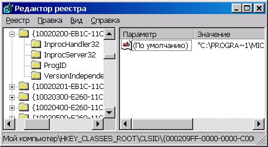
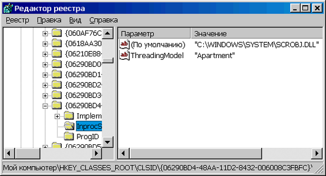

COM-сервер, структура и использование
=====================================

Модель COM предоставляет возможность создания многократно используемых
компонентов, независимых от языка программирования. Такие компоненты
называются COM-серверами и представляют собой исполнимые файлы (EXE) или
динамические библиотеки (DLL), специальным образом оформленные для
обеспечения возможности их универсального вызова из любой программы,
написанной на поддерживающем COM языке программирования. При этом COM
сервер может выполняться как в адресном пространстве вызывающей
программы (In-Proc сервер), так и в виде самостоятельного процесса
(Out-Of-Proc сервер) или даже на другом компьютере (Distributed COM).
COM автоматически разрешает вопросы, связанные с передачей параметров
(Marshalling) и согласованием потоковых моделей клиента и сервера.

Далее будут рассмотрены некоторые архитектурные вопросы, знание которых
необходимо для работы с COM.

### COM-сервер

COM-сервер - это специальным образом оформленное и зарегистрированное
приложение, которое позволяет клиентам запрашивать у себя создание
реализованных в нем объектов. Сервер может быть выполнен в виде
динамической библиотеки, либо исполнимого файла.

### Сервер в виде DLL

Такой сервер всегда выполняется в адресном пространстве
активизировавшего его приложения (In-Process). За счет этого, как
правило, снижаются накладные расходы на вызов методов сервера. В то же
время такой сервер менее надежен, поскольку его память не защищена от
ошибок в вызывающем приложении. Кроме этого он не может выполняться на
удаленной машине без исполнимого модуля-посредника, который бы создал
процесс, в который может быть загружена DLL. Примером такого модуля
может служить Microsoft Transaction Server.

### Сервер в виде исполнимого файла

Этот сервер представляет собой обычный исполнимый файл Windows в котором
реализована возможность создания COM-объектов по запросу других
приложений. Примером такого сервера является пакет Microsoft Office,
приложения которого являются COM-серверами.

### Регистрация сервера

COM реализует механизм автоматического поиска серверов по запросу
клиента. Каждый COM-объект имеет уникальный идентификатор, Class
Identifier (CLSID). Windows ведет в реестре базу данных
зарегистрированный объектов, индексированную при помощи CLSID. Она
расположена в ветке реестра HKEY\_CLASSES\_ROOT\\CLSID.

{.center}

Для каждого сервера прописывается информация, необходимая для нахождения
и загрузки его модуля. Таким образом, клиентское приложение не должно
беспокоиться о поиске сервера, достаточно зарегистрировать его на
компьютере и COM автоматически найдет и загрузит нужный модуль. Кроме
этого, объект может зарегистрировать свое «дружественное» имя, или
Programmatic Identifier (PROGID). Обычно оно формируется как комбинация
имени сервера и имени объекта, например «Word.Application». Это имя
содержит ссылку на CLSID объекта. Когда он создается с использованием
PROGID - COM просто берет связанное с ним значение CLSID и получает из
него всю необходимую информацию.

Серверы в виде EXE автоматически регистрируются при первом запуске
программы на компьютере. Для регистрации серверов DLL служит программа
Regsvr32, поставляемая в составе Windows, либо TRegSvr из  поставки
DELPHI.

### Потоки и Комнаты

Windows - многозадачная и многопоточная среда с вытесняющей
многозадачностью. Применительно к COM это обозначает, что клиент и
сервер могут оказаться в различных процессах или потоках приложения, что
к серверу могут обращаться множество клиентов, причем в непредсказуемые
моменты времени. Технология COM решает эту проблему при помощи концепции
комнат (Apartments), в которых и выполняются COM клиенты и серверы.
Комнаты бывают однопоточные (Single Threaded Apartment, STA) и
многопоточные (Multiple Threaded Apartment, MTA).

### STA

При создании однопоточной «комнаты» COM неявно создает окно, и при
вызове любого метода COM-сервера в этой «комнате» посылает этому окну
сообщение при помощи функции PostMessage. Таким образом, организуется
очередь вызовов методов и каждый из них обрабатывается только после
того, как будут обработаны все предшествующие вызовы. Основные
достоинства однопоточной «комнаты»:

1.   Программист может не заботиться о синхронизации методов. Гарантируется, что до окончания выполнения текущего метода не будет вызван никакой другой метод объекта.
2.   Программист может не заботиться о синхронизации доступа к полям класса, реализующего объект. Поскольку одновременно может выполняться только один метод - одновременный доступ к полю из двух методов невозможен.

В то же время, если приложение создало несколько потоков, в каждом из
которых имеется STA - при доступе к глобальным разделяемым данным они
должны использовать синхронизацию, например при помощи критических
секций.

Недостатки STA напрямую вытекают из её реализации:

1.   Дополнительные (и иногда излишние) затраты на синхронизацию при вызове методов.
2.   Невозможность отклика на вызов метода, пока не исполнен предыдущий. Например, если в настоящее время выполняется метод, требующий одну минуту на исполнение - то до его завершения COM-объект будет недоступен.

Тем не менее, STA как правило является наиболее подходящим выбором для
реализации COM-сервера. Использовать MTA есть смысл только в том случае,
если STA не подходит для конкретного сервера.

### MTA

Многопоточная «комната» не реализует автоматического сервиса по
синхронизации и не имеет его ограничений. Внутри неё может быть создано
сколько угодно потоков и объектов, причем каждый объект не привязан к
какому-то конкретному потоку. Это означает, что любой метод объекта
может быть вызван в любом из потоков в MTA. В это же самое время в
другом потоке может быть вызван любой другой (либо тот же самый) метод
COM-объекта по запросу другого клиента. COM автоматически ведет пул
потоков внутри MTA и, при вызове со стороны клиента, находит свободный
поток, и в нем вызывает метод требуемого объекта. Таким образом, даже
если выполняется метод, требующий длительного времени - для другого
клиента он может быть вызван без задержки в другом потоке. Очевидно, что
COM-сервер, работающий в MTA обладает потенциально более высоким
быстродействием и доступностью для клиентов, однако он значительно
сложнее в разработке, поскольку даже локальные данные объектов не
защищены от одновременного доступа и требуют синхронизации.

### Передача интерфейсов и параметров

Таким образом, клиент и сервер COM могут выполняться как в одной
«комнате», так и в разных, расположенных в различных процессах или даже
на разных компьютерах. Встает вопрос - как же клиент может вызывать
методы сервера, если они находятся в общем случае в другом адресном
пространстве?

Эту работу берет на себя COM. Для доступа к серверу в другой «комнате»
клиент должен запросить у COM создание в своей «комнате» представителя,
реализующего запрошенный интерфейс. Такой представитель в терминах COM
называется proxy и представляет собой объект, экспортирующий запрошенный
интерфейс. Одновременно, COM создает в «комнате» сервера
объект-заглушку, принимающий вызовы от proxy и транслирующий их в вызовы
сервера. Таким образом, клиент в своей комнате может рассматривать proxy
в качестве сервера и работать с ним так, как будто сервер создан в его
«комнате». В то же время, сервер может рассматривать stub как
расположенного с ним в одной «комнате» клиента.

Всю работу по
организации взаимодействия proxy и stub берет на себя COM. При вызове со
стороны клиента Proxy получает от него параметры, упаковывает их во
внутреннюю структуру и передает в комнату сервера. Stub получает
параметры, распаковывает их и производит вызов метода сервера.
Аналогично осуществляется передача параметров обратно. Этот процесс
называется Marshalling. При этом «комнаты» клиента и сервера могут иметь
разные потоковые модели и физически находиться где угодно. Разумеется,
такой вызов вносит значительные накладные расходы, по сравнению с
вызовом сервера в «своей» комнате, однако это единственный способ
обеспечить корректную работу любых клиентов и серверов. Если необходимо
избежать накладных расходов - сервер надо создавать в той же комнате,
где расположен клиент.

Для обеспечения возможности корректного создания Proxy в клиентской
комнате COM должен узнать «устройство» сервера. Сделать это можно двумя
способами:

1.   Реализовать на сервере интерфейс IMarshal и, при необходимости proxy-DLL, которая будет загружена на клиенте для реализации proxy. Подробности реализации описаны в документации COM и MSDN
2.   Описать интерфейс на IDL (Interface Definition Language) и при помощи компилятора MIDL фирмы Microsoft сгенерировать proxy-stub DLL
3.   Сделать сервер совместимым с Ole Automation. В этом случае COM сам создаст proxy, используя описание сервера из его библиотеки типов - специального двоичного ресурса, описывающего COM-интерфейс. При этом в интерфейсе можно использовать только типы данных, совместимые с Ole Automation.

### Инициализация COM

Каким же образом клиенты и серверы COM могут создавать комнаты в
соответствии со своими требованиями? Для этого они должны соблюдать одно
правило: каждый поток, который желает использовать COM должен создать
комнату, при помощи вызова функции CoInitializeEx. Она объявлена в
модуле ActiveX.pas следующим образом:

     
    const
      COINIT_MULTITHREADED      = 0;  // OLE calls objects on any thread.
      COINIT_APARTMENTTHREADED  = 2;  // Apartment model
     
    function CoInitializeEx(pvReserved: Pointer; 
                            coInit: Longint): HResult; stdcall;

Параметр pvReserved зарезервирован  для будущего использования и должен
быть равен NIL, а параметр coInit определяет потоковую модель
создаваемой комнаты. Он может принимать значения:

COINIT\_APARTMENTTHREADED        Для потока создается STA. Каждый поток
может иметь (или не иметь) свою STA

COINIT\_MULTITHREADED            Если в текущем процессе еще не создана
MTA - создается новая MTA,
если она уже создана другим потоком - поток «подключается» к ранее
созданной. Иными словами, каждый процесс может иметь только одну MTA.
 

Функция возвращает S\_OK в случае успешного создания комнаты.

По завершении работы с COM (или перед завершением работы) поток должен
уничтожить «комнату» при помощи вызова процедуры CoUninitialize, также
описанной в модуле ActiveX

    procedure CoUninitialize; stdcall;

Каждый вызов CoInitializeEx  должен иметь соответствующий вызов
CoUninitialize, т.е. если Вы используете COM в приложении, вы должны
вызвать CoInitializeEx до первого использования функций COM и
CoUninitialize в перед завершением работы приложения. VCL реализует
автоматическую инициализацию COM при использовании модуля ComObj. По
умолчанию создается STA. Если Вы хотите использовать другую потоковую
модель, Вы должны установить флаг инициализации COM до оператора
Application.Initialize

    program Project1;
     
    uses
      Forms,
      ComObj,
      ActiveX,
      Unit1 in 'Unit1.pas' {Form1};
     
    {$R *.RES}
     
    begin
      CoInitFlags := COINIT_MULTITHREADED;
      Application.Initialize;
      Application.CreateForm(TForm1, Form1);
      Application.Run;
    end. 
     
Если COM используется в потоке, то эти функции должны быть вызваны в методе Execute
     
    procedure TMyThread.Execute;
    begin
      CoInitializeEx(NIL, COINIT_MULTITHREADED);
      …
      CoUninitialize
    end;

Инициализация COM требуется также для вызова любых функций Windows API,
связанных с COM, за исключением CoGetMalloc, CoTaskMemAlloc,
CoTaskMemFree и CoTaskMemReAlloc.

Отдельного обсуждения заслуживает инициализация потоковой модели COM для
сервера, расположенного в DLL. Дело в том, что DLL может быть загружена
любым потоком, который уже ранее создал свою «комнату». Поэтому, сервер
в DLL не может сам проинициализировать требуемую ему потоковую модель.
Вместо этого, сервер при регистрации прописывает в реестре параметр
«ThreadingModel», который и указывает - в какой потоковой модели
способен работать данный сервер. При создании сервера COM анализирует
значение этого параметра и потоковой модели «комнаты» запросившего
создание сервера потока и при необходимости создает для сервера
«комнату» с требуемой потоковой моделью.

{.center}

Параметр ThreadingModel может принимать следующие значения:

Apartment
: Сервер может работать только в STA. Если он создается
из STA, то он будет создан в «комнате» вызывающего потока,
если из MTA - COM автоматически создаст для него «комнату» c STA
и proxy в «комнате» клиента.

Free
: Сервер может работать только в MTA.
Если он создается из MTA, то он будет создан в «комнате» вызывающего
потока, если из STA - COM автоматически создаст для него «комнату» c
MTA и proxy в «комнате» клиента.

Both
: Сервер может работать
как в STA, так и MTA. Объект всегда создается в вызывающей комнате.
 

Если этот параметр не задан - сервер имеет потоковую модель Single. В
этом случае он создается в Primary STA (т.е. в STA потока, который
первым вызвал CoInitialize), даже если создание сервера запрошено из
потока, имеющего свою отдельную STA.

### Активация сервера

Для активации COM-сервера клиент должен вызвать функцию CreateComObject,
описанную в модуле ComObj.pas

    function CreateComObject(const ClassID: TGUID): IUnknown;

функция получает в качестве параметра CLSID требуемого объекта и
возвращает ссылку на его интерфейс IUnknown. Далее клиент может
запросить требуемый интерфейс и работать с ним.

    var
    COMServer: IComServer;
    ...
    // Создаем COM объект и запрашиваем у него интерфейс
    ComServer := CreateComObject(IComServer) as IComServer;
    // Работаем с интерфейсои
    ComServer.DoSomething;
    // Освобождаем интерфейс
    ComServer := NIL;

Что же делает COM при запросе на создание сервера?

1.   В реестре, по запрошенному CLSID, ищется запись регистрации сервера.
2.   Из этой записи получается имя исполнимого модуля сервера.
3.   Если это исполнимый файл - он запускается на выполнение. Любое приложение, реализующее COM-сервер при старте регистрирует в системе интерфейс «фабрики объектов». После запуска и регистрации COM получает ссылку на «фабрику объектов»
4.   Если это DLL - она загружается в адресное пространство вызвавшего процесса  и вызывается её функция DllGetClassObject, возвращающая ссылку на реализованную в DLL «фабрику объектов»
5.   Фабрика объектов - это COM-сервер, реализующий интерфейс IClassFactory. Ключевым методом этого интерфейса является метод CreateInstance, который и создает экземпляр требуемого объекта.
6.   COM вызывает метод CreateInstance и передает полученный интерфейс клиенту.

По завершении работы с COM-объектом клиент освобождает ссылку на него
(что приводит к вызову метода Release). В этот момент COM-сервер
проверяет, есть ли еще ссылки на созданные им объекты. Если все объекты
освобождены, то COM-сервер завершает свою работу. В случае, если он
реализован в виде DLL он должен экспортировать функцию DllCanUnloadNow,
которая вызывается COM по таймеру или при вызове функции API
CoFreeUnusedLibraries. Если все объекты из этой DLL освобождены, то она
выгружается из памяти.

Вся работа по созданию и регистрации фабрики объектов и экспорту
соответствующих функций из DLL в Delphi уже реализована в составе
стандартных библиотек и создание COM-сервера в действительности является
очень простой задачей.
