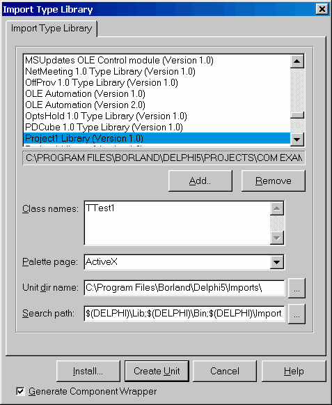
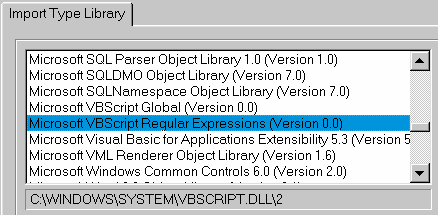

Создание приложения клиента
===========================

Перейдем к написанию приложения клиента. Если у нас есть модуль
Project\_TLB, то оно ничем не будет отличаться от предыдущего примера.
Более интересен случай, когда мы имеем только исполнимый файл с
сервером. Зарегистрируем этот сервер и выберем в меню Delphi IDE команду
Project -\> Import Type Library

В открывшемся окне найдем строку с описанием библиотеки типов требуемого
сервера:

{.center}

Если включен флажок Generate Component Wrappers, то в импортированный
модуль будет добавлен код для создания компонента Delphi, который можно
бросить на форму и он автоматически создаст требуемый COM-сервер и
позволит обращаться к его методам. В противном случае будет сгенерирован
модуль, содержащий описание всех имеющихся в библиотеке типов
интерфейсов.

Далее Вы должны определить, что Вы собираетесь сделать с выбранной
библиотекой

Install
: Создает модуль с описанием интерфейсов и автоматически
регистрирует требуемые компоненты в IDE. После этого Вам остается лишь
бросить их на форму.

Create Unit
: Создает интерфейсный
модуль, но не устанавливает его в IDE. Это удобно, если Вам нужны только
описания интерфейсов, либо если Вы хотите вручную установить его в
package, отличающуюся от используемой по умолчанию

Таким образом, для распространения и использования сервера не нужно
ничего, кроме его исполнимого модуля. Но самое главное даже не это.
Гораздо более важно, что Вы можете импортировать и использовать в своей
программе любой из имеющихся на компьютере COM-серверов. Естественно,
что при передаче своей программы клиенту Вы должны установить на его
компьютере соответствующий COM-сервер.

{.center}

Для примера, используем в своем приложении процессор регулярных
выражений VBScript. Импортируем библиотеку типов «Microsoft VBScript
Regular Expressions»

При этом будет создан файл VBScript\_RegExp\_TLB.pas

Создадим форму и добавим следующий код для проверки вхождения текста в
Exit1 в текст Edit2:

    uses
      VBScript_RegExp_TLB;
     
    procedure TForm1.Button1Click(Sender: TObject);
    var
      RE: IRegExp;
    begin
      RE := CoRegExp.Create;
      RE.Pattern := Edit1.Text;
      if RE.Test(Edit2.Text) then
        Caption := 'TRUE'
      else
        Caption := 'FALSE';
    end;

Это все! Мы получили в своем приложении поддержку регулярных выражений
такую же, которая включена в скриптовые языки Microsoft (VBScript и
JScript).
