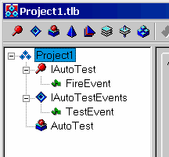
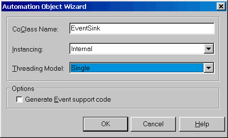
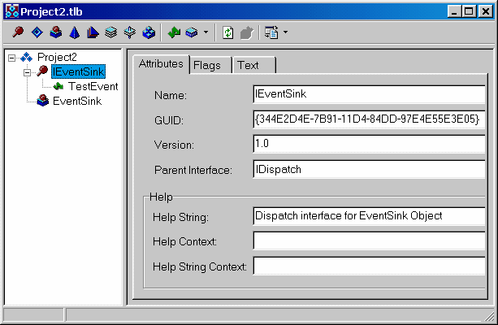
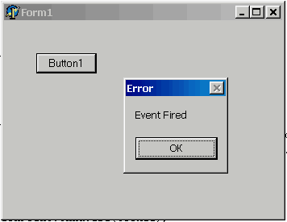
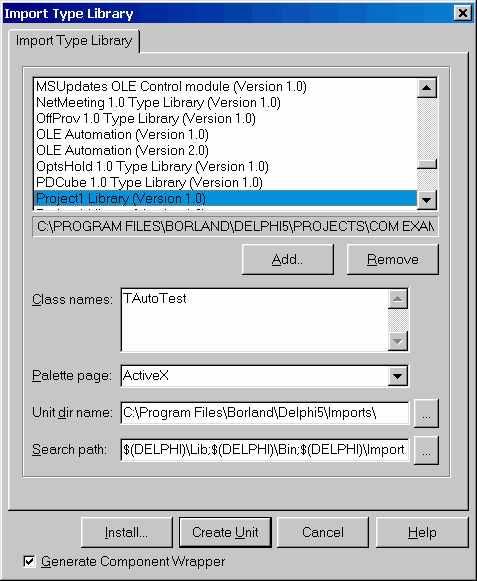
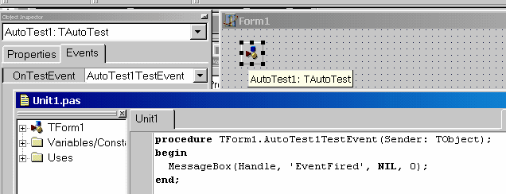

OLE Automation
==============

::: {.date}
01.01.2007
:::

Стандарт COM основан на едином для всех поддерживающих его языков
формате таблицы, описывающей ссылки на методы объекта, реализующего
интерфейс. Однако, вызов методов при помощи этой таблицы доступен только
для компилирующих языков программирования. В то же время, очень удобно
было бы иметь доступ к богатству возможностей, предоставляемых COM из
интерпретирующих языков, таких, как VBScript. Для поддержки этих языков
была разработана технология под названием OLE Automation, позволяющая
приложениям делать свою функциональность доступной для гораздо большего
числа клиентов. Automation базируется на COM и является его
подмножеством, однако накладывает на COM-серверы ряд дополнительных
требований:

::: {style="text-align: left; text-indent: 0px; padding: 0px 0px 0px 0px; margin: 0px 0px 0px 24px;"}
  ---- -----------------------------------------------------------------------
  1.   Интерфейс, реализуемый COM-сервером должен наследоваться от IDispatch
  ---- -----------------------------------------------------------------------
:::

::: {style="text-align: left; text-indent: 0px; padding: 0px 0px 0px 0px; margin: 0px 0px 0px 24px;"}
  ---- ---------------------------------------------------------------------------
  2.   Должны использоваться типы данных, из числа поддерживаемых OLE Automation
  ---- ---------------------------------------------------------------------------
:::

Тип данных OLE Automation    |    Тип данных Delphi   |     Примечание
---------------------------- | ---------------------- | --------------- 
Boolean    |    WordBool | 
Unsigned Char   |     Byte | 
Double    |    Double | 
Float     |   Single | 
Int       | SYSINT   |     Машинно-зависимый целый тип данных, в настоящее время объявлен как Integer, однако, в будущем может иметь другую разрядность
Long      |  Integer | 
Short     |   SmallInt | 
BSTR      |  WideString |       В Automation нельзя использовать строки Delphi
Currency  |      Currency | 
Date      |  TDateTime | 
SAFEARRAY |       PSafeArray |       Массив из элементов любого поддерживаемого типа
Decimal   |     TDecimal   |     96 битное десятичное число.
Interface IDispatch * |       IDispatch |       Ссылка на IDispatch или любой унаследованный от него интерфейс
Interface IUnknown *  |      IUnknown   |     Ссылка на произвольный интерфейс
VARIANT     |   OleVariant |       Вариант, совместимый с OLE

Возможна поддержка пользовательских типов данных, для чего необходимо
реализовать интерфейс IRecordInfo

::: {style="text-align: left; text-indent: 0px; padding: 0px 0px 0px 0px; margin: 0px 0px 0px 24px;"}
  ---- ---------------------------------------------------------------------------------------
  1.   Все методы должны быть процедурами или функциями, возвращающими значение типа HRESULT
  ---- ---------------------------------------------------------------------------------------
:::

::: {style="text-align: left; text-indent: 0px; padding: 0px 0px 0px 0px; margin: 0px 0px 0px 24px;"}
  ---- -------------------------------------------------------
  2.   Все методы должны иметь соглашение о вызовах safecall
  ---- -------------------------------------------------------
:::

Кроме этого, Automation-серверы могут поддерживать еще ряд интерфейсов,
позволяющих получать информацию о методах, обрабатывать ошибки и т.п.
Все необходимые интерфейсы реализуются VCL Delphi автоматически.

### IDispatch

Центральным элементом технологии OLE Automation является интерфейс
IDispatch. Ключевыми методами этого интерфейса являются методы
GetIdsOfNames и Invoke, которые позволяют клиенту запросить у сервера,
поддерживает ли он метод с указанным именем, а затем, если метод
поддерживается - вызвать его. Подробно реализация и работа IDispatch
рассматривается в главе, посвященной работе с Mcrosoft Scripting
Control, здесь же мы лишь вкратце опишем основной алгоритм вызова
методов при помощи IDispatch.

Когда клиенту требуется вызвать метод, он вызывает GetIdsOfNames,
передавая ему имя запрошенного метода. Если сервер поддерживает такой
метод, он возвращает его идентификатор - целое число, уникальное для
каждого метода. После этого клиент упаковывает параметры в массив
переменных типа OleVariant и вызывает Invoke, передавая ему массив
параметров и идентификатор метода.

Таким образом, все, что должен знать клиент - это строковое имя метода.
Такой алгоритм позволяет работать с наследниками IDispatch из скриптовых
языков.

Методы GetTypeInfo и GetTypeInfoCount являются вспомогательными и
обеспечивают поддержку библиотеки типов объекта. Реализация методов
GetIdsOfNames и Invoke, предоставляемая COM по умолчанию базируется на
библиотеке типов объекта.

### Поддержка IDispatch, тип данных Variant

Delphi имеет встроенную поддержку работы в качестве клиента Automation.
Тип данных Variant может содержать ссылку на интерфейс IDispatch и
использоваться для вызова его методов.

    uses ComObj;
     
    procedure TForm1.Button1Click(Sender: TObject);
    var
      V: Variant;
    begin
      V := CreateOleObject('InternetExplorer.Application');
      V.Toolbar := FALSE;
      V.Left := (Screen.Width - 600) div 2;
      V.Width := 600;
      V.Top := (Screen.Height - 400) div 2;
      V.Height := 400;
      V.Visible := TRUE;
      V.Navigate(URL := 'file://C:\config.sys');
      V.StatusText := V.LocationURL;
      Sleep(10000);
      V.Quit;
    end;

Приведенный выше код весьма необычен и заслуживает внимательного
рассмотрения.

::: {style="text-align: left; text-indent: 0px; padding: 0px 0px 0px 0px; margin: 0px 0px 0px 24px;"}
  ---- ----------------------------------------------------------------------------------------------------
  1.   Переменная V не является классом и, очевидно не имеет ни одного из используемых свойств и методов.
  ---- ----------------------------------------------------------------------------------------------------
:::

::: {style="text-align: left; text-indent: 0px; padding: 0px 0px 0px 0px; margin: 0px 0px 0px 24px;"}
  ---- ------------------------------------------------------------------------------------------
  2.   Вызываемые свойства и методы нигде не описаны, однако это не вызывает ошибки компиляции.
  ---- ------------------------------------------------------------------------------------------
:::

::: {style="text-align: left; text-indent: 0px; padding: 0px 0px 0px 0px; margin: 0px 0px 0px 24px;"}
  ---- -----------------------------------------------------------------------------------
  3.   Объект создается не по CLSID, а по информативному имени, функцией CreateOleObject
  ---- -----------------------------------------------------------------------------------
:::

Все это непривычно и выглядит довольно странно. На самом деле - ничего
странного нет. Компилятор Delphi просто запоминает в коде программы
строковые описания обращений к серверу автоматизации, а на этапе
выполнения передает их его интерфейсу IDispatch, который и производит
синтаксический разбор и выполнение. Исправим третью строку функции на:

    V.Left1 := (Screen.Width - 600) div 2;

Программа успешно откомпилируется, однако, при попытке выполнить выдаст
ошибку с сообщением, что метод «Left1» не поддерживается сервером
автоматизации.

Такое обращение к серверу называется поздним связыванием, что означает,
что связывание имен свойств и методов объекта с их кодом происходит не
на этапе компиляции, а на этапе выполнения программы.

Достоинства позднего связывания очевидны - не нужна библиотека типов,
написание несложных программ упрощается. Столь же очевидны недостатки --
не производится контроль вызовов и передаваемых параметров на этапе
компиляции, работа несколько медленнее, чем при раннем связывании.

**Внимание!**
        Если COM-сервер находится в другой «комнате» - затраты на
позднее связывание пренебрежимо малы, по сравнению с затратами на
маршаллинг вызовов. Разница в скорости между ранним и поздним
связыванием становится ощутимой (десятки и сотни раз) при нахождении
клиента ми сервера в одной «комнате», что возможно только для In-Proc
сервера при совместимой с клиентом потоковой модели. Для Out-Of-Proc
сервера (размещенного в отдельном исполнимом файле) затраты на вызов
метода практически равны.

В связи с этим главным преимуществом раннего связывания является строгий
контроль типов на этапе компиляции. Для разрешения проблемы нестрогого
контроля типов COM предлагает несколько дополнительных возможностей

### Dispinterface

Dispinterface - это декларация методов, доступных через интерфейс
IDispatch. Объявляется он следующим образом:

    type
      IMyDisp = dispinterface
        ['{EE05DFE2-5549-11D0-9EA9-0020AF3D82DA}']
        property Count: Integer dispid 1
        procedure Clear dispid 2; 
      end;

Самих методов может физически и не существовать (например, они
реализуются динамически в Invoke). Рассмотрим использование
dispinterface на простом примере. Объявим диспинтерфейс объекта
InternetExplorer и используем его в своей программе:

    type
      IIE = dispinterface
      ['{0002DF05-0000-0000-C000-000000000046}']
        property Visible: WordBool dispid 402;
      end;
     
    procedure TForm1.Button1Click(Sender: TObject);
    var
      II: IIE;
    begin
      II := CreateOleObject('InternetExplorer.Application') as IIE;
      II.Visible := TRUE;
    end;

Эта программа успешно компилируется и работает, несмотря на то, что в
интерфейсе объявлено только одно из множества имеющихся свойств и
методов. Это возможно благодаря тому, что Delphi не вызывает методы
диспинтерфейса напрямую и, поэтому, не требует полного описания всех
методов в правильном порядке. При вызове метода диспинтерфейса Delphi
просто вызывает Invoke соответствующего IDispatch, передавая ему
идентификатор метода, указанный в dispid. В результате программисту
становятся доступна возможность строгого контроля типов при вызове
методов IDispatch и вызов методов, реализованных в IDispatch без
формирования сложных структур данных для вызова Invoke. Необходимо лишь
описать (или импортировать из библиотеки типов сервера) описание
диспинтерфейса.

В описании диспинтерфейса допустимо использовать только OLE-совместимые
типы данных.

### Dual Interfaces

Идея двойных интерфейсов очень проста. Сервер реализует одновременно
некоторый интерфейс, оформленный по стандартам COM (VTable) и
диспинтерфейс, доступный через IDispatch. При этом интерфейс VTable
должен быть унаследован от IDispatch и иметь идентичный с
диспинтерфейсом набор методов. Такое оформление сервера позволяет
клиентам работать с ним наиболее удобным для каждого клиента образом.

Клиенты, использующие VTable вызывают методы интерфейса напрямую, а
клиенты, использубщие позднее связывание - через методы IDispatch.

Большинство OLE-серверов реализуют двойной интерфейс.

### Создание Automation серверов

Чтобы создать при помощи Delphi сервер, совместимый с OLE Automation
необходимо включить в свое приложение Automation Object. Мастер для его
создания запускается при выборе File -\> New -\> ActiveX -\> Automation
Object

В поле CoClassName вводится имя создаваемого объекта. Поля Instancing и
Threading Model аналогичны рассмотренным выше при создании COM сервера.
Наибольший интерес представляет собой флаг Generate Event Support code.
В случае, если он задан, генерируется дополнительный код, позволяющий
серверу реализовать интерфейс событий. Этот интерфейс описывает события,
которые может генерировать сервер. Клиент может зарегистрировать себя в
качестве подписчика на эти события и получать уведомления о них. Для
того, чтобы понять механизм этого процесса отвлечемся от создания
ActiveX сервера и рассмотрим событийную модель COM.

### События в COM

При возникновении события в COM-сервере, которое он должен передать
клиенту, сервер должен вызвать какой-либо из методов клиента.
Фактически, в этот момент клиент с сервером меняются местами. Обращение
к клиенту осуществляется при помощи стандартных механизмов COM. Основная
идея заключается в том, что сервер, генерирующий события декларирует
интерфейс их обработчика. Клиент, подписывающийся на события, должен
реализовать этот интерфейс (т.е. фактически должен быть или включать в
себя COM-объект, реализующий интерфейс). Кроме этого сервер должен 
реализовать стандартные интерфейсы COM, позволяющие зарегистрировать на
нем обработчик событий. Клиент, используя эти интерфейсы, регистрирует
на сервере интерфейс обработчика событий, позволяя серверу вызывать свои
методы. Рассмотрим основные интерфейсы, используемые в этом процессе.

    type
      IConnectionPointContainer = interface
        ['{B196B284-BAB4-101A-B69C-00AA00341D07}']
        function EnumConnectionPoints(out Enum: IEnumConnectionPoints): HResult;
          stdcall;
        function FindConnectionPoint(const iid: TIID;
          out cp: IConnectionPoint): HResult; stdcall;
      end;

Этот интерфейс должен реализовываться каждым COM-объектом, который
позволяет подключаться к своим событиям. Ключевой метод
FindConnectionPoint, который получает GUID интерфейса-обработчика и
возвращает указатель на соответствующую этому обработчику «точку
подключения». Такой подход позволяет серверу иметь несколько интерфейсов
для обработки событий и позволять клиентам подключаться к ним по
необходимости. В случае успеха метод возвращает S\_OK, иначе - код
ошибки.

Точка подключения также представляет собой интерфейс:

    type
      IConnectionPoint = interface
        ['{B196B286-BAB4-101A-B69C-00AA00341D07}']
        function GetConnectionInterface(out iid: TIID): HResult; stdcall;
        function GetConnectionPointContainer(out cpc: IConnectionPointContainer):
          HResult; stdcall;
        function Advise(const unkSink: IUnknown; out dwCookie: Longint): HResult;
          stdcall;
        function Unadvise(dwCookie: Longint): HResult; stdcall;
        function EnumConnections(out Enum: IEnumConnections): HResult; stdcall;
      end;

Ключевые методы этого интерфейса - Advise и Unadvise.

    function Advise(const unkSink: IUnknown; out dwCookie: Longint):
    HResult; stdcall;

Этот метод регистрирует на сервере клиентский интерфейс обработчика
событий, который передается в параметре unkSink. Метод возвращает
dwCookie - идентификатор подключения, который должен использоваться при
отключении обработчика событий. Начиная с этого момента, сервер, при
возникновении события, вызывает методы переданного ему
интерфейса-обработчика.

    function Unadvise(dwCookie: Longint): HResult; stdcall;

Метод Unadvise отключает обработчик от сервера. Теперь, когда мы имеем
базовое понимание, как COM реализует обработчики событий, можно
продолжить работу над нашим сервером.

### Продолжаем создание Automation сервера

Если флаг Generate Event Support code включен, то Delphi автоматически
добавляет в библиотеку типов сервера интерфейс IXXXEvents, где XXX -
имя Automation объекта

{.center}

В этот интерфейс Вы должны добавить методы, которые должен реализовать
обработчик событий Вашего сервера

Создадим интерфейс обработчика событий с методом TestEvent и метод
FireEvent  интерфейса IAutoTest.

В сгенерированном файле с реализацией сервера добавим код для вызова
обработчика события в метод FilreEvent

    procedure TAutoTest.FireEvent;
    begin
      if FEvents <> NIL then
        FEvents.TestEvent;
    end;

Здесь FEvents  - автоматически добавленный Delphi в код сервера
интерфейс IAutoTestEvents.

Компилируем и регистрируем сервер аналогично любому другому COM-серверу.
Теперь его можно использовать из любого Automation клиента, например из
скрипта на Web-странице

    <HTML>
    <HEAD>
    <TITLE>Test Page</TITLE>
    </HEAD>
    <BODY LANGUAGE = VBScript ONLOAD = "Page_Initialize">
    

       <OBJECT CLASSID="clsid:344E2D50-7B91-11D4-84DD-97E4E55E3E05" ID=Ctrl1>
       </OBJECT>
       <INPUT TYPE = TEXT NAME = Textbox SIZE=20>
    

    

    </BODY>
    </HTML>

Здесь в качестве Clsid элемента OBJECT необходимо указать содержание
константы CLASS\_AutoTest из файла Project1\_TLB, сгенерированного
Delphi. Загрузив эту страницу в Internet Explorer Вы получите сообщение
при загрузке страницы.

### Создание обработчика событий COM

Для лучшего понимания механизма обработки событий COM создадим
программу, обрабатывающую события от нашего сервера. Для этого создадим
проект с одной формой и добавим в него объект, реализующий интерфейс
IAutoTestEvents. Этот объект реализуется в виде Automation Object

{.center}

После этого, в редакторе библиотеки типов необходимо произвести
следующие действия:

::: {style="text-align: left; text-indent: 0px; padding: 0px 0px 0px 0px; margin: 0px 0px 0px 24px;"}
  ---- ----------------------------------------------------------------------------------
  1.   Для созданного объекта вводим все методы, имеющиеся в интерфейсе IAutoTestEvents
  ---- ----------------------------------------------------------------------------------
:::

::: {style="text-align: left; text-indent: 0px; padding: 0px 0px 0px 0px; margin: 0px 0px 0px 24px;"}
  ---- --------------------------------------------------------------------------------------------------------------------------------------------------------------------------------------------------------------------------------------------------
  2.   В поле GUID заменяем автоматически сгенерированный идентификатор на содержимое константы DIID\_IAutoTestEvents из библиотеки типов объекта IAutoEvents. Если этого не сделать, наш обработчик не удастся зарегистрировать в объекте IAutoEvents.
  ---- --------------------------------------------------------------------------------------------------------------------------------------------------------------------------------------------------------------------------------------------------
:::

Нажимаем кнопку «Обновить» и в сгенерированном модуле пишем код
обработчика события

    procedure TEventSink.TestEvent;
    begin
      MessageBox(0, 'Event Fired', NIL, 0);
    end;

Обработчик готов, теперь надо добавить в проект код для его
использования

{.center}

Добавляем к классу формы поля для хранения необходимых данных - ссылки
на экземпляр обработчика событий, экземпляр объекта, точку подключения и
идентификатор подключения.

    type
      TForm1 = class(TForm)
        Button1: TButton;
        procedure Button1Click(Sender: TObject);
        procedure FormCreate(Sender: TObject);
        procedure FormDestroy(Sender: TObject);
      private
        EventSink: IEventSink;
        AutoTest: IAutoTest;
        ConnectionPoint: IConnectionPoint;
        Cookie: Integer;
      end;

При создании формы создаем COM-сервер AutoTest и COM-объект обработчика
событий

    procedure TForm1.FormCreate(Sender: TObject);
    var
      Container: IConnectionPointContainer;
    begin
      AutoTest := CreateOleObject('Project1.AutoTest') as IAutoTest;
      EventSink := TEventSink.Create as IEventSink;

Запрашиваем у COM-сервера интерфейс IConnectionPointContainer

    Container := AutoTest as IConnectionPointContainer;

Получаем ссылку на точку подключения

    OleCheck(Container.FindConnectionPoint(IEventSink, ConnectionPoint));

И регистрируем в ней свой обработчик

    OleCheck(ConnectionPoint.Advise(EventSink, Cookie));
    end;

По окончании работы - отключаем обработчик

    procedure TForm1.FormDestroy(Sender: TObject);
    begin
      ConnectionPoint.UnAdvise(Cookie);
    end;

Все. Теперь можно вызвать метод объекта и убедиться, что обработчик
реагирует на события в нем:

    procedure TForm1.Button1Click(Sender: TObject);
    begin
      AutoTest.FireEvent;
    end;

{.center}

Хорошая новость - проделывать все эти сложные манипуляции не
обязательно. Мы сделали это в основном для демонстрации механизмов
работы COM. Можно пойти другим, более простым путем. Для этого Вы можете
просто импортировать библиотеку типов сервера, поддерживающего события и
в мастере импорта библиотеки типов нажать кнопку Install.

{.center}

После этого на закладку ActiveX палитры компонентов будет помещен
компонент для работы с этим сервером, который можно просто положить на
форму

{.center}

При этом сгенерированный компонент Delphi будет иметь обработчики
событий для всех событий, объявленных в COM-объекте. Вам останется лишь
написать для них свой код. Всю работу по созданию объекта-обработчика,
подключению к серверу  и трансляции его событий в события компонента VCL
Delphi возьмет на себя.
