Использование Microsoft Transaction Server
==========================================

## 1. Зачем нужен Microsoft Transaction Server?

### 1.1. COM и распределенные вычисления

В предыдущей статье данного цикла были рассмотрены общие вопросы
организации распределенных вычислений и общие принципы взаимодействия
клиентов и серверов в распределенных системах. Данная статья посвящена
одной из многочисленных реализаций технологии распределенных вычислений
- технологии Microsoft COM (точнее, ее расширению - COM+).

В отличие от технологий CORBA (Component Object Request Broker
Architecture) или DCE (Distributed Computing Environment), появившихся
изначально в виде спецификаций и лишь затем - в виде конкретных
реализаций в виде продуктов тех или иных производителей, Microsoft COM
появилась одновременно и в виде спецификации (т.е. правил создания
серверов и клиентов, описания соответствующего API, диалекта IDL и др.),
и в виде реализации (функции Windows API, утилиты в составе различных
SDK, поддержка и широкое использование данной технологии в операционных
системах Windows 95/98/NT, вплоть до использования реестра в качестве
регистрационной базы данных COM-сервисов и списков пользователей сети
при определении прав доступа к сервисам, а также поддержка COM в других
программных продуктах Microsoft). Это обусловило широкую популярность
COM как технологии, реализующей объектно-ориентированный подход не на
уровне реализации кода, а на уровне сервисов и приложений операционной
системы, несмотря на ограниченный спектр поддерживаемых этой технологией
платформ (пока это различные версии Windows, хотя информация о
предстоящих реализациях для других операционных систем уже начинает
появляться), а также несмотря на то, что, в сущности, в COM как
технологии организации распеределенных вычислений нет, по существу,
ничего революционного. И вызовы удаленных процедур, и создание stub- и
proxy-объектов, и регистрация сервисов в специализированных базах
данных, и язык IDL как средство описания интерфейсов сервера и
сервисов - все это было придумано задолго до возникновения COM
(и даже задолго до появления Windows).

Отметим, однако, что COM, если следовать ее спецификациям, позволяет
решить множество проблем программирования для Windows, таких как
существование различных версий одних и тех же библиотек (и возможность
замены новых версий библиотек старыми при установке тех или иных
программных продуктов), наличие нескольких реализаций одной и той же
спецификации сервиса, присутствие нескольких сервисов в одной библиотеке
и др., что также существенно повлияло на популярность COM. Однако
подробное обсуждение этих возможностей выходит за рамки данной статьи.
Интересующиеся этими аспектами могут более подробно ознакомиться с ними
на сайте Microsoft (см., например, Brockschmidt K. What OLE is really
about, www.microsoft.com/oledev/olecom/aboutole.html).

Более существенным фактором при рассмотрении имеющихся возможностей
организации распределенных вычислений является то, что использование для
этой цели COM является одним из самых недорогих решений. Регистрационная
база данных (реестр) - это составная часть операционной системы, и,
соответственно, не нуждается в отдельном приобретении; поддержка DCOM
(Distributed COM) в виде соответствующих сервисов либо также
присутствует в операционной системе (Windows NT), либо доступна
бесплатно (Windows 95). Сервисы, занимающиеся поиском одной из
нескольких реализаций сервера для данного клиента (directory services),
в DCOM как таковом отсутствуют - местоположение реализации сервера
фиксируется при настройке DCOM для конкретного клиента (есть, конечно,
надстройки над COM, обеспечивающие такой сервис, например, Inprise
OLEnterprise, но их использование не является обязательным).

Из этого, конечно, не следует, что распределенная информационная система
с помощью COM/DCOM может быть создана бесплатно. Если удаленный сервер
предоставляет клиентам сервисы доступа к данным, приобретению подлежат
лицензии на клиентскую часть серверной СУБД (при этом их число может
быть равным не числу серверов, а числу конечных пользователей - все
определяется лицензионным соглашением производителя серверной СУБД).
Помимо этого, могут быть и другие лицензии, подлежащие приобретению в
этом случае, например, лицензия на многопользовательский доступ к
Borland Database Engine, входящая в состав продукта Inprise MIDAS.
Однако даже с учетом этих затрат общая стоимость такой информационной
системы оказывается существенно ниже, чем при использовании, например,
Inprise Entera. Естественно, чрезвычайно высоких требований к надежности
систем на основе COM при этом предъявлять не стоит, но во многих случаях
такое решение может оказаться вполне удовлетворительным.

Весьма популярным сейчас направлением развития информационных систем
малых и средних предприятий является создание трехзвенных систем с
использованием технологии Inprise MIDAS, базировавшейся до недавнего
времени на том, что серверы доступа к данным представляют собой не что
иное, как COM-серверы, а именно серверы автоматизации, поддерживающие
интерфейс IDataBroker (сейчас серверы MIDAS могут быть не только COM-,
но и CORBA-серверами, но об этом будет рассказано в других статьях
данного цикла). О популярности этого направления свидетельствует
превышающее все разумные пределы количество писем, поступившее в ответ
на чуть ли не единственную опубликованную более года назад статью на эту
тему в данном издании, а также устойчивый спрос на консалтинговые услуги
и коммерческие курсы, посвященные данной теме.

В данной работе не содержится детальных подробностей создания обычных
MIDAS-серверов и клиентов; предполагается, что читатели с ними уже
знакомы. Интересующиеся данным вопросом могут обратиться к статье
"Создание серверов приложений с помощью Delphi 3"
("Компьютер-Пресс", 1997, N 12, с.106-113; данная статья также
доступна на сайтах www.interface.ru и www.citforum.ru). Отметим лишь,
что при всей кажущейся простоте создания многозвенных систем с помощью
этой технологии при ее практическом использовании в промышленных
масштабах могут возникнуть некоторые проблемы.

### 1.2. Проблемы эксплуатации COM-серверов и COM+

Разработчики COM-серверов нередко сталкиваются с различными проблемами
при их создании и эксплуатации. В частности, при разработке COM-серверов
для доступа к данным, обслуживающих нескольких клиентов, следует
позаботиться о поддержке нескольких соединений с базой данных и о работе
с несколькими потоками. Создание подобного кода с помощью удаленных
модулей данных Delphi или C++Builder, содержащих компоненты TDatabase и
TSession, не представляет особых сложностей. Однако при большом числе
обслуживаемых клиентов наличие подобного многопользовательского сервиса
предъявляет серьезные требования к аппаратному обеспечению компьютера,
на котором этот сервис функционирует. Поэтому нередко разработчики
пытаются создать дополнительный код для осуществления совместного
доступа многих клиентов к нескольким соединениям с базой данных, при
этом число последних должно быть по возможности минимальным (обычно для
такого разделения ресурсов используется термин "database connection
pooling", и в комплекте поставки Delphi 4 Client/Server Suite имеется
соответствующий пример).

При подключении очередного клиента к COM-серверу происходит создание
обслуживающего его COM-объекта (например, удаленного модуля данных), и
этот объект при отключении клиента от сервера уничтожается. В известном
смысле такой объект является "личным" объектом данного клиента.
Заметим, что создание серверных объектов по запросу клиента требует
ресурсов (оперативной памяти, времени), что становится актуальным в
условиях реальной промышленной эксплуатации многозвенных систем, когда
удаленные модули данных или иные подобные объекты обслуживают большие
объемы данных из большого количества таблиц. Поэтому для экономии
времени, затрачиваемого на создание и уничтожение таких СOM-объектов,
имеет смысл создать дополнительный код, осуществляющий однократное
создание нескольких подобных COM-объектов коллективного пользования и
предоставляющий их на время обратившимся клиентам по их запросу.

Еще одна проблема, с которой сталкиваются разработчики приложений,
предназначенных для работы с серверными СУБД - обработка транзакций,
представляющих собой изменение данных в нескольких таблицах, которые
либо все вместе выполняются, либо все вместе отменяются. Нередко код,
описывающий транзакцию в стандартной двухзвенной клиент серверной
системе, содержится в клиентском приложении, а не в серверной части,
просто потому, что в случае отката транзакции клиентское приложение
должно быть уведомлено об этом. Что касается распределенных транзакций,
использующих синхронные изменения в нескольких разных базах данных, их
обработка практически всегда производится только в клиентском
приложении. Подобные требования усложняют написание клиентских
приложений, особенно если в информационной системе их несколько, и
повышают соответствующие требования к аппаратной части рабочих станций.
Нередко с целью изъятия кода обработки транзакций из клиентского
приложения разработчики создают специализированные сервисы,
ответственные за обработку транзакций (так называемые мониторы
транзакций; есть и специальные продукты, предназначенные для управления
распределенными транзакциями).

Имеется также ряд проблем, связанных с авторизованным доступом
пользователей к сервисам, предоставляемым COM-серверами. Эти вопросы,
если рассматривать их в рамках традиционной COM-технологии, остаются
исключительно на совести разработчиков этих сервисов, а также системных
администраторов, конфигурирующих DCOM. Спецификация COM не содержит
никаких требований на этот счет.

Таким образом, имеется потребность в расширении COM-технологии за счет
сервиса, обеспечивающего создание COM-объектов для совместного
использования многими клиентами, авторизованный доступ к этим объектам,
а также при необходимости обработку транзакций этими объектами.
Расширенная таким образом технология COM получила название COM+, а сам
сервис, реализующий это расширение, получил название Microsoft
Transaction Server (MTS).

Итак, Microsoft Transaction Server представляет собой сервис,
обеспечивающий централизацию использования серверов автоматизации, а
также управление транзакциями и совместное использование несколькими
клиентами соединений с базой данных независимо от реализации сервера.
Версия 2.0 этого сервиса входит в состав NT Option Pack (его можно
получить на web-сайте Microsoft) и доступна для Windows NT и Windows
95/98. Однако некоторые возможности MTS (например, управление удаленными
объектами) реализованы только в версии NT Option Pack для Windows NT.

Отметим, что, помимо создания COM-объектов для коллективного
пользования, предоставления сервисов авторизации пользователя при
доступе к объектам и обработки транзакций, MTS предоставляет средства
мониторинга объектов и транзакций, что упрощает их реализацию.

## 2. Как работает MTS?

Серверы MTS создаются точно так же, как и обычные внутренние серверы
автоматизации. Иными словами, они представляют собой динамически
загружаемые библиотеки, реализующие интерфейс IDispatch. Однако
регистрация таких объектов происходит по-другому.

Обычные COM-серверы могут быть найдены их клиентами только в том случае,
если они зарегистрированы в реестре Windows; в этом случае
местоположение исполняемого файла или библиотеки, содержащей его
реализацию, определяется путем поиска в реестре записи, содержащей
идентификатор (GUID) данного сервера. Если же COM-сервер выполняется под
управлением MTS, он регистрируется не непосредственно в реестре, а в
окружении MTS. Клиент при этом взаимодействует с исполняемым файлом
mtx.exe как с локальным или удаленным сервером автоматизации.

Серверные объекты могут быть объединены в так называемые "пакеты"
(packages). "Пакеты" бывают двух типов: Library package (выполняются в
адресном пространстве породившего такой "пакет" клиента; естественно,
в этом случае удаленный запуск такого "пакета" невозможен) и Server
package (выполняются внутри отдельного процесса; в этом случае возможен
их удаленный запуск).

### 2.1. Управление транзакциями

Для управления распределенными транзакциями используется специальный
сервис - Microsoft Distributed Transaction Coordinator (MS DTC), который
может быть активизирован или с помощью Windows Control Panel, или
непосредственно из MTS Explorer.

Если объект MTS должен существовать внутри транзакции, MTS автоматически
начинает ее при создании объекта. Некоторые объекты могут завершить или
откатить транзакцию, и в случае удачного завершения транзакции объектом
MTS инициирует завершение транзакции в базе данных. В случае отката
транзакции объектом MTS инициирует откат транзакции в базе данных. При
использовании такого механизма контроля транзакций клиентское приложение
может не содержать ни кода, связанного с завершением или откатом
транзакций, ни кода, отвечающего за соединение с базой данных - этот код
обычно содержится в объектах MTS.

Отметим, что объекты MTS могут инициировать создание других объектов MTS
(назовем их дочерними объектами). При этом, если в дочернем объекте
генерируется исключение при выполнении каких-либо его методов, MTS
информируется о необходимости отката транзакции. Объект-родитель при
этом не обязан контролировать успешность выполнения операций дочерним
объектом, так как в случае исключения в дочернем объекте MTS сам
инициирует откат транзакции, порожденной родительским объектом, и
уведомит об этом клиента. За счет такого механизма уведомлений и
реализуется возможность управления распределенными транзакциями, то есть
согласованными изменениями данных в таблицах, принадлежащих к разным
базам данных - в этом случае код, отвечающий за работу с этими
таблицами, следует поместить в разные объекты MTS, и инициировать их
запуск из какого-либо другого объекта. Иными словами, на базе MTS
возможно создание так называемых мониторов транзакций.

### 2.2. Вопросы безопасности

MTS позволяет использовать список пользователей и групп пользователей
Windows NT в качестве списка пользователей своих объектов. При этом для
каждого объекта можно установить правила его эксплуатации различными
пользователями и группами пользователей. Помимо этого, MTS поддерживает
также механизм ролей, примерно аналогичный ролям некоторых серверных
СУБД (роль представляет собой совокупность пользовательских прав и
привилегий на использование тех или иных объектов, и может быть
присвоена пользователю или группе пользователей). Соответственно, при
использовании MTS можно не включать код реализации правил безопасности в
серверные объекты.

### 2.3. Коллективное использование объектов (object pooling)

Так как при использовании MTS код, отвечающий за соединения с базами
данных, обычно содержится в объектах MTS, иногда бывает полезно
инициировать создание нескольких экземпляров таких объектов для
последующего использования их по запросу клиентов (MTS допускает такой
режим использования своих объектов). В этом случае снижается сетевой
трафик между MTS как клиентом СУБД и сервером баз данных за счет
снижения частоты установки и разрыва соединений с сервером.

Нередко бывает, что серверные объекты при их создании потребляют немалый
объем иных ресурсов, например, создавая большие временные файлы,
создавая сетевой трафик и т.д. Исходя из изложенных выше соображений,
такие типы объектов должны быть созданы однократно в заранее
определенном количестве с целью последующего их использования
клиентскими приложениями. Если в какой-то момент число клиентов,
требующих такой серверный объект, превысит количество имеющихся
экземпляров, должны быть созданы дополнительные экземпляры, добавляемые
к уже имеющемуся набору экземпляров. Уничтожение дополнительных
экземпляров ставших ненужными объектов должно производиться в
соответствии с установленным для них заранее максимальным временем
существования в неактивном состоянии.

Для реализации коллективного использования объектов используются
специальные объекты, которые называются resource dispencers (слово
dispenser означает раздаточное устройство или распределитель). Эти
объекты фактически кэшируют ресурсы так, что компоненты, находящиеся в
одном "пакете", могут использовать их совместно. Из объектов подобного
рода следует особо отметить BDE resource dispenser и Shared property
manager.

BDE resource dispenser - это объект, устанавливаемый вместе с Delphi 4 и
регистрируемый программой установки Delphi в среде MTS. Он управляет
коллективным использованием соединений с базами данных, использующих
BDE.

Shared property manager - это объект, позволяющий использовать общие
свойства для нескольких различных серверных объектов.

## 3. Требования к объектам MTS

Серверные объекты MTS, как уже было сказано выше, представляют собой
COM-серверы, выполняемые в адресном пространстве среды MTS, и,
следовательно, выполненные в виде динамически загружаемых библиотек
(DLL).

Все компоненты MTS поддерживают специфический для них интерфейс
IObjectControl, содержащий методы для активации и деактивации объекта
MTS и управления ресурсами (в том числе соединениями с базами данных,
рис. 1).

:::{.center}
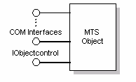  
Рис. 1. Интерфейсы объекта MTS
:::

Как было сказано ранее, компоненты MTS могут функционировать как
COM-объекты вне адресного пространства клиента (out-of-process server).
В этом случае клиентское приложение взаимодействует с созданным внутри
его адресного пространства proxy-объектом, передающим запросы клиента с
помощью вызовов удаленных процедур содержащемуся внутри адресного
пространства сервера stub-объекту, взаимодействующему с компонентом MTS
посредством его интерфейса. Информация о соединении содержится в
proxy-объекте. Последний может активизировать и деактивировать
MTS-объект, отдавая ресурсы другим клиентам, нуждающимся в данном
сервисе, незаметно для клиента.

Компоненты MTS могут также функционировать как внутренние серверы
автоматизации (in-process-сервер). В этом случае их удаленный запуск
исключен.

Серверный объект MTS должен иметь стандартную фабрику классов и
библиотеку типов (они автоматически создаются при использовании MTS
Object wizard). Можно редактировать библиотеку типов, добавляя свойства
и методы (в дальнейшем они будут использованы MTS Explorer для получения
сведений о его объектах на этапе выполнения). Помимо этого, компонент
должен экспортировать функцию DllRegisterServer и осуществлять
саморегистрацию его CLSID (идентификаторов класса сервиса), ProgID
(идентификаторов сервера), интерфейсов, библиотеки типов (MTS Object
wizard автоматически генерирует соответствующий код).

Если предполагается коллективное использование серверного объекта, он не
должен хранить внутри себя сведения о состоянии данных, связанных с
конкретным клиентом (для этого используются термины "stateless code" и
"stateless object"). Пример создания такого кода будет рассмотрен
ниже.

## 4. Пример 1: создание простейшего серверного объекта

**Предварительная подготовка**

Прежде чем приступить к созданию серверных объектов, предназначенных для
работы под управлением MTS, следует убедиться в том, что сам MTS и
Delphi 4 установлены корректно. Во-первых, NT Option Pack, содержащий
MTS, следует обязательно установить до установки Delphi. Тогда в
процессе установки Delphi при обнаружении инсталляционной программой
установленной копии MTS в него будет добавлен специальный "пакет"
(package) BDE-MTS, содержащий объект BdeMTSDispenser (его можно
обнаружить с помощью MTS Explorer, рис. 2).

:::{.center}
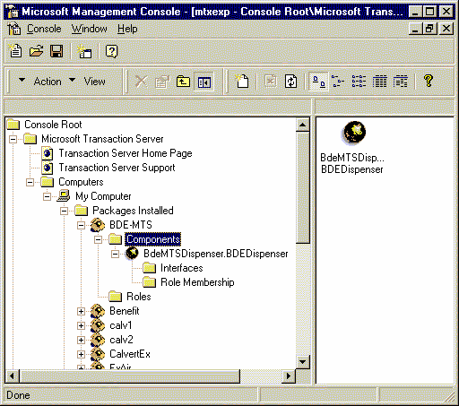  
Рис. 2. BdeMTSDispenser, зарегистрированный в Microsoft Transaction
Server
:::

Следует также убедиться, что данный объект поддерживает транзакции. C
этой целью нужно из контекстного меню объекта BDEDispenser выбрать опцию
Properties и в появившейся диалоговой панели выбрать закладку
Transaction (рис. 3):

:::{.center}
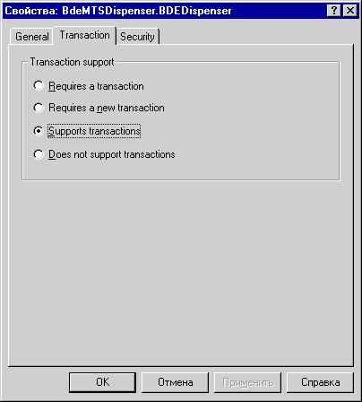  
Рис. 3. Установка поддержки транзакций объектом MTS.
:::

Далее следует запустить BDE Administrator, открыть страницу
Configuration, выбрать раздел System/Init и установить значение
параметра MTS POOLING равным TRUE. Только при этом значении данного
параметра возможна поддержка транзакций и коллективное использование
соединений с базами данных, доступных с помощью BDE (рис. 4).

:::{.center}
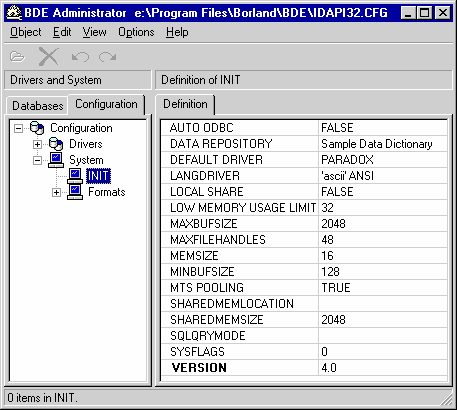  
Рис. 4. Установка опции MTS POOLING для коллективного использования
соединений с базами данных
:::

Для выполнения описанных ниже примеров следует создать три таблицы в
трех разных базах данных. Первая из них требует наличия сервера IB
Database (он входит в комплект поставки Delphi 4) и должна быть создана
в базе данных IBLOCAL с помощью следующего скрипта:

    CREATE TABLE STOCKTABLE (
      GOODSNAME CHAR(30),
      PRICE FLOAT,
      GOODSNUMBER INTEGER NOT NULL)

В этой таблице будут содержаться сведения о товарах на складе (название,
цена, порядковый номер, являющийся также первичным ключом этой таблицы).

Для генерации первичных ключей в этой таблице создадим также генератор:

    CREATE GENERATOR GEN1;
    SET GENERATOR GEN1 TO 5

Можно ввести в таблицу какие-либо данные (рис. 5):

:::{.center}
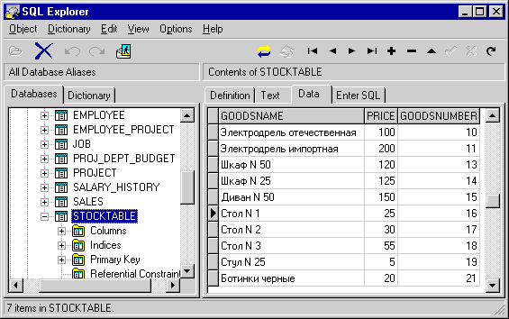  
Рис. 5. Таблица STOCKTABLE, созданная на сервере IB Database
:::

Следующую таблицу создадим в формате Paradox (например, с помощью
Database Desktop) и поместим в базу данных DBDEMOS, поставляемую вместе
с Delphi. Структура этой таблицы приведена на рис. 6.

:::{.center}
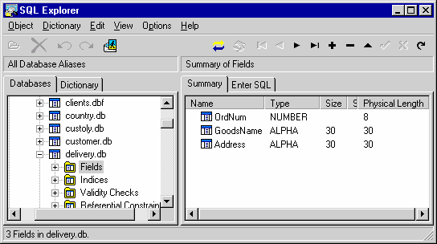  
Рис. 6. Структура таблицы delivery.db
:::

В этой таблице будут храниться данные о заказах на доставку товаров со
склада (номер позиции на складе, название товара, адрес доставки).

И, наконец, третья таблица формата dBase должна быть создана в
произвольном каталоге, и этот каталог должен быть описан как псевдоним
PAYDB (рис. 7):

:::{.center}
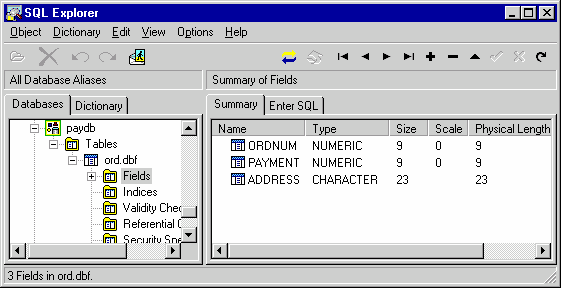  
Рис. 7. структура таблицы ord.dbf
:::

В этой таблице будут содержаться сведения об оплате за заказы (номер
позиции на складе, стоимость товара, адрес для высылки счета).

Распределенные транзакции при использовании этих таблиц будут описывать
выбор товара на складе и оформление заказа на доставку. При этом в
таблице заказов выбранная запись удаляется, и при этом в двух других
таблицах появляются по одной записи с тем же значением первичного ключа.

**4.2. Создание серверного объекта**

Для создания серверного объекта следует со страницы Multitier
репозитария объектов выбрать пиктограмму MTS Data Module (рис. 8).

:::{.center}
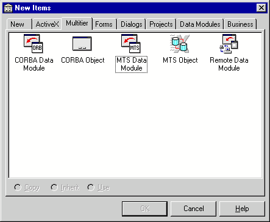  
Рис. 8. Выбор MTS Data Module из репозитария объектов.
:::

Далее в появившейся диалоговой панели MTS Data Module Wizard следует
ввести имя класса и выбрать способ работы с транзакциями (рис. 9).

:::{.center}
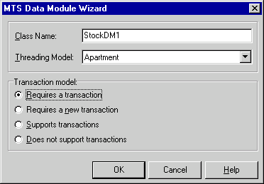  
Рис. 9. MTS Data Module Wizard
:::

После этого будет сгенерирована стандартная библиотека типов, связанная
с созданным модулем данных.

В созданный модуль данных поместим один компонент TSession, один
компонент TDatabase, один компонент TProvider, один компонент TTable,
два компонента TQuery (рис. 10):

:::{.center}
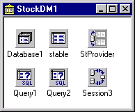  
Рис. 10. Модуль данных серверного объекта StockDM1, управляющего
таблицей STOCKTABLE
:::

Свойство AutoSessionName компонента TSession установим равным True.
Свойство SessionName компонента TDatabase установим равным имени
компонента TSession (это делается для того, чтобы не было конфликтов
между именами различных пользовательских сессий внутри процесса MTS при
создании нескольких однотипных объектов). Свяжем компонент TDatabase с
псевдонимом IBLOCAL, установив его свойство LoginPrompt равным False
(вполне очевидно, что в серверном объекте диалог ввода пароля появляться
не должен - ведь клиентское приложение, использующее его, может
находиться на удаленном компьютере, рис. 11).

:::{.center}
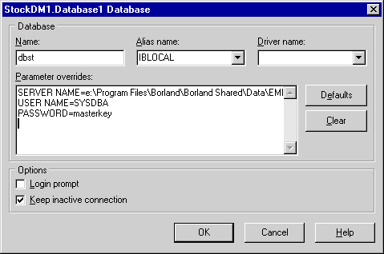  
Рис. 11. Параметры компонента TDatabase серверного объекта StockDM1
:::

Свяжем компоненты TTable и TQuery с компонентом TDatabase, и в качестве
значения свойства TableName выберем имя вновь созданной таблицы
STOCKTABLE. Свяжем компонент TProvider с компонентом TTable.

Далее установим значения свойств SQL компонентов TQuery:

    insert into STOCKTABLE values(:a,:b,GEN_ID(GEN1,1))

и

    delete from STOCKTABLE where GOODSNUMBER=:C

Первое из SQL-предложений добавляет запись в таблицу STOCKTABLE с
автоматической генерацией первичного ключа. Второе удаляет запись на
основе значения первичного ключа.

Обратите внимание: ни компонент TTable, ни компонент TProvider не
следует экспортировать из модуля данных. Причина этого заключается в
том, что подобные экспортированные объекты хранят состояние данных, с
которыми работает конкретное клиентское приложение, поэтому при
коллективном использовании таких объектов могут возникнуть коллизии. По
этой причине сведения о состоянии данных для конкретных клиентов
хранятся менеджером разделяемых свойств MTS (MTS shared property
manager), а в модулях данных между вызовами методов эти сведения
присутствовать не должны. Поэтому вместо экспорта объектов из модуля
данных мы создадим метод GetGoods, предоставляющий эти данные
клиентскому приложению по его запросу.

После этого можно отредактировать библиотеку типов. Добавим к ней методы
GetGoods для передачи клиентскому приложению содержимого таблицы и
методы AddGoods и DeleteGoods для выполнения запросов, содержащихся в
компонентах TQuery (рис. 12):

:::{.center}
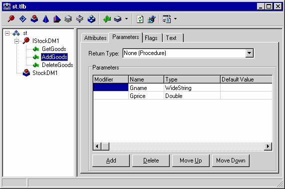  
Рис. 12. Библиотека типов серверного объекта
:::

Реализация созданных методов приведена ниже:

    unit st1;
    //Simple MTS server
    //By N.Elmanova
    //01.12.1998
     
    interface
     
    uses
      Windows, Messages, SysUtils, Classes, Graphics, Controls, Forms, Dialogs,
      ComServ, ComObj, VCLCom, StdVcl, BdeProv, BdeMts, DataBkr, DBClient,
      MtsRdm, Mtx, st_TLB, DBTables, Provider, Db;
     
    type
      TStockDM1 = class(TMtsDataModule, IStockDM1)
        stable: TTable;
        StProvider: TProvider;
        Database1: TDatabase;
        Query1: TQuery;
        Query2: TQuery;
        Session3: TSession;
      private
        { Private declarations }
      public
        { Public declarations }
      protected
        function GetGoods: OleVariant; safecall;
        procedure AddGoods(const Gname: WideString; Gprice: Double); safecall;
        procedure DeleteGoods(Gnumber: Integer); safecall;
      end;
     
    var
      StockDM1: TStockDM1;
     
    implementation
     
    {$R *.DFM}
     
    function TStockDM1.GetGoods: OleVariant;
    begin
      Result:=StProvider.Data;
      SetComplete;
    end;
    procedure TStockDM1.AddGoods(const Gname: WideString; Gprice: Double);
    begin
    try
      Database1.Open;
      Query1.Params[0].Value:=Gname;
      Query1.Params[1].Value:=Gprice;
      Query1.Prepare;
      Query1.ExecSQL;
      Database1.Сlose;
      SetComplete;
    except
      SetAbort;
      raise;
    end;
    end;
     
    procedure TStockDM1.DeleteGoods(Gnumber: Integer);
    begin
    try
      Database1.Open;
      Stable.open;
      Stable.SetRangeStart;
      Stable.Fields[2].AsInteger:=Gnumber;
      Stable.SetRangeEnd;
      Stable.Fields[2].AsInteger:=Gnumber;
      Stable.ApplyRange;
      Stable.Delete;
      Database1.Close;
      SetComplete;
    except
      SetAbort;
      raise;
    end;
    end;
     
    initialization
      TComponentFactory.Create(ComServer, TStockDM1,
        Class_StockDM1, ciMultiInstance, tmApartment);
    end.

Прокомментируем приведенный выше код. Напомним, что мы не экспортировали
компонент TProvider или компонент TTable из модуля данных, а вместо
этого создали метод GetGoods, предоставляющий клиентскому приложению
данные из таблицы динамически, позволяя не хранить сведения о состоянии
данных в серверном объекте. Метод GetGoods представляет собой так
называемый "stateless code", а сам модуль данных в этом случае
представляет собой так называемый "stateless object" (об этом было
рассказано выше). Именно отсутствие статических данных, связанных с
конкретным клиентом, позволит в дальнейшем сделать этот модуль данных
разделяемым ресурсом.

Вызов метода SetComplete внутри метода GetGoods означает, что модуль
данных более не нуждается в хранении информации о состоянии и может быть
деактивирован. Если модуль данных представляет собой одну из частей
распределенной транзакции (пока это не так, но чуть позже он станет
одной из таких частей), этот метод означает, что данная часть транзакции
может быть завершена (естественно, при условии, что все другие части
этой транзакции также могут быть завершены; в противном случае
произойдет откат транзакции, в том числе и данной части). Если же MTS
начинает транзакцию автоматически при создании модуля данных (опция
Requires a transaction), вызов метода SetComplete приведет к попытке ее
завершения.

Перед компиляцией проекта рекомендуется убедиться, что компоненты
TDatabase, TSession, TTable неактивны.

Далее следует выбрать из меню Delphi опцию Run/Install MTS Objects.
После этого следует выбрать или ввести имя "пакета" MTS (MTS package).
После этого объект окажется зарегистрированным в MTS (рис. 13):

:::{.center}
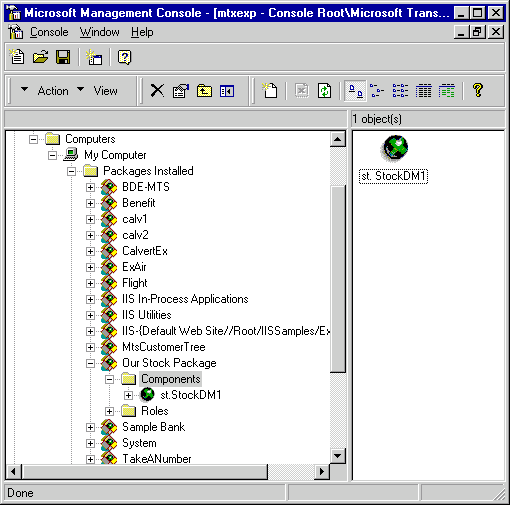  
Рис. 13. Серверный объект StockDM1, зарегистрированный в MTS
:::

Следует обратить внимание на то, что регистрировать серверный объект как
обычный COM-сервер не следует - в роли сервера с точки зрения реестра
для клиента в данном случае выступает MTS, а не созданная библиотека.

При попытках внесения неоднократных изменений в код серверного объекта и
запуска сервера с помощью собственно MTS или обращающихся к нему
клиентов могут возникнуть проблемы. В частности, может оказаться, что
при попытке компиляции библиотеки появляется сообщение о невозможности
создания выходного файла. Это может быть связано с тем, что какие-то
экземпляры объекта уже созданы в адресном пространстве MTS, поэтому файл
оказался заблокированным. В этом случае следует в MTS Explorer найти
соответствующий "пакет" и из его контекстного меню выбрать опцию Shut
down. Можно также выбрать в MTS Explorer раздел My Computer и из его
контекстного меню выбрать опцию Shut down server processes, прекратив
таким образом существование всех серверных объектов. Кроме того, можно
уменьшить время существования серверного объекта в неактивном состоянии.
Это делается с помощью выбора пункта контекстного меню Properties
соответствующего пакета и установкой необходимого значения свойства Shut
down after being idle for... на странице Advanced появившейся диалоговой
панели.

### 4.3. Создание клиентского приложения

Зарегистрировав созданный серверный объект в MTS, можно приступить к
созданию клиентского приложения. Добавим в имеющуюся программную группу
новый проект (или просто создадим новый проект). На главную форму
будущего приложения поместим компоненты TDCOMConnection, TClientDataSet,
TDataSourse, TDBGrid, два компонента TEdit, два компонента TLabel и три
кнопки (рис. 14)

:::{.center}
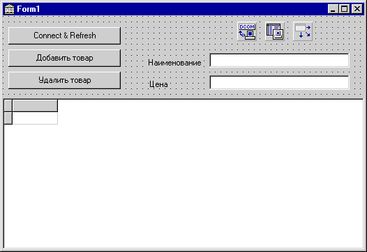  
Рис. 14. Клиентское приложение для тестирования серверного объекта
:::

В качестве свойства ServerName компонента TDCOMConnection выберем имя
только что созданного нами серверного объекта (оно будет доступно, если
объект зарегистрирован в MTS, и при его выборе свойство GUID будет
установлено автоматически). Если же клиент разрабатывается на удаленном
компьютере, следует заполнить свойства GUID и ComputerName, причем в
качестве свойства GUID следует выбирать не идентификатор сервера, а
идентификатор соответствующего класса объектов - так называемый CoClass
GUID. Причина этого очевидна - в общем случае динамически загружаемая
библиотека может содержать несколько классов серверных объектов.

Свяжем компонент TClientDataSet с компонентом TDCOMConnection, выбрав
его свойство RemoteServer из единственной позиции выпадающего списка.
Свойство ProviderName оставим пустым - ведь при создании сервера мы не
экспортировали никаких объектов. Далее свяжем компонент TDataSource с
компонентом TClientDataSet, и, наконец, свяжем компонент TDBGrid с
компонентом TDataSource. Убедимся, что все невизуальные компоненты
неактивны - до возникновения реальной необходимости получить какие-либо
данные серверные объекты не должны быть созданы, поэтому установка
свойств Active или Connected должна быть произведена на этапе
выполнения.

Закончив проектирование формы, создадим обработчики событий, связанных с
нажатием на кнопки:

    unit stscl1;
    //Client of Simple MTS server
    //By N.Elmanova
    //01.12.1998
     
    interface
     
    uses
      Windows, Messages, SysUtils, Classes, Graphics, Controls, Forms, Dialogs,
      Db, DBClient, MConnect, Grids, DBGrids, StdCtrls;
     
    type
      TForm1 = class(TForm)
        Button1: TButton;
        DBGrid1: TDBGrid;
        DCOMConnection1: TDCOMConnection;
        ClientDataSet1: TClientDataSet;
        DataSource1: TDataSource;
        Button2: TButton;
        Button3: TButton;
        Label2: TLabel;
        Label1: TLabel;
        Edit1: TEdit;
        Edit2: TEdit;
        procedure Button1Click(Sender: TObject);
        procedure Button2Click(Sender: TObject);
        procedure Button3Click(Sender: TObject);
      private
        { Private declarations }
      public
        { Public declarations }
      end;
     
    var
      Form1: TForm1;
     
    implementation
     
    {$R *.DFM}
     
    procedure TForm1.Button1Click(Sender: TObject);
     
     
    begin
     DCOMConnection1.Connected:=True;
     ClientDataSet1.Data:=DCOMConnection1.AppServer.GetGoods;
    end;
    procedure TForm1.Button2Click(Sender: TObject);
    begin
    try
     DCOMConnection1.AppServer.AddGoods(Edit1.Text,
     StrToInt(Edit2.Text));
    Except
     ShowMessage('Не могу добавить запись');
    end;
     end;
     
    procedure TForm1.Button3Click(Sender: TObject);
    var recnum:integer;
    begin
    recnum:=ClientDataSet1.FieldByName('GOODSNUMBER').Value;
    try
     DCOMConnection1.AppServer.DeleteGoods(recnum);
    except
     ShowMessage('Не могу удалить запись');
    end;
    end;
     
    end.

Запустив клиентское приложение, протестируем сервер, попытавшись
добавить или удалить записи (заодно проверим правильность текста
созданных нами SQL-запросов). Обратите внимание: для контроля изменений
в базе данных следует нажимать на кнопку Connect & Refresh - обработчик
соответствующего события вызывает серверный метод, выполняющий выгрузку
данных из таблицы и передачу их клиентскому приложению (рис. 15):

:::{.center}
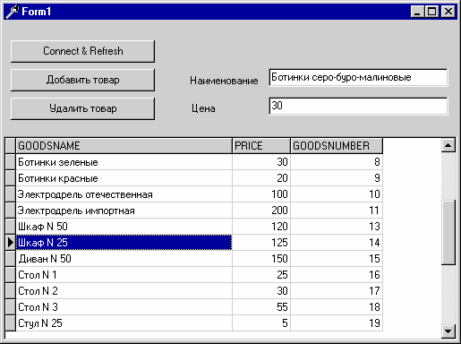  
Рис. 15. Тестирование серверного объекта
:::
 

## 5. Отладка серверных объектов MTS

Отладка серверных объектов MTS может быть осуществлена при наличии
клиента, вызывающего отлаживаемые методы.

Для отладки серверного объекта следует открыть его в среде разработки,
установить необходимые точки прерывания в его исходном тексте и выбрать
из меню Delphi опцию Run/Parameters. Затем в строке Host application
нужно указать местоположение исполняемого файла mtx.exe, например:

    c:\winnt\system32\mtx.exe

(на Вашем компьютере это местоположение может быть другим). В строке
Parameters следует указать имя "пакета", в котором установлен данный
объект:

    /p:"Our Stock Package"

Обратите внимание: между двоеточием и кавычками не должно быть пробела
(рис. 16):

:::{.center}
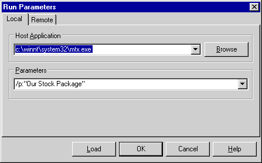  
Рис. 16. Натройка параметров запуска для отладки серверного объекта
:::

Далее следует выбрать из меню опцию Run/Run. После этого можно запустить
на выполнение клиентское приложение и вызывать из него отлаживаемые
методы.

При попытке запуска сервера таким образом могут возникнуть следующие
проблемы. Во-первых, может оказаться, что какие-то экземпляры объекта
уже созданы в адресном пространстве MTS, и в этом случае, скорее всего,
просто не получится запустить его в среде Delphi (или даже просто
создать выходной файл).. В этом случае следует в MTS Explorer найти
соответствующий "пакет" и из его контекстного меню выбрать опцию Shut
down.

Иногда отладочные операции не выполняются, если отлаживаемый серверный
объект должен выполняться в адресном пространстве клиента (опция Library
Package страницы Activation диалоговой панели Properties "пакета"). В
этом случае в поле Host application диалоговой панели Run/Parameters
можно попытаться указать имя клиентского приложения.

Отметим, что, если клиентское приложение после старта серверного объекта
не будет запущено, MTS может уничтожить созданный экземпляр серверного
объекта по истечении времени существования объектов, определенных для
данного "пакета". По умолчанию оно равно 3 минутам, и может быть
изменено с помощью опции Shut down after being idle for... страницы
Advanced диалоговой панели Properties "пакета".

## 6. Пример 2: создание объектов для управления распределенными транзакциями

### 6.1. Создание серверных объектов для реализации распределенной транзакции

Теперь создадим второй объект для управления созданной ранее в базе
данных DBDEMOS таблицей delivery.db. Закроем все открытые проекты и
создадим новый серверный объект, такой же, как и предыдущий (рис. 17):

:::{.center}
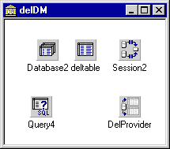  
Рис. 17. Серверный объект DelDM для управления таблицей delivery.db
:::

В отличие от предыдущего случая компонент TDatabase свяжем с базой
данных DBDEMOS (рис. 18):

:::{.center}
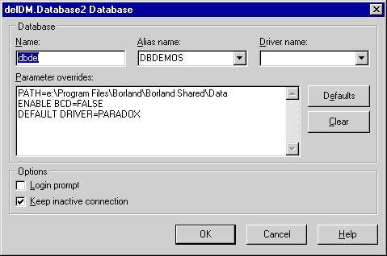  
Рис. 18. Свойства компонента TDatabase серверного объекта delDM
:::

В качестве свойства SQL компонента TQuery используем следующее
SQL-предложение:

    delete from delivery where OrdNum=:d

Затем отредактируем библиотеку типов, добавив три метода GetDelivery,
AddDeliery и DelDelivery для получения данных из таблицы, добавления и
удаления записи (рис. 19):

:::{.center}
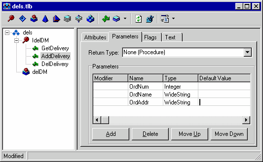  
Рис. 19. Библиотека типов серверного объекта, управляющего таблицей
delivery.db
:::

Реализация этих методов имеет следующий вид:

    unit del1;
    //Another simple MTS server
    //By N.Elmanova
    //01.12.1998
     
    interface
     
    uses
      Windows, Messages, SysUtils, Classes, Graphics, Controls, Forms, Dialogs,
      ComServ, ComObj, VCLCom, StdVcl, BdeProv, BdeMts, DataBkr, DBClient,
      MtsRdm, Mtx, dels_TLB, DBTables, Provider, Db;
     
    type
      TdelDM = class(TMtsDataModule, IdelDM)
        deltable: TTable;
        DelProvider: TProvider;
        Database2: TDatabase;
        Query4: TQuery;
        Session2: TSession;
      private
        { Private declarations }
      public
        { Public declarations }
      protected
        function GetDelivery: OleVariant; safecall;
        procedure AddDelivery(OrdNum: Integer; const  OrdName: WideString; const OrdAddr: WideString);
          safecall;
        procedure DelDelivery(OrdNum: Integer); safecall;
      end;
     
    var
      delDM: TdelDM;
     
    implementation
     
    {$R *.DFM}
     
    function TdelDM.GetDelivery: OleVariant;
    begin
    Result:=DelProvider.Data;
    SetComplete;
    end;
     
    procedure TdelDM.AddDelivery(OrdNum: Integer; 
    const OrdName: WideString; const  OrdAddr: WideString);
    begin
    try
        deltable.open;
        deltable.append;
        deltable.fieldbyname('OrdNum').Value:=OrdNum;
        deltable.fieldbyname('GoodsName').Value:=OrdName;
        deltable.fieldbyname('Address').Value:=OrdAddr;
        deltable.post;
        deltable.close;
        SetComplete;
    except
       SetAbort;
    raise;
    end;
    end;
     
    procedure TdelDM.DelDelivery(OrdNum: Integer);
    begin
    try
      database2.open;
      deltable.open;
      deltable.SetRangeStart;
      deltable.FieldByName('OrdNum').AsInteger:=OrdNum;
      deltable.SetRangeEnd;
      deltable.FieldByName('OrdNum').AsInteger:=OrdNum;
      deltable.ApplyRange;
      deltable.Delete;
      deltable.close;
      database2.close;
    except
      SetAbort;
    raise;
    end;
    end;
    initialization
      TComponentFactory.Create(ComServer, TdelDM,
        Class_delDM, ciMultiInstance, tmApartment);
    end.

Скомпилируем и установим данный объект в тот же "пакет", что и
предыдущий.

Рекомендуется протестировать данный объект, создав клиентское
приложение, более или менее аналогичное предыдущему. При тестировании
следует помнить, что в этой таблице есть уникальный первичный ключ,
поэтому при вводе записей с одинаковым значением поля OrdNum транзакции
завершаться не будут.

И, наконец, создадим третий серверный объект, который будет управлять
распределенными транзакциями и с этой целью порождать два предыдущих
серверных объекта внутри своих транзакций. Вначале создадим объект,
аналогичный двум предыдущим (рис. 20):

    delete from ord where ordnum=:d

:::{.center}
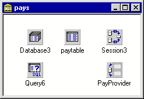  
Рис. 20. Модуль данных серверного объекта pays для управления таблицей
ord.dbf
:::

Теперь компонент TDatabase свяжем с созданной нами базой данных dbpay,
содержащей таблицу ord.dbf (с ней мы свяжем компонент TTable, рис. 21):

:::{.center}
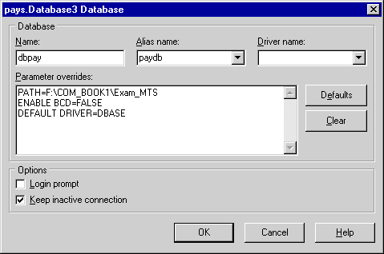  
Рис. 21. Свойства компонента TDatabase серверного объекта, управляющего
распределенными транзакциями
:::

Значение свойства SQL компонента TQuery будет выглядеть следующим образом:

    delete from ord where ordnum=:d

Теперь добавим в проект библиотеки типов двух созданных ранее серверов.
Для этого следует выбрать из меню Delphi опцию Project/Import type
library, нажать кнопку Add и выбрать соответствующий файл с расширением
*.tlb (рис. 22):

:::{.center}
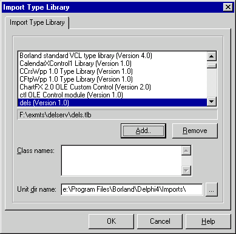  
Рис. 22. Импорт библиотек типов серверных объектов - участников
распределенной транзакции
:::

Далее отредактируем библиотеку типов данного серверного объекта, создав
методы GetPays. AddPay, DelPay для доставки данных клиентскому
приложению, добавления и удаления записей, а также метод DoTrans,
реализующий распределенную транзакцию (удаление записи о выбранном
товаре из таблицы STOCKTABLE в базе данных IBLOCAL и добавление по одной
записи в таблицу заказов на доставку delivery.db в базе данных DBDEMOS и
в таблицу счетов за заказы ord.dbf в базе данных paydb, рис. 23).

:::{.center}
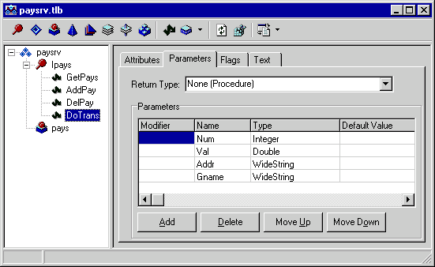  
Рис. 23. Библиотека типов серверного объекта, управляющего
распределенными транзакциями
:::

Реализация этих методов имеет следующий вид:

    unit pay1;
    //MTS server for managing distributed transactions
    //By N.Elmanova
    //04.12.1998
     
    interface
     
    uses
      Windows, Messages, SysUtils, Classes, Graphics, Controls, Forms, Dialogs,
      ComServ, ComObj, VCLCom, StdVcl, BdeProv, BdeMts, DataBkr, DBClient,
      MtsRdm, Mtx, paysrv_TLB, dels_TLB, st_TLB, DBTables, Provider, Db;
     
    type
      Tpays = class(TMtsDataModule, Ipays)
        paytable: TTable;
        PayProvider: TProvider;
        Database3: TDatabase;
        Query6: TQuery;
        Session3: TSession;
        Query5: TQuery;
     private
     FStockDM1: IStockDM1;
     FDelDM: IDelDM;
        { Private declarations }
      public
        { Public declarations }
      protected
        function GetPays: OleVariant; safecall;
        procedure AddPay(Pnum: Integer; Pval: Double; const Address: WideString);
          safecall;
        procedure DelPay(Pnum: Integer); safecall;
        procedure DoTrans(Num: Integer; Val: Double; const Addr,
          Gname: WideString); safecall;
      end;
     
    var
      pays: Tpays;
     
    implementation
     
    {$R *.DFM}
     
    function Tpays.GetPays: OleVariant;
    begin
         Result:=PayProvider.Data;
         SetComplete;
    end;
     
    procedure Tpays.AddPay(Pnum: Integer; Pval: Double;
      const Address: WideString);
    begin
    try
        paytable.open;
        paytable.append;
        paytable.fieldbyname('OrdNum').Value:=PNum;
        paytable.fieldbyname('Payment').Value:=Pval;
        paytable.fieldbyname('Address').Value:=Address;
        paytable.post;
        paytable.close; 
        SetComplete;
    except
        SetAbort;
    end;
    end;
     
    procedure Tpays.DelPay(Pnum: Integer);
    begin
    try
      Database3.Open;
      paytable.Open;
      paytable.SetRangeStart;
      paytable.FieldByName('ordnum').AsInteger:=Pnum;
      paytable.SetRangeEnd;
      paytable.FieldByName('ordnum').AsInteger:=Pnum;
      paytable.ApplyRange;
      paytable.Delete;
      paytable.Close;
      Database3.Close;
      SetComplete;
    except
      SetAbort;
    raise;
    end;
    end;
     
    procedure Tpays.DoTrans(Num: Integer; Val: Double; const Addr,
      Gname: WideString);
    begin
    try
      OleCheck(ObjectContext.CreateInstance(CLASS_StockDM1, IStockDM1, FStockDM1));
      OleCheck(ObjectContext.CreateInstance(CLASS_DelDM, IDelDM, FDelDM));
      FStockDM1.DeleteGoods(Num);
      FDelDM.AddDelivery(Num,Gname,Addr);
      AddPay(Num,Val,Addr);
    except
      DisableCommit;
    raise;
    end;
      EnableCommit;
    end;
    initialization
      TComponentFactory.Create(ComServer, Tpays,
        Class_pays, ciMultiInstance, tmApartment);
    end.

Прокомментируем приведенный выше код для метода DoTrans. Этот код
реализует распределенную транзакцию, вызывая методы двух порожденных ей
серверных объектов и выполняя собственные манипуляции с таблицей счетов.
При вызове метода DoTrans клиентским приложением все три серверных
объекта функционируют согласованно.

В начале выполнения создается так называемый контекст транзакции -
интерфейс ITransactionContextEx. Этот интерфейс контролирует выполнение
транзакции и обладает методами CreateInstance (создание экземпляра
порожденного объекта), Commit (завершение транзакции) и Abort (откат
транзакции). Отметим, что если для порождения серверного объекта MTS
клиентским приложением используется компонент TDCOMConnection, то для
порождения серверного объекта другим серверным объектом используется
вызов метода CreateInstance интерфейса ITransactionContextEx.
Параметрами этого метода являются CLSID объекта, интерфейс объекта и
указатель на объект (возвращаемый параметр).

Далее следуют вызовы методов порожденных серверных объектов и
собственные манипуляции с данными. Если все операции были успешны,
транзакция завершена, и может быть выполнен метод Commit интерфейса
ITransactionContextEx. Если же операции были неуспешны, и в одном или
обоих порожденных серверах либо во время собственных манипуляций с
данными возникнут исключения (например, другой пользователь уже удалил
запись из списка товаров, сделав заказ, или какая-то из таблиц
заблокирована), будет вызван метод Abort.

Для тестирования распределенных транзакций установим все три серверных
объекта в один и тот же "пакет" (рис. 24):

:::{.center}
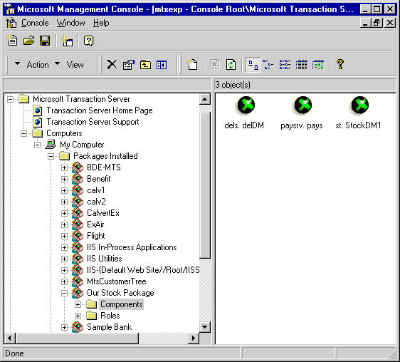  
Рис. 24. Серверные объекты, участвующие в распределенной транзакции
:::

**6.2. Создание клиентского приложения, использующего распределенные транзакции**

Для тестирования созданного ранее сервера и инициации распределенных
транзакций создадим клиентское приложение, имитирующее процесс
оформления заказов. На главной форме приложения поместим кнопку с
надписью "Connect", три компонента TDCOMConnection, связанные с
соответствующими серверами, три компонента TClientDataSet, связанные с
соответствующими компонентами TDCOMConnection, три компонента
TDataSource, связанные с компонентами TClientDataSet и блокнот из двух
страниц. На одной из страниц блокнота разместим компонент TDBGrid,
отображающий данные из таблицы со списком товаров на складе, компонент
TEdit для ввода пользователем адреса доставки, и кнопку для
инициирования транзакции - принятия заказа. На второй странице поместим
два компонента TDBGrid для отображения данных из двух других таблиц и
компонент TSplitter между ними (рис. 25):

:::{.center}
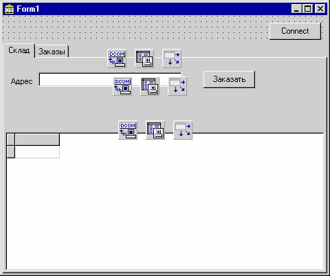  
Рис. 25. Клиентское приложение для тестирования распределенных
транзакций
:::

Создадим обработчики событий, связанных с нажатием на кнопки:

    unit allcl1;
    //Client application for using distributed transactions
    //By N.Elmanova
    //05.12.1998
     
    interface
     
    uses
      Windows, Messages, SysUtils, Classes, Graphics, Controls, Forms, Dialogs,
      Grids, DBGrids, Db, DBClient, StdCtrls, MConnect, ExtCtrls, ComCtrls;
     
    type
      TForm1 = class(TForm)
        PageControl1: TPageControl;
        TabSheet1: TTabSheet;
        TabSheet2: TTabSheet;
        DCOMConnection1: TDCOMConnection;
        ClientDataSet1: TClientDataSet;
        DataSource1: TDataSource;
        DBGrid1: TDBGrid;
        Edit1: TEdit;
        Label1: TLabel;
        Button1: TButton;
        DBGrid2: TDBGrid;
        DBGrid3: TDBGrid;
        Splitter1: TSplitter;
        DCOMConnection2: TDCOMConnection;
        ClientDataSet2: TClientDataSet;
        DataSource2: TDataSource;
        DCOMConnection3: TDCOMConnection;
        ClientDataSet3: TClientDataSet;
        DataSource3: TDataSource;
        Button2: TButton;
        procedure Button1Click(Sender: TObject);
        procedure Button2Click(Sender: TObject);
      private
        { Private declarations }
      public
        { Public declarations }
      end;
     
    var
      Form1: TForm1;
     
    implementation
     
    {$R *.DFM}
     
    procedure TForm1.Button1Click(Sender: TObject);
    var n:integer;val:double;gnam,addr:widestring;
    begin
    try
     n:= ClientDataSet1.FieldByName('GOODSNUMBER').Value;
     val:= ClientDataSet1.FieldByName('PRICE').Value;
     gnam:= ClientDataSet1.FieldByName('GOODSNAME').Value;
     addr:=Edit1.Text;
     DcomConnection2.Connected:=true;
     DCOMConnection2.AppServer.DoTrans(n,val,addr,gnam);
     ShowMessage('Заказ принят');
    except
     ShowMessage('Заказ не принят ');
    end;
    DcomConnection2.Connected:=false;
    end;
     
    procedure TForm1.Button2Click(Sender: TObject);
    begin
    DCOMConnection1.Connected:=true;
    DCOMConnection2.Connected:=true;
    DCOMConnection3.Connected:=true;
    CLientdataset1.data:=Dcomconnection1.Appserver.GetGoods;
    CLientdataset2.data:=Dcomconnection2.Appserver.GetPays;
    CLientdataset3.data:=Dcomconnection3.Appserver.GetDelivery;
    DCOMCOnnection1.Connected:=false;
    DCOMCOnnection2.Connected:=false;
    DCOMCOnnection3.Connected:=false;
    end;
    end.

Для тестирования распределенных транзакций запустим приложение. Введем
адрес в компонент TEdit, выберем строку в списке товаров и нажмем на
кнопку "Заказать" (рис. 26).

:::{.center}
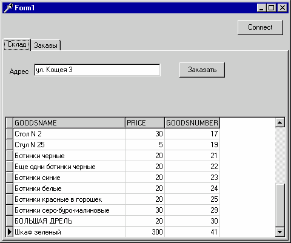  
Рис. 26. Тестирование распределенной транзакции
:::

В результате получим сообщение о том, что заказ принят

Нажав на кнопку Connect, обновим данные в компонентах TDBGrid. При этом
запись, выбранная ранее, исчезнет, а в двух других компонентах TDBGrid
появятся две новых (рис. 27):

:::{.center}
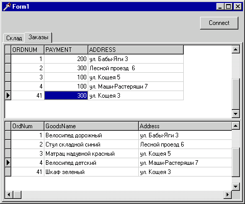  
Рис. 27. Результат выполнения распределенной транзакции
:::

Отметим, что, если не нажать на кнопку Connect, данные в компонентах
TDBGrid останутся прежними (в данном примере не предусмотрено обновление
данных после выполнения транзакции), у пользователя есть возможность
попытаться повторно выбрать для заказа уже выбранную ранее запись (то
есть заказать товар, заказ на который уже оформлен). В этом случае один
из трех серверных объектов будет пытаться удалить уже удаленную запись
(если вспомнить текст соответствующего SQL-запроса, она идентифицируется
значением первичного ключа), и в этом случае соответствующая часть
транзакции не завершится. Соответственно, произойдет откат назад всей
распределенной транзакции.

Сведения о завершенных и отмененных транзакциях можно получить, выбрав в
MTS Explorer опцию Transaction Statistics (рис. 28):

:::{.center}
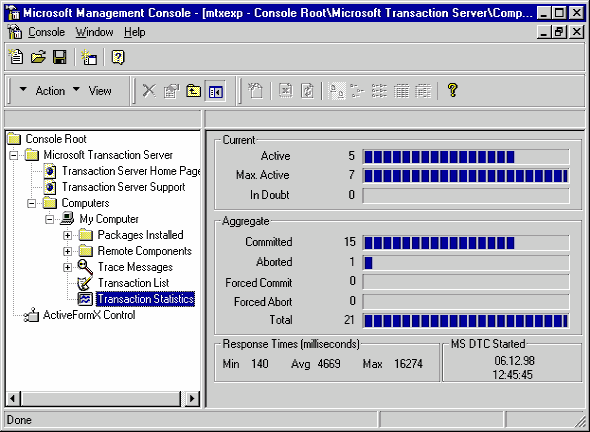  
Рис. 28. Просмотр статистики выполнения и отката распределенных
транзакций
:::

Если вспомнить, что первичные ключи в нашей таблице товаров создаются с
использованием генератора, созданного нами на сервере IB Database,
становится очевидным, что создаваемые в этой таблице новые записи будут
иметь значения первичного ключа, не совпадающие со значениями первичных
ключей уже удаленных записей. Поэтому вероятность коллизий, связанных с
удалением не той записи, в данном случае равна нулю.

Отметим, однако, что при создании подобного рода серверных объектов и их
клиентов следует всегда пытаться исключить возможность ошибочных
действий пользователя, поэтому более корректным было бы иметь следующий
обработчик события, связанного с нажатием на кнопку "Заказать":

    procedure TForm1.Button1Click(Sender: TObject);
    var n:integer;val:double;gnam,addr:widestring;
    begin
    try
     n:= ClientDataSet1.FieldByName('GOODSNUMBER').Value;
     val:= ClientDataSet1.FieldByName('PRICE').Value;
     gnam:= ClientDataSet1.FieldByName('GOODSNAME').Value;
     addr:=Edit1.Text;
     DcomConnection2.Connected:=true;
     DCOMConnection2.AppServer.DoTrans(n,val,addr,gnam);
     ShowMessage('Заказ принят');
     Button2Click(self);
    except
     ShowMessage('Заказ не принят ');
    end;
    DcomConnection2.Connected:=false;
    end;

Отметим также, что при нажатии на кнопку "Заказать" в случае
отсутствия данных в компонентах TDBGrid в клиентском приложении
возникнет исключение, связанное с отсутствием нужного поля в компоненте
TClientDataSet. Следовательно, данная кнопка в такой ситуации должна
быть невыбираемой. Поэтому установим значение ее свойства Enabled равным
False и перепишем обработчик события,связанного с нажатием на кнопку
Connect::

    procedure TForm1.Button2Click(Sender: TObject);
    begin
    try
     DCOMCOnnection1.Connected:=true;
     DCOMCOnnection2.Connected:=true;
     DCOMCOnnection3.Connected:=true;
     CLientdataset1.data:=Dcomconnection1.Appserver.GetGoods;
     CLientdataset2.data:=Dcomconnection2.Appserver.GetPays;
     CLientdataset3.data:=Dcomconnection3.Appserver.GetDelivery;
     Button1.Enabled:=true;
    except
     Button1.Enabled:=false;
     ShowMessage('Один из серверных объектов недоступен');
    end;
    DCOMCOnnection1.Connected:=false;
    DCOMCOnnection2.Connected:=false;
    DCOMCOnnection3.Connected:=false;
    end;

Итак, мы создали три серверных объекта, реализующих распределенную
транзакцию, связанную с удалением записи из одной таблицы и добавлением
записи в две другие таблицы, и клиентское приложение, инициирующее
выполнение таких транзакций. Следует обратить внимание на то, что
таблицы, участвующие в транзакции, содержатся в трех физически разных
базах данных.

Итак, на примере Delphi 4 и Microsoft Transaction Server мы рассмотрели
возможность и способы использования технологий COM и COM+ для
организации распределенных вычислений и управления распределенными
транзакциями.

Следующая статья данного цикла будет посвящена другой технологии,
используемой при организации распределенных вычислений - DCE
(Distributed Computing Environment), и ее реализации в
многоплатформенном сервере приложений Inprise Entera.
