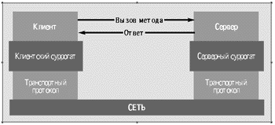
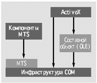
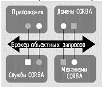

СОМ или CORBA
=============

::: {.date}
01.01.2007
:::

Прикладные компоненты - самостоятельные блоки программного кода,
которые реализуют определенную бизнес-логику, распределены по сети и
могут быть использованы многократно - завоевывают все большую
популярность в качестве строительных блоков для создания сложных
распределенных приложений. Отсюда - пристальное внимание к базовым
объектным архитектурам для создания распределенных объектных программных
систем.

Таковых на сегодняшний день, фактически, две: компонентная объектная
модель Component Object Model (COM), разработанная корпорацией
Microsoft, и общая архитектура брокеров объектных запросов Common Object
Request Broker Architecture (CORBA), которую развивает Консорциум OMG.
Цель этой статьи - познакомить читателя с историей возникновения и
развития конкурирующих объектных моделей и попытаться предложить
параллельное описание их архитектур и основных возможностей, которые СОМ
и CORBA предоставляют разработчикам распределенных корпоративных систем.

## Oсновные архитектурные принципы

Основное назначение CORBA и COM - поддержка разработки и развертывания
сложных объектно-ориентированных прикладных систем.

Для чего нужны эти модели? Любого отдельно взятого
объектно-ориентированного языка недостаточно для написания
распределенных вычислительных систем. Очень часто различные компоненты
программной системы требуют реализации на разных языках и, возможно,
разных аппаратных платформах. С помощью объектных моделей множество
объектов приложения, в том числе и на различных платформах,
взаимодействуют друг с другом и реализуют бизнес-процессы, создавая
видимость единого целого.

Функции CORBA и COM - это функции промежуточного программного
обеспечения объектной среды. Для того чтобы обеспечить взаимодействие
объектов и их интеграцию в цельную систему, архитектура промежуточного
уровня должна реализовать несколько базовых принципов.

- Независимость от физического размещения объекта. Компоненты программного обеспечения не обязаны находиться в одном исполняемом файле, выполняться в рамках одного процесса или размещаться на одной аппаратной системе.
- Независимость от платформы. Компоненты могут выполняться на различных аппаратных и операционных платформах, взаимодействуя друг с другом в рамках единой системы.
- Независимость от языка программирования. Различия в языках, которые используются при создании компонентов, не препятствуют их взаимодействию друг с другом.

CORBA и COM во многом различны, однако сходны в том, каким образом в них
достигается реализация этих принципов. Это клиент-серверные технологии,
в которых функциональность объекта предоставляется клиенту посредством
обращения к абстрактным интерфейсам. Интерфейс определяет набор методов,
которые реализуют функции, присущие данному классу объектов. Интерфейс
дает клиенту возможность только вызывать тот или иной метод, скрывая от
него все детали его реализации.

:::{.center}
  
Рис.1. Механизм вызова удаленной процедуры
:::

Клиент получает доступ к объекту только путем вызова метода,
определенного в интерфейсе объекта. Это означает, что реальные действия
выполняются в адресном пространстве объекта, возможно, удаленном по
отношению к процессу клиента. Сокрытие деталей реализации и позволяет в
конечном итоге добиться слаженного взаимодействия компонентов в
независимости от того, где и на какой платформе они реализованы и какой
язык программирования для этого использовался.

В обеих технологиях взаимодействие между клиентским процессом и сервером
объекта, то есть процессом, который порождает и обслуживает экземпляры
объекта, использует механизм объектный вариант вызова удаленной
процедуры (RPC, remote procedure call). На рис. 1 показана типичная
структура RPC - старейшей из технологий промежуточного программного
обеспечения. Механизм RPC реализует схему передачи сообщений, в
соответствии с которой в распределенном клиент-серверном приложении
процедура-клиент передает специальное сообщение с параметрами вызова по
сети в удаленную серверную процедуру, а результаты ее выполнения
возвращаются в другом сообщении клиентскому процессу.

Для того чтобы реализовать эту схему, на стороне клиента и на стороне
сервера поддерживаются специальные компоненты, носящие название
клиентский и серверный суррогаты (client stub и server stub). Для того
чтобы вызвать ту или иную функцию, клиент обращается к клиентскому
суррогату, который упаковывает аргументы в сообщение-запрос и передает
их на транспортный уровень соединения. Серверный суррогат распаковывает
полученное сообщение и в соответствии с переданными аргументами вызывает
нужную функцию, или нужный метод объекта, если речь идет об объектном
варианте RPC. В СОМ клиентский суррогат называется proxy, а серверный
--- stub. В CORBA клиентский суррогат не имеет специального названия, а
серверный обозначают термином skeleton.

Параметры вызова могут формироваться в отличной от серверной языковой и
операционной среде, поэтому на клиентский и серверный суррогаты
возлагаются функции преобразования аргументов и результатов в
универсальное, не зависящее от конкретной архитектуры представление. Тем
самым достигается возможность взаимодействия клиента и сервера на
различных платформах.

Строго говоря, рассуждая о вызове удаленных объектов и используя при
этом аббревиатуру СОМ, мы не вполне точны. Взаимодействие объектов на
разных узлах сети реализовано в расширенном варианте этой технологии,
Distributed COM (DCOM), который, в свою очередь, базируется на объектном
расширении спецификации DCE RPC. DCOM появилась в 1996 году вместе с
операционной системой Windows NT 4.0.

:::{.center}
  
Рис. 2. Архитектура Component
:::

## Object Model

Исходная же модель СОМ (рис. 2) была представлена Мicrosoft в 1993 году
как интеграционная схема для поддержки OLE, технологии построения
составных документов в ОС Windows 3.1. Первоначально инфраструктура СОМ
позволяла реализовывать компоненты, взаимодействующие в рамках одного
адресного пространства или между процессами на одном компьютере, и
представляла собой фактически средство динамической интеграции двоичных
компонентов. Помимо OLE, модель СОМ послужила основой таких технологий
Microsoft, как монитор транзакций Microsoft Transaction Server и
архитектура интеграции прикладных компонентов ActiveX.

В отличие от СОМ, архитектура CORBA [1,2] с самого начала создавалась
для распределенных объектных систем. Ее автором является не отдельно
взятая фирма, а консорциум Object Management Group (сейчас в него входят
более 800 компаний), поставивший своей целью разработать стандартную
архитектуру для взаимодействия объектов в неоднородной сетевой среде.

Среди компаний, основавших OMG, были в основном производители
компьютерных систем различного уровня и интеграторы с мировым именем,
такие, например, как IBM, DEC, HP. Проблема развертывания приложений на
смеси из самых разнородных платформ - от мэйнфреймов и
Unix-компьютеров до персональных компьютеров - для них стояла очень
остро. Консорциум OMG стремился объединить объектную технологию и
принципы построения клиент-серверных распределенных систем, с тем чтобы
предложить архитектуру, способную эффективно поддерживать взаимодействие
приложений в сложной неоднородной корпоративной среде.

Добиться этой цели, опираясь на решение какого-либо одного
производителя, практически невозможно - компания-разработчик неизбежно
отдавала бы приоритет своей платформе и тем самым препятствовала
достижению истинной интероперабельности. Поэтому OMG пошла по пути
разработки единых спецификаций, на основе которых компании имели
возможность создавать собственные реализации.

:::{.center}
  
Рис. 3. Архитектура Common Object
:::

## Request Broker Architecture

Ядром архитектуры CORBA (рис. 3) является брокер объектных запросов
(Object Request Broker, ORB). Это объектная шина, по которой в стиле,
напоминающем классический механизм RPC, происходит взаимодействие
локальных и удаленных объектов. В отличие от СОМ, ORB не опирается
непосредственно на механизм RPC, но работает по тем же принципам. Помимо
самого вызова метода удаленного объекта, ORB отвечает за поиск
реализации объекта, его подготовку к получению и обработке запроса,
передачу запроса и доставку результатов клиенту.

Кроме того, CORBA включает в себя несколько групп реализаций объектов, а
именно прикладные объекты, объектные службы, общие средства и домены.
Прикладные объекты (Application Objects) представляют собой реализации
объектов для конкретных пользовательских приложений, например, объекты
для поддержки специфических бизнес-процессов. Реализации объектов,
предоставляющие общие для любой объектно-ориентированной среды
возможности, входят в категорию объектных служб (CORBA services): служба
имен, служба событий, служба сохранения в долговременной памяти, служба
транзакций и т.д. Общие средства (CORBA facilities)--- это реализации
объектов, необходимые для большого числа приложений, например, поддержка
составных документов, потоков заданий и др. В CORBA есть также понятие
домена; реализации объектов домена (CORBAdomains) предназначены для
приложений вертикальных рынков - здравоохранения, страхования,
финансового рынка, производственных отраслей и т.д.

С момента появления первой ее версии в октябре 1991 года архитектура
CORBA постоянно совершенствуется, чему способствуют строго
регламентированные процессы принятия новых стандартов в OMG. Принимаемые
стандарты открыты, и любая фирма может присоединиться к консорциуму и
предложить свою технологию для стандартизации.

## Объектные модели

Итак, в моделях CORBA и COM клиент получает обслуживание от сервера
объекта, запрашивая метод, заданный в интерфейсе объекта. Важной
характеристикой обеих технологий является четкое разграничение
интерфейсов, которые - суть абстрактный набор связанных методов, и
конкретных реализаций этих методов. Клиенту доступно описание интерфейса
объекта, через которое он получает доступ к методам, то есть
функциональности данного объекта. Детали реализации методов от клиента
полностью изолированы. Метод вызывается по ссылке, и реальные действия
выполняются в адресном пространстве объекта.

Однако за этим фундаментальным сходством начинаются значительные
различия между конкретным воплощением в двух моделях понятий объектов,
интерфейсов, вызова по ссылке и т.д. На них и остановимся.

В CORBA интерфейс объекта задается с помощью определенного OMG языка
описания интерфейсов (Interface Definition Language, IDL).
Тип объекта - это тип его интерфейса. Интерфейс идентифицируется именем,
представленным цепочкой символов. В модели CORBA определен базовый тип
для всех объектов - CORBA::Object. Объект поддерживает тип своего
непосредственного интерфейса и, по принципу наследования, все его
базовые типы.

В СОМ объект характеризуется своим классом. Класс - это реализация
некоторого множества интерфейсов. Множественное наследование интерфейсов
не поддерживается, вместо этого объект может иметь несколько интерфейсов
одновременно. В СОМ интерфейс может определяться путем наследования
другого интерфейса. Для всех интерфейсов существует базовый интерфейс - IUknown.
Для того чтобы перейти от интерфейса базового типа к
унаследованному интерфейсу или от одного из интерфейсов объекта к
другому, клиент должен вызывать метод QueryInterface, определенный в
базовом интерфейсе IUknown. Интересно отметить, что возможность описания
нескольких интерфейсов для одного объекта должна появиться теперь и в
CORBA; анонсированная в сентябре прошлого года версия CORBA 3.0 в числе
важных нововведений содержит и концепцию Multiple Interface [3].

Для идентификации классов и интерфейсов СОМ используются те же
универсальные уникальные идентификаторы (UUID), которые приняты для
идентификации интерфейсов в спецификации DCE RPC. Можно применять и
символьные обозначения интерфейса, но затем они должны быть
транслированы в надлежащий идентификатор UUID. Объект в СОМ - это
экземпляр класса. Клиент получает доступ к объекту с помощью указателя
на один из его интерфейсов (interface pointer). Связь между классом и
множеством поддерживаемых им интерфейсов достаточно произвольна. Не
существует заранее заданного отношения между идентификатором класса и
конкретным набором интерфейсов, и разные экземпляры класса могут
поддерживать разные подмножества интерфейсов. Идентификатор класса
ссылается на конкретную реализацию, и фактический набор интерфейсов для
данной реализации становится окончательно известен только на стадии
выполнения.

Все эти особенности вытекают из существа модели СОМ, которая реализует
интеграцию объектов на уровне двоичных кодов. Двоичное представление
интерфейса объекта в СОМ идентично виртуальной таблице функций языка
Си++. Клиент имеет доступ к интерфейсу посредством указателя на такую
таблицу, а все детали реализации скрыты от него. Поэтому можно прозрачно
для пользователя вносить изменения в реализацию объекта, если при этом
не меняется интерфейс.

Заимствованная из Си++ модель интеграции на двоичном уровне с помощью
таблиц функций имеет как свои плюсы, так и минусы. Невидимая
пользователю возможность замены реализаций объектов и высокая
эффективность вызовов методов в пределах одного адресного пространства
по аналогии с вызовом виртуальной функции в С++ - очевидные
положительные стороны такой модели.

С другой стороны, интеграция на уровне двоичных кодов возможна только на
одной аппаратно-операционной платформе. Невозможность множественного
наследования интерфейсов в СОМ - следствие использования таблиц
функций. Интерфейс представляется указателем на одну таблицу, а
множественное наследование повлекло бы за собой связь конкретного
интерфейса с несколькими таблицами, то есть понадобилось бы несколько
указателей для одного интерфейса. В СОМ принята более громоздкая, по
сравнению с CORBA, структура логических связей объекта и его
интерфейсов.

Конечно, определение интерфейсов с помощью двоичных таблиц не зависит от
конкретного языка программирования. Но поддержка различных языков должна
опираться на механизм вызовов виртуальных функций, который
непосредственно применим только к Си++, а для всех остальных языков
будет подвергаться определенной предварительной обработке. Поэтому по
числу поддерживаемых языков СОМ уступает CORBA, в которой предусмотрен
гибкий механизм отображения описаний интерфейсов в терминах IDL в
соответствующие структуры того или иного языка программирования.

Различие между языками IDL по версии OMG и Microsoft - одно из
наиболее значительных для двух объектных моделей. В CORBA язык описания
интерфейсов - важнейшая часть архитектуры, основа схемы интеграции
объектов. Все интерфейсы и типы данных определяются на IDL. Различные
языки программирования поддерживаются благодаря заданным отображениям
между описаниям типов данных на IDL в соответствующие определения на
конкретном языке. CORBA IDL задает определения, которые могут
отображаться в множество различных языков, не требуя при этом никаких
изменений от целевого языка. Эти отображения реализуются компилятором
IDL, который генерирует исходные коды на нужном языке. В настоящий
момент поддерживается отображение в Си, Си++, SmallTalk, Ada95, Visual
Basic, Кобол Cobol и Java. Сам IDL синтаксически напоминает декларации
типов в Си++, но отнюдь не идентичен этому языку.

Если в модели интеграции объектов CORBA язык IDL играет фундаментальную
роль, то Microsoft IDL (MIDL) - лишь один из возможных способов
определения интерфейсов объекта. В спецификации СОМ подчеркивается, что
эта модель реализует интеграцию на двоичном уровне, поэтому все
спецификации и стандарты, относящиеся к уровню исходных текстов
компонентов, к которым следует причислить и MIDL, рассматриваются как
вспомогательные и не могут оказывать решающего влияния на общую
архитектуру системы.

MIDL - не более чем полезный инструментарий для написания интерфейсов.
В отличие от CORBA IDL, MIDL, являющийся расширением DCE RPC IDL, не
определяет общего набора типов данных, доступных различным языкам
программирования. На MIDL можно определить интерфейсы и типы данных,
которые поймут программы на Си и Си++, но для Visual Basic и Java этого
уже сделать нельзя. Проблему частично обещает решить новая спецификация
СОМ+, которая предоставит возможности встраивания средств определения
СОМ-интерфейсов в инструментарий для языков типа Visual Basic и Visual
C++.

Обе объектные модели предусматривают ситуацию, когда у клиента уже в
процессе выполнения программы возникает потребность использовать те или
иные объекты. В этом случае у клиента не будет скомпилированных команд
для вызова методов, поскольку интерфейс объекта не был известен на этапе
компиляции. Поэтому ему потребуются специальные интерфейсы динамического
вызова. В CORBA механизм DII (Dynamic Invocation Interface) опирается на
Interface Repositоry, который содержит написанные на IDL определения
типов данных и интерфейсов. Конкретная реализация такого репозитария
зависит от разработчика брокера объектных запросов ORB. Помимо
динамических вызовов, репозитарий интерфейсов в CORBA может
использоваться для систематической организации и хранения данных
определенного проекта. В СОМ те же функции выполняют интерфейс Dispatch
и библиотеки типов Type Libraries.

CORBA и СОМ абсолютно по-разному подходят к проблемам идентификации
(identity) объектов и их сохранения в долговременной памяти
(persistance). CORBA вводит понятие объектной ссылки (object reference),
которая уникальным образом идентифицирует объект в сети. Тем самым
экземпляру объекта дается право на существование в течение некоторого
времени. Объекты могут активироваться, сохраняться в долговременную
память, позже вновь реактивироваться и деактивироваться, и при этом
объектная ссылка будет указывать все время на одно и то же конкретное
воплощение объекта. Для особо значимых объектов, предназначенных для
длительного использования, объектные ссылки могут интегрироваться со
службой каталогов или службой имен.

Механизм долговременного хранения, то есть сохранения состояния объекта
в долговременной памяти для дальнейшей его реактивации, в CORBA
абсолютно прозрачен для клиента. Клиент не имеет никаких легальных
средств обнаружить: куда и каким образом сохраняется экземпляр объекта.
Такой подход соответствует концепции сокрытия деталей реализации объекта
от клиента.

В СОМ понятие объектной ссылки отсутствует. Ближайший аналог - это
механизм moniker («кличка»), обеспечивающий преобразование символьного
имени объекта в указатель интерфейса. Этот механизм действует для тех
объектов, которые сохраняются в долговременной памяти. Два же активных
объекта считаются идентичными, если для них совпадают указатели на
интерфейс IUknown.

Для долговременного хранения в СОМ поддерживаются две модели. Первая и
изначальная модель предоставляет клиенту возможность управлять хранением
объекта. В интерфейсе объекта, предназначенного для долговременного
хранения, поддерживаются возможные типы носителей. Если необходимо
восстановить объект из долговременной памяти, клиент явным образом
указывает, где был сохранен экземпляр объекта и запрашивает его
активацию. Однако, такая модель эффективна, скорее всего, только в
настольной среде или в небольшой локальной сети, где управление
хранением документов, к примеру, может быть доверено пользователю
файловой системы. Другой, более поздний вариант сохранения в
долговременную память в СОМ предусматривает использование Microsoft
Transaction Server (MTS), который обеспечивает управление хранением со
стороны сервера.

## Поддержка операционных систем, предлагаемые службы и масштабируемость

Помимо механизмов интеграции объектов, СОМ и CORBA предоставляют набор
предопределенных объектных служб общего значения, без реализации
которых, как правило, не обходится ни одна прикладная среда. Перечень и
назначение одноименных служб в двух объектных архитектурах не идентичны.
В СОМ предусмотрены такие общие службы, как защита (security),
управление жизненным циклом (lifecycle managemеnt), информация о типах
(type information), именование (naming), доступ к базам данных (database
access), передача данных (data transfer), регистрация (registry) и
асинхронное взаимодействие. В CORBA информация о типах и регистрация
входят в число базовых функций брокера объектных запросов ORB. Служба
именования в CORBA - это каталог, в котором заданы соответствия между
объектами и их именами. В СОМ под именованием подразумевается схема
преобразования имен в указатели на объект с помощью механизма moniker.

В СОМ службы защиты, регистрации, именования и информации о типах
непосредственно включены в объектную модель. Ряд объектных служб
реализованы в MTS, который создает на базе архитектуры СОМ
многофункциональную среду времени выполнения для реализации компонентных
прикладных систем, предоставляя разработчикам возможность декларировать
требования к объектам, а не заниматься непосредственным
программированием. MTS реализует такие службы, как гарантированное
выполнение транзакций, контроль за разделяемым доступом к ресурсам,
управление жизненным циклом экземпляров объектов, управление сеансами
баз данных и защита. СОМ+ полностью интегрирует MTS.

Механизм вызова удаленной процедуры обеспечивает синхронное
взаимодействие клиента и сервера, но для многих распределенных
приложений могут потребоваться и неблокирующие, асинхронные
взаимодействия между компонентами. Эту задачу решает сервер очередей
сообщений Microsoft Message Queuing (MSMQ), который обеспечивает
гарантированную, асинхронную доставку сообщений при помощи механизма
очередей. MSMQ доступен как в рамках СОМ, так и независимо, при помощи
API-интерфейсов.

Службы СОМ и серверы MTS и MSMQ реализованы на платформах Windows 95 и
Windows NT и тесно интегрированы со службами самих этих операционных
систем. Подобная интеграция нацелена на создание на базе Windows гибкой
и надежной среды разработки и исполнения объектно-ориентированных
систем. Microsoft стремится сделать свою платформу максимально
привлекательной для разработчиков приложений, но проявляет и
определенную заботу об интеграции с унаследованными системами. Для этих
целей существуют, например, средства OLE DB for AS/400, СОМ Transaction
Integrator для CICS и IMS, предоставляющий доступ к системам оперативной
обработки транзакций IBM, сервер Microsoft SNA.

Следуя общим принципам архитектуры CORBA, интерфейсы ее объектных служб
(спецификация CORBAservices) написаны на IDL. Определено 15 общих служб
CORBA: именования (naming); событий (events); жизненного цикла (life
cycle); долговременного хранения объектов (persistent); транзакций
(transactions); контроля за доступом к разделяемым ресурсам (concurrency
control); отношений (relationsips); импорта/экспорта (externalization);
запросов (query); лицензирования (licensing); свойств (property);
времени (time); защиты (security); переговоров между объектами (object
trader); сбора объектов (object collections).

Объектные службы CORBA следуют строгой согласованной модели. Наиболее
значимые из них присутствуют по крайней мере в одной из многочисленных
реализаций архитектуры. К самым распространенным относятся службы
именования, управления жизненным циклом и событиями, которые были
первыми из принятых OMG. Более поздние предложения OMG, например, служба
транзакций, пока имеют более ограниченный спектр реализаций. Наименее
успешными оказались реализации службы долговременного хранения, и ее
спецификация будет заменена в CORBA 3.0 на новую - Persistent State
Service (PSS). В этой версии появятся также новая служба именования
Interoperable Naming Service для прозрачного поиска и вызова объектов,
не зависящего от конкретной реализации ORB, и служба асинхронного обмена
сообщениями Asynchronous Messaging.

До 1998 года реализации СОМ ограничивались NT и Windows 95. Сейчас
Microsoft, как кажется, начинает поворачиваться лицом и к другим
операционным системам. Правда, поначалу политика корпорации состояла в
том, чтобы привлекать третьи фирмы к реализации СОМ на других
платформах. Так, версия СОМ для Sun Solaris была разработана компанией
Software AG. О своих намерениях перенести СОМ на платформу OpenVMS
объявила Compaq. Однако, судя по последним заявлениям, Microsoft
намерена в дальнейшем собственными силами решать проблемы переноса СОМ.

Мы уже упоминали об ограничениях языковой поддержки в СОМ. Новый вариант
объектной модели, СОМ+, помимо реализации множественного наследования
интерфейсов и новых возможностей времени выполнения, обещает
предоставить языковые расширения, призванные упростить разработку
компонентов СОМ на языках Java, Visual Basic и Visual C++. Правда, в
отличие от CORBA, где трансляция описаний на IDL в конкретный язык
осуществляется наиболее естественным для этого языка способом и не
требует никаких его модификаций, в СОМ+ будут включены средства
настройки языка для поддержки компонентов СОМ.

Если Visual Basic тесно привязан к операционным системам Microsоft, то
Java по сути своей - многоплатформенный язык. В виртуальную
Java-машину от Microsоft были добавлены средства поддержки СОМ.
Благодаря этому объекты на Java без проблем отображаются в СОМ - но
только при использовании Microsоft JVM. Чтобы преодолеть это
ограничение, Microsоft надо либо реализовать виртуальные Java-машины для
других платформ, либо обеспечить поддержку СОМ в Java, минуя JVM.

В CORBA изначально была заложена многоплатформенность и поддержка
множества популярных языков программирования без необходимости
каких-либо изменений в них. Поэтому реализации CORBA могут
использоваться с произвольными компилятором, средствами разработки и
операционной системой. По существу, объектный брокер запросов
реализуется на большем числе платформ Microsoft, чем сама СОМ, включая
Windows 3.1, Windows 95, Windows NT 3.5, Windows 4.0 и DOS. Cтандартно
поддерживается значительный диапазон языков. Отображения объектов CORBA
в другие языки, например, в тот же Visual Basic, пока не являются
стандартными возможностями данной архитектуры, но наличествуют в
некоторых реализациях.

Отображения CORBA-интерфейсов в Java не требуют никаких изменений от
виртуальной Java-машины. Реализации компаний Iona, Sun и Visigenic
предлагают службы CORBA времени выполнения, написанные на Java. Это
означает, что в браузер можно загрузить апплет Java, который сможет
обращаться к серверу CORBA без предварительной установки средств
поддержки CORBA.

Зрелость и разнообразие объектных служб общего назначения, которые
позволяют создать реально работающую объектную систему, и спектр
поддерживаемых платформ - ключевые факторы при оценке масштабируемости
объектной архитектуры. А масштабируемость - ключевая характеристика
корпоративной системы. Обе модели предлагают широкий спектр общих служб,
однако, СОМ, как и все детища Microsoft, не может похвастаться реальной
многоплатформенностью. Это серьезный изъян для системы, которая
претендует на роль фундамента для распределенных приложений в крупных
организациях. Корпоративная система может охватывать тысячи
пользователей, хранить терабайты данных и выполнять десятки тысяч
транзакций в день. Для этого понадобятся и клиентские настольные
системы, и серверы данных, и серверы приложений, и интеграция с
унаследованными приложениями на мэйнфреймах. Поэтому в борьбе за крупных
заказчиков не ограниченная в выборе операционных систем архитектура
CORBA имеет определенные преимущества перед СОМ.

## Формальное описание архитектуры и проблемы реализации

Обе технологии описываются в спецификациях, но статус, степень
детализации и принципы написания этих документов сильно различаются.

CORBA определяется с помощью формализованной спецификации, написанной на
языке IDL. Появлению очередной версии предшествуют четко организованный
процесс адаптации нового стандарта, который обычно завершается быстрее,
чем аналогичные процедуры в ISO. В результате CORBA может похвастаться
значительным числом реализаций. Первоначальный вариант спецификации
появился в 1991 году, и уже в 1992-м был выпущен коммерческий продукт
--- брокер объектных запросов DEC ObjectBroker.

Спецификация CORBA - это строго организованное описание, не
обремененное деталями реализации, которые оставляются на долю
разработчиков конкретных продуктов. Обилие реализаций от разных
поставщиков с одной стороны стимулирует конкуренцию и, как следствие,
совершенствование технологии, но с другой - порождает проблемы
несовместимости разнородных продуктов. Так, спецификация CORBA включает
определение Basic Object Adapter, который обеспечивает доступ к сервисам
брокера объектных запросов со стороны сервера объекта. Эта часть
спецификации оказалась слишком общей, так что разработчики получили
слишком большую степень свободы в реализации собственных объектных
адаптеров. В итоге, часто оказывалось невозможно перенести серверные
компоненты архитектуры с одного ORB на другой. В новой спецификации
переносимого объектного адаптера (Portable Object Adapter, POA) делается
исправить этот недостаток.

Различные брокеры запросов взаимодействуют между собой по протоколу
General Inter ORB Protocol (GIOP). В связи с активным переносом в среду
Web критически важных корпоративных приложений наибольший интерес
представляет реализация протокола GIOP на базе TCP/IP - протокол
Internet Inter ORB Protocol (IIOP).

Спецификация СОМ разработана Microsoft, принадлежит Microsoft и
контролируется только Microsoft. В отличие от CORBA, это не столь строго
организованный документ. Деталей в описании достаточно, однако они не
всегда уместны. Так, например, в спецификации подробно определяется
модель Connectable Objects, которая лежит в основе механизма обработки
событий в Visual Basic, но не имеет явной поддержки в самой СОМ. А
раздел описания библиотеки типов, необходимого компонента для
динамического вызова методов, не содержит практически никаких
подробностей реализации, и разработчику приходится искать их в других
источниках, например, в документации по SDK для ОС Windows.

До недавних пор реализации СОМ принадлежали только самой Microsoft. И
это можно счесть ее преимуществом, поскольку не возникало проблем
несовместимости продуктов разных поставщиков. Сейчас этот вопрос может
стать актуальным, если Microsoft действительно заинтересована в
реализации СОМ другими производителями. Усомниться же в такой
заинтересованности заставляет ее усовершенствованная версия, СОМ+,
которая вводит в данную объектную модель ряд важных функций и служб,
доступных только на платформах Microsoft.

Обе спецификации постепенно все больше и больше разрастаются. Так,
постоянно растет число поддерживаемых API-интерфейсов в архитектуре СОМ.
В CORBA становится все больше IDL-интерфейсов, описывающих новые службы.
И это усложняет задачу поддержания документов в согласованном и удобном
для использования виде, и для одной компании, как в случае СОМ, и тем
более для целого конгломерата организаций, который представляет собой
Консорциум OMG.

В CORBA, некоторые службы, например, Collections и Queries,
перекрываются по реализуемым функциям, и существует сразу три стандарта,
описывающих базовые концепции метамодели - Object Management
Architecture, Meta-Object Facility и Business Object Facility.

## Промежуточные итоги

Итак, две ведущие технологии построения распределенных объектных сред
имеют сходные базовые принципы и множество различий в деталях
реализации. Обе технологии имеют солидный багаж проектов на их основе,
что наглядно демонстрируют многочисленные «истории успеха» на Web-узле
консорциума OMG (www.omg.org) и домашней страничке СОМ
(www.microsoft.com/com). Примеры конкретных реализаций систем на базе
CORBA группируются по отраслям промышленности, и их список очень
внушителен - аэрокосмическая индустрия, банковское дело и финансы,
химическая промышленность, здравоохранение, производство, издательские
компании, розничная торговля, телекоммуникации, правительственные и
научные организации и, наконец, реклама и маркетинг.

СОМ также может похвастаться значительным числом инсталляций. Однако до
недавнего времени в ее епархию входили преимущественно настольные
системы и сети масштаба рабочей группы или подразделения. Подобные
СОМ-приложения доказали свою надежность и эффективность. Дополнительный
плюс - интеграция с языками программирования и инструментальными
средствами, которая упрощает разработку приложений на базе СОМ. Без
Windows-систем сейчас не обходится большинство предприятий, поэтому
СОМ/DСОМ неизбежно будет важным элементом корпоративных архитектур.
Вопрос в том, сможет ли эта технология взять на себя сложные приложения
корпоративного масштаба, как это делает CORBA (для чего она, собственно,
и создавалась).

Построение распределенных объектных систем - не только организация
вызовов удаленных методов объектов. Необходимо искать эффективное
решение таких проблем, как развертывание, обеспечение защиты, управление
транзакциями и координированное использование разделяемых ресурсов,
обработка исключительных и ошибочных ситуаций, поддержка асинхронных
коммуникаций и обеспечение высокой производительности. СОМ прошла
серьезный путь от поддержки составных документов к распределенным
объектам. Теперь ее успех как технологии корпоративного масштаба зависит
от того, насколько эффективными будут усилия Microsoft в решении
перечисленных выше задач. Отсутствие четкой формализации архитектуры,
ориентация на оптимизацию под отдельный язык или платформу, а не на
общие решения, типичный для корпорации процесс внесения изменений по
принципу «ad-hoc» - все это аргументы не в пользу СОМ.

С другой стороны, у СОМ, безусловно, есть серьезные заделы, позволяющие
рассчитывать на успех. Сервер транзакций MTS способен значительно
повысить продуктивность клиент-серверных приложений. Полная интеграция
MTS и службы асинхронных взаимодействий MSMQ с базовыми возможностями
СОМ в спецификации СОМ+, а также средства поддержки унаследованных
приложений на мэйнфреймах и тесная взаимосвязь СОМ и ее служб с
операционной системой делают эту модель привлекательной базовой
технологией для построения объектно-ориентированных распределенных
приложений. Но только для тех вычислительных сред, которые опираются на
Windows.

Серверные технологии Microsoft готовы поддержать ее союзники. Имеющая
огромное влияние на корпоративный рынок Compaq в феврале сообщила о
запуске целой серии программ и служб, цель которых - обеспечить
крупным предприятиям максимально благоприятные условия для развертывания
архитектуры Distributed interNet Applications на платформе NT.

По сравнению с СОМ, CORBA представляет собой четкую и полную объектную
архитектуру, изначально ориентированную на гетерогенную среду.
Использование IDL для всех определений элементов архитектуры делает
модель согласованной, четко организованной и легко расширяемой.
Концепция отображения в языки программирования обеспечивает
взаимодействие объектов, создаваемых в разных языковых средах. Понятие
объектной ссылки обеспечивает строгую идентификацию объекта и упрощает
работу по размещению объекта.

CORBA обеспечивает реальную многоплатформенность. Реализации CORBA
многочисленны и принадлежат множеству производителей (с их полным
списком и описанием продуктов можно познакомиться в Web по адресу
www.corba.org/vendors). Эти продукты поддерживают обширный диапазон
аппаратных платформ, в том числе мэйнфреймы, миникомпьютеры и
Unix-системы. Однако разнообразие реализаций имеет и свои недостатки,
прежде всего потенциальную проблему несовместимости.

Ряд продуктов позволяет сосуществовать объектам СОМ/CORBA.
Взаимодействие объектов CORBA с OLE/COM определяется в спецификации
CORBA, начиная с версии 2.0. Поддержку смешанной среды СОМ/CORBA
обеспечивают в своих системах, например, компании Iona, Visual Edge и
NobleNet. Так, Iona получила лицензию от Microsoft на использование
технологии СОМ в системе СОМet, которая позволяет организовать «мост»
между объектами в разных архитектурах. Непосредственную интеграцию СОМ,
CORBA, RPC и Java обеспечивает анонсированная в начале этого года
последняя версия системы Nouveau компании NobleNet.

## Фактор Enterprise JavaBeans

Наш обзор посвящен двум самым известным и широко используемым объектным
моделям. Однако, обсуждая тему объектно-ориентированных распределенных
приложений, трудно обойти решения для Java-сред, которые предлагает
компания Sun Microsystems. В марте 1998 года появилась спецификация
Enterprise JavaBeans (EJB), существенно расширившая возможности
первоначальной компонентной модели JavaBeans [4]. Если первоначальная
модель была предназначена прежде всего для построения компонентов на
стороне клиента, то EJB представляет собой фундамент для реализации
динамически подключаемых серверных компонентов, которые позволяют
расширять функциональность сервера во время выполнения. EJB обеспечивает
более высокий уровень взаимодействия - уровень связи между удаленными
готовыми компонентами, который, в свою очередь опирается на
взаимодействие удаленных объектов клиента и сервера. Для Java-объектов
это взаимодействие обеспечивает механизм удаленного вызова методов
(remote method invocation, RMI), который во многом сходен с CORBA [5]:
сервер объекта скрывает от клиента подробности его реализации,
предоставляя доступ к объекту посредством интерфейса, написанного на
языке Java.

В спецификации EJB заложена совместимость с CORBA - эта технология
используется для прозрачного взаимодействия удаленных объектов,
реализованных не на Java. С другой стороны, в новой CORBA 3.0
присутствует спецификация компонентной модели CORBA Component Model ---
переход на более высокий уровень построения компонентных
объектно-ориентированных приложений непосредственно с помощью CORBA.
Причем эта компонентная модель обеспечивает отображение компонент CORBA
в JavaBeans.

Несмотря на свою сравнительно недолгую историю, EJB привлекла к себе
пристальное внимание, и несколько крупных поставщиков решений в области
промежуточного ПО уже анонсировали свои продукты на базе новой
компонентной модели. Эта популярность отражает общую тенденцию ---
индустрия промежуточного ПО движется в сторону управления
взаимодействием объектов и компонентов, к объединению объектной
философии и принципов традиционного промежуточного ПО типа мониторов
транзакций. В итоге появляются продукты нового типа - так называемые
объектные мониторы транзакций (object transactional monitor, ОТМ), можно
также встретить термин «component oriented middleware».

По оценкам GartnerGroup, уже в 1999 году эти системы будут доминировать
в качестве средств межпрограммного взаимодействия при разработке новых
распределенных приложений. По прогнозам, сделанным этой компанией в
середине прошлого года, в начале третьего тысячелетия львиная доля всех
новых корпоративных клиент-серверных архитектур будет базироваться на
ОТМ-платформах от четырех основных поставщиков - Microsoft, Oracle,
IBM и Вea. Из них три системы, Oracle Network Computing Architecture
(NCA), IBM Component Broker и Вea Iceberg, опираются на технологию
CORBA, а ударной силой платформы Microsoft Distributed interNet
Applications (DNA) станет спецификация СОМ+. Возможно, в группу лидеров
войдут и системы на базе EJB.

Будущее объектно-ориентированных программ связано с моделями СОМ и
CORBA. Пока для сложных неоднородных распределенных сред наиболее
предпочтительным кандидатом остается строгая многоплатформенная
архитектура CORBA, возможно, с интеграцией СОМ для взаимодействия с
настольными Windows-системами. Удастся ли СОМ+ потеснить уважаемую CORBA
на рынке корпоративных приложений, как будут развиваться отношения между
технологиями (то есть средства их интеграции друг с другом и
одновременную поддержку в продуктах) и как впишутся в эту гонку лидеров
новые Java-технологии - покажет время.

<https://delphiworld.narod.ru/>

DelphiWorld 6.0
