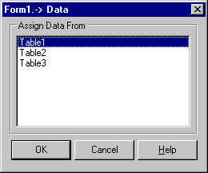
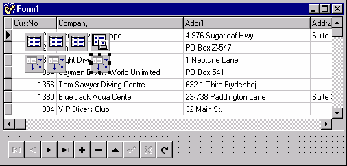
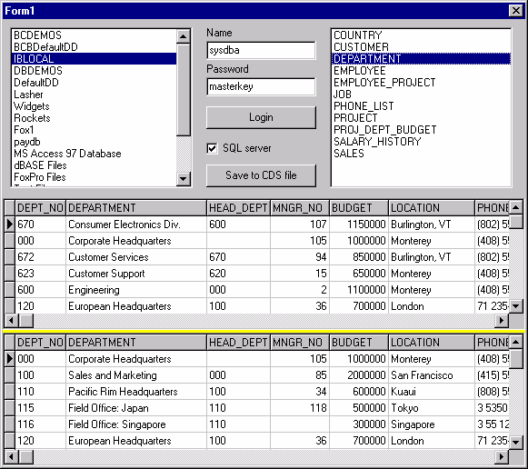
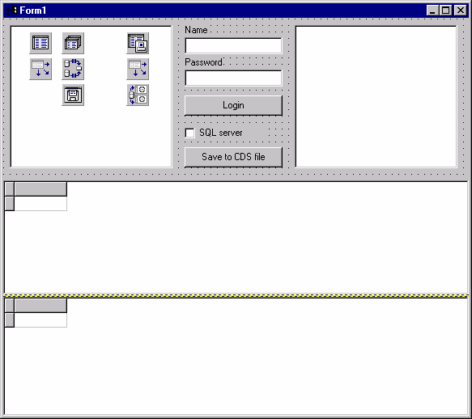

MIDAS и маленькие настольные приложения
=======================================

::: {.date}
01.01.2007
:::

MIDAS и \"маленькие\" настольные приложения

Наталия Елманова\
Компьютер Пресс - CD, 1999, N 4\

© Copyright N.Elmanova & ComputerPress Magazine.

В данной статье содержатся некоторые идеи нетрадиционного использования
MIDAS при разработке систем, не имеющих прямого отношения к
распределенным вычислениям и многозвенным системам.

Совет 8. Создание \"маленького\" приложения с базой данных без
использования BDE

Нередко разработчики небольших приложений, использующих одну или
несколько таблиц, испытывают некоторые удобства при их поставке. Эти
неудобства связаны с необходимостью установки библиотеки BDE на
компьютер пользователя.

В общем случае, если приложение использует базы данных, следует, помимо
приложения, установить на компьютер пользователя библиотеку Borland
Database Engine. Установка этой библиотеки заключается в копировании
файлов этой библиотеки на компьютер пользователя, внесении сведений о
ней в реестр, установке пиктограммы для утилиты конфигурации BDE, а
также настройке псевдонимов и языковых драйверов для данного приложения.

В процессе установки BDE могут возникнуть разнообразные проблемы.
Во-первых, у пользователя на компьютере могут быть установлены другие
приложения, использующие BDE. Если скопировать на такой компьютер файл
конфигурации BDE поверх имеющегося, работоспособность этих приложений
может быть нарушена из-за того, что исчезнут описания псевдонимов,
используемых ими. Возможна также потеря работоспособности уже
установленного и используемого приложения (и, как следствие, получение
претензий от пользователей), если другой программист установит свой файл
конфигурации BDE поверх имеющегося.

Еще одна проблема может быть связана с несовпадением версий BDE. Если с
момента выхода используемой версии BDE прошло какое-то время, есть риск
заменить старой версией BDE более новую и тем самым нарушить
работоспособность использующих ее приложений.

Отметим также, что корректное написание дистрибутива приложения далеко
не всегда является гарантией дальнейшей корректной его работы. Например,
не все пользователи грамотно деинсталлируют приложения. Часто бывает,
что ставший ненужным каталог просто стирается (в том числе и каталог с
BDE). При этом скорее всего (исключения бывают очень редко)
соответствующая ветвь реестра сохранится, и инсталляционное приложение
будет сообщать пользователю, что BDE на данном компьютере уже есть.

Иными словами, установка BDE влечет за собой создаиие дистрибутива и
риск быть вовлеченным в коллизии, связанные с заменой этой библиотеки
более старой версией или замены файлов конфигурации BDE. В сложных
многопользовательских системах с серверными базами данных и с большим
количеством таблиц такой риск может быть сведен к минимуму, так как в
силу высокой стоимости таких систем на подобных предприятиях обычно
устанавливаются жесткие корпоративные правила для пользователей, в том
числе запрещающие несанкционированную установку программного обеспечения
без ведома системного адлминистратора. Но если приложение невелико и
использует одну-две таблицы, оно не должно требовать наличия жестких
корпоративных правил его использования. Отметим также, что в этом случае
сама библиотека BDE может существенно превышать по объему и приложение,
и поставляемые с ним данные.

По этим причинам разработчики таких приложений нередко изобретают свои
форматы данных, дабы не использовать BDE вообще, а просто считывать файл
с диска.

Как ни парадоксально, разработчики, занимающиеся созданием подобных
приложений, даже имея клиент-серверные версии Delphi или C++Builder,
просто не обращают внимания на страницу MIDAS палитры компонентов этих
средств разработки, считая, что эти компоненты - не для их задач. А ведь
именно там и содержится компонент TClientDataSet, позволяющий создать
такой файл и использовать его.

Компонент TCLientDataSet обычно используется в \"тонких\" клиентах
серверов доступа к данным. Подобные приложения широко используют
кэширование данных в оперативной памяти рабочей станции и нередко
учитывают возможность разрыва связи с сервером доступа к данным.
Соответственно компонент TCLientDataSet позволяет сохранить содержимое
своего кэша в файле и загрузить его оттуда. После этого можно просто
забыть о сервере доступа к данным и работать только с этим файлом (его
можно даже редактировать). Библиотека BDE при этом не нужна - \"тонкие\"
клиенты ее не используют (в том числе и отчуждаемые \"тонкие\" клиенты).

Создадим пример такого \"маленького\" приложения. Но прежде создадим
приложение для переноса данных из таблиц в файл, содержащий кэш
компонента TCLientDataSet. Для этого создадим новый проект и поместим на
его главную форму три компонента TTable, три компонента TDataSourse и
один компонент TClientDataSet, один компонент TDBGrid и один компонент
TDBNavigator (последние два компонента нужны только для контроля и
просмотра данных и, по существу, совершенно не обязательны). Установим
следующие свойства этих компонентов:

Компонент

Свойство

Значение

DBGrid1

DataSource

DataSource3

DBNavigator1

DataSource

DataSource3

Table1

DatabaseName

BCDEMOS (или DBDEMOS)

TableName

customer.db

Active

true

DataSource1

DataSet

Table1

Table2

DatabaseName

BCDEMOS (или DBDEMOS)

TableName

orders.db

IndexFieldNames

CustNo

MasterFields

CustNo

MasterSource

DataSource1

Active

true

DataSource2

DataSet

Table2

Table3

DatabaseName

BCDEMOS (или DBDEMOS)

TableName

items.db

IndexFieldNames

OrderNo

MasterFields

OrderNo

MasterSource

DataSource2

Active

true

ClientDataSet1

ProviderName

Provider1

Active

true

DataSource3

DataSet

ClientDataSet1

Далее выберем из контекстного меню компонента ClientDataSet1 опцию
Assign Local Data и в появившемся списке выберем Table1:

{width="260" height="216"}

Рис. 1 Выбор источника данных для заполнения компонента TClientDataSet.

После этого в кэш компонента TCLientDataSet будут загружены данные:

{width="506" height="243"}

Рис. 2 Главная форма приложения после выбора источника данных для
TCLientDataSet .

Теперь из контекстного меню этого же компонента выберем опцию Save To
File и в появившейся диалоговой панели открытия файла введем имя файла,
в котором будут храниться данные из кэша. Итак, файл с данными готов.

Теперь можно создать наше \"маленькое\" приложение. Для этого достаточно
просто удалить с формы компоненты Table1, Table2, Table3, DataSource1,
DataSource2 - они больше не нужны.

Есть две возможности создания таких \"маленьких\" приложений. Самый
простой из них - хранить данные непосредственно в исполняемом файле
приложения (если их объем невелик). Для этой цели следует из
контекстного меню компонента TClientDataSet выбрать опцию Load From File
и выбрать имя файла, сохраненного прежде. Теперь данные из этого файла
содержатся в ресурсах формы, в чем можно убедиться, открыв форму в
текстовом представлении. Если скомпилировать такое приложение, его можно
передать пользователю. Единственное, что требуется добавить в комплект
поставки - файл dbclient.dll из каталога Winnt\\System32 (или
Windows\\System).

Еще один вариант - выполнить метод LoadFromFile компонента
TClientDataSet в обработчике события OnCreate формы. В этом случае файл
с кэшированными данными следует также включить в комплект поставки
приложения, и объем его может быть достаточно велик (насколько именно -
зависит от ресурсов рабочей станции, на которой используется такое
приложение).

Отметим, что Delphi 4 и C++Builder 4 позволяют хранить в таком файле
данные из нескольких связанных таблиц (именно это и было нами сделано).
Поэтому в полученном наборе данных имеется поле типа TDataSetField,
предоставляющее доступ к detail-записям (в нашем случае к записям таблиц
orders.db и items.db).

{width="474" height="337"}

Рис. 3 Приложение, использующее локальную копию данных, на этапе
выполнения.

Пользователи Delphi 3 и C++Builder 3 могут создавать несколько
компонентов TCLientDataSet и организовывать связь между ними в
приложении так же, как и в случае обычных таблиц, используя свойства
MasterField и MasterSource.

Отметим, что, помимо настольных приложений, сохраненные в файле
кэшированные данные могут быть использованы при создании демо-версий и
прототипов клиент-серверных приложений, где затруднена или исключена в
силу лицензионных ограничений поставка полноценной версии СУБД.

Совет 9. Как сэкономить место на форме при отображении связанных таблиц

В приложениях с базами данных, использующих несколько связанных таблиц,
места на форме для их отображения, как правило, не хватает - это общая
проблема проектирования интерфейсов подобных приложений. Компонент
TCLientDataSet может помочь и в этом случае.

Возьмем наше самое первое приложение, содержащее три компонента TTable и
компонент TClientDataSet, и добавим в него компонент TDataSetProvider.
Установим значение его свойства DataSet равным Table1. Затем свойство
ProviderName компонента ClientDataSet1 установим равным
DataSetProvider1.

Теперь наше приложение позволяет редактировать данные из всех трех
таблиц, при этом интерфейс приложения окажется примерно тем же, что и на
предыдущем рисунке. Единственное, о чем дополнительно следует
позаботиться, это о пересылке отредактированных данных обратно в
исходные таблицы с помощью метода ApplyUpdates компонента
TClientDataSet. Обычно для этой цели к форме добавляют какой-либо
интерфейсный элемент, инициирующий выполнение этого метода. Иногда этот
метод добавляют к обработчику события AfterPost компонента
TClientDataSet. В случае C++Builder этот код имеет вид:

    procedure TForm1.ClientDataSet1AfterPost(DataSet: TDataSet);
    begin
     ClientDataSet1.ApplyUpdates(-1);
    end;

Отметим, однако, что это не самый эффективный способ сохранения
отредактированных записей, так как метод Post в данном случае
выполняется локально, а метод ApplyUpdates требует обращения к базе
данных, и при использовании сетевой СУБД лучше выполнять его не так
часто, кaк метод Post.

Совет 10. Как произвести сортировку данных в компоненте TClientDataSet

Для сортировки данных в компоненте TClientDataSet можно использовать
свойство IndexFieldNames (точно так же, как и в случае использования
компонента TTable). Помимо этого, компонент TClientDataSet обладает
методами AddIndex и DeleteIndex. Эти методы позволяют произвести
сортировку данных на этапе выполнения.

На форму приложения, содержащую данные из компонента TClientDataSet,
добавим компонент TListBox и создадим два обработчика события:

    procedure TForm1.FormCreate(Sender: TObject);
    begin
      ListBox1.Items:=ClientDataSet1.FieldList;
    end;
    procedure TForm1.ListBox1Click(Sender: TObject);
    var fn:string ;
    begin
      fn:= ListBox1.Items.Strings[ListBox1.ItemIndex];
      ClientDataSet1.AddIndex(fn + 'Index', fn, [ixCaseInsensitive],'','',0);
      ClientDataSet1.IndexName := fn + 'Index';
    end;

Теперь на этапе выполнения в компоненте TListBox будет отображаться
список полей компонента TClientDataSet, и выбор из этого списка приведет
к пересортировке записей.

Совет 11. Создание универсального инструмента для сохранения содержимого
таблиц в локальных файлах

В заключение данной серии советов создадим приложение, позволяющее
сохранять в локальных файлах компонента TClientDataSet любые доступные
таблицы.

С этой целью создадим форму, содержащую два компонента TListBox, два
компонента TDBGrid, один компонент TSplitter, два компонента TEdit, две
кнопки и один TCheckBox.

Поместим также на форму TSaveDialog, TDatabase, TSession, TTable,
TClientDataSet, TDataSetProvider, два компонента TDataSource.

{width="581" height="516"}

Рис. 4 Форма приложения для сохранения таблиц в локальных файлах.

Установим следующие значения свойств этих компонентов:

Компонент

Свойство

Значение

Session1

SessionName

MySession

Database1

SessionName

MySession

LoginPrompt

false

DatabaseName

MyDB

Table1

SessionName

MySession

ClientDataSet1

ProviderName

DataSetProvider1

Active

false

DataSource1

DataSet

Table1

DataSource2

DataSet

ClientDataSet1

DataSetProvider1

DataSet

Table1

DBGrid1

DataSource

DataSource1

DBGrid2

DataSource

DataSource2

SaveDialog1 Filter

ClientDataSet

Files\|\*.cds\|All files\|\*.\*

DefaultExt

\*.cds

Создадим обработчики событий, связанные с нажатиями на кнопки, выбором
из списков и созданием формы приложения:

    //------------------------------------------------------------
    #include <vcl.h>
    #pragma hdrstop
    #include "uni_cds1.h"
    //------------------------------------------------------------
    #pragma package(smart_init)
    #pragma resource "*.dfm"
    TForm1 *Form1;
    //------------------------------------------------------------
    __fastcall TForm1::TForm1(TComponent* Owner)
            : TForm(Owner)
    {
    }
    //----------------------------------------------------------
    void __fastcall TForm1::FormCreate(TObject *Sender)
    {
    TStringList *DBList = new TStringList();
    try
    {
      Session1->GetAliasNames(DBList);
      for (int I = 0; I < DBList->Count; I++)
        ListBox1->Items->Add(DBList->Strings[I]);
    }
    __finally
    {
      delete DBList;
    }
    }
    //-------------------------------------------------------------
    void __fastcall TForm1::Button1Click(TObject *Sender)
    {
    Database1->Connected=false;
    ClientDataSet1->Close();
    Database1->Params->Clear();
    Database1->AliasName=
      ListBox1->Items->Strings[ListBox1->ItemIndex];
    Database1->Params->Add("User Name="+Edit1->Text);
    Database1->Params->Add("Password="+Edit2->Text);
    TStringList *TabList = new TStringList();
    try
     {
     Database1->Connected=true;
     Session1->GetTableNames("MyDB","",!(CheckBox1->Checked),false,
        TabList) ;
     ListBox2->Items=TabList;
     }
     __finally
    {
    delete TabList;
    }
    }
    //-----------------------------------------------------------
    void __fastcall TForm1::ListBox2Click(TObject *Sender)
    {
    Table1->Close();
    ClientDataSet1->Close();
    Table1->DatabaseName=Database1->DatabaseName  ;
    Table1->TableName=
         ListBox2->Items->Strings[ListBox2->ItemIndex];
    Table1->Open();
    ClientDataSet1->Open();
    }
    void __fastcall TForm1::Button2Click(TObject *Sender)
    {
    if (SaveDialog1->Execute())
    {
    ClientDataSet1->SaveToFile(SaveDialog1->FileName);
    }
    }
    //-----------------------------------------------------------

В момент создания формы создается список всех доступных баз данных с
помощью метода GetAliasNames компонента TSession. При выборе элемента из
этого списка, вводе имени пользователя и пароля происходит соединение с
соответствующей базой данных и создание списка ее таблиц. Флажок SQL
server нужен для того, чтобы указать, нужно ли выводить в этом списке
расширения для имен таблиц.

При выборе таблицы из списка ее данные отображаются в верхнем из
компонентов TDBGrid и заполняют кэш компонента TCLientDataSet,
отображаемый в нижнем из компонентов TDBGrid. При нажатии кнопки Save to
CDS file появляется диалог сохранения файла, в котором следует ввести
имя файла для сохранения таблицы, после чего происходит сохранение
содержимого таблицы в файле.

{width="583" height="518"}

Рис. 5 Приложение для сохранения таблиц в локальных файлах на этапе
выполнения.

Отметим, что объем сохраняемых таблиц должен быть разумным -
CLientDataSet хранит данные в оперативной памяти рабочей станции.

Исходный текст этого же приложения на Object Pascal читатели могут
создать самостоятельно.

Взято из [http://delphi.chertenok.ru](https://delphi.chertenok.ru)
