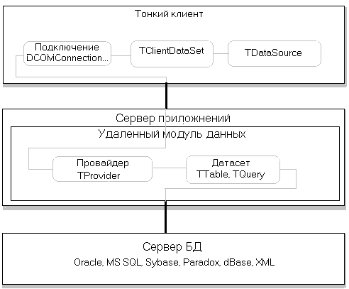
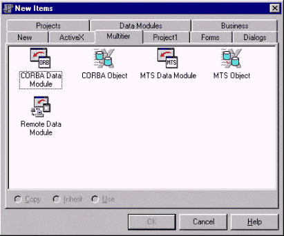
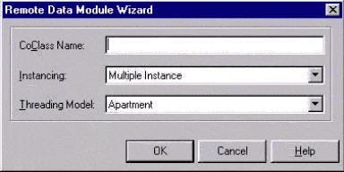
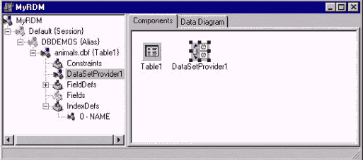
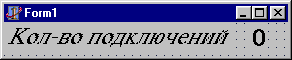
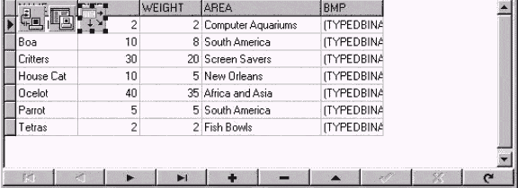

Что такое MIDAS?
================

MIDAS - multi-tiered distributed application service suite - это
технология Borland для создания многоуровневых приложений баз данных.
Применение данной архитектуры позволяет быстро разрабатывать простые в
сопровождении и установке, надежные, распределенные БД. Трехуровневое
приложение баз данных содержит несколько компонентов (слоев):

а) Слой БД. Хранит данные. Выполняет функции хранения информации,
обеспечения целостности и непротиворечивости данных. Пример -локальные
(dBase, Paradox) и серверные БД (Oracle, Sybase, MS SQL), текстовые
файлы и т.д.

б) Слой бизнес логики (сервер приложений) - это программа,
обеспечивающая доступ клиентов к информации. На этом слое вводится
понятие сервиса, как некоей услуги, поставляемой клиенту (например,
получение данных об остатке денег на счете, как частный случай из
реляционной БД). В этом слое реализуются правила и алгоритмы обработки
информации, отражающие поведение реального моделируемого объекта (бизнес
правила). Например, проверка остатка денег на не отрицательность,
перевод денег со счета на счет.

в) Презентационный слой (тонкий клиент). Задача этого слоя, используя
сервисы слоя бизнес логики, предоставлять пользователям запрошенную
информацию в форме удобной и приятной во всех отношениях. Может быть
выполнен в виде традиционного exe файла или в качестве тонкого клиента
можно использовать Web броузер.

Применение данной схемы позволяет создать клиентское приложение, которое
практически не требует настройки и сопровождения, вся логика работы с БД
сосредоточена в среднем слое (сервере приложений). Соответственно при
доработке алгоритмов доступа к БД необходимо лишь переустановить сервер
приложений. MIDAS предназначен для обеспечения связи между слоем бизнес
логики и презентационным слоем. Он позволяет организовать взаимодействие
тонкого клиента с сервером приложений. При этом сервер приложений
взаимодействует с реляционной БД (чаще всего данные хранятся именно в
этой форме) как и обычные приложения работы с БД, разработанные в
Delphi.

Тонкий клиент для конечного пользователя ничем не отличается от
обычного (толстого) клиента БД. Разница в том, что толстый клиент через
BDE, ADO, компоненты прямого доступа к серверам БД и другие библиотеки
работает с БД, а тонкий клиент взаимодействует с сервером приложений,
используя MIDAS. Сервер приложений скрывает от клиента детали доступа и
обработки БД. На компьютере с тонким клиентом не нужно устанавливать и
настраивать BDE, ADO, клиентскую часть сервера БД. Необходимо лишь иметь
небольшие по объему dll, которые легко переносить вместе с exe файлом
тонкого клиента. В качестве тонкого клиента может использоваться и Web
браузер.

Разработка пользовательского интерфейса тоже мало чем
отличается от обычного клиента. Особенности - необходимость размещения и
настройки одного из компонентов доступа к серверу приложений
(DCOMConnection, SocketConnection, WebConnection, CorbaConnection) и
вместо Table, Query, StoredProc использовать компонент TСlientDataSet.
Сервер приложений, как правило, имеет весьма несложный пользовательский
интерфейс (чаще одну главную форму). Да он ему и не нужен. Сердце
сервера приложений - это удаленный модуль данных (Remote Data Module). В
зависимости от протокола связи TRemoteDataModule, MTSDataModule,
TCORBADataModule. Внутри удаленного модуля данных расположены
невизуальные компоненты доступа к данным. Каждому компоненту, который
должен быть доступен тонкому клиенту необходимо сопоставить компонент -
TDataSetProvider. Кроме того, для автоматического запуска серверов
приложений по запросу клиента и реализации стратегии безопасности
доступа бывает необходимо иметь дополнительную программу SCM (service
control manager).

{.center}

## Создание трехуровневого приложения

Итак, создадим наше первое приложение для просмотра таблицы animals.dbf
БД DBDEMOS. Как указывалось выше нам необходимо разработать сервер
приложений и тонкого клиента (слой БД - это dbf файл).

### Создание сервера приложений

Создадим новое приложение, используя пункт меню File / New Application.
Созданная при этом форма Form1 будет главной формой сервера приложений.
Далее создадим удаленный модуль данных, в него будут помещаться
невизуальные компоненты доступа к данным и в нем сосредотачивается вся
функциональность сервера приложений. Отличие его от обычного модуля
данных в том, что удаленный модуль данных обеспечивает возможность
тонким клиентам получать данные с сервера приложений. Выберем пункт меню
File / New и в появившемся диалоге перейдем к закладке Miltitier (рис.1).

:::{.center}
Варианты создания удаленного модуля данных  

Рис.1.
:::

:::{.center}
Мастер создания удаленного модуля данных  

Рис.2.
:::

Выберем значок Remote Data Module и нажмем кнопку ОК (Замечание в случае
использования CORBA необходимо выбирать CORBA Data Module). После этого
на экране появляется диалог RemoteDataModuleWizard. Заполним поле
CoClass Name базовым именем нашего удаленного модуля MyRDM. Обратите
внимание, что к указанному имени будет добавлена буква T в наименовании
класса и I в наименовании интерфейса для управления удаленным модулем.
Остальные поля оставьте как есть (мы пишем простейшего сервера). Нажмем
кнопку OK. В проект будет добавлен модуль Unit2, содержащий удаленный
модуль данных. С закладки DataAccess добавим компонент TTable и свяжем
его с таблицей animals.dbf алиаса DBDEMOS и активируем (свойства
DatabaseName установим в DBDEMOS, TableName в animals.d, Active в true.
Напомню, что порядок установки свойств важен).

Теперь для того, чтобы
сделать данную таблицу доступной тонкому клиенту необходим еще один
компонент TDataSetProvider. Он расположен на закладке Midas. Чтобы
связать DataSetProvider с TTable (как впрочем и с другими компонентами
доступа к данным) установим свойство DataSet первого равным Table1.
Результат наших усилий можно увидеть на рис.3. Осталось запустить сервер
приложений на выполнение. Во-первых, чтобы увидеть наши труды, а
во-вторых, чтобы при первом запуске сервер приложений произвел
необходимые действия по своей регистрации в реестре.

:::{.center}
Удаленный модуль данных  

Рис.3.
:::


В принципе сервер приложений готов и работоспособен (без написания кода!!!),
однако внесем последний штрих - счетчик подключений клиентов. Для
этого на главную форму поместим два компонента TLabel. Свойство Caption
одного установим в "Количество подключений", а второго в "0". Вид
главной формы представлен на рис.4.

В обработчики события OnCreate удаленного модуля инкрементируем значение
счетчика подключений:

:::{.center}
Вид главной формы  

Рис.4.
:::

```
with Form1.Label2 do
  Caption := IntToStr(StrToInt(Caption) + 1);
```

а в OnDestroy того же компонента декрементируем счетчик:

```
with Form1.Label2 do
  Caption := IntToStr(StrToInt(Caption) - 1);
```

Создание тонкого клиента

Теперь настало время взяться за написание клиента. Создадим новое
приложение, использующее в качестве протокола связи с сервером сокеты.
Выбрав File / New Application в меню, на главную форму установим
компонент TSocketConnection с закладки Midas. Данный компонент
обеспечивает взаимодействие с сервером приложений. Далее нам необходимо
запустить программу Borland Socket Server (расположена в
Delphi/Bin/scktsrvr.exe). Данная программа обрабатывает запросы
клиентов, передает их серверу приложений и запускает его, если раньше он
не был запущен. Программы, выполняющие данные функции называют SCM
(service control manager). Запуск Borland Socket Server необходим лишь в
случае использования протокола сокетов. При запуске Borland Socket
Server помещает свой значок в панель задач.

Настроим SocketConnection1. Значение свойства ServerName выберем из
выпадающего списка и установим равным Project1.MyRDM, таким образом мы
указываем к какому серверу приложений присоединяться. Затем необходимо
указать на какой машине находится данный сервер. Для этого надо
установить либо свойство Address в значение IP адреса или выбрать из
списка значений свойства Host имя Вашего PC. Наконец, установим свойство
Connected в true. О-о-пс, если все было выполнено верно, запустится
сервер приложений и его счетчик клиентов будет установлен в 1. Для
доступа к данным в тонком клиенте вместо TTable, TQuery используется
TClientDataset. Разместим на главной форме его и мы, взяв с закладки
Midas. Значение свойства RemoteServer установим в SocketConnection1,
ProviderName в DataSetProvider1 (вспомним, что разместили его в
удаленном модуле данных сервера приложений). Внимание, порядок установки
этих свойств важен. Активизируем TClientDataSet, установив свойство
Active в true. Далее порядок проектирования не отличается от разработки
обычного приложения БД. Т.е. размещаем на форме DataSource, DBGrid,
DBNavigator.Набор свойств, которые нужно установить приведен в таблице 1.

<table>
<tr>
<td align="right" colspan="2">Таблица 1</td>
</tr>
<tr>
<td align="center" colspan="2"><b>DataSource1</b></td>
</tr>
<tr>
<td>DataSet</td><td>ClientDataSet1</td>
</tr>
<tr>
<td align="center" colspan="2"><b>DBGrid1, DBNavigator</b></td>
</tr>
<tr>
<td>DataSource</td><td>DataSource1</td>
</tr>
</table>

Если все выполнено правильно, то в сетке просмотра появятся данные. Вид
главной формы приведен на рис.5. Ну вот, теперь можно запустить клиента.
При этом на запущенном сервере приложений счетчик увеличится до2. Можно
запустить еще несколько экземпляров клиентов, загнуть пальцы и сделать
умное лицо. :)))

:::{.center}
Главная форма тонкого клиента  

Рис.5.
:::


Какую из технологий (протоколов) распределенных вычислений лучше
использовать с MIDAS ?

    Протокол обеспечивает механизм вызова сервера приложений и
соединения с ним клиента.

    На данный момент Delphi поддерживает четыре протокола организации
распределенных вычислений:

1. DCOM - технология Microsoft для создания и использования удаленных
объектов автоматизации.

Достоинства:

а) Встроена в Windows 98,NT,2000. Может быть установлен в Windows 95,
как дополнительная опция. Это не требует запуска дополнительных
приложений на стороне сервера для управления подключением клиентов.

б) Реализован автоматический запуск сервера приложений при вызове его
клиентом и автоматическое закрытие при отсутствии клиентов.

Недостатки:

а) Существуют проблемы с работой DCOM в сетях без контроллера домена NT.
Поэтому использовать эту технологию в полной мере можно лишь при наличии
в сети сервера с ОС Windows NT, 2000.

б) В DCOM нет встроенных средств обеспечения прозрачности положения
сервера приложений (location transparency), т.е другими словами всегда
нужно указывать на каком компьютере расположен сервер приложений. Данное
ограничение можно сгладить применением SimpleObjectBroker.

в) Использовать DCOM можно лишь на платформе Windows.

2. Sockets - самый простой из протоколов организации распределенных
вычислений. В его основе лежит использование сокетов TCP/IP.

Достоинства:

а) Требует минимум установленных компонентов ОС.

б) Может функционировать в любой сети Windows (c выходом Kylix надеюсь и
в Linux), использующей TCP/IP.

Недостатки:

а) Требует постоянно запущенного на сервере менеджера подключений
клиентов (ScktSrvr.exe).

б) Отсутствие механизмов обеспечения безопасности, другими словами все
серверы приложений данной машины могут быть использованы с любого
клиента, имеющего доступ по TCP/IP.

3. WebConnection - использует HTTP.

Достоинства:

а) Позволяет организовать вызов объекта с машины находящейся за
пределами сегмента сети, защищенного файрволом.

Недостатки:

а) Требует установки на стороне клиента Wininet.dll (поставляется с IE 3
и выше).

б) Web сервер IIS 4 (и выше ) или Netscape enterprise 3.6 (и выше).

4. CORBA - использует соответствующую спецификацию OMG.
Проще говоря CORBA - независимый от ОС стандарт взаимодействия объектов в распределенной
системе.

Достоинства:

а) Независимость от ОС.

б) Наличие встроенного механизма обеспечения прозрачности положения
сервера приложений. Т.е не нужно волноваться за то, где запущен сервер
приложений, он будет автоматически найден.

в) Возможность выбора между автоматическим запуском сервера приложений
при подключении клиента или запуска "вручную".

Недостатки:

а) Требуется установка дополнительного программного обеспечения (брокера
объектных запросов - хотя бы на одной машине в сети).

б) Более сложная установка и настройка (по сравнению с DCOM) сервера
приложений при автоматическом запуске.

в) Использование в Delphi COM для реализации CORBA

Таким образом можно дать следующие рекомендации по выбору протокола:

- Если Вы новичок в MIDAS, то для изучения лучше всего используйте DCOM,
установив сервер приложений и клиента на одной машине.

- Если Ваша БД будет использоваться только с ОС Windows в сетях с
контроллером домена Windows NT,2000 - используйте DCOM.

- Если Вы не уверены, в том что в сети будет контроллер домена, то
используйте либо CORBA, либо сокеты

- В случае, если необходимо обеспечить запуск серверов приложений на любой
машине в сети и конфигурация сети может меняться (или заранее неизвестны
имена машин, где будут функционировать сервера приложений) лучше
использовать CORBA.

- Если Ваши сервера приложений должны быть доступны не только в локальной
сети, но и "снаружи" - WebConnection подойдет лучше всего.

- Когда Вы не хотите забивать себе голову (а надо бы) DCOM-ми, CORBA-ми,
stab-ми, skeleton-ми, правами доступа итд SocketConnection поможет Вам
быстро слабать многослойную БД.

