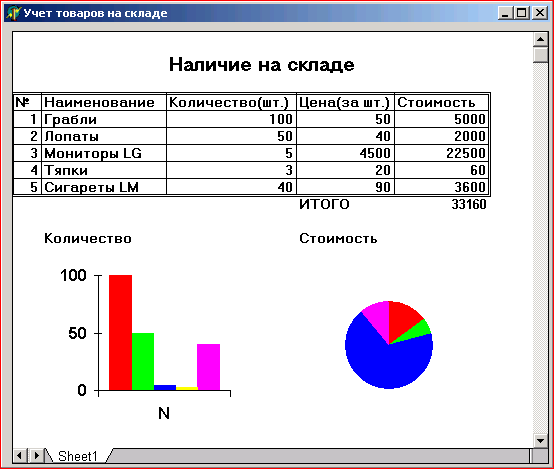
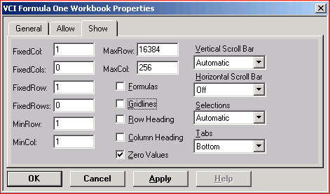

Страницы Excel - компонент F1Book
==================================

::: {.date}
01.01.2007
:::

3.4.4 Страницы Excel --- компонент F1Book

Очень интересным компонентом является F1Book на странице ActiveX. Этот
компонент позволяет встроить в ваше приложение таблицы типа Excel (рис.
3.14), которые пользователь может заполнять соответствующими числами, а
компонент будет производить по заданным формулам вычисления и тут же
отображать их результаты в указанных ячейках. В таблицу можно встроить
диаграммы и графики различных типов. И все изменения, вносимые
пользователем в данные таблицы, немедленно будут отображаться в
диаграммах. Таким образом вы можете включать в свое приложение различные
бланки смет, счетов, ведомостей, с которыми будет работать пользователь,
различные таблицы, производящие статистические или технические расчеты и
т.п.

:::{.center}
Рис. 3.14 Приложение с компонентом F1Book  

:::

Перенесите на форму компонент F1Book и щелкните на нем правой кнопкой
мыши. Выберите из всплывшего меню команду Workbook Designer. Перед вами
появится диалоговое окно проектирования, представленное на рис. 3.15.
Те, кто знаком с программой Excel, могут увидеть, что это окно является
несколько упрощенным вариантом Excel. Проектирование таблицы
производится фактически по тем же правилам, что и в Excel. Вы можете
писать в ячейках необходимые надписи, задавая шрифт, его стиль,
обрамление. Можете записывать формулы. Так на рис. 3.14 и 3.15 последний
столбец представляет собой стоимость соответствующего товара, являющуюся
произведением его количества на его цену. А ячейка внизу таблицы
суммирует стоимость всех товаров.

:::{.center}
Рис. 3.15 Диалоговое окно проектирования компонента F1Book  

:::

Правая быстрая кнопка на рис. 3.15 позволяет ввести на страницу
диаграммы и графики. Чтобы задать диаграмму, надо сначала выделить
курсором в таблице данные, которые должны отображаться в диаграмме,
затем нажать кнопку ввода диаграммы, после этого указать курсором рамку,
в которой должна отображаться диаграмма. В результате вы попадете в
диалоговое окно, в котором сможете выбрать тип диаграммы и необходимые
ее атрибуты.

Рассказывать подробно о работе с окном проектирования компонента F1Book
невозможно из-за ограничения на объем данной книги. Те, кто знаком с
Excel, без труда смогут в этом окне ориентироваться. К тому же в нем
имеется встроенная справка, вызываемая командой меню Help или клавишей
F1.

Щелкнув правой кнопкой мыши на компоненте F1Book, вы можете выбрать еще
одну команду --- Properties. В появившемся при этом диалоговом окне
(рис. 3.16) вы можете, в частности, задать опции, определяющие, что
будет видно или не видно в таблице при работе приложения: заголовки
строк и столбцов (Row Heading и Column Heading), сетка (Gridlines),
формулы вычислений (Formulas) и т.п.

:::{.center}
Рис. 3.16 Диалоговое окно задания свойств объекта F1Book  

:::

Из книги:  
А.Я.Архангельский "100 компонент общего назначения библиотеки Дельфи 5"
