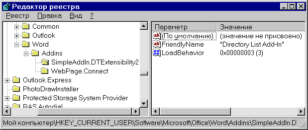
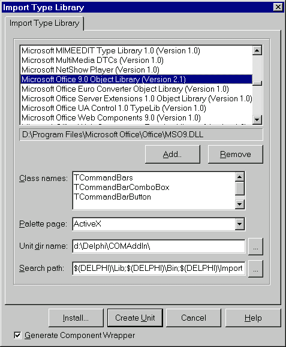
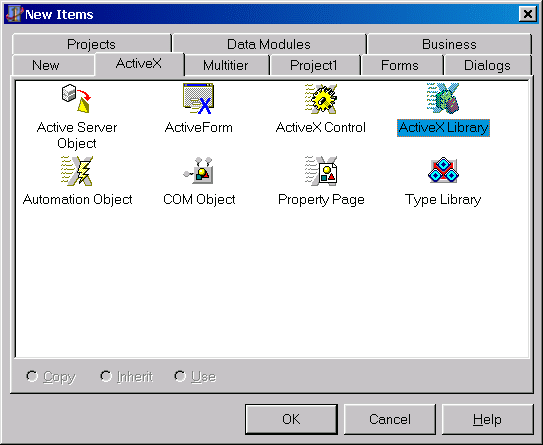
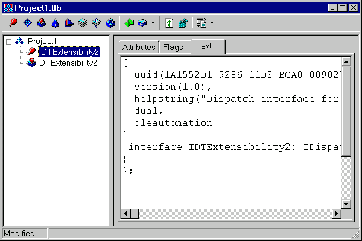

Создание модулей расширения Microsoft Office
============================================

::: {.date}
01.12.2006
:::

Анатолий Тенцер

Vit (2006) - в DRKB публикуется с сокращениями.


Модель модулей расширения Microsoft Office 2000

В Office 2000 Microsoft ввела единый API для написания подключаемых
модулей, расширяющих функциональные возможности пакета. Теперь стало
возможно написание модулей, которые интегрируются с любым из приложений
пакета. Разработанный набор интерфейсов упрощает создание расширений,
позволяя программисту сконцентрироваться на функциональности, а не на
изучении особенности каждого из приложений.

Новая модель подключаемых модулей была названа COM Add-Ins. Как следует
из названия, модуль расширения (Add-In) представляет собой COM-сервер,
который специальным образом зарегистрирован в операционной системе. При
загрузке приложение пакета Office загружает зарегистрированные
расширения и вызывает их методы, позволяя установить обработчики на
необходимые для их дальнейшего функционирования события. По завершении
работы приложение Office извещает об этом модули расширения, позволяя
последним корректно освобождать ресурсы.

Общение модулей расширения с загрузившим их приложением происходит с
помощью объектной модели Microsoft Office.

Использование COM Add-In позволяет в корне изменить подходы к интеграции
приложений с Microsoft Office. Например, вместо того чтобы вызывать Word
для генерации отчетов, можно, наоборот, встроить в него меню со списком
отчетов, а по выбору пользователем нужного отчета --- запросить данные
из базы данных и сформировать по ним документ.

Интерфейс IDTExtensibility2

Ключевым моментом в написании COM Add-In является реализация им
интерфейса IDTExtensibility2, определённого следующим образом:

    type
      IDTExtensibility2 = interface(IDispatch)
        ['{B65AD801-ABAF-11D0-BB8B-00A0C90F2744}']
        procedure OnConnection(const HostApp: IDispatch;
          ext_ConnectMode: Integer; const AddInInst: IDispatch;
          var custom: PSafeArray); safecall;
        procedure OnDisconnection(ext_DisconnectMode: Integer;
          var custom: PSafeArray); safecall;
        procedure OnAddInsUpdate(var custom: PSafeArray); safecall;
        procedure OnStartupComplete(var custom: PSafeArray); safecall;
        procedure BeginShutdown(var custom: PSafeArray); safecall;
      end;

После загрузки зарегистрированного в качестве расширения COM-сервера
Office запрашивает у него этот интерфейс и, если он реализован, вызывает
соответствующие методы, позволяя расширению реализовать свою
функциональность.

Рассмотрим методы IDTExtensibility2 подробнее:

    procedure OnConnection(
      const HostApp: IDispatch;  
      ext_ConnectMode: Integer;
      const AddInInst: IDispatch;
      var custom: PSafeArray
    ); safecall;

Вызывается при загрузке модуля расширения. В этот момент можно
произвести требуемую инициализацию, добавить или удалить необходимые
интерфейсные элементы, установить обработчики событий и т.п.

Параметры, передаваемые методу:

HostApp
:        Ссылка на интерфейс IDispatch вызывающего приложения.
Если модуль расширения планирует в дальнейшем обращаться к его объектной
модели, он должен сохранить ссылку в переменной

ext\_ConnectMode  
: Константа, информирующая о том, по какой причине производится загрузка:
	ext\_cm\_AfterStartup - модуль расширения загружен после
	загрузки хотя бы одного документа Office
	ext\_cm\_External - модуль расширения загружен другим компонентом
	ext\_cm\_Startup - модуль расширения загружен до загрузки
                           хотя бы одного документа Office 
	ext\_cm\_CommandLine - не используется в Office 2000

AddinInst  
: Ссылка на интерфейс IDispatch загружаемого модуля расширения

Custom
: Здесь и далее - в Microsoft Office не используется      
```
procedure OnDisconnection(ext\_DisconnectMode: Integer;
    var custom: PSafeArray); safecall;
```

Вызывается при выгрузке модуля расширения. Этот метод должен произвести
освобождение занятых ресурсов и прочие процедуры по завершении работы
COM-сервера.

Параметр ext\_DisconnectMode информирует о причине выгрузки COM-сервера
и может принимать следующие значения:

ext\_dm\_HostShutdown - приложение завершает работу;

ext\_dm\_UserClosed - модуль расширения выгружен пользователем.

procedure OnAddInsUpdate(var custom: PSafeArray); safecall;

Вызывается при изменении списка загруженных модулей расширений.
COM-сервер может проанализировать коллекцию расширений приложения и
предпринять необходимые действия, требующие взаимодействия с другими
модулями расширений.

procedure OnStartupComplete(var custom: PSafeArray); safecall;

Вызывается по завершении инициализации приложения. Те модули расширений,
которые должны предоставлять интерфейс пользователя при запуске
приложения, должны делать это в методе OnStartupComplete, когда
приложение полностью завершило этап инициализации.

procedure BeginShutdown(var custom: PSafeArray); safecall;

Вызывается в начале процесса завершения приложения, позволяя расширениям
предпринять в этот момент какие-либо действия.

Внедрение в объектную модель Office

Как было показано в предыдущем разделе, расширению доступен интерфейс
IDispatch вызывающего приложения. Таким образом, оно может
модифицировать интерфейс этого приложения, добавляя и удаляя необходимые
интерфейсные элементы, создавать документы, вызывать различные методы
для работы с ними. Однако, как правило, помимо этого необходимо
обеспечить реакцию на различные события в вызывающем приложении (такие
как изменение документа или нажатие кнопки на панели инструментов). Для
этого Add-In должен установить обработчик соответствующего события.
Прежде чем перейти к вопросам реализации, совершим небольшой экскурс по
событиям COM и их обработчикам.

COM Events

Введение

Если COM-объект хочет получать информацию о событиях в другом
COM-объекте, то он должен уведомить об этом объект-источник событий,
зарегистрировав себя в списке объектов-получателей уведомлений о
событиях. Модель COM предоставляет для этого стандартный механизм.

Объект-источник событий (в нашем случае - приложение Office, документ,
кнопка на панели инструментов и т.п.) реализует интерфейс
IConnectionPointContainer. Объект, нуждающийся в оповещении о событиях,
должен запросить у источника этот интерфейс, затем при помощи метода
FindConnectionPoint получить «точку подключения» - интерфейс
IConnectionPoint и посредством вызова метода Advise зарегистрировать в
этой точке подключения ссылку на свою реализацию интерфейса IDispatch,
методы которого будут вызываться при возникновении тех или иных событий
в источнике событий.

Различные объекты Office определяют интерфейсы, которым должны
соответствовать обработчики их событий. Так, например, для объекта
CommandBarButton (кнопка на панели инструментов) определен интерфейс
обработчика:

    type
      _CommandBarButtonEvents = dispinterface
        ['{000C0351-0000-0000-C000-000000000046}']
        procedure Click(const Ctrl: CommandBarButton;
          var CancelDefault: WordBool); dispid 1;
      end; 

Это означает, что при нажатии кнопки будет вызван метод Invoke
зарегистрированного интерфейса-обработчика, с параметром DispId, равным
1. При этом параметр pDispIds будет содержать указатель на вариантный
массив из двух параметров - соответственно типов CommandBarButton и
WordBool.

Базовый класс обработчика COM-событий

Реализуем базовый класс обработчика COM-событий.
Реализация взята из модуля SinkObject.pas,
написанного Бином Ли (Binh Ly, http://www.techvanguards.com/).

    type
      TBaseSink = class(TObject, IUnknown, IDispatch)
      protected
        { методы IUnknown }
        function QueryInterface(const IID: TGUID; out Obj): HResult;
          stdcall;
        function _AddRef: Integer; stdcall;
        function _Release: Integer; stdcall;
        { методы IDispatch }
        function GetIDsOfNames(const IID: TGUID; Names: Pointer;
          NameCount, LocaleID: Integer; DispIDs: Pointer):    HResult;
          virtual; stdcall;
        function GetTypeInfo(Index, LocaleID: Integer;
          out TypeInfo): HResult; virtual; stdcall;
        function GetTypeInfoCount(out Count: Integer): HResult;
          virtual; stdcall;
        function Invoke(DispID: Integer; const IID: TGUID;
          LocaleID: Integer; Flags: Word; var Params;
          VarResult, ExcepInfo, ArgErr: Pointer): HResult;
          virtual; stdcall;
      private
        FCookie: Integer;
        FCP: IConnectionPoint;
        FSinkIID: TGuid;
        FSource: IUnknown;
        function DoInvoke(DispID: Integer; const IID: TGUID;
          LocaleID: Integer;  Flags: Word; var dps: TDispParams;
          pDispIds: PDispIdList;  VarResult, ExcepInfo,
          ArgErr: Pointer): HResult; virtual; abstract;  
      public
        destructor Destroy; override;
        procedure Connect(pSource : IUnknown);
        procedure Disconnect;
        property SinkIID: TGuid read FSinkIID;
        property Source: IUnknown read FSource;
      end;

Рассмотрим реализацию ключевых методов этого класса. Метод
QueryInterface в дополнение к стандартной реализации проверяет, нет ли
попыток запросить интерфейс обработчика событий. В этом случае
возвращается IDispatch, позволяющий объекту-источнику событий вызвать
метод Invoke:

    function TBaseSink.QueryInterface(const IID: TGUID; out Obj): HResult;
      begin
        Result := E_NOINTERFACE;
        Pointer(Obj) := NIL;
        if GetInterface(IID, Obj) then
          Result := S_OK;
        // если запрашивается интерфейс SinkIID -
        // возвращаем свой IDispatch
        if not Succeeded(Result) then
          if IsEqualIID(IID, FSinkIID) then
            if GetInterface(IDispatch, Obj) then
              Result := S_OK;
      end;

Метод Connect регистрирует COM-объект в качестве обработчика событий
COM-объекта pSource. Обращаю внимание, что переменная FCP объявлена как
поле класса, поскольку он должен удерживать счетчик ссылок на «точку
подключения», пока она используется. Если объявить FCP как локальную
переменную - по завершении метода Connect произойдет неявный вызов
FCP.\_Release, что приведет к неправильной работе.

    procedure TBaseSink.Connect(pSource: IUnknown);
    var
      pcpc: IConnectionPointContainer;
    begin
      Disconnect;
      try
        // Запрашиваем интерфейс IConnectionPointContainer у объекта-
        // источника событий
        OleCheck(pSource.QueryInterface(IConnectionPointContainer,
          pcpc));
        // Запрашиваем интерфейс IConnectionPoint.
        OleCheck(pcpc.FindConnectionPoint(FSinkIID, FCP));
        // Подключаемся к обработчику событий
        OleCheck(FCP.Advise(Self, FCookie));
        // Все прошло успешно - устанавливаем свойство Source
        FSource := pSource;
      except
        raise Exception.Create(Format('Unable to connect %s.'#13'%s',
          [ClassName, Exception(ExceptObject).Message]));
      end;
    end;

Метод Disconnect отключает обработчик событий от объекта-источника.

    procedure TBaseSink.Disconnect;
    begin
      if FSource = NIL then
        Exit;
      try
        OleCheck(FCP.Unadvise(FCookie));
        FCP := NIL;
        FSource := NIL;
      except
        Pointer(FCP) := NIL;
        Pointer(FSource) := NIL;
      end;
    end;

Метод Invoke вызывается при возникновении события в объекте-источнике.
Он осуществляет предварительную обработку параметров и вызывает
абстрактный метод DoInvoke, который должен быть перекрыт в наследниках,
реализующих конкретные интерфейсы обработчиков событий. Реализация
такого наследника будет рассмотрена ниже.

Обработчик событий от CommandBarButton

Наследуя функциональность от базового класса TBaseSink, обработчики
событий конкретных COM-объектов реализуются перекрытием методов Create и
DoInvoke. Создадим такой обработчик для кнопки на панели инструментов
Office. Он должен реализовать интерфейс \_CommandBarButtonEvents:

    type
      _CommandBarButtonEvents = dispinterface
        ['{000C0351-0000-0000-C000-000000000046}']
        procedure Click(const Ctrl: CommandBarButton;
          var CancelDefault: WordBool); dispid 1;
      end;

Объявим класс:

    type
      // Обработчик события нажатия на кнопку
      TOnCommandButtonClick = procedure (Button: CommandBarButton;
         var CancelDefault: WordBool) of object;
    TCommandButtonEventSink = class(TBaseSink)
      private
        FOnClick: TOnCommandButtonClick;
      protected
        procedure DoClick(Button: CommandBarButton;
          var CancelDefault: WordBool); virtual;
        function DoInvoke (DispID: Integer; const IID: TGUID;
          LocaleID: Integer; Flags: Word; var dps : TDispParams;
          pDispIds : PDispIdList; VarResult, ExcepInfo,
          ArgErr: Pointer): HResult; override;
      public
        constructor Create; virtual;
        property OnClick: TOnCommandButtonClick
          read FOnClick write FOnClick;
      end;

В конструкторе установим идентификатор интерфейса обработчика событий,
который мы реализуем.

    constructor TCommandButtonEventSink.Create;
    begin
      inherited;
      FSinkIID := _CommandBarButtonEvents;
    end;

Метод DoClick просто вызывает назначенный классу обработчик события и
нужен для более удобной работы с ним из Delphi.

    procedure TCommandButtonEventSink.DoClick(Button: CommandBarButton;
      var CancelDefault: WordBool);
    begin
      if Assigned(FOnClick) then
        FOnClick(Button, CancelDefault);
    end;

Ключевым методом является DoInvoke, который для каждого DispId,
объявленного в интерфейсе \_CommandBarButtonEvents, должен выполнить
соответствующие действия.

    function TCommandButtonEventSink.DoInvoke(DispID: Integer;
      const IID: TGUID; LocaleID: Integer; Flags: Word;
      var dps: TDispParams; pDispIds: PDispIdList;
      VarResult, ExcepInfo, ArgErr: Pointer): HResult;
    begin
      Result := S_OK;
      case DispID of
        // Для этого DispId передаются 2 параметра – CommandBarButton
        // и WordBool
        1 : DoClick(IUnknown(dps.rgvarg^[pDispIds^[0]].unkval)
              as CommandBarButton, dps.rgvarg^[pDispIds^[1]].pbool^);
      else
        Result := DISP_E_MEMBERNOTFOUND;
      end;
    end;

Как видим, реализация конкретного обработчика является практически
механической задачей и не должна вызвать проблем. Если в интерфейсе
предусмотрено несколько методов, то следует подставить в оператор case
все их DispId. От программиста требуется лишь аккуратность при
отображении массива dps на параметры соответствующих обработчиков.

Регистрация модулей

COM Add-In - это COM-сервер, который должен быть зарегистрирован в
системе, например, при помощи TRegSvr.exe или RegSvr32.exe. Однако
требуется еще один шаг - регистрация его в Microsoft Office. Для этого
необходимо создать в реестре раздел с именем.

{.center}

HKEY\_CURRENT\_USER\\Software\\Microsoft\\Office\\\<Имя приложения\>\\AddIns\\\<Имя\>

Здесь:

Имя приложения - название приложения, к которому подключается Add-In

Имя - имя, под которым зарегистрирован COM-сервер (название\_проекта.имя\_класса)

В этом разделе необходимо создать два параметра:

FriendlyName
: Строковый параметр, определяющий имя, под которым
  наше расширение будет видно в менеджере расширений приложений Microsoft
  Office

LoadBehavior
: Параметр типа DWORD, определяющий,
  когда должен загружаться Add-In      

Параметр LoadBehavior может принимать одно из следующих значений:

| 3  | Add-In загружается при старте приложения |
| 9  | Add-In загружается по требованию (когда его свойство Connected в колекции AddIns приложения будет установлено в TRUE) |
| 16 | Add-In загружается один раз при следующем запуске приложения |

Пишем COM Add-In

Библиотеки типов Office 2000

Для работы с объектной моделью Microsoft Office 2000 нам понадобятся
библиотеки типов, описывающие доступные интерфейсы. Поскольку Delphi 5
поставляется с библиотеками типов от Office 97, необходимо импортировать
нужные модули. В любом случае понадобится библиотека Office\_TLB,
остальные (Word\_TLB, Excel\_TLB и т.п.) могут потребоваться в
зависимости от того, к какому приложению будет писаться модуль
расширения.

{.center}

Для импорта воспользуемся меню Import TypeLibrary.

После создания модулей с описаниями интерфейсов рекомендую вручную
удалить из них ссылки на модули Graphics и OleCtrls, которые приводят к
подключению к проекту модуля Forms, а при компиляции не нужны.

Создаем COM-сервер

Поскольку COM Add-In является COM-сервером, воспользуемся мастерами
Delphi для его создания. Выберем команду New... -\> ActiveX -\> ActiveX
Library.

{.center}

Затем добавим в созданную библиотеку Automation Object при помощи
мастера New... -\> ActiveX -\> Automation Object.

{.center}

В поле CoClassName введем имя реализуемого интерфейса
(DTExtensibility2). В принципе, можно ввести любое имя, требуется
только, чтобы этот интерфейс имел тот же GUID, что и IDTExtensibility, и
аналогичный набор методов.

После того как Delphi создаст новый объект автоматизации, запустим
редактор библиотеки типов. Вначале мы имеем описание интерфейса без
методов и со сгенерированным Delphi значением GUID.

{.center}

Перейдем на вкладку Text созданного интерфейса и введем там следующий
текст:

```
[
  uuid(B65AD801-ABAF-11D0-BB8B-00A0C90F2744), version(1.0),
    helpstring("Dispatch interface for Office2000ComAddIn Object"), dual,
    oleautomation
]

interface IDTExtensibility2: IDispatch
{
  [id(0x00000001)]
  HRESULT _stdcall OnConnection(
    [in] IDispatch * HostApp,
    [in] long ext_ConnectMode,
    [in] IDispatch * AddInInst,
    [in] SAFEARRAY(VARIANT) * custom );
  [id(0x00000002)]
  HRESULT _stdcall OnDisconnection( [in] long ext_DisconnectMode, [in] SAFEARRAY(VARIANT) * custom );
  [id(0x00000003)]
  HRESULT _stdcall OnAddInsUpdate( [in] SAFEARRAY(VARIANT) * custom );
  [id(0x00000004)]
  HRESULT _stdcall OnStartupComplete( [in] SAFEARRAY(VARIANT) * custom );
  [id(0x00000005)]
  HRESULT _stdcall BeginShutdown( [in] SAFEARRAY(VARIANT) * custom );
}; 
```

Если вы назвали свой класс не DTExtensibility2, а как-то иначе -
скорректируйте название интерфейса. Все остальное, включая uuid, должно
быть введено точно так, как это было описано выше.

Если все введено правильно - в окне Type Library Editor вы должны
увидеть пять методов созданного интерфейса.

{.center}

Нажмите кнопку «Обновить» и закройте редактор библиотеки типов ---
больше он нам не понадобится. Теперь откомпилируйте полученный проект и
зарегистрируйте его в Windows при помощи меню Run-\>Register COM Server.

При помощи редактора реестра создайте в реестре Windows запись для
регистрации Add-In с приложением Microsoft Office. COM Add-In готов!

Отладка модулей расширения

Для работы с модулями расширения необходимо добавить в меню Microsoft
Office команду для вызова диспетчера дополнений. Для этого (на примере
Word):

1.   В меню Сервис выберите команду Настройка, а затем --- вкладку Команды.
2.   В списке Категории выберите категорию Сервис.
3.   Перетащите команду Надстройки для модели COM... из списка Команды в меню Сервис. Когда в меню Сервис раскроется список команд, укажите, где в этом меню должна располагаться команда Надстройки для модели COM..., после чего отпустите кнопку мыши.
4.   Нажмите кнопку "Закрыть".

При помощи этой команды вызывается окно диспетчера дополнений.
Загруженные дополнения помечены в списке галочкой. Чтобы загрузить
надстройку --- отметьте ее и нажмите OK, чтобы выгрузить --- снимите
отметку.

! Если во время загрузки Add-In произошла ошибка --- Office не будет
загружать его при следующем запуске приложения автоматически. Чтобы
надстройка снова начала загружаться --- загрузите ее через диспетчер.

Для отладки Com Add-Ins установите в качестве Host Application
(меню Run -\> Parameters) приложение Office, к которому подключена надстройка,
например WinWord.exe. После этого установите точку прерывания в одном из
методов своего объекта и запустите приложение. Загрузится Word, и при
попадании на точку прерывания вы окажетесь в отладчике Delphi.

Реализуем функциональность

В настоящий момент наш Add In умеет только загружаться, но не может
сделать ничего полезного. Для примера реализации функциональности
добавим на панель инструментов Office кнопку, по нажатии которой в
текущую позицию курсора будет вставляться список файлов выбранной папки.

Для этого дополним наш объект автоматизации несколькими полями и
методами.

    type
      TDirectoryList = class(TAutoObject, IDTExtensibility2)
      private
        Host: WordApplication;
        FButtonEventsSink: TCommandButtonEventSink;
        procedure ButtonClick(Button: CommandBarButton;
          var CancelDefault: WordBool);
      protected
        // Реализация IDTExtensibility2
        procedure BeginShutdown(var custom: PSafeArray); safecall;
        procedure OnAddInsUpdate(var custom: PSafeArray); safecall;
        procedure OnConnection(const HostApp: IDispatch;
          ext_ConnectMode: Integer; const AddInInst: IDispatch;
          var custom: PSafeArray); safecall;
        procedure OnDisconnection(ext_DisconnectMode: Integer;
          var custom: PSafeArray); safecall;
        procedure OnStartupComplete(var custom: PSafeArray); safecall;
      end;

Поле Host будет хранить ссылку на интерфейс WordApplication, необходимый
для работы с объектной моделью Word, поле FButtonEventsSink --- ссылку
на объект-обработчик событий от кнопки, реализация которого была
рассмотрена в разделе «Обработчик событий от CommandBarButton», а метод
ButtonClick будет вызываться для обработки нажатия на кнопку.

Реализуем необходимую функциональность в методах класса TDirectoryList.

    const
      // Уникальный идентификатор кнопки. Можно задать любую уникальную
      // строку. Для её генерации удобно воспользоваться средствами
      // Delphi по генерации GUID (Ctrl+Shift+G)
      // Этот идентификатор понадобится нам для того, чтобы после
      // создания кнопки иметь возможность её найти.
      BUTTON_TAG = '{1A1552DC-9286-11D3-BCA0-00902759A497}';
     
    procedure TDirectoryList.OnConnection(const HostApp: IDispatch;
      ext_ConnectMode: Integer; const AddInInst: IDispatch;
      var custom: PSafeArray);
    var
      Bar: CommandBar;
      Button: CommandBarButton;
    begin
      // Сохраняем ссылку на WordApplication для
      // последующей работы с ней
      Host := HostApp as WordApplication;
      // Создаем обработчик событий для кнопки
      FButtonEventsSink := TCommandButtonEventSink.Create;
      FButtonEventsSink.OnClick := ButtonClick;
      // Получаем интерфейс панели инструментов "Форматирование"
      Bar := Host.CommandBars.Get_Item('Formatting');
      // Проверяем наличие на ней нашей кнопки
      Button := Bar.FindControl(msoControlButton, EmptyParam, BUTTON_TAG,
        EmptyParam, msoFalse) as CommandBarButton;;
      if not Assigned(Button) then
        // Если её нет – создаем
        Button := Bar.Controls.Add(msoControlButton, EmptyParam,
          BUTTON_TAG, 1, EmptyParam) as CommandBarButton;
      // Подключаем обработчик и устанавливаем свойства кнопки
      FButtonEventsSink.Connect(Button);
      Button.Set_Style(msoButtonCaption);
      Button.Set_Tag(BUTTON_TAG);
      Button.Set_Caption('Dir');
    end;
    
    procedure TDirectoryList.OnDisconnection(ext_DisconnectMode: Integer;
      var custom: PSafeArray);
    var
      Bar: CommandBar;
      B: CommandBarControl;
    begin
      // Уничтожаем обработчик событий кнопки
      FreeAndNil(FButtonEventsSink);
      // Ищем свою кнопку
      Bar := Host.CommandBars.Get_Item('Formatting');
      B := Bar.FindControl(msoControlButton, EmptyParam, BUTTON_TAG,
        EmptyParam, msoFalse) as CommandBarButton;
      // И удаляем её
      if Assigned(B) then
        B.Delete(msoFalse);
    end;
    
    procedure TDirectoryList.ButtonClick(Button: CommandBarButton;
      var CancelDefault: WordBool);
    var
      S: String;
      SR: TSearchRec;
      D: WordDocument;
      FindStatus: Integer;
    begin
      // Эта процедура вызывается при нажатии на созданную нами кнопку
      D := Host.ActiveDocument;
      // Проверяем наличие активного документа
      if Assigned(D) then begin
        // Функция BrowseForFolder возвращает путь к выбраной
        // в диалоге папке. Код функции приведен в модуле с примером
        // на сопровождающем диске. От использования аналогичной
        // функции VCL SelectDirectory пришлось отказаться, так как
        // модуль, в котором она находится, использует Forms
        if BrowseForFolder(S) then begin
          with TStringList.Create do
          try
            // Получаем список файлов
            FindStatus := FindFirst(S + '*.*', 0, SR);
            while FindStatus = 0 do begin
              Add(SR.Name);
              FindStatus := FindNext(SR);
            end;
            FindClose(SR);
            // И вставляем его в документ
            D.ActiveWindow.Selection.InsertAfter(S+#13#13+Text);
          finally
            // Освобождаем TStringList
            Free;
          end;
        end;
      end;
    end;


{.center}

Пример работы этой надстройки изображен на рисунке.

Написание надстроек, работающих с несколькими приложениями Office

Поскольку все приложения Office реализуют одну и ту же модель COM
Add-Ins, одно и то же расширение может быть зарегистрировано
одновременно для нескольких приложений. В этом случае оно должно
определять, из какого приложения оно загружено, и использовать
соответствующую объектную модель. Определить приложение-владельца можно,
запросив у него соответствующий интерфейс:

    procedure TDirectoryList.OnConnection(const HostApp: IDispatch;
      ext_ConnectMode: Integer; const AddInInst: IDispatch;
      var custom: PSafeArray);
    begin
      if HostApp is WordApplication then
      // Это Microsoft Word

Также возможно сохранение HostApp в переменной типа Variant и
использование позднего связывания. В этом случае надстройка будет
работать с любым приложением Office, имеющим подходящие по именам
методы.
