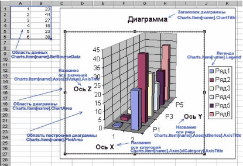

Диаграммы Excel
===============

::: {.date}
01.01.2007
:::

Если информация в виде таблиц не воспринимается так, как хотелось бы, то
представьте ее в виде графика или диаграммы. Графическое отображение
информации усиливает ее восприятие. В Excel есть возможность
программировать отображение информации в виде диаграмм и графиков, и вы
можете воспользоваться этим, чтобы сделать свою программу более
информативной и конкурентно-способной.

Для создания и работы с диаграммами в Excel используется коллекция
Charts объекта Application. Через эту коллекцию мы можем получить полный
доступ ко всем диаграммам и их свойствам. Перед тем, как создавать
диаграмму, рассмотрим ее внешний вид и свойства (см. рис.).

{width="415" height="284"}

Диаграмма представляет собой прямоугольную область, на которой
расположены: область построения диаграммы, заголовок, легенда. В области
построения диаграммы располагается диаграмма и подписи осей, которые
могут быть вынесены за эту область. Исходные данные для построения
диаграммы представляют собой прямоугольную область ячеек листа.

<!-- TOC -->
