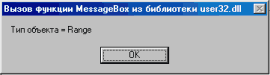
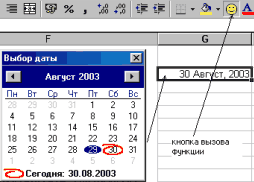
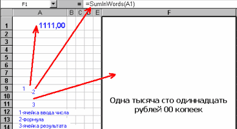

Суперфункции Microsoft Word и Microsoft Excel (статья)
======================================================

::: {.date}
16.06.2003
:::

- [Введение](./)
- [Доступ к ячейкам Excel](cell/)
- [Диаграммы Excel](diagram/)
- [Настройки листа и печать в Excel](print/)
- [Суперфункции (FAQ)](faq/)
- [Как формировать документ в формате Word?](make_doc/)
- [Как создать таблицу в Word'е?](table_in_word/)
- [Рисунки и другие объекты MS Word](word_objects/)
- [Cоздание документа MS Word](create_doc/)
- [Создание DLL-библиотеки для работы с Word / Excel из приложений на Delphi](word_excel_dll/)
- [Создание средствами Delphi DLL-библиотек для использования в макросах Excel](excel_dll/)
- [Суперфункции Excel](excel_superfunc/)
- [Шаблоны и отчеты MS Word](word_templates/)
- [Заключение](conclusion/)

## Создание средствами Delphi DLL-библиотек для использования в макросах Excel

Рассмотрим, как создать (средствами Delphi) и использовать динамическую
библиотеку в макросах книги Excel. Что это дает? Это дает возможность
независимо от разработки основной задачи создавать гибкие отчетные
формы, которые можно быстро перестраивать по желанию ваших
пользователей. Это особенно удобно, когда имеем дело с теми базами
данных, которые плохо согласуются с Excel.

Если перед вами стоит задача по независимой разработке гибких выходных
форм в формате Excel для уже работающих приложений, которые
разрабатывались с использованием языка Delphi, к тому же у вас есть своя
библиотека процедур и функций для этих задач, то вы можете разработать и
использовать динамическую библиотеку непосредственно в макросе документа
Excel.

Мне приходится создавать библиотеки для использования в макросах Excel
для различных задач, связанных с базами данных, и они полностью
оправдали себя, так как на них было потрачено минимум времени, а
результаты были внушительными. В данной статье рассмотрение таких
библиотек, которые были бы связаны с базами данных, не уложится в
ограничительные рамки, поэтому рассмотрим просто несколько полезных
примеров.

Вызов стандартных процедур Windows из макроса Excel

Для начала рассмотрим, как мы можем использовать какую-либо функцию или
процедуру из любой динамической библиотеки и какие ограничения
накладываются на них и на их входные/выходные параметры (переменные).
Во-первых, не все типы переменных можно использовать в таких функциях,
только небольшое количество типов данных в Excel и Delphi могут иметь
общую структуру. Я использую следующие типы данных: String - строка
длиной до 64 Кб или до нескольких ГГб, ограниченная символом CHR(0);
Integer - число в пределах -32768 до 32767; Byte - число от 0 до 255;
Boolean - логическая переменная (True\|False); Variant - тип данных, к
которому относятся все переменные, не описанные явно. Чтобы подробнее
познакомиться с данным вопросом и узнать о всех возможных типах данных,
используйте Help по Excel, раздел "Справочник по Visual Basic". Когда
мы уяснили, какими типами данных мы можем оперировать, попробуем
подключить и вызвать какую-либо функцию или процедуру из стандартной
библиотеки. В качестве примера можем поработать с функцией Messagebox из
состава стандартных динамических библиотек Windows. Функция Messagebox
использует в качестве входных и возвращаемых значений типы Integer и
Pchar. В макросе Excel тип Pchar можно заменить типом String. Прежде чем
обращаться к внешней процедуре в макросе, необходимо ее описать. Приведу
общую структуру описания:

Синтаксис для процедуры:

    Declare Sub имя Lib "Имя Библиотеки" [Alias "псевдоним"] [([списокАргументов])]

Синтаксис для функции:

    Declare Function имя Lib "Имя Библиотеки" [Alias "псевдоним"] [([списокАргументов])] [As тип]

Sub - указывает, что процедура не возвращает значение;

Function - указывает, что процедура возвращает значение, которое может
быть использовано в выражении;

Lib - указывает, что описываемая процедура содержится в динамической
библиотеке;

"Имя библиотеки" - имя динамической библиотеки;

Alias -указывает, что вызываемая процедура имеет другое имя в
библиотеке;

"псевдоним" - имя процедуры в библиотеке;

списокАргументов - список переменных, представляющий аргументы, которые
передаются в процедуру при ее вызове;

тип - тип данных значения, возвращаемого процедурой Function.

В нашем примере мы из Excel вызываем функцию Messagebox. Если
просмотреть входящий в состав Delphi файл Windows.pas, то найдем там
указатель на эту функцию. Используем эту информацию. Итак, мы узнали,
что эта функция входит в состав библиотеки user32.dll, а ее описание
выглядит следующим образом:

    Interface
    ............
    function MessageBoxA(hWnd:HWND;lpText,lpCaption:PAnsiChar;
      uType:UINT):Integer; stdcall;
    ............
    implementation
    ............
    function MessageBoxA; external user32 name 'MessageBoxA';

 

Следовательно, в макросе в объявлении функции мы напишем следующую
строку:

    Declare Function MessageBoxA Lib "user32.dll" (ByVal hwnd
      As Integer, ByVal lpText As String, ByVal lpCaption As
    String, ByVal uType As Integer) As Integer

 

В теле процедуры макроса напишем следующее:

    Public Sub Message()
    Call MessageBoxA(0, "Тип объекта = " + TypeName(Selection),
      "Вызов функции MessageBox из библиотеки user32.dll", 0)
    Call MessageBoxA(0, "Значение ячейки = " + Range("A1").Text,
      "Вызов функции MessageBox из библиотеки user32.dll", 0)
    End Sub

 

Если выполнить этот макрос, то мы получим результат в виде следующего
окна диалога:

{.center}

Разработка в среде Delphi диалогов в динамических процедурах и функциях
и их вызов из макроса Excel

Создадим функцию в составе динамической библиотеки (ее будем
использовать в макросах), содержащую диалог выбора даты, она будет
возвращать дату. Эту функцию будем использовать для записи даты в ячейку
таблицы. Первым шагом будет создание нового проекта LibForOf. Файл
LibForOf.dpr имеет следующий вид:

    library LibForOf;
    uses
     SysUtils,
     Classes,
     st3_2;
    {$R *.RES}
    exports
     GetDateDialog,
     GetSumInWords;
    begin
    end.

 

Подключаемая библиотека st3\_2.pas содержит тексты экспортируемых
процедур. Наша функция выбора даты имеет следующий вид:

    interface
    Function GetDateDialog:variant; Stdcall;
    ...............
    implementation
    ..............
    Function GetDateDialog:variant;
    begin
     Application.CreateForm(TDateDlg_,DateDlg_);
     if DateDlg_.ShowModal=mrOk
      then GetDateDialog:=DateDlg_.MonthCalendar1.Date
      else GetDateDialog:=null;
     DateDlg_.Free;
    End;

 

Где:

Stdcall - директива, определяющая способ передачи данных через стек;

DateDlg\_ - форма - диалог (подробности и исходные тексты - в файле
www.kornjakov.ru/st3\_2.zip).

Для того, чтобы использовать нашу функцию, скопируйте полученный в
результате компиляции файл LibForOf.dll в каталог windows\\system32.
После этого можно приступить к написанию макроса, который будет
использовать данную функцию динамической библиотеки. Вначале опишем
функцию, используя ключевое слово Declare. Описание выглядит следующим
образом:

    Declare Function GetDateDialog Lib "LibForOf.dll" () As Variant

В функцию не передаются параметры, но она возвращает данные - дату. Так
как переменная типа даты может не использоваться для динамических
процедур в ранних версиях Excel, то определим ее тип как variant. После
того, как функция декларирована, приступим к написанию самого макроса.
Он выглядит следующим образом:

    Public Sub DateDialog()
    Selection = GetDateDialog
    End Sub

 

Если этот макрос связать с кнопкой, то ее можно предложить
пользователям. Использование этой функции выглядит следующим образом:

{.center}

Разработка динамических функций в среде Delphi для использования в
формулах, применяемых к ячейкам таблиц Excel

В качестве полезного примера разработаем функцию преобразования числовых
значений валюты в текстовый эквивалент (рубли, копейки). Для простоты
задачи разместим эту функцию в том же модуле, что и функцию в
приведенном выше примере.

    unit st3_2;
    interface
    ..............
    Function GetSumInWords(cur_:currency;
      var stroka_:string):boolean; Stdcall;
    ..............
    implementation
    ..............
    Function GetSumInWords(cur_:currency;
      var stroka_:string):boolean;
    label 1;
    var ss_r,ss_k,rub_,ckop_,kop_:shortstring;
    .................
    begin
     1:
     str_:=currtostr(cur_);
     if str_<>'' then
    ...............................
    End;

 

Полный исходный текст и макросы смотрите на www.kornjakov.ru/st3\_2.zip.

Опишем функцию, используя ключевое слово Declare. Описание выглядит
следующим образом:

    Declare Function GetSumInWords Lib "LibForOf.dll" (ByVal cur As Currency, stroka_ As String) As Boolean

В переменной stroka\_ функция возвращает текстовый эквивалент
передаваемой в первом аргументе суммы. Сам макрос выглядит следующим
образом:

    Public Function SumInWords(cur_ As Currency) As String
    Dim str_ As String
    Call GetSumInWords(cur_, str_)
    SumInWords = str_
    End Function

 

Для того, чтобы наша функция начала работать, в любой ячейке (например,
в F1) вставим формулу вида: =SumInWords(A1) и получим следующий
результат:

{.center}

Как видно из статьи, стандартные средства Excel можно дополнить своими
нестандартными функциями и процедурами, перенести и использовать
собственный опыт по разработке приложений в среде Delphi для создания
отчетов в виде макросов. Используя данный материал, вы сможете создать и
использовать свою персональную динамическую библиотеку для работы не
только с редактором Excel, но и с редактором Word. Полные исходные
тексты с примерами смотрите по адресу www.kornjakov.ru/st3\_2.zip. По
всем вопросам обращайтесь к автору по адресу \_kvn\@mail.ru или
www.kornjakov.ru.

Василий КОРНЯКОВ,  
www.kornjakov.ru,  
<_kvn@mail.ru>
