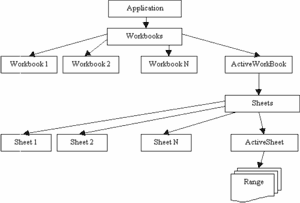

Суперфункции Microsoft Word и Microsoft Excel (статья)
======================================================

::: {.date}
16.06.2003
:::

- [Введение](./)
- [Доступ к ячейкам Excel](cell/)
- [Диаграммы Excel](diagram/)
- [Настройки листа и печать в Excel](print/)
- [Суперфункции (FAQ)](faq/)
- [Как формировать документ в формате Word?](make_doc/)
- [Как создать таблицу в Word'е?](table_in_word/)
- [Рисунки и другие объекты MS Word](word_objects/)
- [Cоздание документа MS Word](create_doc/)
- [Создание DLL-библиотеки для работы с Word / Excel из приложений на Delphi](word_excel_dll/)
- [Создание средствами Delphi DLL-библиотек для использования в макросах Excel](excel_dll/)
- [Суперфункции Excel](excel_superfunc/)
- [Шаблоны и отчеты MS Word](word_templates/)
- [Заключение](conclusion/)

## Суперфункции Excel

Многие программисты и пользователи очень часто предпочитают вместо Word
использовать Excel, потому что он особенно удобен для формирования
сложных табличных отчетов. Если вы работаете с правовыми информационными
системами, то обратили внимание, что все шаблоны, особенно всевозможные
налоговые декларации, выполнены в формате Excel. В этой статье начинаем
создавать отчеты в Excel из приложений, разрабатываемых в Delphi.

При решении широкого круга задач Excel обладает преимуществами по
отношению к Word. Основным является возможность работы с таблицами,
базами данных, большее удобство и гибкость в отображении информации.
Возможно поэтому все большее количество сложных документов выполняются в
формате Excel. Если вы используете Excel для печати отчетов, то ваши
программы приобретут свойства, которые выгодно будут отличать их от
аналогов.

Обратимся к постановке задачи. Нам необходимо сформировать документ из
прикладной программы на языке Delphi. Как это сделать? Табличный
редактор Excel представляет собой COM-сервер и может получать и
обрабатывать запросы от внешних программ. Все это позволяет организовать
процесс управления и создания документа из внешних программ. Используя
этот механизм, можно создать документ программно - так же, как это
делается вручную (посредством меню, кнопок и клавиатуры), но гораздо
быстрей и эффектней.

Основными объектами, к которым можно обращаться из внешних программ,
являются Excel.Application и Excel.Sheet.8. Используя их, можно получить
доступ к объектам документа, например, к ячейкам, рисункам, автофигурам
и к свойствам самого Excel. Используя основные объекты, можно создать и
обращаться к объектам, созданными внешними серверами OLE. Общая
объектная модель Excel представляет древовидную структуру и имеет
следующий общий вид:

{width="300" height="203"}

Корневым объектом является Excel.Application. Коллекция Workbooks
обеспечивает создание и доступ к любой книге, которая открыта в
приложении. Объект Workbook, в свою очередь, содержит коллекцию Sheets,
посредством которой можно создавать, удалять и получить доступ к листам
документа. И конечный объект Range обеспечивает запись информации в
ячейку. Кроме перечисленных, есть и другие объекты, которые будут
рассмотрены в следующих частях статьи.

С чего можно начать программирование? Для начала создадим библиотеку,
файл с расширением MyExcel.pas, и все функции для удобства будем
размещать в ней. Определимся с набором необходимых функций. Самыми
простыми и необходимыми являются следующие: активизация Excel, создание
новой книги, открытие ранее созданной книги, отображение книги (книг) и
приложения Excel, запись информации в ячейку, запись книги на диск и
выход (закрытие книги и приложения). Для создания объекта
Excel.Application используем переменную E типа variant и библиотеку
ComObj.

Рассмотрим следующий фрагмент кода:

    uses ComObj, Classes;
    var E:variant;
    Function CreateExcel:boolean;
    begin
     CreateExcel:=true;
     try
      E:=CreateOleObject('Excel.Application');
     except
      CreateExcel:=false;
     end;
    end;
    End;

Доступ к объекту Excel.Application в нашей функции CreateExcel получаем,
используя процедуру CreateOleObject (\'Excel.Application\') стандартной
библиотеки ComObj. Если редактор Excel не установлен в системе, то будет
сгенерирована ошибка, и мы получим значение функции = false; если Excel
установлен и объект будет создан, то получим значение функции = true.
Эта функция создает объект E, свойства и методы которого мы будем
использовать в дальнейшем. Если выполнить нашу функцию CreateExcel, то
Excel будет запущен, но не будет отображен, потому что по умолчанию он
запускается в фоновом режиме. Чтобы его активизировать (сделать видимым)
или деактивировать (сделать невидимым), используем свойство visible
объекта E. Оформим это в виде функции VisibleExcel. Скобки try except
везде используются для обработки исключительных ситуаций.

    Function VisibleExcel(visible:boolean): boolean;
    begin
     VisibleExcel:=true;
     try
      E.visible:=visible;
     except
      VisibleExcel:=false;
     end;
    End;

Используя эту функцию, мы можем показывать или скрывать Excel с
документами.

Следующим шагом будет создание рабочей книги. Для этого используем метод
Add, коллекции Workbooks объекта E. См. нижеописанный оператор, с
помощью которого мы не только создаем новую книгу, но и получаем на нее
ссылку: book\_:=E. Workbooks.Add.

    Function AddWorkBook:boolean;
    begin
     AddWorkBook:=true;
     try
      E.Workbooks.Add;
     except
      AddWorkBook:=false;
     end;
    End;

Чтобы открыть ранее созданную рабочую книгу, используем ту же коллекцию
Workbooks объекта E и метод Open. Смотрите нижеописанный оператор, с
помощью которого мы открываем рабочую книгу и получаем на нее ссылку:

    book_:= Workbooks. Open(file_)

Функция OpenWorkBook открывает книгу и
возвращает True в случае успешного выполнения.

    Function OpenWorkBook(file_: string):boolean;
    begin
     OpenWorkBook:=true;
     try
      E.Workbooks.Open(file_);
     except
      OpenWorkBook:=false;
     end;
    End;

 

Работая с книгой, мы должны иметь возможность добавлять или удалять в
ней листы и присваивать им имена. Для работы с листами книги
используется коллекция Sheets. Добавить новый лист можно, используя
метод Add этой коллекции. Функция AddSheet реализует эту возможность и
присваивает новому листу выбранное пользователем имя.

    Function AddSheet(newsheet:string):boolean;
    begin
     AddSheet:=true;
     try
      E.Sheets.Add;
      E.ActiveSheet.Name:=newsheet;
     except
      AddSheet:=false;
     end;
    End;

 

Создавая новые листы, мы должны иметь возможность и удалять их. Метод
Delete, коллекции Sheets дает такую возможность. При удалении возможно
появление диалогового окна Excel, которое потребует подтверждения
операции. Чтобы отключить диалоговое окно Excel, необходимо использовать
оператор `E.DisplayAlerts:=False`.

    Function DeleteSheet(sheet:variant):boolean;
    begin
     DeleteSheet:=true;
     try
      E.DisplayAlerts:=False;
      E.Sheets[sheet].Delete;
      E.DisplayAlerts:=True;
     except
      DeleteSheet:=false;
     end;
    End;

 

Обычно книга Excel содержит более одного листа. Их количество содержится
в свойстве Count коллекции Sheets. Для того, чтобы в Visual Basic
получить имена листов текущей книги, используйте следующий оператор:

    For a_ = 1 To Sheets.Count
      MsgBox (Sheets.Item(a_).Name)
      Next a_

Для активации любого листа книги необходимо использовать процедуру
Select. Смотрите пример:

    Sheets.Item(a_).Select

Все описанные выше возможности можно легко реализовать в Delphi как
набор отдельных функций. Смотрите примеры:

    Function CountSheets:integer; // получаем количество листов книги
    begin
    try
    CountSheets:=E.ActiveWorkbook.Sheets.Count;
    except
    CountSheets:=-1;
    end;
    End;
    Function GetSheets(value:TStrings):boolean;
    // записываем листы книги в value
    var a_:integer;
    begin
    GetSheets:=true;
    value.Clear;
    try
    for a_:=1 to E.ActiveWorkbook.Sheets.Count do
    value.Add(E.ActiveWorkbook.Sheets.Item[a_].Name);
    except
    GetSheets:=false;
    value.Clear;
    end;
    End;
    Function SelectSheet (sheet:variant):boolean;
    // выбираем лист
    begin
    SelectSheet:=true;
    try
    E.ActiveWorkbook.Sheets.Item[sheet].Select;
    except
    SelectSheet:=false;
    end;
    End;

 

После внесения изменений необходимо сохранить рабочую книгу. Для этого
используем метод SaveAs коллекции Workbooks или объекта ActiveWorkbook.
Функция SaveWorkBookAs реализует эту возможность на Delphi. Используем
`E.DisplayAlerts:=False(True)` для отключения (включения) диалогового окна
подтверждения записи.

    Function SaveWorkBookAs(file_:string): boolean;
    begin
    SaveWorkBookAs:=true;
    try
    E.DisplayAlerts:=False;
    E.ActiveWorkbook.SaveAs(file_);
    E.DisplayAlerts:=True;
    except
    SaveWorkBookAs:=false;
    end;
    End;

 

Одновременно может быть открыто несколько книг, в которые вносится или
из которых получается информация. Их количество содержится в свойстве
Count коллекции WorkBooks. Используя следующий оператор на Visual Basic,
можем получить их имена.

    For a_ = 1 To Application.Workbooks.Count
      MsgBox (Application.Workbooks.Item(a_).Name)
      Next a_

Для активации любой книги из списка используем процедуру Activate.
Смотрите пример:

    Windows("Книга1").Activate

Эти возможности можно реализовать в Delphi как набор отдельных функций.

Для закрытия книги используется метод Close коллекции Workbooks или
объекта ActiveWorkbook. Функция CloseWorkBook закрывает активный
документ.

    Function CloseWorkBook:boolean;
    begin
     CloseWorkBook:=true;
     try
      E.ActiveWorkbook.Close;
     except
      CloseWorkBook:=false;
     end;
    End;

 

Excel закрывается методом Quit объекта Application.

    Function CloseExcel:boolean;
    begin
     CloseExcel:=true;
     try
      E.Quit;
     except
      CloseExcel:=false;
     end;
    End;

 

После того, как создан минимальный набор функций, можно переходить к
демонстрации возможностей программирования Excel. Для этого создадим
форму и разместим на ней кнопку. В программной части укажем ссылку на
используемую библиотеку MyExcel, в процедуре отклика на нажатие запишем
следующий программный текст:

    procedure TForm1.Button1Click (Sender: TObject);
     var a_:integer;
    begin
     if not CreateExcel then exit;
     messagebox(handle,'','Запускаем Excel.',0);
     VisibleExcel(true);
     messagebox(handle,'','Отобразили Excel на экране.',0);
     if AddWorkBook then begin
      messagebox(handle,'','Создали новую книгу.',0);
      AddSheet('Новый лист');
      messagebox(handle,'','Добавили новый лист.',0);
      DeleteSheet(2);
      messagebox(handle,'','Удалили лист №2.',0);
      GetSheets(ListBox1.Items);
      messagebox(handle,'','Получили список листов!',0);
      for a_:=1 to CountSheets do begin
       ListBox1.ItemIndex:=a_-1;
       SelectSheet(ListBox1. Items.Strings[a_-1]);
       messagebox(handle,'',
        pchar('Выбираем лист '+ListBox1.Items.Strings[a_-1]+'!'),0);
      end;
      SaveWorkBookAs('c:\1.xls');
      messagebox(handle,'','Сохранили книгу как "c:\1.xls".',0);
      CloseWorkBook;
      messagebox(handle,'','Закрыли книгу "c:\1.xls".',0);
     end;
     CloseExcel;
    end;

 

Мы рассмотрели общий вид объектной модели Excel и примеры нескольких
функций работы с книгами и листами. Далее изучим вопросы записи (чтения)
информации в ячейки и программирование их свойств. По всем вопросам Вы
можете обратиться к автору по адресу \_kvn\@mail.ru или
www.kornjakov.ru.

Василий КОРНЯКОВ,  
www.kornjakov.ru,  
<_kvn@mail.ru>

### Литература:

- Н. Елманова, С. Трепалин, А.Тенцер - "Delphi 6 и технология COM", "Питер", 2002.
