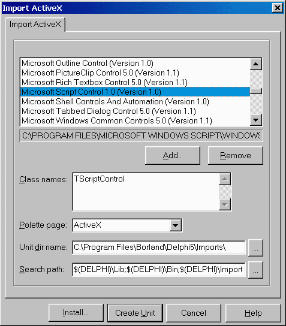

Использование Microsoft ScriptControl
=====================================

::: {.date}
01.01.2007
:::

Использование Microsoft ScriptControl

Анатолий Тенцер

 

Содержание

 

Введение

Добавление TScriptControl в программу

Импорт ActiveX-сервера

Настройка свойств и вызов скриптов

Интеграция TScriptControl с VCL

Модель расширения TScriptControl

Интерфейс IDispatch

function GetIdsOfNames

function Invoke

Информация RTTI Delphi

Сводим воедино

Пишем GetIdsOfNames

Пишем Invoke

Оператор For Each

Интерфейс IEnumVariant

Класс TVCLEnumerator

Компонент TVCLScriptControl

Заключение

Введение

 

При разработке настраиваемых информационных систем часто возникает
необходимость добавить в свою программу встроенный язык
программирования. Такой язык позволял бы конечным пользователям
настраивать поведение программы без участия автора и перекомпиляции.
Однако самостоятельная реализация интерпретатора является непосильной
для многих разработчиков задачей, а от большинства остальных потребует
очень много времени и усилий.

В то же время в Windows, как правило, уже имеется достаточно
качественный интерпретатор, который может быть легко встроен в вашу
программу. Речь идет о Microsoft ScriptControl. Он устанавливается
вместе с Microsoft Internet Explorer, входит в Windows 2000 и Windows
98, а для младших версий доступен в виде свободно распространяемого
отдельного дистрибутива, объем которого составляет около 200 Кбайт. Его
можно получить по адресу http://msdn.microsoft.com/scripting или
установить с нашего компакт-диска. В дистрибутив входят
ActiveX-компонент и файл помощи с описанием его свойств и методов.

Добавление TScriptControl в программу

 

Импорт ActiveX-сервера

 

Чтобы добавить Microsoft ScriptControl на палитру компонентов Delphi,
необходимо импортировать компонент ActiveX под названием Microsoft
ScriptControl.

{width="477" height="544"}

После этого на закладке ActiveX появится невизуальный компонент
TScriptControl, который можно разместить на форме.

Настройка свойств и вызов скриптов

 

Рассмотрим ключевые свойства и методы TScriptControl.

property Language: String

Задает язык, интерпретатор которого будет реализовывать компонент. В
стандартной поставке доступны VBScript и JScript, однако, если в вашей
системе установлены расширения Windows Scripting, возможно использование
других языков, таких как Perl или Rexx.

property Timeout: Integer

Задает интервал исполнения скрипта, по истечении которого генерируется
ошибка. Значение --1 позволяет отключить ошибки, связанные с истечением
отведенного времени (timeout), что позволит скрипту исполняться
неограниченное время.

property UseSafeSubset: Boolean

При установке этого свойства в TRUE компонент может выполнять
ограниченный набор действий, заданный текущими установками безопасности
в системе. Это свойство полезно, если вы запускаете скрипты, полученные,
например, через Интернет.

procedure AddCode(const Code: WideString);

Добавляет код, заданный параметром к списку процедур компонента. В
дальнейшем эти процедуры могут быть вызваны при помощи метода Run либо
из других процедур скрипта.

ScriptControl1.AddCode(Memo1.Text); 

function Eval(const Expression: WideString): OleVariant

Выполняет код, заданный в параметре Expression, и возвращает результат
исполнения. Позволяет выполнить код без добавления его к списку процедур
компонента.

procedure AddObject(const Name: WideString; Object\_: IDispatch;
AddMembers: WordBool);

Добавляет объект к пространству имен компонента. Объект должен быть
сервером автоматизации. Добавленный объект доступен как объект в коде
скрипта. Например, если в программе создан сервер автоматизации
External, реализующий метод DoSomething(Value: Integer), то, добавив
объект

ScriptControl1.AddObject('External', TExternal as IDispatch, FALSE); 

мы можем в коде скрипта использовать его следующим образом:

Dim I

I = 8 + External.DoSomething(8) 

function Run(const ProcedureName: WideString; var Parameters:
PSafeArray): OleVariant;

Выполняет именованную процедуру из числа ранее добавленных при помощи
метода AddCode. В массиве Parameters могут быть переданы параметры.

procedure Reset;

Сбрасывает компонент в начальное состояние, удаляя все добавленные ранее
объекты и код.

Таким образом, TScriptControl представляет собой достаточно гибкую
исполняющую систему с возможностями расширения путем добавления в ее
пространство имен серверов автоматизации.

Интеграция TScriptControl с VCL

В существующем виде возможности TScriptControl сильно ограничены сложным
доступом к классам VCL. Исполнение интерпретируемого кода -- это хорошо,
однако хотелось бы иметь возможность обращаться из него к компонентам в
программе, получать и устанавливать их свойства, обрабатывать
возникающие в них события, например, следующим образом:

    Sub Main()
       Dim Control
       Control = Self.Controls("Panel2")
       Control.Add "Panel3", "TPanel"
       With Panel3
         .Align = "alTop"
         .BevelOuter = "bvNone"
         .Height = 40
         .Caption = ""
         .Add "Btn", "TButton", True
         With Btn
          .Top = 10
          .Left = .Top
          .Caption = "Click me"
         End With
     
       End With
     End Sub  
    Sub Btn_OnClick()
       Dim StatusBar
       Dim Panel
       Dim I
       I = 0
       For Each Panel In StatusBar.Panels
         I = I + 1
         With Panel
           .Text = .Text & " " & CStr(I)
         End With
       Next
     End Sub  

Следующая часть главы посвящена реализации такой функциональности,
однако прежде чем приступить к ее исполнению, необходимо более подробно
рассмотреть некоторые механизмы, лежащие в основе модели расширения
TScriptControl и VCL.

Модель расширения TScriptControl

Как уже было сказано выше, Microsoft ScriptControl позволяет сделать
доступными из скрипта объекты, реализованные в программе при помощи
метода AddObject. При обращении к таким объектам он предполагает, что
они реализуют интерфейс IDispatch и являются, таким образом, серверами
автоматизации. В Delphi в качестве таких объектов могут выступать
наследники TAutoObject, создать которые можно при помощи мастера,
вызываемого из меню File -\> New -\> ActiveX -\> Automation Object. При
вызове методов этих объектов ScriptControl последовательно вызывает
методы GetIdsOfNames и Invoke их интерфейса IDispatch, что обеспечивает
вызовы соответствующих методов объекта. Однако здесь имеются
определенные сложности:

::: {style="text-align: left; text-indent: 0px; padding: 0px 0px 0px 0px; margin: 7px 0px 7px 24px;"}
  --- ------------------------------------------------------------------------------------------------------------------------------------------------------------------------------------------------------------------------------------------------------------------------------------------------------------------------------------------------------------------------------------------------------------------------------------------------
  ·   По окончании работы с объектом (например, при выходе его за пределы области видимости процедуры скрипта) TScriptControl автоматически вызывает его метод \_Release, что приводит к уничтожению класса Delphi. Таким образом, для каждого класса приходится создавать некий объект-представитель, который бы транслировал вызовы TScriptControl в методы и свойства класса Delphi, а став ненужным --- уничтожался, не уничтожая самого класса.
  --- ------------------------------------------------------------------------------------------------------------------------------------------------------------------------------------------------------------------------------------------------------------------------------------------------------------------------------------------------------------------------------------------------------------------------------------------------
:::

::: {style="text-align: left; text-indent: 0px; padding: 0px 0px 0px 0px; margin: 7px 0px 7px 24px;"}
  --- --------------------------------------------------------------------------------------------------------------------------------------------------------------------------------------------------------------------------------------------------------------------------------------------------------------------------------
  ·   Функциональность наследников TAutoObject задается на этапе компиляции и не может быть расширена в процессе исполнения программы. Это требует создания отдельных представителей для каждого класса VCL, что очень сложно осуществить, к тому же при этом нельзя использовать классы, не имеющие соответствующего представителя.
  --- --------------------------------------------------------------------------------------------------------------------------------------------------------------------------------------------------------------------------------------------------------------------------------------------------------------------------------
:::

Чтобы найти обходные пути для решения этой проблемы, необходимо более
детально вникнуть в реализацию базового интерфейса, лежащего в основе
автоматизации.

Интерфейс IDispatch

Интерфейс IDispatch обеспечивает возможность позднего связывания, то
есть вызовов методов объектов не по адресам, а по именам на этапе
выполнения программы. Интерфейс определен как:

      IDispatch = (IUnknown)
           ['{00020400-0000-0000-C000-000000000046}']
           GetTypeInfoCount( Count: Integer): Integer; ;
           GetTypeInfo(Index, LocaleID: Integer;
             TypeInfo): Integer; ;
           GetIDsOfNames( IID: TGUID; Names: Pointer;
             NameCount, LocaleID: Integer; DispIDs: Pointer):    Integer;
             ;
           Invoke(DispID: Integer; IID: TGUID;
             LocaleID: Integer; Flags: Word; var Params; VarResult,
             ExcepInfo, ArgErr: Pointer): Integer; ;
         ; 

Ключевыми методами интерфейса являются GetIdsOfNames и Invoke.

function GetIdsOfNames

Этот метод осуществляет трансляцию имен методов и свойств объекта
автоматизации в целочисленные идентификаторы. Если OLE пытается
разрешить ссылку вида:

SomeObject.DoSomeThing

то у SomeObject запрашивается интерфейс IDispatch, вызывается метод
GetIdsOfNames, которому передаются ссылка на массив имен, требующих
разрешения в параметре Names, количество имен в параметре NameCount и
региональный контекст в параметре LocaleId. Метод должен заполнить
массив, на который указывает параметр DispIds, значениями
идентификаторов имен. Объект имеет возможность предоставить разные имена
методов для каждого поддерживаемого языка. Если это не требуется ---
параметр LocaleId можно игнорировать.

Стандартная реализация IDispatch ищет информацию об именах методов и их
идентификаторах в библиотеке типов объекта, однако программист вполне
может взять эту работу на себя и осуществлять самостоятельную
трансляцию.

function Invoke

После получения идентификатора запрошенного метода OLE вызывает функцию
Invoke, передавая в нее:

DispID

Идентификатор вызываемого метода или свойства, полученный от
GetIdsOfNames.

LocaleId

Региональный контекст (тот же, что и в GetIdsOfNames).

Flags

Битовая маска, состоящая из следующих флагов:

    +-----------------------------------+-----------------------------------+
    | DISPATCH\_METHOD                  | Вызывается метод. Если у объекта  |
    |                                   | есть свойство с таким же именем,  |
    |                                   | то будет установлен также флаг    |
    |                                   | DISPATCH\_PROPERTYGET             |
    +-----------------------------------+-----------------------------------+
    | DISPATCH\_PROPERTYGET             | Запрашивается значение свойства   |
    +-----------------------------------+-----------------------------------+
    | DISPATCH\_PROPERTYPUT             | Устанавливается значение свойства |
    +-----------------------------------+-----------------------------------+
    | DISPATCH\_PROPERTYPUTREF          | Параметр передается по ссылке.    |
    |                                   | Если флаг не установлен -- по     |
    |                                   | значению.                         |
    +-----------------------------------+-----------------------------------+

Params

Структура DISPPARAMS, содержащая массив параметров, массив
идентификаторов для именованных параметров и количества элементов в этих
массивах. Параметры передаются в порядке, обратном порядку их следования
в функции, как это принято в Visual Basic.

VarResult

Адрес переменной типа OleVariant, в которую должны быть помещены
результат вызова метода, или значение свойства, или , если возвращаемое
значение не требуется.

ExcepInfo

Адрес структуры EXCEPTINFO, которую метод должен заполнить информацией
об ошибке, если она возникнет.

ArgErr

Адрес массива, в который должны быть помещены индексы неверных
параметров, в случае если такая ситуация будет обнаружена.

При вызове Invoke не осуществляется никаких проверок, поэтому в ходе его
самостоятельной реализации необходимо соблюдать аккуратность при работе
с переданными адресами массивов и переменных.

Как видно из описания Idispatch, имеется возможность самостоятельно
реализовать этот интерфейс, динамически преобразуя обращения к объекту
автоматизации в обращения к соответствующим свойствам классов Delphi.

Информация RTTI Delphi

Delphi имеет свой внутренний протокол, позволяющий осуществлять
обращение к опубликованным (объявленным в секции published) свойствам и
методам класса. Этой цели служат функции модуля TypInfo.pas. Ключевой
является функция

GetPropInfo(TypeInfo: PTypeInfo;

   PropName: ): PPropInfo; 

которая позволяет по имени свойства получить адрес структуры PPropInfo,
содержащей информацию о свойстве. В дальнейшем можно получить значение
этого свойства при помощи функций GetXXXProp или установить его
функциями SetXXXProp. При этом будут корректно вызваны функции получения
или установки свойства. Таким образом, по имени свойства можно
определить его наличие и установить или получить его значение. Такая
возможность позволяет создать реализацию IDispatch, динамически
транслирующую обращения к свойствам зарегистрированного в TScriptControl
объекта автоматизации в обращения к свойствам связанного с ним
экземпляра класса VCL.

Сводим воедино

 

Итак, как показано выше, RTTI Delphi предоставляет достаточную
функциональность для того, чтобы обеспечить трансляцию вызовов
OLE-Automation в обращения к свойствам компонентов VCL. Для этого
необходимо:

::: {style="text-align: left; text-indent: 0px; padding: 0px 0px 0px 0px; margin: 7px 0px 7px 24px;"}
  --- --------------------------------------------------------------------------------------------------------------------------------------------------------------------------------------------------------------------------------------------------------------------
  ·   В методе GetIdsOfNames проверить существование свойства при помощи функции GetPropInfo и, если такое свойство найдено, вернуть какой-нибудь числовой идентификатор. В роли такого идентификатора удобно использовать результат, возвращаемый функцией GetPropInfo.
  --- --------------------------------------------------------------------------------------------------------------------------------------------------------------------------------------------------------------------------------------------------------------------
:::

::: {style="text-align: left; text-indent: 0px; padding: 0px 0px 0px 0px; margin: 7px 0px 7px 24px;"}
  --- ---------------------------------------------------------------------------------------------------------
  ·   В методе Invoke установить или получить значение свойства, используя функции GetXXXProp или SetXXXProp.
  --- ---------------------------------------------------------------------------------------------------------
:::

Для трансляции вызовов OLE в VCL создадим класс TVCLProxy:

      // Этот интерфейс понадобится для получения ссылки на
       // класс VCL из методов, в которые передается его
       // интерфейс IDispatch
       IQueryPersistent = 
      ['{26F5B6E1-9DA5-11D3-BCAD-00902759A497}']
          GetPersistent: TPersistent;
       ;
     
       TVCLProxy = (TInterfacedObject, IDispatch, IQueryPersistent)
     
         FOwner: TPersistent;
         FScriptControl: TVCLScriptControl;
          DoCreateControl(AName, AClassName: WideString;
           WithEvents: Boolean);
          SetVCLProperty(PropInfo: PPropInfo;
           Argument: TVariantArg): HRESULT;
         GetVCLProperty(PropInfo: PPropInfo; dps: TDispParams;
           PDispIds: PDispIdList; var Value: OleVariant): HRESULT;
         { IDispatch }
          GetTypeInfoCount(out Count: Integer): HResult; ;
          GetTypeInfo(Index, LocaleID: Integer;
            TypeInfo): HResult; ;
          GetIDsOfNames( IID: TGUID; Names: Pointer;
           NameCount, LocaleID: Integer;
           DispIDs: Pointer): HResult; ;
          Invoke(DispID: Integer;  IID: TGUID;
           LocaleID: Integer; Flags: Word;  Params;
           VarResult, ExcepInfo, ArgErr: Pointer): HResult; ;
         { IQueryPersistent }
          GetPersistent: TPersistent;
     
          DoInvoke (DispID: Integer;  IID: TGUID;
           LocaleID: Integer; Flags: Word; var dps : TDispParams;
           pDispIds : PDispIdList; VarResult, ExcepInfo,
           ArgErr: Pointer): HResult; ;
     
          Create(AOwner: TPersistent;
           ScriptControl: TVCLScriptControl);
          Destroy; ;
       ;  

Экземпляр этого класса создается при регистрации объекта в
TScriptControl и уничтожается автоматически, когда потребность в нем
исчезает.

Поле FOwner хранит ссылку на экземпляр класса VCL, интерфейс к которому
предоставляет объект, зарегистрированный в TScriptControl.
TVCLScriptControl -- это наследник TScriptControl.

Главным его отличием является наличие списка зарегистрированных
экземпляров TVCLProxy и обработчиков событий, позволяющих компонентам
VCL вызывать методы скрипта.

Пишем GetIdsOfNames

В методе GetIdsOfNames мы должны проверить наличие запрошенного свойства
и вернуть адрес его структуры TPropInfo, если такое свойство найдено.

Свойства компонентов VCL

     TVCLProxy.GetIDsOfNames( IID: TGUID; Names: Pointer;
       NameCount, LocaleID: Integer; DispIDs: Pointer): HResult;
     
       S: ;
       Info: PPropInfo;
     
       Result := S_OK;
       // Получаем имя функции или свойства
       S := PNamesArray(Names)[0];
       // Проверяем, есть ли VCL-свойство с таким же именем
       Info := GetPropInfo(FOwner.ClassInfo, S);
        Assigned(Info) 
         // Свойство есть, возвращаем в качестве DispId
         // адрес структуры PropInfo
         PDispIdsArray(DispIds)[0] := Integer(Info);

Дополнительные функции

Дополним нашу реализацию возможностью вызова некоторых дополнительных
функций:

Controls

Для наследников TWinControl возвращает ссылку на дочерний компонент с
именем или индексом, заданным в параметре.

Count

Для компонентов TWinControl -- возвращает количество дочерних
компонентов.

Для TCollection -- возвращает количество элементов.

Для TStrings -- возвращает количество строк.

Add

Для компонентов TWinControl -- создает дочерний компонент.

Для TCollection -- добавляет элемент в коллекцию.

Для TStrings -- добавляет строку.

HasProperty

Возвращает истину, если у объекта есть свойство с заданным именем.

Для этого дополним метод GetIdsOfNames следующим кодом:

      // Нет такого свойства, проверяем, не имя ли это
       // одной из определенных нами функций
        CompareText(S, 'CONTROLS') = 0 
          (FOwner  TWinControl) 
           PDispIdsArray(DispIds)[0] := DISPID_CONTROLS
     
           Result := DISP_E_UNKNOWNNAME;
     
     
       CompareText(S, 'COUNT') = 0 
          (FOwner  TCollection)  (FOwner  TStrings)
             (FOwner  TWinControl) 
           PDispIdsArray(DispIds)[0] := DISPID_COUNT
     
           Result := DISP_E_UNKNOWNNAME;
     
       CompareText(S, 'ADD') = 0 
         Result := S_OK;
          (FOwner  TCollection)  (FOwner  TStrings) 
            (FOwner  TWinControl) 
           PDispIdsArray(DispIds)[0] := DISPID_ADD
     
           Result := DISP_E_UNKNOWNNAME;
     
       CompareText(S, 'HASPROPERTY') = 0 
         PDispIdsArray(DispIds)[0] := DISPID_HASPROPERTY
     
         Result := DISP_E_UNKNOWNNAME;
     ;  

Константы DISPID\_CONTROLS, DISPID\_COUNT и т.д. определены как целые
числа из диапазона 1...1 000 000. Это вполне безопасно, поскольку адрес
структуры TPropInfo никак не может оказаться менее 1 Мбайт.

Пишем Invoke

Первая часть задачи выполнена: мы проинформировали OLE о наличии в нашем
сервере автоматизации поддерживаемых функций. Теперь необходимо
реализовать метод Invoke для выполнения этих функций. Из соображений
модульности Invoke выполняет подготовительную работу со списком
параметров и вызывает метод DoInvoke, в котором мы осуществляем
трансляцию DispID в обращения к методам класса VCL.

В методе используются три служебные функции:

::: {style="text-align: left; text-indent: 0px; padding: 0px 0px 0px 0px; margin: 7px 0px 7px 24px;"}
  --- ---------------------------------------------
  ·   проверяет количество переданных аргументов.
  --- ---------------------------------------------
:::

::: {style="text-align: left; text-indent: 0px; padding: 0px 0px 0px 0px; margin: 7px 0px 7px 24px;"}
  --- ----------------------------------------------------------------------
  ·   проверяет соответствие аргумента с заданным индексом заданному типу.
  --- ----------------------------------------------------------------------
:::

::: {style="text-align: left; text-indent: 0px; padding: 0px 0px 0px 0px; margin: 7px 0px 7px 24px;"}
  --- --------------------------------------------------------
  ·   получает целое число из аргумента с заданным индексом.
  --- --------------------------------------------------------
:::

TVCLProxy.DoInvoke(DispID: Integer;  IID: TGUID;

  LocaleID: Integer; Flags: Word;  dps: TDispParams;

  pDispIds: PDispIdList; VarResult, ExcepInfo, ArgErr: Pointer

  ): HResult;

  S: ;

  Put: Boolean;

  I: Integer;

  P: TPersistent;

  B: Boolean;

  OutValue: OleVariant; 

  Result := S\_OK;

   DispId

Для функции Controls мы должны проверить, что передан один параметр.
Если он строковый --- поиск дочернего компонента будет происходить по
имени, в противном случае --- по индексу. Если компонент найден --
вызывается функция FScriptControl.GetProxy, которая проверяет наличие
«представителя» у этого компонента, при необходимости создает его и
возвращает интерфейс IDispatch. Такой алгоритм необходим для корректной
работы оператора VBScript Is, который сравнивает две ссылки на объект и
выдает истину в случае, если речь идет об одном и том же объекте,
например:

Dim A

Dim B

Set A = C

Set B = C

If A is B Then ... 

Если создавать экземпляр класса TVCLProxy каждый раз, когда
запрашивается ссылка, эти экземпляры окажутся разными и оператор Is не
будет работать.

       DISPID_CONTROLS:
            // Вызвана функция Controls
              FOwner  TWinControl 
     
               // Проверяем параметр
               CheckArgCount(dps.cArgs, [1], TRUE);
               P := ;
                _ValidType(0, VT_BSTR, FALSE) 
                 // Если параметр - строка - ищем дочерний компонент
                 // с таким именем
                 S := dps.rgvarg^[pDispIds^[0]].bstrVal;
                  I := 0  Pred(ControlCount) 
                    CompareText(S, Controls[I].Name) = 0 
                     P := Controls[I];
                     Break;
                   ;
     
                 // Иначе - параметр - число, берем компонент по индексу
                 I := _IntValue(0);
                 P := Controls[I];
               ;
               Assigned(P) 
                 // Компонент не найден
                  EInvalidParamType.Create('');
               // Возвращаем интерфейс IDispatch для найденного компонента
               OleVariant(VarResult^) := FScriptControl.GetProxy(P);
             ;
           ;  

Функция Count должна вызываться без параметров и призвана возвращать
количество элементов в запрашиваемом объекте.

       DISPID_COUNT:
            // Вызвана функция Count
             // Проверяем, что не было параметров
             CheckArgCount(dps.cArgs, [0], TRUE);
              FOwner  TWinControl 
               // Возвращаем количество дочерних компонентов
               OleVariant(VarResult^) := TWinControl(FOwner).ControlCount;
     
              FOwner  TCollection 
               // Возвращаем количество элементов коллекции
               OleVariant(VarResult^) := TCollection(FOwner).Count
     
              FOwner  TStrings 
               // Возвращаем количество строк
               OleVariant(VarResult^) := TStrings(FOwner).Count;
           ;  

Метод Add добавляет элемент к объекту-владельцу «представителя».
Обратите внимание на реализацию необязательных параметров для
TWinControl и TStrings.

       DISPID_ADD:
             // Вызвана функция Add
              FOwner  TWinControl 
               // Проверяем количество аргументов
               CheckArgCount(dps.cArgs, [2,3], TRUE);
               // Проверяем типы обязательных аргументов
               _ValidType(0, VT_BSTR, TRUE);
               _ValidType(1, VT_BSTR, TRUE);
               // Третий аргумент - необязательный, если он не задан -
               // полагаем FALSE
                (dps.cArgs = 3)  _ValidType(2, VT_BOOL, TRUE) 
                 B := dps.rgvarg^[pDispIds^[0]].vbool
     
                 B := FALSE;
               // Вызываем метод для создания компонента
               DoCreateControl(dps.rgvarg^[pDispIds^[0]].bstrVal,
                 dps.rgvarg^[pDispIds^[1]].bstrVal, B);
     
     
              FOwner  TCollection 
               // Добавляем компонент
               P := TCollection(FOwner).Add;
               // И возвращаем его интерфейс IDispatch
               OleVariant(varResult^) := FScriptControl.GetProxy(P);
     
              FOwner  TStrings 
               // Проверяем наличие аргументов
               CheckArgCount(dps.cArgs, [1,2], TRUE);
               // Проверяем, что аргумент – строка
               _ValidType(0, VT_BSTR, TRUE);
                dps.cArgs = 2 then
                 // Второй аргумент - позиция в списке
                 I := _IntValue(1)
     
                 // Если его нет - вставляем в конец
                 I := TStrings(FOwner).Count;
               // Добавляем строку
               TStrings(FOwner).Insert(I,
                 dps.rgvarg^[pDispIds^[0]].bstrVal);
             ;
           ;  

И наконец, функция HasProperty проверяет наличие у объекта VCL
опубликованного свойства с заданным именем.

       DISPID_HASPROPERTY:
           // Вызвана функция HasProperty
             // Проверяем наличие аргумента
             CheckArgCount(dps.cArgs, [1], TRUE);
             // Проверяем тип аргумента
             _ValidType(0, VT_BSTR, TRUE);
             S := dps.rgvarg^[pDispIds^[0]].bstrVal;
             // Возвращаем True, если свойство есть
             OleVariant(varResult^) :=
               Assigned(GetPropInfo(FOwner.ClassInfo, S));
           ;  

Если ни один из DispID не обработан --- значит DispID содержит адрес
структуры TPropInfo свойства VCL

          // Это не наша функция, значит это свойство
         // Проверяем Flags, чтобы узнать, устанавливается значение
         // или получается
         Put := (Flags  DISPATCH_PROPERTYPUT) <> 0;
          Put 
           // Устанавливаем значение
           // Проверяем наличие аргумента
           CheckArgCount(dps.cArgs, [1], TRUE);
           // И устанавливаем свойство
           Result := SetVCLProperty(PPropInfo(DispId),
             dps.rgvarg^[pDispIds^[0]])
     
           // Получаем значение
            DispId = 0 
             // DispId = 0 - требуется свойство по умолчанию
             // Возвращаем свой IDispatch
             OleVariant(VarResult^) := Self  IDispatch;
             Exit;
           ;
           // Получаем значение свойства
           Result := GetVCLProperty(PPropInfo(DispId),
             dps, pDispIds, OutValue);
            Result = S_OK 
             // Получили успешно - сохраняем результат
             OleVariant(VarResult^) := OutValue;
         ;
       ;
     ;  

Добавление собственных функций

Для добавления функций, которые требуются для решения ваших задач,
необходимо выполнить ряд простых шагов:

::: {style="text-align: left; text-indent: 0px; padding: 0px 0px 0px 0px; margin: 7px 0px 7px 24px;"}
  --- -----------------------------------------------------------------------------------------------------------------------------------------------------
  ·   В методе GetIdsOfNames проанализировать имя запрашиваемой функции и определить, может ли она быть вызвана для объекта, на который ссылается FOwner.
  --- -----------------------------------------------------------------------------------------------------------------------------------------------------
:::

::: {style="text-align: left; text-indent: 0px; padding: 0px 0px 0px 0px; margin: 7px 0px 7px 24px;"}
  --- ---------------------------------------------------------------------------------------------------------------------------------------
  ·   Если функция может быть вызвана, вы должны вернуть уникальный DispID, в противном случае -- присвоить Result := DISP\_E\_UNKNOWNNAME.
  --- ---------------------------------------------------------------------------------------------------------------------------------------
:::

::: {style="text-align: left; text-indent: 0px; padding: 0px 0px 0px 0px; margin: 7px 0px 7px 24px;"}
  --- ---------------------------------------------------------------------------------------------------------------------------------------------
  ·   В методе Invoke необходимо обнаружить свой DispID, проверить корректность переданных параметров, получить их значения и выполнить действие.
  --- ---------------------------------------------------------------------------------------------------------------------------------------------
:::

Обработка событий в компонентах VCL

Важным дополнением к реализуемой функциональности является возможность
ассоциировать процедуру на VBScript с событием в компоненте VCL, таким
как OnEnter, OnClick или OnTimer. Для этого добавим в компонент
TVCLScriptControl методы, которые будут служить обработчиками созданных
в коде скрипта компонентов.

      TVCLScriptControl = (TScriptControl)
       …
     
          OnChangeHandler(Sender: TObject);
          OnClickHandler(Sender: TObject);
          OnEnterHandler(Sender: TObject);
          OnExitHandler(Sender: TObject);
          OnTimerHandler(Sender: TObject);
       ;

В методе DoCreateControl, который вызывается из DoInvoke при обработке
метода «Add», реализуем подключение соответствующих обработчиков событий
создаваемого компонента к созданным методам.

    TVCLProxy.DoCreateControl(AName, AClassName: WideString;
       WithEvents: Boolean);
     
        SetHandler(Control: TPersistent; Owner: TObject;
         Name: String);
         // Функция устанавливает обработчик события Name на метод формы
         // с именем Name + 'Handler'
     
         Method: TMethod;
         PropInfo: PPropInfo;
     
         // Получаем информацию RTTI
         PropInfo := GetPropInfo(Control.ClassInfo, Name);
          Assigned(PropInfo) 
           // Получаем адрес обработчика
           Method.Code := FScriptControl.MethodAddress(Name + 'Handler');
           Assigned(Method.Code) 
             // Обработчик есть
             Method.Data := FScriptControl;
             // Устанавливаем обработчик
             SetMethodProp(Control, PropInfo, Method);
           ;
         ;
       ;
     
     
       ThisClass: TControlClass;
       C: TComponent;
       NewOwner: TCustomForm;
     
       // Назначаем свойство Owner на форму
       (FOwner  TCustomForm) 
         NewOwner := GetParentForm(FOwner  TControl)
     
         NewOwner := FOwner  TCustomForm;
       // Получаем класс создаваемого компонента
       ThisClass := TControlClass(GetClass(AClassName));
       // Создаем компонент
       C := ThisClass.Create(NewOwner);
       // Назначаем имя
       C.Name := AName;
        C  TControl 
         // Назначаем свойство Parent
         TControl(C).Parent := FOwner  TWinControl;
        WithEvents 
         // Устанавливаем обработчики
         SetHandler(C, NewOwner, 'OnClick');
         SetHandler(C, NewOwner, 'OnChange');
         SetHandler(C, NewOwner, 'OnEnter');
         SetHandler(C, NewOwner, 'OnExit');
         SetHandler(C, NewOwner, 'OnTimer');
       ;
       // Создаем класс, реализующий интерфейс Idispatch, и добавляем его
       // в пространство имен TScriptControl
       FScriptControl.RegisterClass(AName, C);
     ;  
    Таким образом, если третьим параметром метода «Add» будет задано True, то TVCLScriptControl установит обработчики событий OnClick, OnChange, OnEnter, OnExit и OnTimer на свои методы, реализованные следующим образом: 
     TVCLScriptControl.OnClickHandler(Sender: TObject);
     
       RunProc((Sender  TComponent).Name + '_' + 'OnClick');
     ;  

Примером использования данной функциональности может служить следующий
код:

    Sub Main()
     
       Self.Add "Timer1", "TTimer", TRUE
       With Timer1
         .Interval = 1000
         .Enabled = True
       End With
     
     End Sub
     
     Sub Timer1_OnTimer()
     
       Self.Caption = CStr(Time)
     
     End Sub  

Если требуется назначить обработчики событий, имеющихся на форме
компонентов, это может быть сделано в коде

Button1.OnClick := ScriptControl1.OnClickHandler; 

или путем реализации соответствующего метода в GetIdsOfNames и Invoke.

Получение свойств

Для получения свойств классов VCL служит метод GetVCLProperty. В нем
осуществляется трансляция типов данных Object Pascal в типы данных OLE.

     TVCLProxy.GetVCLProperty(PropInfo: PPropInfo;
       dps: TDispParams; PDispIds: PDispIdList;  Value: OleVariant
       ): HResult;
     
       I, J, K: Integer;
       S: String;
       P, P1: TPersistent;
       Data: PTypeData;
       DT: TDateTime;
       TypeInfo: PTypeInfo;
       Result := S_OK;
        PropInfo^.PropType^.Kind   
    Для данных строкового и целого типа Delphi осуществляет автоматическую трансляцию.   
         tkString, tkLString, tkWChar, tkWString:
           // Символьная строка
           Value := GetStrProp(FOwner, PropInfo);  
        tkChar, tkInteger:
           // Целое число
           Value := GetOrdProp(FOwner, PropInfo);

Для перечисленных типов OLE не имеет прямых аналогов. Поэтому для всех
типов, кроме Boolean, будем передавать символьную строку с именем
соответствующей константы. Для Boolean имеется подходящий тип данных, и
этот случай необходимо обрабатывать отдельно.

        tkEnumeration:
     
             // Проверяем, не Boolean ли это
              CompareText(PropInfo^.PropType^.Name, 'BOOLEAN') = 0 
               // Передаем как Boolean
               Value := Boolean(GetOrdProp(FOwner, PropInfo));
     
               // Остальные - передаем как строку
               I := GetOrdProp(FOwner, PropInfo);
               Value := GetEnumName(PropInfo^.PropType^, I);
             ;
           ; 

Самым сложным случаем является свойство объектного типа. Нормальным
поведением будет возврат интерфейса IDispatch, позволяющего OLE
обращаться к методам класса, на который ссылается свойство. Однако для
некоторых классов, имеющих свойства «по умолчанию», таких как TStrings и
TСollection, свойство может быть запрошено с индексом. В этом случае
следует выдать соответствующий индексу элемент. В то же время, будучи
запрошенным без индекса, свойство должно выдать интерфейс IDispatch для
работы с экземпляром TCollection или TStrings.

        tkClass:
     
             // Получаем значение свойства
             P := TPersistent(GetOrdProp(FOwner, PropInfo));
              Assigned(P)  (P  TCollection)
                 (dps.cArgs = 1) 
               // Запрошен элемент коллекции с индексом (есть параметр)
                ValidType(dps.rgvarg^[pDispIds^[0]], VT_BSTR,
                   FALSE) 
                 // Параметр строковый, ищем элемент по свойству
                 // DisplayName
                 S := dps.rgvarg^[pDispIds^[0]].bstrVal;
                 P1 := ;
                  I := 0  Pred(TCollection(P).Count) 
                    CompareText(S,
                     TCollection(P).Items[I].DisplayName)  = 0 
                     P1 := TCollection(P).Items[I];
                     Break;
                   ;
                  Assigned(P1) 
                   // Найден - возвращаем интерфейс IDispatch
                   Value := FScriptControl.GetProxy(P1)
     
                   // Не найден
                   Result := DISP_E_MEMBERNOTFOUND;
     
                 // Параметр целый, возвращаем элемент по индексу
                 I := IntValue(dps.rgvarg^[pDispIds^[0]]);
                  (I >= 0) and (I < TCollection(P).Count) 
                   P := TCollection(P).Items[I];
                   Value := FScriptControl.GetProxy(P);
     
                   Result := DISP_E_MEMBERNOTFOUND;
               ;

Для класса TStrings результатом будет не интерфейс, а строка, выбранная
по имени или по индексу.

              Assigned(P)  (P  TStrings)  (dps.cArgs = 1) 
     
               // Запрошен элемент из Strings с индексом (есть параметр)
                ValidType(dps.rgvarg^[pDispIds^[0]], VT_BSTR,
                 FALSE) 
                 // Параметр строковый - возвращаем значение свойства
                 // Values
                 S := dps.rgvarg^[pDispIds^[0]].bstrVal;
                 Value := TStrings(P).Values[S];
     
                 // Параметр целый, возвращаем строку по индексу
                 I := IntValue(dps.rgvarg^[pDispIds^[0]]);
                  (I >= 0)  (I < TStrings(P).Count)               Value := TStrings(P)[I]
     
                   Result := DISP_E_MEMBERNOTFOUND;
               ;
     
               // Общий случай, возвращаем интерфейс IDispatch свойства
                Assigned(P) 
                 Value := FScriptControl.GetProxy(P)
     
                 // Или Unassigned, если оно = NIL
                 Value := Unassigned;
           ;  

У чисел с плавающей точкой также есть особенный тип данных -- TDateTime.
Его необходимо обрабатывать иначе, чем остальные числа с плавающей
точкой, поскольку у него в OLE есть отдельный тип данных --- OleDate.

        tkFloat:
     
              (PropInfo^.PropType^ = System.TypeInfo(TDateTime))
                (PropInfo^.PropType^ = System.TypeInfo(TDate)) 
             //Помещаем значение свойства в промежуточную
               // переменную типа TDateTime          DT := GetFloatProp(FOwner, PropInfo);
               Value := DT;
     
               Value := GetFloatProp(FOwner, PropInfo);
           ;  

В случае свойства типа «набор» (Set), не имеющего аналогов в OLE, будем
возвращать строку с установленными значениями набора, перечисленными
через запятую.

        tkSet:
     
             // Получаем значение свойства (битовая маска)
             I := GetOrdProp(FOwner, PropInfo);
             // Получаем информацию RTTI
             Data := GetTypeData(PropInfo^.PropType^);
             TypeInfo := Data^.CompType^;
             // Формируем строку с набором значений
             S := '';
              I <> 0 
                K := 0  31 
                 J := 1  K;
                  (J  I) = J 
                   S := S + GetEnumName(TypeInfo, K) + ',';
               ;
               // Удаляем запятую в конце
               System.Delete(S, Length(S), 1);
             ;
             Value := S;
           ; 

И наконец, с типом Variant не возникает никаких сложностей.

        tkVariant:
           Value := GetVariantProp(FOwner, PropInfo);
     
         // Остальные типы не поддерживаются
         Result := DISP_E_MEMBERNOTFOUND;
       ;
     ;  

Установка свойств

Для установки свойств классов VCL служит метод SetVCLProperty. В нем
осуществляется обратная трансляция типов данных OLE в типы данных Object
Pascal.

     TVCLProxy.SetVCLProperty(PropInfo: PPropInfo;
       Argument: TVariantArg): HResult;
     
       I, J, K, CommaPos: Integer;
       GoodToken: Boolean;
       S, S1: ;
       DT: TDateTime;
       ST: TSystemTime;
       IP: IQueryPersistent;
       Data, TypeData: PTypeData;
       TypeInfo: PTypeInfo;
     
       Result := S_OK;
        PropInfo^.PropType^.Kind  

Главным отличием этого метода от SetVCLProperty является необходимость
проверки типа данных передаваемого параметра.

      tkChar, tkString, tkLString, tkWChar, tkWString:
     
             // Проверяем тип параметра
             ValidType(Argument, VT_BSTR, TRUE);
             // И устанавливаем свойство
             SetStrProp(FOwner, PropInfo, Argument.bstrVal);
           ;  

Для целочисленных свойств добавим еще один сервис (если свойство имеет
тип TCursor или Tcolor) --- обеспечим трансляцию символьной строки с
соответствующим названием константы в целочисленный идентификатор.

       tkInteger: 
     
             // Проверяем тип свойства на TCursor, TColor,
             // если он совпадает и передано символьное значение,
             // пытаемся получить его идентификатор
              (CompareText(PropInfo^.PropType^.Name, 'TCURSOR') = 0) 
                (Argument.vt = VT_BSTR) 
               IdentToCursor(Argument.bstrVal, I) 
                 Result := DISP_E_BADVARTYPE;
                 Exit;
               ;
     
              (CompareText(PropInfo^.PropType^.Name, 'TCOLOR') = 0) 
               (Argument.vt = VT_BSTR) 
               IdentToColor(Argument.bstrVal, I) 
                 Result := DISP_E_BADVARTYPE;
                 Exit;
               ;
     
               // Просто цифра
               I := IntValue(Argument);
             // Устанавливаем свойство
             SetOrdProp(FOwner, PropInfo, I);
           ;

Для перечисленных типов, за исключением Boolean, значение передается в
виде символьной строки, а Boolean, как и раньше, обрабатывается
отдельно.

      tkEnumeration:
     
             // Проверяем на тип Boolean - для него в VBScript есть
             // отдельный тип данных
              CompareText(PropInfo^.PropType^.Name, 'BOOLEAN') = 0  
               // Проверяем тип данных аргумента
               ValidType(Argument, VT_BOOL, TRUE);
               // Это свойство Boolean - получаем значение и значение
               SetOrdProp(FOwner, PropInfo, Integer(Argument.vBool));
     
               // Перечисленный тип передается в виде символьной строки
               // Проверяем тип данных аргумента
               ValidType(Argument, VT_BSTR, TRUE);
               // Получаем значение
               S := Trim(Argument.bstrVal);
               // Переводим в Integer
               I := GetEnumValue(PropInfo^.PropType^, S);
               // Если успешно - устанавливаем свойство
                I >= 0 
                 SetOrdProp(FOwner, PropInfo, I)
     
                  EInvalidParamType.Create('');
             ;
           ;  

При установке объектного свойства необходимо получить ссылку на класс
Delphi, представителем которого является переданный интерфейс IDispatch.
Для этой цели служит ранее определенный нами интерфейс IQueryPersistent.
Запросив его у объекта-представителя, мы можем получить ссылку на объект
VCL и корректно установить свойство.

        tkClass:
     
               // Проверяем тип данных - должен    быть интерфейс IDispatch
               ValidType(Argument, VT_DISPATCH,    TRUE);
               Assigned(Argument.dispVal) 
                 // Передано непустое    значение
                 // Получаем интерфейс    IQueryPersistent
                 IP := IDispatch(Argument.dispVal)    IQueryPersistent;
                 // Получаем ссылку на    класс, представителем которого
                 // является интерфейс
                 I := Integer(IP.GetPersistent);
     
                 // Иначе - очищаем свойство
                 I := 0;
               // Устанавливаем значение
               SetOrdProp(FOwner, PropInfo, I);
             ; 

Для чисел с плавающей точкой основной проблемой является отработка
свойства типа TDateTime. Дополнительно обеспечим возможность установить
это свойство в виде символьной строки. При установке свойства типа
TDateTime необходимо обеспечить трансляцию его из формата TOleDate в
TDateTime.

       tkFloat:
     
              (PropInfo^.PropType^ = System.TypeInfo(TDateTime))
                (PropInfo^.PropType^ = System.TypeInfo(TDate)) 
               // Проверяем тип данных аргумента
                Argument.vt = VT_BSTR 
                 DT := StrToDate(Argument.bstrVal);
     
                 ValidType(Argument, VT_DATE, TRUE);
                  VariantTimeToSystemTime(Argument.date, ST) <> 0 
                   DT := SystemTimeToDateTime(ST)
     
                   Result := DISP_E_BADVARTYPE;
                   Exit;
                 ;
               ;
               SetFloatProp(FOwner, PropInfo, DT);
     
               // Проверяем тип данных аргумента
               ValidType(Argument, VT_R8, TRUE);
               // Устанавливаем значение
               SetFloatProp(FOwner, PropInfo, Argument.dblVal);
             ;
           ; 

Наиболее сложным случаем является установка данных типа «набор» (Set).
Необходимо выделить из переданной символьной строки разделенные запятыми
элементы, для каждого из них -- проверить, является ли он допустимым для
устанавливаемого свойства, и установить соответствующий бит в числе,
которое будет установлено в качестве свойства.

      tkSet:
     
             // Проверяем тип данных, должна быть символьная строка
             ValidType(Argument, VT_BSTR, TRUE);
             // Получаем данные
             S := Trim(Argument.bstrVal);
             // Получаем информацию RTTI
             Data := GetTypeData(PropInfo^.PropType^);
             TypeInfo := Data^.CompType^;
             TypeData := GetTypeData(TypeInfo);
             I := 0;
              Length(S) > 0 
               // Проходим по строке, выбирая разделенные запятыми
               // значения идентификаторов
               CommaPos := Pos(',', S);
                CommaPos = 0 
                 CommaPos := Length(S) + 1;
               S1 := Trim(System.Copy(S, 1, CommaPos - 1));
               System.Delete(S, 1, CommaPos);
                Length(S1) > 0 
                 // Поверяем, какому из допустимых значений соответствует
                 // полученный идентификатор
                 K := 1;
                 GoodToken := FALSE;
                  J := TypeData^.MinValue  TypeData^.MaxValue 
     
                    CompareText(S1, GetEnumName(TypeInfo , J)) = 0 
                     // Идентификатор найден, добавляем его в маску
                     I := I  K;
                     GoodToken := TRUE;
                   ;
                   K := K  1;
                 ;
                  GoodToken 
                   // Идентификатор не найдет
                   Result := DISP_E_BADVARTYPE;
                   Exit;
                 ;
               ;
             ;
             // Устанавливаем значение свойства
             SetOrdProp(FOwner, PropInfo, I);
           ;  

Свойство типа Variant установить несложно.

       tkVariant:
     
             // Проверяем тип данных аргумента
             ValidType(Argument, VT_VARIANT, TRUE);
             // Устанавливаем значение
             SetVariantProp(FOwner, PropInfo, Argument.pvarVal^);
           ;
     
          // Остальные типы данных OLE не поддерживаются
          Result := DISP_E_MEMBERNOTFOUND;
       ;
     ; 

Таким образом, мы реализовали полную функциональность по трансляции
вызовов OLE в обращения к свойствам VCL. Наш компонент может динамически
создавать другие компоненты на форме, обращаться к их свойствам и даже
обрабатывать возникающие в них события.

Оператор For Each

Удобным средством, предоставляемым VBScript, является оператор For Each,
организующий цикл по всем элементам заданной коллекции. Добавим
поддержку этого оператора в наш компонент.

Интерфейс IEnumVariant

Реализация For Each предусматривает следующее:

::: {style="text-align: left; text-indent: 0px; padding: 0px 0px 0px 0px; margin: 7px 0px 7px 24px;"}
  --- ------------------------------------------------------------------------------------------------------------------------------------------------
  ·   Исполняющее ядро ScriptControl вызывает метод Invoke объекта, по элементам которого должен производиться цикл с DispID = DISPID\_NEWENUM (-4).
  --- ------------------------------------------------------------------------------------------------------------------------------------------------
:::

::: {style="text-align: left; text-indent: 0px; padding: 0px 0px 0px 0px; margin: 7px 0px 7px 24px;"}
  --- -----------------------------------------------
  ·   Объект должен вернуть интерфейс IenumVariant.
  --- -----------------------------------------------
:::

::: {style="text-align: left; text-indent: 0px; padding: 0px 0px 0px 0px; margin: 7px 0px 7px 24px;"}
  --- ------------------------------------------------------------------------------
  ·   Далее ядро использует методы IEnumVariant для получения элементов коллекции.
  --- ------------------------------------------------------------------------------
:::

Интерфейс IEnumVariant определен как:

      IEnumVariant = (IUnknown)
         ['{00020404-0000-0000-C000-000000000046}']
          Next(celt: LongWord;  rgvar: OleVariant;
           pceltFetched: PLongWord): HResult; ;
          Skip(celt: LongWord): HResult; ;
          Reset: HResult; ;
         Clone(out Enum: IEnumVariant): HResult; ;
       ;

В модуле ActiveX.pas в оригинальной поставке Delphi5 ошибочно определен
метод Next

  Next(celt: LongWord;  rgvar: OleVariant;

      pceltFetched: LongWord): HResult; ; 

поэтому для корректной реализации интерфейс должен быть переопределен.

Класс TVCLEnumerator

Создадим класс, инкапсулирующий функциональность IEnumVariant.

      TVCLEnumerator = (TInterfacedObject, IEnumVariant)
     
         FEnumPosition: Integer;
         FOwner: TPersistent;
         FScriptControl: TVCLScriptControl;
         { IEnumVariant }
          Next(celt: LongWord;  rgvar: OleVariant;
           pceltFetched: PLongWord): HResult; ;
         Skip(celt: LongWord): HResult; ;
          Reset: HResult; ;
         Clone(Enum: IEnumVariant): HResult; ;
     
         Create(AOwner: TPersistent;
           AScriptControl: TVCLScriptControl);
       ;  

Конструктор устанавливает свойства FOwner и FScriptControl.

     TVCLEnumerator.Create(AOwner: TPersistent;
       AScriptControl: TVCLScriptControl);
     
       Create;
       FOwner := AOwner;
       FScriptControl := AScriptControl;
       FEnumPosition := 0;
     ;

Метод Reset подготавливает реализацию интерфейса к началу перебора.

TVCLEnumerator.Reset: HResult;

  FEnumPosition := 0;

  Result := S\_OK;

; 

Главная функциональность сосредоточена в методе Next, который получает
следующие переменные:

::: {style="text-align: left; text-indent: 0px; padding: 0px 0px 0px 0px; margin: 7px 0px 7px 24px;"}
  --- ---------------------------------------------
  ·   celt -- количество запрашиваемых элементов;
  --- ---------------------------------------------
:::

::: {style="text-align: left; text-indent: 0px; padding: 0px 0px 0px 0px; margin: 7px 0px 7px 24px;"}
  --- ---------------------------------------------------------------------
  ·   rgvar -- адрес первого элемента массива переменных типа OleVariant;
  --- ---------------------------------------------------------------------
:::

::: {style="text-align: left; text-indent: 0px; padding: 0px 0px 0px 0px; margin: 7px 0px 7px 24px;"}
  --- --------------------------------------------------------------------------------------------------------------------------------------------------------------------------------------------
  ·   pceltFetched -- адрес переменной, в которую должно быть записано количество реально переданных элементов. Этот адрес может быть равен NIL, в этом случае не потребуется ничего записывать.
  --- --------------------------------------------------------------------------------------------------------------------------------------------------------------------------------------------
:::

Метод должен заполнить запрошенное количество элементов rgvar и вернуть
S\_OK, если это удалось, и S\_FALSE, если элементов не хватило.

     TVariantList = [0..0] OleVariant;
     
     
     TVCLEnumerator.Next(celt: LongWord;  rgvar: OleVariant;
       pceltFetched: PLongWord): HResult;
     
       I: Cardinal;
     
       Result := S_OK;
       I := 0;  

Для объекта TWinControl возвращаем интерфейсы IDispatch для компонентов
из свойства Controls.

  FOwner  TWinControl

     TWinControl(FOwner)

       (FEnumPosition \< ControlCount)  (I \< celt)

        TVariantList(rgvar)\[I\] :=

          FScriptControl.GetProxy(Controls\[FEnumPosition\]);

        Inc(I);

        Inc(FEnumPosition);

      ;

    ;

Для TCollection организуется перебор элементов коллекции.

  FOwner TCollection

    TCollection(FOwner)

      (FEnumPosition \< Count) (I \< celt)

        TVariantList(rgvar)\[I\] :=

          FScriptControl.GetProxy(Items\[FEnumPosition\]);

        Inc(I);

        Inc(FEnumPosition);

      ;

    ;

Для TStrings перебираются строки и возвращаются их значения.

   FOwner TStrings

    TStrings(FOwner)

      (FEnumPosition \< Count) (I \< celt)

        TVariantList(rgvar)\[I\] := TStrings(FOwner)\[FEnumPosition\];

        Inc(I);

        Inc(FEnumPosition);

      ;

    ;

    Result := S\_FALSE;

   I \<\> celt

    Result := S\_FALSE;

   Assigned(pceltFetched)

    pceltFetched\^ := I;

; 

Метод Skip пропускает запрошенное количество элементов и возвращает
S\_OK, если еще остались элементы для перебора.

TVCLEnumerator.Skip(celt: LongWord): HResult;

  Total: Integer;

  Result := S\_FALSE;

   FOwner  TWinControl

    Total := TWinControl(FOwner).ControlCount

   FOwner  TCollection

    Total := TCollection(FOwner).Count

   FOwner  TStrings

    Total := TStrings(FOwner).Count

    Exit;

   FEnumPosition + celt \<= Total

    Result := S\_OK;

    Inc(FEnumPosition, celt)

  ;

; 

Метод Clone клонирует объект, возвращая интерфейс его копии.

TVCLEnumerator.Clone( Enum: IEnumVariant): HResult;

  NewEnum: TVCLEnumerator;

  NewEnum := TVCLEnumerator.Create(FOwner, FScriptControl);

  NewEnum.FEnumPosition := FEnumPosition;

  Enum := NewEnum  IEnumVariant;

  Result := S\_OK;

; 

Для того чтобы класс TVCLProxy мог вернуть интерфейс IEnumVariant,
требуется дополнить метод Invoke следующим кодом:

DispId

   DISPID\_NEWENUM:

        // У объекта запрашивают интерфейс IEnumVariant для ForEach

        // создаем класс, реализующий этот интерфейс

        OleVariant(VarResult\^) := TVCLEnumerator.Create(FOwner,

          FScriptControl)  IEnumVariant;

      ; 

Компонент TVCLScriptControl

Текст этого компонента приведен на CD-ROM. Данный компонент является
наследником TScriptControl и реализует функциональность по работе с
TVCLProxy.

Заключение

 

Microsoft ScriptControl -- качественное решение для задач, требующих
включения в программу интерпретирующего ядра. Интегрировав его с VCL, мы
получаем мощный и гибкий инструмент, позволяющий наращивать возможности
в любом направлении. Приведенной в данной статье информации вполне
достаточно, чтобы на основе помещенного на компакт-диске компонента
TVCLScriptControl создать решение, удовлетворяющее любой конкретной
задаче.
