Метод Рунге-Кутта решения дифференциальных уравнений и их систем
================================================================

::: {.date}
01.01.2007
:::

© 2006 Андрей Садовой

Метод позволяет решать системы обыкновенных дифференциальных уравнений
(ОДУ) первого порядка следующего вида:

      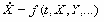{width="104" height="22"},  
      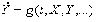{width="98" height="22"},  
      и т.д.,  

которые имеют решение:

      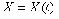{width="59" height="19"},  
      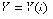{width="53" height="19"},  
      и т.д.,\

где t -- независимая переменная (например, время); X, Y и т.д. --
искомые функции (зависимые от t переменные). Функции f, g и т.д. --
заданы. Также предполагаются заданными и начальные условия, т.е.
значения искомых функций в начальный момент.

Одно дифференциальное уравнение -- частный случай системы с одним
элементом. Поэтому, далее речь пойдет для определенности о системе
уравнений.

Метод может быть полезен и для решения дифференциальных уравнений
высшего (второго и т.д.) порядка, т.к. они могут быть представлены
системой дифференциальных уравнений первого порядка.

Метод Рунге-Кутта заключается в рекурентном применении следующих
формул:

      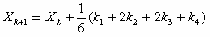{width="210" height="37"}

      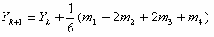{width="214" height="37"}
      ...
где

      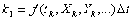{width="134" height="22"},

      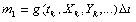{width="136" height="22"},

      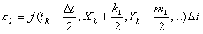{width="230" height="39"},

      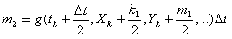{width="232" height="39"},

      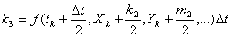{width="234" height="39"},

      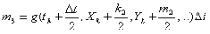{width="235" height="39"},

      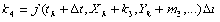{width="220" height="22"},

      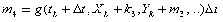{width="223" height="22"}

Реализация Метода Рунге-Кутта на Delphi может выглядеть так
(привожу полностью модуль):

    unit RK_Method;
     
    interface
     
    type
       TVarsArray = array of Extended; // вектор переменных включая независимую
       TInitArray = array of Extended; // вектор начальных значений
       TFunArray = array of function(VarsArray: TVarsArray ):Extended;
       // вектор функций
       TResArray = array of array of Extended; // матрица результатов
       TCoefsArray = array of Extended; // вектор коэффициетов метода
     
    function Runge_Kutt( // метод Рунге-Кутта
       FunArray: TFunArray; // массив функций
       First: Extended; // начальная точка по независимой координате
       Last: Extended; // конечная точка по независимой координате
       Steps: Integer; // число шагов по независимой координате
       InitArray: TInitArray; // вектор начальных значений
       var Res: TResArray // матрица результатов включая независ. переменную
       ):Word; 
       // возвращаемое значение - код ошибки
     
    implementation 
    Function Runge_Kutt( // метод Рунге-Кутта
       FunArray: TFunArray; // массив функций
       First: Extended; // начальная точка по независимой координате
       Last: Extended; // конечная точка по независимой координате
       Steps: Integer; // число шагов по независимой координате
       InitArray: TInitArray; // вектор начальных значений
       var Res: TResArray // матрица результатов включая независ. переменную
       ):Word; // возвращаемое значение - код ошибки
    var
       Num: Word; // число уравнений
       NumInit: Word; // число начальных условий
       Delt: Extended; // шаг разбиения
       Vars: TVarsArray; // вектор переменных включая независимую
       Vars2,Vars3,Vars4: TVarsArray; // значения перем. для 2-4 коэф.
       Coefs1: TCoefsArray; // вектор 1-ыx коэффициентов в методе
       Coefs2: TCoefsArray; // вектор 2 коэффициентов в методе
       Coefs3: TCoefsArray; // вектор 3 коэффициентов в методе
       Coefs4: TCoefsArray; // вектор 4 коэффициентов в методе
       I: Integer; // счетчик цикла по иттерациям
       J: Word; // индекс коэф.-тов метода
       K: Integer; // счетчик прочих циклов
    begin
       Num:=Length(FunArray); // узнаем число уравнений
       NumInit:=Length(InitArray); // узнаем число начальных условий
       If NumInit<>Num then
         begin
           Result:=100; // код ошибки 100: число уравнений не равно числу нач. усл.
           Exit;
         end;
       Delt:=(Last-First)/Steps; // находим величину шага разбиений
       SetLength(Res,Num+1,Steps+1); // задаем размер матрицы ответов с незав. перем.
       SetLength(Vars,Num+1); // число переменных включая независимую
       SetLength(Vars2,Num+1); // число переменных для 2-го коэф. включая независимую
       SetLength(Vars3,Num+1); // число переменных для 3-го коэф. включая независимую
       SetLength(Vars4,Num+1); // число переменных для 4-го коэф. включая независимую
       SetLength(Coefs1,Num); // число 1-ыx коэф. метода по числу уравнений
       SetLength(Coefs2,Num); // число 2-ыx коэф. метода по числу уравнений
       SetLength(Coefs3,Num); // число 3-иx коэф. метода по числу уравнений
       SetLength(Coefs4,Num); // число 4-ыx коэф. метода по числу уравнений
       // Начальные значения переменных:
       Vars[0]:=First;
       For K:=0 to NumInit-1 do Vars[K+1]:=InitArray[K];
       For J:=0 to Num do Res[J,0]:=Vars[J]; // первая точка результата
       For I:=0 to Steps-1 do // начало цикла иттераций
         begin
           For J:=0 to Num-1 do Coefs1[J]:=FunArray[J](Vars)*delt; // 1-й коэфф.
           // Находим значения переменных для второго коэф.
           Vars2[0]:=Vars[0]+delt/2;
           For K:=1 to Num do Vars2[K]:=Vars[K]+Coefs1[K-1]/2;
           For J:=0 to Num-1 do Coefs2[J]:=FunArray[J](Vars2)*delt; // 2-й коэф.
           // Находим значения переменных для третьго коэф.
           Vars3[0]:=Vars[0]+delt/2;
           For K:=1 to Num do Vars3[K]:=Vars[K]+Coefs2[K-1]/2;
           For J:=0 to Num-1 do Coefs3[J]:=FunArray[J](Vars3)*delt; // 3 коэфф.
           // Находим значения переменных для 4 коэф.
           Vars4[0]:=Vars[0]+delt;
           For K:=1 to Num do Vars4[K]:=Vars[K]+Coefs3[K-1];
           For J:=0 to Num-1 do Coefs4[J]:=FunArray[J](Vars4)*delt; // 4 коэфф.
           // Находим новые значения переменных включая независимую
           Vars[0]:=Vars[0]+delt;
           For K:=1 to Num do
           Vars[K]:=Vars[K]+(1/6)*(Coefs1[K-1]+2*(Coefs2[K-1]+Coefs3[K-1])+Coefs4[K-1]);
           // Результат иттерации:
           For J:=0 to Num do Res[J,I+1]:=Vars[J];
         end; // конец итераций
       Result:=0; // код ошибки 0 - нет ошибок
    end;
     
    end. 

Модуль полностью работоспособен. Возвращаемое функцией Runge\_Kutt
значение -- код ошибки. Вы можете дополнить список ошибок по своему
усмотрению. Рассчитанные функции системы помещаются в массив Res. Чтобы
не загромождать код, в модуле опущены проверки (типа блоков try).
Рекомендую их добавить по своему усмотрению.

Ниже приводится описание функции Runge\_Kutt и типов, использующихся в
модуле.

     

Function Runge\_Kutt (FunArray: TFunArray; First: Extended; Last:
Extended; Steps: Integer; InitArray: TInitArray; var Res:
TResArray):Word;\
 \
Здесь:\
   FunArray - вектор функций (правых частей уравнений системы);\
   First, Last - начальная и конечная точки расчетного интервала;\
   Steps - число шагов по расчетному интервалу;\
   InitArray - вектор начальных значений\

   Res - матрица результатов включая независимую переменную.

В модуле описаны типы:

type\
   TVarsArray = array of Extended; // вектор переменных включая
независимую\
   TInitArray = array of Extended; // вектор начальных значений\
   TFunArray = array of function(VarsArray: TVarsArray ):Extended; //
вектор функций\
   TResArray = array of array of Extended; // матрица результатов\

   TCoefsArray = array of Extended; // вектор коэффициетов метода

Функция возвращает коды ошибок:\
  0 -- нет ошибок;\

  100 - число уравнений не равно числу начальных условий.

Решение содержится в переменной-матрице Res. Первый индекс матрицы
относится к переменной (0 -- независимая переменная, 1 -- первая
зависимая и т.д.), второй -- к номеру расчетной точки (0 -- начальная
точка).

Рассмотрим один пример использования модуля. Создадим новое приложение и
подключим к нему модуль. На форме приложения разместим кнопку Button1 и
область текста Memo1. Поместим в приложение две функции и обработчик
нажатия кнопки:

    //Задаем функции (правые части уравнений)
    function f0(VarArray:TVarsArray):extended;
    begin
       Result:=4*VarArray[0]*VarArray[0]*VarArray[0];
    end;
     
    function f1(VarArray:TVarsArray):extended;
    begin
       Result:=1;
    end;
     
    ////////////////////////////////////////////////////////////////////////////////
     
    procedure TForm1.Button1Click(Sender: TObject);
    var
       I: Integer;
       FunArray: TFunArray; // массив функций
       First: Extended; // начальная точка по независимой координате
       Last: Extended; // конечная точка по независимой координате
       Steps: Integer; // число шагов по независимой координате
       InitArray: TInitArray; // вектор начальных значений
       Res: TResArray; // матрица результатов включая независ. переменную
    begin    // Создаем вектор функций:
       SetLength(FunArray,2);
       FunArray[0]:=f0;
       FunArray[1]:=f1;
       // Задаем интервал и число шагов:
       First:=0;
       Last:=10;
       Steps:=10;
       // Задаем начальные условия:
       SetLength(InitArray,2);
       InitArray[0]:=0;
       InitArray[1]:=0;
       // Вызов метода и получение результатов:
       Memo1.Lines.Clear;
       I:=Runge_Kutt(FunArray, First, Last, Steps, InitArray, Res);
       ShowMessage('Код ошибки = '+IntToStr(I));
       For I:=0 to Steps do
         Memo1.Lines.Add(floattostr(Res[0,I])+' '+floattostr(Res[1,I])+' '+floattostr(Res[2,I]));
    end; 

Нажатие кнопки приведет к расчету точек системы, которые будут выведены
в текстовую область.

Copyright© 2006 Андрей Садовой  Специально для Delphi Plus
