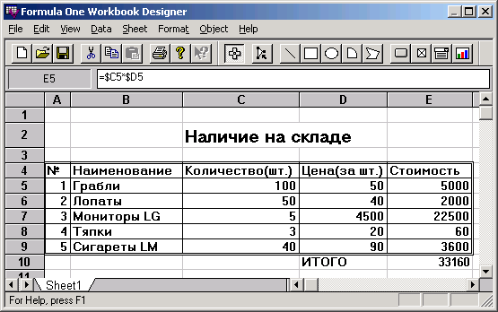

Алгоритмы поиска
================

::: {.date}
01.01.2007
:::

Автор: Елена Филиппова

Введение

Данная статья не претендует на полное описание всех существующих методов
поиска и посвящена именно обзору классических решений, довольно простой
на вид, поисковой задачи. Мне хотелось рассказать об алгоритмах поиска,
о том что это такое и каким образом их следует применять в конкретных
задачах. Я постаралась минимизировать количество математических выкладок
и сухих определений, чтобы облегчить восприятие именно логики
алгоритмов, не требуя при этом специальной математической подготовки.

Говоря о поиске, мы будем иметь в виду некий массив данных, а искать
будем определенный элемент в этом массиве. Оптимальность поиска для
простоты определим очень конкретно - это скорость работы алгоритма.

Казалось бы, к чему плодить много алгоритмов, давайте найдем один, самый
оптимальный и успокоимся на этом. Это ошибочное мнение. Найти
оптимальный алгоритм, не привязываясь при его выборе к условию задачи -
это иллюзия.
Какой алгоритм, из множества известных сейчас, самый быстрый?

Ответа на этот вопрос не существует. Нет самого оптимального алгоритма в
абстрактном смысле. Выбор его очень сильно зависит от условия задачи,
которую нам придется решать. Именно на этот факт мне и хотелось бы
обратить особенное внимание.

Маленькое лирическое отступление...

Судя по литературе, подъем интереса к математическим исследованиям
методов поиска начался в 60-х годах. Очевидно, что на заре развития
вычислительной техники, небольшой ( по нашим меркам просто никакой )
объем оперативной памяти и наличие только внешних устройств
последовательного доступа (магнитная лента), делало задачу поиска или
слишком тривиальной или абсолютно нерешаемой.

Общая классификация алгоритмов поиска

- Все методы можно разделить на статические и динамические. При статическом поиске массив значений не меняется во время работы алгоритма. Во время динамического поиска массив может перестраиваться или изменять размерность.

Представьте себе, что Вы ищете слово в словаре. Как бы Вы его не искали,
Ваш агоритм обязательно будет статическим, так как сам словарь ( массив
слов ) не будет изменяться во время поиска. Если конечно не выдирать из
него страницы. Примером динамического поиска может служить попытка найти
определенную карту в колоде. Откладывая в сторону ненужные карты, Вы
облегчаете себе задачу поиска, уменьшая количества оставшихся карт в
колоде, которые еще нужно перебрать, тем самым перестраивая массив
значений во время поиска!

- Так же методы поиска можно разделить на методы, использующие истинные ключи и на методы, работающие по преобразованным ключам. В данном случае "ключем" называют то значение, которое мы ищем.

Поиск в колоде карт - поиск по истинным ключам, то есть имеете дело с
тем, что есть. Поиск в словаре - поиск по преобразованным ключам, так
как все слова отсортированы в алфавитном порядке, то есть массив
значений изменен перед началом поиска. Этот порядок создан специально
для облегчения поиска и вовсе не является естественным для списка слов!

Кстати, привычный нам алфавитный порядок слов, не всегда казался людям
естественным и является изобретением не очень древним.

- Ну и еще вариант классификации - методы основанные на сравнении самих значений и методы, основанные на их цифровых свойствах. Так называемые методы хэширования.

Рассматриваемые в данном обзоре алгоритмы являются комбинациями первых
двух способов классификации. О методе хэширования я лишь упомяну
исключительно из академического интереса, так как он не входит в круг
рассматриваемых здесь задач.

Представьте себе, что нам надо найти определенную карту в колоде. Для
этого мы выбрали довольно нестандартный способ, мы придумали такую
функцию, которая вычисляет номер нужной карты в колоде. Например

f("крестовая дама") = 5,  а f("туз пик")=12

То есть, подставив в функцию искомое значение, мы получаем
местоположение этого значения в нашем массиве. Вот здорово! Это же самый
что ни на есть ПРЯМОЙ доступ, по сравнению с ПОСЛЕДОВАТЕЛЬНЫМ перебором
всех ( или некоторых ) значений в искомом массиве.

Этот метод и называется методом хэширования. Все бы хорошо, но вот беда,
функция f(К) должна определять ОДНОЗНАЧНОЕ соответствие для каждого
значения в массиве, а находить подобные функции довольно сложно.

Подробное рассмотрение алгоритмов

Попытаемся решить простейшую задачу - найти нужное значение в массиве.
На этом первом примере мне хочется показать, как оптимальность решения
зависит от того, в каком массиве мы будем искать.

Перед Вами колода игральных карт, в ней, как правило, 54 карты ( ну или
36 ). Карты лежат в беспорядке. Необходимо найти определенную карту,
например пикового короля. Что Вы предпримете? Думаю, что догадаться
нетрудно, первое, что приходит в голову, это последовательно перебирать
все карты, до тех пор пока нужная не найдется. При самом плохом стечении
обстоятельств Вам придется перебрать все карты в колоде, что на самом
деле не так долго, если честно.

Попробуем немного изменить условие. Искать нам надо не карту, а конверт
с определенным адресом. Конвертов этих перед Вами лежит немерянное
количество, если окинуть взглядом заваленные столы, ну несколько сотен
как минимум. Нет, нет, не пожимайте удивленно плечами, задача не
надуманная, а самая что ни на есть реальная. Если вдруг кто-нибудь ( а
мир так удивительно тесен! ) знаком с Константиновым Николаем
Николаевичем, тот скорее всего знаком с этой задачей не понаслышке.
Итак, я отвлеклась, перед нами несколько сотен конвертов с именами,
нужно найти вполне определенный конверт. Способ, только что опробованный
на колоде карт, очень скоро утомит. Вряд ли кто в этом сомневается, не
правда ли? :о)

А вот если предварительно все эти конверты разложить в алфавитном
порядке, то дальнейшая работа по нахождению вполне определенного имени
уже не представляется такой ужасной! Конечно, на сортировку необходимо
затратить вполне определенные силы и время, но они окупятся при
многоразовом поиске, вот что самое главное

Вспомнив пример с картами, отметим, что в том случае тратить время на
предварительную сортировку колоды вряд ли стоит...

Итак, мы можем сделать первый и очень важный вывод - оптимальность
метода поиска зависит от размера массива, в котором мы ищем! Прямой
перебор всех значений прост в понимании, легок в исполнении и достаточно
быстр на малых массивах данных. Насчет легкости и простоты, это не
лирика, это весомый аргумент, ведь Вам после того, как будет выбран
определенный метод, необходимо еще формализовать его и закодировать. В
итоге программиста инетересует код. Не будем об этом забывать.

Итак, все это в совокупности позволяет сказать, что метод прямого
перебора оптимален для малых массивов.

Если же массив данных достаточно велик, то оптимальность поиска
достигается предварительной сортировкой значений в массиве.

Ну что же, с задачей поиска при малом количестве значений мы
разобрались, она достаточно тривиальна. Давайте займемся поиском в
о-о-очень длинном массиве... Это гораздо интереснее. Итак, приняв все
вышесказанное за истину, мы отсортировали наш массив. Все значения лежат
в некотором порядке. Можно искать! И, собственно, что?... Как
искать-то?

Существует несколько классических способов поиска значения в
отсортированном массиве. Мы рассмотрим три способа. Они были предложены
в 60-х годах и мало изменились в наше время. Один из них очень
известный, ведь Вам наверняка приходилось слышать такие названия как
"метод дихотомии", "бинарного дерева" или "метод половинного
деления", что собственно одно и тоже. Вот с него и начнем.

1. Алгоритм поиска по бинарному дереву.

Суть этого алгоритма достаточно проста. Представим себе, что у нас есть
набор карточек с телефонными номерами и адресами людей. Карточки
отсортированы в порядке возрастания телефонных номеров. Необходимо найти
адрес человека, если мы знаем, что его номер телефона 222-22-22. Наши
действия? Берем карточку из середины пачки, номер карточки 444-44-44.
Сравнивая его с искомым номером, мы видим, что наш меньше и, значит,
находится точно в первой половине пачки. Смело откладываем вторую часть
пачки в сторону, она нам не нужна, массив поиска мы сузили ровно в два
раза. Теперь берем карточку из середины оставшейся пачки, на ней номер
123-45-67. Из чего следует, что нужная нам карточка лежит во второй
половине оставшейся пачки... Таким образом, при каждом сравнении, мы
уменьшаем зону поиска в два раза. Отсюда и название метода - половинного
деления или дихотомии.

Не буду приводить математического доказательства, так как это не
является целью данной статьи, а просто отмечу, что скорость сходимости
этого алгоритма пропорциональна Log(2)N ? . Это означает буквально то,
что не более, чем через Log(2)N сравнений, мы либо найдем нужное
значение, либо убедимся в его отсутствии.

Другое название этого алгоритма - «метод бинарного дерева» происходит
из представления "пути" поиска в виде дерева (у которого каждая
следующая ветвь разделяется на две, по одной из которых мы и движемся в
дальнейшем)..

Способ очень распространенный в наше время, возможно по причине его
эффективности вкупе с простотой программирования этого алгоритма. Именно
бинарный поиск используется при поиске в индексах таблиц.

Есть еще один алгоритм, основанный на делении искомого массива на части,
аналогичный предыдущему. Я упомяну о нем скорее из-за некоторой его
экзотичности.

2. Поиск по "дереву Фибоначчи".

Рассмотрим его исключительно из академического интереса. Для тех, кто
пожелает разобраться в методе более детально, список литературы в конце
статьи.

Трудноватый для восприятия метод, но эффективность его немного выше, чем
у поиска по Бинарному дереву, хотя так же пропорциональна Log(2)N.

В дереве Фибоначчи числа в дочерних узлах, отличаются от числа в
родительском узле на одну и ту же величину, а именно на число Фибоначчи.
Суть метода в том, что сравнивая наше искомое значение с очередным
значением в массиве, мы не делим пополам новую зону поиска, как в
бинарном поиске, а отступаем от предыдущего значения, с которым
сравнивали, в нужную сторону на число Фибоначчи.

Почему этот способ считается более эффективным, чем предыдущий?
Ответ достаточно неожиданный и боюсь, что нам с Вами оценить его
должным образом вряд ли удастся. Дело в том, что метод Фибоначчи
включает в себя только такие арифметические операции, как сложение и
вычитание, нет необходимости в делении на 2, тем самым экономится
процессорное время!

Хочется напомнить, что речь идет о том времени, когда был изобретен
метод, а именно - о 60-х годах. В то время процессорное время можно было
экономить на подобных подходах.

3. Метод экстраполяций.

Переходя к следующему методу, давайте представим, что Вам срочно
понадобилось узнать, как переводится на русский язык английское слово
treasure. То есть перед нами задача - найти это слово в словаре.

По сути все наши дальнейшие действия будут ничем иным, как реализацией
некоторого алгоритма поиска. Массив значений - это словарь, все значения
в нем отсортированы по алфавиту. Искомое слово нам известно. Значит
сейчас мы будем искать в отсортированном массиве.

Если честно, то я с трудом представляю себе, что Вы станете делить все
страницы книги пополам, смотреть что там в середине и отлистывать в одну
или другую сторону ровно ? страниц словаря и так далее... То есть метод
дихотомии Вы проигнорируете. И уж совсем неожиданно предположить, что Вы
воспользуетесь деревом Фибоначчи.

Вы просто возьмете и ... и найдете нужное слово, не правда ли?

А теперь остановимся и еще раз повторим поиск, при этом очень
внимательно проанализируем наши действия. Итак, искомое слово начинается
на букву T, открываем словарь немного дальше, чем на середине. Нам
попалась буква R, ясно, что искать надо во второй части словаря, а на
сколько отступить? На половину? "Ну зачем же на половину, это больше,
чем надо", скажете Вы и будете правы. Ведь нам не просто известно, в
какой части массива искомое значение, мы владеем еще и информацией о
том, насколько далеко надо шагнуть!

Вот мы и подошли к сути рассматриваемого метода. В отличии от первых
двух, он не просто определяет зону нового поиска, но и оценивает
величину нового шага.

Алгоритм носит название экстраполяционного метода и имеет скорость
сходимости большую, чем первые два метода.

Примечание:

Если при поиске по бинарному дереву за каждый шаг массив поиска
уменьшался с N значений до N/2, то при этом методе за каждый шаг зона
поиска уменьшается с N значений до корня квадратного из N. Если К лежит
между Kn и Km, то следующий шаг делаем от n на величину

(n - m)*(K - Kn)/(Km - Kn)

Скорость экстраполяционнго метода начинает существенно превышать
скорость метода половинного деления при больших значениях N.

Итак, мы рассмотрели конкретные алгоритмы поиска в отсортированном
массиве. Таким образом можно подвести итоги:

- Если необходимо искать в небольшом массиве и искать нужно нечасто, проще воспользоваться методом перебора всех значений массива;

- Если массив значений большой и искать нужно часто, отсортируйте массив и воспользуйтесь методом половинного деления или интерполяционным методом. Каким из них именно, выбирайте исходя из того, насколько велик массив и какой метод Вам самим легче реализовать в коде.

При предложенном выборе возникает резонный вопрос, а "большой массив"
это какой? При оценке времени, которое затрачивает алгорит на поиск
имеют значение две величины. Во-первых, это размерность массива
(количество элементов) и, во-вторых, это количество обращений (то есть,
сколько раз нам нужно в нем искать).

{.center}

Итак, имеем массив размерностью N и проводим М раз в нем поиск.

Количество операций, которые выполнит алгоритм прямого перебора,
пропорционально M*N. Метод дихотомии совершит 2М*Log(2)N операции, да
еще и время на сортировкку надо прибавить - N*Log(2)N

Итак, имеем два выражения :

    T1 =  M*N;
    T2 =  2М*Log(2)N + N*Log(2)N

При Т1 = Т2 мы находимся на границе, на которой одинаково оптимальны оба
алгоритма. Из этого равенства можно получить области в системе координат
"Количество обращений - Размерность массива", определяющие
оптимальность одного алгоритма относительно другого (см. рисунок).

Способы коррекции алгоритмов поиска.

Основным критерием выбора оптимального метода был размер массива, в
котором мы ищем. А более конкретные условия задачи могут существенно
повысить скорость уже выбранного метода.

До сих пор мы считали, что каждое значение массива с одинаковой
вероятностью может оказаться искомым.

Но это утверждение не для всех задач верно.

Предположим, что у нас есть конверты с адресами учеников. Конвертов
немного и сортировать мы их не стали. Ученики эти принимали участие в
различных конкурсах и заняли там призовые места. Причем один человек мог
отличиться не в одном, а во многих конкурсах. Перед нами задача: по
спискам каждого конкурса найти отличившихся и вложить в его конверт
соответствующее уведомление. Естественно, что уведомлений будет столько
, сколько состязаний ученик выиграл. Через некоторое время, вкладывая
очередное n-ое уведомление в конверт очередного юного гения и в глубине
души догадываясь, что это не последний выигранный им конкурс, Вам вдруг
захочется, чтобы его конверт лежал где-то в начале пачки.... И
совершенно не важно, каким методом поиска Вы пользуетесь, Важно другое -
исходя из условий конкретной задачи этот метод нуждается в коррекции.

Вот тут нам поможет довольно простая схема динамического метода
коррекции поиска или метод "Самоорганизующегося" списка. Идея метода
проста - когда мы находим нужный конверт, мы кладем его в начало пачки.
То есть перемещаем значение в начало массива, помните перестраиваемый
массив при динамическом поиске?

В итоге, часто используемые элементы будут расположены довольно близко к
началу массива. Таким образом, количество сравнений до удачного поиска
будет минимизироваться "само-собой". И через несколько иттераций в
начале пачки автоматически окажутся конверты будущих ломоносовых.

Математически это можно объяснить так: предположим, что значение Ki
будет разыскиваться с вероятностью Pi, причем

P1 + P2 + ... Pn = 1

Время удачного поиска пропорционально С, среднее значение которого :

С = P1 + 2*P2 + .... N*Pn .

Минимального значения С достигнет при :

P1 \> P2 \> ... \> Pn

То есть тогда, когда наиболее часто используемые записи находятся в
НАЧАЛЕ таблицы.

Данный способ, естественно, стоит применять в случае наибольшей
вероятности именно удачного поиска.

Не будем загромождать статью математическими выкладками, ибо тема
несколько иная, но в результате оказывается, что оптимальное ( с точки
зрения частоты обращений) расположение значений экономит около трети
поискового времени!

Возможно этот метод кому-то покажется экзотическим ( опять же,
вероятности какие-то, это вам не Ctrl-C & Ctrl-V, ужас просто), но, в
зависимости от условия задачи, метод может быть очень эффективным.

Менее экзотический, но тоже сильно зависящий от конкретных условий
задачи, динамический метод "очищаемого" списка. Это не самостоятельный
метод поиска, а именно коррекция одного из методов описанных выше. Когда
при удачном поиске значения, запись ему соответствующая, удаляется из
массива, уменьшая такми образом его размерность.

И еще один момент. До сих пор мы считали, что в рассматриваемых задачах
вероятность удачного поиска достаточно велика. Представим себе, что
поиск поисходит в неком массиве, про который мы точно знаем, что искомые
значения скорее всего там не содержатся!

Чем же нам это помогает? А вот чем: мы можем минимизировать количество
сравнений, заранее отсекая неудачный поиск, то есть значения,которых
нет в массиве. Предположим, что у нас есть большой массив
отсортированных значений. Достаточно перед началом поиска очередного
значения проверить, а попадает ли оно в принципе в массив?

Это совершенно просто :

если (Ki \< K1)  или (Ki \> Kn)

, то, собственно говоря, чего суетиться-то? Но применять этот способ
коррекции алгоритма можно только в том случае, если вероятность
неудачного поиска достаточно велика. Потому как при большой размерности
массива еще и прибавлять сравнение на каждом шаге можно только в том
случае, если очередное сравнение СКОРЕЕ ВСЕГО заменит нам очередной
виток поиска.

Оценим, какова должна быть вероятность неудачного поиска, то есть
отсутствие искомого значения в массиве, чтобы было выгодно применять эту
модификацию алгоритма.

(Приведенная ниже оценка вероятности представлена Николаевым А.)

Пусть Р - вероятность того, что искомое значение отсутствует между
минимальным и максимальным значением массива. Тогда мы, отсекая
сверхэкстремальные значения, в среднем не производим Р*(С - 2)
операций, где С - среднее число операций при проведении
немодифицированного поиска. В то же время мы вынуждены впустую совершить
2*(1 - Р) операций для сравнения значения с минимальным и максимальным
в массиве. Так как мы должны быть в выигрыше, то

Р*(С - 2)  \>  2*(1 - Р) , следовательно PC -2P + 2P - 2 \> 0

РС \> 2, ну и наконец : P \> 2/C

Таким образом, при P \> 2/C мы будем в выигрыше. Например, для поиска по
бинарному дереву в случае массива с 32 элементами достаточно один раз из
четырех задавать сверхэкстремальное значение для поиска, чтобы
модифицированный алгоритм работал быстрее.

<https://delphiworld.narod.ru/>

DelphiWorld 6.0
