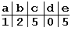
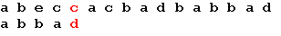
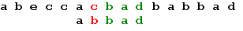
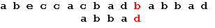
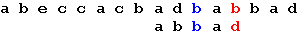
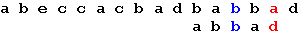
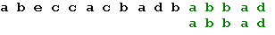
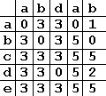

Алгоритмы поиска в строке
=========================

::: {.date}
01.01.2007
:::

    { **** UBPFD *********** by delphibase.endimus.com ****
    >> алгоритм поиска подстроки в строке
     
    Зависимости: SysUtils
    Автор:       ALex2)
    Copyright:   2)
    Дата:        1 февраля 2003 г.
    ***************************************************** }
     
    function BMSearch(StartPos: Integer; const S, P: string): Integer;
    type
      TBMTable = array[0..255] of Integer;
    var
      Pos, lp, i: Integer;
      BMT: TBMTable;
    begin
     
      for i := 0 to 255 do
        BMT[i] := Length(P);
      for i := Length(P) downto 1 do
        if BMT[Byte(P[i])] = Length(P) then
          BMT[Byte(P[i])] := Length(P) - i;
     
      lp := Length(P);
      Pos := StartPos + lp - 1;
      while Pos <= Length(S) do
        if P[lp] <> S[Pos] then
          Pos := Pos + BMT[Byte(S[Pos])]
        else if lp = 1 then
        begin
          Result := Pos;
          Exit;
        end
        else
          for i := lp - 1 downto 1 do
            if P[i] <> S[Pos - lp + i] then
            begin
              Inc(Pos);
              Break;
            end
            else if i = 1 then
            begin
              Result := Pos - lp + 1;
              Exit;
            end;
      Result := 0;
     
    end;
     
    {
    алгоритм Бойера-Мура
    ф-ия возвращает первое вхождение подстроки в строку
    работает быстро
    }
    Пример использования: 
     
    BMSearch(1, 'dsade', 'de')
    // в данном примере ф-ия возвратит число 4
    // 1 - это позиция с которой ищем подстроку в строке

------------------------------------------------------------------------

Автор: Андрей Боровский

Наверное, каждому, кто много работает за компьютером, знакома подобная
ситуация: перелистывая страницы книги в поисках нужного фрагмента,
невольно начинаешь думать о том, как вызвать команду «поиск по всему
тексту». Действительно, современные программы обработки текста приучили
нас к такой удобной возможности, как поиск и замена фрагментов, и если
вы разрабатываете подобную программу, пользователь вправе ожидать, что
вы предоставите в его распоряжение соответствующие команды. Эту проблему
нельзя эффективно решить при помощи стандартных функций Delphi/Kylix,
поскольку большинство средств разработки включает только малоэффективные
средства. Во-первых, в стандартных функциях не всегда используются самые
эффективные алгоритмы, а во-вторых, вполне возможно, что вам понадобится
изменить стандартное поведение этих функций (например, предусмотреть
возможность поиска по шаблону).

В этой статье рассматриваются два варианта наиболее эффективного
алгоритма поиска в тексте - алгоритма Бойера-Мура. Мы также рассмотрим
некоторые полезные расширения этого алгоритма.

Алгоритм грубой силы и простой вариант алгоритма Бойера-Мура.

Прежде, чем приступить к рассмотрению алгоритма Бойера-Мура, приведем
простейший (и самый медленный) алгоритм поиска, называемый «методом
грубой силы».

    function Find(const S, P: string): Integer;
    var
      i, j: Integer;
    begin
      Result := 0;
      if Length(P) > Length(S) then
        Exit;
      for i := 1 to Length(S) - Length(P) + 1 do
        for j := 1 to Length(P) do
          if P[j] <> S[i + j - 1] then
            Break
          else if j = Length(P) then
          begin
            Result := i;
            Exit;
          end;
    end;

 

Функция Find ищет подстроку P в строке S и возвращает индекс первого
символа подстроки или 0, если подстрока не найдена. Хотя в общем случае
этот метод, как и большинство методов грубой силы, малоэффективен, в
некоторых ситуациях он вполне приемлем. Мы сами воспользуемся похожим
алгоритмом при построении таблицы смещений для метода Бойера-Мура.

Алгоритм Бойера-Мура, разработанный двумя учеными - Бойером (Robert S.
Boyer) и Муром (J. Strother Moore), считается наиболее быстрым среди
алгоритмов общего назначения, предназначенных для поиска подстроки в
строке. Прежде чем рассмотреть работу этого алгоритма, уточним некоторые
термины. Под строкой мы будем понимать всю последовательность символов
текста. Собственно говоря, речь не обязательно должна идти именно о
тексте. В общем случае строка - это любая последовательность байтов.
Поиск подстроки в строке осуществляется по заданному образцу, т. е.
некоторой последовательности байтов, длина которой не превышает длину
строки. Наша задача заключается в том, чтобы определить, содержит ли
строка заданный образец.

Простейший вариант алгоритма Бойера-Мура состоит из следующих шагов. На
первом шаге мы строим таблицу смещений для искомого образца. Процесс
построения таблицы будет описан ниже. Далее мы совмещаем начало строки и
образца и начинаем проверку с последнего символа образца. Если последний
символ образца и соответствующий ему при наложении символ строки не
совпадают, образец сдвигается относительно строки на величину,
полученную из таблицы смещений, и снова проводится сравнение, начиная с
последнего символа образца. Если же символы совпадают, производится
сравнение предпоследнего символа образца и т. д. Если все символы
образца совпали с наложенными символами строки, значит мы нашли
подстроку и поиск окончен. Если же какой-то (не последний) символ
образца не совпадает с соответствующим символом строки, мы сдвигаем
образец на один символ вправо и снова начинаем проверку с последнего
символа. Весь алгоритм выполняется до тех пор, пока либо не будет
найдено вхождение искомого образца, либо не будет достигнут конец
строки.

Величина сдвига в случае несовпадения последнего символа вычисляется
исходя из следующих соображений: сдвиг образца должен быть минимальным,
таким, чтобы не пропустить вхождение образца в строке. Если данный
символ строки встречается в образце, мы смещаем образец таким образом,
чтобы символ строки совпал с самым правым вхождением этого символа в
образце. Если же образец вообще не содержит этого символа, мы сдвигаем
образец на величину, равную его длине, так что первый символ образца
накладывается на следующий за проверявшимся символ строки.

Величина смещения для каждого символа образца зависит только от порядка
символов в образце, поэтому смещения удобно вычислить заранее и хранить
в виде одномерного массива, где каждому символу алфавита соответствует
смещение относительно последнего символа образца. Поясним все
вышесказанное на простом примере. Пусть у нас есть набор символов из
пяти символов: a, b, c, d, e и мы хотим найти вхождение образца "abbad"
в строке "abeccacbadbabbad". Следующие схемы иллюстрируют все этапы
выполнения алгоритма:

{.center}

Таблица смещений для образца "abbad".

{.center}

Начало поиска. Последний символ образца не совпадает с наложенным
символом строки. Сдвигаем образец вправо на 5 позиций:

{.center}

Три символа образца совпали, а четвертый - нет. Сдвигаем образец вправо
на одну позицию:

{.center}

Последний символ снова не совпадает с символом строки. В соответствии с
таблицей смещений сдвигаем образец на 2 позиции:

{.center}

Еще раз сдвигаем образец на 2 позиции:

{.center}

Теперь, в соответствии с таблицей, сдвигаем образец на одну позицию, и
получаем искомое вхождение образца:

{.center}

Реализуем указанный алгоритм на языке ObjectPascal. Прежде всего следует
определить тип данных «таблица смещений». Для кодовой таблицы, состоящей
из 256 символов, определение этого типа будет выглядеть так:

    type
      TBMTable = array[0..255] of Integer;

Далее приводится процедура, вычисляющая таблицу смещений для образца P.

    procedure MakeBMTable(var BMT: TBMTable; const P: string);
    var
      i: Integer;
    begin
      for i := 0 to 255 do
        BMT[i] := Length(P);
      for i := Length(P) downto 1 do
        if BMT[Byte(P[i])] = Length(P) then
          BMT[Byte(P[i])] := Length(P)– i;
    end;

 

Теперь напишем функцию, осуществляющую поиск.

    function BMSearch(StartPos: Integer; const S, P: string; const BMT: TBMTable):
      Integer;
    var
      Pos, lp, i: Integer;
    begin
      lp := Length(P);
      Pos := StartPos + lp –1;
      while Pos < Length(S) do
        if P[lp] <> S[Pos] then
          Pos := Pos + BMT[S[Pos]]
        else
          for i := lp - 1 downto 1 do
            if P[i] <> S[Pos – lp + i] then
            begin
              Inc(Pos);
              Break;
            end
            else if i = 1 then
            begin
              Result := Pos – lp + 1;
              Exit;
            end;
      Result := 0;
    end;

 

Функция BMSearch возвращает позицию первого символа первого вхождения
образца P в строке S. Если последовательность P в S не найдена, функция
возвращает 0 (напомню, что в ObjectPascal нумерация символов в строке
String начинается с 1). Параметр StartPos позволяет указать позицию в
строке S, с которой следует начинать поиск. Это может быть полезно в том
случае, если вы захотите найти все вхождения P в S. Для поиска с самого
начала строки следует задать StartPos равным 1. Если результат поиска не
равен нулю, то для того, чтобы найти следующее вхождение P в S, нужно
задать StartPos равным значению «предыдущий результат плюс длина
образца».

Более эффективный вариант

Хотя рассмотренный упрощенный алгоритм вполне пригоден с практической
точки зрения (и часто применяется), нельзя не заметить, что результаты
сравнений используются недостаточно эффективно. Действительно, на втором
шаге, когда у нас совпали три символа, мы, зная, что последовательность
"bad" встречается в образце только один раз, могли бы сразу сместить
образец на всю его длину, а не на один символ. Теперь мы рассмотрим
другой, немного более сложный вариант алгоритма Бойера-Мура, позволяющий
учесть результаты предыдущих сравнений в случае частичного совпадения
образца и подстроки. Прежде всего изменим принцип построения таблицы
смещений. В этом варианте алгоритма таблица - двумерная, каждому
символу образца соответствует один столбец таблицы, а каждой букве
алфавита - одна строка. В ячейках таблицы содержатся значения смещений,
на которые нужно сдвинуть образец, если при проверке данного символа
образца обнаружено несовпадение и вместо искомого символа получен символ
алфавита, соответствующий некоторой строке в таблице. Например, таблица
последовательности "abdab" для нашего пятибуквенного алфавита будет
выглядеть следующим образом:

{.center}

Заполнение таблицы начинается с последнего столбца. Самый правый столбец
таблицы фактически соответствует массиву, который используется в
упрощенном варианте алгоритма. Следующие столбцы содержат значения
сдвига для образца при условии, что предыдущие (при движении справа
налево) символы совпали. Проводя поиск при помощи этой таблицы, мы
последовательно просматриваем значения ячеек, лежащих на пересечении
столбца, соответствующего символу образца и строки, соответствующей
символу текста. Просмотр начинается с последнего столбца. Если в каждом
столбце выбранная ячейка содержит 0, значит, подстрока найдена. Если
значение ячейки отличается от нуля, мы сдвигаем образец на
соответствующее значение.

Определенные сложности могут возникнуть при работе с кодировкой Unicode.
Очевидно, что таблица, число строк которой равно числу символов
двухбайтовой кодировки, будет слишком громоздкой. К счастью, в такой
таблице нет необходимости, ведь в случае двухбайтовой кодировки любой
образец содержит лишь небольшую часть символов алфавита. Для всех
символов, не содержащихся в образце, значения смещения в каждом столбце
таблицы будут одинаковыми. Эта особенность позволяет разработать
сокращенные варианты таблицы для Unicode. Конечно, Unicode-строку можно
рассматривать как последовательность байтов, где каждый Unicode-символ
представлен двумя байтами. Однако этот подход менее эффективен и не
позволяет воспользоваться теми дополнительными возможностями алгоритма,
о которых будет сказано ниже.

Далее приводятся функции и определения, реализующие алгоритм для
256-символьного набора.

    type
      TIntVect = array[0..255] of Integer;
      TBMTable = array[0..0] of TIntVect;
      PBMTable = ^TBMTable;
     
    function FindRightmost(const S, P: string; n: Integer): Integer;
    var
      i, j, lp: Integer;
    begin
      Result := 0;
      lp := Length(P);
      if lp > n then
        Exit;
      for i := n - lp + 1 downto 1 do
        for j := 1 to lp do
          if P[j] <> S[i + j - 1] then
            Break
          else if j = lp then
          begin
            Result := i;
            Exit;
          end;
    end;
     
    procedure MakeBMTable(var BMT: PBMTable; const P: string);
    var
      i, j, lp, MaxShift, CurShift, SufPos: Integer;
      Suffix: string;
    begin
      lp := Length(P);
      GetMem(BMT, SizeOf(TIntVect) * lp);
      for i := 0 to 255 do
        BMT^[lp - 1][i] := lp;
      for i := lp downto 1 do
        if BMT^[lp - 1][Byte(P[i])] = lp then
          BMT^[lp - 1][Byte(P[i])] := lp - i;
      MaxShift := lp;
      for i := lp - 1 downto 1 do
      begin
        SetLength(Suffix, lp - i);
        Move(P[i + 1], Suffix[1], lp - i);
        if Pos(Suffix, P) = 1 then
          MaxShift := i;
        for j := 0 to 255 do
        begin
          CurShift := MaxShift;
          SetLength(Suffix, lp - i + 1);
          Suffix[1] := Char(j);
          Move(P[i + 1], Suffix[2], lp - i);
          SufPos := FindRightmost(P, Suffix, lp - 1);
          if SufPos <> 0 then
            CurShift := i - SufPos;
          BMT^[i - 1][j] := CurShift;
        end;
        BMT^[i - 1][Byte(P[i])] := 0;
      end;
    end;
     
    function BMSearch(StartPos, lp: Integer; const S: string; BMT: PBMTable):
      Integer;
    var
      Pos, i: Integer;
    begin
      Pos := StartPos + lp - 1;
      while Pos < Length(S) do
        for i := lp downto 1 do
          if BMT^[i - 1][Byte(S[Pos - lp + i])] <> 0 then
          begin
            Pos := Pos + BMT^[i - 1][Byte(S[Pos - lp + i])];
            Break;
          end
          else if i = 1 then
          begin
            Result := Pos - lp + 1;
            Exit;
          end;
      Result := 0;
    end;

 

Служебная функция FindRightmost возвращает самое последнее вхождение
образца P среди n первых символов строки S. Формат вызова функции
BMSearch отличается от предыдущего. В параметре lp передается длина
строки образца, сама же строка не нужна, так как таблица смещений
однозначно описывает образец. Следует также учесть, что функция
MakeBMTable динамически выделяет память для таблицы смещений, и после
окончания использования функции BMSearch эту память необходимо
освободить при помощи функции FreeMem. Следующий фрагмент кода
иллюстрирует поиск всех вхождений образца P в строке S.

    MakeBMTable(BMT, P);
    PatPos := BMSearch(1, Length(P), S, BMT);
    while PatPos <> 0 dobegin...PatPos := BMSearch(PatPos + 1, Length(P), S, BMT);
    end;
    FreeMem(BMT);

 

Дополнительным преимуществом данного варианта алгоритма является
возможность организовать «регистронезависимый» поиск, т. е. поиск слова
вне зависимости от регистра букв. Для этого достаточно в таблице
смещений сопоставить одинаковые строки одним и тем же буквам разного
регистра. Можно даже ввести поиск по шаблону, содержащему подстановочные
символы. Ниже приводятся функции формирования таблицы смещений для
шаблонов, в которых символ «?» соответствует любому символу
используемого набора.

    function WCBeginsWith(const P, S: string): Boolean;
    var
      i, lp: Integer;
    begin
      Result := False;
      lp := Length(P);
      if lp > Length(S) then
        Exit;
      for i := 1 to lp do
        if (P[i] <> S[i]) and (P[i] <> '?') and (S[i] <> '?') then
          Exit;
      Result := True;
    end;
     
    function WCFindRightmost(const S, P: string; l: Integer): Integer;
    var
      i, j, lp: Integer;
    begin
      Result := 0;
      lp := Length(P);
      if lp > l then
        Exit;
      for i := l - lp + 1 downto 1 do
        for j := 1 to lp do
          if (P[j] <> S[i + j - 1]) and (P[j] <> '?') and (S[i + j - 1] <> '?') then
            Break
          else if j = lp then
          begin
            Result := i;
            Exit;
          end;
    end;
     
    procedure WCMakeBMTable(var BMT: PBMTable; const P: string);
    var
      i, j, lp, MaxShift, CurShift, SufPos: Integer;
      Suffix: string;
    begin
      lp := Length(P);
      GetMem(BMT, SizeOf(TIntVect) * lp);
      if P[lp] = '?' then
        for i := 0 to 255 do
          BMT^[lp - 1][i] := 0
      else
      begin
        for i := 0 to 255 do
          BMT^[lp - 1][i] := lp;
        for i := lp downto 1 do
          if BMT^[lp - 1][Byte(P[i])] = lp then
            BMT^[lp - 1][Byte(P[i])] := lp - i;
      end;
      MaxShift := lp;
      for i := lp - 1 downto 1 do
      begin
        SetLength(Suffix, lp - i);
        Move(P[i + 1], Suffix[1], lp - i);
        if WCBeginsWith(Suffix, P) then
          MaxShift := i;
        if P[i] = '?' then
          for j := 0 to 255 do
            BMT^[i - 1][j] := 0
        else
          for j := 0 to 255 do
          begin
            CurShift := MaxShift;
            SetLength(Suffix, lp - i + 1);
            Suffix[1] := Char(j);
            Move(P[i + 1], Suffix[2], lp - i);
            SufPos := WCFindRightmost(P, Suffix, lp - 1);
            if SufPos < >
            0 then
              CurShift := i - SufPos;
            BMT^[i - 1][j] := CurShift;
          end;
        BMT^[i - 1][Byte(P[i])] := 0;
      end;
    end;

 

Например, если в качестве шаблона функции WCMakeBMTable передать строку
«брос?ть», и передать полученную таблицу функции BMSearch, в тексте S
будут найдены все вхождения слов «бросать» и «бросить» (а также
«забросать», «забросить», «бросаться» и т.п., так как не указаны
предваряющий и завершающий пробелы).

В заключение рассмотрим вопрос о том, всегда ли следует применять
алгоритм Бойера-Мура, и какой вариант этого алгоритма лучше выбрать.
Превосходство алгоритма Бойера-Мура перед методом грубой силы наиболее
ощутимо проявляется с увеличением длины образца. Хотя алгоритм
Бойера-Мура производит меньше сравнений, чем примитивный алгоритм при
длине образца более двух символов, большая сложность этого алгоритма и
необходимость заранее вычислять таблицу смещений может свести на нет его
преимущества, если поиск проводится в коротком тексте, и длина образца
невелика.

Преимущество в быстродействии более сложного варианта алгоритма
Бойера-Мура перед более простым вариантом сказывается, только если длина
образца велика, и в тексте часто встречаются отдельные
последовательности символов, содержащиеся в образце. Главное же
достоинство более сложного варианта алгоритма заключается в возможности
реализации регистронезависимого поиска и поиска по шаблону.

<https://delphiworld.narod.ru/>

DelphiWorld 6.0
