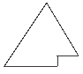
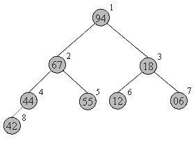
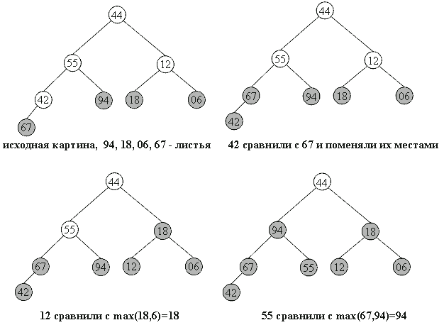
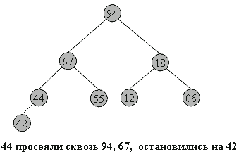
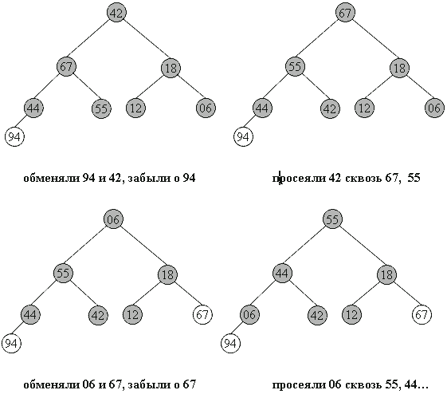

Пирамидальная сортировка
========================

::: {.date}
01.01.2007
:::

Итак, мы постепенно переходим от более-менее простых к сложным, но
эффективным методам. Пирамидальная сортировка является первым из
рассматриваемых методов, быстродействие которых оценивается как O(n log
n).

В качестве некоторой прелюдии к основному методу, рассмотрим
перевернутую сортировку выбором. Во время прохода, вместо вставки
наименьшего элемента в левый конец массива, будем выбирать наибольший
элемент, а готовую последовательность строить в правом конце.

Пример действий для массива a[0]... a[7]:

         44  55  12  42  94  18  06  67      исходный массив

         44  55  12  42  67  18  06 \|94       94 \<-\> 67

         44  55  12  42  06  18 \|67  94       67 \<-\> 06

         44  18  12  42  06 \|55  67  94       55 \<-\> 18

         06  18  12  42 \|44  55  67  94       44 \<-\> 06

         06  18  12 \|42  44  55  67  94       42 \<-\> 42

         06  12 \|18  42  44  55  67  94       18 \<-\> 12

         06 \|12  18  42  44  55  67  94       12 \<-\> 12

Вертикальной чертой отмечена левая граница уже отсортированной(правой)
части массива.

Рассмотрим оценку количества операций подробнее.

Всего выполняется n шагов, каждый из которых состоит в выборе
наибольшего элемента из последовательности a[0]..a[i] и последующем
обмене. Выбор происходит последовательным перебором элементов
последовательности, поэтому необходимое на него время: O(n). Итак, n
шагов по O(n) каждый - это O(n2).

Произведем усовершенствование: построим структуру данных, позволяющую
выбирать максимальный элемент последовательности не за O(n), а за
O(logn) времени. Тогда общее быстродействие сортировки будет n*O(logn)
= O(n log n).

Эта структура также должна позволять быстро вставлять новые элементы
(чтобы быстро ее построить из исходного массива) и удалять максимальный
элемент (он будет помещаться в уже отсортированную часть массива - его
правый конец).

Итак, назовем пирамидой(Heap) бинарное дерево высоты k, в котором

::: {style="text-align: left; text-indent: 0px; padding: 0px 0px 0px 0px; margin: 7px 0px 7px 24px;"}
  --- -------------------------------------------------------------
  ·   все узлы имеют глубину k или k-1 - дерево сбалансированное.
  --- -------------------------------------------------------------
:::

::: {style="text-align: left; text-indent: 0px; padding: 0px 0px 0px 0px; margin: 7px 0px 7px 24px;"}
  --- ----------------------------------------------------------------------------------------------------------------------------------
  ·   при этом уровень k-1 полностью заполнен, а уровень k заполнен слева направо, т.е форма пирамиды имеет приблизительно такой вид:

      {.center}

  --- ----------------------------------------------------------------------------------------------------------------------------------
:::

::: {style="text-align: left; text-indent: 0px; padding: 0px 0px 0px 0px; margin: 7px 0px 7px 24px;"}
  --- --------------------------------------------------------------------------------
  ·   выполняется "свойство пирамиды": каждый элемент меньше, либо равен родителю.
  --- --------------------------------------------------------------------------------
:::

Как хранить пирамиду? Наименее хлопотно - поместить ее в массив.



Соответствие между геометрической
структурой пирамиды как дерева и
массивом устанавливается по
следующей схеме:

- в a[0] хранится корень дерева
- левый и правый сыновья элемента a[i] хранятся, 
соответственнно, в a[2i+1] и a[2i+2]

Таким образом, для массива, хранящего в себе пирамиду, выполняется
следующее характеристическое свойство:

    a[i] >= a[2i+1] и a[i] >= a[2i+2].

Плюсы такого хранения пирамиды очевидны:

::: {style="text-align: left; text-indent: 0px; padding: 0px 0px 0px 0px; margin: 7px 0px 7px 24px;"}
  --- ---------------------------------------------------------------
  ·   никаких дополнительных переменных, нужно лишь понимать схему.
  --- ---------------------------------------------------------------
:::

::: {style="text-align: left; text-indent: 0px; padding: 0px 0px 0px 0px; margin: 7px 0px 7px 24px;"}
  --- ------------------------------------------------------------
  ·   узлы хранятся от вершины и далее вниз, уровень за уровнем.
  --- ------------------------------------------------------------
:::

::: {style="text-align: left; text-indent: 0px; padding: 0px 0px 0px 0px; margin: 7px 0px 7px 24px;"}
  --- ------------------------------------------------------
  ·   узлы одного уровня хранятся в массиве слева направо.
  --- ------------------------------------------------------
:::

Запишем в виде массива пирамиду, изображенную выше.. Слева-направо,
сверху-вниз: 94 67 18 44 55 12 06 42. На рисунке место элемента пирамиды
в массиве обозначено цифрой справа-вверху от него.

Восстановить пирамиду из массива как геометрический объект легко -
достаточно вспомнить схему хранения и нарисовать, начиная от корня.


Фаза 1 сортировки: построение пирамиды
 

Hачать построение пирамиды можно с a[k]...a[n], k = [size/2]. Эта
часть массива удовлетворяет свойству пирамиды, так как не существует
индексов i,j: i = 2i+1 ( или j = 2i+2 )... Просто потому, что такие i,j
находятся за границей массива.

Следует заметить, что неправильно говорить о том, что a[k]..a[n]
является пирамидой как самостоятельный массив. Это, вообще говоря, не
верно: его элементы могут быть любыми. Свойство пирамиды сохраняется
лишь в рамках исходного, основного массива a[0]...a[n].

Далее будем расширять часть массива, обладающую столь полезным
свойством, добавляя по одному элементу за шаг. Следующий элемент на
каждом шаге добавления - тот, который стоит перед уже готовой частью.

Чтобы при добавлении элемента сохранялась пирамидальность, будем
использовать следующую процедуру расширения пирамиды a[i+1]..a[n] на
элемент a[i] влево:

::: {style="text-align: left; text-indent: 0px; padding: 0px 0px 0px 0px; margin: 7px 0px 7px 24px;"}
  ---- --------------------------------------------------------------------------------------------------------
  1.   Смотрим на сыновей слева и справа - в массиве это a[2i+1] и a[2i+2] и выбираем наибольшего из них.
  ---- --------------------------------------------------------------------------------------------------------
:::

::: {style="text-align: left; text-indent: 0px; padding: 0px 0px 0px 0px; margin: 7px 0px 7px 24px;"}
  ---- -----------------------------------------------------------------------------------------------------------------------------------------------------
  1.   Если этот элемент больше a[i] - меняем его с a[i] местами и идем к шагу 2, имея в виду новое положение a[i] в массиве. Иначе конец процедуры.
  ---- -----------------------------------------------------------------------------------------------------------------------------------------------------
:::

Новый элемент "просеивается" сквозь пирамиду.

    template<class T>
    void downHeap(T a[], long k, long n) {
      //  процедура просеивания следующего элемента 
      //  До процедуры: a[k+1]...a[n]  - пирамида 
      //  После:  a[k]...a[n]  - пирамида 
      T new_elem;
      long child;
      new_elem = a[k];
     
      while(k <= n/2) {                  // пока у a[k] есть дети 
        child = 2*k;
        //  выбираем большего сына 
        if( child < n && a[child] < a[child+1] ) 
        child++;
        if( new_elem >= a[child] ) break; 
        // иначе 
        a[k] = a[child];         // переносим сына наверх 
        k = child;
      }
      a[k] = new_elem;
    }

Учитывая, что высота пирамиды h \<= log n, downheap требует O(log n)
времени. Полный код процедуры построения пирамиды будет иметь вид:

    // вызвать downheap O(n) раз для преобразования массива в пирамиду целиком
    for(i=size/2; i \>= 0; i\--) downHeap(a, i, size-1);

Ниже дана иллюстрация процесса для пирамиды из 8-и элементов:

```
  44  55  12  42  //  94  18  06  67    Справа - часть массива, удовлетворяющая

  44  55  12  //  67  94  18  06  42    свойству пирамиды, 

  44  55  //  18  67  94  12  06  42 

  44  //  94  18  67  55  12  06  42    остальные элементы добавляются

  //  94  67  18  44  55  12  06  42    один за другим, справа налево.
```

В геометрической интерпретации ключи из начального отрезка
a[size/2]...a[n] является листьями в бинарном дереве, как
изображено ниже. Один за другим остальные элементы продвигаются на свои
места, и так - пока не будет построена вся пирамида.

На рисунках ниже изображен процесс построения. Неготовая часть пирамиды
(начало массива) окрашена в белый цвет, удовлетворяющий свойству
пирамиды конец массива - в темный.

{.center}

{.center}

 


Фаза 2: собственно сортировка


 

Итак, задача построения пирамиды из массива успешно решена. Как видно из
свойств пирамиды, в корне всегда находится максимальный элемент. Отсюда
вытекает алгоритм фазы 2:

::: {style="text-align: left; text-indent: 0px; padding: 0px 0px 0px 0px; margin: 7px 0px 7px 24px;"}
  ---- ----------------------------------------------------------------------------------------------------------------------------------------------------------------------------------------------------------------------------------------------------------------------
  1.   Берем верхний элемент пирамиды a[0]...a[n] (первый в массиве) и меняем с последним местами. Теперь "забываем" об этом элементе и далее рассматриваем массив a[0]...a[n-1]. Для превращения его в пирамиду достаточно просеять лишь новый первый элемент.
  ---- ----------------------------------------------------------------------------------------------------------------------------------------------------------------------------------------------------------------------------------------------------------------------
:::

::: {style="text-align: left; text-indent: 0px; padding: 0px 0px 0px 0px; margin: 7px 0px 7px 24px;"}
  ---- --------------------------------------------------------------------------------------
  1.   Повторяем шаг 1, пока обрабатываемая часть массива не уменьшится до одного элемента.
  ---- --------------------------------------------------------------------------------------
:::

{.center}

Очевидно, в конец массива каждый раз попадает максимальный элемент из
текущей пирамиды, поэтому в правой части постепенно возникает
упорядоченная последовательность.

      94  67  18  44  55  12  06  42  //       иллюстрация 2-й фазы сортировки

      67  55  44  06  42  18  12  //  94       во внутреннем представлении пирамиды

      55  42  44  06  12  18  //  67  94

      44  42  18  06  12  //  55  67  94

      42  12  18  06  //  44  55  67  94

      18  12  06  //  42  44  55  67  94

      12  06  //  18  42  44  55  67  94

      06  //  12  18  42  44  55  67  94

Код внешней процедуры сортировки:

    template<class T>
    void heapSort(T a[], long size) {
      long i;
      T temp;
     
      // строим пирамиду 
      for(i=size/2-1; i >= 0; i--) downHeap(a, i, size-1);
     
      // теперь a[0]...a[size-1] пирамида 
     
      for(i=size-1; i > 0; i--) {
        // меняем первый с последним 
        temp=a[i]; a[i]=a[0]; a[0]=temp;
     
        // восстанавливаем пирамидальность a[0]...a[i-1] 
        downHeap(a, 0, i-1); 
      }
    }

Каково быстродействие получившегося алгоритма ?

Построение пирамиды занимает O(n log n) операций, причем более точная
оценка дает даже O(n) за счет того, что реальное время выполнения
downheap зависит от высоты уже созданной части пирамиды.

Вторая фаза занимает O(n log n) времени: O(n) раз берется максимум и
происходит просеивание бывшего последнего элемента. Плюсом является
стабильность метода: среднее число пересылок (n log n)/2, и отклонения
от этого значения сравнительно малы.

Пирамидальная сортировка не использует дополнительной памяти.

Метод не является устойчивым: по ходу работы массив так
"перетряхивается", что исходный порядок элементов может измениться
случайным образом.

Поведение неестественно: частичная упорядоченность массива никак не
учитывается.

<https://algolist.manual.ru>
