AVL-деревья
===========

::: {.date}
01.01.2007
:::

Источник: Технология Клиент-Сервер

Бинарные деревья поиска предназначены для быстрого доступа к данным. В
идеале разумно сбалансированное дерево имеет высоту порядка O(log2n).
Однако при некотором стечении обстоятельств дерево может оказаться
вырожденным. Тогда высота его будет O(n), и доступ к данным существенно
замедлится. В этом разделе мы рассмотрим модифицированный класс
деревьев, обладающих всеми преимуществами бинарных деревьев поиска и
никогда не вырождающихся. Они называются сбалансированными или
AVL-деревьями. Под сбалансированностью будем понимать то, что для
каждого узла дерева высоты обоих его поддеревьев различаются не более
чем на 1. Строго говоря, этот критерий нужно называть
AVL-сбалансированностью в отличие от идеальной сбалансированности, когда
для каждого узла дерева количества узлов в левом и правом поддеревьях
различаются не более чем на 1. Здесь мы всегда будем иметь в виду
AVL-сбалансированность.

Новые методы вставки и удаления в классе AVL-деревьев гарантируют, что
все узлы останутся сбалансированными по высоте. На рисунках 1 и 2
показаны эквивалентные представления массива AVL-деревом и бинарным
деревом поиска. Рисунок 1 представляет простой пятиэлементный массив А
(A\[5\] = {1,2,3,4,5}), отсортированный по возрастанию. Рисунок 2
представляет массив B (B\[8\] = {20, 30, 80, 40, 10, 60, 50, 70}).
Бинарное дерево поиска имеет высоту 5, в то время как высота AVL-дерева
равна 2. В общем случае высота сбалансированного дерева не превышает
O(log2n). Таким образом, AVL-дерево является мощной структурой хранения,
обеспечивающей быстрый доступ к данным.

В этом разделе используется упоминавшийся в предыдущей статье подход,
при котором поисковое дерево строится отдельно от своих узлов. Сначала
мы разработаем класс AVLTreeNode, а затем используем объекты этого типа
для конструирования класса AVLTree. Предметом пристального внимания
будут методы Insert и Delete. Они требуют тщательного проектирования,
поскольку должны гарантировать, что все узлы нового дерева останутся
сбалансированными по высоте.

Узлы AVL-дерева

 

AVL-деревья имеют структуру, похожую на бинарные деревья поиска. Все
операции идентичны описанным для бинарных деревьев, за исключением
методов Insert и Delete, которые должны постоянно отслеживать
соотношение высот левого и правого поддеревьев узла. Для сохранения этой
информации мы расширили определение объекта TreeNode (см. предыдущий
номер), включив поле balanceFactor (показатель сбалансированности),
которое содержит разность высот правого и левого поддеревьев.

left data balanceFactor right

AVLTreeNode

balanceFactor = height(right subtree) - height(left subtree)

Если balanceFactor отрицателен, то узел «перевешивает влево», так как
высота левого поддерева больше, чем высота правого поддерева. При
положительном balanceFactor узел «перевешивает вправо». Сбалансированный
по высоте узел имеет balanceFactor = 0. В AVL-дереве показатель
сбалансированности должен быть в диапазоне \[-1, 1\].

На рисунке 3 изображены AVL-деревья с пометками -1, 0 и +1 на каждом
узле, показывающими относительный размер левого и правого поддеревьев.

::: {style="text-align: left; text-indent: 0px; padding: 0px 0px 0px 0px; margin: 7px 0px 7px 24px;"}
  --- -------------------------------------------------------------------
  ·   -1: Высота левого поддерева на 1 больше высоты правого поддерева.
  --- -------------------------------------------------------------------
:::

::: {style="text-align: left; text-indent: 0px; padding: 0px 0px 0px 0px; margin: 7px 0px 7px 24px;"}
  --- ----------------------------------------
  ·   0: Высоты обоих поддеревьев одинаковы.
  --- ----------------------------------------
:::

::: {style="text-align: left; text-indent: 0px; padding: 0px 0px 0px 0px; margin: 7px 0px 7px 24px;"}
  --- -------------------------------------------------------------------
  ·   +1: Высота правого поддерева на 1 больше высоты левого поддерева.
  --- -------------------------------------------------------------------
:::

:::{.center}
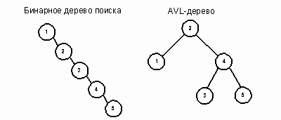

Рис. 1.
:::

:::{.center}
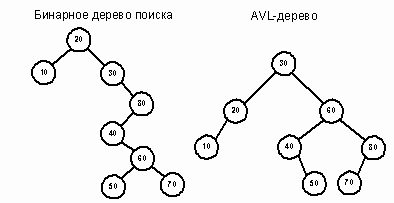

Рис. 2.
:::

Используя свойства наследования, можно образовать класс AVLTreeNode на
базе класса TreeNode. Объект типа AVLTreeNode наследует поля из класса
TreeNode и добавляет к ним поле balanceFactor. Данные-члены left и right
класса TreeNode являются защищенными, поэтому AVLTreeNode или другие
производные классы имеют к ним доступ.

:::{.center}

Рис. 3.
:::

Спецификация класса AVLTreeNode

 

ОБЪЯВЛЕНИЕ

    // наследник класса TreeNode
    template < class T >
      class AVLTreeNode: public TreeNode < T >
        {
          private:
            // дополнительный член класса balanceFactor
            // используется методами класса AVLTree и позволяет
            // избегать "перевешивания" узлов
            int balanceFactor;
            AVLTreeNode<T>* amp; Left(void);
            AVLTreeNode<T>* amp; Right(void);
     
          public:
            // конструктор
            AVLTreeNode(const Tamp; item, AVLTreeNode<T> *lptr = NULL,
                        AVLTreeNode<T> *rptr = NULL, int balfac = 0);
     
            // возвратить левый/правый указатель узла типа TreeNode,
            // преобразовав его к типу AVLTreeNode
            AVLTreeNode<T> *Left(void) const;
            AVLTreeNode<T> *Right(void) const;
     
            // метод для доступа к новому полю данных
            int GetBalanceFactor(void);
     
            // методы класса AVLTree должны иметь доступ к Left и Right
            friend class AVLTree<T>;
        };

ОПИСАНИЕ

Элемент данных balanceFactor является скрытым, так как обновлять его
должны только выравнивающие баланс операции вставки и удаления.

Доступ к полям-указателям осуществляется с помощью методов Left и Right.
Новые определения для этих методов обязательны, поскольку они возвращают
указатель на структуру AVLTreeNode.

Поскольку класс AVLTree образован на базе класса BinSTree, будем
использовать деструктор базового класса и метод ClearList. Эти методы
удаляют узлы с помощью оператора delete. В каждом случае указатель
ссылается на объект типа AVLTreeNode, а не TreeNode. Так как деструктор
базового класса TreeNode виртуальный, при вызове delete используется
динамическое связывание и удаляется объект типа AVLTreeNode.

ПРИМЕРЫ

Эта функция создает AVL-дерево, изображенное на рисунке 4. Каждому узлу
присваивается показатель сбалансированности

:::{.center}
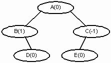

Рис. 4.
:::

    AVLTreeNode < char > * root; // корень AVL-дерева
     
    void MakeAVLCharTree(AVLTreeNode < char > * amp; root)
    {
      AVLTreeNode<char> *a, *b, *c, *d, *e;
     
      e = new AVLTreeNode<char>('E', NULL, NULL, 0);
      d = new AVLTreeNode<char>('D', NULL, NULL, 0);
      c = new AVLTreeNode<char>('C', e, NULL, -1);
      b = new AVLTreeNode<char>('B', NULL, d, 1);
      a = new AVLTreeNode<char>('A', b, c, 0);
      root = a;
    }

Реализация класса AVLTreeNode.

Конструктор класса AVLTreeNode вызывает конструктор базового класса и
инициализирует balanceFactor.

    // Конструктор инициализирует balanceFactor и базовый класс.
    // Начальные значения полей указателей по умолчанию, равные NULL,
    // инициализируют узел как лист.
    template < class T >
      AVLTreeNode < T > : : AVLTreeNode(const Tamp; item,
        AVLTreeNode < T > * lptr, AVLTreeNode < T > * rptr, int balfac):
      TreeNode < T > (item, lptr, rptr), balanceFactor(balfac)
      {}

Методы Left и Right в классе AVLTreeNode упрощают доступ к полям данных.
При попытке обратиться к левому сыну с помощью метода Left базового
класса возвращается указатель на объект типа TreeNode. Чтобы получить
указатель на узел AVL-дерева, требуется преобразование типов. Например,

    AVLTreeNode < T > * p, * q;
    q = p - > Left(); // недопустимая операция
    q = (AVLTreeNode < T > * )p - gt;
    Left(); // необходимое приведение типа

Во избежание постоянного преобразования типа указателей мы определяем
методы Left и Right для класса AVLTreeNode, возвращающие указатели на
объекты типа AVLTreeNode.

    template < class T >
      AVLTreeNodelt;
    Tgt;
    * AVLTreeNode: : Left(void)
    {
       return ((AVLTreeNodelt;Tgt; *)left;
    }

Класс AVLTree

 

AVL-дерево представляет собой списковую структуру, похожую на бинарное
дерево поиска, с одним дополнительным условием: дерево должно оставаться
сбалансированным по высоте после каждой операции вставки или удаления.
Поскольку AVL-дерево является расширенным бинарным деревом поиска, класс
AVLTree строится на базе класса BinSTree и является его наследником.

Для выполнения AVL-условий следует изменить методы Insert и Delete.
Кроме того, в производном классе определяются конструктор копирования и
перегруженный оператор присвоения, так как мы строим дерево с большей
узловой структурой.

Спецификация класса AVLTree

 

Объявление

    // Значения показателя сбалансированности узла
    const
      int leftheavy = -1;
    const
      int balanced = 0;
    const
      int rightheavy = 1;
     
      template < class T >
        class AVLTree: public BinSTree < T >
          {
            private:
              // выделение памяти
              AVLTreeNode<T> *GetAVLTreeNode(const T item,
                     AVLTreeNode<T> *lptr, AVLTreeNode<T> *rptr);
     
              // используется конструктором копирования и оператором присваивания
              AVLTreeNode<T> *CopyTree(AVLTreeNode<T> *t);
     
              // используется методами Insert и Delete для восстановления
              // AVL-условий после операций вставки/удаления
              void SingleRotateLeft (AVLTreeNode<T>* p);
              void SingleRotateRight (AVLTreeNode<T>* p);
              void DoubleRotateLeft (AVLTreeNode<T>* p);
              void DoubleRotateRight (AVLTreeNode<T>* p);
              void UpdateLeftTree (AVLTreeNode<T>* tree,
                                   int reviseBalanceFactor);
              void UpdateRightTree (AVLTreeNode<T>* tree,
                                    int reviseBalanceFactor);
     
              // специальные версии методов Insert и Delete
              void AVLInsert(AVLTreeNode<T>* tree,
                      AVLTreeNode<T>* newNode, int reviseBalanceFactor);
              void AVLDelete(AVLTreeNode<T>* tree,
                      AVLTreeNode<T>* newNode, int reviseBalanceFactor);
     
            public:
              // конструкторы
              AVLTree(void);
              AVLTree(const AVLTree<T> tree);
     
              // оператор присваивания
              AVLTree<T> operator= (const AVLTree<T> tree);
     
              // стандартные методы обработки списков
              virtual void Insert(const T item);
              virtual void Delete(const T item);
          };

Описание

Константы leftheavy, balanced и rightheavy используются в операциях
вставки/удаления для описания показателя сбалансированности узла.

Метод GetAVLTreeNode управляет выделением памяти для экземпляра класса.
По умолчанию balanceFactor нового узла равен нулю.

:::{.center}
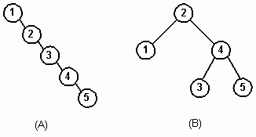

Рис. 5.
:::

В этом классе заново определяется функция CopyTree для использования с
конструктором копирования и перегруженным оператором присвоения.
Несмотря на то, что алгоритм идентичен алгоритму для функции CopyTree
класса BinSTree, новая версия корректно создает расширенные объекты типа
AVLTreeNode при построении нового дерева.

Функции AVLInsert и AVLDelete реализуют методы Insert и Delete,
соответственно. Они используют скрытые методы наподобие
SingleRotateLeft. Открытые методы Insert и Delete объявлены виртуальными
и подменяют соответствующие функции базового класса. Остальные операции
наследуются от класса BinSTree.

Код, приведенный ниже, создает деревья, приведенные на рисунке 5. После
удаления из AVL-дерева (В) элемента 3 AVL-дерево принимает вид,
изображенный на рисунке 5 (С). Цифра после двоеточия означает фактор
сбалансированности.

    AVLTree < int > avltree; // AVLTree-список целых чисел
    BinSTree < int > bintree; // BinSTree-список целых чисел
    for (int i = 1; i <= 5; i + +)
      {
      bintree.Insert(i);    // создать дерево А
      avltree.Insert(i);    // создать дерево В
    }
    avltree.Delete(3); // удалить 3 из AVL-дерева
     
    // дерево (С) есть дерево (В) без удаленного узла 3.

Распределение памяти для AVLTree

 

Класс AVLTree образован от класса BinSTree и наследует большинство его
операций. Для создания расширенных объектов типа AVLTreeNode мы
разработали отдельные методы выделения памяти и копирования.

    // разместить в памяти объект типа AVLTreeNode. прервать программу,
    // если во время выделения памяти произошла ошибка
    template < class T >
      AVLTreeNode < T > * AVLTree < T > : : GetAVLTreeNode(const T item,
        AVLTreeNode < T > * lptr, AVLTreeNode < T > * rptr)
      {
        AVLTreeNode<T> *p;
     
        p = new AVLTreeNode<T> (item, lptr, rptr);
        if (p == NULL)
        {
          cerr <lt; "Ошибка выделения памяти!" lt;lt; endl;
          exit(1);
        }
      return p;
      }

Для удаления узлов AVL-дерева достаточно методов базового класса. Метод
DeleteTree из класса BinSTree задействует виртуальный деструктор класса
TreeNode.

Метод Insert класса AVLTree

 

Преимущество AVL-деревьев состоит в их сбалансированности, которая
поддерживается соответствующими алгоритмами вставки/удаления. Опишем
метод Insert для класса AVLTree. При реализации метода Insert для
запоминания элемента используется рекурсивная функция AVLInsert. Сначала
приведем код метода Insert на С++, а затем сосредоточим внимание на
рекурсивном методе AVLInsert, реализующем алгоритм Адельсона-Вельского и
Ландиса.

    template < class T >
      void AVLTreelt;
    Tgt;
    : : Insert(const T item)
    {
      // объявить указатель AVL-дерева, используя метод
      // базового класса GetRoot.
      // произвести приведение типов для указателей
      AVLTreeNodelt;Tgt;  *treeRoot = (AVLTreeNodelt;Tgt; *)GetRoot(),
     *newNode;
     
     // флаг, используемый функцией AVLInsert для перебалансировки узлов
     int reviseBalanceFactor = 0;
     
     // создать новый узел AVL-дерева с нулевыми полями указателей
     newNode = GetAVLTreeNode(item, NULL, NULL);
     
     // вызвать рекурсивную процедуру для фактической вставки элемента
      AVLInsert(treeRoot, newNode, reviseBalancefactor);
      // присвоить новые значения элементам данных базового класса
      root = treeRoot;
      current = newNode;
      size++;
    }

Ядром алгоритма вставки является рекурсивный метод AVLInsert. Как и его
аналог в классе BinSTree, этот метод осуществляет прохождение левого
поддерева, если item меньше данного узла, и правого поддерева, если item
больше или равен данному узлу. При сканировании левого или правого
поддерева некоторого узла анализируется флаг revisebalanceFactor,
который является признаком изменения любого параметра balanceFactor в
поддереве. Если он установлен, то нужно проверить, сохранилась ли
AVL-сбалансированность всего дерева. Если в результате вставки нового
узла она оказалась нарушенной, то мы обязаны восстановить равновесие.
Данный алгоритм рассматривается на ряде примеров.

Алгоритм AVL-вставки

 

Процесс вставки почти такой же, что и для бинарного дерева поиска.
Осуществляется рекурсивный спуск по левым и правым сыновьям, пока не
встретится пустое поддерево, а затем производится пробная вставка нового
узла в этом месте. В течение этого процесса мы посещаем каждый узел на
пути поиска от корневого к новому элементу.

Поскольку процесс рекурсивный, обработка узлов ведется в обратном
порядке. При этом показатель сбалансированности родительского узла можно
скорректировать после изучения эффекта от добавления нового элемента в
одно из поддеревьев. Необходимость корректировки определяется для
каждого узла, входящего в поисковый маршрут. Есть три возможных
ситуации. В двух первых случаях узел сохраняет сбалансированность и
реорганизация поддеревьев не требуется. Нужно лишь скорректировать
показатель сбалансированности данного узла. В третьем случае
разбалансировка дерева требует одинарного или двойного поворотов узлов.

Случай 1. Узел на поисковом маршруте изначально является
сбалансированным (balanceFactor = 0). После вставки в поддерево нового
элемента узел стал перевешивать влево или вправо в зависимости от того,
в какое поддерево была произведена вставка. Если элемент вставлен в
левое поддерево, показателю сбалансированности присваивается -1, а если
в правое, то 1. Например, на пути 40-50-60 каждый узел сбалансирован.
После вставки узла 55 показатели сбалансированности изменяются (рисунок
6).

:::{.center}
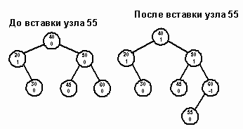

Рис. 6.
:::

Случай 2. Одно из поддеревьев узла перевешивает, и новый узел
вставляется в более легкое поддерево. Узел становится сбалансированным.
Сравните, например, состояния дерева до и после вставки узла 55 (рисунок
7).

Случай 3. Одно из поддеревьев узла перевешивает, и новый узел помещается
в более тяжелое поддерево. Тем самым нарушается условие
сбалансированности, так как balanceFactor выходит за пределы -1..1.
Чтобы восстановить равновесие, нужно выполнить поворот.

:::{.center}
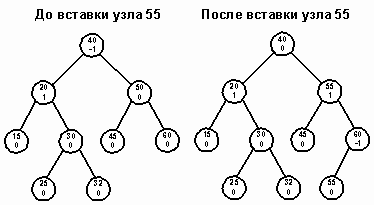

Рис. 7.
:::

Рассмотрим пример. Предположим, дерево разбалансировалось слева и мы
восстанавливаем равновесие, вызывая одну из функций поворота вправо.
Разбалансировка справа влечет за собой симметричные действия.

Сказанное иллюстрируется рисунком 8. При разработке алгоритма поворота
мы включили дополнительные детали.

Метод AVLInsert

 

Продвигаясь вдоль некоторого пути для вставки нового узла, рекурсивный
метод AVLInsert распознает все три указанных выше случая корректировки.
При нарушении условия сбалансированности восстановление равновесия
осуществляется с помощью функций UpdateLeftTree и UpdateRightTree.

    template < class T >
      void AVLTreelt;
    Tgt;
    : : AVLInsert(AVLTreeNodelt; Tgt; * tree,
      AVLTreeNodelt; Tgt; * newNode, int reviseBalanceFactor)
    {
      // флаг "Показатель сбалансированности был изменен"
      int rebalanceCurrNode;
     
      // встретилось пустое поддерево. Пора вставлять новый узел
      if (tree == NULL)
      {
        // вставить новый узел
        tree = newNode;
     
        // объявить новый узел сбалансированным
        tree-gt;balanceFactor = balanced;
     
        // сообщить об изменении показателя сбалансированности
        reviseBalanceFactor = 1;
      }
      // рекурсивно спускаться по левому поддереву, если новый узел меньше текущего
    else if (newNode - gt; data lt; tree - gt; data)
      {
      AVLInsert(tree-gt;Left(), newNode, rebalanceCurrNode);
      // проверить, нужно ли корректировать balanceFactor
      if (rebalanceCurrNode)
      {
        // вставка слева от узла, перевешивающего влево. будет нарушено
        // условие сбалансированности; выполнить поворот (случай 3)
        if (tree-gt;balanceFactor == leftheavy)
          UpdateLeftTree(tree, reviseBalanceFactor);
     
        // вставка слева от сбалансированного узла.
        // узел станет перевешивать влево (случай 1)
        else if (tree-gt;balanceFactor == balanced)
        {
          tree-gt;balanceFactor = leftheavy;
          reviseBalanceFactor = 1;
        }
        // вставка слева от узла, перевешивающего вправо.
        // узел станет сбалансированным (случай 2)
    else
      {
        tree-gt;balanceFactor = balanced;
        reviseBalanceFactor = 0;
      }
      }
    else
      // перебалансировка не требуется. не опрашивать предыдущие узлы
      reviseBalanceFactor = 0;
      }
        // иначе рекурсивно спускаться по правому поддереву
    else if (newNode - gt; data lt; tree - gt; data)
      {
      AVLInsert(tree-gt;Right(), newNode, rebalanceCurrNode);
      // проверить, нужно ли корректировать balanceFactor
      if (rebalanceCurrNode)
      {
        // вставка справа от узла, перевешивающего вправо. будет нарушено
        // условие сбалансированности; выполнить поворот (случай 3)
        if (tree-gt;balanceFactor == rightheavy)
          UpdateRightTree(tree, reviseBalanceFactor);
     
        // вставка справа от сбалансированного узла.
        // узел станет перевешивать вправо (случай 1)
        else if (tree-gt;balanceFactor == balanced)
        {
          tree-gt;balanceFactor = rightheavy;
          reviseBalanceFactor = 1;
        }
        // вставка справа от узла, перевешивающего влево.
        // узел станет сбалансированным (случай 2)
    else
      {
        tree-gt;balanceFactor = balanced;
        reviseBalanceFactor = 0;
      }
      }
    else
      // перебалансировка не требуется. не опрашивать предыдущие узлы
      reviseBalanceFactor = 0;
      }
        }

:::{.center}
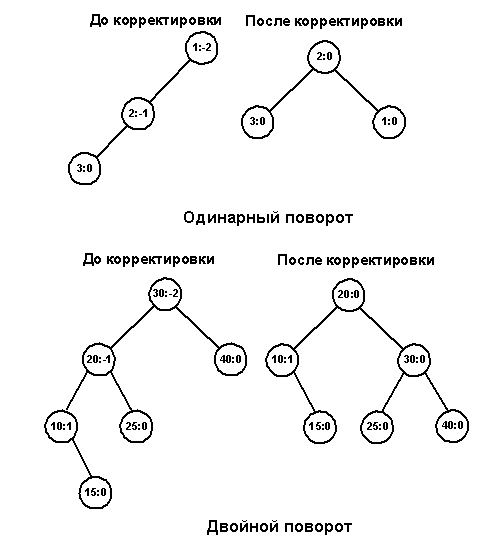

Рис. 8.
:::

Метод AVLInsert распознает случай 3, когда нарушается AVL-условие. Для
выполнения перебалансировки используются методы UpdateLeftTree и
UpdateRightTree. Они выполняют одинарный или двойной поворот для
уравновешивания узла, а затем сбрасывают флаг reviseBalanceFactor. Перед
тем, как обсудить специфические детали поворотов, приведем код функции
UpdateLeftTree.

    template < class T >
      void AVLTreelt;
    Tgt;
    : : UpdateLeftTree(AVLTreeNodelt; Tgt; * p,
      int reviseBalanceFactor)
    {
      AVLTreeNodelt;Tgt; *lc;
     
      lc = p-gt;Left();
      // перевешивает левое поддерево?
      if (lc-gt;balanceFactor == leftheavy)
      {
        SingleRotateRight(p);       // однократный поворот
        reviseBalanceFactor = 0;
      }
      // перевешивает правое поддерево?
    else if (lc - gt; balanceFactor = = rightheavy)
      {
      // выполнить двойной поворот
      DoubleRotateRight(p);
      // теперь корень уравновешен
      reviseBalanceFactor = 0;
    }
    }

Повороты

 

Повороты необходимы, когда родительский узел P становится
расбалансированным. Одинарный поворот вправо (single right rotation)
происходит тогда, когда родительский узел P и его левый сын LC начинают
перевешивать влево после вставки узла в позицию X. В результате такого
поворота LC замещает своего родителя, который становится правым сыном.
Бывшее правое поддерево узла LC (ST) присоединяется к P в качестве
левого поддерева. Это сохраняет упорядоченность, так как узлы в ST
больше или равны узлу LC, но меньше узла P. Поворот уравновешивает как
родителя, так и его левого сына (рисунок 9).

    // выполнить поворот по часовой стрелке вокруг узла p.
    // сделать lc новой точкой вращения
    template < class T >
      void AVLTree < T > : : SingleRotateRight(AVLTreeNode < T > * p)
      {
        // левое, перевешивающее поддерево узла p
        AVLTreeNode<T> *lc;
     
        // назначить lc левым поддеревом
        lc = p->Left();
     
        // скорректировать показатель сбалансированности для
        // родительского узла и его левого сына
        p-gt;balanceFactor = balanced;
        lc-gt;balanceFactor = balanced;
        // правое поддерево узла lc в любом случае должно оставаться справа
        // от lc. выполнить это условие, сделав st левым поддеревом узла p
        p-gt;Left() = lc-gt;Right();
     
        // переместить p в правое поддерево узла lc.
        // сделать lc новой точкой вращения.
        lc-gt;Right() = p;
        p = lc;
      }

:::{.center}
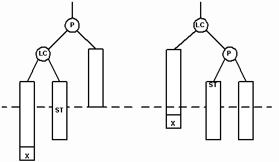

Рис. 9.
:::

:::{.center}
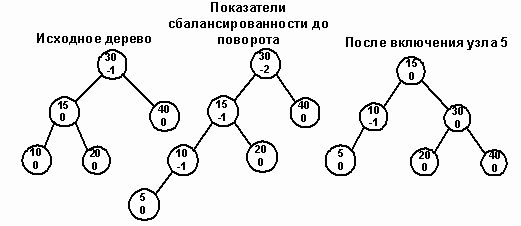

Рис. 10.
:::

Попытка вставить узел 5 в изображенное на рисунке 10 AVL-дерево нарушает
AVL-условие для узла 30. Одновременно левое поддерево узла 15 (LC)
становится перегруженным. Для переупорядочения узлов вызывается
процедура SingleRotateRight. В результате родительский узел (30)
становится сбалансированным, а узел 10 перевешивающим влево.

Двойной поворот вправо (double rigyn rotation) нужен тогда, когда
родительский узел (P) становится перевешивающим влево, а его левый сын
(LC) перевешивающим вправо. NP -- корень правого перевешивающего
поддерева узла LC. Тогда в результате поворота узел NP замещает
родительский узел. На рисунках 11 и 12 показаны случаи вставки нового
узла в качестве сына узла NP. В обоих случаях NP становится родительским
узлом, а бывший родитель P становится правым сыном NP.

На рисунке 11 мы видим сдвиг узла X1, после того как он был вставлен в
левое поддерево узла NP. На рисунке 12 изображено перемещение узла X2
после его вставки в правое поддерево NP.

:::{.center}
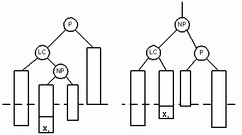

Рис. 11.
:::

:::{.center}
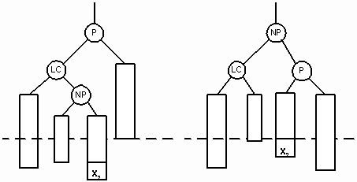

Рис. 12.
:::

    // двойной поворот вправо вокруг узла p
    template < class T >
      void AVLTree < T > : : DoubleRotateRight(AVLTreeNode < T > * p)
      {
        // два поддерева, подлежащих повороту
        AVLTreeNode<T> *lc, *np;
     
        // узел lc <= узел np < узел p
        lc = p->Left();      // левый сын узла p
        np = lc->Right();    // правый сын узла lc
     
        // обновить показатели сбалансированности в узлах p, lc и np
        if (np->balanceFactor == rightheavy)
        {
          p->balanceFactor = balanced;
          lc->balanceFactor = rightheavy;
        }
    else
      {
        p->balanceFactor = rightheavy;
        lc->balanceFactor = balanced;
      }
      np - > balanceFactor = balanced;
     
      // перед тем как заменить родительский узел p,
      // следует отсоединить его старых детей и присоединить новых
      lc - > Right() = np - > Left();
      np - > Left() = lc;
      p - > Left() = np - > Right();
      np - > Right() = p;
      p = np;
      }

Двойной поворот иллюстрируется на дереве, изображенном на рисунке 13.
Попытка вставить узел 25 разбалансирует корневой узел 50. В этом случае
узел 20 (LC) приобретает слишком высокое правое поддерево и требуется
двойной поворот. Новым родительским узлом (NP) становится узел 40.
Старый родительский узел становится его правым сыном и присоединяет к
себе узел 45, который также переходит с левой стороны дерева.

:::{.center}
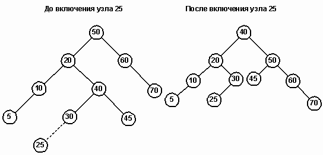

Рис. 13.
:::

Оценка сбалансированных деревьев

 

Обоснованность применения AVL-деревьев неоднозначна, поскольку они
требуют дополнительных затрат на поддержание сбалансированности при
вставке или удалении узлов. Если в дереве постоянно происходят вставки и
удаления элементов, эти операции могут значительно снизить
быстродействие. С другой стороны, если ваши данные превращают бинарное
дерево поиска в вырожденное, вы теряете поисковую эффективность и
вынуждены использовать AVL-дерево. В большинстве случаев в программах
используются алгоритмы, когда сначала заполняется список, а потом
производится поиск по этому списку с небольшим количеством изменений.
Поэтому на практике использование AVL-деревьев предпочтительно.

Для AVL-дерева не существует наихудшего случая, так как оно является
почти полным бинарным деревом. Сложность операции поиска составляет
O(log2n). Опыт показывает, что повороты требуются примерно в половине
случаев вставок и удалений. Сложность балансировки обусловливает
применение AVL-деревьев только там, где поиск является доминирующей
операцией.

Оценка производительности AVL-деревьев

 

Эта программа сравнивает сбалансированное и обычное бинарные деревья
поиска, каждое из которых содержит N случайных чисел. Исходные данные
для этих деревьев берутся из единого массива. Для каждого элемента
массива осуществляется его поиск в обоих деревьях. Длины поисковых путей
суммируются, а затем подсчитывается средняя длина поиска по каждому
дереву.

Программа прогоняется на 1000- и на 10000-элементном массивах. Обратите
внимание, что на случайных данных поисковые характеристики AVL-дерева
несколько лучше. В самом худшем случае вырожденное дерево поиска,
содержащее 1000 элементов, имеет среднюю глубину 500, в то время как
средняя глубина AVL-дерева всегда равна 9.

    #0include < iostream.h >
    #0include "bstree.h"
    #0include "avltree.h"
    #0include "random.h"
     
    // загрузить из массива числа в бинарное поисковое дерево и AVL-дерево
    void SetupLists(BinSTree < int > Tree1, AVLTree < int > Tree2, int A[], int n)
    {
      int i;
      RandomNumber rnd;
     
      // запомнить случайное число в массиве А, а также вставить его
      // в бинарное дерево поиска и в AVL-дерево
      for (i=0; i<n; i++)
      {
        A[i] = rnd.Random(1000);
        Tree1.Insert(A[i]);
        Tree2.Insert(A[i]);
      }
    }
     
    // поиск элемента item в дереве t.
    // При этом накапливается суммарная длина поиска.
    template < class T >
      void PathLength(TreeNode < T > * t, long totallength, int item)
        {
        // возврат, если элемент найден или отсутствует в списке
        if (t == NULL || t->data == item)
          return;
        else
        {
          // перейти на следующий уровень. Увеличить суммарную длину пути поиска.
          totallength++;
          if (item < t->data)
            PathLength(t->Left(), totallength, item);
          else
            PathLength(t->Right(), totallength, item);
        }
      }
        void main(void);
    {
      // переменные для деревьев и массива
      BinSTree<int> binTree;
      AVLTree<int>  avlTree;
      int *A;
     
      // суммарные длины поисковых путей элементов
      // массива в бинарном дереве поиска
      // и в AVL-дереве
      long totalLengthBintree = 0, totalLengthAVLTree = 0;
      int n, i;
      cout << "Сколько узлов на дереве? ";
      cin >> n;
     
      // загрузить случайными числами массив и оба дерева
      SetupLists(binTree, avlTree, A, n);
     
      for (i=0; i<n; i++)
      {
        PathLength(binTree.GetRoot(), totalLengthBintree, A[i]);
        PathLength((TreeNode<int> *)avlTree.getRoot(),
                    totalLengthAVLTree, A[i]);
      }
    cout < < "Средняя длина поиска для бинарного дерева = "
    < < float(totalLengthBintree) / n < < endl;
    cout < < "Средняя длина поиска для сбалансированного дерева = "
    < < float(totalLengthAVLTree) / n < < endl;
    }

Прогон 1:

Сколько узлов на дереве? 1000
Средняя длина поиска для бинарного дерева = 10.256

Средняя длина поиска для сбалансированного дерева = 7.901

Прогон 2:

Сколько узлов на дереве? 10000
Средняя длина поиска для бинарного дерева = 12.2822
Средняя длина поиска для сбалансированного дерева = 8.5632

Итераторы деревьев

 

Сканирование узлов дерева более сложно, чем сканирование массивов и
последовательных списков, так как дерево является нелинейной структурой
и существует несколько способов прохождения дерева. Мы уже разбирали эти
способы выше. Проблема каждого из них состоит в том, что до завершения
рекурсивного процесса из него невозможно выйти. Нельзя остановить
сканирование, проверить содержимое узла, выполнить какие-нибудь операции
с данными, а затем вновь продолжить сканирование со следующего узла
дерева. Используя же итератор, клиент получает средство сканирования
узлов дерева, как если бы они представляли собой линейный список, без
обременительных деталей алгоритмов прохождения, лежащих в основе
процесса.

Наш класс использует класс Stack и наследуется от базового класса
итератора. Поэтому сначала опишем класс Stack и базовый класс итератора.

Спецификация класса Stack

 

Объявление

    #0include < iostreani.h >
    #0include < stdlib.h >
     
    const
      int MaxStackSize = 50;
     
      class Stack
        {
            private:
                DataType stacklist[MaxStackSize];
                int top;
            public:
                // конструктор; инициализирует вершину
                Stack(void);
     
                // операции модификации стека
                void Push(const DataType item);
                DataType Pop(void);
                void ClearStack(void);
     
                // доступ к стеку
                DataType Peek(void) const;
     
               // методы проверки состояния стека
               int StackEmpty(void) const;
               int StackFull(void) const; // для реализации, основанной на массиве
        };

Описание

Данные в стеке имеют тип DataType, который должен определяться с
использованием оператора typedef. Пользователь должен проверять, полный
ли стек, перед попыткой поместить в него элемент и проверять, не пустой
ли стек, перед извлечением данных из него. Если предусловия для операции
push или pop не удовлетворяются, печатается сообщение об ошибке и
программа завершается.

StackEmpty возвращает TRUE, если стек пустой, и FALSE --- в противном
случае. Используйте StackEmpty, чтобы определить, может ли выполняться
операция Pop.

StackFull возвращает TRUE, если стек полный, и FALSE --- в противном
случае. Используйте StackFull, чтобы определить, может ли выполняться
операция Push.

ClearStack делает стек пустым, устанавливая top = -1. Этот метод
позволяет использовать стек для других целей.

Реализация класса Stack

 

Конструктор Stack присваивает индексу top значение -1, что эквивалентно
условию пустого стека.

//инициализация вершины стека

Stack: : Stack(void): top(-l)

{ }

Операции стека.

 

Две основные операции стека вставляют (Push) и удаляют (Pop) элемент из
стека. Класс содержит функцию Peek, позволяющую получать данные
элемента, находящегося в вершине стека, не удаляя в действительности
этот элемент.

При помещении элемента в стек, top увеличивается на 1, и новый элемент
вставляется в конец массива stacklist. Попытка добавить элемент в полный
стек приведет к сообщению об ошибке и завершению программы.

    // поместить элемент в стек
    void Stack: : Push(const DataTypes item)
    {
       // если стек полный, завершить выполнение программы
       if (top ==  MaxStackSize-1)
      {
          cerr << "Переполнение стека!" << endl;
          exit(l);
       }
       // увеличить индекс top и копировать item в массив stacklist
    top + +;
    stacklist[top] = item;
    }

Операция Pop извлекает элемент из стека, копируя сначала значение из
вершины стека в локальную переменную temp и затем увеличивая top на 1.
Переменная temp становится возвращаемым значением. Попытка извлечь
элемент из пустого стека приводит к сообщению об ошибке и завершению
программы.

     
    // взять элемент из стека
    DataType Stack: : Pop(void)
     
    DataType temp;
     
    // стек пуст, завершить программу
    if (top = = -1)
      {
      cerr <<  "Попытка обращения к пустому стеку! " << end.1;
      exit(1);
    }
     
    // считать элемент в вершине стека
    temp = stacklist[top];
     
    // уменьшить top и возвратить значение из вершины стека
    top - -;
    return temp;
    }

Операция Peek в основном дублирует определение Pop с единственным важным
исключением. Индекс top не уменьшается, оставляя стек нетронутым.

    // возвратить данные в вершине стека
    DataType Stack: : Peek(void)const
      {
          // если стек пуст, завершить программу
          if (top == -1)
         {
             cerr <<  "Попытка считать данные из пустого стека!" <<  end.1;
             exit(l);
          }
      return stacklist[top];
      }

Условия тестирования стека

 

Во время своего выполнения операции стека завершают программу при
попытках клиента обращаться к стеку неправильно; например, когда мы
пытаемся выполнить операцию Peek над пустым стеком. Для защиты
целостности стека класс предусматривает операции тестирования состояния
стека.

Функция StackEmpty проверяет, является ли top равным -1. Если --- да,
стек пуст и возвращаемое значение --- TRUE; иначе возвращаемое значение
--- FALSE.

    // тестирование стека на наличие в нем данных
    int Stack: : StackEmpty(void)const
      {
         return top == -1;
      }

Функция StackFull проверяет, равен ли top значению MaxStackSize - 1.
Если так, то стек заполнен и возвращаемым значением будет TRUE; иначе,
возвращаемое значение --- FALSE.

    // проверка, не переполнен ли стек
    int Stack: : StackFuli(void)const
      {
         return top == MaxStackSize-1;
      }

Метод ClearStack переустанавливает вершину стека на -1. Это
восстанавливает начальное условие, определенное конструктором.

    // удалить все элементы из стека
    void Stack: : ClearStack(void)
    {
        top = -1;
    }

Стековые операции Push и Pop используют прямой доступ к вершине стека и
не зависят от количества элементов в списке.

Абстрактный базовый класс Iterator

 

Класс Iterator позволяет абстрагироваться от тонкостей реализации
алгоритма перебора, что дает независимость от деталей реализации
базового класса. Мы определяем абстрактный класс Iterator как шаблон для
итераторов списков общего вида.

Спецификация класса Iterator

 

Объявление

    template < class T >
      class Iterator
        {
        protected:
        // Флаг, показывающий, достиг ли итератор конца списка.
        // Должен поддерживаться производными классами.
        int iterationComplete;
     
        public:
     
        // конструктор
        Iterator(void);
     
        // обязательные методы итератора
        virtual void Next(void) = 0;
        virtual void Reset(void) = 0;
     
        // методы для выборки/модификации данных
        virtual T Data(void) = 0;
     
        // проверка конца списка
        virtual int EndOfList(void) const;
     
        };

Обсуждение

Итератор является средством прохождения списка. Его основные методы:
Reset (установка на первый элемент списка), Next (переход на следующий
элемент), EndOfList (определение конца списка). Функция Data
осуществляет доступ к данным текущего элемента списка.

Итератор симметричного метода прохождения

 

Симметричное прохождение бинарного дерева поиска, в процессе которого
узлы посещаются в порядке возрастания их значений, является полезным
инструментом.

Объявление

    // итератор симметричного прохождения бинарного дерева.
    // использует базовый класс Iterator
    template < class T >
      class InorderIterator: public Iterator < T >
        {
          private:
            // поддерживать стек адресов узлов
            Stack< TreeNode <T> * > S;
            // корень дерева и текущий узел
            TreeNode<T> *root, *current;
     
            // сканирование левого поддерева используется функцией Next
            TreeNode<T> *GoFarLeft(TreeNode<T> *t);
     
          public:
            // конструктор
            InorderIterator(TreeNode<T> *tree);
     
            // реализации базовых операций прохождения
            virtual void Next(void);
            virtual void Reset(void);
            virtual T Data(void);
     
            // назначение итератору нового дерева
            void SetTree(TreeNode<T> *tree);
        };

Описание

Класс InorderIterator построен по общему для всех итераторов образцу.
Метод EndOfList определен в базовом классе Iterator. Конструктор
инициализирует базовый класс и с помощью GoFarLeft находит начальный
узел сканирования.

Пример

    TreeNode < int > * root; // бинарное дерево
    InorderIterator treeiter(root); // присоединить итератор
     
    // распечатать начальный узел сканирования.
    // для смешанного прохождения это самый левый узел дерева
    cout < < treeiter.Data();
     
    // сканирование узлов и печать их значений
    for (treeiter.Reset(); !treeiter.EndOfList(); treeiter.Next())
      cout < < treeiter.Data() < < " ";

Реализация класса InorderIterator

 

Итерационный симметричный метод прохождения эмулирует рекурсивное
сканирование с помощью стека адресов узлов. Начиная с корня,
осуществляется спуск вдоль левых поддеревьев. По пути указатель каждого
пройденного узла запоминается в стеке. Процесс останавливается на узле с
нулевым левым указателем, который становится первым посещаемым узлом в
симметричном сканировании. Спуск от узла t и запоминание адресов узлов в
стеке выполняет метод GoFarLeft. Вызовом этого метода с t=root ищется
первый посещаемый узел (рисунок 14).

    // вернуть адрес крайнего узла на левой ветви узла t.
    // запомнить в стеке адреса всех пройденных узлов
    template < class T >
      TreeNode < T > * InorderIterator < T > : : GoFArLeft(TreeNode < T > * t)
      {
        // если t=NULL, вернуть NULL
        if (t == NULL)
          return NULL;
        // пока не встретится узел с нулевым левым указателем,
        // спускаться по левым ветвям, запоминая в стеке S
        // адреса пройденных узлов. Возвратить указатель на этот узел
        while (t->Left() != NULL)
        {
          S.Push(t);
          t = t->Left();
        }
      return t;
      }

:::{.center}
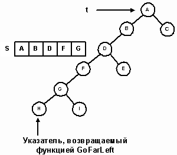

Рис. 14.
:::

После инициализации базового класса конструктор присваивает элементу
данных root адрес корня бинарного дерева поиска. Узел для начала
симметричного сканирования получается в результате вызова функции
GoFarLeft с root в качестве параметра. Это значение запоминается в
переменной сurrent.

    // инициализировать флаг iterationComplete. Базовый класс сбрасывает его, но
    // дерево может быть пустым. начальный узлел сканирования - крайний слева узел.
    template < class T >
      InorderIterator < T > : : InorderIterator(TreeNode < T > * tree):
      Iterator < T > (), root(tree)
        {
        iterationComplete = (root == NULL);
        current = GoFarLeft(root);
      }

Метод Reset по существу является таким же, как и конструктор, за
исключением того, что он очищает стек.

Перед первым обращением к Next указатель current уже указывает на первый
узел симметричного сканирования. Метод Next работает по следующему
алгоритму.

::: {style="text-align: left; text-indent: 0px; padding: 0px 0px 0px 0px; margin: 7px 0px 7px 24px;"}
  ---- ----------------------------------------------------------------------------------------------------------------------------------------------------------------------------------------
  1.   Если правая ветвь узла не пуста, перейти к его правому сыну и осуществить спуск по левым ветвям до узла с нулевым левым указателем, попутно запоминая в стеке адреса пройденных узлов.
  ---- ----------------------------------------------------------------------------------------------------------------------------------------------------------------------------------------
:::

::: {style="text-align: left; text-indent: 0px; padding: 0px 0px 0px 0px; margin: 7px 0px 7px 24px;"}
  ---- ------------------------------------------------------------------------------------------------------------------------------------------------------------------------------------------------------------------------------------------------------------------------------------------
  1.   Если правая ветвь узла пуста, то сканирование его левой ветви, самого узла и его правой ветви завершено. Адрес следующего узла, подлежащего обработке, находится в стеке. Если стек не пуст, удалить следующий узел. Если же стек пуст, то все узлы обработаны и сканирование завершено.
  ---- ------------------------------------------------------------------------------------------------------------------------------------------------------------------------------------------------------------------------------------------------------------------------------------------
:::

Итерационное прохождение дерева, состоящего из пяти узлов, изображено на
рисунке 15.

:::{.center}
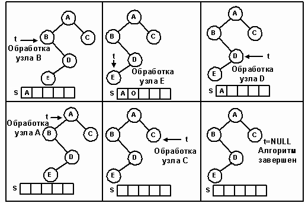

Рис. 15.
:::

    template < class T >
      void InorderIterator < T > : : Next(void)
      {
        // ошибка, если все узлы уже посещались
        if (iterationComplete)
        {
          cerr << "Next: итератор прошел конец списка!" << endl;
          exit(1);
        }
     
        // current - текущий обрабатываемый узел.
        // если есть правое поддерево, спуститься до конца по его левой ветви,
        // попутно запоминая в стеке адреса пройденных узлов
      if (current - > Right()! = NULL)
        current = GoFarLeft(current - > Right());
     
      // правого поддерева нет, но в стеке есть другие узлы,
      // подлежащие обработке. вытолкнуть из стека новый текущий адрес,
      // продвинуться вверх по дереву
    else if (!S.StackEmpty())
      current = S.Pop();
    // нет ни правого поддерева, ни узлов в стеке. сканирование завершено
    else
      iterationComplete = 1;
      }

Алгоритм TreeSort

 

Когда объект типа InorderIterator осуществляет прохождение дерева
поиска, узлы проходятся в сортированном порядке и, следовательно, можно
построить еще один алгоритм сортировки, называемый TreeSort. Этот
алгоритм предполагает, что элементы изначально хранятся в массиве.
Поисковое дерево служит фильтром, куда элементы массива копируются в
соответствии с алгоритмом вставки в бинарное дерево поиска. Осуществляя
симметричное прохождение этого дерева и записывая элементы снова в
массив, мы получаем в результате отсортированный список. На рисунке 16
показана сортировка 8-элементного массива.

    #0include "bstree.h"
    #0include "treeiter.h"
     
    // использование бинарного дерева поиска для сортировки массива
    template < class T >
      void TreeSort(T arr[], int n)
        {
        // бинарное дерево поиска, в которое копируется массив
        BinSTree<T> sortTree;
        int i;
     
        // вставить каждый элемент массива в поисковое дерево
        for (i=0; i<n; i++)
          sortTree.Insert(arr[i]);
        // объявить итератор симметричного прохождения для sortTree
        InorderIterator<T> treeSortIter(sortTree.GetRoot());
     
        // выполнить симметричное прохождение дерева.
        // скопировать каждый элемент снова в массив
        i = 0;
        while (!treeSortIter.EndOfList())
        {
          arr[i++] = treeSortIter.Data();
          treeSortIter.Next();
        }
      }

:::{.center}
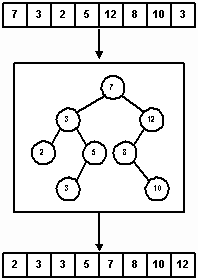

Рис. 16.
:::

Эффективность сортировки вставкой в дерево.

 

Ожидаемое число сравнений, необходимых для вставки узла в бинарное
дерево поиска, равно O(log2n). Поскольку в дерево вставляется n
элементов, средняя эффективность должна быть O(n log2n). Однако в худшем
случае, когда исходный список отсортирован в обратном порядке, она
составит O(n2). Соответствующее дерево поиска вырождается в связанный
список. Покажем, что худший случай требует O(n2) сравнений. Первая
вставка требует 0 сравнений. Вторая вставка -- двух сравнений (одно с
корнем и одно для определения того, в какое поддерево следует вставлять
данное значение). Третья вставка требует трех сравнений, 4-я
четырех,..., n-я вставка требует n сравнений. Тогда общее число
сравнений равно:

0 + 2 + 3 + ... + n = (1 + 2 + 3 + ... + n) - 1 = n(n + 1) / 2 - 1 =
O(n2)

Для каждого узла дерева память должна выделяться динамически, поэтому
худший случай не лучше, чем сортировка обменом.

Когда n случайных значений повторно вставляются в бинарное дерево
поиска, можно ожидать, что дерево будет относительно сбалансированным.
Наилучшим случаем является законченное бинарное дерево. Для этого случая
можно оценить верхнюю границу, рассмотрев полное дерево глубиной d. На
i-ом уровне (1?i?d) имеется 2i узлов. Поскольку для помещения узла на
уровень i требуется i+1 сравнение, сортировка на полном дереве требует
(i+1) \* 2i сравнений для вставки всех элементов на уровень i. Если
вспомнить, что n = 2(d+1) - 1, то верхняя граница меры эффективности
выражается следующим неравенством:

{.center}

Таким образом, эффективность алгоритма в лучшем случае составит O(n
log2n).

<https://delphiworld.narod.ru/>

DelphiWorld 6.0

 
