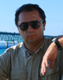
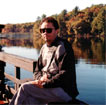

Авторы проекта
==============

Создатель **DRKB** и долгое время единственный ее разработчик: **Виталий Невзоров** (Vit):

<table width="100%">
<tr>
<td>
<a href="https://forum.sources.ru/index.php?showuser=4453" target="_blank">

Виталий Невзоров на sources.ru
</a>
</td>
<td>
<a href="https://forum.vingrad.ru/index.php?showuser=10" target="_blank">

Виталий Невзоров на vingrad.ru
</a>
</td>
</tr>
</table>

Виталий Невзоров является автором всех оффлайн версий **DRKB**
вплоть до версии **3.0** включительно.
(Это последняя версия, выпущенная за его авторством.)

К несчастью, Виталий Невзоров погиб в автокатастрофе 07 июля 2009г...

Найти информацию об авторах статей и ответов можно по адресу:  
Vingrad.ru: <https://forum.vingrad.ru/index.php?act=Members>  
Sourсes.ru: <https://forum.sources.ru/index.php?act=Members>

&nbsp;

---

Онлайн-версия сайта: [Valery Votintsev
(vot)](https://forum.sources.ru/index.php?showuser=2 "Valery Votintsev (vot)").

Модульная сетка и начальный дизайн сайта разработан:
[Sofiyan](https://www.colorcat.ru/ "Sofiyan (Caramel)")
(Caramel).

Поддержка проекта:
[Исходники.ru](https://forum.sources.ru/ "Исходники.Ru").
