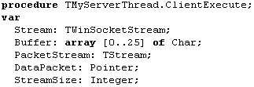
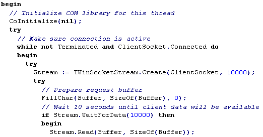

Inprise Midas
=============

::: {.date}
01.01.2007
:::

Inprise MIDAS

Multi Tier Distributed Application Services

© 1999 Marotz, Inc. All rights reserved.

Marotz is the nation's leading software project turnaround company.

 

All products or company names mentioned herein may be the trademarks of
their respective owners.

 

13518 Jamul Drive, Jamul, CA 91935-1635

\(619) 669-3100 (voice)

[www.marotz.com](www.marotz.com)

 

Inprise MIDAS Overview

In order to be successful in implementing modern distributed
applications, developers need a reliable, easy to use, and highly
scalable data access solution. Many tools provide this solution.  One of
the most advanced is Inprise's MIDAS.

MIDAS is essentially a data communication technology. Two parts of the
MIDAS style of communication are the provider and the client dataset. 
These two components exchange information with each other in what is
called a data packet. At a very low level the data packet is an array of
bytes, but actually it contains a table of data with sophisticated
support for data types, including BLOBs and nested tables.

Client Dataset

The client dataset can obtain a data packet from a provider, store it in
internal memory cache, and make it available for modification.  All
changes to the data are maintained in an internal log.  The original
data is accessible through the client dataset's Data property; the
change log is represented by the Delta property.  At any time the data
owned by the client dataset could be stored in an external file. All
changes will be stored along with original data.

In addition to allowing changes to the cached data, the client dataset
is well equipped for advanced sorting, filtering, and searching
operations. 

The client dataset knows nothing about the real source of data it owns.
Once it has received an array of bytes from a provider, that data
becomes eligible to do whatever you want with it.

Provider

The process of building the data packet is managed by the provider
component. A developer has full control over how data is prepared and
packaged. It is possible to build the data packet from the result of an
SQL query or to prepare it manually from any source of information
imaginable. Regardless of how the data is obtained, the final result
will be a unified data table encoded as an array of bytes, always.

A variety of field types known by the client dataset make it possible to
provide extremely rich data. This data can include strings, integers,
floating-point values, date-time fields, BLOBs, and more.  There is also
a special kind of field type, called a dataset field. With this field a
programmer can store an entire dataset as on field value of the result
set, effectively describing a master/detail relationship.  Using dataset
fields a programmer go so far as to incorporate an entire database
schema in a single array of bytes for manipulation by the client
dataset.

The data packet also provides other information related to the data. 
Two important parts of this information are constraints for both row and
field-level validation and custom properties. 

A constraint is a simple SQL evaluation and a corresponding error
message. When a client application updates the data contained by a
client dataset, constraints passed to it from the provider are
automatically enforced.  This happens on the client (not the server)
when the data entry takes place. If one of these constraints is
violated, the data update will be rejected and an exception with the
corresponding error message will be raised.

The programmer can add custom properties to a data packet when the
provider packages it. Each property has it own name, a value and life
time flag. The last one defines whether this custom property will become
the part of the dataset Delta data packet or not.

Working with a Data Packet

As soon as the data packet is placed in the internal cache of the client
dataset, you can manipulate its content. You can navigate between
records, locate records you are interested in, and filter subsets of
records using advanced filtering operators such as LIKE, GETDATE, TRIM,
LOWER, MONTH, and many others. You may also sort records in the client
dataset in any order without respect to their initial sequence.   The
client dataset is not aware of the real source of these records and
treats all the data columns equally.  Of course you can modify
(insert/update/delete) rows of the data as well.  The client dataset
keeps track of all changes made and maintains in-memory indices for you
to provide different orders of data packet records.

The client dataset also supports the Document/View architecture, so you
can have different views on the same data packet sharing its data
between several datasets. This operation is called cloning. You may have
as many clones of the data packet as you want.

A requirement for mobile computing is to make multiple changes to the
data packet during a continuos period of time.  It would be very helpful
to be able to store the data packet to a temporary file and load it back
when necessary, without loosing changes made to the data. The client
dataset provides you this capability. This model of computing is called
a briefcase.

Applying Updates

As soon as data in the data packet is successfully modified, all changes
may be applied to their original source. In order to accomplish this
goal, you must get the change log maintained by the client dataset and
pass it to the provider. If the source of the data packet is a database,
the provider is intelligent enough to send the data updates to the
corresponding tables.  You have total control of the update process and,
if necessary, you may add your own business logic or override it
completely. When the record from the change log can't be applied to the
original source, the provider writes it to an error log along with an
error message and current data values from the original source.

When the change log is processed, the provider either commits all
successful changes to the database or rolls them back.  Commit or
rollback is dependent upon the number of errors that occurred and your
directions of how many errors may occur.   The provider then sends all
problems logged in the error log to the client dataset.

Reconciling

The client dataset checks the error log received from the provider and
compares it to its change log. While iterating through the change log,
it tries to locate the record in the error log.  If the current record
of the change log is not found, then the client dataset merges the
record with the original data packet and removes it from the change log.

For each problematic record a special event handler is fired. Developer
has a full access to the new and old field values of the record in the
change log, their current values in the database, when possible, and the
error returned from provider. The special pre build error reconciliation
dialog may be used to handle update errors along with your own code.

Data Packet Delivery

Now we know that three different kinds of data packets may flow between
the provider and the client dataset. The following table summarizes
every possible data flow.

+-----------------+-----------------+-----------------+-----------------+
| No              | From            | To              | Purpose         |
+-----------------+-----------------+-----------------+-----------------+
| 1.              | Provider        | Client Dataset  | Data is         |
|                 |                 |                 | packaged in the |
|                 |                 |                 | data packet and |
|                 |                 |                 | placed in the   |
|                 |                 |                 | client          |
|                 |                 |                 | dataset's       |
|                 |                 |                 | internal cache. |
+-----------------+-----------------+-----------------+-----------------+
| 2.              | Client Dataset  | Provider        | The content of  |
|                 |                 |                 | the client      |
|                 |                 |                 | dataset's       |
|                 |                 |                 | change log is   |
|                 |                 |                 | sent back to    |
|                 |                 |                 | provider to be  |
|                 |                 |                 | resolved with   |
|                 |                 |                 | original source |
|                 |                 |                 | of information. |
+-----------------+-----------------+-----------------+-----------------+
| 3.              | Provider        | Client Dataset  | The error log   |
|                 |                 |                 | produced in the |
|                 |                 |                 | process of      |
|                 |                 |                 | resolving       |
|                 |                 |                 | changes by the  |
|                 |                 |                 | provider is     |
|                 |                 |                 | sent back to    |
|                 |                 |                 | the client      |
|                 |                 |                 | dataset to      |
|                 |                 |                 | reconcile       |
|                 |                 |                 | errors with the |
|                 |                 |                 | client          |
|                 |                 |                 | dataset's       |
|                 |                 |                 | change log.     |
+-----------------+-----------------+-----------------+-----------------+

There are two possible architectures of MIDAS-based applications. The
first architecture consists of a monolithic application that hosts both
the provider and the client dataset components. The second architecture
consists of multiple applications that have either providers or client
datasets built into them.

In the first instance you have direct programmatic access to all
properties of both the provider and the client dataset components: It's
not a big deal to get the data packet in one place and put it in
another. 

The second architecture is just a little bit more challenging if you are
relying on "standard" protocols with the remote procedure call support
such as IIOP (CORBA) or RPC (DCOM, DCE) in order to deliver data from
one application to another. Of course you always have the choice to use
plain TCP/IP to implement the information exchange between your
applications.  Because all data packets are represented as array of
bytes, you may easily send them across the wire using any of the above
technologies.

Summary

Inprise MIDAS provides a high performance mechanism to communicate
database information. Two MIDAS components, the client dataset and
provider, exchange data packets with each other.   The provider is
responsible for building the data packet and applying data packet
updates to the original source of data. The client dataset enables
manipulations of the data packet content.

Different techniques may be used to deliver the data packets from the
provider to the client dataset and from the client dataset back to
provider. They will be considered later.

MIDAS Availability

MIDAS is implemented as a set of VCL components for Delphi and C++
Builder. There are also several tools, which facilitate MIDAS
development. The Data Dictionary and OLEnterprise will be discussed
later in this paper. The highest possible development automation and
runtime performance of MIDAS components may be achieved right from the
box when the Borland Database Engine (BDE) is used.  This is because the
BDE-enabled provider is included in Client/Server editions of Delphi and
C++ Builder. Developers are free to design their own providers to work
with any other kind of data access tools and information sources.

The Enterprise editions of Delphi and C++ Builder come with the Entera
middleware suite.  Part of this tool is a data access technology, which
may be leveraged with the Entera provider component.

J/MIDAS client is another great peace of technology from Inprise.  With
this you may design Java clients capable of interacting with MIDAS
servers written in either Delphi or C++ Builder.  J/MIDAS is a set of
java beans components which read the data packet content and post
changes to it.

 

{width="403" height="339"}

"Hello World" with MIDAS

Let's say "Hello World" in the MIDAS way. In this sample we will use
standard Delphi data access components including TDatabase, TQuery,
TProvider, and TClientDataSet. 

In Delphi, perform the following steps:

  ---- ---------------------------------------------------------------------------------------------------
  1.   Select File \| New Application.   The main form of our application and a project will be created.
  ---- ---------------------------------------------------------------------------------------------------

  ---- -------------------------------------------------------------------------------------------------------------------
  2.   Select File \| New...\| Data Module.  This will give us the data module that will host our non-visual components.
  ---- -------------------------------------------------------------------------------------------------------------------

  ---- -------------------------------------------------------------------------------------------------------
  3.   Select File \| Save All.  For the purpose of this example, use the default names suggested by Delphi.
  ---- -------------------------------------------------------------------------------------------------------

At this point we have the following structure for our sample:

+-----------------------------------+-----------------------------------+
| Project Element                   | File(s)                           |
+-----------------------------------+-----------------------------------+
| Project1                          | Project1.dpr                      |
+-----------------------------------+-----------------------------------+
| Form1                             | Unit1.pas / Unit1.dfm             |
+-----------------------------------+-----------------------------------+

+-----------------------------------+-----------------------------------+
| DataModule2                       | Unit2.pas / Unit2.dfm             |
+-----------------------------------+-----------------------------------+

  ---- --------------------------------------------------------------------------------------------------------------------------------------------------------------------------------------------------------
  4.   Select the Data Access page on the component palette. Drop a TDatabase component on the DataModule2. Double click it and set its properties as shown in the picture below. Then click the "OK" button.
  ---- --------------------------------------------------------------------------------------------------------------------------------------------------------------------------------------------------------

  ---- ------------------------------------------------------------------
  5.   Launch the Local InterBase Server from the Windows "Start" menu.
  ---- ------------------------------------------------------------------

  ---- --
  6.   
  ---- --

{width="479" height="318"}

  ---- -----------------------------------------------------------------------------------------
  1.   Set the Connected property of the TDatabase component to True to verify the connection.
  ---- -----------------------------------------------------------------------------------------

  ---- ---------------------------------------------------------------------------------------------------------------------------------------------------------------------------------------------------------------
  2.   Drop a TQuery component on your form and set its DatabaseName property to 'internalIBLocal' and SQL property to 'SELECT \* FROM department'. Verify the query, setting Active to True and then back to False.
  ---- ---------------------------------------------------------------------------------------------------------------------------------------------------------------------------------------------------------------

  ---- ---------------------------------------------------------------------------------------------------------------------------------------
  3.   Select the MIDAS page on the component palette. Drop a TProvider component on the data module and set the DataSet property to Query1.
  ---- ---------------------------------------------------------------------------------------------------------------------------------------

  ---- ----------------------------------------------------------------------------------------------------
  4.   Drop a TClientDataSet component on the data module and set its ProviderName property to Provider1.
  ---- ----------------------------------------------------------------------------------------------------

  ---- -----------------------------------------------------------------------------------------------------------------------------------------------------------------------
  5.   Go again to the Data Access page on the component palette, select a TDataSource component and drag it to the data module. Set its DataSet property to ClientDataSet1.
  ---- -----------------------------------------------------------------------------------------------------------------------------------------------------------------------

  ---- ----------------------------------------------------------------------------------------------------------------------------------------------------------------------------------------------------------------------------------------------------------------------------------------------------------------------------------------------------
  6.   Drag a TActionList component from the Standard page of the component palette and drop it on the Data Module.  Double click the Action List component to bring up Action List Editor. Create two new actions. Those actions will get their names Action1 and Action2 by default.  Set their Caption properties to 'Apply' and 'Cancel' accordingly.
  ---- ----------------------------------------------------------------------------------------------------------------------------------------------------------------------------------------------------------------------------------------------------------------------------------------------------------------------------------------------------

  ---- ----------------------------------------------------------------------------------------------------
  7.   Select Action1 and choose the Events tab of the Object Inspector and create OnExecute and OnUpdate
  ---- ----------------------------------------------------------------------------------------------------

 

{width="477" height="297"}

  ---- ------------------------------------------------
  8.   event handlers as shown in the following code.
  ---- ------------------------------------------------

  ---- -------------------------------------------------------------------------------------------------------------------------
  9.   Create an OnExecute event handler for Action2 as shown above, and assign the Action1Update event to its OnUpdate event.
  ---- -------------------------------------------------------------------------------------------------------------------------

  ----- ------------------------------------------------------------------
  10.   Set the Active property of the ClientDataSet1 component to True.
  ----- ------------------------------------------------------------------

  ----- --
  11.   
  ----- --

{width="355" height="174"}

  ----- -----------------------------------------------------------------------------------------------------------------------
  12.   Save all changes to the project. At this point we have finished the data module.  It should look something like this:
  ----- -----------------------------------------------------------------------------------------------------------------------

  ----- ---------------------------------------------------------------------------------------------------------------------------------------------------------------------------------------------------------------------------------------
  13.   Choose the main form of your application and press Alt + F11 or select File \| Use Unit.  Pick Unit2 in the Use Unit dialog and click "OK". All components we have placed on the data module will become available to the form Form1.
  ----- ---------------------------------------------------------------------------------------------------------------------------------------------------------------------------------------------------------------------------------------

  ----- ---------------------------------------------------------------------------------------------------------------------------------------------------------
  14.   Drop a TDBNavigator component to the top area of Form1 and set its DataSource property to DataModule2.DataSource1. Also, set its Flat property to True.
  ----- ---------------------------------------------------------------------------------------------------------------------------------------------------------

  ----- --------------------------------------------------------------------------------------------------------------------------------------------------------------
  15.   Drop two TButton components to the right of the DBNavigator1 and assign their Action properties to DataModule2.Action1 and DataModule2.Action2 respectively.
  ----- --------------------------------------------------------------------------------------------------------------------------------------------------------------

  ----- -----------------------------------------------------------------------------------------------------------------------------------------------------------------------------------------------------------------------------------
  16.   Drop TDBGrid component on the main form and resize it to occupy the rest of the Form1. Set DbGrid1's Anchors property to \[akLeft, akTop, akRight, akBottom\]. Set the DataSource property of DBGrid1 to DataModule2.DataSource1.
  ----- -----------------------------------------------------------------------------------------------------------------------------------------------------------------------------------------------------------------------------------

Choose File \| Save All.  Compile the application and run it. This is
the final result of our exercise and you may play with it for a while.
Notice that we have a fully functional data aware application with a
modern user interface and standard Windows behavior. Whenever you begin
to modify the data, the "Apply" and "Cancel" buttons become immediately
enabled.  All changes to the data are transactional. You may modify
several records in the grid and press "Cancel" -- all changes will be
reverted. As soon as updates are applied or canceled, the "Apply" and
"Cancel" buttons become disabled. All of this is done with very few
lines of code.

 

{width="419" height="272"}

OnUpdate Event Handler (Client Dataset State)

It is very important for all kinds of applications to make the end-user
feel the application is manageable and under control. When changes are
made do the data, it is good practice to provide some indication of this
fact. It is always a good idea to provide a way to undo changes.  It may
also be very important to inform the user that continuing will
permanently store changes to the database.

MIDAS is a perfect solution to achieve all these goals. A combination of
Delphi's TAction and a couple of TClientDataSet properties make it
possible.  In our application we have two actions which permit us to
store all changes to the database or cancel them. Both actions must be
disabled while the dataset remains unchanged and become instantly
enabled when the user starts to edit the data. The shared OnUpdate event
handler that was assigned to both actions checks the State property of
the client dataset to be one of the dataset edit modes dsInsert or
dsEdit, or whether the ChangeCount property of the client dataset is
greater then zero. If at least one condition is valid, the action, for
which this handler was called, will be enabled.

The ChangeCount property is unique to TClientDataSet. It shows how many
records were updated, deleted, or inserted since the time it had become
active.

OnExecute for Action2 (CancelUpdates)

Whenever it is necessary to return the client dataset to its initial
state, before any edits were performed, just call the CancelUpdates
method. The client dataset will restore all modified and deleted
records, using the information from internal change log, and will remove
all newly inserted records. No interaction with provider is required and
that is why no extra traffic is generated.

OnExecute for Action1 (ApplyUpdates)

When its time to make data updates persistent, we must get the Delta
property of the dataset and send it to provider in one way or another.
The client dataset provides two features that automate this process; the
ProviderName property and RemoteServer property.  The RemoteServer
property will be considered later.

When only the ProviderName property is specified, all activity that
involves the TClientDataSet and TProvider interaction will be managed by
the client dataset.  The client dataset will look for the TProvider
component with the name specified by ProviderName on the same data
module or form the client dataset resides.  It will use the provider
methods to get required functionality. The same process goes on when the
client dataset is activated.

This kind of activity also takes place when you call the ApplyUpdates
method of TClientDataSet. The client dataset locates the provider, gets
the Delta property, passes it to the provider, waits while the provider
resolves changes to the back-end SQL database, gets the error log and
iterates through it, merging successful changes and handling errors. At
the end it returns the number of errors.

A single parameter exists for the ApplyUpdates method.  This parameter
is used to specify how many errors may occur during the update process. 
If it is  --1 then all successful database modifications will be
committed.  If it is 0 then no errors are permitted: When the first
error happens, all previous updates are rolled back. If you pass a
positive number then exactly this number of errors may occur during the
update.  If it is not exceeded then all changes will be committed. If
you have even one more error than what's allowed all successful updates
are rolled back.

MIDAS Basics

PacketRecords Property

You have a full control over how many records will be packaged by the
provider in the data packet. When you rely on automatic packet delivery,
described in the previous paragraph, you must use the PacketRecords
property of the client dataset. By default it is equal to --1, meaning
the provider will package all available records in the data packet. If
the number of records is significant, you can gain a faster response
time by setting the PacketRecords property to a number greater than zero
and the FetchOnDemand property to True.  Under these settings, the
client dataset will fetch records only when it needs them such as when
navigation occurs beyond the point of the last record retrieved by the
client dataset.  Each packet, sent to the client dataset when
PacketRecords is a positive number, will contain the number of records
specified by PacketRecords.  The provider will stay on the next record
to fetch and the client dataset will set a flag indicating that not all
records were fetched.  When more records are needed it will ask the
provider to get the next packet of records until all records are
transmitted to the client dataset cache.

{width="419" height="198"}

 

{width="420" height="199"}

 

Sometimes you may not need data at all. For example you may want just to
add a dozen or so records to the database. In this case you can set the
PacketRecords property to 0.  When this property is equal to 0 and the
dataset is activated, the provider will put only metadata in the data
packet.  The metadata includes both definitions of data fields and
constraints on the data.  You can then insert records into the empty
dataset and apply the updates.

UpdateStatus Property

{width="525" height="138"}

It's possible to check whether the current record of the client dataset
is modified or not. The UpdateStatus property provides this opportunity
for you. Select the DBGrid1 component on the main form of the sample
application and write an OnDrawColumnCell event handler as shown below. 
(Add Db unit to the uses clause of the main form to get the definition
of the usUnmodified)

As soon as a change is posted to a row of the data the grid will display
the modified records in bold. The "Apply" and "Cancel" buttons visual
appearance of data will change again. This simple code may bring more
confidence to the end user of your application.

{width="421" height="234"}

Nothing is perfect in this world: By adding this nice feature we have
added a little inconsistency to our application. When you press the
"Apply" button in the situation presented on the picture above, updates
will be successfully saved to the database but the grid component will
continue to display as if updates are still in the change log of the
client dataset. To eliminate this behavior we must modify the code of
the Action1Execute method with two extra lines of code as shown below.

{width="443" height="121"}

With this code added, everything should work as expected.

Sorting Records

The client dataset knows nothing about the real source of the data
that's stored in its cache.  For this reason it's quite natural to want
to provide a built-in sort engine for the data; and it is already there.
You can define a set of indices both at design-time and run-time. The
simplest way to create an index is to assign a list of field names for
the index to the IndexFieldNames property.  Semicolons should delimit
multiple field names in the IndexFieldNames property. The client dataset
will immediately be sorted in ascending order according to the values of
the specified fields.  Add the following event handler to the
OnTitleClick event of DbGrid1.

{width="523" height="68"}

{width="419" height="236"}

Clicking the title of a column will cause this event to fire and the
records of the client dataset will be ordered based upon the values in
the selected column.

This picture shows the grid sorted by DEPARTMENT caused by clicking on
its title.

UndoLastChange Method and SavePoint Property

You already know the client dataset keeps track of all changes made to
its data.  It also provides a multiple level undo feature based on this
capability. In addition to being able to cancel all changes at once by
calling CancelUpdates, you can also precisely undo changes in reverse
order, similar to the abilities of modern text processors. Using this
feature, the client dataset can automatically place itself on the
record, which was just restored.

{width="443" height="81"}

Let's add this undo capability to our application. Select DataModule2
and double click the ActionList1 component.  Add a new action (Action3)
and set its OnUpdate event handler to Action1Update.  In this way we
will enable our undo feature only when we have something to undo. 
Double click Action1 and type the code shown below in its OnExecute
event.

The UndoLastChange method has one parameter---FollowChange---that, when
true, instructs the client dataset to move the record pointer to the row
whose change has just been undone.

Set Action1's property Caption to 'Undo Last Change'. Go to Form1 and
drop a TPopupMenu component on it. Double click the PopupMenu component
and select the first menu item in the Menu Designer.  Select its Action
property and set it to DataModule2.Action3.  Click DbGrid1 and set its
PopupMenu property to PopupMenu1. Run your application and when you
right-click on the grid, you will see something very close to this
picture

{width="419" height="215"}

.

Another way to restore the previous state of the data is to use the
SavePoint property. At any time you can store the value returned by this
property in an integer variable. You can have as many save points as
needed.  To restore the data to the state it was when this save point
was retrieved, just assign the value back to the SavePoint property. 
Please note that once you have restored the state of the data packet
there are no ways to redo changes. All save points newer than the
restored one will become invalid.

There is yet another option to undo changes to the current record. All
you need to do is to call the RevertRecord method.  If you like, you may
add this capability to our sample application by creating a new action
and utilizing the UpdateStatus property in conjunction with the
RevertRecord method.

Concurrency and The Reconcile Error Dialog

One of the most important issues for database application developers is
concurrency. The typical situation that can arise when several users try
to update the same database record is solved in different ways for
different database servers. The most popular approach is to lock
particular records for the duration of a user editing session. All
attempts by other users to update these records will be rejected by the
database server. Record locks use system resources and may be very
ineffective for some kinds of applications.

MIDAS prefers what is as known as optimistic locking.  Because MIDAS
uses disconnected datasets, the end user edits the data packet through
the client dataset component and the database server knows nothing about
updates until the time when the client application sends the Delta data
packet to a provider to perform the actual updates.  The Provider tries
to update the database records and for each update that is not
successful, the OnUpdate event of the provider is fired.  The developer
can add code that will handle the error or leave this job for the
client. For each non-handled update error received from the database,
the provider logs the error message along with the current database
field values of the problematic record (when possible).  The logged
error information is returned back to the client dataset for
reconciliation.  When the error log is received, the client dataset
iterates through its change log and attempts to match each changed
record to a record returned with an error.  If the changed record is not
found, it presumes the update was successful and removes the record from
the change log.  For each record found, the client dataset fires the
OnReconcileError event of the client dataset (if it's assigned) to
provide the developer one last chance to make a decision about what to
do with the error.  If the error is not handled then the record update
will fail and the user will be left the responsibility of resolving this
issue.

{width="441" height="364"}

Delphi provides a very convenient method for the client application to
handle concurrency errors. A pre-built Reconcile Error Dialog greatly
simplifies the process of writing the OnReconcileError event handler. It
is provided in the form of source code to be used "as is" or enhanced to
suit your needs better.  To add this dialog to our application select
File \| New... \| Dialog \| Reconcile Dialog and press "OK" button.

Note that the "Copy" option is selected.  This adds a copy of the entire
source for this dialog to a new unit in your application.  If you chose
to "Inherit" this dialog you could not remove any source from the
ancestor class.  If you chose to "Use" this dialog, any changes made to
the source would be reflected in the object stored in the object
repository.

The new dialog will be added to your application. Save it as Unit3.pas
and perform the following steps. 

  ---- ---------------------------------------------------------------------------------------
  1.   Remove the dialog from the list of auto-created forms in the Project Options dialog. 
  ---- ---------------------------------------------------------------------------------------

  ---- ------------------------------------------------------------------------------------------
  2.   Select Unit2, which implements DataModule2, Choose File \| Use Unit... and select Unit3.
  ---- ------------------------------------------------------------------------------------------

  ---- --------------------------------------------------------------------------------------------------------------------------------------
  3.   Select DataModule2's ClientDataSet1 component and, using the Object Inspector, add an OnReconcileError event with the following code
  ---- --------------------------------------------------------------------------------------------------------------------------------------

{width="459" height="119"}

To test the new dialog, compile the application and launch two instances
of it. Go to the first record in the grid of one instance and type in
the field 'DEPARTMENT' as 'Corporate Headquarters 2' then press the
"Apply" button.  Now go to the other instance of your application and in
the same field of the same record, type in 'Corporate Headquarters 3'
and also press "Apply". You should see the Reconcile Error dialog in
action:

{width="532" height="335"}

TProvider and The UpdateMode Property

The process of resolving changes to the database starts when you call
the client dataset's ApplyUpdates method. The associated provider
iterates through the change log received from the client dataset and
generates SQL insert, update and delete statements as necessary then
passes them to the database server for execution. This is why you can
supply any kind of query as a source dataset for the provider and make
them updateable even if they are not.

As a programmer, you have full control over how the provider generates
modifying SQL. The where clause of SQL statements may significantly
increase or decrease the speed of updates and deletes on the database.
If the provider is performing the updates, you can adjust what's
included in the where clause of the generated SQL for optimum
performance. The UpdateMode property of the TProvider component controls
how the where clause is constructed. The following table summarizes
possible generation options for the query 'SELECT \* FROM department'
from our sample application:

 

+-----------------------------------+-----------------------------------+
| UpdateMode                        |                                   |
+-----------------------------------+-----------------------------------+
| upWhereAll                        | All fields of the dataset will be |
|                                   | added to the WHERE clause of the  |
|                                   | UPDATE or DELETE statement. If    |
|                                   | the field is empty then provider  |
|                                   | will generate for this field      |
|                                   | something like 'HEAD\_DEPT IS     |
|                                   | NULL', otherwise it will produce  |
|                                   | 'HEAD\_DEPT = 120', where '120'   |
|                                   | is the original value of the      |
|                                   | field HEAD\_DEPT.  This approach  |
|                                   | guarantees that if another user   |
|                                   | has changed the record, the       |
|                                   | database server will not find the |
|                                   | original values and the record    |
|                                   | will be added to the provider\'s  |
|                                   | error log indicating 'Record was  |
|                                   | changed by another user.'         |
+-----------------------------------+-----------------------------------+
| upWhereChanged                    | This mode of the provider         |
|                                   | produces a less complex UPDATE    |
|                                   | and DELETE WHERE clause, putting  |
|                                   | only key fields and those fields  |
|                                   | which are marked as changed.  You |
|                                   | still have the ability to detect  |
|                                   | concurrency problems. If somebody |
|                                   | else has updated the same field   |
|                                   | as you before the query was       |
|                                   | executed, the generated SQL       |
|                                   | statement will change no records  |
|                                   | because the record will not       |
|                                   | satisfy the query's WHERE clause  |
|                                   | and the provider will log the     |
|                                   | error as 'Record was changed by   |
|                                   | another user.'                    |
+-----------------------------------+-----------------------------------+
| upWhereKeyOnly                    | The fastest way to update data    |
|                                   | without concurrency error         |
|                                   | checking presumes that only key   |
|                                   | fields, which are the part a      |
|                                   | tables primary key, will be       |
|                                   | included in the WHERE clause. In  |
|                                   | our sample the provider will      |
|                                   | generate 'UPDATE DEPARTMENT SET   |
|                                   | ... WHERE DEPT\_NO = 100' if the  |
|                                   | record was modified and 'DELETE   |
|                                   | FROM DEPARTMENT WHERE DEPT\_NO =  |
|                                   | 100' if the record was deleted.   |
|                                   | Values of primary key fields are  |
|                                   | rarely changed and you are almost |
|                                   | guaranteed that if your data does |
|                                   | not violate database constraints  |
|                                   | the update will be successful. If |
|                                   | User A has modified a database    |
|                                   | record and User B made changes to |
|                                   | the same record, then all updates |
|                                   | will be successful regardless of  |
|                                   | the order in which updates will   |
|                                   | be applied to the database.  The  |
|                                   | last update in wins.              |
+-----------------------------------+-----------------------------------+

 

The ProviderFlags Property and Data Update Efficiency

MIDAS features provide you with even greater control over how the
provider will generate INSERT, UPDATE and DELETE statement resolving the
client dataset's change log to the database.  To utilize this power, you
will need to adjust the properties of field components created for the
dataset that is linked to the provider (this is most easily achieved
through the use of persistent fields).  Two properties of persistent
fields are important: the ProviderFlags and Origin properties.

Go to DataModule2, double click Query1, right-click the field editor and
choose Add all fields. Persistent field components will be created.
Select DEPT\_NO field and look at the Object Inspector.

{width="247" height="205"}

Behind the scenes the Field Editor has set the Origin property of this
field to the name of the table field DEPARTMENT.DEPT\_NO.  The provider
will use the Origin property value during the execution of the
ApplyUpdates method to generate SQL statements. When there are no
persistent fields associated with the dataset linked to the provider,
the provider will get field names at run-time sending a series of
additional queries to the database.

The ProviderFlags control precisely when the provider will use the
Origin property while generating modifying SQL statements. By default,
this property is set to \[pfInUpdate, pfInWhere\]. If all fields have
ProviderFlags equal to this set of values, the provider will work as its
own UpdateMode property indicates (described in the previous
paragraph).   Changing these flags override certain aspects of the
default functionality.  For example, if you removed pfInWhere from the
provider flags of DEPT\_NO so its ProviderFlags property was equal to
\[pfInUpdate\], that column would be excluded from the where clause of
any updates or deletes. 

The following table describes in more detail how the TProvider component
uses this property.

+-----------------------------------+-----------------------------------+
| ProviderFlags                     | Description                       |
+-----------------------------------+-----------------------------------+
| pfInUpdate                        | All fields with this flag set to  |
|                                   | True will be added to the list of |
|                                   | fields in the VALUES clause of an |
|                                   | INSERT statement and in the SET   |
|                                   | clause of the UPDATE statement.   |
|                                   | Setting this flag to False you    |
|                                   | effectively prevent all updates   |
|                                   | of a field to be sent to the      |
|                                   | database server, regardless of    |
|                                   | any changes made to the data in   |
|                                   | the client dataset.               |
+-----------------------------------+-----------------------------------+
| pfInWhere                         | Each field having pfInWhere set   |
|                                   | to True will be included in the   |
|                                   | WHERE clause of the UPDATE and    |
|                                   | DELETE statements, generated by   |
|                                   | provider when the providers       |
|                                   | UpdateMode property is set to     |
|                                   | either upWhereAll or              |
|                                   | upWhereChanged.  If the           |
|                                   | provider's UpdateMode property is |
|                                   | set to upWhereAll it will always  |
|                                   | be included.  If the provider's   |
|                                   | UpdateMode property is set to     |
|                                   | upWhereChanged, it will be added  |
|                                   | only if it's value has changed.   |
+-----------------------------------+-----------------------------------+
| pfInKey                           | Setting this value to true        |
|                                   | overrides what the provider       |
|                                   | retrieves from the database as    |
|                                   | the key fields for the record.    |
|                                   | Key fields are included in all    |
|                                   | updates performed by the provider |
|                                   | (regardless of the UpdateMode     |
|                                   | property).  Also, each time an    |
|                                   | update error occurs during the    |
|                                   | execution of an UPDATE or DELETE  |
|                                   | statement, the provider will try  |
|                                   | to locate the record's original   |
|                                   | field values using all fields     |
|                                   | with pfInKey set.                 |
+-----------------------------------+-----------------------------------+
| pfHidden                          | Fields with this flag set will be |
|                                   | included in the data packet, but  |
|                                   | will be invisible to the client   |
|                                   | dataset. Usually such fields      |
|                                   | contain information required to   |
|                                   | make the record unique but which  |
|                                   | can't be changed and do not need  |
|                                   | to be seen by the client.         |
+-----------------------------------+-----------------------------------+

{width="516" height="355"}

{width="284" height="390"}

For our sample the best approach is to set \[pfInUpdate, pfInWhere,
pfInKey\] to the ProviderFlags of DEPT\_NO and \[pfInUpdate\] to the
ProviderFlags of the remaining fields. This will produce the most
compact SQL statements and will eliminate the necessity for the provider
to get the list of key fields at runtime.  To get more of a sense of how
the provider builds SQL statements, load SQL Monitor and set its Trace
flags as shown on the picture.  This will let you track update
statements produced by our sample application.

Update Any Data You Want

You may have already noticed that the TProvider component doesn't impose
requirements for the linked dataset to be updateable. In fact, the
Query1 component from our sample is a dead or canned query, which does
not support direct updates.  This is not magic; TProvider generates SQL
statements on the fly when it's time to update data. This provides you
with great opportunities to change any data you want. It's not only
possible to update single-table queries, but also any SQL that returns a
result set.  To do this, you must ensure the SQL returns at least the
key fields necessary for locating rows in the table that will be updated
and you must ensure the Origin property for all fields of the dataset
are correctly identified.  After this is done, set the ProviderFlags
property for each field to make it clear to the provider what fields you
are going to update. If your query involves more than one table or if
the source of the data for the provider is a TStoredProc component then
you must write an OnGetDataSetPoperties event handler to tell the
provider which table you are going to update.

Suppose we want to extend our query with some extra data, supplying the
name of the head department for each department record. To do this we
need to change Query1's SQL statement as shown here:

{width="128" height="238"}

{width="330" height="53"}

Then we must add the HEAD\_DEPATMENT field in the Field Editor.

To complete the changes, exclude this field from the generated SQL by
selecting it in the Field Editor and setting its ProviderFlags property
to "\[ \]".  To prohibit updates of this field when it becomes available
in the client dataset, it's a good idea to turn its ReadOnly property to
True.

{width="420" height="272"}

Update ClientDataset1's data by setting its Active property to False and
then back to True.  The new data packet will be created by the provider
and delivered to the client dataset.  Run the application, make some
changes to the data packet, then post them to the database.  It should
work without any problems.

If you are not sure whether the provider can recognize which table it
must update and you are getting errors when applying updates, add an
OnGetDataSetPoperties similar to following:

{width="553" height="118"}

Once again, regardless of which SQL statement produces the dataset for
provider, you can make it updateable using the combination of the Origin
and ProviderFlags properties.

Propagating Field Properties

As you can see, the provider component somehow incorporates the values
of ProviderFlags and Origin properties into the data packet. If you
activate the client dataset with this data packet, it will appear that
these properties are not the same as they are defined at provider level.
Don't try to set these properties within the client dataset fields -- it
will have no effect on the provider.

There are several field-level properties, which are included in the data
packet along with ProviderFlags and Origin but their values are assigned
to corresponding properties of the client dataset fields. The following
table lists them all.

+-----------------------------------+-----------------------------------+
| Property                          | Description                       |
+-----------------------------------+-----------------------------------+
| Alignment                         | Alignment of the text,            |
|                                   | representing the field value in   |
|                                   | data aware controls.              |
+-----------------------------------+-----------------------------------+
| Currency                          | The numeric value represents the  |
|                                   | currency and will be displayed as |
|                                   | it is defined by Windows settings |
|                                   | for local currency.               |
+-----------------------------------+-----------------------------------+
| DisplayFormat                     | Specifies display format for      |
|                                   | numeric and date values.          |
+-----------------------------------+-----------------------------------+
| DisplayLabel                      | Defines the text, which will      |
|                                   | appear in the title caption of    |
|                                   | TDBGrid and in field-related      |
|                                   | error messages.                   |
+-----------------------------------+-----------------------------------+
| DisplayValues                     | Specifies display values for      |
|                                   | Boolean fields.                   |
+-----------------------------------+-----------------------------------+
| DisplayWidth                      | Defines how many characters will  |
|                                   | be reserved in the TDBGrid        |
|                                   | control for this field.           |
+-----------------------------------+-----------------------------------+
| EditFormat                        | Provides the edit format for      |
|                                   | displaying numeric fields when it |
|                                   | is edited in the data aware       |
|                                   | control.                          |
+-----------------------------------+-----------------------------------+
| EditMask                          | Provides the edit mask for a      |
|                                   | field when it is edited in a data |
|                                   | aware control.                    |
+-----------------------------------+-----------------------------------+
| MaxValue                          | Defines the maximum value for a   |
|                                   | numeric field.                    |
+-----------------------------------+-----------------------------------+
| MinValue                          | Defines the minimum value for a   |
|                                   | numeric field.                    |
+-----------------------------------+-----------------------------------+
| Visible                           | Provides the information for a    |
|                                   | TDBGrid control, whether it is    |
|                                   | necessary to display the column   |
|                                   | for this field or not.            |
+-----------------------------------+-----------------------------------+

Unlike the Origin and ProviderFlags properties, which become part of the
data packet unconditionally, all properties from the table are included
in the data packet only when the Options property of the TProvider
component includes poIncFieldProps.  Set Provider1.Options to
\[poIncFieldProps\], change several properties of the persistent fields
of Query1.  Run the application and view the results of your
modifications.

{width="419" height="272"}

Notice that no changes at the client dataset level are required.

Constraints

The client dataset has a built in constraint validation engine.
Regardless of how data is posted to the client dataset, this engine
checks the declared constraints to ensure the data is valid. If all
checks have been passed then the new data is moved to the change log. 
If the validation fails the appropriate exception will be raised.

You can define constraints at the provider level and they will be
propagated as a part of the data packet to the client dataset. Again, no
changes are required at the client dataset level.

Two constraining properties may be setup for persistent fields. These
are the ReadOnly and Required properties. The ReadOnly property forbids
any changes to be made to the field value.  The Required property
instead guarantees that the field will always receive a value.

Two other properties of the field component, named CustomConstraint and
ConstraintErrorMessage may provide more control over possible field
values. The first property is a SQL expression and the second must
contain a descriptive error message relating to the SQL expression.  If
necessary, the SQL expression may reference the field using any valid
SQL name.  The following table provides examples of what may be set for
these properties:

+-----------------------+-----------------------+-----------------------+
| Field                 | CustomConstraint      | ConstraintErrorMessag |
|                       |                       | e                     |
+-----------------------+-----------------------+-----------------------+
| DEPT\_NO              | X is null or (x in    | Dept\# value is not   |
|                       | ('111', '222',        | valid                 |
|                       | '333'))               |                       |
+-----------------------+-----------------------+-----------------------+
| DEPARTMENT            | LOWER(zzz) LIKE       | Department field must |
|                       | '%abc%'               | have 'abc' inside of  |
|                       |                       | it                    |
+-----------------------+-----------------------+-----------------------+
| HEAD\_DEPT            | head\_dept is null or | HeadDept may be NULL  |
|                       | (head\_dept \<\>      | or not equal to '000' |
|                       | \'000\')              |                       |
+-----------------------+-----------------------+-----------------------+

If the field level constraint isn't met, an exception is raised:

{width="358" height="266"}

{width="419" height="273"}

All field-level constraints are validated immediately before the value
is posted to the field.

There are also row level constraints, which may be added to the
Constraints collection of BDE-enabled data access components. They are
validated just before the Post method call is completed.  Each
collection item has two properties -- CustomConstraint and ErrorMessage,
which are delivered to the client dataset inside of the data packet. 
Two other properties -- FromDictionary and ImportedConstraint -- are
used to keep the design of your application in sync with the Data
Dictionary.

 

TDataSetField and Nested Datasets

One of the most impressive and important features of MIDAS II is support
for so called dataset fields. From the very beginning the TClientDataSet
component has had the ability to work with BLOB fields. These fields
store data that can be interpreted by an application in any way. The new
TClientDataSet may store a whole dataset inside a BLOB--like field named
TDataSetField. TProvider is aware of this fact and if it has datasets
with a master-detail relationship, it will create a data packet for the
master extending the dataset with extra TDataSetFields, which will store
all the detail datasets.

Let's make it work.

  ---- ----------------------------------------------------------------------------------
  1.   Drop a TDataSource component on DataModule2. Set its DataSet property to Query1.
  ---- ----------------------------------------------------------------------------------

  ---- --
  2.   
  ---- --

{width="195" height="33"}

  ---- ----------------------------------------------------------------------------------------------------------------------------------------------------------------------------------------
  1.   Drop a TQuery component on DataModule2. Set its DatabaseName property to 'internalIBLocal' and its DataSource property to DataSource2. Then type in the SQL statement in SQL property:
  ---- ----------------------------------------------------------------------------------------------------------------------------------------------------------------------------------------

  ---- ----------------------------
  2.   Rename Query2 to Employee.
  ---- ----------------------------

{width="355" height="174"}

The DataModule2 will look like this:

You've done all that's necessary to get this to work.  Just run the
application, scroll the grid to the right-most column and double click
the small button in any row in the Employee column.  Another grid will
pop up displaying all employee records for the selected department.

The dataset field is also called a nested dataset. Do not confuse it
with the TNestedTable component, which is designed to work with Oracle 8
databases solely. Try to update several fields in the nested dataset.
You will notice that our Apply and Cancel buttons already work without
any extra changes. And once again, no modifications were made to the
client dataset. The maximum number of dataset nesting levels is 16. 
Pretty much the majority of applications, isn't it?

The beauty of this approach is that all changes are posted in the
database in the context of the same transaction and in the right order,
which is ensured by the provider.   Also, a single data packet is always
used to deliver master-detail data from the provider to the client
dataset and back to the provider.  This may dramatically reduce network
traffic if the provider and client dataset run on different machines. 
It is less expensive to deliver one large piece of data between
applications, than ten smaller pieces of data with the same total size.

Accessing a Nested Dataset

It is easy to get access to a nested dataset by using an additional
TClientDataSet.  The DataSetField property of the TClientDataSet
provides this capability. Just set this property to the persistent
TDataSetField belonging to the master client dataset. Follow the steps
below to get some hands on experience doing it.

We have plenty of ways to get data from the provider at design-time.
Let's explore another one of them.

  ---- --------------------------------------
  1.   Click ClientDataSet1 on DataModule2.
  ---- --------------------------------------

  ---- ------------------------------------------------------------------------------------
  2.   Right-click ClientDataSet1 and select Assign Local Data. A dialog box will appear.
  ---- ------------------------------------------------------------------------------------

  ---- ----------------------------------------------------------------------------------------------------------------------------------------------------------------------------------------------------
  3.   Pick Query1 in the list box of the dialog and press OK.  ClientDataSet1 becomes active because the data packet had been created and assigned to the Data property of the client dataset component.
  ---- ----------------------------------------------------------------------------------------------------------------------------------------------------------------------------------------------------

  ---- --
  4.   
  ---- --

{width="164" height="237"}

  ---- ----------------------------------------------------------------------------------------------------------------------------------------------------------------------------------------------------------------------------------------------------------------------------------------------------------------------------------------------------------------------------------
  1.   Double-click ClientDataSet1, right-click the Field Editor and choose Add all fields. Persistent fields will be created as shown in the picture. Notice there is an Employee field at the bottom of the field list. This field provides control on the corresponding nested dataset. Were there more detail datasets, we would have had more persistent TDataSetField components.
  ---- ----------------------------------------------------------------------------------------------------------------------------------------------------------------------------------------------------------------------------------------------------------------------------------------------------------------------------------------------------------------------------------

  ---- --------------------------------------------------------------
  2.   Now drop the second client dataset component on DataModule2.
  ---- --------------------------------------------------------------

  ---- -------------------------------------------------------------------------
  3.   Set the ClientDataSet1.DataSetField property to ClientDataSet1Employee.
  ---- -------------------------------------------------------------------------

  ---- --------------------------------------------------------------------------------
  4.   Drop a data source component on DataModule2 and link it to the ClientDataSet2.
  ---- --------------------------------------------------------------------------------

  ---- --
  5.   
  ---- --

{width="528" height="63"}

  ---- -------------------------------------------------------------------------------------------------------------------------------------------
  6.   Add the following AfterOpen event handler to the ClientDataSet1 to guarantee that ClientDataSet2 is active when ClientDataSet1 is active.
  ---- -------------------------------------------------------------------------------------------------------------------------------------------

  ---- --------------------------------------------------------------------------------------------------------------------------------------------------------
  7.   Right-click ClientDataSet1 and select Clear Data to kill the data packet. Otherwise the data packet will become part of the data module's \*.DFM file.
  ---- --------------------------------------------------------------------------------------------------------------------------------------------------------

 

 

{width="349" height="199"}

When all steps are completed DataModule2 may look like this:

 

{width="420" height="328"}

It's up to you to extend Form1 with new data aware components linked to
the ClientDataSet2. Our version has a second TDBGrid occupying the
bottom part of the form.

An Alternative Way to Deliver Data Packets

Up to now, we haven't talked about how data packets (including the Delta
and Error Log) are delivered back and forth from the provider to the
client dataset.  Now is a good time.

A client dataset is linked to a provider through the ProviderName
property, which is simply a string value. When you set the Active
property of the client dataset to True or call the ApplyUpdates method,
the client dataset looks through components belonging to its owner that
are inherited from the TDataSetProvider. Then the client dataset uses
the provider's properties and methods to handle data packet delivery.

To better understand the data packet delivery process we will handle it
manually.

  ---- -------------------------------------
  1.   Set ClientDataSet1.Active to False.
  ---- -------------------------------------

  ---- -------------------------------------------------------------------------------------------------------------------------------
  2.   Set ClientDataSet1.ProviderName to empty string.  No relationship between ClientDataSet1 and Provider1 exists from this time.
  ---- -------------------------------------------------------------------------------------------------------------------------------

  ---- --
  3.   
  ---- --

{width="465" height="66"}

  ---- --------------------------------------------------------------
  4.   Add an OnCreate event handler to DataModule2 as shown below.
  ---- --------------------------------------------------------------

 

  ---- ------------------------------------
  5.   Change the Actiion2Execute method.
  ---- ------------------------------------

  ---- --
  6.   
  ---- --

{width="537" height="236"}

  ---- -----------------------------------------------------------------------------------
  1.   Now you can run the application. It will work as it did before the modifications.
  ---- -----------------------------------------------------------------------------------

MIDAS Multi-Tier Development

MIDAS multi-tier development is all about how to create the data packet
in one application and send it to the other. Several alternatives are
ready to be applied. We can use the TCP/IP protocol to communicate
database information across the network in the form of data packets. We
can create binary software components and expose their functionality to
other application through interfaces using DCOM or CORBA.  These
applications can have methods with input and output parameters of
unlimited size, and they can be used to pass data packets as well. We
can convert data packets into HTML documents using ISAPI / NSAPI
extensions to web servers.

Data Packet Delivery and TCP/IP

Two components from the Internet page of the component palette will help
us send data packets across the TCP/IP network. TServerSocket will be
embedded in the server application and TClientSocket will become a part
of the client application. The first thing we're going to do is to
create is the server application.

  ---- --------------------------------------------------------------------------------------------
  1.   Choose File \| New Application.  The new application template will appear in Delphi's IDE.
  ---- --------------------------------------------------------------------------------------------

  ---- ------------------------------------------------------------------------------------------
  2.   Choose File \| New... \| Data Module and a new data module will be added to the project.
  ---- ------------------------------------------------------------------------------------------

  ---- --------------------------------------------------------------------------------------------------------------------------------------------------
  3.   Save all files to the directory of your choice under names Unit1.pas (Form1), Unit2.pas (DataModule2) and TCP\_IP\_Server.dpr (TCP\_IP\_Server).
  ---- --------------------------------------------------------------------------------------------------------------------------------------------------

  ---- ----------------------------------------------------------------------------------------
  4.   Drop a TSession component on DataModule2 and set its AutoSessionName property to True.
  ---- ----------------------------------------------------------------------------------------

  ---- -----------------------------------------------------------------------------------------------------------------------------------------------
  5.   Drop a TDatabase on DataModule2 and set its properties in the same way as you did for the Hello World sample in the beginning of the article.
  ---- -----------------------------------------------------------------------------------------------------------------------------------------------

  ---- -----------------------------------------------------------------------------------------------------------------------
  6.   Drop a TQuery component on DataModule2 and link it to Database1. Set its SQL property to 'SELECT \* FROM department'.
  ---- -----------------------------------------------------------------------------------------------------------------------

  ---- -------------------------------------------------------------------------
  7.   Drop a TProvider on DataModule2 and set its DataSet property to Query1.
  ---- -------------------------------------------------------------------------

  ---- --------------------------------------------------------------------------------------------------
  8.   Drop a TClientDataSet component on DataModule2 and set its ProviderName property to 'Provider1'.
  ---- --------------------------------------------------------------------------------------------------

  ---- -------------------------------------------------------------------------------------------------------------------------------------------------
  9.   Drop a TServerSocket component on DataModule2 and set its properties: Port to 8888, ServerType to stThreadBlocking and Active property to True.
  ---- -------------------------------------------------------------------------------------------------------------------------------------------------

We are going to create a multi-threaded application. That is why we set
Session1's AutoSessionName property to ensure thread-safe database
access.  The parameters set for ServerSocket1 guarantee that a separate
thread will service each client request to the port 8888.

{width="221" height="50"}

Now we need to add a critical section to DataModule2 to block other
threads when one of them is working with the data access components on
DataModule2. For this purpose we are adding a SyncObjs unit to the uses
clause of Unit2.  We will also add the FCSect variable to the private
section of TDataModule2 and an OnCreate and an OnDestroy event handler
to DataModule2.

{width="472" height="150"}

Now we'll add the declaration of a new server thread to the interface
section of Unit2 and override one inherited method - the ClientExecute
procedure.

{width="360" height="54"}

The new thread of this type should be created each time a new client
request reaches the server application. To make it work we must add an
OnGetThread event handler to ServerSocket1.

{width="500" height="98"}

At this point, we're ready to write the ClientExecute method for
TMyServerThread for our server application.  The application should look
something like this:

{width="456" height="345"}

The next two pages will show you the whole implementation of
ClientExecute. There is a lot of code here. Read comments in the code
and you should be OK.

{width="323" height="111"}

{width="517" height="273"}

{width="594" height="116"}

{width="522" height="273"}

{width="558" height="188"}

{width="485" height="390"}

This complex code was written to replace the simple assignment of the
Data property of the provider component to Data property of the client
dataset component, but we're not done.   We still need code in the
client application to connect to the server application, to send
requests to the server, and to read the data packet from the socket
stream. Let\'s do it.

  ---- ---------------------------------------------------------------------------------------------
  1.   Choose File \| New Application. The new application template will appear in the Delphi IDE.
  ---- ---------------------------------------------------------------------------------------------

  ---- ------------------------------------------------------------------------------------------
  2.   Choose File \| New... \| Data Module and a new data module will be added to the project.
  ---- ------------------------------------------------------------------------------------------

  ---- ------------------------------------------------------------------------------------------------------------------------------------
  3.   Save all files to the directory of your choice under names Unit1.pas (Form1), Unit2.pas (DataModule2) and Project1.dpr (Project1).
  ---- ------------------------------------------------------------------------------------------------------------------------------------

  ---- -----------------------------------------------------
  4.   Drop a TClientDataSet component on the DataModule2.
  ---- -----------------------------------------------------

  ---- -------------------------------------------------------------------------------------------------
  5.   Drop a TDataSource component on the DataModule2 and set its DataSet property to ClientDataSet1.
  ---- -------------------------------------------------------------------------------------------------

  ---- --
  6.   
  ---- --

{width="260" height="149"}

  ---- -----------------------------------------------------------------------------------
  1.   Drop a TClientSocket component on the DataModule2. Set its Port property to 8888.
  ---- -----------------------------------------------------------------------------------

Now we must design the user interface for the client application. It may
look like this:

{width="347" height="274"}

The edit box in the bottom left corner of the form stores the IP Address
of the server application. When the user presses the Load button, the
LoadDepartments method of the DataModule2 should be called.

{width="541" height="492"}

{width="487" height="356"}

Both server and client applications are complete now. Launch
TCP\_IP\_Server.exe, then load Project1.exe and press the Load button.
The data will appear in the grid.

{width="449" height="329"}

Congratulations, you just have created an Internet--enabled thin client
application! Neither the BDE nor the InterBase client libraries are
required on the client machine.

"Standard" RPC Protocols and MIDAS

The enormous amount of code written in the previous chapter was
necessary to replace this simple line of code:

{width="319" height="19"}

We did not implement the ApplyUpdates method because it would be just as
boring as what we completed a couple of minutes ago.  Nevertheless the
value of this sample can't be underestimated.  We have a real solution
for distributed application development. May be you are thinking about a
nice lightweight library, which can simplify the development of this
kind significantly. You may implement a flexible and effective solution.
But don't hurry. Others have already cooked something up for you to use.
I'm talking about two standard solutions for distributed computing -
DCOM and CORBA. These technologies will give you significant advantages,
simplicity and speed of development. DCOM is already a part of Windows
98 and Windows NT. DCOM for Windows 95 may be downloaded for free from
Microsoft's web site. CORBA implementations are available from several
vendors including Inprise, but may cost you substantial sums of money.

DCOM

The DCOM server and client applications we are going to create next are
very close to what we have already done for the TCP/IP exercise. The
server application will be single-threaded so it can handle only one
client request at a time. The TCP/IP server enjoyed multiple
simultaneous client request handling, but used a single database
connection to produce a data packet. The DCOM server clients will share
a single database connection as well.

 

  ---- -------------------------------------------------------------------------------------------
  1.   Choose File \| New Application. The new application template will appear in Delphi's IDE.
  ---- -------------------------------------------------------------------------------------------

  ---- --
  2.   
  ---- --

{width="371" height="184"}

  ---- --------------------------------------------------------------------------------------------------------------------------------------------------------------------------------------------------------
  3.   Choose File \| New... \| Multi-tier \| Remote Data Module and the Remote Data Module Wizard will appear on the screen.  Enter the Class Name in the dialog box as shown below and press the OK button:
  ---- --------------------------------------------------------------------------------------------------------------------------------------------------------------------------------------------------------

  ---- -------------------------------------------------------------------------------------------------------------------------------------
  4.   Save all files to the directory of your choice under names Unit1.pas (Form1), Unit2.pas (MyServer) and DCOMServer.dpr (DCOMServer).
  ---- -------------------------------------------------------------------------------------------------------------------------------------

  ---- ------------------------------------------------------------------------------------------------------------------------------------------------------------------------------------------------
  5.   Drop a TDatabase on to MyServer and set its properties in the same way as you did for the Hello World sample in the beginning of the article. Set the Database1.HandleShared property to True.
  ---- ------------------------------------------------------------------------------------------------------------------------------------------------------------------------------------------------

  ---- ----------------------------------------------------------------------------------------------------------
  6.   Drop a TQuery on MyServer and link it to Database1. Set its SQL property to 'SELECT \* FROM department'.
  ---- ----------------------------------------------------------------------------------------------------------

  ---- ----------------------------------------------------------------------
  7.   Drop a TProvider on MyServer and set its DataSet property to Query1.
  ---- ----------------------------------------------------------------------

  ---- --
  8.   
  ---- --

{width="144" height="24"}

  ---- -------------------------------------------------------------
  1.   Click MyServer and choose Edit \| Add to interface command.
  ---- -------------------------------------------------------------

  ---- -----------------------------------------------------------------------------------------------------------------------------------------------------------------------------------------------------------------
  2.   In the Add to interface dialog box, type the declaration of the GetDepartments method. This method will implement the same function as in the TCP/IP sample -- delivery of the data packet from Proiver1 in the
  ---- -----------------------------------------------------------------------------------------------------------------------------------------------------------------------------------------------------------------

{width="438" height="156"}

  ---- -------------------------------------------------------------------------------------------------------------------------------
  3.   server application to the ClientDataSet1 in the client application. Press the OK button when you've finished the declaration.
  ---- -------------------------------------------------------------------------------------------------------------------------------

Behind the scenes, the Delphi IDE has created a fourth file,
DCOMServer.tlb, and added it to the project. This is a binary file type
library, which contains the definition of functionality our server will
provide to other applications. The declaration of the GetDepartments
method was written to the type library as members of the interface
'IMyServer'. The name of this interface is almost the same as the name
of our remote data module. It is not an accident. The empty
implementation of the GetDepartments method was added as a method to the
TMyServer code in Unit2. The Delphi IDE thinks of TMyServer as an
implementation of the IMyServer interface.  If the client application
obtains a reference to the IMyServer interface from the compiled
DCOMServer project and calls GetDepartments then the
TMyServer.GetDepartments method will be executed and a data packet will
be returned into the client process memory.

  ---- --
  4.   
  ---- --

{width="18" height="20"}

  ---- ----------------------------------------------------------------------------------------------------------------------------------------------------------------------------------------------------------------------------------------------------------------------------------------------------------------------------------
  5.   Select View \| Type Library, expand IMyServer in the tree view at the left of the Type Library Editor, click IMyServer then the New Method button on the editor tool bar. Rename the new method to ApplyDepartmentUpdates and click the Parameters tab at the right of the editor window. Complete the parameters as show below:
  ---- ----------------------------------------------------------------------------------------------------------------------------------------------------------------------------------------------------------------------------------------------------------------------------------------------------------------------------------

{width="588" height="340"}

  ---- ----------------------------------------------------------------------------------------------------------------------------------------------------------------------------------------------------------------------------------------------------------------------------------------------------------------------------------------------------------------------------------------------------------------------------------------------------------------------------------------------------------------------------------------------------------------------------------------------------------------------------------------------------------------------------------------------------------------------------------------------------------------------------------------------------------------------------------------------------------------------------------------------
  6.   Choose File \| Save all.  The new unit DCOMServer\_TLB.pas was added to the project. It contains Pascal declarations describing the binary content of the type library. If you spend some time looking at this file you will find the declarations of IMyServer and IMyServerDisp. Each interface must be implemented in one or another coclass. One coclass can implement several interfaces in DCOM. In our case, TMyServer plays the role of the coclass implementation. Delphi generates DCOMServer\_TLB.pas each time you change the type library content.  Never try to modify this file because your code may be overwritten without you even being aware of it. This file may be used in other Delphi applications to access the functionality of your server. The Implementation of the type library interfaces of TMyServer in Unit2 reference this file in its interface section.
  ---- ----------------------------------------------------------------------------------------------------------------------------------------------------------------------------------------------------------------------------------------------------------------------------------------------------------------------------------------------------------------------------------------------------------------------------------------------------------------------------------------------------------------------------------------------------------------------------------------------------------------------------------------------------------------------------------------------------------------------------------------------------------------------------------------------------------------------------------------------------------------------------------------------

{width="600" height="93"}

Here is an excerpt from the type library file, declaring the interface
IMyServer.

{width="400" height="242"}

This is the interface section of our coclass.

{width="587" height="303"}

Following is the implementation section of Unit2 as created by the
Delphi IDE.  Two methods of our interface look like other regular class
methods. At the bottom of this file is a statement which creates a
component factory for coclass implementation.  Through this peace of
code we expose the functionality of the server application to the outer
world.

 

{width="536" height="299"}

The last step is to complete two empty interface method stubs. The
remote data module MyServer may look this way at design-time:

Let's add the remaining lines of code to Unit2:

{width="586" height="187"}

Pretty simple, isn't it?  During the development of this application we
heavily used visual tools which generated a majority of the code
automatically and with minimum guidelines from our side. We have
specified a couple of methods and a single parameter for one of them --
that is all. In a very short period of time we were able to concentrate
on the business logic of our application.  Did you notice the
communication and parameter passing code?  No, you didn't because DCOM
provides it transparently for applications.

Run the application once and the class factory, created at the bottom of
the Unit2, will write a reference to the DCOMServer.MyServer in the
Windows registry to make the server available to other applications.

The client application for this server will be very close to what we
have created for the TCP/IP sample.

  ---- -----------------------------------------------------------------------------------------
  1.   Choose File \| New Application. The new application template will appear in Delphi IDE.
  ---- -----------------------------------------------------------------------------------------

  ---- ------------------------------------------------------------------------------------------
  2.   Choose File \| New... \| Data Module and a new data module will be added to the project.
  ---- ------------------------------------------------------------------------------------------

  ---- ------------------------------------------------------------------------------------------------------------------------------------
  3.   Save all files to the directory of your choice under names Unit1.pas (Form1), Unit2.pas (DataModule2) and Project1.dpr (Project1).
  ---- ------------------------------------------------------------------------------------------------------------------------------------

  ---- -----------------------------------------------------
  4.   Drop a TClientDataSet component on the DataModule2.
  ---- -----------------------------------------------------

  ---- ---------------------------------------------------------------------------------------------
  5.   Drop a TDataSource component on DataModule2 and set its DataSet property to ClientDataSet1.
  ---- ---------------------------------------------------------------------------------------------

  ---- ----------------------------------------------------------------------------------------------------------------------------------------------------------
  6.   Add the reference to the server type library Delphi unit by selecting Project \| Add to project and finding DCOMServer\_TLB.pas in the server directory.
  ---- ----------------------------------------------------------------------------------------------------------------------------------------------------------

  ---- -----------------------------------------------------------------------------------------------------
  7.   Add DCOMServer\_TLB to the list of units in the uses clause of the interface section of unit Unit2.
  ---- -----------------------------------------------------------------------------------------------------

  ---- ---------------------------------------------------
  8.   Create properties for DataModule2 as shown below:
  ---- ---------------------------------------------------

 

{width="586" height="456"}

 

  ---- -------------------------------------------------------------------------------------------------------------------------------------------------------------------------------------------------------------------------------------------------------------------------------------------------------------------------------------------
  9.   Drag a TActionList component from the Standard page of the component palette and drop it onto DataModule1.  Double click ActionList1 to bring up the Action List Editor.  Create two new actions. Those actions will get their names Action1 and Action2 by default.  Set their Caption properties to '&Apply' and '&Cancel' accordingly.
  ---- -------------------------------------------------------------------------------------------------------------------------------------------------------------------------------------------------------------------------------------------------------------------------------------------------------------------------------------------

  ----- --
  10.   
  ----- --

{width="586" height="200"}

  ----- --------------------------------------------------------------------------------------------------------------------------------
  11.   Select Action1, choose the Events tab of the Object Inspector and create OnExecute and OnUpdate event handlers as shown below:
  ----- --------------------------------------------------------------------------------------------------------------------------------

 

  ----- -----------------------------------------------------------------------------------------------------------------------------------
  12.   Create an OnExecute event handler for Action2 to cancel updates and assign the Action1Update event handler to its OnUpdate event.
  ----- -----------------------------------------------------------------------------------------------------------------------------------

{width="442" height="64"}

  ----- --------------------------------------------------------------------------------------------------------------------------------------------
  13.   Create a third action named Action3.  Set its Caption to 'Refresh' and write event handlers for its OnUpdate and OnExecute events as well.
  ----- --------------------------------------------------------------------------------------------------------------------------------------------

{width="439" height="183"}

  ----- -------------------------------------------------------------------------
  14.   Specify Unit2 as being used by the main form of the client application.
  ----- -------------------------------------------------------------------------

  ----- -----------------------------------------------------------------------------------------------------------------------------------------------------------------------------------------------------------------------------
  15.   Drop a TDBGrid component, a TDBNavigator, three TButton components and one TEdit component on Form1, align them and link the buttons to actions, as shown below.  Link DBGrid1 and DBNavigator1 to DataModule2.DataSource1.
  ----- -----------------------------------------------------------------------------------------------------------------------------------------------------------------------------------------------------------------------------

{width="427" height="301"}

  ----- --
  16.   
  ----- --

{width="426" height="65"}

  ---- --------------------------------------------
  1.   Write an OnChange event handler for Edit1.
  ---- --------------------------------------------

The client application is completed. Run and play with it for a while.

{width="479" height="388"}

When you type something in the edit box at the bottom of the form its
contents are assigned to the DataModule2.ComputerName property. When you
press the Refresh button the DCOM server is started, the data packet is
received from the server and stored in ClientDataSet1's internal cache. 
The Refresh button is only enabled when there are no changes to the data
packet.  If make changes and press the Apply button, the server will be
started again for Delta data packet resolving.  As soon as an error log
data packet is produced and returned back to the client, the server
shuts down. To improve the speed of data packet downloading and
processing, you may launch DCOMServer from Windows Explorer manually.

The client application does not keep persistent reference to the server
application. The reference obtained through the DataModule2.MyServer
property is released when it goes out of scope. Thus the client
application conserves system resources of the server application
improving overall scalability.

The created application is not much different from the Hello World
sample created in the beginning of this tutorial, except that TProvider
belongs to the other application. It doesn't differ much from the TCP/IP
sample also. The only difference is that we are no dealing with the
complex communication code, basically the application is the same.  The
primary difference is that we are changing the transport for data packet
delivery.  Let's try another method and see how much code we need to
change moving to CORBA.

CORBA

From the MIDAS standpoint, CORBA is just another transport and our
application will be almost the same as in the DCOM server.  CORBA also
heavily use interfaces to export the functionality of server
applications to potential clients.  Delphi Client/Server Suite comes
with VisiBroker 3.2.  This product is actually a leading CORBA
implementation on the market, licensed by such big players as Sun,
Oracle, Netscape, Hitachi and many others.  The way in which Delphi
enabled CORBA development is elegant but not perfect.  Traditional CORBA
projects start from the definition of the interface.  When the interface
is designed a special generator creates the server code with
implementations of the interface and client code to access the interface
implementation functionality in the desired programming language for
both of them. Currently there are two available options: C++ and Java.
VisiBroker for Delphi is on the way. Today the CORBA development in
Delphi is implemented though a marrying of COM implementations and CORBA
interfaces.

  ---- ------------------------------------------------------------------------
  1.   Copy the source code of the DCOM server and client in new directories.
  ---- ------------------------------------------------------------------------

  ---- -------------------------------------------------------------------------------------------
  2.   Open the DCOMServer.dpr in Delphi's IDE and save it as CORBAServer in the same directory.
  ---- -------------------------------------------------------------------------------------------

  ---- --
  3.   
  ---- --

{width="230" height="340"}

  ---- -------------------------------------------------------------------
  4.   Go to the source code of Unit2 and right-click the editor window.
  ---- -------------------------------------------------------------------

  ---- --------------------------------------------------------------------------------------
  5.   Choose Expose as CORBA Object. Look at the initialization section  of the Unit2 now:
  ---- --------------------------------------------------------------------------------------

  ---- --
  6.   
  ---- --

{width="521" height="124"}

  ---- --------------------------------------------------------------------------------------------------------------------------------------------------------------------------------------------------------------------------------------------------------------------------------------------------------------------------------------------------------------------------------------------------------------------------
  7.   The TCorbaVclComponentFactory.Create constructor call was added to it by the Delphi IDE.  Remove the call to TComponentFactory.Create from Unit2.  If you don't, your server application will have simultaneous DCOM and CORBA support and will be able to serve DCOM and CORBA clients at the same time.  This may be a nice feature for some projects, but for the sake of purity we will build the CORBA-only server.
  ---- --------------------------------------------------------------------------------------------------------------------------------------------------------------------------------------------------------------------------------------------------------------------------------------------------------------------------------------------------------------------------------------------------------------------------

  ---- --
  8.   
  ---- --

{width="599" height="82"}

  ---- ----------------------------------------------------------------------------------------
  9.   The client stub and server skeleton were appended to the type library definition also.
  ---- ----------------------------------------------------------------------------------------

{width="600" height="204"}

  ----- ------------------------------------------------------------------------------------------------------------------------------------------------------
  10.   To make it easier to connect to CORBA servers written in Delphi from client applications written in Delphi a special wrapper class was also created:
  ----- ------------------------------------------------------------------------------------------------------------------------------------------------------

{width="569" height="51"}

  ----- --------------------------------------------------------------------------------------------------------------------------------------------------------------------------------------------------------------------------------------------------------------------------------------------------------------------------------------------------------------------------------------------------------------------------
  11.   Go to the MyServer remote data module and drop a TSession component on it. Set its AutoSesionName property to True.  All CORBA servers are multi-threaded by nature and in order to be thread safe when they work with the BDE, a separate session must be used in each thread. Now you may set Database1.HandleShared property to False or leave as True because it doesn't matter in the context of separate sessions.
  ----- --------------------------------------------------------------------------------------------------------------------------------------------------------------------------------------------------------------------------------------------------------------------------------------------------------------------------------------------------------------------------------------------------------------------------

  ----- -----------------------------------------------------------------------------------------------------------------------------
  12.   Add CorbaRDM to the interface section of Unit2 and replace the TRemoteDataModule with the TCorbaDataModule, as shown below:
  ----- -----------------------------------------------------------------------------------------------------------------------------

{width="386" height="35"}

  ----- --------------------------------------------------------------------------------
  13.   Compile the CORBAServer application to make sure that everything is all right.
  ----- --------------------------------------------------------------------------------

The sequence, in which we turned the Remote Data Module into a Corba
Data Module, is not mandatory. You can start from the standard Delphi
application, add Corba Data Module from the Multi Tier page of the New
Item repository dialog box. The type library will be created and you can
continue to work in a similar fashion as we are doing now.

Let's change the client application.

  ---- -------------------------------------------------------------------------------------------------
  1.   Go to Unit2. Find implementation of the TDataModule2.GetMyServer method. Change it in this way:
  ---- -------------------------------------------------------------------------------------------------

  ---- --
  2.   
  ---- --

{width="588" height="94"}

  ---- ----------------------------------------------------------------------------------------------------
  1.   Delete Edit1 from the main form and the ComputerName property from Unit2. Compile the application.
  ---- ----------------------------------------------------------------------------------------------------

That's it. You have completed changes in the client code to switch from
DCOM to CORBA. The flexibility of multi-tier development, when related
code is naturally divided on several components was just demonstrated.

Before you run the server and client applications make sure that
somewhere on the local network exists the valid installation of the
VisiBroker run-time environment. The VisiBroker dynamic directory
service Smart Agent must be loaded on this machine. If you are not on a
network you are still required to load Smart Agent on your local
machine.  Go to Windows Start menu and choose the Smart Agent shortcut:

{width="302" height="246"}

Load the client and server modules of the CORBA sample:

{width="468" height="414"}

Statefull and Stateless Servers

All server applications we have built are stateless by design. These
applications do not keep track of clients. They either produce data
packets responding to client requests or process delta data packets made
by the client and then return error log data packets.  The client
obtains a reference to a server interface only when it is really
necessary. There is no client state information for the server to
maintain. When the server method execution is completed, the server
interface is released if there are no more methods to call.  Due to the
fact that the client dataset maintains state information locally in its
internal cache, the client application can work without persistent
connection to the database.  When a client application needs more data
from the server it establishes a connection again and calls a server
interface method, such as GetDepartments.  If it's time to send modified
or new data to the database for permanent storage, a new connection is
established and another method is called.  In our samples it was
ApplyDepartmentUpdates.

Stateless server objects provide the highest scalability in terms of
number of simultaneous users. If there are 1000 client applications
using the same server object, only 100 of them may actually be keeping
references to a server interface at the same time.  Others may be busy
processing user data. When one client finishes a method call it drops
its connection to the server, freeing server resources for use by other
clients.

Statefull servers maintain client state information. When a client
application downloads data from a server in chunks, the server must keep
track of the data already transmitted to the client so that it can
provide the next chunk on client demand.  In this scenario, if you have
1000 clients, the server application must allocate system resources for
1000 of them. It may exceed the capacity of the server machine.

MIDAS provides numerous ways to create statefull server components. In
fact, all Inprise presentations demonstrate MIDAS support for statefull
servers, because you can create a MIDAS data access server by just
dragging and dropping components without even writing a single line of
code.  It can impress anybody!

The following steps are required to create a statefull MIDAS server:

  ---- ---------------------------------
  1.   Select File \| New Application.
  ---- ---------------------------------

  ---- ------------------------------------------------------------------------------------------------------------------------------------------------------------------------------------------------------
  2.   Select File \| New... \| Multi Tier \| Remote Data Module. In the New Remote Data Module dialog enter "HR" ---an abbreviation for Human Resources---in the edit box labeled Class Name and press OK.
  ---- ------------------------------------------------------------------------------------------------------------------------------------------------------------------------------------------------------

  ---- ----------------------------------------------------------------------------------------------------------------------------------------
  3.   Select File \| Save all and choose default file names for Unit1 (Form1), Unit2 (DataModule2) and StatefullServer for the project file.
  ---- ----------------------------------------------------------------------------------------------------------------------------------------

  ---- ---------------------------------------------------------------------------------------------------------------------------------
  4.   Drop a TTable component on the HR remote data module and set its Database property to 'DBDEMOS' and TableName to 'employee.db'.
  ---- ---------------------------------------------------------------------------------------------------------------------------------

  ---- --
  5.   
  ---- --

{width="358" height="208"}

  ---- ----------------------------------------------------------------------------------------------------------------
  1.   Drop a TProvider component onto HR and link its DataSet property to Table1. Rename the TProvider to Employees.
  ---- ----------------------------------------------------------------------------------------------------------------

  ---- ---------------------------------------------------------------------
  2.   Right-click Employees and choose Export Employees from data module.
  ---- ---------------------------------------------------------------------

The property Employee: IProvider will be added to the interface IHR in
the type library of the server.

{width="408" height="81"}

Delphi's IDE has also created the implementation of the Get\_Employees
method in the Unit2 (HR).

{width="308" height="67"}

  ---- ------------------------------------------------------------------------------------------------------------------------
  3.   This is the end of the server construction.  Run the server once to register the new COM component StatefullServer.HR.
  ---- ------------------------------------------------------------------------------------------------------------------------

 

The process of designing the client application for the statefull server
is very simple too.

  ---- ---------------------------------
  1.   Select File \| New Application.
  ---- ---------------------------------

  ---- ------------------------------------------------------------------------------------------------------
  2.   Select File \| New... \| Data Module. Store all files with default names in the directory of choice.
  ---- ------------------------------------------------------------------------------------------------------

  ---- -------------------------------------------------------------------------------------------------------------
  3.   Drop a TDCOMConnection connection component from the MIDAS page of the component palette on to DataModule2.
  ---- -------------------------------------------------------------------------------------------------------------

  ---- ---------------------------------------------------------------------------------------------------------------------------------------------------------------
  4.   Double-click the down arrow at the right of the ServerName property in the Object Inspector and choose the name of the server object as shown on the picture:
  ---- ---------------------------------------------------------------------------------------------------------------------------------------------------------------

{width="450" height="292"}

  ---- ----------------------------------------------------------------------------------------------------------------------------------------------------------------------------------------------------------------------
  5.   Set DCOMConnection1.Connected property to True. The DCOM run-time library will load the server application, because DCOMConnection1 has tried to establish a persistent connection to the selected server component.
  ---- ----------------------------------------------------------------------------------------------------------------------------------------------------------------------------------------------------------------------

  ---- ---------------------------------------------------------------------------------------------------------------------------------------------------------------------------------------------------------------------------------------------------------------------------------------------------------------------------------------------------------------------------------------------------------------------------------------------------------------------------------------------------------------------------------------------
  6.   Drop a TClientDataSet component on to DataModule2, set its RemoteServer property to DCOMConnection1 and choose a provider name from the drop down combo box of the ProviderName property. There is only one available option -- Employees. That is the name of the HR property Employees. DCOMConnection1 has asked HR to give it a list of all its properties of the type IProvider and displayed them for you. IProvider is a COM interface, designed specifically for MIDAS TProvider components to enable remote manipulations with it.
  ---- ---------------------------------------------------------------------------------------------------------------------------------------------------------------------------------------------------------------------------------------------------------------------------------------------------------------------------------------------------------------------------------------------------------------------------------------------------------------------------------------------------------------------------------------------

{width="514" height="288"}

Calling methods of this interface you can interact with the TProvider
component, which may reside in the server application. If you flip
through the Delphi Help System topics for TProvider, you will find that
all IProvider interface methods have their corresponding TProvider
methods.

{width="220" height="82"}

The TClientDataSet component is aware of how to use the IProvider
interface if it has a reference to it. We just created this reference.
The client dataset will download data from the remote server when you
set its Active property to True. You can control how much data should be
transmitted from the provider using PacketRecords. This property was
discussed earlier.

  ---- ---------------------------------------------------------------------------------------------
  7.   Drop a TDataSource component on DataModule2 and set its DataSet property to ClientDataSet1.
  ---- ---------------------------------------------------------------------------------------------

  ---- -------------------------------------------------------------------------------------------------
  8.   Drop a TDBGrid on Form1 and link it to DataModule2.DataSource1 through the DataSource property.
  ---- -------------------------------------------------------------------------------------------------

  ---- -------------------------------------------------------------------------------------------
  9.   Set the ClientDataSet1.Active property to True and you'll see server data at design-time.
  ---- -------------------------------------------------------------------------------------------

You know how to do the rest.

Generally speaking statefull server applications are not suitable for
applications when a large number of users are anticipated.  If this is
not an issue, you can create a pretty good multi-tier solution with
minimal work using the statefull server approach.

Database Connection Pooling, Multi-Threading and Load Balancing

Two important issues may effect the scalability of server applications
-- support for multi-threading and reuse of database connections.
Obviously if a server application can accept client requests and process
them using multiple threads simultaneously, then it is able to handle a
higher user load.  If a server application creates a separate database
connection for each client and you have 1000 simultaneous users then the
server object may significantly slow down the database server and make
it unusable.  To prevent database overload, a special mechanism can be
implemented to reuse database connections while handling client requests
and limiting their total number.

The table below provides the summary of features effecting scalability
for the application servers we have created:

+-----------------------+-----------------------+-----------------------+
| Server Application    | Threading             | Database connections  |
|                       |                       | usage                 |
+-----------------------+-----------------------+-----------------------+
| TCP/IP Server         | Handles client        | Reuse a single        |
|                       | requests in separate  | database connection.  |
|                       | threads, due to the   | When one thread uses  |
|                       | multi-threaded nature | this connection all   |
|                       | of Windows Sockets    | other threads must    |
|                       | library.              | wait until the        |
|                       |                       | working thread        |
|                       |                       | completes its         |
|                       |                       | processing.           |
+-----------------------+-----------------------+-----------------------+
| DCOM Components       | Handles client        | Reuse a single        |
|                       | requests in a single  | database connection   |
|                       | thread one by one.    | between all server    |
|                       | DCOM does support     | object instances.     |
|                       | automatic             |                       |
|                       | multi-threading for   |                       |
|                       | out-of-process        |                       |
|                       | servers in free       |                       |
|                       | threading model, but  |                       |
|                       | TClientDataSet cannot |                       |
|                       | work in this model.   |                       |
+-----------------------+-----------------------+-----------------------+
| CORBA Server          | Handles client        | Sets up a new         |
|                       | requests in multiple  | connection to handle  |
|                       | threads with thread   | each data access      |
|                       | pooling provided by   | request and release   |
|                       | the VisiBroker        | connection to the     |
|                       | architecture.         | database when request |
|                       |                       | is processed.         |
+-----------------------+-----------------------+-----------------------+

As you can see not one of the solutions is perfect.

Our DCOM Server is single-threaded and can't handle client requests
simultaneously. This issue is resolved if you are using
TThreadedClassFactory, which may be found in the
Delphi4\\Demos\\MIDAS\\Pooler directory in the unit ThrddCF.pas.  Read
the comments in the unit to get information on how it's used. The only
problem with this solution is that you can't run the multi-threaded
server with TThreadedClassFactory on a Windows 95 machine due to a
problem with DCOM for Windows 95. So if you are not on Windows 95, you
can create a multi-threaded application server with DCOM.

The situation with connection reuse is more severe. We either have a
single database connection (TCP/IP, DCOM) to handle all client requests
forcing them to wait in line, or we setup a new database connection for
each client request  (CORBA). The best approach would be to keep a fixed
number of database connections and dispatch them between client
requests. This technique is called a connection pooling.

Let's create our own pool of connections that can be used in all of the
three server applications we have created in previous sections.

The idea behind this is, when the application starts, to create several
TDataModule instances with TSession, TDatabase, TQuery and other
database components on it and then keep them in a list for the duration
of the application server's life. As a matter of fact we will implement
more than just connection pooling. We'll also pool a bunch of components
on each data module, for reference, we'll call this data module
pooling.  The connection pooling will become a side effect of data
module pooling. Read the comments in the following code snippets, to
understand what it is all about.

{width="576" height="185"}

{width="578" height="520"}

{width="575" height="106"}

{width="574" height="472"}

{width="576" height="217"}

That's it.  To demonstrate how to use TModulePooler we need a
multi-threaded server application. Due to the availability of CORBA on
all Windows platforms, we are going to create a CORBA application
server.

There is nothing wrong with TCP/IP or DCOM. TCP/IP server is just a
little bit more complex and DCOM server, due to the minor limitations of
TClientDataSet architecture and some problems with DCOM for Windows 95,
may not always be implemented as multi-threaded.  If none of those
issues is a problem for you, then try to do connection pooling in TCP/IP
or DCOM, relying on the following description of the concept.

To create a CORBA server with connection pooling:

  ---- --------------------------------------------------------
  1.   Choose File \| New Application to start a new project.
  ---- --------------------------------------------------------

  ---- ----------------------------------------------------------------
  2.   Choose File \| New \| Data Module to create a new TDataModule.
  ---- ----------------------------------------------------------------

  ---- ----------------------------------------------------------------------------------------------
  3.   Go to Project \| Options \| Forms and remove DataModule2 from the list of auto-create forms.
  ---- ----------------------------------------------------------------------------------------------

  ---- ----------------------------------------------------------------------------------------------------------
  4.   Save all files of the project as Unit1.pas (Form1), Unit2 (DataModule2) and ConnPooler.dpr (ConnPooler).
  ---- ----------------------------------------------------------------------------------------------------------

  ---- ----------------------------------------------------------------------------------------------------
  5.   Select Project \| Add to project, find DMPooler.pas location and include this unit in the project.
  ---- ----------------------------------------------------------------------------------------------------

  ---- ------------------------------------------------------------------------------------------------
  6.   Go to the uses clause in the interface section of Unit1 and add both Unit2 and DMPooler to it.
  ---- ------------------------------------------------------------------------------------------------

  ---- --
  7.   
  ---- --

{width="359" height="65"}

  ---- -----------------------------------------------------------------------------------------------------------------------------------------------------------------------------------
  1.   Choose Form1, double-click it and enter an OnCreate event handler. This event handler will give to the ModulePooler a hint about what kind of data modules the pool must contain.
  ---- -----------------------------------------------------------------------------------------------------------------------------------------------------------------------------------

  ---- ----------------------------------------------------------------------------------------
  2.   Drop a TSession component on DataModule2 and set its property AutoSessionName to True.
  ---- ----------------------------------------------------------------------------------------

  ---- --
  3.   
  ---- --

{width="121" height="27"}

  ---- -------------------------------------------------------------------------------------------------------------------------------------------------------------------------------------------------------------------
  1.   Drop a TDatabase component on DataModule2 and set it up to connect to the IBLocal InterBase database: set its DatabaseName property to 'internalIBLocal', Alias to 'НBLOCAL' , LoginPrompt to False and Params as
  ---- -------------------------------------------------------------------------------------------------------------------------------------------------------------------------------------------------------------------

  ---- -----------------------------------------------------------------------------------------------------------------------------
  2.   Drop a TTable component on the DataModule2, set its DatabaseName property to 'internalIBLocal' and TableName to 'CUSTOMER'.
  ---- -----------------------------------------------------------------------------------------------------------------------------

  ---- ----------------------------------------------------------------------------
  3.   Drop a TProvider on the DataModule2 and set it DataSet property to Table1.
  ---- ----------------------------------------------------------------------------

  ---- -------------------------------------------------------------------------------------------------------------------------------------------------------------------------
  4.   Select File \| New \| Multitier \| Corba Data Module. Enter 'ScalableServer' in the Class Name edit box and press OK. Save the newly created TCORBADataModule as Unit3.
  ---- -------------------------------------------------------------------------------------------------------------------------------------------------------------------------

  ---- ----------------------------------------------------------------------------------------------------------------------------------------------------------------------------------
  5.   Go to the implementation of the newly created CORBA server in Unit3. Choose Edit \| Add to interface, type in the GetCustomers method declaration specified below, and press OK.
  ---- ----------------------------------------------------------------------------------------------------------------------------------------------------------------------------------

{width="438" height="153"}

  ---- ---------------------------------------------------------------------------------------------
  6.   Add Unit2, DMPooler and ActiveX units in uses clause of the interface section in the Unit3.
  ---- ---------------------------------------------------------------------------------------------

  ---- -----------------------------------------------------------------------------------
  7.   Enter code for of the GetCustomers method as shown in the following code snippet.
  ---- -----------------------------------------------------------------------------------

 

 

 

 

 

 

 

 

 

 

{width="400" height="269"}

 

  ---- ------------------------------------------------------------------------------------------------------------
  8.   Compile the application, make sure VisiBroker Smart Agent is available on the network, and run the server.
  ---- ------------------------------------------------------------------------------------------------------------

 

To create the client application fulfill the following steps:

  ---- ------------------------------------------------------------------------------------------------------
  1.   Select File \| New Application, save the main form and project file in the directory of your choice.
  ---- ------------------------------------------------------------------------------------------------------

  ---- ----------------------------------------------------------------------------------------
  2.   Select Project \| Add to project and find ConnPooler\_TLB.pas in the server directory.
  ---- ----------------------------------------------------------------------------------------

  ---- --------------------------------------------------------------
  3.   Select File \| Use Unit, click ConnPooler\_TLB and press OK.
  ---- --------------------------------------------------------------

  ---- -------------------------------------------
  4.   Drop a TClientDataSet component on Form1.
  ---- -------------------------------------------

  ---- ---------------------------------------------------------------------------------------
  5.   Drop a TDataSource component on Form1 and set its DataSet property to ClientDataSet1.
  ---- ---------------------------------------------------------------------------------------

  ---- ------------------------------------------------------------------------------
  6.   Drop a TDBGrid and a TDBNavigator on Form1 and link them to the DataSource1.
  ---- ------------------------------------------------------------------------------

  ---- --
  7.   
  ---- --

{width="536" height="117"}

  ---- ---------------------------------------------------------------------
  1.   Drop a TButton on Form1 and create an OnClick event handler for it.
  ---- ---------------------------------------------------------------------

  ---- --------------------------------------------------------
  2.   Drop a TCheckBox component on the free space of Form1.
  ---- --------------------------------------------------------

  ---- --
  3.   
  ---- --

{width="369" height="63"}

  ---- -----------------------------------------------------------------------
  1.   Drop a TTimer component on Form1 and create an OnTimer event handler.
  ---- -----------------------------------------------------------------------

  ---- ------------------------------------------------------------------------------------------------------------------------------------------------------------------------
  2.   Compile the application, make sure that the VisiBroker Smart Agent is still available on the network, the ConnPooler server is loaded, and run the client application.
  ---- ------------------------------------------------------------------------------------------------------------------------------------------------------------------------

{width="266" height="61"}

To test how scalable you server is try to load up to 9 -- 12 instances
of the client app and click CheckBox1 on each of them. Each client will
call GetCustomers method of the ScalableServer CORBA object once per
second. Definitely, it will seriously load the server. If you look an
the number of connections in the InterBase Server Properties Dialog it
will show you that 3 connections are established

.

The screen of your computer may look like this:

{width="572" height="478"}

If there are too many clients then the application server performance
may degrade significantly. In this situation you may increase the power
of the server computer, or setup just another server machine or even
several more. The server must be installed on each of them properly.
This process is called server replication. If you have replicated
servers, you must teach your client applications to choose one of these
servers.  It may be done in two ways:

  ---- -------------------------------------------------------------------------------------------------------------------------------------------------------------------------------
  1.   You may embed the address of each replicated server into the client application. Each time, when the client needs to get a server interface one replica is selected randomly.
  ---- -------------------------------------------------------------------------------------------------------------------------------------------------------------------------------

  ---- ------------------------------------------------------------------------------------------------------------------------------------------------------------------------------------------------------------------------------------------------------------
  2.   Another approach is to use a directory server.  A directory server maintains a list of available server replicas. The client application finds the directory server somewhere on the network and asks it to get the address of the required server object.
  ---- ------------------------------------------------------------------------------------------------------------------------------------------------------------------------------------------------------------------------------------------------------------

 

The first approach is the simplest, and there is a TSimpleObjectBroker
component on the MIDAS page of the component palette to assist you in
implementing it. The second approach is more advanced because you do not
need to hardcode physical server names in the client application. The
process of dispatching clients between available application server
instances is called load balancing.

The most advanced load balancing may be achieved using VisiBroker ORB.
There is nothing to change in your server or client code.  Run several
instances of the server object on the same or different machines in any
combination.  Smart Agent will automatically dispatch client request
between available servers.

For DCOM or TCP/IP solutions you can design you own load-balancing
software. Delphi 4 comes with OLEnterprise connectivity software, which
already has load-balancing technology. It provides connectivity between
COM clients and servers across the network boundaries and an object
brokering service for scalable applications. Read more about it in
Delphi's help files.

WebBroker and MIDAS

A popular demand today is to disseminate database information to the
thinnest clients available -- to Internet browsers. Delphi provides a
flexible and high performance solution for web server extensions. It is
called a WebBroker. When the browser user enters the URL to retrieve an
Internet resource, a web server loads a server extension, implemented as
a .EXE or a .DLL, lets get it to work and send the produced result to
the client browser.

We can easily reuse the application server methods in this kind of
extension.

Let's move department database information to the web.  Our DCOMServer
can already produce this information, so we can use
MyServer.GetDepartments method for this purpose.

  ---- ------------------------------------------------------------------------------------------------------------------------------------------------------------------------------------------
  1.   Select File \| New... \| Web Server Application and choose ISAPI/NSAPI extension in the web server application wizard dialog box. A new empty project for the ISAPI DLL will be created.
  ---- ------------------------------------------------------------------------------------------------------------------------------------------------------------------------------------------

  ---- ------------------------------------------------------------------------------
  2.   Select Project \| Add to project to add DCOMServer\_TLB unit to you project.
  ---- ------------------------------------------------------------------------------

  ---- -------------------------------------------------------------------
  3.   Save WebModule1 into the Unit1.pas and a DLL project to dept.dpr.
  ---- -------------------------------------------------------------------

  ---- --------------------------------------------------------------------------------
  4.   Add the ActiveX unit to the uses clause of the interface section of the Unit1.
  ---- --------------------------------------------------------------------------------

  ---- ----------------------------------------------------------------------------
  5.   Select File \| Use Unit and choose DCOMServer\_TLB in the Use Unit Dialog.
  ---- ----------------------------------------------------------------------------

  ---- ----------------------------------------------------
  6.   Drop a TClientDataSet component on the WebModule1.
  ---- ----------------------------------------------------

  ---- ----------------------------------------------------------------------------------------------------------------------------------------------------------------------------------------------------------------------------------------------------
  7.   Drop a TDataSetTableProducer from the Internet page of the component palette on the WebModule1. Set its DataSet property to ClientDataSet1, Caption to '\<H1\>Departments\</H1\>', TableAttributes.Color to White and TableAttributes.Border to 1.
  ---- ----------------------------------------------------------------------------------------------------------------------------------------------------------------------------------------------------------------------------------------------------

  ---- --
  8.   
  ---- --

{width="578" height="327"}

  ---- ---------------------------------------------------------------------------------------------------------------------
  9.   Double-click WebModule1 and create a new WebActionItem1 in the collection editor, set its Default property to True.
  ---- ---------------------------------------------------------------------------------------------------------------------

  ----- -------------------------------------------------------------------------------------------
  10.   Select WebActionItem1 and create an OnAction event for it as shown in the following code.
  ----- -------------------------------------------------------------------------------------------

 

{width="563" height="370"}

 

  ----- ------------------------------------------------------------------------------------------------------------------------------------------------------------------------------------------------------------------------------------------------------------------------------------------------------------
  11.   Compile the server extension DLL and copy dept.dll to the InetPub/Scripts directory of your Internet Information Server 4 or Personal Web Server 4 installation. If you are compiling with packages, exclude INET40.BPL and INETDB40.BPL from the list of run-time packages in the Project Options Dialog.
  ----- ------------------------------------------------------------------------------------------------------------------------------------------------------------------------------------------------------------------------------------------------------------------------------------------------------------

  ----- --
  12.   
  ----- --

{width="551" height="380"}

  ---- -----------------------------------------------------------------------------------------------------------------------------------------------------------
  1.   Make sure that your web server is up and running. Run the web browser and enter the URL 'http://127.0.0.1/scripts/dept.dll' as shown on the screen short:
  ---- -----------------------------------------------------------------------------------------------------------------------------------------------------------

MIDAS and COM Relationships

You've probably already noticed that the TCP/IP server, CORBA server,
and WebBroker ISAPI extension DLL are using COM library functions
CoInitialize and CoUninitialize. This is because TClientDataSet
component is actually a wrapper for several COM-components implemented
in DBCLIENT.DLL.  These COM components provide low-level data packet
management facilities for MIDAS client and server applications. To make
use of them in Delphi multi-threaded applications, you must explicitly
initialize the COM run-time library in each thread. 

When you are deploying a MIDAS client or server application, make sure
that DBCLIENT.DLL is deployed as well. The best place for this DLL is
C:\\Windows\\System or C:\\WinNT\\System32 directory. You do not need to
register COM components from this DLL manually. The TClientDataSet
component can make the necessary registry calls transparently for an
application.

If you have built a statefull server exposing providers from the server
application to the outer world through the IProvider interface, then
STDVCL40.DLL must be deployed to the server and client machines as well.
This DLL contains the definition of the IProvider interface and is
mandatory for statefull servers and their clients. The TProvider
component automatically registers itself, if necessary.

MIDAS Deployment License

You have the right to develop MIDAS based applications if you have
purchased Delphi 4 Client Server/Suite.

 

Deployment of MIDAS server applications may require having a MIDAS
license. General rules to determine when you need a MIDAS license are:

  ---- ----------------------------------------------------------------------------------------------------------------
  1.   If the data packet providers and consumers stay on the same machine, then you DO NOT have to pay license fees.
  ---- ----------------------------------------------------------------------------------------------------------------

  ---- ---------------------------------------------------------------------------------------------------------------------------------------------------------------------------------------------------------------------------------------------------------------------------------------------------------------------------------------------------------------------------------------------------------------------------------------------------------------------------------------------------------------------------------------------------
  2.   As soon as you deliver the data packet from the provider on one machine to the client dataset on the other machine you MUST pay a license fee. The transport you have used doesn't play any role. You can send the data packet by e-mail. You can save it on diskette from a computer in San Diego, drive to Los Angeles and load the data packet in a client dataset on the other computer. You can transfer the data packet calling a method of a COM or CORBA object, or something similar.  All described situations require a MIDAS license.
  ---- ---------------------------------------------------------------------------------------------------------------------------------------------------------------------------------------------------------------------------------------------------------------------------------------------------------------------------------------------------------------------------------------------------------------------------------------------------------------------------------------------------------------------------------------------------

There are two types of MIDAS license:

  ---- ------------------------------------------------------------------------------------------------------------------------------------------------------------------------------------------------------------------------------------------------------------------------------------------------------------
  1.   Unlimited. You pay \$5,000 per machine for each CPU.  You may run as many MIDAS servers on this machine as you want. The number of clients is unlimited. If you are using VisiBroker for your MIDAS servers and clients, you do not need to buy a separate VisiBroker license, as MIDAS license covers it.
  ---- ------------------------------------------------------------------------------------------------------------------------------------------------------------------------------------------------------------------------------------------------------------------------------------------------------------

  ---- ----------------------------------------------------------------------------------------------------------------------------------------------------------------------------------------------------------------------------------------------
  2.   Per seat. You pay \$250 per application server machine for each CPU. That includes one client seat. Seats from 2 through 25 are \$125 each. Seats starting from 26 will coast you \$80 each. This type of license does not cover VisiBroker.
  ---- ----------------------------------------------------------------------------------------------------------------------------------------------------------------------------------------------------------------------------------------------

Serge Bodrov, Senior Analyst

Jessie Potts, Senior Analyst

Marotz, Inc.

\*\*\* Promise PM, deliver AM \*\*\*
