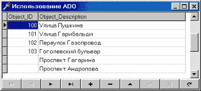
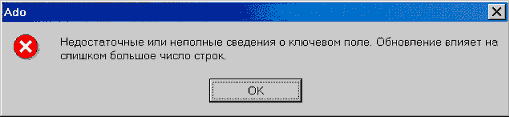
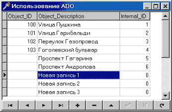
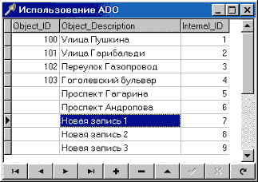
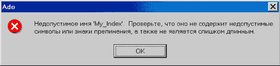
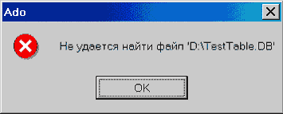
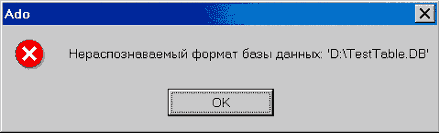

Опыт использования ADO для доступа к базам данных форматов MS Access, xBase и Paradox
=====================================================================================

::: {.date}
01.01.2007
:::

Данная статья не является каким-либо учебным пособием, а просто попыткой
обобщить некий опыт, полученный в течение некоторого времени при
использовании ADO.

Подвигло меня на написание этой статьи то обстоятельство, что когда я
приступал к этой работе (я имею в виду использование ADO), я размещал
свои вопросы во многих конференциях, а ответов на них не получено до сих
пор и, более того, эти же вопросы стали задаваться по новой, а ответов
на них как не было, так и нет. На некоторые из них я отвечал, а потом
подумал, что не все будут просматривать конференцию целиком, да и когда
все сведено в одном месте оно и лучше. Кроме того, толковой литературы
по использованию ADO практически нет никакой. Например, мне не удалось
найти в солидных по объему книгах г-на Архангельского необходимую мне
информацию. Или еще пример - Microsoft Press \'Справочник по OLE DB\'.
Здесь другой уклон - информации много, слишком много, а примеров никаких
(но это вообще проблема справок от Microsoft - написано много, а
примеров использования почти нет).

Надеюсь, что те сведения, которые я приведу здесь, помогут коллегам по
цеху в решении его задач.

Причины перехода от BDE к ADO

Итак, чтобы было понятно что к чему, сначала поясню, зачем же
понадобился переход к ADO. Я работаю программистом в компании, которая
занимается написанием оболочки для создания геоинформационных систем
(ГИС). То есть имеется некая красивая карта и необходимо получение
каких-то атрибутивных данных по объектам на этой карте размещенным. При
этом атрибутивные таблицы не имеют заранее установленной структуры -
только некие предустановленные поля, которых пользователь не видит, но
которые используются для связи объектов на карте и записей в базе
данных.

Итак, для хранения атрибутивной информации был выбран формат MS Access,
который имеет то обстоятельство, что все таблицы хранятся в одном файле
(в отличие от Paradox и Dbase) и не требует при этом запущенного
сервера, как, к примеру, Interbase. Необходима также связь с файлами
форматов dbf и db для загрузки/выгрузки данных в/из БД. Для написания
программы мы используем Delphi 4, а для подключения к файлам БД
использовалась BDE. И все это было отлично, но вот появились два важных
обстоятельства:

::: {style="text-align: left; text-indent: 0px; padding: 0px 0px 0px 0px; margin: 7px 0px 7px 24px;"}
  ---- ----------------------------------------------------------------------------------------------------------------------------------------------------------------------------------------------------------------------------------------------------------------------------------------------------------------------------------------------------------------------------------------------------------------------------------------------------------------------------------------------------------------------------------------
  1.   Вышел MS Access 2000. BDE отказывается работать с этим форматом. Как мне удалось найти ответ после долгих поисков на сайте Inprise - Inprise не знает как производить коннект к этому формату. Цитата: \'Для доступа к данным MS Access мы используем DAO 2.5, который не может работать с форматом MS Access 2000. Если Вам необходим доступ к БД формата MS Access 2000, используйте, пожалуйста, компоненты ADO Delphi 5. По нашей (возможно неверной) информации причина здесь в отсутствии официальной документации от Microsoft.
  ---- ----------------------------------------------------------------------------------------------------------------------------------------------------------------------------------------------------------------------------------------------------------------------------------------------------------------------------------------------------------------------------------------------------------------------------------------------------------------------------------------------------------------------------------------
:::

::: {style="text-align: left; text-indent: 0px; padding: 0px 0px 0px 0px; margin: 7px 0px 7px 24px;"}
  ---- --------------------------------------------------------------------------
  1.   2\. Была найдена интересная особенность поведения BLOB потоков под
       управлением Windows NT 4. Допустим, нам необходим доступ к BLOB полям
       таблиц в БД формата MS Access 97. Как произвести подключение через BDE к
       MS Access 97 я говорить не буду, т.к. многие знают, а кто не знает, тот
       легко найдет эту информацию. Итак, подключение произведено. Отлично. Вот
       фрагмент программы:
  ---- --------------------------------------------------------------------------
:::

    var
      AStream: TBLOBStream;
      Data: Integer;
     
    begin
      // Открываем таблицу (обычный TTable)
      ATable.Open;
      // Создаем поток.
      AStream := TBLOBStream(ATable.CreateBLOBStream(ATable.FieldByName('Поле')));
      // Что-либо читаем из него.
      AStream.Read(Data, SizeOf(Data));
      // Освобождаем поток и закрываем таблицу.
      AStream.Free;
      ATable.Close;
    end;

 

Казалось бы - абсолютно тривиальный код. НО! Строка, где производится
чтение из потока, вызывает исключительную ситуацию - \'External error -
EEFFACE\'. И в исходных текстах VCL от Delphi 5 мы находим потрясающее
объяснение - это, оказывается, \'C++ Exception\'. Интересно, а при чем
тут C++? Единственный ответ, какой я знаю, - Delphi написана на C++.\
Плюс ко всему, если вы запускаете эту программу из-под Delphi - ошибка
не возникает, а если запускаете ее прямо в Windows - ошибка будет
непременно. Я дошел в своих поисках до вызовов прямых вызовов BDE API -
вот там-то ошибка и возникает, так что я думаю тут очередная ошибка BDE,
хотя я использовал на тот момент самую последнюю версию с сайта Inprise
- BDE 5.11.\

Так что, господа, если Вы используете нечто подобное в своих программах,
то знайте, что под Windows NT 4.0/Windows 2000 Ваши программы работать
не будут. Самое интересное, что компоненты из библиотеки VCL, которые
используют подобный метод для получения данных (к примеру, TDBRichEdit)
тоже не работают!

Итак, этих двух причин оказалось достаточно для нашей фирмы, чтобы
начать переход от BDE к ADO.

ADO и файлы формата MS Access

\- Учитель, почему ты обманул меня? Ты сказал, что Вейдер предал и убил
моего отца, а теперь оказалось, что он и есть мой отец!\
- Твой отец... Его соблазнила темная сторона силы. Он больше не был
Анекином Скайукером и стал Дартом Вейдером. Поэтому хороший человек,
который был твоим отцом, был уничтожен. Так что, то, что я тебе сказал,
было правдой... с определенной точки зрения...\
- С определенной точки зрения?\
- Люк... ты вот увидишь сам... что очень многие истины зависят от нашей
точки зрения.\

(Звездные войны. Эпизод 6.)

К чему я привел эту цитату - в результате всей этой работы я пришел к
выводу, что у нас, программистов, и у Microsoft разный взгляд на фразу
\'Обеспечивается доступ к данным\'. Мы (ну или, по крайней мере, я) в
этой фразе видим следующее содержание \'обеспечивается доступ к данным
для их просмотра и РЕДАКТИРОВАНИЯ (т.е. редактирование, удаление и
добавление новых данных)\'. Что имеет в виду Microsoft можно только
догадываться, но явно, что без особых проблем достигается только
просмотр данных. Кроме того, практически все примеры в литературе
ограничиваются получением данных именно для просмотра, после чего
следует несколько бодрых фраз и все заканчивается. Как говорится выше -
разные точки зрения...

Итак, прежде всего, работа была ограничена условием разработки в Delphi
4. Причин этому много, но к этой статье это отношения не имеет. Просто -
программа, разработанная в Delphi 4 должна работать через ADO. Поэтому
приступили к поиску компонент, обеспечивающих такую работу. Нашли их
довольно много, как платных, так и бесплатных. Все, что будет написано,
одинаково и для всех вариантов и даже для Delphi5. Исключение составляет
только работа с закладками в Delphi 5.

ADO была взята на тот момент самая последняя версия с сайта Microsoft -
это ADO 2.6.

Итак, возьмем файл mdb формата MS Access 97. Его можно сделать с помощью
хотя бы самого Access. И создадим там небольшую таблицу, к примеру,
такую:

::: {style="text-align: left; text-indent: 0px; padding: 0px 0px 0px 0px; margin: 7px 0px 7px 24px;"}
  --- -----------------------------------------------------
  ·   Object\_ID Integer - идентификатор объекта на карте
  --- -----------------------------------------------------
:::

::: {style="text-align: left; text-indent: 0px; padding: 0px 0px 0px 0px; margin: 7px 0px 7px 24px;"}
  --- -----------------------------------------------------------
  ·   Object\_Description Text (50) - описание объекта на карте
  --- -----------------------------------------------------------
:::

Введем туда какие-либо данные (абсолютно все равно какие). Только надо
учесть, что в силу специфики работы у нас могут быть описания, которым
пока объекты не соответствуют. Такая связка будет выполнена позже
пользователем. Ну, попробуем вывести содержимое таблицы в DBGrid. Ага,
получилось. Например, как на картинке:

{width="393" height="178"}

Вроде как все
нормально и доступ к данным мы получили.\

А теперь давайте, вообразим себя пользователями и попробуем что-нибудь
исправить или добавить. Например, добавим несколько пустых записей и
попробуем внести туда данные. Добавляем. Нормально. Теперь внесем данные
и нажмем POST. И что мы видим?

{width="509" height="117"}

Ага. Интересно, а при чем тут ключ, если у нас на таблицу ключ не
наложен? Пробуем добавить новую запись, удалить запись без Object\_ID.
Результат одинаков - все то же сообщение об ошибке. И что же делать?
Запускаем MS Access, пробуем там, и видим, что там все отлично. Стало
быть, что-то не так мы делаем с ADO. И тут мы вспоминаем, что когда мы
создавали таблицу в MS Access, он предлагал создать ключевые поля для
этой таблицы. А после долгих поисков в ADO SDK я нашел этому такое
объяснение: ADO предполагает, что таблица будет в первой нормальной
форме. Если кто не помнит главное требование первой формы - отсутствие
повторяющихся записей.

В данном случае мы не можем создать ключ на то, что есть. Что же делать?
И тут приходит на ум простое решение: добавим еще одно поле, чтобы
каждая запись была однозначно определена (т.е. некий внутренний
идентификатор). Чтобы не думать о содержимом этого нового поля, делаем
совсем просто - пусть это будет автоинкрементное поле, и создадим на
него первичный ключ. Отлично! Делаем - все работает. Пока мы не
добавляем больше одной записи. Если мы их добавим подряд несколько, мы
увидим очень интересную ситуацию как на картинке.

{width="346" height="226"}

Что здесь интересного? А то, что содержимое Internal\_ID для всех этих
записей равно нулю, хотя это автоинкрементное поле! И Table.Refresh
здесь не помогает! Только закрытие и последующее открытие таблицы
приводит к тому, что мы видим то, что и ожидалось.

{width="323" height="228"}

А пока мы не имеем правильных идентификаторов, наличие такого поля не
дает ничего. Выше приведенные ошибки будут продолжать сыпаться как из
рога изобилия. Но вот только закрывать - открывать таблицу каждый раз
после добавления новой записи для того, чтобы автоинкрементное поле
принимало правильные значения - это сильно. Так не пойдет. Вот так ADO,
подумал я, а давай-ка попробуем MS Access 2000. И тут оказалось, что там
все нормально работает: добавляем запись, делаем сохранение (Post)
автоинкрементное поле тут же принимает правильное значение.

В результате я могу сделать только один вывод - Microsoft активно, всеми
доступными средствами, пытается заставить пользователей переходить к
своим новым продуктам.

А вот почему в Access все нормально работает - это загадка. Я думаю, что
сам-то он пользуется какими-то своими методами, либо в процессе работы у
него есть некий идентификатор записи типа только что придуманного нами.

Ну а чтобы пользователь не видел этого внутреннего идентификатора (он
ведь нужен только нам) делаем это поле невидимым. Надеюсь, что все
знают, что это делается через TField.Visible := FALSE.

Кто-нибудь может возразить: а зачем нам такой идентификатор, мы можем
записи идентифицировать по каким-нибудь своим полям. Ради Бога! Но тут
есть еще одна проблема и эта проблема называется закладки.\

Проблемы закладок нет в Delphi 5, потому что там вокруг Bookmark сделан
класс ими управляющий, а я имею в виду работу с закладками через ADO.
Смотрим опять же в ADO SDK и видим там такое описание:

\'Recordset.Bookmark: Устанавливает или возвращает закладку, которая
однозначно определяет текущую запись в Recordset. При создании или
открытии объекта Recordset каждая из его записей получает уникальную
закладку. Для того чтобы запомнить положение текущей записи, следует
присвоить текущее значение свойства Bookmark переменной. Для быстрого
возвращения к сохраненному в переменной указателю текущей записи в любое
время после перехода на другую запись следует указать в значении
свойства Bookmark объекта Recordset значение этой переменной\'.

Казалось бы, какие проблемы? А вот какие: возвращаемое значение всегда
одно и тоже для любой записи. И когда мы устанавливаем этот, с
позволения сказать, Bookmark, ничего не происходит. И только наш
внутренний идентификатор поможет в такой ситуации, кроме того, его
значение всегда имеет смысл, даже после закрытия и повторного открытия
таблицы, что, в общем-то, удобно.\

После того как все заработало, я решил проверить скорость работы ADO. У
нас может быть ситуации, когда в таблицу добавляется сразу большое
количество записей, к примеру, 50-60 тысяч записей за раз. Так вот,
когда использовалась BDE, такая операция занимала максимум 10 минут.
Угадайте, чему стало равно это время при использовании ADO? Минимум 25
минут на той же самой машине. Если после этого мне будут говорить, что
ADO быстрее BDE чуть ли не в 2 раза - позвольте мне с Вами не
согласиться.

Итак, для нормальной работы мы должны иметь таблицы в первой нормальной
форме, для этого делаем автоинкрементное поле с уникальным индексом.
Кроме того, если мы можем добавлять больше одной записи за один раз и
потом сразу возможно будем их редактировать, нам надо использовать файлы
MS Access 2000.

ADO и файлы xBASE и Paradox

Итак, мы смогли наладить работу через ADO к файлам формата MS Access. Но
ведь мы можем и должны использовать файлы xBase и Paradox в качестве
обменных файлов.

Попробуем это сделать. Все примеры какие я видел в книгах работают
одинаково - через \'Microsoft OLE DB provider for ODBC\'. А все
редакторы, которые делают строку подключения, всегда показывают только
mdb файлы в диалоге, в котором задается путь к файлу БД. Что-то тут
нечисто, подумал я - а как же тот же самый Access это делает? Ведь явно
не через ODBC, стало быть, есть какая-то хитрость.

После примерно недельных поисков в Интернете решение было найдено. Да,
действительно можно использовать \'Microsoft Jet 4.0 OLE DB Provider\'.
Чтобы не рассказывать долго, представим, что у нас на диске D в корне
лежит файл Test.dbf формата dBase 5.0.\

Строка коннекта для этого случая будет выглядеть так:

{\'Provider=Microsoft.Jet.OLEDB.4.0;Data Source=D:\\;

Extended Properties = dBase 5.0;

Mode = Read\|Write\|Share Deny None;

Persist Security Info = True\';}

И это все. Самое интересное во всей это строке - секция \'Extended
Properties\'.\
Чтобы знать, что конкретно для разных форматов надо писать в Extended
properties, загляните в реестр Windows на следующую ветку:\

HKEY\_LOCAL\_MACHINE\\Software\\Microsoft\\Jet\\4.0\\ISAM Formats

Там перечислены все поддерживаемые в данном случае форматы.

После опытов над форматом dbf оказалось, что все выше сказанное для
формата mdb совершенно не относится к этому формату - и все требования
про первую форму можно и не соблюдать! В общем, загадка природы.

А вот формат Paradox - это оказалась песня на меньшая, чем mdb. И вот
почему - здесь все требования о первой форме таблицы в действии, но ведь
мы не можем создавать таблицу, потом говорить пользователю \'Слышь,
мужик, а теперь метнулся, запустил Paradox и создал первичный ключ на
эту таблицу. А потом нажмешь на ОК и мы продолжим\'. Это несерьезно.
Стало быть, этот ключ надо создавать нам самим.

Хорошо, запускаем справку по MS Jet SQL и ищем раздел создания индексов
или первичных ключей. Находим следующее:

CREATE INDEX имя\_индекса on название\_таблицы(название\_поля)with
PRIMARY.

ALTER TABLE название\_таблицы ADD CONSTRAINT имя\_ограничения PRIMARY

   KEY(название\_поля)

Все далее сказанное абсолютно одинаково для обоих вариантов.

Предположим, что наша таблица называется ExpTbl.db и поле, на которое мы
хотим наложить первичный ключ, называется IntrernalID. Хорошо,
подключаемся к таблице и задаем такую строку SQL для исполнения:

CREATE INDEX My\_Index ON ExpTable (InternalID) WITH PRIMARY

Запустим на выполнение. Ого, а что это мы видим? Вот те на - очередное
сообщение об ошибке. При этом сообщение как всегда очень содержательное
применительно к нашему случаю.

{width="565" height="134"}Неправильных
символов нет, синтаксис правильный, длина названия ключа тоже
нормальная. Я так думаю потому, что если выполнить это через BDE, все
будет работать со свистом.

Вывод один - опять очередное требование ADO, которое сразу не поймешь.
Ладно, запускаем он-лайн MS MSDN и делаем запрос на PARADOX. Видим
что-то около 50 документов. И где-то в 35-36 документе я нашел ответ
маленькими буковками внизу экрана! Сейчас я вам скажу в чем проблема -
держитесь крепче: имя первичного ключа должно совпадать с названием
таблицы, а имена индексов с именами полей. Неслабо.\

Исправляем SQL:

CREATE INDEX ExpTable ON ExpTable (InternalID) WITH PRIMARY

Запускаем, смотрим - все отлично.

Чтобы никто больше мучился с этим делом, я хотел бы привести самые
значащие ограничения для драйвера PARADOX, которые я нашел в MSDN:

::: {style="text-align: left; text-indent: 0px; padding: 0px 0px 0px 0px; margin: 7px 0px 7px 24px;"}
  ---- ---------------------------------------------------------------------------------------------------------------------------------------------------------------------
  1.   Для того, чтобы Вы имели возможность производить действия по добавлению, удалению записей или редактированию данных в таблице, таблица должна иметь первичный ключ.
  ---- ---------------------------------------------------------------------------------------------------------------------------------------------------------------------
:::

::: {style="text-align: left; text-indent: 0px; padding: 0px 0px 0px 0px; margin: 7px 0px 7px 24px;"}
  ---- ----------------------------------------------------------------------
  1.   Первичный ключ должен быть определен для первых \'n\' полей таблицы.
  ---- ----------------------------------------------------------------------
:::

::: {style="text-align: left; text-indent: 0px; padding: 0px 0px 0px 0px; margin: 7px 0px 7px 24px;"}
  ---- ---------------------------------------------------------------------------------------
  1.   Вы не можете создавать для таблицы индексы, если для нее не определен первичный ключ.
  ---- ---------------------------------------------------------------------------------------
:::

::: {style="text-align: left; text-indent: 0px; padding: 0px 0px 0px 0px; margin: 7px 0px 7px 24px;"}
  ---- -----------------------------------------------------------------------------------
  1.   Первый создаваемый для таблицы уникальный индекс будет создан как первичный ключ.
  ---- -----------------------------------------------------------------------------------
:::

::: {style="text-align: left; text-indent: 0px; padding: 0px 0px 0px 0px; margin: 7px 0px 7px 24px;"}
  ---- ---------------------------------------------------------------------------------------------------
  1.   Первичный ключ может быть создан для таблицы только в том случае, если в ней нет ни одной записи.
  ---- ---------------------------------------------------------------------------------------------------
:::

::: {style="text-align: left; text-indent: 0px; padding: 0px 0px 0px 0px; margin: 7px 0px 7px 24px;"}
  ---- -------------------------------------------------------------------------------------------------------------------------
  1.   Действия по добавлению или удаления полей в таблице должны быть произведены до того, как для нее создан первичный ключ.
  ---- -------------------------------------------------------------------------------------------------------------------------
:::

Кстати, по моему опыту удалить однажды созданный первичный ключ для
таблицы невозможно.

Итак, для работы через ADO с файлами xBase или Paradox, нам необходимо
указывать нужный драйвер в секции Extended Properties и в секции Data
Source только путь до файла. Для xBase на этом все трудности закончены,
а вот для Paradox необходимо задание первичного ключа как для формата MS
Access, при этом есть определенные ограничения при задании названий
ключей, так же как и возможных индексов.

То, о чем речь пойдет далее уже не относится к организации работы с
таблицами xBase и Paradox через ADO, а скорее упоминание об одном
полезном опыте.\

Для добавления данных в эти таблицы, мы можем вставлять их по одной
(Table.Append (Insert); Table.Post), а можем воспользоваться вариантом
SELECT ... INTO, INSERT ... INTO. Поговорим теперь именно о втором
варианте работы.

Смотрим файл справки MS Jet SQL.

SELECT поле\_1\[, поле\_2\[, \...\]\]INTO новаяТаблица\[in
внешняяБазаДанных\]

FROM источник

Ладно, пробуем. Пусть мы имеем в качестве источника данных mdb файл и
хотим сохранить данные из таблицы SourceTable в таблицу формата Paradox
7.0 TestTable.db, расположенную в корне диска D:. Казалось бы:

SELECT \* INTO\[TestTable.DB\] in \'D:\\\' FROM SourceTable

Нет, очередная ошибка. Вот, что мы видим.

{width="565" height="138"}Ага, хорошо,
давайте попробуем указать таблицу в пути:

SELECT \* INTO\[TestTable\] in \'D:\\ TestTable.DB\' FROM SourceTable

Получим очередное сообщение об ошибке.

{width="355" height="143"}

Ага, стало быть, файл для экспорта должен уже существовать? Ладно, не
проблема, давайте создадим его и попробуем еще раз.

{width="439" height="133"}

Ну, в общем, желающие могут еще поэкспериментировать, а для остальных я
скажу как делается:

    SELECT * INTO[Paradox 7. x; DATABASE = D: \]. [TestTable#0DB]FROMSourceTable

Создавать таблицу до операции экспорта нет надобности - таблица будет
создана автоматически, все поля будут созданы правильного типа. В
получившейся таблице будут все данные из SourceTable.\

Единственная проблема - Вы не сможете больше редактировать данные в этой
таблице, потому (см. выше) для этого необходим первичный ключ, а создать
его для таблицы, в которой уже есть записи нельзя.

Самое потрясающее это название раздела MSDN, где я нашел этот ответ -
\'Как, используя ADO, открыть таблицу Paradox, защищенную паролем\'. Как
ЭТО имеет отношение к этому синтаксису SQL, я так и не понял, честно
говоря.

Вот, в общем-то, все, что я хотел написать. Осталось еще много
интересного в этой области. Чего стоит, например установка правильных
кодовых страниц для результирующих файлов и много чего подобного. Это
тема либо для продолжений этой статьи, либо для отдельных статей. Очень
надеюсь, что кто-нибудь нашел тут полезные для себя сведения.\
 \

При написании статьи использовались следующие материалы:

::: {style="text-align: left; text-indent: 0px; padding: 0px 0px 0px 0px; margin: 7px 0px 7px 24px;"}
  ---- -------------------------------
  1.   Материалы Королевства Delphi.
  ---- -------------------------------
:::

::: {style="text-align: left; text-indent: 0px; padding: 0px 0px 0px 0px; margin: 7px 0px 7px 24px;"}
  ---- ---------------------------------------
  1.   Справочные файлы Delphi 4 и Delphi 5.
  ---- ---------------------------------------
:::

::: {style="text-align: left; text-indent: 0px; padding: 0px 0px 0px 0px; margin: 7px 0px 7px 24px;"}
  ---- ----------------------------------------
  1.   Исходные коды VCL Delphi 4 и Delphi 5.
  ---- ----------------------------------------
:::

::: {style="text-align: left; text-indent: 0px; padding: 0px 0px 0px 0px; margin: 7px 0px 7px 24px;"}
  ---- ----------------------------------
  1.   MS ADO SDK и примеры MS ADO SDK.
  ---- ----------------------------------
:::

::: {style="text-align: left; text-indent: 0px; padding: 0px 0px 0px 0px; margin: 7px 0px 7px 24px;"}
  ---- ----------
  1.   MS MSDN.
  ---- ----------
:::

::: {style="text-align: left; text-indent: 0px; padding: 0px 0px 0px 0px; margin: 7px 0px 7px 24px;"}
  ---- ---------------------------------------------
  1.   А.Я. Архангельский \'Язык SQL в Delphi 5\'.
  ---- ---------------------------------------------
:::

::: {style="text-align: right; text-indent: 0px; padding: 0px 0px 0px 0px; margin: 0px 0px 0px 24px;"}
  ---- --------------
  2.   ©Drkb::02674
  ---- --------------
:::
