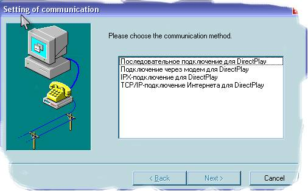
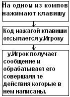

# Изучаем DelphiX

Влад Энгельгардт

29 июня 2006 (Обновление: 28 фев 2009)

## Часть 6: Мультиплеер.

*«SINGLE-хорошо, а  
MULTIPLAYER — лучше»*

Здравствуйте дорогие мои читатели.
Сегодня мы будем говорить о мультиплеере.
Точнее об его создании в DelphiX.
В DelphiX это реализуется с помощью компонента:

 **DXPlay**.
Многие, кто пытался что-то сделать на DXPlay, сталкивался с такой проблемой:
что если вызывать диалог с DXPlay то получаем непонятный текст: 

Устранить ее очень легко.
Дело в том, что из-за "НЕРУССКОГО" происхождения
программист Hiroyuki Hori в DXPlayFm.dfm
в некоторых местах поставил шрифт: "Terminal",
а нам нужен "MS Sans Serif".
Поэтому-то и всё так исковеркано.
Я исправил эту проблему вот так:

И выкладываю исправленный мною модуль DXPlayFm.dfm,
и более того, он русифицирован.
Так что пользуйтесь на здоровье :) [DXPlayFm.rar](DXPlayFm.rar).

Сегодня мы напишем простенькую, мультиплеерную гаму.
В этом я помогу вам.

В качестве шаблона я буду использовать [part2.rar](part2.rar).
Мы его модернизируем, и предадим ему мультиплеерность.
Сразу говорю, что part2.rar состоял из 2 интерактивных объектов,
соответственно и в наш мультиплеер можно играть только вдвоем.

Теперь я расскажу, как нужно модернизировать пример из второй части под
шестой :).

На мой взгляд, эта часть является единственно растолковывающая создание
мультиплеера под DelphiX.
Сколько я прочитал статей по программированию мультиплеера на DelphiX,
ничего путного не увидел. Здесь я использую простой алгоритм.
Принцип его следующий:
передаются не координаты объекта, а клавиши,
которые были нажаты на удалённой машине.

Кидаем на форму компонент DXPlay и устанавливаем вот такие свойства:

    MaxPlayers = 2, 
    GUID = {218A0D84-949C-42BC-A97B-40C3E3A642F1}.

GUID можно создать любой достаточно нажать на кнопку New.

Добавляем в uses модуль: DirectX.

После uses создаём список констант:

    const
      DXACTION_MESSAGE = 1; // Это нажата клавиша действия
      DXKEY_LEFT = 1;       // двигаемся влево
      DXKEY_RIGHT = 2;      // двигаемся вправо
      DXKEY_SHOOT = 3;      // Стреляем

Создаём новый тип для наших ACTION сообщений:

    type
      TDXActionMessage = record
        dwType: DWORD;
        ActionCode: Integer;
      end; 

Далее идут классы спрайтов:  
Единственное, что поменялось это класс TBOSS,
я его переименовал в TPLU.

Когда мы поменяли названия то и картинку нужно изменить на более
подходящую.

Заходим в DXImageList и переименовываем спрайт Boss на Plu.

А вот картинка:

В Var перед implementation обозначаем два наших класса:

    var
      Form1: TForm1;
      plu:Tplu;
      PlayerSprite:TPlayerSprite;
     
    implementation

Теперь подходим к процедуре TPlayerSprite.DoMove.  
Она должна выглядеть вот так:

    Procedure TPlayerSprite.DoMove(MoveCount: Integer);
      var
        Msg: ^TDXActionMessage; //Само сообщение
        msgSize: Integer; //размер сообщения
      begin
        inherited DoMove(MoveCount);
        if form1.DXPlay1.Players.Count =2 then // пока в игру не зайдёт второй игрок
                                               // ни кто, не двинется
        begin
          if isLeft in Form1.DXInput1.States then
          begin
            x:=x-5;
            msgSize := SizeOf( TDXActionMessage );
            GetMem(Msg, MsgSize);
            msg.dwType := DXACTION_MESSAGE; //тип сообщения
            msg.ActionCode := DXKEY_LEFT; //действие
            form1.DXPlay1.SendMessage(DPID_ALLPLAYERS,msg,msgsize); //отсылаем всем
          end;
          if isRight in Form1.DXInput1.States then
          begin
            X:=x+5;
            msgSize := SizeOf( TDXActionMessage );
            GetMem(Msg, MsgSize);
            msg.dwType := DXACTION_MESSAGE;
            msg.ActionCode := DXKEY_RIGHT;
            form1.DXPlay1.SendMessage(DPID_ALLPLAYERS,msg,msgsize);
          end;
          if isup in Form1.DXInput1.States then
          begin
            if lngpolet-oldlngpolet>=900 then
            begin
              Inc(lngpolet);
              with TPlayerFa.Create(Engine) do
              begin
                msgSize := SizeOf( TDXActionMessage );
                GetMem(Msg, MsgSize);
                msg.dwType := DXACTION_MESSAGE;
                msg.ActionCode := DXKEY_SHOOT;
                form1.DXPlay1.SendMessage(DPID_ALLPLAYERS,msg,msgsize);
                PixelCheck := True;
                Image := form1.dxImageList1.Items.Find('Pula');
                X := Self.X+Self.Width  -40;
                Y := Self.Y+Self.Height -80 ;
                Width := Image.Width;
                Height := Image.Height;
                stril:=-4;
              end;
              oldlngpolet := lngpolet;
            end;
          end;
          if  y >= form1.DXDraw1.SurfaceHeight-image.Height then
            y := form1.DXDraw1.SurfaceHeight-image.Height;
          if  x >= form1.DXDraw1.SurfaceWidth -image.Width  then
            x := form1.DXDraw1.SurfaceWidth -image.Width;
          if  y <= 0 then
            y := 1;
          if  x <= 0 then
            x:=1;
          lngpolet := lngpolet + MoveCount;
          Collision;
        end;
      end;  

Теперь, как вы понимаете, так как TBoss уже не существует,
то и некоторые процедуры должны быть пусты:

    Procedure TPLU.DoMove(MoveCount: Integer);
      begin
        inherited DoMove(MoveCount);
        Collision;
      end; 
     
      constructor TPLU.Create(AParent: TSprite);
      begin
        inherited Create(AParent);
      end;

Далее очищаем событие для формы OnCreate и пишем в нём:

    procedure TForm1.FormCreate(Sender: TObject);
    begin
      try
        DXPlay1.Open;
      Except
        On E: Exception do
        begin
          Application.ShowMainForm := False;
          Application.HandleException(E);
          Application.Terminate;
        end;
      end;
     
      With TBackgroundSprite.Create(DXSpriteEngine1.Engine) do
      begin
        SetMapSize(1,1);
        Image := dxImageList1.Items.Find('bg');
        Z:= -2;
        Tile := True;
      end;
    end;

Далее кликаем по компоненту DXPlay создаём событие: OnMessage

И пишем следующее:

    procedure TForm1.DXPlay1Message(Sender: TObject; From: TDXPlayPlayer;
      Data: Pointer; DataSize: Integer);
    begin
      if TDXActionMessage( Data^ ).actioncode AND DXKEY_LEFT = DXKEY_LEFT then
        plu.X:=plu.X -5; // получаем сообщение влево, двигаем удалённого
                         //playerа в лево
      if TDXActionMessage( Data^ ).actioncode AND DXKEY_RIGHT = DXKEY_RIGHT then
        plu.X:=plu.X +5; // получаем сообщение вправо, двигаем удалённого
                         //playerа в право
      if TDXActionMessage( Data^ ).actioncode AND DXKEY_SHOOT = DXKEY_SHOOT then
      begin    // получаем сообщение - удалённый игрок выстрелил,
              // создаём патрон на месте PLU
        with TPlayerFa.Create(dxspriteengine1.Engine) do
        begin
          PixelCheck := True;
          Image := form1.dxImageList1.Items.Find('Pula');
          X := plu.X+plu.Width-70;
          Y := plu.Y+plu.Height+10;
          Width := Image.Width;
          Height := Image.Height;
          stril:=4;
          Collision;
        end;
      end;
    end;

Далее кликаем по DXDraw создаём событие Initialize и в нем пишем:

      plu:= Tplu.Create(DXSpriteEngine1.Engine);
      plu.PixelCheck  := True;
      plu.Image := form1.dxImageList1.Items.Find('plu');
      plu.x:=350;
      plu.y:=10;
      plu.Width := plu.Image.Width;
      plu.Height := plu.Image.Height;
     
      PlayerSprite:= TPlayerSprite.Create(DXSpriteEngine1.Engine);
      PlayerSprite.PixelCheck := True;
      PlayerSprite.Image := form1.dxImageList1.Items.Find('Pla');
      PlayerSprite.x:=350;
      PlayerSprite.y:=500;
      PlayerSprite.Width := PlayerSprite.Image.Width;
      PlayerSprite.Height := PlayerSprite.Image.Height;

Вот, и всё запускаем, и радуемся.

А теперь я расскажу, как это всё работает.

Прежде чем начать писать мультиплеер, нужно осознавать,
что тебе придётся думать за каждую из удалённых машин.
Как она получит пакет, кому что нужно будет отправить и так далее.
Так вот, в событии Message в DXPlay1 обрабатываются всё принятые сообщения,
а отсылать их можно любым плеером из любого места в коде.
Так вот когда один из игроков запускает игру,
а другой присоединяется к нему, происходит такая картина:

В нашем примере все действия, которые происходят на другой машине,
отражается на спрайте Plu.

Скачать всё, что мы творили, можно вот здесь: [part6.rar](part6.rar).

P.S Назвал я класс PLU потому, что так проще расшифровывается,
как плеер удаленный.

P.S.S Я устал уже отвечать на такие письма типа:
"У меня не распаковывается архив?".
Так вот, говорю: всё архивы запакованы WinRAR 3.0.
