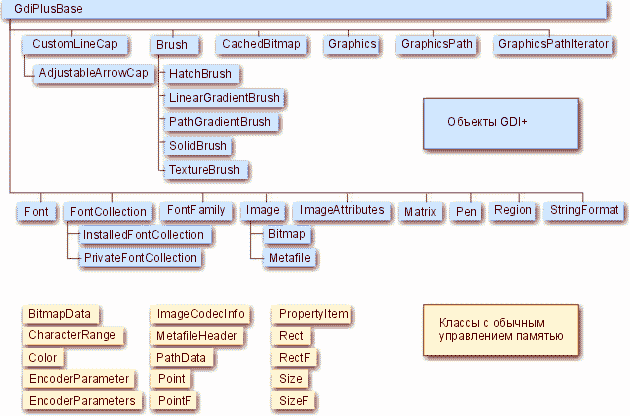

Часть 1. Введение
=================

::: {.date}
01.01.2007
:::

Доброе время суток, уважаемые коллеги. В данной статье пойдет речь о
многообещающем потомке стандартного графического интерфейса GDI имеющим
соответствующее имя GDI+. Данное графическое ядро и основанный на ней
графический интерфейс широко используется в новых операционных системах
Windows XP и .NET Server.

Итак Что же такое GDI+ ?

Не вдаваясь в тонкости сразу скажу что GDI+ на самом деле является
динамической библиотекой GdiPlus.dll. в которой реализованы команды и
функции по работе с графикой, начиная от рисования линий заканчивая
координатными преобразованиями и работой с прозрачностью. Как говорится
на любой вкус. Более подробную информацию вы можете просмотреть в статье
Виталия Брусенцева \"GDI+: графика нового поколения\" (если Вас не
смущает реализация на C++)

Итак, после десятка лет царствования интерфейса GDI, появилась
библиотека, призванная заменить устаревшую версию ядра и предоставляющею
разработчикам все достоинства своего предшественника вкупе со множеством
новых мощных возможностей. Как вы все знаете в DELPHI до сих пор
используется библиотека GDI предоставляющая разработчику скудный (по
сегодняшним меркам) набор функций для рисования, поэтому программистам
приходится идти на всякие ухищрения при работе с графикой, используя
DirectX, OpenGL или библиотеки доступа непосредственно к видеопамяти.
Данная библиотека существенно упростить создание графических офисных
приложений ( я намеренно сделал ставку на офисные, дабы избежать
апологетов DirectX, OpenGL и пр.) Как я и говорил к сожалению в DELPHI
не включили заголовки этой библиотеки, но это не беда силами сторонних
разработчиков данные заголовки были созданы и для DELPHI.

Итак, для что нам надо чтобы использовать все прелести данной
библиотеки.

Для начала давайте определимся, те кто работает на Windows XP и .NET
Server. могут не беспокоится - данная библиотека уже включена в данные
операционные системы. Для других увы - придется скачать с официального
сервера Microsoft файл gdiplus\_dnld.exe (размером чуть более 1 Mb) и
при помощи него установить данную библиотеку в системный каталог Windows
98/ME, Windows NT SP6 или Windows 2000. Сразу-же оговорюсь что поддержка
Windows 95 не предусмотрена и о ней нет никакого упоминания на сайте
Microsoftа. Причем теоретически я могу предположить что данная
библиотека может будет работать. Ну еще раз оговорюсь в Windows 95
пробуйте сами.

Итак файл успешно скачан, установлен и предвидя следующий вопрос сразу
же говорю для работы с библиотекой вам потребуются заголовочные файлы
для Delphi взять свежие можно с http://www.progdigy.com или скачать
архив Header\_pas.zip прилагаемый со статьей.

Ну, если у Вас все готово - продолжим.

Ниже приведена иерархия классов GDI+, опубликованная в статье Виталия
Брусенцева. Там же можно прочесть некоторые подробности о классах, ее
составляющих.

{width="630" height="416"}

Итак для начала подключим заголовочные файлы GDI+ в uses модуль вашей
программы

    uses
      Windows, Messages, SysUtils, Variants, Classes, Graphics, Controls, Forms,
      Dialogs, ComCtrls, ExtCtrls, ToolWin,
      GDIPAPI,GDIPOBJ;
     
            Как видите их всего два - GDIPAPI,GDIPOBJ;
            Продолжим , инициализируем библиотеку к работе -
            Для начала опишем ее
     
    var
      graphicsGDIPlus : TGPGraphics;

как и было раньше заявлено в конструкторе объекта TGPGraphics требуется
контекст устройства (DC) куда библиотека будет пере направлять всю
графику. Теперь можно и нарисовать что-то в данном примере (см. архив
GDIDemo) , в обработчик события OnPaint объекта PaintBox мы выведем ,
как и всегда при работе с новым языком или библиотекой следующий,
знакомый каждому программисту текст \"Hello GDI+\" четырьмя разными
стилями - обычным без сглаживания, обычным с сглаживанием, с градиентной
заливкой, с текстурной заливкой и под углом 45 градусов.

    procedure TForm1.PaintBox1Paint(Sender: TObject);
    Const
      StrHello = 'Hello GDI+';
    var
      R          : TRect;
      FontFamily : TGPFontFamily;
      Font       : TGPFont;
      SolidBrush    : TGPSolidBrush;          // Заливка непрерывным цветом
      GradientBrush : TGPLinearGradientBrush; // Заливка линейным градиетом
      TextureBrush  : TGPTextureBrush;        // Заливка текстурой градиетом
      Image         : TGPImage;               // Объект - Изображение
      Matrix        : TGPMatrix;              // Матрицы
    begin
      graphicsGDIPlus := TGPGraphics.Create(PaintBox1.Canvas.Handle);
      // Имя шрифта
      FontFamily := TGPFontFamily.Create('Times New Roman');
      // Шрифт
      Font       := TGPFont.Create(FontFamily, 32, FontStyleRegular, UnitPixel);
      // Создаем объект для непрерывной заливки
      SolidBrush := TGPSolidBrush.Create(MakeColor(255, 0, 0, 255));
      // Рисование текста без антиалиасинга с закраской синим цветом
      // Установка стиля отрисовки текста - TextRenderingHintSingleBitPerPixel
      graphicsGDIPlus.SetTextRenderingHint(TextRenderingHintSingleBitPerPixel);
      graphicsGDIPlus.DrawString(StrHello, -1, Font, MakePoint(1, 10.0), solidBrush);
     
      // Рисование текста c антиалиасингом с закраской синим цветом
      // Установка стиля отрисовки текста - TextRenderingHintAntiAlias
      graphicsGDIPlus.SetTextRenderingHint(TextRenderingHintAntiAlias);
      graphicsGDIPlus.DrawString(StrHello, -1, Font, MakePoint(1, 40.0), solidBrush);
     
      // Рисование текста c антиалиасингом с закраской градиентом
      R.X := 1;
      R.Y := 1;
      R.Width := 100;
      R.Height := 40;
      // Создаем объект для градиентной заливки
      GradientBrush := TGPLinearGradientBrush.Create(R,
                         MakeColor(255, 255, 255, 255),
                         MakeColor(255, 0, 0, 255),
                         LinearGradientModeForwardDiagonal);
      graphicsGDIPlus.SetTextRenderingHint(TextRenderingHintAntiAlias);
      graphicsGDIPlus.DrawString(StrHello, -1, Font, MakePoint(1, 70.0), GradientBrush);
     
      // Рисование текста c антиалиасингом с закраской текстурой
      // Шрифт заного создаем
      Font.Free;
      Font       := TGPFont.Create(FontFamily, 70, FontStyleRegular, UnitPixel);
      Image  := TGPImage.Create('01.jpg');
      TextureBrush := TGPTextureBrush.Create(image);
      graphicsGDIPlus.SetTextRenderingHint(TextRenderingHintAntiAlias);
      graphicsGDIPlus.DrawString(StrHello, -1, Font, MakePoint(1, 100.0), TextureBrush);

      // Рисуем под углом - используем трансформацию
      // Шрифт заного создаем
      Font.Free;
      Font       := TGPFont.Create(FontFamily, 32, FontStyleRegular, UnitPixel);
      graphicsGDIPlus.RotateTransform(-45); // производим
      graphicsGDIPlus.DrawString(StrHello, -1, Font, MakePoint(-200, 200.0), TextureBrush);
      graphicsGDIPlus.ResetTransform;       // сбрасываем
     
      // Не забудьте высвободить память
      Image.Free;
      GradientBrush.Free;
      TextureBrush.Free;
      SolidBrush.Free;
      graphicsGDIPlus.Free;
    end;

Итак, для начала не плохо. В следующей статье мы разберем вывод
примитивов, вывод графики, использование графических контейнеров. Вот в
принципе и все, набор классов библиотеки прост и очевиден, ничего особо
сложного в нем нет, но для более подробной информации по библиотеке GDI+
советую обратится на сайт альма-матер Microsoft или запастить демками с
того-же http://www.progdigy.com

С уважением к коллегам, Дмитрий Кузан.

 \

<https://www.delphikingdom.com>
