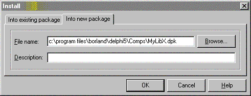
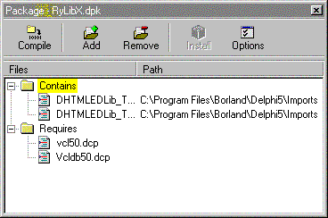

HTMLEditor -- Краткий обзор
===========================

::: {.date}
01.01.2007
:::

Вступление - загрузка информации.

Часто в своих проектах, там, где нужно дать возможность пользователю
редактировать текст, выделять различными шрифтами (стилями, цветами\...)
отдельные слова и в других подобных случаях, мы используем, чаще всего,
TRichEdit. Всем он нравится как редактор?, хорош и удобен он в работе?
На эти вопросы каждый ответит по своему, но в принципе, худо-бедно,
пользоваться им можно. Можно потому что не видно другой альтернативы.
Вернее она есть, и на много удобнее и продвинутее чем Rich\'формат - это
Html\'формат, но он не доступен для визуального редактирования - т.е.
для него нет редактора, поддерживающего стили, картинки, таблицы()., вот
и получается что оно как бы есть, но его как бы нет. А если бы был
(здесь можно помечтать, что с помощью такого редактора можно было бы
сделать)? А.если нечто подобное есть, а вы об этом не знаете (здесь
можно состроить гримасу удивления и задаться вопросом \"зачем такое
делать и никому об этом не говорить?\")? Короче, альтернатива
Rich\'формату есть это Html, теперь давайте попробуем найти для него
редактор. Но чтобы что-то искать, надо, как минимум, знать что это
что-то есть. Когда же я стал искать, то я еще не знал о существовании
такого редактора, да вобщем-то и искал не его и обнаружение его - это
побочный эффект любопытства.

Куда ты завел нас\...?

Что и зачем я искал вам не интересно, а вот что и где я нашел мы сейчас
узнаем.

::: {style="text-align: left; text-indent: 0px; padding: 0px 0px 0px 0px; margin: 0px 0px 0px 13px;"}
  ---- -------------------------------------------------------
  1.   Запускаем один экземпляр Delphi (у меня 5-ая версия).
  ---- -------------------------------------------------------
:::

::: {style="text-align: left; text-indent: 0px; padding: 0px 0px 0px 0px; margin: 0px 0px 0px 13px;"}
  ---- -----------------------------------------------------------------------------
  2.   В меню-баре выбираем пункт \"Component\", затем \"Import ActiveX Control\".
  ---- -----------------------------------------------------------------------------
:::

::: {style="text-align: left; text-indent: 0px; padding: 0px 0px 0px 0px; margin: 0px 0px 0px 13px;"}
  ---- --------------------------------------------------------------------------------------------------------------------------------------------------------------------------------------------------------------------------------------------------------------------------------------------------------------------
  3.   В появившемся окне, в списке зарегестрированных ActiveX Control\'ов находим строку \"DHTML Edit Control\...\" и выделяем ее (я не обещаю что у всех она будет, но если вдруг не будет попробуйте нажать кнопку \"Add\" и найти файл \"C:\\Program Files\\Common Files\\Microsoft Shared\\Triedit\\DHTMLED.OCX\")..
  ---- --------------------------------------------------------------------------------------------------------------------------------------------------------------------------------------------------------------------------------------------------------------------------------------------------------------------
:::

Результат должен быть примерно следующий:

::: {style="text-align: left; text-indent: 0px; padding: 0px 0px 0px 0px; margin: 0px 0px 0px 13px;"}
  ---- ------------------------------
  1.   Нажимаем кнопку \"Install\".
  ---- ------------------------------
:::

::: {style="text-align: left; text-indent: 0px; padding: 0px 0px 0px 0px; margin: 0px 0px 0px 13px;"}
  ---- ---------------------------------------------------------
  2.   В следующем окне выбираем вкладку \"Into new package\".
  ---- ---------------------------------------------------------
:::

::: {style="text-align: left; text-indent: 0px; padding: 0px 0px 0px 0px; margin: 0px 0px 0px 13px;"}
  ---- -------------------------------------------------------------------------
  3.   Выбираем путь куда будет установлен наш ActiveX package и имя для него.
  ---- -------------------------------------------------------------------------
:::

::: {style="text-align: left; text-indent: 0px; padding: 0px 0px 0px 0px; margin: 0px 0px 0px 13px;"}
  ---- --------------------
  1.   Далее жмем \"Ok\".
  ---- --------------------
:::

::: {style="text-align: left; text-indent: 0px; padding: 0px 0px 0px 0px; margin: 0px 0px 0px 13px;"}
  ---- ----------------------------------------------------------------------
  2.   После долгого раздумья появится окно, в котором нажмите \"Compile\".
  ---- ----------------------------------------------------------------------
:::

::: {style="text-align: left; text-indent: 0px; padding: 0px 0px 0px 0px; margin: 0px 0px 0px 13px;"}
  ---- ----------------------------------------------------
  1.   После чего в выскочившем сообщении нажмите \"Ok\".
  ---- ----------------------------------------------------
:::

::: {style="text-align: left; text-indent: 0px; padding: 0px 0px 0px 0px; margin: 0px 0px 0px 13px;"}
  ---- ----------------------------------------------------
  2.   Закройте все с сохранением вашей новой библиотеки.
  ---- ----------------------------------------------------
:::

А теперь в два приема создаем проект и тестируем то что получилось.

::: {style="text-align: left; text-indent: 0px; padding: 0px 0px 0px 0px; margin: 0px 0px 0px 13px;"}
  ---- ----------------------
  1.   Создаем новый проект
  ---- ----------------------
:::

::: {style="text-align: left; text-indent: 0px; padding: 0px 0px 0px 0px; margin: 0px 0px 0px 13px;"}
  ---- -------------------------------------------------------------------
  2.   находим палитру компонент \"ActiveX\", где видим две новые иконки
  ---- -------------------------------------------------------------------
:::

::: {style="text-align: left; text-indent: 0px; padding: 0px 0px 0px 0px; margin: 0px 0px 0px 13px;"}
  ---- ------------------------------------------
  3.   выбираем ту что называется \"DHTMLEdit\"
  ---- ------------------------------------------
:::

::: {style="text-align: left; text-indent: 0px; padding: 0px 0px 0px 0px; margin: 0px 0px 0px 13px;"}
  ---- ---------------------
  4.   бросаем ее на форму
  ---- ---------------------
:::

::: {style="text-align: left; text-indent: 0px; padding: 0px 0px 0px 0px; margin: 0px 0px 0px 13px;"}
  ---- ---------------------------------
  5.   устанавливаем Align := alClient
  ---- ---------------------------------
:::

::: {style="text-align: left; text-indent: 0px; padding: 0px 0px 0px 0px; margin: 0px 0px 0px 13px;"}
  ---- ------------------
  6.   запускаем проект
  ---- ------------------
:::

::: {style="text-align: left; text-indent: 0px; padding: 0px 0px 0px 0px; margin: 0px 0px 0px 13px;"}
  ---- -----------------------------------------------------------------------------------------------
  7.   выделяем текст на странице которую вы сейчас читаете (Ctrl+A) и копируем с нее текст (Ctrl+C)
  ---- -----------------------------------------------------------------------------------------------
:::

::: {style="text-align: left; text-indent: 0px; padding: 0px 0px 0px 0px; margin: 0px 0px 0px 13px;"}
  ---- ------------------------
  8.   переходим в наш проект
  ---- ------------------------
:::

::: {style="text-align: left; text-indent: 0px; padding: 0px 0px 0px 0px; margin: 0px 0px 0px 13px;"}
  ---- -----------------------------------------------
  9.   ставим в поле курсор (щелкните мышью по полю)
  ---- -----------------------------------------------
:::

::: {style="text-align: left; text-indent: 0px; padding: 0px 0px 0px 0px; margin: 0px 0px 0px 13px;"}
  ----- ---------------------
  10.   нажимаем \"Ctrl+V\"
  ----- ---------------------
:::

::: {style="text-align: left; text-indent: 0px; padding: 0px 0px 0px 0px; margin: 0px 0px 0px 13px;"}
  ----- -----------------------
  11.   смотрим и удивляемся.
  ----- -----------------------
:::

Текст можно редактировать, выделять, подсвечивать (Ctrl+B, Ctrl+I,
Ctrl+U), искать (Ctrl+F), и даже кажется печатать(Ctrl+P) (не уверен так
как у меня нет принтера).

А что дальше?

А вот в этом-то вся шутка юмора и заключается\... А я не знаю что
дальше, точнее как програмно работать с ним - выделять, вставлять
рисунки, рисовать таблицы и т.д. Судя по тому что все это он может
отображать, он должен и уметь все это создавать, но с разбегу у меня не
получилось разобраться. Поэтому, заинтересовавшийся народ, вот вам ребус
- работа с html-едитором, взаимодействие его с программой и с
пользователем - все это теперь ваша забота, а мы будем ждать появления
на страницах \"Королевства\" от вас статей на этот счет, а я, пардон,
отойду в сторону - у меня другие интересы и задачи, я лишь посчитал
своим долгом познакомить вас со своей находкой. Единственное только
знаю, что его можно использовать и как html-editor, и как html-viewer.

Заключение

Это полностью моя статья, ни на что не претендующая, ни с кого не
требующая, ни от куда не списанная (даже упоминаний о DHTMLEdit\'оре не
где не слышал). Описанный контрол, технической поддержке со стороны
автора статьи не подлежит, даже ответов на вопросы по нему не
предусматривается. Все. Удачи. Всем пока.

Автор: [Алексей Румянцев](mailto:skitl@mail.ru)

Взято с <https://delphiworld.narod.ru>
