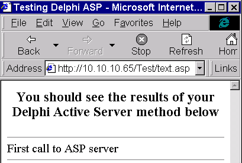
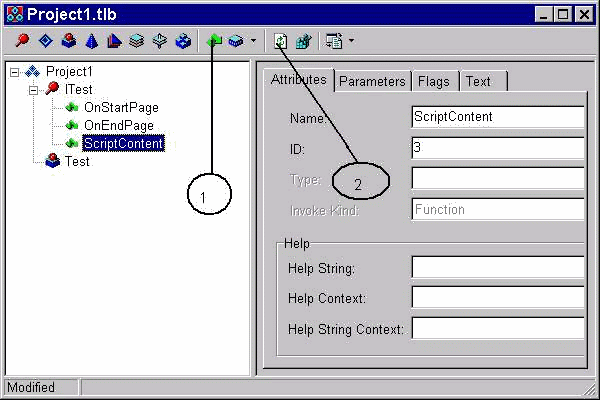
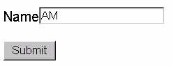
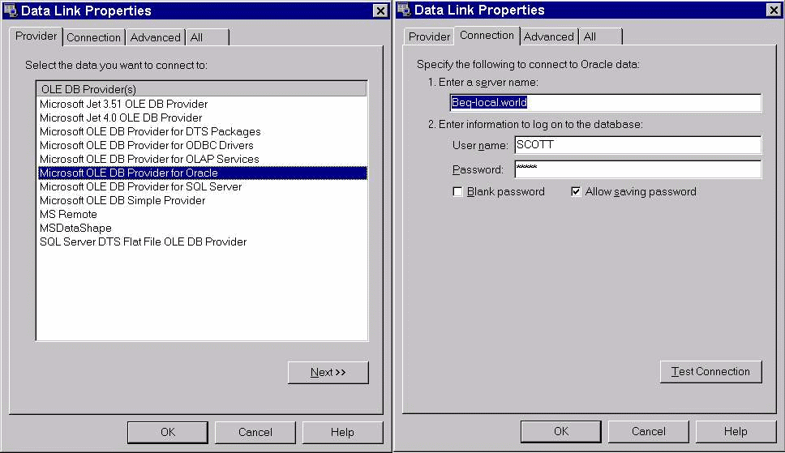
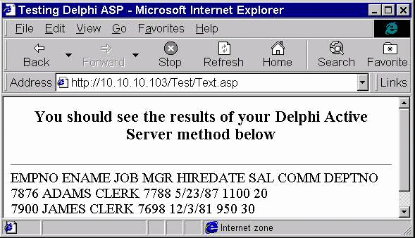
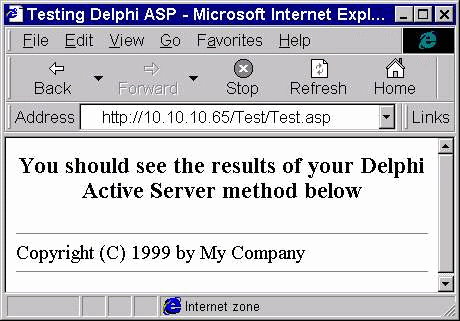

Создание Active Server Page (ASP) приложений (Статья)
=====================================================

::: {.date}
01.01.2007
:::

Новый продукт Borland -- Delphi5, который начал распространяться осенью
1999 года содержит ряд новых возможностей. В частности, к экспертам
проектов была добавлена возможность создания ASP приложений. Эксперт
вызывается при помощи команды File/New/ActiveX и далее выбирается икона
Active Server Object. К сожалению, в текущей документации,
распространяемой с Delphi 5 (Build 5.62), крайне скупо сказано о
назначении, последовательности создания и тестирования ASP сервера.
Примеры работающего ASP сервера также отсутствуют в дистрибутиве
Delphi5. Настоящая публикация частично восполняет эти проблемы.

Клиентное приложение, работающее с ASP сервером, представляет собой HTML
документ и может быть прочитано на любом WEB браузере. Соответственно,
эти HTML документы размещаются на каком-либо WEB-сервере. WEB сервер,
получив требование о предоставлении документа, считывает его из
локального хранилища и передает клиенту, при этом часть информации
вносится в документ динамически ASP сервером. Принято, чтобы расширения
у документов, обращающиеся к ASP серверу, имели расширение \*.asp.
Примеры таких документов можно найти в директориях
WINNT\\SYSTEM32\\INETSRV\\IISADMIN и INETPUB\\IISAMPLES\\EXAIR если был
установлен Microsoft Internet Informational Server (IIS). Типичный
пример обращения к ASP серверу с HTML документа выглядит следующим
образом:

\<%

Set FileSystem=Server.CreateObject(\"Scripting.FileSystemObject\")

FileSystem.FindAllFiles

\%\>

Данная запись представляет собой Visual Basic (VB) скрипт. Несмотря на
наличие VB скрипта, страница ASP может быть доступна клиентам,
работающих на других операционных системах, например UNIX. На первый
взгляд это может показаться странным: ведь UNIX компьютеры не имеет
языка Basic, и тем более VB. Но дело в том, что скрипты в ASP документах
выполняются на сервере и клиенту приходит HTML документ.

ASP сервер обязан быть установлен на Windows NT (Windows 98)
операционной системе с запущенным IIS или Microsoft Personal Web Server
(PWS) и этот факт снижает возможности широкого использования ASP
сервера. По существу, ASP сервер представляет собой внутреннюю
разработку компании Microsoft, которая не была (да и не могла быть)
согласована с фактическими законодателями дальнейшего развития
Internet-технологий (Sun, Netscape). В будущем не следует ожидать
продвижения этой технологии на другие платформы, поскольку при
реализации ASP -- серверов использовалась COM-технология, записи в
системный реестр -- а это эксклюзивные разработки Microsoft. Более того,
другие WEB-сервера, работающие на платформе Windows (Netscape, Apache),
скорее всего не будут поддерживать ASP технологию, поскольку до сих пор
производители этих серверов успешно игноировали все новые разработки
Microsoft в этой области.

По существу, ASP сервер представляет собой сервер OLE автомации, в
котором предопределено несколько интерфейсов, среди них -- IRequest и
IResponse. IRequest содержит методы, вызов которых позволяют установить
параметры, заполненные на клиенте -- об этом будет рассказано ниже.
IResponse содержит методы, вызов которых приводит к формированию HTML
документа и, как финал, передача данного документа клиенту. По этим
признакам ASP сервер напоминает CGI приложения и ISAPI/NSAPI dll (далее
-- WEB сервер приложения). Идеология выполнения методов в ASP сервере и
WEB серверных приложениях также аналогична: анализируется (если
требуется) запрос клиента и динамически формируется отклик. Отличие
заключается в том, что WEB серверные приложения формируют целиком HTML
документ, в то время как отклик ASP сервера вставляется в исходную HTML
страницу. Например, если документ ASP представлен в виде:

    <HTML>
    <BODY>
    <TITLE> Testing Delphi ASP </TITLE>
    

    <H3> You should see the results of your Delphi Active Server method below </H3>
    

    

    <% Set DelphiASPObj = Server.CreateObject("ASP01.Test")
    DelphiASPObj.ScriptContent
    %>
    

    </BODY>
    </HTML>

и результат выполнения метода ScriptContent возвращает строку \'First
call to ASP server\', то клиент, получивший данный документ, увидит
следующее (рис. 1):

Рис.1 Результат выполнения запроса к простейшему ASP серверу.

То есть, отклик ASP сервера добавляется к HTML документу. В одном
документе допустимо обращение к нескольким ASP серверам и результат их
отклика формируется в единый документ. Этого невозможно достичь при
использовании WEB приложений. Ограничение: набор ASP серверов, к которым
обращаются из одного документа, обязаны быть зарегистрированы на одном
IIS сервере. Нельзя обратиться по различным адресам для формирования
одного HTML документа.

ASP сервер реализуется как в \*.exe, так и в \*.dll приложениях -- это
разрешается при создании сервера OLE автомации. ASP сервер,
реализованный в \*.exe файле, запускается один раз в ответ на запрос
клиента. При использовании внутренних (in-process) ASP серверов один
экземпляр DLL, загруженный в оперативную память, способен обслуживать
одновременно нескольких клиентов. При этом для каждого клиента может
создаваться как отдельный экземпляр COM обьекта, так и единственный
экземпляр COM обьекта может обслуживать нескольких клиентов. Это зависит
от выбранной модели работы в потоках (Threading Model) при заполнении
диалога при выборе команды File/New/ActiveX/Active Server Object.

Рассмотрим теперь, каким образом работает ASP сервер на конкретном
примере создания внутреннего (in-process) ASP сервера. Ограничимся
сервером, который выполняет один запрос. Выберем команду
File/New/ActiveX/ActiveX Library и нажмем кнопку OK. Будет создан новый
проект, который сохраним, например, под именем ASP01. Далее, вызовем из
меню команду File/New/ActiveX/Active Server Object. В появляющемся
диалоге определеим имя класса, например, Test. Поскольку создается
in-process сервер, параметр Instancing не играет роли, зато имеет
значение параметр Threading Model. Выбор параметра Single приводит к
неэффективной работе сервера -- при одновременном к нему обращении
нескольких клиентов, сервер выполняет запросы последовательно и если
один из клиентов обращается с длительным запросом, то остальные
вынуждены ожидать его окончания, даже если запросы у них короткие по
времени. У них создается впечатление о зависании эксплорера и часто это
приводит к попыткам прервать задачу разными методами. Выбор параметра
Apartment приводит к разделению запросов клиентов по потокам, при этом
для каждого клиента будет создан свой экземпляр COM обьекта -- в данном
примере, класса TTest. При этом при написании методов класса не
требуется защиты переменных класса по потокам -- клиент может свободно
модифицироать их и это упрощает разработку кода приложения. Недостаток
этоя модели -- проект ресурсоемкий и переменные класса инициализируются
на каждое обращение, что удлиняет время отклика. Этих недостатков лишена
модель Free, в которых единственный экземпляр COM обьекта обслуживает
нескольких клиентов. Однако, если клиенты могут изменять данные, то это
требует защиты общих переменных по потокам что существенно усложняет
процедуру реализации кода приложения и является потенциальным источником
трудноуловимых ошибок. Как правило, эту модель используют в серверах,
которые только предоставляют данные, но клиент не может их
модифицировать.

Группа контролей Active Server Type позволяет выбрать назначение ASP
сервера. Если сервер планируется инсталлировать на компьютере, которым
управляет IIS версии 3 или 4, то следует выбрать Page Level Events
Methods. С IIS5 эта опция тоже работает, но эффективнее будет работать
опция Object Context. Эту же опцию необходимо выбирать, если работой ASP
управляет Microsoft Transaction Server (MTS). Фактически IIS5 также
управляет этим сервером при помощи MTS -- оба этих продукта тесно
интегрированы.

Опцию Generate a Template Test Script for this object следует оставлять
всегда включенной -- Delphi в этом случае создаст небольшой HTML
документ, который с небольшими изменениями можно использовать для
тестирования ASP сервера.

После заполнения опций диалога следует нажать кнопку OK и после этого
будет создан файл реализации интерфейсов Unit1.pas, который следует
запомнить под разумным именем -- например: U1\_01. Кроме того, будет
создана библиотека типов, появится ее редактор и файл, описывающий
библиотеку типов -- в данном примере TEST\_TLB.pas. Если была выбрана
опция Page Level Events Methods (как в данном примере), то библиотека
типов будет содержать два предопределенных метода -- OnStartPage и
OnEndPage. Также будет создан файл Test.asp, который содержит HTML
документ с заготовками VB скриптов для тестирования сервера.

Если заглянуть в файл реализации (U1\_01.pas) , то класс ТТest является
потомком класса TASPObject. При выборе же опции Object Context
библиотека типов не содержит предопределенных методов, а сам класс TTest
являлся бы потомком TASPMTSObject. Оба класса-предка TTest содержат
абсолютно одинаковые методы и свойста, но класс TASPObject дополнительно
содержит пару методов интерфейса IASPObject - OnStartPage и OnEndPage.

Далее, создадим метод, который будет заполнять HTML документ. Для этого
в редакторе библиотеки типов (рис 2) отметим интерфейс ITest и вызовем
команду New Method нажатием кнопки 1:

Рис. 2. Добавление нового метода к редактору библиотеки типов ASP
сервера.

Назовем вновь созданный метод ScriptContent набив этот текст в названии
метода с мигающей кареткой. Данный метод не должен иметь параметров.
Далее вызовем команду Refresh нажатием кнопки 2. После этого в модуле
реализации (U1\_01.pas) появится заготовка, где следует описать
реализацию. Метод реализуем следующим образом:

    procedure TTest.ScriptContent;
    begin
      If Assigned(Response) Then Response.Write('First call to ASP server');
    End;

в данном примере происходит обращение к методу Write интерфейса
IResponse. Проверка Assigned(Response) гарантирует, что в момент записи
сообщений имеется ссылка на интерфейс.

После этого следует модифицировать созданный Delphi HTML документ для
тестирования сервера, который хранится в файле Test.asp. В этом
документе имеется VB скрипт следующего содержания:

\<% Set DelphiASPObj = Server.CreateObject(\"ASP01.Test\")

DelphiASPObj.{Insert Method name here}

\%\>

Скрипт в данном виде работать не будет. Необходимо заменить фразу в
фигурных скобках {Insert Method name here} на имя метода ASP сервера,
который генерирует отклик. В данном примере это имя ScriptContent.
Финальные исправления выглядят следующим образом:

\<% Set DelphiASPObj = Server.CreateObject(\"ASP01.Test\")

DelphiASPObj.ScriptContent

\%\>

Проект необходимо скомпилировать и далее можно приступить к его
тестированию. Для этого необходимо создать виртуальную директорию на
IIS, причем эта директория обязана иметь разрешение как на Read (из нее
будут читаться данные), так и на Execute (из нее будет загружена и
запущена ASP01.dll). Альтернатива -- разместить эти файлы в разных
директориях, одна из которых имеет доступ Read, а вторая -- Execute. Но
в любом случае выбранные директории должны экспонироваться через HTTP
протокол. Поэтому в первую очередь необходимо обратиться к WWW сервису
IIS, посмотретьсписок доступных директорий и при необходимости создать
новые с соответствующими правами доступа. В данном конкретном примере на
компьютере, который имеет IP адрес 10.10.10.65 была создана виртуальная
директория /Test, которая соответствует физическому адресу на компьютере
C:\\ASPTest. Директория имеет доступ на Read и Execute и туда были
скопированы оба файла. Далее в Microsoft Internet Explorer следует
набрать команду в поле Address: HTTP://10.10.10.65/Test/Test.asp и
результат выполнения этого запроса показан на рисунке 1. Видно, что
скрипт ( текст между \<% и %\>) был замещен результатом выполнения
метода ScriptContent в ASP сервере.

Рассмотрим теперь подробнее, каким образом выполняется скрипт в странице
Test.asp. IIS, который получает запрос на Test.asp он считывает ее
содержимое из хранилища, находит скрипт и выполняет ее. При этом в фоне
запускается VB и вызывается команда CreateObject. Если ASP01.dll ранее
не была загружена, то происходит ее загрузка. Для данного запроса
создается COM обьект -- экземпляр класса TTest (он описан в модуля
реализации, для данного примера - U1\_01.pas). Ссылка на интерфейс
IDispatch (он поддерживается в классе TTest) сохраняется в переменной
DelphiASPObj. В дальнейшем написании кода после имени переменной,
хранящей ссылку на IDispatch, можно набирать любой текст. Компилятор VB
использует текст, который содержится в скрипте и следует после имени
переменной (в данном примере: переменная -- DelphiASPObj, метод -
.ScriptContent) для того, чтобы передать его ASP серверу. Если ASP
сервер найдет метод с данным именем, то он его выполнит. При отсутствии
метода с таким именем генерируется исключение. Поэтому при написании
скриптов для ASP сервера следует быть внимательным в названиях методов и
при наличии исключений в первую очередь проверить корректность имен
методов. При вызове какого-либо метода ASP серверу становятся доступные
интерфейсы IRequest и IResponse.

Теперь рассмотрим пример создания более сложного ASP сервера, где
анализируется запрос клиента при помощи методов интерфейса IRequest.
Задачу поставим следующим образом: дадим возможность клиенту найти по
фрагменту имени поля ENAME таблицы EMP в базе данных ORCL (генерирует
Oracle при установке) . Для этого в каком-либо редакторе форм создадим
форму, содержащую однострочный редактор текста и кнопку Submit. HTML
документ этой формы выглядит следующим образом:

    <html>
    <head>
    <meta http-equiv="Content-Type"
    content="text/html; charset=windows-1257">
    <meta name="GENERATOR" content="Microsoft FrontPage Express 2.0">
    <title>Untitled Normal Page</title>
    </head>
    <body bgcolor="#FFFFFF">
    <form action="http://10.10.10.65/Test/Test.asp" method="POST"
    name="Query">
    
Name (fragment)<input type="text" size="20"
    name="T1">

    
<input type="submit" name="B1" value="Submit">

    </form>
    </body>
    </html>

При реализации этой формы вместо IP адреса 10.10.10.65 следует указать
IP адрес компьютера, на котором установлен ASP сервер. Поместим этот
документ в директорию C:\\ASPTest, которая имеет доступ на Read и
Execute (см. выше) под именем Name.htm. Но перед тем, как создавать
модуль данных и обращаться к серверу базы данных необходимо выяснить,
каким образом анализируется запрос клиента в ASP сервере.

Запрос клиента можно анализировать при помощи вызова методов интерфейса
IRequest, ссылка на который находится в свойстве Request класса
TASPObject -- предка класса, где реализуется ASP сервер. Интерфейс
IRequest предоставляет три свойства -- QueryString, Form и Body в
которых находятся ссылки на интерфейс IRequestDictionary. QueryString
содержит параметры запроса, Form содержит список контролей,
предоставляемых клиенту, а Body содержит данные, которые клиент ввел на
контроли. Нам потребуются данные, поэтомк ниже будет анализироваться
свойство Body, но все сказанное ниже о методах IRequestDisctionary
применимо и к любому другому свойству типа ICustomDictionary --
QueryString, Form.

IRequestDictionary определен в модуле ASPTlb.pas следующим образом:

    IRequestDictionary = interface(IDispatch)
      ['{D97A6DA0-A85F-11DF-83AE-00A0C90C2BD8}']
      function Get_Item(Var_: OleVariant): OleVariant; safecall;
      function Get__NewEnum: IUnknown; safecall;
      function Get_Count: SYSINT; safecall;
      function Get_Key(VarKey: OleVariant): OleVariant; safecall;
      property Item[Var_: OleVariant]: OleVariant read Get_Item; default;
      property _NewEnum: IUnknown read Get__NewEnum;
      property Count: SYSINT read Get_Count;
      property Key[VarKey: OleVariant]: OleVariant read Get_Key;
    end;

Документация о свойствах этого интерфейса отсутствует и остается только
догадываться, каким образом из него можно извлечь параметры запроса
введенные пользователем. Привлекая документацию по компоненту
TWebDispatcher, который используется при создании CGI приложений и ISAPI
DLL, где также можно анализировать параметры запроса пользователя, можно
догадаться что свойство Count содержит число контролей на форме - для
формы сделанной выше в Name.htm оно равно 2 . Свойство Key -- имя
контролей - для формы в Name.htm это имена T1 (текст) и B1 (кнопка). И,
наконец, свойство Item содержит введенные пользователем значения. И все
эти рассуждения правильные. Но реализовано все это настолько
поразительно криво. Поскольку файл ASPTlb.pas представляет собой перевод
соответствующего \*.h C++ файла, распространяемым Microsoft, претензии
по его реализации следует адресовать этой компании.

Свойство Count работает как положено -- возвращает двойку для примера
выше. Но при попытке извлечь имя ключа обнаруживается неприятная
особенность -- в коллекции Key\[\] индексы начинаются с единицы, а не с
нуля, как это принято в подобного типа приложениях. Все же обращаясь к
коллекции Key с соответствующим индексом -- 1 или 2 для примера выше
можно получить названия контролей в виде строковых переменных.
Аналогичная попытка извлечь данные, введенные пользователем в контроли,
ни к чему хорошему ни приводят -- при попытке присвоить строковой
переменной значения из коллекции Item\[\] (которая обьявлена аналогична
коллекции Key\[\]) происходит исключение. Анализируя значение,
возвращаемое коллекцией Item\[I\] можно обнаружить, что возвращается
интерфейс - потомок IDispatch. Методы и свойства этого интерфейса не
описаны. Отсутствие описания интерфейса а также возврат ссылки на него в
переменной типа OLE variant, а не IDispatch характерно для продуктов,
которые находятся в процессе разработки. При разработке заголовки
методов интерфейса, список параметров методов и их число постоянно
меняется и чтобы не происходили исключения в клиентных приложениях,
часто используют позднее связывание. Этот факт настораживает -- не
исключена возможность изменения методов интерфейса в будущем и это может
привести к потере работоспособности созданных ранее ASP серверов. Но
будем надеяться, что данный интерфейс устоялся и Microsoft вследствии
занятости просто забыл внести изменения в интерфейсный модуль и дать его
документацию.

Интерфейс - потомок IDispatch два свойства: Count, которое возвращает
всегда 1 и Item\[\] -- коллекцию, которое возвращает текст, введенный
клиентом в контроле. Коллекция Item начинается с индекса 1. Для
понимания и тестирования запроса в ASP сервере сделаем небольшое
дополнение к проекту. Воспользовавшись редактором библиотек типов
создадим новый метод RequestProp, как это было описано ранее (Рис. 2).
Напишем следующий код для метода RequestProp:

    procedure TTest.RequestProp;
    var
      S: string;
      V: OLeVariant;
      I, J, N: integer;
    begin
      S := '';
      if Assigned(Request) then
        if Request.Body.Count > 0 then
          begin
            for I := 1 to Request.Body.Count do
              begin
                S := S + 'Key' + IntToStr(I) + '=' + Request.Body.Key[I] + ' ';
                V := Request.Body.Item[I];
                if not VarIsEmpty(V) then
                  if varType(V) = varDispatch then
                    begin
                      N := V.Count;
                      S := S + 'ItemCount' + IntToStr(I) + '=' + IntToStr(N) + ' ';
                      if N > 0 then
                        for J := 1 to N do
                          S := S + V.Item[J] + ' ';
                    end;
              end;
          end;
      if Assigned(Response) then Response.Write(S);
    end;

Скомпилируем проект и в созданном ранее файле Test.asp изменим VB
скрипты следующим образом: вместо строки DelphiASPObj.ScriptContent
напишем строку DelphiASPObj. RequestProp. После этого в Internet
Explorer следует обратиться к Name.htm следующей командой:
http://10.10.10.65/Test/Name.htm, где вместо 10.10.10.65 следует набрать
IP адрес сервера. В полученной форме (рис. 3)

введем какое-либо значение в редакционный контроль и нажмем кнопку
Submit. После этого получим результат выполнения приведенного выше кода
метода RequestProp:

Key1=T1

ItemCount1=1

AM

Key2=B1

ItemCount2=1

Submit

То есть для определения параметров, введенных клиентом в какой-либо
контроль, необходимо просмотреть все ключи, найти индекс интересуемого
нас контроля (в данном примере он 1, что соответствует ключу T1) и
извлечь значение, введенное клиентом, посредством вызова команды
Request.Body.Item\[Index\].Item\[1\].

Теперь можно перейти к модификации имеющегося сервера - создание нового
метода для доступа к базам данных. На него необходимо поместить
невизуальные компоненты доступа к данным, визуальные компоненты нельзя
использовать в ASP сервере. Вообще, в приложениях такого типа -- ASP,
ISAPI/NSAPI, CGI показ модальных форм с контролями (а диалоги -- частный
вид таких форм) ни к чему хорошему не приводит. При попытке показать
диалог, контроли на диалоге будут созданы, на них будет помещен текст
и\\или картинки и приложение будет ожидать, когда диалог будет закрыт
(нажатием кнопки OK или Cancel) чтобы продолжить свою работу.
Особенность заключается в том, что диалог невидим. Поэтому его нельзя
закрыть ни нажатием кнопок (они не получают сообщения OnClick) ни
акселератором (сигналы с клавиатуры не посылаются невидимым контролям).
Визуально программист наблюдает следующее -- приложение висит, отклик с
ASP сервера клиент не получает и для повторной компиляции проекта
требуется перезагрузка системы. Даже если команды показа диалогов
отсутствуют в ASP сервере, они могут быть показаны в процессе работы
приложения -- например, BDE пришлет сообщения об ошибке. Поэтому данный
факт надо принимать во внимание при написании кода, где необходимо
тщательно проверять данные перед их использованием, чтобы внешние
приложения не сообщали об ошибках.

Традиционно доступ к данным очуществляется через BDE, при этом
необходимо использовать компонеты TSession, TDatabase и TQuery. Однако,
при обращении к данным в ASP сервере, выяснилось, что BDE нельзя
использовать для доступа к SQL серверам. Исключение происходит при
попытке соединиться с базой данных после передачи login параметров. Из
серверов тестировались Oracle и Interbase. Через BDE удалось получить
доступ только к DBDEMOS, которая не требует аутентификации пользователя
при обращении к данным.

К счастью, в Delphi5 появилась альтернативный способ доступа данных --
через ADO (Active Data Objects). Для работы с ADO прежде всего
необходимо использовать компонент TADOConnection. Поставим его на форму.
В инспекторе обьектов выберем свойство ConnectionString и вызовем диалог
для создания строки. В предложенном диалоге выберем Microsoft OLE DB
Provider for Oracle и нажмем кнопку Next (рис. 4).

Рисунок 4. Установление параметров для ADO соединения с Oracle сервером.

На второй странице диалога необходимо указать имя сервера (в данном
примере -- beq-local) и параметры аутентификации -- имя пользователя
(SCOTT) и пароль (TIGER). Обязательно ставится метка в Allow Saving
Password контроле -- иначе ASP сервер попытается показать Login диалог!
Протестировать соединение можно нажатием кнопки Test Connection --
должно быть сообщение об успешном соединении с сервером.

Далее в инспекторе обьектов необходимо свойство LoginPromp в False. При
работе с другими примерами необходимо также изменять свойство
DefaultDatabase -- имя базы данных, но для данного примера это не
обязательно. Проверить правильность установок можно при помощи изменения
свойства Connected в True, при этом не должен появить Login диалог или
информация об исключении.

Поставим компонент TADOQuery на модуль данных и в свойстве Connection
сошлемся на определенный выше компонент ADOConnection1.

Модуль данных, на которые можно помещать невизуальные компоненты, не
создается автоматически при вызове эксперта для создания ASP сервера,.
Поэтому его необходимо создавать отдельно. Вызовем команду File/New/Data
Module добавим модуль данных к проекту. Запомним вновь созданный файл
под именем U1\_02.pas. Следует учесть, что созданный модуль данных не
будет создаваться автоматически при старте приложения или при обращении
клиента. Поэтому необходимо переписать конструктор и деструктор класса
TTest, реализация которого находится в файле U1\_01.pas. Сошлемся на
модуль U1\_02.pas в модуле U1\_01.pas. В обьявлении класса TTest в
секции private определим переменную FData типа TDataModule1. В секции
public обьявим процедуры AfterConstruction и BeforeDesctruction c
обязательной директивой override:

    TTest = class(TASPObject, ITest)
    private
      FData: TDataModule1;
    protected
      …
      public
      procedure AfterConstruction; override;
      procedure BeforeDestruction; override;
    end;
    реализуем процедуры AfterConstruction и BeforeDestruction в секции реализации:
    procedure TTest.AfterConstruction;
    begin
      inherited;
      FData := TDataModule1.Create(nil);
    end;
     
    procedure TTest.BeforeDestruction;
    begin
      if Assigned(FData) then
        begin
          FData.Query1.Active := False;
          FData.ADOConnection1.Connected := False;
          FData.Free;
        end;
      inherited;
    end;

Далее следует создать новый метод в библиотеке типов (рис. 2), назовем
его QueryResponse. Реализуем его следующим образом:

    procedure TTest.QueryResponse;
    var
      S: string;
      I, J: integer;
    begin
      S := Request.Body.Item[1].Item[1];
      if FData.ADOQuery1.Active then FData.ADOQuery1.Close;
      FData.ADOQuery1.SQL.Clear;
      FData.ADOQuery1.SQL.Add('Select * from EMP');
      FData.ADOQuery1.SQL.Add('where ENAME like ''%' + S + '%''');
      FData.ADOQuery1.Active := True;
      if FData.ADOQuery1.RecordCount > 0 then
        begin
          FData.ADOQuery1.First;
          for J := 0 to FData.ADOQuery1.Fields.Count - 1 do
            Response.Write(FData.ADOQuery1.Fields[J].FieldName + ' ');
          Response.Write(' ');
          for I := 1 to FData.ADOQuery1.RecordCount do
            begin
              for J := 0 to FData.ADOQuery1.Fields.Count - 1 do
                Response.Write(FData.ADOQuery1.Fields[J].AsString + ' ');
              Response.Write(' ');
              if I < FData.ADOQuery1.RecordCount then FData.ADOQuery1.Next;
            end;
        end;
    end;

В этом методе динамически создается SQL запрос, при этом используются
параметры, введенные клиентом в форму на рисунке 3. С этим запросом
происходит обращение к SQL серверу и возвращаемые данные помещаются в
HTML документ. В созданном ранее файле Test.asp изменим VB скрипты
следующим образом: вместо строки DelphiASPObj.ScriptContent напишем
строку DelphiASPObj. QueryResponse. После этого в Microsoft Internet
Explorer обращаемя к странице Name.htm, как это показано на рисунке 6.
Результат выполнения запроса приведен на рисунке 5:

Рисунок 5. Результат обращения ASP сервера к Oracle серверу.

При использовании ASP сервера можно поместить параметры, необходимые для
его работы, в HTML документ. Эти параметры могут редактироваться в
документе и, таким образом, можно изменять опции под конкретный сайт.
Это является удобным при распространении ASP сервера: купившая его
компания может изменить начальные установки так, что они отвечают
требованиям компании. Для этого достаточно отредактировать HTML
документ, что может быть сделано при использовании специалистов низкой
квалификации. Пример проиллюстрируем следующим образом: определим в
заговке класса TTest (U1\_01.pas) две переменные: FCompanyName:string и
FCopyrightYear:string; Определим в библиотеке типов (рис 2) два новых
свойства: CompanyName:string и CopyrightYear:integer. На методы \*Read и
\*Wirte для этих свойств определим чтение и возврат данных из описанных
выше переменных. Добавим новый метод в библиотеку типов ShowCopyright,
который реализуем следующим образом:

    procedure TTest.ShowCopyright;
    var
      S: OLEVariant;
    begin
      S := Format('Copyright (C) %d by %s', [FCopyrightYear, FCompanyName]);
      if Assigned(Response) then Response.Write(S);
    end;

В созданном ранее файле Test.asp изменим VB скрипты:

\<% Set DelphiASPObj = Server.CreateObject(\"ASP01.Test\")

DelphiASPObj.CompanyName = \"My Company\"

DelphiASPObj.CopyrightYear = 1999

DelphiASPObj.ShowCopyright

\%\>

Результатом обращения к ASP серверу при помощи команды:
http://10.10.10.65/Test/Test.asp (вместо 10.10.10.65 следует выбрать IP
адрес сервера) будет генерация следующей страницы (рис. 6):

Рисунок 6. Чтение и показ ресурсов в HTML документе Если в файле
Test.asp изменить имя компании -- а это можно сделать при помощи любого
текстового редактора, то все изменения будут отражаться в HTML
документе. В заключении следует рассмотреть out-of-process ASP сервера.
Эти сервера реализуются в \*.exe приложениях и работают они в отдельном
адресном пространстве. До сих пор рассматривались in-process сервера,
которые работают в адресном пространстве IIS и реализуются в динамически
загружаемых библиотеках -- DLL. Для их создания необходимо открыть
готовый проект, компиляция которого приводит к созданию \*.exe файла или
создать новый проект посредством вызова команды File/New Application.
После этого необходимо выполнить команду File/New/ActiveX/Active Server
Object. Будет создана библиотека типов, содержащая методы OnStartPage и
OnEndPage.Все, что было сказано выше для in-process сервера применимо и
к out-of-process: делаются новые методы и из вызываются из VB скриптов
\*.asp страницы. Сложности возникают при попытке протестировать
out-of-process сервер. По умолчанию параметры IIS установлены таким
образом, что запрещают запуск приложений: разрешен запуск только DLL.
Более того, в администраторе IIS отсутствует опция, которая позволяет
разрешить или запретить использование приложения, как ASP сервера. Для
того, чтобы разрешить запуск исполняемого файла, как ASP сервера,
необходимо выполнить следующий VB скрипт: Set oWebService =
GetObject(\"IIS://LocalHost/W3svc\") oWebService.Put
\"AspAllowOutOfProcComponents\", True oWebService.SetInfo Для того,
чтобы он был выполнен, необходимо, чтобы текущий пользователь имел
статус администратора. По этой причине данный скрипт бесполезно
определять в HTML документе и запускать его, используя IE: любой
пользователь интернета имеет статус гостя. Данный скрипт необходимо
поместить в обработчик какого-либо события в среде разработке VB и
запустить его оттуда. Я не сумел сделать аналог данного скрипта в
Delphi: не найден метод, аналогичный методу VB GetObject. Очевидно, что
метод GetObject возвращает ссылку на IDispatch IIS. Но при этом в
качестве параметра он использует строку, которая не является классовой
(GUID отсутствкует в системном реестре). В Delphi аналогичные методы
отсутствуют, по крайней мере, в виде простых вспомогательных функций.
Возможно данный метод станет доступным в следующих версиях Delphi.
 

Взято из <https://forum.sources.ru>
