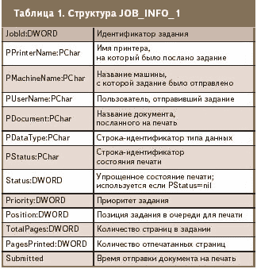
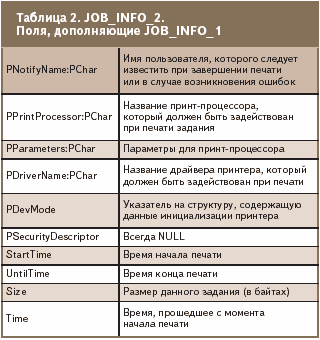
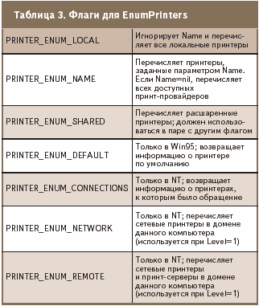
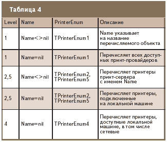

Мониторинг принтера
===================

::: {.date}
01.01.2007
:::

Мониторинг принтера

 

 \

Если организация оказывает вычислительные услуги, то в один прекрасный
момент перед ней неизбежно встанет проблема тарификации, напрямую
связанная с автоматическим учетом ресурсов. Эта статья рассказывает о
том, как автоматизировать учет использования принтера.

В перечень услуг интернет-кафе давно уже входит распечатка текстовых и
других документов. Однако организация этого дела все еще остается на
этапе минимальной автоматизации. Вот если бы удалось написать
программку, которая отслеживала бы, кто, когда и сколько напечатал, да
интегрировать ее в систему контроля компьютерного клуба, то это не
только избавило бы администраторов от лишнего диалога с клиентом, но и
придало клубу более современный вид.

 \

Теоретические основы мониторинга

 \

В теории мониторинг принтера в Windows 98 не является чем-то неимоверно
сложным --- те же драйверы не просто осуществляют этот самый мониторинг,
но и предоставляют возможности по управлению работой принтера. Мы же
пока будем довольствоваться лишь отслеживанием посылаемых на печать
задачами. Для этого в арсенале Windows предусмотрено два метода.

 \

Первый --- использование метода отслеживания сообщения
WM\_SPOOLERSTATUS, которое система посылает всякий раз при добавлении в
очередь нового задания или же при удалении оного.

 \

Второй способ --- использование функций
FindFirstPrinterChangeNotification, FindNextPrinterChangeNotification и
FindClosePrinterChangeNotification. В этой заметке мы рассмотрим первый
из них.

 \

Как и большинство сообщений Windows, WM\_SPOOLERSTATUS возвращает в
структуре TMessage некоторую полезную информацию, которую вы можете
иcпользовать в своих нуждах. Но, к сожалению, никакой действительно
важной и нужной информации (помимо количества оставшихся в очереди
заданий) эта структура не несет. К счастью, в Windows есть
дополнительные методы для определения необходимой нам информации. Так,
среди прочих в модуле WinSpool присутствует функция EnumJobs,
возвращающая количество и характеристики заданий печати, в которых
содержится требуемая информация --- от названия документа, машины и
имени пользователя, отправившего этот документ на печать, до времени,
когда это было сделано и количества страниц, посланных на печать.

 \

Эта функция выглядит следующим образом:

function EnumJobs(hPrinter: THandle; FirstJob, NoJobs, Level: DWORD;
pJob: Pointer; cbBuf: DWORD;\

var pcbNeeded, pcReturned: DWORD): BOOL; stdcall;

где:

::: {style="text-align: left; text-indent: 0px; padding: 0px 0px 0px 0px; margin: 7px 0px 7px 24px;"}
  --- ----------------------------------------------------------------------
  ·   hPrinter --- идентификатор принтера, к которому производится запрос;
  --- ----------------------------------------------------------------------
:::

::: {style="text-align: left; text-indent: 0px; padding: 0px 0px 0px 0px; margin: 7px 0px 7px 24px;"}
  --- ----------------------------------------------------
  ·   FirstJob --- номер первого запрашиваемого задания;
  --- ----------------------------------------------------
:::

::: {style="text-align: left; text-indent: 0px; padding: 0px 0px 0px 0px; margin: 7px 0px 7px 24px;"}
  --- ----------------------------------------------
  ·   NoJobs --- количество запрашиваемых заданий;
  --- ----------------------------------------------
:::

::: {style="text-align: left; text-indent: 0px; padding: 0px 0px 0px 0px; margin: 7px 0px 7px 24px;"}
  --- -----------------------------------------------------
  ·   Level --- тип структуры, которая передается в pJob;
  --- -----------------------------------------------------
:::

::: {style="text-align: left; text-indent: 0px; padding: 0px 0px 0px 0px; margin: 7px 0px 7px 24px;"}
  --- -----------------------------------------------------------------------------------------------------------------------
  ·   PJob --- указатель на массив переменных типа JOB\_INFO\_1 при Level=1 и JOB\_INFO\_2 при Level=2 (см. таблицу 1 и 2);
  --- -----------------------------------------------------------------------------------------------------------------------
:::

::: {style="text-align: left; text-indent: 0px; padding: 0px 0px 0px 0px; margin: 7px 0px 7px 24px;"}
  --- ---------------------------------
  ·   CbBuf --- размер буфера данных;
  --- ---------------------------------
:::

::: {style="text-align: left; text-indent: 0px; padding: 0px 0px 0px 0px; margin: 7px 0px 7px 24px;"}
  --- -------------------------------------------------------------------------------------------------------------------------------------------------------------------------------------------
  ·   PcbNeeded --- переменная, в которую заносится количество записанных в буфер данных (при удачном завершении функции) или же необходимый размер буфера в байтах (при неудачном завершении);
  --- -------------------------------------------------------------------------------------------------------------------------------------------------------------------------------------------
:::

::: {style="text-align: left; text-indent: 0px; padding: 0px 0px 0px 0px; margin: 7px 0px 7px 24px;"}
  --- ---------------------------------------------------------------------------------------------------
  ·   PcReturned --- количество занесенных в буфер записей, в которых содержится актуальная информация.
  --- ---------------------------------------------------------------------------------------------------
:::

{width="324" height="339"}

{width="320" height="340"}

Для нормальной работы этой функции, прежде всего, необходимо раздобыть
идентификатор принтера, который мы должны поместить в параметр hPrinter.
Для этого предназначена функция OpenPrinter, открывающая соответствующий
принтер и выдающая необходимый идентификатор:

function OpenPrinter(pPrinterName: PChar; var phPrinter: THandle;
pDefault: PPrinterDefaults): BOOL; stdcall;

где:

::: {style="text-align: left; text-indent: 0px; padding: 0px 0px 0px 0px; margin: 7px 0px 7px 24px;"}
  --- ----------------------------------------------------------
  ·   ppPrinterName --- имя принтера, который следует открыть;
  --- ----------------------------------------------------------
:::

::: {style="text-align: left; text-indent: 0px; padding: 0px 0px 0px 0px; margin: 7px 0px 7px 24px;"}
  --- -------------------------------------------------------------------------------------
  ·   phPrinter --- переменная, в которую будет записан идентификатор открытого принтера;
  --- -------------------------------------------------------------------------------------
:::

::: {style="text-align: left; text-indent: 0px; padding: 0px 0px 0px 0px; margin: 7px 0px 7px 24px;"}
  --- -----------------------------------------------------------------------------------
  ·   pDefault --- структура, содержащая необходимые для инициализации принтера данные.
  --- -----------------------------------------------------------------------------------
:::

Если в системе присутствует лишь один принтер (подключенный к компьютеру
админа), то параметр ppPrinterName может быть строго зафиксирован в
самом коде приложения. Если же принтеров в сети несколько (подключенный
к серверу, к компьютеру администратора, к компьютеру кассы и т.д.), то
лучше всего предоставить пользователю возможность самостоятельно
выбирать, какой из принтеров следует инспектировать. Для этого можно
воспользоваться функцией перечисления доступных принтеров:

function EnumPrinters(Flags: DWORD; Name: PChar; Level: DWORD;\

pPrinterEnum: Pointer; cbBuf: DWORD; var pcbNeeded, pcReturned: DWORD):
BOOL; stdcall;

где:

::: {style="text-align: left; text-indent: 0px; padding: 0px 0px 0px 0px; margin: 7px 0px 7px 24px;"}
  --- -------------------------------------------------------------------------------------
  ·   Flags --- флаги, которые дазают особенности перечисления принтеров (см. таблицу 3);
  --- -------------------------------------------------------------------------------------
:::

::: {style="text-align: left; text-indent: 0px; padding: 0px 0px 0px 0px; margin: 7px 0px 7px 24px;"}
  --- ----------------------------------------------------------------------------------------------------
  ·   Name --- название принт-объекта; значение этого параметра используется в паре с Level (таблица 4);
  --- ----------------------------------------------------------------------------------------------------
:::

::: {style="text-align: left; text-indent: 0px; padding: 0px 0px 0px 0px; margin: 7px 0px 7px 24px;"}
  --- ------------------------------------------------------------------
  ·   Level --- индекс уровня; используется вместе с Name (таблица 4);
  --- ------------------------------------------------------------------
:::

::: {style="text-align: left; text-indent: 0px; padding: 0px 0px 0px 0px; margin: 7px 0px 7px 24px;"}
  --- ----------------------------------------------------------------------------------------------------------------------------------------
  ·   PPrinterEnum --- указатель на массив элементов одного из типов TPrinterInfo1, TPrinterInfo2, TPrinterInfo4, TPrinterInfo5 (таблица 4);
  --- ----------------------------------------------------------------------------------------------------------------------------------------
:::

::: {style="text-align: left; text-indent: 0px; padding: 0px 0px 0px 0px; margin: 7px 0px 7px 24px;"}
  --- ---------------------------------------
  ·   CbBuf --- размер буфера pPrinterEnum;
  --- ---------------------------------------
:::

::: {style="text-align: left; text-indent: 0px; padding: 0px 0px 0px 0px; margin: 7px 0px 7px 24px;"}
  --- ------------------------------------------------------------------------------------------------------------------------------------------------------------------------------------
  ·   PcbNeeded --- переменная. в которой содержится количество байт, скопированных при удачном завершении операции, или же размер недостающей памяти, если значение cbBuf слишком мало;
  --- ------------------------------------------------------------------------------------------------------------------------------------------------------------------------------------
:::

::: {style="text-align: left; text-indent: 0px; padding: 0px 0px 0px 0px; margin: 7px 0px 7px 24px;"}
  --- -------------------------------------------------------------------
  ·   PcReturned --- количество актуальных записей, занесенных в буфер.
  --- -------------------------------------------------------------------
:::

{width="322" height="381"}

{width="325" height="278"}

Практическая реализация

 \

Для практической реализации мы, как всегда, воспользуемся Delphi и
создадим сначала свежее приложение (New р Application). Далее для
демонстрации работы мы перенесем на форму 2 компонента: TreeView и
ListBox

Далее занесем в OnCreate код для перечисления доступных принтеров:

    procedure TForm1.FormCreate(Sender: TObject);
    var PI:array[0..1023] of PRINTER_INFO_1;
    Needed,Returned:Cardinal;i:integer;
    begin
    PrintersRoot:=TreeView1.Items.AddFirst(nil,'Printers');
    if not EnumPrinters(PRINTER_ENUM_LOCAL,nil,1,@PI,SizeOf(PI),Needed,Returned) then
    ListBox1.Items.Add(SysErrorMessage(GetLastError));
    For i:=0 to Returned-1 do
    TreeView1.Items.AddChild(PrintersRoot,PI[i].pName);
    end;

Здесь мы сначала создаем в TreeView родительский узел, куда будем
записывать все найденные принтеры. Далее запускаем поиск локальных
принтеров посредством передачи в EnumPrinters флага
PRINTER\_ENUM\_LOCAL. После этого при успешном завершении функции мы
переносим названия всех принтеров в TreeView или же выводим сообщение об
ошибке.

 \

Теперь у нас есть список всех доступных принтеров --- и мы со спокойной
душей можем предложить пользователю выбрать и открыть один из них. Для
этого в реакцию на событие OnDblClick компонента TreeView1 следует
записать следующий код:

    procedure TForm1.TreeView1Click(Sender: TObject);
    begin
    if not OpenPrinter(PChar(TreeView1.Selected.Text),PH,nil) then
    ListBox1.Items.Add(SysErrorMessage(GetLastError));
    end;

После двойного щелчка на названии принтера мы открываем его и записываем
полученный идентификатор в переменную PH, которая объявлена в секции
private нашей формы. А для пущей правильности кода в OnDestroy нашей
формы напишем:

    procedure TForm1.FormDestroy(Sender: TObject);
    begin
    ClosePrinter(PH);
    end;

Далее нам предстоит реализовать слежение за сообщением WM\_SPOOLERSTATUS
--- для этого я рекомендовал бы выбрать способ, предоставляемый Delphi
посредством служебного слова message:

    TForm1 = class(TForm)
    TreeView1: TTreeView;
    ListBox1: TListBox;
    procedure FormCreate(Sender: TObject);
    procedure TreeView1Click(Sender: TObject);
    procedure FormDestroy(Sender: TObject);
    private
    PrintersRoot:TTreeNode;
    PH:Cardinal;
    procedure WMPrinterStatus(var Msg:TMessage); message WM_SPOOLERSTATUS;
    { Private declarations }
    public
    { Public declarations }
    end;

Здесь метод WMPrinterStatus будет вызываться только при поступлении
сообщения WM\_SPOOLERSTATUS. В коде реализации этого метода мы с вами
напишем вот что:

    procedure TForm1.WMPrinterStatus(var Msg:TMessage);
    var i:integer;
    Job2:Array[0..1023] of JOB_INFO_2;Needed,Returned:Cardinal;
    begin
    Msg.Result:=0;
    ListBox1.Items.Add('Jobs Left:'+IntToStr(Msg.WParamLo));
    if not EnumJobs(PH,0,1024,2,@Job2,SizeOf(Job2),Needed,Returned) then ShowMessage(SysErrorMessage(GetLastError));
    For i:=0 to Returned-1 do
    With Job2[i] do
    ListBox1.Items.Add(Format('%s %s %s',[pPrinterName,pDocument,pUserName]))
    end;

Все. Проект готов, осталось только скомпилить его.

 \

После запуска приложения на экране появляется уже знакомое нам окно, в
компоненте TreeView которого присутствует список доступных локальных
принтеров (рисунок ниже). Открываем принтер (двойной щелчок на названии)
и запускаем любой текстовый редактор. Открываем документ (для пробы
можно воспользоваться и графическим редактором). А теперь: Файл р Печать
--- и мы видим...

 \

Послесловие

 \

Итак, теперь мы в курсе, как отслеживать состояние очереди на печать. И
не просто отслеживать, а еще и автоматически обрабатывать эту информацию
в корыстных целях :).

 \

Впрочем, этот метод не единственный в своем роде. К примеру, помимо
реакции на событие WM\_SPOOLERSTATUS, можно реализовать обработку
очереди посредством функций FindFirstPrinterChangeNotification,
FindNextPrinterChangeNotification, FindClosePrinterChangeNotification,
которые позволяют отслеживать не только добавление и удаление заданий
в(из) очереди, но и состояние очереди в процессе печати, а также
предоставляют ряд дополнительных возможностей. Кроме того, эти методы
позволяют настроить реакцию программы под более конкретные задачи
(Printer, PrinterDriver, Form, Job...), что, конечно, позитивно
сказывается на работоспособности системы в целом, особенно при больших
нагрузках на нее.

 \

К отрицательным же сторонам вопроса можно отнести тот факт, что при
обработке FindFirstPrinterChangeNotification,
FindNextPrinterChangeNotification, FindClosePrinterChangeNotification
необходимо реализовывать отдельный поток для отслеживания этих действий,
что само по себе непростая задача для человека, никогда не работавшего с
потоками вплотную.

 \
2005.09.28 Автор: Михаил Продан\
<https://www.cpp.com.ua>
