Компоненты ADO (статья)
=======================

В Delphi 5.0 появились компоненты для работы с Microsoft® ActiveX® Data
Objects (далее ADO). ADO это технология стандартного обращения к
реляционным данным от Microsoft. Эта технология аналогична BDE по
назначению и довольно близка по возможностям.

Следует отличать компоненты Delphi, являющиеся частью библиотеки
визуальных компонентов Delphi (VCL), и интерфейсы и объекты ADO, которые
в них инкапсулированы. В дальнейшем, когда упоминается компонент - это
компонент Delphi, а когда объект или интерфейс - это объект или
интерфейс ADO.

## Обзор компонент

Для работы с ADO на вкладке компонентов ADO есть шесть компонентов:
TADOConnection, TADOCommand, TADODataSet, TADOTable, TADOQuery,
TADOStoredProc.

:::{.center}
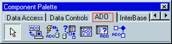  
Рис. 0.  Палитра компонент ADO
:::

TADOConnection аналогичен компоненту BDE TDatabase и используется для
указания базы данных и работы транзакциями.

TADOTable - таблица доступная через ADO.

TADOQuery - запрос к базе данных. Это может быть как запрос, в
результате которого возвращаются данные и базы (например, SELECT), так и
запрос не возвращающий данных (например, INSERT).

TADOStoredProc - вызов хранимой процедуры. В отличие от BDE и InterBase
хранимые процедуры в ADO могут возвращать набор данных, по этому
компонент данного типа является потомком от TDataSet и может выступать
источником данных в компонентах типа TDataSource.

TADOCommand и TADODataSet являются наиболее общими компонентами для
работы с ADO, но и наиболее сложными в работе. Оба компонента позволяют
выполнять команды на языке провайдера данных (так в ADO называется
драйвер базы данных).

Разница между ними в том, что команда, исполняемая через TADODataSet,
должна возвращать набор данных и этот компонент позволяет работать с
ними средствами Delphi (например, привязать компонент типа TDataSource).
А компонент TADOCommand позволяет исполнять команды не возвращающие
набор данных, но не имеет штатных средств Delphi для последующего
использования возвращенного набора данных.

Очевидно, что все компоненты должны связываться с базой данных. Делается
это двумя способами либо через компонент TADOConnection либо прямым
указанием базы данных в остальных компонентах. К TADOConnection
остальные компоненты привязываются с помощью свойства Connection, к базе
данных напрямую через свойство ConnectionString.

База данных может быть указана двумя способами через файл линка к данным
(файл в формате Microsoft Data Link, расширение UDL), либо прямым
заданием параметров соединения.

Значение свойства всех ConnectionString этих компонент могут быть
введены напрямую в текстовой форме, но куда проще вызвать редактор
свойства нажав на кнопку «...» в конце поля ввода. Окно этого свойства
выглядит так:

:::{.center}
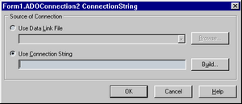  
Рис. 1.
:::

При выборе «Use data link file» и нажатии на кнопку «Browse...»
появляется стандартный диалог выбора файла. Этот файл можно создать в
любом окне explorer-а (в этом окне открытия файла, в самом explorer, на
desktop и т.д.) вызвав контекстное меню и выбрав пункт «New/Microsoft
Data Link». Потом вызовите локальное меню для созданного файла и
выберите в нем пункт «Open». После этого появится property sheet
описанный чуть ниже. Эти же вкладки содержит и property sheet,
вызываемый через пункт «Property» локального меню UDL файла, но в нем
еще есть вкладки относящиеся к самому файлу.

Использование файлов Microsoft Data Link упрощает поддержку приложений,
так как возможно использовать средства Windows для настройки приложения.

При выборе в редакторе свойства «Use connection string» и нажатии на
кнопку «Build...» появляется такой же property sheet, как и при выборе
«Open» для Microsoft Data Link файла.

В этом окне выбирается тип базы данных, местоположение базы и параметры
соединения.

На первой странице выбирается тип базы данных или Provider, в терминах
ADO.

:::{.center}
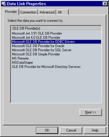  
Рис. 2.
:::

Базы MS Access доступны как через «Microsoft Jet OLE DB Provider», так и
через «Microsoft OLE DB Provider for ODBC».

Следующая страница зависит от выбранного типа базы, однако для всех
типов есть кнопка «Test connection» позволяющая проверить правильность и
полноту параметров.

Для «Microsoft Jet OLE DB Provider» она выглядит так:

:::{.center}
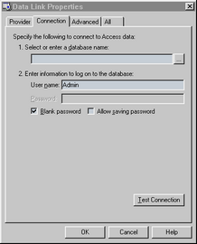  
Рис. 3.
:::

Checkbox «Blank password» подавляет диалог ввода идентификатора и пароля
пользователя при установлении соединения, если поле пароля пустое.

Checkbox «Allow saving password» сохраняет пароль в строке параметров
соединения. Если он не отмечен, то введенный пароль будет использоваться
только при выполнении тестового соединения.

Для «Microsoft OLE DB Provider for ODBC» эта страница выглядит так:

:::{.center}
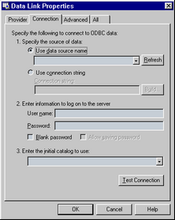  
Рис. 4.
:::

Радиокнопка «Use data source name» позволяет ввести предустановленный
алиас ODBC, а через «Use connection string» вводится как алиасы так и
тип ODBC драйвера и параметры соединения.

Параметры идентификации пользователя аналогичны выше описанным.

На странице «Advanced» расположены дополнительные параметры, с помощью
которых устанавливается уровень доступа к файлу базы данных, таймаут
сетевого соединения (то есть время через которое связь будет считаться
потерянной, если сервер не отвечает) и уровень глубины проверки
секретности соединения.

:::{.center}
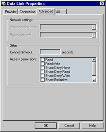  
Рис. 5.
:::

На странице «All» можно отредактировать все параметры с предыдущих
страниц и параметры зависящие от провайдера, но не вошедшие на страницу
«Connection». Редактирование осуществляется в виде параметр - значение,
причем в текстовой форме, никаких диалогов нет. Помощи то же нет, эти
параметры описаны только в документации на провайдер. Ее можно найти в
MSDN Data Access Services/Microsoft Data Access Components (MDAC)
SDK/Microsoft ActiveX Data Objects (ADO)/Microsoft ADO Programmer\'s
Reference/Using Providers with ADO.

:::{.center}
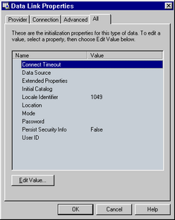  
Рис. 6.
:::

В компоненте TADOConnection есть свойства Provider, DefaultDatabase и
Mode которые являются альтернативным методом задания частей строки
параметров соединения - провайдера, базы данных (например, пути до базы
MS Access) и режима совместного использования файлов базы данных. Эти
значение этих свойств автоматически включаются в строку соединения, если
были заданы до активизации компонента и автоматически выставляются после
соединения.

**Простейшее приложение**

Создадим простейшее приложение, состоящее из одной таблицы.

1. Создаем форму состоящую из трех компонент:
    - TADOTable с палитры компонент ADO,
    - TDataSource с палитры компонент Data Access,
    - TDBGrid c палитры компонент Data Controls.

    :::{.center}
    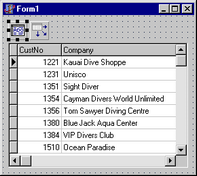  
    Рис 7
    :::

2. Связываем компоненты, устанавливая
свойство TDBGrid DataSource на компонент TDataSource,
свойство DataSet компонента TDataSource на компонент TADOTable.

3. Теперь нам необходимо указать базу данных. Делается это в свойстве
ConnectionString компонента TADOTable. При нажатии на кнопку «...»
появится редактор параметров соединения. Отметим радокнопку «Use data
link file», нажмите на кнопку «Browse...» и выберите в появившемся окне
после файл линка к базе данных «\\Program Files\\Common
Files\\System\\ole db\\Data Links\\DBDEMOS.UDL». Этот линк указывает на
базу в формате MS Access, входящую в поставку Delphi.

4. После этого в свойстве TableName компонента TADOTable выберем таблицу
customer.

5. Активизируем компонента TADOTable, установив свойство Active в True.

6. Приложение можно запускать. Этот пример можно найти в директории Simple.

## Обзор ADO

ADO основано на технологии COM. Все объекты и интерфейсы ADO являются
интерфейсами и объектами COM.

:::{.center}
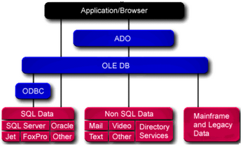  
Рис 8. Архитектура ADO
:::

**Интерфейс Connection**

Объекты этого типа выполняют следующие функции:

- Связь с сервером.
- Управление транзакциями.
- Получение информации о произошедших ошибках (свойство Errors).
- Получение информации о схеме данных (таблицы, поля и так далее).

:::{.center}
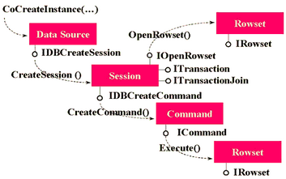  
Рис 9. Схема взаимодействия в ADO основных COM интерфейсов
:::

**Интерфейсы Recordset и Field**

Интерфейс Recordset  (на нижнем уровне ADO это IRowset) является
аналогом TDataSet в Delphi.

Поддерживает текущее положение и перемещение курсора, закладки
(bookmarks), чтение, изменение и удаление записей и так далее. Значение
полей и их типы доступны с помощью свойства Fields.

Интерфейс Field позволяет получать значение поля, его тип длину и так
далее.

**Интерфейсы Command и Parameter**

Эти два типа позволяют работать с командами источника данных. Синтаксис
команд для каждого из источников свой.

**Интерфейс Property**

Все объекты, кроме Parameter, имеют свойство Properties, которое
позволяет получать и устанавливать параметры специфические для
провайдера данных.

Библиотека довольно запутанная, многие функции дублированы в разных
объектах. Например, Recordset можно создавать напрямую, методом Open,
(причем предварительно создавать Connection не обязательно), можно
получить как результат выполнения метода Command.Execute, либо после
Connection.Execute задав команду без параметров.

Интерфейс Command инкапсулирован во все компоненты за исключением
TADOConnection. Это сделано потому, что в ADO нет возможности получить
данные не выполнив команду.

Интерфейс Recordset инкапсулирован в компоненты производные от
TCustomADODataSet. Это компоненты TADODataSet, TADOTable, TADOQuery,
TADOStoredProc. Получать данные из них возможно штатными средствами
Delphi.

Возможно получение данных и при выполнении компонента TADOCommand. Метод
этого компонента Execute возвращает тип \_Recordset. После чего его
можно, например, связать с компонентом TADODataSet следующим образом

    ADODataSet1.RecordSet := ADOCommand1.Execute;

Компоненты TADOTable, TADOQuery и TADOStoredProc являются частными
случаями команды, соответственно для таблицы, SQL запроса и хранимой
процедуры.

Тип Connection инкапсулируется в компонент TADOConnection.

Когда вы выполняете команду предварительно не открывая соединение, оно
все равно создается. Получить к нему доступ возможно через свойство
Recordset. Привязать компонент TADOConnection к уже открытому соединению
возможно через свойство ConnectionObject.

Информацию о структуре базы данных можно получить с помощью метода
OpenSchema компонента TADOConnection. Эта информация представлена как
набор таблиц, как стандартизованных, так и специфических для провайдера.
Таким способом можно узнать список таблиц, запросов, хранимых процедур и
многое другое. Однако изменять структуру базы с помощью возвращаемых
наборов данных невозможно.

**Пример использования TADOConnection**

В этом примере рассматривается работа с компонентом TADOConnection, SQL
запросами с параметрами и трансакциями.

Создадим приложение из следующих компонентов:

- Connect типа TADOConnection
- MasterSQL и DetailSQL типа TADODataSet
- MasterDS и DetailDS типа TDataSource
- MasterGrid и DetailGrid типа TDBGrid

:::{.center}
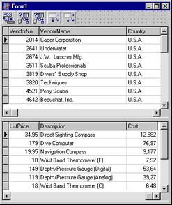  
Рис 10. Master-detail форма на этапе дизайна
:::

- Связываем MasterGrid, MasterDS, MasterSQL и DetailGrid, DetailDS,
DetailSQL аналогично предыдущему примеру, за исключением того, что
вместо типа TADOTable используется тип TADODataSet.

- Привязываем Connect к базе данных. Для этого в редакторе свойства
ConnectionString выбираем ту же базу данных, что и в предыдущем примере.

- Для ввода SQL запросов необходимо отредактировать свойство CommandText
в компонентах MasterSQL и DetailSQL. После нажатия на кнопку «...»
появится редактор компонент, который выглядит следующим образом

:::{.center}
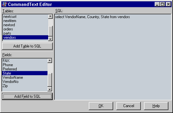  
Рис. 10
:::

- Кнопка «Add Table to SQL» добавляет в текст SQL запроса таблицу,
выбранную в списке «Tables», а «Add Field to SQL» поле таблицы,
выбранное в списке «Fields».

Запрос для MasterSQL:

    select VendorNo, VendorName, Country, City, State, Preferred
    from vendors

Запрос в DetailSQL должен выбирать только те детали, поставщик которых
является текущим в MasterSQL. Для этого установим свойство DataSource
компонента DetailSQL в значение MasterDS.

Запрос для DetailSQL следующий:

    select PartNo, OnOrder, OnHand, ListPrice, Description, Cost
    from parts
    where VendorNo = :VendorNo

\:VendorNo в части where - параметр запроса. Параметры при установленном
DataSource берутся из него.

Активизируем MasterSQL и DetailSQL аналогично предыдущему примеру.

Приложение можно запускать. Этот пример можно найти в директории
MasterDetail.

**Пример использования параметров запроса**

Теперь ограничим выборку поставщиков по значению поля State. Для этого
добавим к форме следующие компоненты StateEdit типа TEdit c вкладки
Standard, QueryButton типа TButton c вкладки Standard

Изменим запрос в MasterSQL на

    select VendorNo, VendorName, Country, City, State, Preferred
    from vendors
    where State = :StateID

\:StateID - параметр, вместо которого при выполнении подставляется
значение.

Добавим так же обработчик события OnClick в QueryButton следующего
содержания

    procedure TForm1.QueryButtonClick(Sender: TObject);
    begin
      MasterSQL.Active := False;
      DetailSQL.Active := False;
      MasterSQL.Parameters.ParamByName('StateID').Value := StateEdit.Text;
      MasterSQL.Active := True;
      DetailSQL.Active := True;
    end;

Программа готова.

**Синхронизация данных клиента и сервера.**

В ADO используются три метода синхронизации данных на клиенте и сервере.

Первый - c помощью метода Resync, который повторно считывает записи
набора. Этот метод используется при выполнении метода Refresh Delphi.

Второй - повторный запрос методом Requery, который заново выполняет
запрос на сервере. Выполнение этого метода то же самое, что и выполнение
подряд закрытия и открытия набора данных.

Третий - уведомление сервером клиента в случае изменения данных.

Этих методы доступны во всех компонентах имеющих набор данных. Однако
эти функции доступны не для всех баз данных.

**Работа с транзакциями**

В компонентах ADO работа с транзакциями осуществляется через компонент
TADOConnection.

Тип транзакции устанавливается в свойстве IsolationLevel одной из
следующих констант:

IlUnspecified
:         Сервер будет использовать лучший, по его мнению, тип изоляции.

IlChaos
:         Транзакции с более высоким уровнем изоляции не могут
изменять данные измененные, но не подтвержденные в текущей транзакции.

IlReadUncommitted
:        Чтение данных измененных в не подтвержденных
транзакций. То есть изменения видны сразу после того как другая
транзакция передала их на сервер.

IlBrowse
:        То же самое что и IlReadUncommitted

IlReadCommitted
:        Чтение данных измененных подтвержденными
транзакциями. То есть изменение данных будет видимо после выполнения
Commit в другой транзакции.

IlCursorStability:
        То же самое что и IlCursorStability.

IlRepeatableRead:
:        Изменения, сделанные другими транзакциями не
видимы, но при выполнении перезапроса они транзакция может получать
новый набор данных.

IlIsolated
:        Транзакция не видит изменений данных произведенных
другими транзакциями.

IlSerializable
:        То же самое что и IlIsolated.

Обратите внимание на то, что не все типы провайдеров данных поддерживают
все типы изоляции или работу с транзакциями.

Свойство Attributes устанавливает открывать ли новую транзакцию
автоматически:

- xaCommitRetaining - при подтверждении транзакции
- xaAbortRetaining - при отмене транзакции

Так же у компонента TADOConnection есть три метода для работы с
транзакциями:

- BeginTrans        Начинает транзакцию
- CommitTrans        Подтверждает сделанные изменения
- RollbackTrans        Откатывает транзакцию.

**Пример работы с транзакциями**

За базовый возьмем пример использования TADOConnection.

Добавим к форме две кнопки (StCmButton и RollbackButton) типа TButton,
обработчики событий OnClick этих кнопок, процедуру fix\_controls без
параметров к форме, обработчик события OnActivate формы

    type
      TForm1 = class(TForm)
            …
    private
           procedure fix_controls;
            …
    procedure TForm1.fix_controls;
    begin
        if Connection.InTransaction then
            begin
               StCmButton.Caption := 'Commit';
               RollbackButton.Enabled := True;
            end
        else
            begin
               StCmButton.Caption := 'Begin';
               RollbackButton.Enabled := False;
            end;
        MasterSQL.Requery;
        DetailSQL.Requery;
    end;
     
    procedure TForm1.StCmButtonClick(Sender: TObject);
    begin
        if not Connection.InTransaction
              then Connection.BeginTrans
              else Connection.CommitTrans;
        fix_controls;
    end;
     
    procedure TForm1.RollbackButtonClick(Sender: TObject);
    begin
        Connection.RollbackTrans;
        fix_controls;
    end;
     
    procedure TForm1.FormActivate(Sender: TObject);
    begin
        fix_controls;
    end;

Программу можно запускать.

Обратите внимание на то, что когда транзакция не запущена, все равно
можно изменять данные и они записываются немедленно.

**Доступ к данным**

В отличие от BDE, ADO поддерживает больше настроек работы данных.

В ADO есть понятие набора данных (recordset) и тесно связанное с ним
понятие курсора (cursor). Что такое курсор в документации на ADO не
описано. Однако почему то месторасположение набора данных называется
положением курсора. Я думаю, что это терминологическая путаница в
Microsoft и курсор то же самое что набор данных.

Во всех компонентах имеющих набор данных (то есть в TADODataSet,
TADOTable, TADOQuery, TADOStoredProc) есть свойства CursorLocation,
CursorType, LockType и MarshalOptions, устанавливающие параметры обмена
с сервером. Все эти свойства должны быть установлены до того, как набор
данных открывается. Если вы установите их позже, то эффекта не будет.

CursorLocation - определяет, где выполняется работа с набором на
клиенте (clUseClient) или на сервере (clUseServer). Если набор данных
расположен на клиенте, то с сервера данные запрашиваются однократно (или
до выполнения повторного запроса), в дальнейшем вся выборка данных и
позиционирование идет на клиенте. Однако модификация данных производится
немедленно.

CursorType - устанавливает тип курсора. Значение одно из:

- ctUnspecified - библиотека ADO сама определяет оптимальный тип блокировки.
- ctStatic - статический курсор. Статическая копия набора записей,
которую вы можете использовать, например, для генерации отчета.
Добавления, изменения или удаление записей другими пользователями не
видимы.
- сtOpenForwardOnly - идентичен статическому курсору, за исключением
того, что вы можете переходить только вперед. Это тип улучшает
эффективность в ситуациях, когда вы делаете только один проход через
набор данных.
- ctDynamic - динамический курсор. Добавления, изменения и удаление
другими пользователями видимы и возможны все типы передвижения по набору
данных. Закладки (bookmarks) возможны только, если провайдер данных их
поддерживает.
- ctKeyset - курсор набора данных. Аналогичен динамическому курсору, за
исключением того, что вы не увидите записи добавленные другими
пользователями, а записи удаленные другими пользователями недоступны из
вашего набора данных. Изменения данных другими пользователями видимы.

    Надо заметить, что TDBGrid и другие компоненты, одновременно работающие
    с несколькими записями, могут работать только когда закладки
    поддерживаются. Поэтому для компонент с которыми вы будите связывать
    такие компоненты должны использоваться типы ctKeyset или ctDynamic.

- LockType - определяет тип блокировки записей в наборе данных. Одно из:
    - ltUnspecified - библиотека ADO сама определяет какой тип будет использоваться.
    - ltReadOnly - только чтение, изменение данных невозможно.
    - ltPessimistic - пессимистическая блокировка. Запись блокируется сразу после начала редактирования и до сохранения записей.
    - ltOptimistic - оптимистическая блокировка. Запись блокируется только когда изменения сохраняются.
    - ltBatchOptimistic - тоже самое что и ltOptimistic, но используется
    отложенное сохранение изменений записей. Более подробно она
    рассматривается в следующем пункте.

- MarshalOptions - это свойство определяет будут ли отправлены на сервер
те поля, которые не были изменены. При значении moMarshalAll будут, а
при moMarshalModifiedOnly не будут.

**Работа с отложенными изменениями**

Обратите внимание, что в компонентах ADO нет свойства CachedUpdates, но
это не означает, что невозможно отложить передачу изменений данных на
сервер. Эта возможность встроена с ADO и называется Batch Updates.

Для ее использования необходимо использовать клиентский курсор (то есть
установить свойство CursorLocation в clUseClient) и LockType в
ltBatchOptimistic

Так же есть метод сохраняющий изменения UpdateBatch и метод их
отменяющий CancelBatch.

К каким записям из набора данных применяется действие зависит от
единственного параметра этих функций:

- arCurrent - текущая запись
- arFiltered - записи, которые попали в фильтрацию.
- arAll - все записи набора.

**Пример работы с отложенными изменениями.**

За основу возьмем пример работы с транзакциями.

Добавим компоненты:

- BatchCB типа TCheckBox
- ApplyButton типа TButton
- CancelButton типа TButton

Добавим обработчики событий OnClick во все эти три компонента.

Изменим обработчик события OnActivate формы.

    procedure TForm1.FormActivate(Sender: TObject);
    begin
        fix_controls;
        ApplyButton.Visible  := BatchCB.State = cbChecked;
        CancelButton.Visible := BatchCB.State = cbChecked;
    end;
     
    procedure TForm1.BatchCBClick(Sender: TObject);
    begin
        MasterSQL.Close;
        DetailSQL.Close;
        if BatchCB.State = cbChecked then
          begin
             MasterSQL.LockType := ltBatchOptimistic;
             DetailSQL.LockType := ltBatchOptimistic;
          end
        else
          begin
             MasterSQL.LockType := ltOptimistic;
             DetailSQL.LockType := ltOptimistic;
          end;
        MasterSQL.Open;
        DetailSQL.Open;
        ApplyButton.Visible  := BatchCB.State = cbChecked;
        CancelButton.Visible := BatchCB.State = cbChecked;
    end;
     
    procedure TForm1.ApplyButtonClick(Sender: TObject);
    begin
        MasterSQL.UpdateBatch;
        DetailSQL.UpdateBatch;
    end;
     
    procedure TForm1.CancelButtonClick(Sender: TObject);
    begin
        MasterSQL.CancelBatch;
        MasterSQL.CancelBatch;
    end;

**События ADO**

События ADO предназначены для той же цели, что и события VCL. Многие из
них имеют аналогичные события VCL и компоненты вызывают из событий ADO
события VCL. В компонентах доступны как события ADO, так и события BDE.

**События соединения.**

- OnWillConnect - вызывается перед установкой соединения.
- OnConnectComplete - после установки соединения.
- OnDisconnect - при разрыве соединения.

Эти события инкапсулированы в компоненте TADOConnection.

**События транзакции.**

- OnBeginTransComplete - при выполнении BeginTrans.
- OnCommitTransComplete - при выполнении CommitTrans.
- OnRollbackTransComplete - при выполнении RollbackTrans.

Эти события инкапсулированы в компоненте TADOConnection.

**События выполнения команд**

OnWillExecute и OnExecuteComplete вызываются перед и после выполнением
команды.

Эти события инкапсулированы в компоненте TADOConnection, а не в
компоненте TADOCommand, как можно было бы предположить. Это связано с
тем, что в ADO объекта команды как такого нет и по этой причине он не
может получать сообщения.

В TADOConnection также инкапсулировано событие OnInfoMessage, которое
вызывается при приходе с сервера дополнительной информации. Формат и
назначение зависят от сервера, с которым вы работаете.

В ADO так же есть события связанные с набором данных, а не с
соединением, как вышеописанные. Они инкапсулированы в компоненты имеющие
набор данных - TADODataSet, TADOTable, TADOQuery и TADOStoredProc.

Эти события можно разбить на три группы.

1) События выборки данных

- OnFetchProgress - многократно вызывается в процессе выборки набора данных.
- OnFetchComplete - завершение выборки.

2) Уведомления об изменении положения текущей записи в наборе.

- OnWillMove, OnMoveComplete - вызываются до и после изменения положения
текущей записи. OnWillMove позволяет отменить действие.

- OnEndOfRecordset - вызывается при достижении конца набора данных,
позволяет добавить новую запись.

3) Уведомления об изменении набора данных

- OnWillChangeField, OnFieldChangeComplete - до и после изменения текущей
записи набора.

- OnWillChangeRecord, OnRecordChangeComplete - вызываются до и после
изменения, добавления, удаления строки набора и отмене этих действий.

- OnWillChangeRecordset, OnRecordsetChangeComplete - вызываются до и после
открытия, закрытия, повторного запроса и синхронизации набора данных.

Многие события допускают прерывание действия. Эта возможность бывает
полезна при асинхронной работе с сервером. Например, для прерывания
слишком длинного запроса.

**Асинхронная работа с сервером**

В ADO есть возможность не имеющая аналогов ни в BDE ни в InterBase. Это
асинхронное выполнение операций с сервером. Могут асинхронно выполнятся
установка соединения с сервером (Connection), выполнение команды
(Execute) и выборка набора данных (Fetch)

**Асинхронное соединение**

Для включения этого режима необходимо установить свойство ConnectOptions
компонента TADOConnection в coAsyncConnect.

При установлении соединения происходит следующее:

- Вызывается обработчик события OnWillConnect
- Управление передается в программу
- После окончания соединения, как успешного, так и ошибочного, вызывается
обработчик события OnConnectComplete

**Асинхронное выполнение команды**

Надо заметить, что все компоненты ADO, за исключением компонента
TADOConnection при активизации или выполнении исполняют команду ADO. Эти
компоненты TADOCommand, TADODataSet, TADOTable, TADOQuery,
TADOStoredProc. Установите в свойстве ExecuteOptions eoAsyncExecute.

При исполнении происходит следующее:

- Вызывается обработчик события OnWillExecute
- Управление передается в программу
- После окончания выполнения команды, как успешного, так и ошибочного,
вызывается обработчик события OnExecuteComplete

**Асинхронная выборка данных**

Асинхронная выборка данных поддерживается в компонентах TADODataSet,
TADOTable, TADOQuery, TADOStoredProc. Для ее включения установите в
свойстве ExecuteOptions eoAsyncFetch.

После исполнения команды происходит передача данных. В процессе передачи
многократно вызывается обработчик сообщения OnFetchProgress. В его
параметрах есть как количество уже переданных записей, так и общее
количество. Это очень удобно для создания индикаторов типа TProgressBar.
После того, как выборка с сервера закончена, вызывается обработчик
события OnFetchComplete.

**Ресурсы:**

- https://www.borland.com/delphi/
- https://www.microsoft.com/ado/

