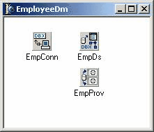
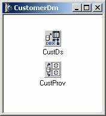
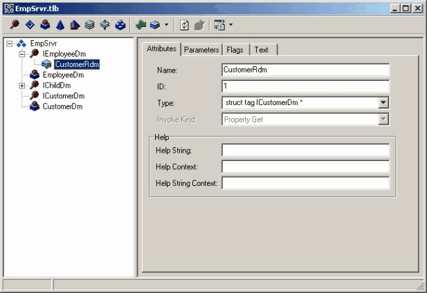
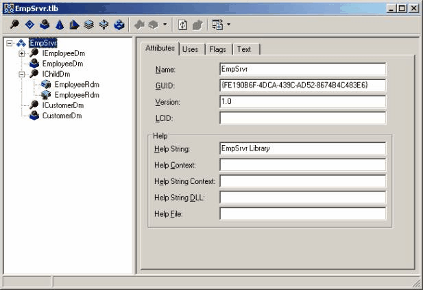
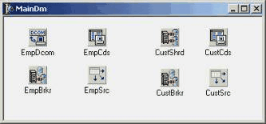
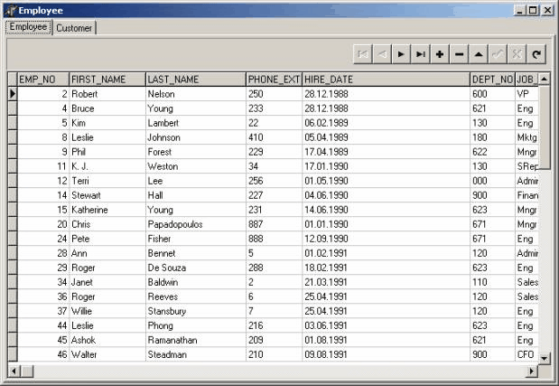

Множество модулей данных - одно соединение
===========================================

::: {.date}
01.01.2007
:::

Автор: Bill Todd (The Database Group, Inc)
WEB-сайт: http://www.programme.ru

Перевод: Олег Мотов

При создании многоуровневых приложений в предыдущих версиях Delphi
многие разработчики сталкивались с одной проблемой - трудностью
размещения всех необходимых компонентов доступа к данным в одном модуле
данных. Решение заключалось в том, чтобы использовать несколько
удаленных модулей данных.

Первая проблема этого решения состоит в том, что клиентскому приложению
необходимо отдельное соединение для каждого модуля данных на сервере
приложений. А это - нагрузка на системные ресурсы и на клиенте и на
сервере.

Вторая проблема состоит в том, что удаленные модули данных, относящиеся
к одному клиенту, абсолютно ничего не знают друг о друге. Например, не
существует способа из одного модуля данных вызвать метод другого модуля
данных, относящегося к тому же клиенту.

Delphi 6 решает эти проблемы, позволяя клиентскому приложению
использовать одно соединение для многих модулей данных на сервере
приложений. Делается это не совсем тривиально - только перетаскивания
компонентов и запуска «мастеров» недостаточно. Чтобы построить
приложение, которое использует разделяемое соединение, придется добавить
кое-какие интерфейсы и свойства в библиотеку типов на сервере
приложений. Впрочем, достаточно один раз разобраться, как это делается,
и в дальнейшем разработка приложений, использующих одно соединение
для многих модулей данных, становится несложной.

Лучший способ понять этот процесс состоит в том, чтобы пройти через
построение демонстрационного приложения, что мы и сделаем в этой статье.
В этой статье подразумевается, что читатель знает, как строить
многоуровневое приложение в Delphi 5 с использованием компонентов MIDAS.

Построение сервера

Чтобы построить сервер, создайте новый проект и добавьте к нему
удаленный модуль данных. В нашем приложении используется
демонстрационная база данных InterBase, а для соединения с базой данных
применяется dbExpress. На рис. 1 показан законченный модуль данных. Он
содержит компоненты SQLConnection, SQLDataSet и DataSetProvider.

:::{.center}
  
Рисунок 1. Удаленный модуль данных employee
:::

В компоненте SQLConnection, названном EmpConn, свойство DriverName
установлено в InterBase. Свойство компонента Params изменено так, чтобы
в нем содержался правильный путь к демонстрационной базе данных
InterBase. Если вы загрузите демонстрационное приложение, перед запуском
надо будет изменить этот путь. Демонстрационное приложение доступно для
загрузки, подробности см. в конце статьи.

В компоненте SQLDataSet, названном EmpDs, свойство SQLConnection
указывает на компонент подключения EmpConn. Свойству CommandText
присвоена команда 'SELECT * FROM Employee'.

В компоненте DataSetProvider (EmpProv) свойство DataSet указывает на
EmpDs.

Далее следует добавить второй удаленный модуль данных к проекту сервера.
Второй удаленный модуль данных изображен на рис. 2, он содержит один
компонент SQLDataSet (CustDs) со значением 'SELECT * FROM Customer'
свойства CommandText. Модуль данных также содержит DataSetProvider
(CustProv), связанный с SQLDataSet.

:::{.center}
  
Рисунок 2. Удаленный модуль данных customer
:::

Теперь нужно добавить необходимые интерфейсы и свойства в библиотеку
типов сервера приложений. На рис. 3 показан редактор Type Library с
развернутым интерфейсом IEmployeeDm. Чтобы использовать одно разделяемое
соединение для доступа ко многим удаленным модулям данных, один из
модулей должен быть назначен главным, а все другие модули будут
дочерними. В этом примере удаленный модуль данных employee будет
главным, а удаленный модуль данных customer дочерним.

Для каждого дочернего модуля данных вы должны добавить свойство,
доступное только для чтения в интерфейс главного удаленного модуля
данных. На рис. 3 в интерфейс модуля данных employee было добавлено
свойство CustomerRdm типа ICustomerDm (интерфейс дочернего модуля
данных). Интерфейс дочернего модуля данных ICustomerDm, появляется в
раскрывающемся списке типов, так что вам остается лишь выбрать его из
списка.

:::{.center}
  
Рисунок 3. Свойство дочернего удаленного модуля данных, добавленное к
интерфейсу главного модуля данных
:::

Это - единственное изменение, которое нужно сделать в библиотеке типов
сервера приложений, чтобы воспользоваться преимуществами разделяемого
соединения.

Одно из достоинств этой технологии - способность любого экземпляра
дочернего модуля данных обратиться к интерфейсу главного модуля данных
того же соединения. Для этого к интерфейсу каждого дочернего удаленного
модуля данных нужно добавить еще одно свойство. Легче всего это сделать,
добавив новый интерфейс в библиотеку типов, затем добавить к нему
необходимое свойство и использовать этот интерфейс в качестве предка
всех дочерних модулей данных.

На рис. 4 показан редактор Type Library с новым интерфейсом IChildDm
типа IAppServer. В этот интерфейс добавлено свойство EmployeeRdm типа
IEmployeeDM. Затем свойство Parent Interface интерфейса ICustomerDm было
изменено на IChildDm. Меняя родительский интерфейс, вы позволяете
интерфейсу ICustomerDm унаследовать свойство EmployeeRdm из интерфейса
IChildDm. Такую же замену свойства Parent Interface следует сделать в
каждом дочернем удаленном модуле данных.

:::{.center}
  
Рисунок 4. Интерфейс IChildDm со свойством EmployeeRdm
:::

После нажатия на кнопку Refresh и закрытия редактора Type Library
настало время добавить код к методам чтения и записи добавленных нами
свойств. Перейдем в раздел инициализации модуля (unit) дочернего модуля
данных. Там вы увидите тот код, который ниже показан в комментарии и
помечен "Before:" (он создан автоматически). Измените этот код, чтобы
получилось примерно так:

    initialization
    // Before:
    // TComponentFactory.Create(ComServer, TCustomerDm, _CustomerDm, ciInternal, tmApartment);
    // After:
      CustRdmFactory := TComponentFactory.Create(ComServer, TCustomerDm,
        Class_CustomerDm, ciInternal, tmApartment);
     
    // В разделе interface модуля следует добавить переменную CustRdmFactory,
    // чтобы сохранить ссылку на экземпляр фабрики компонентов, возвращаемую
    // вызовом TcomponentFactory.Create:
    var
      CustRdmFactory: TComponentFactory;

Теперь, когда есть глобальная переменная, которая указывает на экземпляр
объекта фабрики компонентов, создать экземпляр дочернего удаленного
модуля данных можно из любого места приложения вызовом метода
CreateCOMObject фабрики компонентов. Вызов объекта фабрики компонентов
дочернего удаленного модуля данных входит в метод чтения свойства
CustomerRdm, которое ранее было добавлено к интерфейсу IEMPLOYEEDM. Код
для метода Get\_CustomerRdm:

    function TEmployeeDm.Get_CustomerRdm: ICustomerDm;
    begin
      Result := CustRDMFactory.CreateCOMObject(nil) as ICustomerDm;
      Result.EmployeeRdm := Self;
    end;

Чтобы создать экземпляр дочернего удаленного модуля данных и присвоить
ссылку на его интерфейс свойству CustomerRdm, в первой строке этого
метода вызывается метод CreateCOMObject фабрики компонентов дочернего
удаленного модуля данных. Во второй строке этого метода Self (то есть
ссылка на главный удаленный модуль данных) назначается свойству
EmployeeRdm нового объекта дочернего модуля данных. Это позволяет
дочернему удаленному модулю данных CustomerDm обращаться к свойствам и
вызывать методы главного удаленного модуля данных EmployeeDm. Последнее,
что вы должны добавить в сервер приложений, нужно для методов чтения и
записи свойства EmployeeRdm. Эти методы просто получают и устанавливают
значение свойства:

    function TCustomerDm.Get_EmployeeRdm: IEmployeeDm;
    begin
      Result := FEmployeeRdm;
    end;
     
    procedure TCustomerDm.Set_EmployeeRdm(const Value: IEmployeeDm);
    begin
      FEmployeeRdm := Value;
    end;

Построение клиента

Демонстрационное клиентское приложение состоит из удаленного модуля
данных (рис. 5) и формы (рис. 6). Модуль данных содержит компонент
DCOMConnection, свойству ServerName которого присвоено значение
EmpSrvr.EmployeeDm, чтобы соединить его с главным удаленным модулем
данных сервера приложений.

:::{.center}
  
Рисунок 5. Модуль данных клиентского приложения
:::

:::{.center}
  
Рисунок 6. Модуль данных клиентского приложения
:::

Ниже компонента DCOMConnection EmpDcom можно увидеть компонент
ConnectionBroker. Это - новый компонент в Delphi 6, он позволяет
добавлять новый программный слой между множеством компонентов
ClientDataSet и компонентом соединения, с которым они связаны. Это дает
возможность менять компонент соединения, который используют компоненты
ClientDataSet, изменяя свойство Connection компонента ConnectionBroker,
вместо того, чтобы изменять свойство RemoteServer каждого компонента
ClientDataSet.

В этом приложении не имеет смысла использовать ConnectionBroker, потому
что есть только один ClientDataSet. Я включил ConnectionBroker только
для того, чтобы показать, как им пользоваться. Чтобы воспользоваться
компонентом ConnectionBroker, достаточно поместить его на модуль данных
и присвоить его свойству Connection ссылку на тот компонент соединения,
который вы хотите использовать. Когда вы добавите ClientDataSet,
обратите внимание, что у него есть новое свойство ConnectionBroker. В
компоненте ClientDataSet установите только свойство ConnectionBroker, а
свойство RemoteServer оставьте пустым. Свойству ConnectionBroker
компонента ClientDataSet EmpCds присвоена ссылка на компонент
ConnectionBroker EmpBrkr, а свойство ProviderName ссылается на EmpProv.

Прежде чем вы сможете соединить ClientDataSet с провайдером customer
дочернего модуля данных на сервере приложений, надо добавить компонент
SharedConnection к модулю данных клиента. Компонент SharedConnection
(см. рис. 5) называется CustShrd. У него есть свойство ParentConnection,
которому присвоена ссылка на компонент EmpDcon.

У компонента SharedConnection вы не можете устанавливать свойство
ParentConnection так, чтобы оно указывало на компонент ConnectionBroker.
Это, очевидно, разрушает смысл использования ConnectionBroker, потому
что вы больше не можете менять соединения, просто изменяя свойство
Connection одного ConnectionBroker.

Компонент SharedConnection также имеет свойство ChildName. Выбрав это
свойство в Object Inspector и нажав на раскрывающую стрелку, вы увидите
список всех дочерних удаленных модулей данных сервера приложений. В
демонстрационном приложении этой статьи есть только один дочерний
удаленный модуль данных - CustomerRdm.

Чтобы подключить более одного компонента ClientDataSet к компоненту
SharedConnection, можно добавить компонент ConnectionBroker и соединить
его с компонентом SharedConnection. Хотя демонстрационное приложение
имеет только один ClientDataSet CustCds, использующий разделяемое
соединение, в нем применяется компонент ConnectionBroker (только для
того, чтобы показать, как его использовать с компонентом
SharedConnection).

Разработка оставшейся части клиентского приложения не отличается от
разработки любого другого многоуровневого клиента в Delphi. Только
соедините компоненты DataSource с ClientDataSet и компоненты
пользовательского интерфейса с DataSource.

Заключение

Если вы собираетесь разрабатывать многоуровневые приложения, компонент
SharedConnection будет очень полезным дополнением к Delphi. Теперь вы
можете разделять одно соединение между многими удаленными модулями
данных. Удаленные модули данных можно написать так, чтобы они могли
легко взаимодействовать друг с другом, обращаясь к свойствам главного
удаленного модуля данных и, при необходимости, вызывая его методы.

Так как у главного удаленного модуля данных есть свойство, которое
содержит интерфейсную ссылку на каждый дочерний удаленный модуль данных,
он может обращаться к свойствам любого дочернего модуля и вызывать его
методы. Вы можете даже делать запросы «дочерний-к-дочернему» при наличии
у дочернего модуля данных свойства, которое хранит ссылку на главный
модуль данных. Используя это свойство, можно обращаться к интерфейсу
другого дочернего модуля данных.

Компонент ConnectionBroker - также полезное дополнение, потому что он
намного упрощает использование различных соединений в одном клиенте.
Например, можно использовать компонент DCOMConnection, когда вы
запускаете программы клиента и сервера приложений на одной машине во
время разработки и тестирования, и легко переключаться на
SocketConnection, WebConnection или CorbaConnection, чтобы соединиться с
удаленным сервером приложений. Единственный недостаток компонента
ConnectionBroker состоит в том, что к нему невозможно подключать
SharedConnection.

[Скачать демонстрационный пример](many_dm_one_connection.zip)

<https://delphiworld.narod.ru/>
