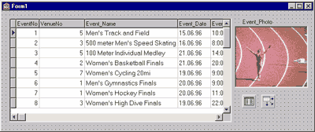
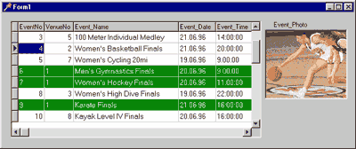
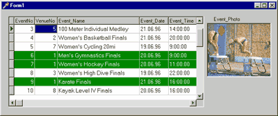
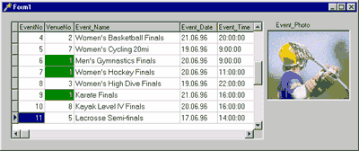
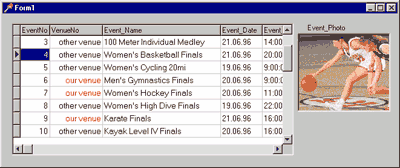
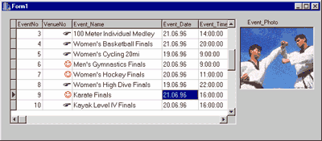
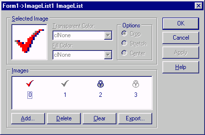
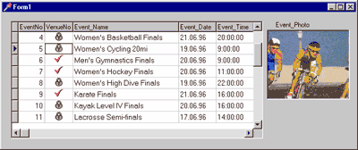

Что можно поместить в TDBGrid?
==============================

::: {.date}
01.01.2007
:::

Что можно поместить в DBGrid

Наталия Елманова
Компьютер Пресс - CD, 1999, N 5

© Copyright N.Elmanova & ComputerPress Magazine.

Нередко при разработке приложений, использующих табличный вывод данных,
требуется отобразить те или иные строки таблиц нестандартным образом,
например, с целью привлечения внимания пользователя к этим строкам. В
данной статье содержатся некоторые советы, касающиеся нестандартного
отображения данных в компоненте TDBGrid.

Совет 12. Как изменить цвет строки в TDBGrid

Предположим, нам требуется изменить атрибуты текста и фона строки в
компоненте TDBGrid, если значение какого-либо поля удовлетворяет заранее
заданному условию. Для этой цели принято использовать обработчик события
OnDrawColumnCell этого компонента. Отметим, что возможности,
предоставляемые при его использовании, весьма разнообразны.

Рассмотрим простейшее приложение с TDBGrid, содержащее один компонент
TTable, один компонент TDataSource и один компонент TDBGrid: Установим
значения их свойств в соответствии с приведенной ниже таблицей:

| Компонент | Свойство | Значение |
| ------ | -------- | ------- |
| Table1 | DatabaseName | BCDEMOS (или DBDEMOS) |
| Table1 | TableName | events.db |
| Table1 | Active | true |
| DataSource1 | DataSet | Table1 |
| DBGrid1 | DataSource DataSource1 |

:::{.center}
  
Рис. 1 Тестовое приложение на этапе проектирования
:::

Обычно для перерисовки изображения в ячейках используется метод
OnDrawColumnCell.

Его параметр Rect - структура, описывающая занимаемый ячейкой
прямоугольник, параметр Column - колонка DBGrid, в которой следует
изменить способ рисования изображения. Для вывода текста используется
метод TextOut свойства Canvas компонента TDBGrid.

Предположим, нам нужно изменить цвет текста и фона строки в зависимости
от значения какого-либо поля (например, VenueNo). Создадим обработчик
события OnDrawColumnCell компонента DBGrid1.

    procedure TForm1.DBGrid1DrawColumnCell(Sender: TObject; const Rect: TRect;
      DataCol: Integer; Column: TColumn; State: TGridDrawState);
    begin
      if (Table1.FieldByName('VenueNo').Value=1) then begin
        with  DBGrid1.Canvas do begin
          Brush.Color:=clGreen;
          Font.Color:=clWhite;
          FillRect(Rect);
          TextOut(Rect.Left+2,Rect.Top+2,Column.Field.Text);
        end;
      end;
    end;

В результате на этапе выполнения при отображении строк, в которых
значение поля VenueNo равно 1, фон ячеек будет окрашен в зеленый цвет, а
текст будет выведен белым цветом.

:::{.center}
  
Рис. 2 Изменение цвета фона и шрифта в строках со значением поля
VenueNo=1 на этапе выполнения.
:::

При выводе выделенных строк все данные в ячейках оказались выровненными
по левому краю. Если мы хотим более корректно отобразить выравнивание
текста в колонке, следует слегка модифицировать наш код, учтя значение
свойства Alignment текущей (то есть рисуемой в данный момент) колонки:

    procedure TForm1.DBGrid1DrawColumnCell(Sender: TObject; const Rect: TRect;
      DataCol: Integer; Column: TColumn; State: TGridDrawState);
    begin
    if (Table1.FieldByName('VenueNo').Value=1) then begin
    with  DBGrid1.Canvas do begin
    Brush.Color:=clGreen;
    Font.Color:=clWhite;
    FillRect(Rect);
    if (Column.Alignment=taRightJustify) then
     TextOut(Rect.Right - 2 - TextWidth(Column.Field.Text),
      Rect.Top+2,Column.Field.Text)
    else
     TextOut(Rect.Left+2,Rect.Top+2,Column.Field.Text);
    end;
    end;
    end;

В этом случае выравнивание текста в колонках совпадает с выравниванием
столбцов.

Отметим, что величина смещения (в данном случае 2 пиксела), вообще
говоря, зависит от гарнитуры и размера шрифта, используемого в данной
колонке, и должна подбираться индивидуально.

:::{.center}
  
Рис. 3 Изменение цвета с учетом выравнивания текста в колонках.
:::

Если необходимо отобразить нестандартным образом не всю строку, а только
некоторые ячейки, следует проанализировать имя поля, отображаемого в
данной колонке, как в приведенном ниже обработчике событий.

    procedure TForm1.DBGrid1DrawColumnCell(Sender: TObject; const Rect: TRect;
      DataCol: Integer; Column: TColumn; State: TGridDrawState);
    begin
      if (Table1.FieldByName('VenueNo').Value=1) and
         (Column.FieldName='VenueNo')  then begin
        with  DBGrid1.Canvas do begin
          Brush.Color:=clGreen;
          Font.Color:=clWhite;
          FillRect(Rect);
          TextOut(Rect.Right - 2 - TextWidth(Column.Field.Text),
            Rect.Top+2,Column.Field.Text)
        end;
      end;
    end;

В результате выделенными оказываются только ячейки, для которых
выполняются выбранные нами условия:

:::{.center}
  
Рис. 4 Выделение цветом данных в одной колонке.
:::

Совет 13. Как заменить данные в столбце компонента TDBGrid

Нередко в колонке DBGrid нужно вывести не реальное значение, хранящееся
в поле соответствующей таблицы, а другие данные, соответствующие
имеющимся (например, символьную строку вместо ее числового кода). В этом
случае также используется метод TextOut свойства Canvas компонента
TDBGrid:

    procedure TForm1.DBGrid1DrawColumnCell(Sender: TObject; const Rect: TRect;
      DataCol: Integer; Column: TColumn; State: TGridDrawState);
    begin
      if  (Column.FieldName='VenueNo')  then begin
        with  DBGrid1.Canvas do begin
          Brush.Color:=clWhite;
          FillRect(Rect);
          if (Table1.FieldByName('VenueNo').Value=1) then begin
            Font.Color:=clRed;
            TextOut(Rect.Right - 2 - DBGrid1.Canvas.TextWidth('our venue'),
              Rect.Top+2,'our venue');
          end else begin
            TextOut(Rect.Right - 2 - DBGrid1.Canvas.TextWidth('other venue'),
              Rect.Top+2,'other venue');
          end;
        end;
      end;
    end;

:::{.center}
  
Рис. 5 Замена данных в колонке другими значениями.
:::

Еще один пример - использование значков из шрифтов Windings или Webdings
в качестве подставляемой строки.

    procedure TForm1.DBGrid1DrawColumnCell(Sender: TObject; const Rect: TRect;
      DataCol: Integer; Column: TColumn; State: TGridDrawState);
    begin
      if  (Column.FieldName='VenueNo')  then begin
        with  DBGrid1.Canvas do begin
          Brush.Color:=clWhite;
          FillRect(Rect);
          Font.Name:='Wingdings';
          Font.Size:=-14;
          if (Table1.FieldByName('VenueNo').Value=1) then begin
            Font.Color:=clRed;
            TextOut(Rect.Right-2-
              DBGrid1.Canvas.TextWidth('J'),
              Rect.Top+1,'J');
          end else begin
            Font.Color:=clBlack;
            TextOut(Rect.Right - 2 - DBGrid1.Canvas.TextWidth('F'),
              Rect.Top+1,'F');
          end;
        end;
      end;
    end;

:::{.center}
  
Рис. 6 Использование символов из шрифта Windings для выделения нужных
значений в колонке.
:::

Совет 14. Как поместить графическое изображение в TDBGrid

Использование свойства Canvas компонента TDBGrid в методе
OnDrawColumnCell позволяет не только выводить в ячейке текст методом
TextOut, но и размещать в ячейках графические изображения. В этом случае
используется метод Draw свойства Canvas.

Модифицируем наш пример, добавив на форму компонент TImageList и
поместив в него несколько изображений.

:::{.center}
  
Рис. 7 Компонент TImageLis с изображениями, помещаемыми в TDBGrid
:::

Модифицируем код нашего приложения:

    procedure TForm1.DBGrid1DrawColumnCell(Sender: TObject; const Rect: TRect;
      DataCol: Integer; Column: TColumn; State: TGridDrawState);
    var Im1: TBitmap;
    begin
      Im1:=TBitmap.Create;
      if  (Column.FieldName='VenueNo' ) then begin
        with  DBGrid1.Canvas do begin
          Brush.Color:=clWhite;
          FillRect(Rect);
          if (Table1.FieldByName('VenueNo').Value=1)
          then begin
            ImageList1.GetBitmap(0,Im1);
          end else begin
            ImageList1.GetBitmap(2,Im1);
          end;
          Draw(round((Rect.Left+Rect.Right-Im1.Width)/2),Rect.Top,Im1);
        end;
      end;
    end;

Теперь в TDBGrid в колонке VenueNo находятся графические изображения.

:::{.center}
  
Рис. 8 Вывод графических изображений в колонке
:::

Взято из [http://delphi.chertenok.ru](https://delphi.chertenok.ru)
