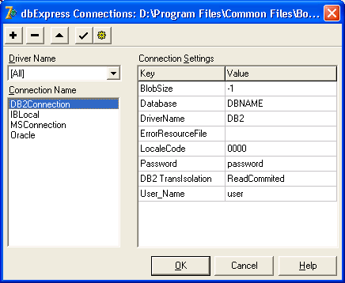

Соединение с сервером баз данных
================================

Для создания соединения с сервером в рамках технологии dbExpress
приложение должно использовать компонент TSQLConnection. Это
обязательный компонент, все остальные компоненты связаны с ним и
используют его для получения данных.

После переноса этого компонента в модуль данных или на форму необходимо
выбрать тип сервера и настроить параметры соединения.

**property ConnectionName: string;**
позволяет выбрать из выпадающего списка конкретное настроенное
соединение. По умолчанию разработчику доступно по одному настроенному
соединению для каждого сервера БД. После выбора соединения автоматически
устанавливаются значения свойств:

**property DriverName: string;**
определяет используемый драйвер; 

**property LibraryName: string;**
задает динамическую библиотеку драйвера dbExpress;

**property VendorLib: string;**
определяет динамическую библиотеку
клиентского ПО сервера 

**property Params: TStrings;**
список этого свойства содержит настройки для
выбранного соединения.

При необходимости все перечисленные свойства можно установить
дополнительно.

Разработчик может дополнять и изменять список настроенных соединений.
Для этого используется специализированный Редактор соединений dbExpress
Connections (рис. 17.1). Он открывается после двойного щелчка на
компоненте TSQLConnection или выбора команды Edit Connection Properties
из всплывающего меню компонента.

  
Рис. 17.1. Окно редактора настроенных соединений компонента TSQLConnection

В списке слева располагаются существующие соединения.
В правой части для выбранного соединения отображаются текущие настройки.
При помощи кнопок на Панели инструментов можно создавать, переименовывать
и удалять соединения. Настройки также можно редактировать.

Список соединений в левой части соответствует списку выбора свойства
ConnectionName в Инспекторе объектов. Настройки соединения из правой
части отображаютсяв свойствее Params.

Настроенные соединения и их параметры сохраняются в файле
\\Borland Shared\\DBExpress\\dbxconnections.ini.

**Примечание**

> При установке Delphi 7 поверх Delphi 6 сведения 
> о соединениях из старого файла dbxconnections.ini добавляются в новый.

Конкретные значения настроек соединений зависят от используемого сервера
БД и требований приложения (табл. 17.2).

Таблица 17.2. Настройка соединения dbExpress

| Параметр| Значение|
|--------|--------|
| **Общие настройки**|
| BlobSize| Задает ограничение на объем пакета данных для данных BLOB |
| DriverName| Имя драйвера |
| ErrorResourceFile| Файл сообщений об ошибках |
| LocaleCode| Код локализации, определяющий влияние национальных символов на сортировку данных |
| User Name| Имя пользователя |
| Password| Пароль |
| **DB2**|
| Database| Имя клиентского ядра |
| DB2 Translsolation| Уровень изоляции транзакций |
| **Informix**|
| HostName| Имя компьютера, на котором работает сервер Informix |
| Informix Translsolation| Уровень изоляции транзакции |
| Trim Char| Определяет, нужно ли удалять из строковых значений полей пробелы, дополняющие значение до полной строки, заданной размером поля данных |
| **Interbase**|
| CommitRetain| Задает поведение курсора по завершении транзакции. При значении True курсор обновляется, иначе — удаляется |
| Database| Имя файла базы данных (файл GDB) |
| InterBase Translsolation| Уровень изоляции транзакции |
| RoleName| Роль пользователя |
| SQLDialect| Используемый диалект SQL. Для IntreBase 5 возможно только одно значение -1 |
| Trim Char| Определяет, нужно ли удалять из строковых значений полей пробелы, дополняющие значение до полной строки, заданной размером поля данных |
| WaitOnLocks| Разрешение на ожидание занятых ресурсов |
| **Microsoft SQL Server 2000**|
| Database| Имя базы данных |
| HostName| Имя компьютера, на котором работает сервер MS SQL Server 2000 |
| MSSQL Translsolation| Уровень изоляции транзакции |
| OS Autenification| Использование учетной записи текущего пользователя операционной системы (домена или Active Directory) при доступе к ресурсам сервера |
| **MySQL**|
| Database| Имя базы данных |
| HostName| Имя компьютера, на котором работает сервер MySQL |
| **Oracle**|
| AutoCommit| Флаг завершения транзакции. Устанавливается только сервером |
| BlockingMode| Задает режим завершения запроса. При значении True соединение дожидается окончания запроса (синхронный режим), иначе — начинает выполнение следующего (асинхронный режим) |
| Database| Запись базы данных в файле TNSNames.ora|
| Multiple Transaction| Поддержка управлением несколькими транзакциями в одной сессии |
| Oracle Translsolation| Уровень изоляции транзакций |
| OS Autenification| Использование учетной записи текущего пользователя операционной системы (домена или Active Directory) при доступе к ресурсам сервера |
| Trim Char | Определяет, нужно ли удалять из строковых значений полей пробелы, дополняющие значение до полной строки, заданной размером поля данных |

После выбора настроенного соединения или выбора типа сервера и
настройки параметров соединения компонент TSQLConnection готов к работе.

**property Connected: Boolean;**

открывает соединение с сервером при значении True. Аналогичную операцию
выполняет метод

**procedure Open;**

После открытия соединения все компоненты dbExpress, инкапсулирующие
наборы данных и связанные с открытым компонентом TSQLConnection,
получают доступ к базе данных.

Соединение закрывается тем же свойством connected или методом
**procedure Close;**

При открытии и закрытии соединения разработчик может использовать
обработчики событий

- property BeforeConnect: TNotifyEvent; 
- property AfterConnect: TNotifyEvent;
- property BeforeDisconnect: TNotifyEvent; 
- property AfterDisconnect: TNotifyEvent;

Например, на стороне клиента можно организовать проверку пользователя
приложения:

    procedure TForml.MyConnectionBeforeConnect(Sender: TObject);
    begin 
      if MyConnection.Params.Values['User_Name']) <> DefaultUser then 
        begin 
          MessageDlg('Wrong user name', mtError, [mbOK], 0);
          Abort;  
        end;
    end; 

**property LoginPrompt: Boolean;**
определяет, нужно ли отображать диалог авторизации пользователя перед
открытием соединения.

О текущем состоянии соединения можно судить по значению свойства

    TConnectionState = (csStateClosed, csStateOpen, csStateConnecting,
             csStateExecuting, csStateFetching, csStateDisconnecting);
    property ConnectionState: TConnectionState;

Параметры соединения можно настраивать на этапе разработки в Инспекторе
объектов или Редакторе соединений (см. рис. 17.1).

Также это можно
сделать и непосредственно перед открытием соединения, используя свойство
Params или метод

    procedure LoadParamsFromlniFile(AFileName : String = '');

который загружает заранее подготовленные параметры из INI-файла.

Проверить успешность этой операции можно при помощи свойства

    property Params Loaded: Boolean;

значение True которого сигнализирует об успехе загрузки.

    procedure TForml.StartBtnClickfSender: TObject); 
    begin 
      if MyConnection.Params.Values['DriverName'] = '' then 
        MyConnection.LoadParamsFromlniFile('c:\Temp\dbxalarmconnections.ini'); 
      if MyConnection.ParamsLoaded then 
        try 
          MyConnection.Open;
        except 
          MessageDlgt'Database connection error', mtError, [mbOK], 0); 
        end;
    end; 
