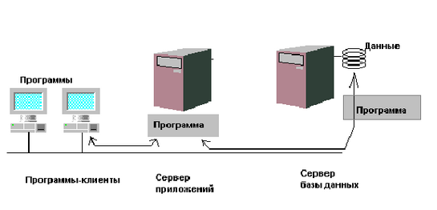

Архитектура с использованием сервера приложений (трехзвенная архитектура)
=========================================================================

::: {.date}
01.01.2007
:::

Архитектура с использованием сервера приложений (трехзвенная
архитектура)

Классическая архитектура клиент-сервер, как мы рассмотрели выше,
подразумевает, что есть две программы. Первая, сервер баз данных, следит
за сохранностью данных, размещает их на внешнем носителе и исполняет
приходящие запросы на поиск и обновление данных. Вторая программа,
программа-клиент, обеспечивает интерфейс с пользователем, формирует
запросы к серверу базы данных, отсылает их и получает нужные данные,
которые, скорее всего, показывает пользователю. Программа-клиент и
программа-сервер могут физически находиться как на одном компьютере, так
и на разных.

Использование архитектуры клиент-сервер позволило ускорить доступ к
данным (сервер не занимается интерфейсом и логикой приложений), строить
гетерогенные сети (клиент и сервер общаются по сетевому протоколу, и
могут функционировать на совершенно различных платформах). Но у
архитектуры клиент-сервер есть и отрицательные стороны (ничто не бывает
задаром!).

В последнее время стал возникать синдром "толстого клиента". Это
означает, что клиентское приложение имеет размер, сравнимый или даже
превышающий размер программы-сервера базы данных. Такое приложение
зачастую требует от компьютера-клиента очень больших ресурсов. А
клиентских мест в реальной информационной системе, как правило,
достаточно много. Поэтому общие затраты на оборудование (память, диски)
для компьютеров-клиентов могут быть неоправданно большими.

С другой стороны, программы-клиенты в одной информационной системе с
большой вероятностью содержат повторяющиеся куски кода. Например, если
используемая Вами информационная система учитывает налоги, то она должна
считать сумму налога на всех клиентах одинаково. Таким образом,
получаем, что один и тот же код многократно продублирован и на каждом из
компьютеров-клиентов занимает некоторые, весьма ощутимые ресурсы.

При некоторых видах обработки информации, хранящейся в базе данных,
требуется передавать по сети большие объемы информации. Например, в базе
данных хранится информация о миллионе платежных поручений.
Правительством было принято постановление о изменении налогов. Вам надо
пересчитать налог на каждый документ. Если это реализовать на клиенте,
то тогда по сети потребуется передать практически все данные и выигрыша
архитектура клиент-сервер не даст (передача данных по сети одно из самых
узких мест в информационных системах).

Решением для данной проблемы могло быть проведение обработки
непосредственно на том же компьютере, где хранятся данные. Серверы баз
данных Informix поддерживают механизм хранимых процедур. Хранимые
процедуры принадлежат, хранятся и исполняются на сервере. Для их
программирования используется специальный язык - язык хранимых процедур
SPL. Во многих случаях проще бы было разрабатывать алгоритм обработки на
том же языке, в той же системе программирования, что и всю клиентскую
часть, но исполнять этот алгоритм не на машине- клиенте, а на машине,
где находится сервер баз данных.

В некоторых системе разработки приложений, например в Informix-NewEra,
есть средства создания сервера приложений. С помощью этих библиотек
можно разбивать свое клиентское приложение на две части. Одна часть
будет традиционным клиентом и находится на компьютере-клиенте, а вторая
часть, сервер-приложений, находится на другом компьютере, возможно как
раз на том, где расположен сервер базы данных. Таким образом, используя
сервер приложений можно смягчить или свести на нет недостатки
традиционной архитектру "клиентсервер".

Итак, идея сервера приложений заключается в разбиении приложения на две
части - собственно клиента и сервера данного приложения. Причем сервер
приложений может быть один на много приложений. Клиенты общаются с
сервером приложений (или с серверами приложений, никто не запрещает
иметь несколько серверов приложений).  Клиенты посылают серверу
приложений запросы, а получают ответы. Клиенты могут обратиться и
непосредственно к серверу базы данных за теми или иными данными.
Обращение за данными к серверу базы данных может производить и сервер
приложений.

Таким образом, имеем три типа взаимодействующих компонент - сервер базы
данных, приложение (клиент) и сервер приложения. Они могут
взаимодействовать друг с другом по следующей
схеме:

:::{.center}
  
Рис. 1.5. Многопользовательская информационная система на основе
архитектуры c "клиентсервер" с сервером приложений.
:::

Именно по причине наличия трех компонент (приложение, сервер приложения,
сервер баз данных), подобная архитектура называется трехсвязной
(английский термин three-tier architecture).

 

Грачев А.Ю.                Введение в СУБД Informix
