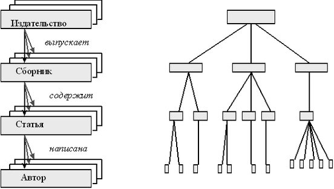
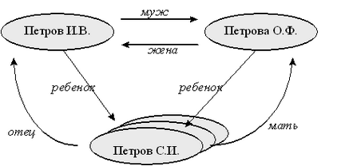
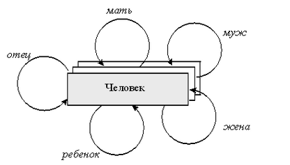
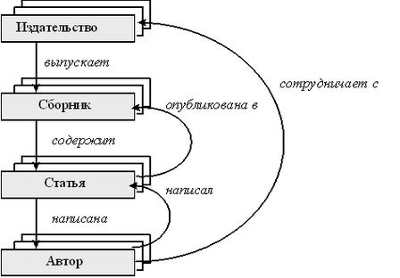

Модели данных
=============

::: {.date}
01.01.2007
:::

Модели данных

Уровни абстракции данных. Физический, логический, концептуальный уровни.
Модели данных. Основные идеи иерархической, сетевой, реляционной и
объектно-реляционной моделей.

2.1. Уровни восприятия данных

При работе с СУБД разные люди и разные программы, запускаемые этими
людьми, видят СУБД по-разному. Конечный пользователь работает в каком-то
приложении и, скорее всего, ничего не знает о внутренней структуре.
Программа, которую использует этот пользователь и, соответственно,
программист, написавший эту программу, видят и используют ту часть базы
данных, которую им разрешено видеть.  Администратор, позволяющий тем или
иным пользователям видеть те или иные данные, видит всю схему базы
данных. Группа программистов, разработавшая ядро исполнителя запросов
(SQL-сервер), и предоставившая администратору возможность создавать
схему базу данных, реализовала отображение базы данных на внешние
устройства и в память.

В соответствии с этим  выделяют три уровня представления данных.

Уровень конечного пользователя - прикладной (пользовательский) уровень.
В некотором смысле - это самый главный уровень, именно на этом уровне
работает пользователь, то есть человек, для которого и пишется
программа. Пользователь видит базу данных как набор некоторых
взаимосвязанных полей в форме, как набор меню и команд, выполняя которые
он решает его собственную задачу, например, резервирует два билета до
Сочи на 20 июля этого года.

Уровень программиста и администратора - концептуальный уровень. На этом
уровне работает программист, создающий прикладные программы и
администратор, разрабатывающий структуру (схему) базы данных.
Админимстратор видит всю схему, ему доступна вся информация. Программист
может видеть только часть схемы. В принципе, его видение является
некоторым подмножеством того, что видит администратор.

Уровень реализации - физический уровень. На физическом уровне
определяется, как хранятся данные и как осуществляется доступ к ним.
Например, сервер СУБД реализует в внутри себя именно этот уровень. Как
правило, физическое представление не только скрыто от посторонних глаз,
но и является частной, закрытой информацией фирмыпроизводителя СУБД.

-------------¬
¦       СУБД ¦
L-------------
\|            \|
\|           
------------------T--------------T---------------¬
\|            ¦   администратор ¦ программист  ¦ кон. польз.   ¦
\|           
L-----------------+--------------+---------------
\|            \|                      \|:::::::::::::::::::::::::\|
-------------T----------------------T-------------------------¬
¦ физический ¦ концептуальный       ¦       прикладной        ¦
L------------+---------------------
+--------------------------
                       \|           \|:::::::::::::::::::::::::\|
           
-----------T------------------------T------------¬
            ¦работа со ¦ создание программ на   ¦ работа с   ¦
            ¦схемой    ¦ основе схемы           ¦ прикладным ¦
            ¦базы      ¦                        \| программам ¦

           
L----------+------------------------+-------------

Рис. 2.1. Уровни восприятия базы данных.

Реализацией физического уровня, как правило, занимаются
специализированные фирмы, такие как Informix Software, Software AG, CA,
Oracle Corporation и т.д. Реализацией концептуального и
пользовательского уровней занимаются либо программисткие отделы
предприятий, либо специализированные фирмы.

К логическому уровню восприятия относится понятие "модель данных",
которое было вкратце затронуто во Введении. Если администратор описывает
схему в терминах ссылок и записей и способов поиска, то это - сетевая
модель, если в терминах отношений - реляционная. Понятие модели
определяет именно доступные, видимые возможности. В принципе, например,
для реляционной СУБД внутри может использоваться сетевое представление.
Является или нет сервер реляционным, определяется тем, какие базы можно
делать с помощью данного сервера. Расссмотрим основные модели более
подробно.

2.2. Иерархическая модель данных

Иерархические, или древовидные, структуры данных разработаны и
используются достаточно давно. Например, большинство методов
индексирования базируются именно на древовидных структурах данных.
Иерархическая модель данных близка по своей идее к иерархической
структуре данных. Но модель описывает не конкретные методы работы и
манипулирования ссылками, а способ логического представления данных, то,
какими терминами оперирует проектировщик структуры базы данных, когда
отражает реальные зависимости с помощью имеющихся в СУБД механизмов.

Иерархическая модель позволяет строить иерархию элементов (автор просит
прощения у читателей, уважающих чичстоту русского языка, за такой
оборот). То есть у каждого элемента может быть несколько "наследников" и
существует один "родитель". Для каждого уровня связи вводится
интерпретация, зависящая от предметной области и описывающая
взаимоотношение между "родителями" и "наследниками". Каждый элемент
представляется с помощью записи. Структура данных, обычно используемая
для представления этой записи об элементе, обычно содержит некоторые
атрибуты, характеристики каждого элемента.

Попробуем представить себе базу данных для описания тематических
сборников по некоторой теме. Прежде всего, выделим уровни иерархии.
Первый уровень - это издательства. Каждое издательство характеризуется
своим названием, юридическим адресом, номером счета в банке. Каждое
издательство выпускает несколько сборников. То есть издательство
является "родителем" для сборника и связано с сборником соотношением
"издает" (разработчик, естественно, вправе выбрать и другой синоним для
данной связи, например "публикует", "печатает" и т.д.). Для каждого
сборника появляются такие атрибуты, как размер, периодичность, цена,
ответственный редактор, корректор и т.д. В каждом сборнике есть
несколько статей (хотя бы, одна). То есть сборник и статья связаны
соотношением "включает". Далее, у каждой статьи есть название, авторы.
Авторы представляются отдельным элементом и образуют следующий уровень
иерархии. Каждый автор характеризуется фамилией, именем, отчеством,
гонораром и т.д. Статьи связаны с автором соотношением "написаны".
Графическое представление этого примера приведено на Рис.2.2. Элементы
нарисованы прямоугольниками, их названия даны обычным шрифтом. Связи
нарисованы стрелками и их названия даны курсивом. Обращаем внимание
читателей, что атрибуты для каждого элемента на этой схеме не показаны -
они являются частью элемента данных.

:::{.center}
  
Рис. 2.2. Графическое представление иерархической модели данных (справа
пример какой-то конкретной базы данных).
:::

Что касается способов описания конкретных схем, базирующихся на
иерархической модели, или языков манипулирования данными, работающими с
такой моделью, то они зависят от конкретной реализации. Например, в
достаточно давно разработанной системе IMS фирмы IBM (эта система
является классическим примером иерархической СУБД) схема для нашего
примера будет описана следующим образом):

DBD  NAME  = ТЕМАТИЧЕСКИЕ\_СБОРНИКИ
SEGM NAME  = ИЗДАТЕЛЬСТВО
    FIELD NAME = НАЗВАНИЕ
    FIELD NAME = АДРЕС
    FIELD NAME = СЧЕТ
SEGM NAME  = СБОРНИК, PARENT = ИЗДАТЕЛЬСТВО
    FIELD NAME = НАЗВАНИЕ
    FIELD NAME = ПЕРИОДИЧНОСТЬ
    FIELD NAME = ЦЕНА
    FIELD NAME = ОТВЕТСТВЕННЫЙ\_РЕДАКТОР
SEGM NAME  = СТАТЬЯ, PARENT = СБОРНИК
    FIELD NAME = НАЗВАНИЕ
SEGM NAME  = АВТОР, PARENT = СТАТЬЯ
    FIELD NAME = ФИО

    FIELD NAME = ГОНОРАР

В данном примере мы не именовали явно связи, которые существуют между
разными элементами (в терминологии IMS для нашего понятия "элемент"
используется термин "сегмент"). Язык доступа к данным, который
поддерживает IMS позволяет обращаться к элементам напрямую, зная
название и, возможно, дополнительное условие. Например, можно
распечатать названия всех сборников, ответственным редактором которых
является некто по фамилии Буквоедов:

    GET UNIQUE СБОРНИК WHERE ОТВЕТСТВЕННЫЙ_РЕДАКТОР = “БУКВОЕДОВ”
    /* получили первый сборник */
    while true do
            print СБОРНИК.НАЗВАНИЕ
            /* переходим к следующему сборнику */
            GET NEXT СБОРНИК WHERE ОТВЕТСТВЕННЫЙ_РЕДАКТОР = “БУКВОЕДОВ”
    end while

 

Выбрав один из сборников в предыдущем примере, можно спуститься "вниз"
по иерархии и, например, просмотреть все статьи из выбранного сборника.
Для этого существует оператор "движения вниз по иерархии" GET NEXT
WITHIN PARENT. Этот оператор позволяет перебрать все элементы-потомки,
принадлежащие выбранному элементу. Предположим, мы хотим напечатать не
только названия сборников, но и входящие в них статьи:

    GET UNIQUE СБОРНИК WHERE ОТВЕТСТВЕННЫЙ_РЕДАКТОР = “БУКВОЕДОВ”
    /* выбрали первый сборник */
    while true do
            print “Сборник ”, СБОРНИК.НАЗВАНИЕ
            GET NEXT WITHIN PARENT СТАТЬЯ
            while true do
                    print СТАТЬЯ.НАЗВАНИЕ
                    GET NEXT WITHIN PARENT СТАТЬЯ
            end while
            GET NEXT СБОРНИК WHERE ОТВЕТСТВЕННЫЙ_РЕДАКТОР = “БУКВОЕДОВ”
    end while

 

У иерархических СУБД есть достоинства и недостатки. К достоинствам
относится возможность реализовать фантастически быстрый поиск нужных
значений, когда условия запроса соответствуют иерархии в схеме базе
данных. Например, приведенный выше запрос отработает очень быстро. С
другой стороны, если запрос не соответствует имеющейся иерархии, то и
его программирование, и его исполнение, потребуют значительных усилий.
Например, попытки реализовать запрос типа "в скольких сборниках статей
опубликовал свои статьи господин Плагиаторов" может оказаться весьма
трудной задачей (мы можем искать в направлении от статьи к автору, но не
наоборот).

Другим недостатком иерархической модели является сложность внесения в
нее изменений. Если, по каким-то причинам изменились условия задачи, и
модель предметной области перестала быть иерархической (например, в
нашем примере, мы хотим иметь не только зависимость авторов от статьи,
но и статей от автора), то приведение схемы базы данных в соответствие
предметной области становится нетривиальной задачей.

Недостатки иерархической модели проистекают от того, что данная модель
слишком жесткая. Иерархическая модель очень хорошо подходит для
устоявшихся предметных областей с четкими зависимости
"родитель-потомок", то есть к моделям, где есть четкая субординация
между понятиями. Там же, где эти условия выполнены, проявляются
достоинства иерархической модели - очень быстрая скорость поиска.

2.3. Сетевая модель данных

Сетевая модель данных является развитием иерархической модеи (впрочем,
некоторые авторы считают, что иерархическая модель есть частный случай
сетевой). В любом случае, по своим базовым концепциям они очень похожи.
В сетевой модели, так же как и в иерархической модели, есть понятие
элемента данных и связи, которая может быть именована. Главное отличие
сетевой модели от иерархической заключается в том, что к каждому
элементу может идти связь не от одного элемента ("родителя"), а от
нескольких.

Например, генеалогическое дерево, построенное только по мужской линии
(или, что не существенно, только по материнской), является древовидной,
иерархической структурой - у каждого человека (элемента, по нашей
терминологии для баз данных), есть только один родитель. Если же
включать в генеалогическое дерево всех родителей, то такое дерево с
точки зрения структур данных будет уже не деревом, а сетью:

:::{.center}
  
Рис. 2.3. Представление фрагмента генеалогического дерева  на основе
сетевой модели данных.
:::

На данном рисунке представлены элементы только одно класса - описание
людей, и на этом множестве для некоторых конкретных пар людей существуют
связи, именуемые "муж", "жена", "отец", "мать", "ребенок". Поэтому с
точки зрения графического представления схемы этой базы данных (а не
конкретных данных о семье Петровых), можно использовать следующий
рисунок:

:::{.center}
  
Рис. 2.4. Представление схемы базы данных генеалогического дерева на
основе сетевой модели данных.
:::

Итак, сетевая модель данных основывается на понятии элемента данных и
связей, задающих логику взаимоотношениями между данными. Связи от
каждого элемента могут быть направлены на произвольное колическтво
других элементов. На каждый элемент могут быть направлены связи от
произвольного числа других элементов. Каждый элемент данных описывает
некоторое понятие из предметной области и характеризуется некоторыми
атрибутами. Для каждого элемента данных (напомним, что элемент - это
часть схемы) в реальной базе данных может существовать несколько
экземпляров этого элемента. Соответственно, с каждым конкретным
экземпляром по конкретной связи может быть связано разное число
экземпляров другого элемента (например, у каждого человека разное число
детей), но число видов связи одинаково для всех экземпляров одного
элемента.

Если мы вернемся к нашему примеру про издательства тематических
сборников (этот пример рассматривался в разделе про иерархические СУБД)
и попытаемся расширить его, для того чтобы он более полно соответствовал
реальным взаимоотношениям, то схема базы данных будет выглядеть
следующим образом:

:::{.center}
  
Рис. 2.5. Представление расширенной схемы базы данных для описания
издательств на основе сетевой модели.
:::

Существует большое число удачных реализаций сетевой модели данных. В
каждой из реализации, как правило, используется свой собственный язык
для описания схемы базы данных и доступа к данным. Рассморим в качестве
примера язык CODASYL. Этот язык) был разработан специальной ассоциацией
и являлся попыткой стандартизировать язык для работы с сетевой моделью
данных. Данный язык является классическим примером работы с сетевыми
моделями данных. Описание схемы для представления нашего примера со
сборниками будет выглядеть примерно так:

    RECORD NAME IS ИЗДАТЕЛЬСТВО
    01 НАЗВАНИЕ TYPE IS CHARACTER 20
    01 АДРЕС TYPE IS CHARACTER 30
    01 СЧЕТ IS PICTURE "9999999"
    RECORD IS СБОРНИК
    01 НАЗВАНИЕ TYPE IS CHARACTER 20
    01 FIELD NAME = ПЕРИОДИЧНОСТЬ
    01 FIELD NAME = ЦЕНА
    01 ОТВЕТСТВЕННЫЙ_РЕДАКТОР TYPE IS CHARACTER 20
    RECORD IS СТАТЬЯ
    01 НАЗВАНИЕ TYPE IS CHARACTER 20
    RECORD IS АВТОР
    01 ФИО TYPE IS CHARACTER 20
    
    01 ГОНОРАР IS FIXED
    
    SET NAME IS ВЫПУСКАЕТ
       OWNER IS ИЗДАТЕЛЬСТВО
    
       MEMBER IS СБОРНИК
    
    SET NAME IS СОДЕРЖИТ
       OWNER IS СБОРНИК
       MEMBER IS СТАТЬЯ
    
    . . . . . . . . . . . . . . .

К достоинствам сетевой модели относится очень высокая скорость поиска и
возможность адекватно представлять многие задачи в самых разных
предметных областях. Высокая скорость поиска основывается на
классическом способе физической реализации сетевой модели - на основе
списков. Более подробно о способах физической реализации сетевых СУБД
можно почитать в монографиях Дж.Мартина и Дж.Ульмана. Можно обрнатиться
и к технической документации доступных сетевых СУБД.

Главным недостатком сетевой модели, как, впрочем, и иерархичесокй,
является ее жесткость. Поиск данных, доступ к ним, возможен только по
тем связям, которые реально существуют в данной конкретной модели. В
нашем примере с издательствами очень легко и быстро можно найти список
всех статей, выпущенных издательством "Бухгалтерия и спорт", но задача
поиска издательств, в которых была опубликована статья "Влияние колец
Сатурна на своевременную сдачу норм ГТО" будет требовать гораздо больших
усилий. Причиной для подобных проблем, по мнению Е.Кодда), является
"навигационный" характер сетевых СУБД. Другими словами, при поиске
данных сетевая СУБД требует перемещаться только по существующим, заранее
предусмотренным связям.

2.4. Реляционная модель данных

История реляционных СУБД ведет свое начало с конца 60-х, когда
одновремнно несколькими авторами были выдвинуты предложения об
использовании теоретико-множественных операторов для организации доступа
к данным. Наиболее известными являются работы Е. Кодда. Затем была
экспериментальная система управления базми данных System R и
использованный в ней язык SEQUEL, который можно считать непосредственным
предшественником языка SQL. В настоящее время именно язык SQL является и
де-юро, и де-факто стандартом для работы с реляционными СУБД. Например,
семейство серверов реляционных баз данных Informix Dynamic Server
поддерживают все эти стандарты и, кроме того, обеспечивают
дополнительные возможности.

Интересно отметить, что еще в 1980 году Джефри Ульман (J.D. Ullman)
писал в своей монографии "Основы систем баз данных" ("Principles of
Databse Systems"), что почти все существующие коммерческие системы баз
данных базируются либо на сетевой, либо на иерархической модели данных,
но не реляционной модели и "эта ситуация будет меняться медленно". Тем
не менее, уже в 1985 году ситуация резко поменялась - реляционные СУБД и
язык SQL стали очень популярными. А в начале 90-х годов реляционные СУБД
и язык SQL практически вытеснили все остальное с рынка СУБД. Причиной
для такого кардинального изменения ситуации стала разработка
эффективных, быстрых и надежных методов хранения и доступа к реляционным
данным.

Понятие отношения и таблицы

Давайте определим, что же такое реляционная СУБД и как в ней
представляются данные. Для реляционной СУБД выбрано представление на
основе математического понятия "отношение". Оно очень близко к
знакомым всем нам понятию "таблица". По-английски отношение называется
"relation", отсюда и название "реляционные СУБД (если называть такие
базы "относительными", то это может исказить смысл).

Разница между таблицей в привычном нам смысле и понятием отношения
заключается в том, что в отношении нет порядка - это, вообще говоря,
неупрядоченное множество записей. Это, конечно, не значит, что там
совсем нет никакого порядка, просто он не подвластен ни программисту, ни
администратору. Порядок определяется не отношением, а конкретной
выборкой из отношения. Из одного и того же отношения я могу выбрать
данные в порядке возрастания зарплаты, в алфавитном порядке фамилий и
т.д.

В дальнейшем мы будем использовать все же термин "таблица", а не
"отношение", так как этот термин понятен, привычен и самый
распространненый язык доступа к реляционным базам данных - язык SQL -
использует именно этот термин, хотя и понимает под ним
"неупорядоченные" таблицы.

Представление базы данных

Реляционная база данных - это набор информации, сгруппированной в одну
или несколько таблиц. Таблицу можно представить как двумерный массив,
или как набор записей одинаковой (для данной таблицы) структуры. Записи
еще называют рядами. Другими словами, таблица состоит из рядов и
столбцов. Число столбцов и записей для каждой таблицы теоретически
неограничено, хотя на практике ограничения, естественно, существуют.
Превысить ограничения хорошего сервера базы данных практически
невозможно - например, сервер баз данных Infomix DS позволяет иметь до
32 767 столбцов и до 8 миллиардов записей в каждой таблице.

    +-----+----+-----+-------+
    ¦     ¦    ¦     ¦       ¦ <-------- запись (ряд)
    ¦-----+----+-----+-------¦
    ¦     ¦XXXX¦     ¦       ¦ <-------- запись (ряд)
    ¦-----+-+--+-----+-------¦
    ¦       ¦                ¦
    ¦       L----------------+----> значение данного атрибута
    ¦  ...................   ¦      для данной записи
    ¦-----+----+-----+-------¦
    ¦     ¦    ¦     ¦       ¦
    +-----+----+-----+-------+
       ^   ^
       ¦   ¦
       ¦   L---------- столбец (атрибут, поле)
       L-------------- столбец (атрибут, поле)

    Рис. 2.6. Структура таблицы (отношения).

Каждый столбец имеет определенный тип, неизменный для каждой записи
внутри таблицы. Это может быть целое, дата, текст и т.д. Множество
возможных  значений конкретного столбца еще называют доменом. Важным для
реляционной модели является требование того, чтобы значение каждого
атрибута было атомарным, неделимым. Например нельзя в качестве значения
использовать массив целых. Если это правило не выполнено, то данную СУБД
уже нельзя называть реляционной).

Каждый ряд в таблице описывает некий отдельный объект, поля содержат
харктеристики, значения неких признаков этих объектов. В таблице,
которая, как мы уже отмечали, является набором записей, содержит записи,
объединенные по какому-то признаку.

Связь между таблицами

Итак, база данных - это набор таблиц. Как же обеспечить связь между
таблицами? Связь между таблицами существует на мысленном, логическом
уровне и определяется предметной областью. Практически связь между
таблицами устанавливается за счет логически связанных данных в разных
таблицах. В нашем примере с издательствами надо завести таблицу с
описанием издательств, таблицу с описанием сборников, и т.д.

Таблица "Издательства":

     
 +--------------------------+-----------------+
       ¦  Название                ¦ Адрес           ¦
     
 +--------------------------+-----------------+
       ¦ Бухгалтерия и спорт      ¦ Одесса, п/я 13  ¦
       ¦ Драконоведение           ¦ Энск, 5-е авеню ¦
       ¦ ....................     ¦ ............... ¦
     
 +--------------------------+-----------------+

 

Таблица "Сборники":

     
 --------------------------T------------------------+
       ¦ Сборник                 ¦  Издательство          ¦
     
 +-------------------------+------------------------+
       ¦ Финансы в спорте'97     ¦ Бухгалтерия и спорт    ¦
       ¦ Как уйти от налогов     ¦ Бухгалтерия и спорт    ¦
       ¦ Техника бега            ¦ Бухгалтерия и спорт    ¦
       ¦ Китайские бумажные змеи ¦ Драконоведение         ¦
       ¦ ......                  ¦ ....................   ¦

     
 L-------------------------+------------------------+

Рис. 2.7. Структура некоторых таблиц из базы данных для издательств
(отношения).

Теперь по названию сборника всегда можно определить название и адрес
издательства (или нескольких издательств), его выпустившего. Для этого
надо в таблице "Сборники" найти запись, у которой поле "Сборник"
есть требуемое название, из найденной запись взять название издательства
(атрибут "Издательство"), а потом в таблице "Издательства" найти
нужный адрес.

Таким образом, для того, чтобы связать две таблицы мы использовали не
жесткую, физически реализованную связь типа ссылки, а логическую, связь
через сравнение значение атрибутов, которую строили динамически, в
процессе поиска нужной информации.

Основным достоинством реляционных СУБД, обеспечившим таким СУБД высокую
популярность, является нефункциональность языков запроса, в частности,
языка SQL. Это означает, что Вы формулируете не то, КАК Вам надо найти
данные, а то, ЧТО Вам надо найти.

SQL - классическая язык доступа к реляционным СУБД

Практически все современные реляционные СУБД поддерживают Structured
Query Language (SQL) - язык структурированных запросов. Синтаксис и
семантика данного языка определены стандартами ISO, базирующимися на
соответствующих стандартах ANSI SQL 87, SQL-89 и SQL-92.

Описание схемы базы данных для нашего примера с издательствами будет
выглядеть примерно так:

    CREATE TABLE Издательства (
            Название CHAR(20),
             Адрес CHAR(40)
    )
    CREATE TABLE Сборники (
            Сборник CHAR(20),
             Издательство CHAR(20)
    )

 

Запрос, который определит адрес издательства (или издательств),
выпустивший сборник "Китайские воздушные змеи" будет выглядеть следующим
образом:

    SELECT Адрес FROM Издательства WHERE Название =
             (SELECT Издательство FROM Сборники WHERE
                     Сборник = “Китайские воздушные змеи”)

 

Достоинства и недостатки

Основным достоинством реляционных СУБД, обеспечившим таким СУБД высокую
популярность, является нефункциональность языка запросов - языка SQL.
Это означает, что Вы формулируете не то, КАК Вам надо найти данные, а
то, ЧТО Вам надо найти.

Еще одним достоинством реляционных СУБД является высокая
стандартизованность. Существует несколько стандартов, определяющих
синтаксис и семантику операторов языка SQL. Практически все
производители реляционных СУБД поддерживают эти стандарты. В результате,
программисты и разработчики получили возможность разрабатывать лешко
портируемые, надежные приложения, которые могут работать на самой разной
аппаратуре. К достоинствам реляционных СУБД следует отнести и то, что
существует очень четкая математический базис для работы с данными.

Недостатком реляционной модели является ограниченность,
предопределенность набора возможных типов данных атрибутов, их
атомарность, что затрудняет использование реляционной модели для
некоторых современных приложений. Частично эта проблема решается за счет
введения больших двоичных объектов, но более полное и аккуратное решение
используется в расширении реляционной модели - в объектно-реляционных
СУБД.

Более подробно реляционная модель и язык SQL будут рассмотрены ниже.

2.5. Объектно-реляционная модель данных

Реляционные СУБД в настоящее время доминируют на рынке СУБД. Однако есть
некоторый класс задач, для решения которых реляционные СУБД подходят
очень слабо. К таковым задачам относятся, прежде всего, реализация
информационных систем, позволяющих храннить и обрабатывать сложные
данные, прежде всего, мультимедийные данные (звук, видео, образ). Причем
потребность в таких системах постоянно растет.

Рассмотрим пример археологической информационной системы. Такая система
будет хранить изображения (фотографии) различных археологических
находок. Цель такой системы - обеспечить хранение этих фотографий вместе
с сопутствующей информацией - когда, где, на какой глуюине это было
найдено и т.д. Хотелось бы использовать эту систему и для помощи
археологам. Предположим, был найден осколок вазы с рисунком. Археологу
очень хочется узнать, в каких районах находились вазы с похожим рисунком
и на основе этой информации определить пути миграции народов. Если
просто хранить фотографии в базе данных, то потребуется очень много
времени, чтобы визуально просмотреть все фотографии и найти похожие.
Естественно, процесс просмотра и анализа можно автоматизировать -
возможно написать программу-клиент, которая просмотрит все фотографии и
на основе специальных математических алгоритмов выберет похожие. Однако
в таком решении есть одна тонкость - подобная программа-клиент вызовет
очень большой траффик, ведь оцифрованные фотографии очень объемны, а их
количество в подобной системе может исчисляться миллионами.
Следовательно, более логично и эффективно было бы встроить обработку
фотографий (а именно, их сравнение с образцом) в сам сервер базы данных.
Объектно-реляционная модель предполагает такую возможность, то есть
можно определять новые типы данных для атрибутов, можно вводить новые
функции работы с данными внутрь сервера и т.д.

С другой стороны, единожды создав тип данных, позволяющий работать с
фотографиями, сравнивать их, ничто не мешает потом применить тот же
самый тип данных для работы с, например, отпечатками пальцев. Это
означает, что можно расширять функциональность сервера базы данных,
приспосабливать его под конкретные нужды, настраивать на специфику
конкретных задач. Это и есть основное достоинство объектно-реляционной
СУБД (ОРСУБД) - их расширяемость.

Рассмотрим основные возможности объектно-реляционных СУБД по сравнению с
обычными реляционными СУБД на примере Informix DS сопцией Universal Data
Option. Informix DS/Universal Data Option предоставляет следующие
дополнительные возможности:

- определение новых базовых классов(типов);

- определение новых составных классов (типов) на базе существующих;

- введение новых функций, работающих как с предопределенными типами и классами данных, так и с новыми;

- наследование на уровне классов;

- наследование на уровне таблиц;

- обеспечение инкапсуляции для типов;

Так как ОРСУБД поддерживают стандартный SQL, то построение схемы базы
данных для нашего примера с издательствами в объектно-реляционной СУБД
будет выглядить точно так же, как и для реляционных СУБД. Если же  мы
захотим воспользоваться преимуществами объектно-реляционной модели, в
нашем примере мы можем определить новый тип данных "Адрес":

CREATE TYPE адрес\_т (
       индекс        CHAR(6),
       город                CHAR(20),
       улица                CHAR(20),
       дом                INTEGER

)

и создать таблицу "Издательства" с использованием этого нового типа:

CREATE TABLE Издательства (
       Название        CHAR(20),
       Адрес        адрес\_т

)

Далее, при описании каждой из статей надо хранить список ее авторов. В
реляционной модели это делать не очень удобно, зато объектно-реляционная
СУБД позволит сделать это естественным и элегантным путем - для каждой
статьи заводится атрибут "Авторы", типа множество значений типа
Автор\_т:

CREATE TABLE Статьи (
       Название        CHAR(20),
       Авторы        SET (Автор\_т)

)

Достоинства объектно-реляционных СУБД включают в себя все достоинства
реляционных СУБД плюс расширяемость, наращиваемость таких СУБД. Кроме
того, поддержка объектно-ориентированной технологии позволяет
использовать ОРСУБД для существенно более широкого класса задач. Оба
этих фактора для решения задач обработки сложной информации должны
обеспечить более высокую надежность, более высокую скорость обработки
запросов и снизить затраты на разработку подобных систем.

Грачев А.Ю.                Введение в СУБД Informix
