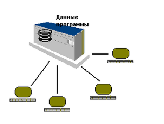

Архитектура «Хост-терминала»
============================

Другой вариант архитектуры, тоже очень популярной в свое время для
построения информационных систем, называется терминальной, или
архитектурой "хост-терминал". В отличии от архитектуры файлового
сервера, где вся обработка перенесена как можно ближе к пользователю, а
общими являются только данные, терминальная архитектура на рабочем месте
пользователя (на терминале) производит только физическое отображение и
ввод информации, а вся логика приложения, все данные хранятся на
центральном компьютере (хосте). Такая архитектура соответствовала идее
больших компьютеров (мэйнфреймов) и была особенно популярна в 70-х и
начале 80-х годов.

На центральном компьютере работает общее, единое для всех пользователей
приложение. Это приложение работает со своими данными. Каждый из
пользователей подключается к информационной системе черех систему
удаленного терминального доступа (телемонитор). На рабочем месте
пользователя производится прием нажатых клавиш, их пересылка на
компьютер, получение и отработка команд на вывод информации.

Так как операционные системы, работающие на таких компьютерах, также как
и системы программирования и сами компьютеры были изначально разработаны
для многопользовательского доступа, неразрешимых проблем с одновременной
работой нескольких пользователей не возникало. Не возникало также и
особых проблем с пропускной способностью линий связи, так как
передавалась только та информация, которую мог воспринять и ввести
пользователь.

:::{.center}
  
Рис. 1.2. Многопользовательская информационная система на основе
мейнфрейма и терминальной архитектуры.
:::

Однако администрирование и сопровождение терминальных информационных
систем было очень дорогим, что стало особенно заметно в сравнении с
недорогими персональными компьютерами. Кроме того, терминальные системы,
как правило, обеспечивали только достаточно примитивный,
алфавитно-цифровой, могохромный интерфейс. Для некоторых задач этого
было недостаточно. Существенной проблемой стала и масштабируемость
терминальных систем. Увеличение числа пользователей в какой-то момент
приводило к необходимости очень существенных финансовых вложений,
связанных с модернизацией аппартного комплекса в целом.

Грачев А.Ю.                Введение в СУБД Informix
