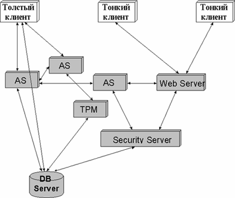
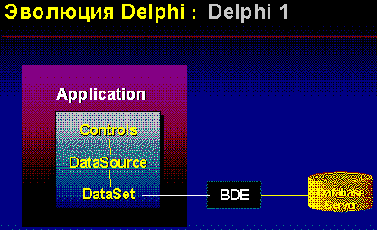
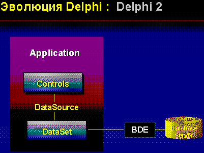
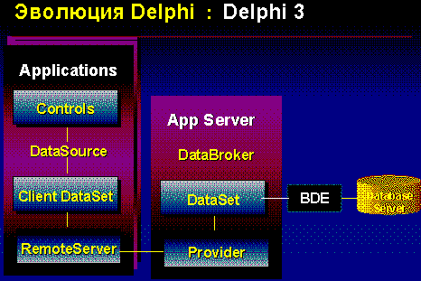
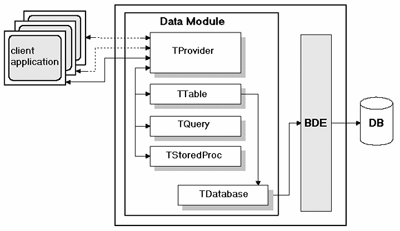
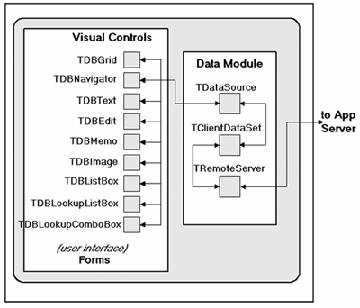

Многоуровневые модели в архитектуре клиент-сервер
=================================================

::: {.date}
01.01.2007
:::

С. Орлик, Borland

Введение

Говоря о прикладных системах, предназначенных для работы с базами
данных, чаще всего на ум приходит модель вычислений, основанная на двух
взаимодействующих компонентах - клиенте, отвечающем за организацию
диалога с пользователем и несущем на себе бизнес-логику, и сервере,
обеспечивающем многопользовательскую работу с данными и их целостность.
Описанная таким образом архитектура клиент-сервер является более
фундаментальным явлением, чем просто способ построения приложений a-la
\"многопользовательская бухгалтерия\". На нынешнем уровне зависимости
бизнеса от информационных систем разработчикам приходится сталкиваться
не только с задачами реализации адекватных техническим требованиям
функциональности и пользовательского интерфейса, но и с оптимизацией
обмена данным между различными компонентами системы. Учитывая, что
корпоративные системы обладают достаточно высоким уровнем сложности, в
процессе их эксплуатации возникает ряд вопросов связанных с надежностью
и управляемостью такой системы. Появление такого рода акцентов в
процессе проектирования и разработки корпоративных систем приводит к
необходимости решения следующей важной задачи - выделения из клиентской
и серверной части системы компонентов, несущие на себе строго
определенную служебную функциональность.

Традиционные подходы в моделировании

Попытаемся разбить систему на функциональные фрагменты 2).

На верхнем уровне абстрагирования достаточно четко можно выделить
следующие компоненты:

::: {style="text-align: left; text-indent: 0px; padding: 0px 0px 0px 0px; margin: 7px 0px 7px 24px;"}
  --- ---------------------------------------------------
  ·   презентационная логика (Presentation Layer - PL);
  --- ---------------------------------------------------
:::

::: {style="text-align: left; text-indent: 0px; padding: 0px 0px 0px 0px; margin: 7px 0px 7px 24px;"}
  --- --------------------------------------
  ·   бизнес-логика (Business Layer - BL);
  --- --------------------------------------
:::

::: {style="text-align: left; text-indent: 0px; padding: 0px 0px 0px 0px; margin: 7px 0px 7px 24px;"}
  --- ------------------------------------------------
  ·   логика доступа к ресурсам (Access Layer - AL).
  --- ------------------------------------------------
:::

Таким образом можно, можно придти к нескольким моделям клиент-серверного
взаимодействия 1):

::: {style="text-align: left; text-indent: 0px; padding: 0px 0px 0px 0px; margin: 7px 0px 7px 24px;"}
  ---- -------------------------------------------------------------------------------------------------------------------------------------------------------------------------------------------------------------------------------------------------------------------------------------------------------------------------------------------------------------------------------------------------------------------------
  1.   \"Толстый\" клиент. Наиболее часто встречающийся вариант реализации архитектуры клиент-сервер в уже внедренных и активно используемых системах. Такая модель подразумевает объединение в клиентском приложении как PL, так и BL (см. Выше). Серверная часть, при описанном подходе, представляет собой сервер баз данных 2)., реализующий AL. К описанной модели часто применяют аббревиатуру RDA - Remote Data Access.
  ---- -------------------------------------------------------------------------------------------------------------------------------------------------------------------------------------------------------------------------------------------------------------------------------------------------------------------------------------------------------------------------------------------------------------------------
:::

::: {style="text-align: left; text-indent: 0px; padding: 0px 0px 0px 0px; margin: 7px 0px 7px 24px;"}
  ---- -----------------------------------------------------------------------------------------------------------------------------------------------------------------------------------------------------------------------------------------------------------------------
  1.   \"Тонкий\" клиент. Модель 3), начинающая активно использоваться в корпоративной среде в связи с распространением Internet-технологий и, в первую очередь, Web-браузеров. В этом случае клиентское приложение обеспечивает реализацию PL, а сервер объединяет BL и AL.
  ---- -----------------------------------------------------------------------------------------------------------------------------------------------------------------------------------------------------------------------------------------------------------------------
:::

::: {style="text-align: left; text-indent: 0px; padding: 0px 0px 0px 0px; margin: 7px 0px 7px 24px;"}
  ---- ---------------------------------------------------------------------------------------
  1.   Сервер бизнес-логики. Модель с физически выделенным в отдельное приложение блоком BL.
  ---- ---------------------------------------------------------------------------------------
:::

1).Хотя, рассматриваемые в этой части варианты разделения
функциональности между клиентом и сервером являются \"классическими\",
далее будет использоваться не только устоявшаяся традиционная, но и
более новая терминология, возникшая вследствие распространения в
корпоративных средах Internet/intranet-технологий и стандартов.\

2). Хотя в качестве серверной части, в общем случае, выступает менеджер
\<многопользовательского\> доступа к информационным ресурсам, в этой
статье будет сохраняться ориентация на серверы баз данных, как оконечное
серверное звено.\

3). Модели, основанные на Internet-технологиях и применяемые для
построения внутрикорпоративных систем получили название intranet. Хотя
intranet-системами сегодня называют все, что так или иначе использует
стек протоколов TCP/IP, с ними скорее следует связать использование
Web-браузеров в качестве клиентских приложений. При этом важно отметить
тот факт, что броузер не обязательно является HTML-\"окном\", но, в не
меньшей степени, представляет собой универсальную среду загрузки
объектных приложений/компонент -Java или ActiveX.

Однако, разработчик - это не Илья Муромец, стоящий перед тремя дорогами,
все больше напоминающими три наезженных колеи. При этом, описанные три
модели организации клиент-серверных систем в определенной степени
являются ориентирами в задании жесткости связей между различными
функциональными компонентами, чем строго описываемыми программами в
реальных проектах. Жесткость связей в схеме взаимодействия компонент
системы часто определяется отсутствием (или наличием) транспортного или
сетевого уровня (Transport Layer - TL), обеспечивающего обмен
информацией между различными компонентами.

Серверы приложений

Посмотрим на то, что же происходит в реальной жизни.

С точки зрения применения описанных моделей, при проектировании
прикладных систем разработчик часто сталкивается с правилом 20/80. Суть
этого правила заключается в том, что 80% пользователей обращаются к 20%
функциональности, заложенной в систему, но оставшиеся 20% задействуют
основную бизнес-логику - 80%. В первую группу пользователей попадают
операторы информационных систем (ввод и редактирование информации), а
также рядовые сотрудники и менеджеры, обращающиеся к поисковым и
справочным механизмам (поиск и чтение данных). Во вторую группу
пользователей попадают эксперты, аналитики и менеджеры управляющего
звена, которым требуются как специфические возможности отбора
информации, так и развитые средства ее анализа и представления.

С точки зрения реализации моделей необходимо обеспечить прозрачность
взаимодействия между различными компонентами системы, а, следовательно,
обратиться к существующим стандартам такого взаимодействия.

Любая прикладная система, вне зависимости от выбранной модели
взаимодействия, требует такой инструментарий, который смог бы
существенно ускорить процесс сам создания системы и, одновременно с
этим, обеспечить прозрачность и наращиваемость кода. На фоне разработки
и внедрения систем корпоративного масштаба явно присутствует тенденция
использования объектно-ориентированных компонентных средств разработки.
Соответственно, полноценное применение объектов в распределенной
клиент-серверной среде требует и распределенного
объектно-ориентированного взаимодействия, то есть возможности обращения
к удаленным объектам.

Таким образом, мы приходим к анализу существующих распределенных
объектных моделей. На настоящий момент наибольшей проработанностью
отличаются COM/DCOM/ ActiveX и CORBA/DCE/Java. Если в первом случае
требуемые механизмы поддержки модели являются неотъемлемой частью
операционной платформы Win32 (Windows 95/NT/CE), то во втором случае
предусмотрена действительная кроссплатформенность (например, везде, где
есть виртуальная машина Java). Если попытаться объективно оценить (хотя
любая такая попытка во многом субъективна) перспективы применения этих
моделей, то для этого необходимо понять требования к операционным
платформам, выдвигаемые различными функциональными компонентами системы.
При построении реальных систем корпоративного масштаба уже мало
обходиться их разделением на три базовых фрагмента PL, BL, AL. Так как
бизнес-логика является блоком, наиболее емким и специфичным для каждого
проекта, именно ее приходится разделять на более мелкие составляющие.
Такими составляющими могут быть, например, функциональные компоненты
обработки транзакций (Transaction Process Monitoring), обеспечения
безопасности (Security) при наличии разграничения прав доступа и выходе
в Internet (Fire-wall), публикование информации в Internet (Web-access),
подготовки отчетов (Reporting), отбора и анализа данных в процессе
принятия решений (Decision Support), асинхронного уведомления о событиях
(Event Alerts), тиражирования данных (Replication), почтового обмена
(Mailing) и др. Вследствие наличия такого огромного количества функций,
закладываемых в блоки поддержки бизнес-логики, появляется понятие
сервера приложений (Application Server - AS). Причем, сервер приложений
не просто является некоим единым универсальным средним BL-звеном между
клиентской и серверной частью системы, но AS существует во множественном
варианте, как частично изолированные приложения, выполняющие специальные
функции, обладающие открытыми интерфейсами управления и поддерживающие
стандарты объектного взаимодействия.

Проникновение информационных технологий в сферу бизнеса в качестве
неотъемлемого условия успешного управления приводит к тому, что системы
корпоративных масштабов требуют сочетания различных клиент-серверных
моделей в зависимости от задач, решаемых на различных конкретных
направлениях деятельности предприятия. Вспомнив, снова, о правиле 20/80
можно придти к выводу, что наиболее оптимальным выбором, с точки зрения
управляемости и надежности системы, является сочетание различных моделей
взаимодействия клиентской и серверной части. По сути, мы приходим даже
не к трех-уровневой, а многоуровневой (N-tier) модели, объединяющей
различных по \"толщине\" клиентов, серверы баз данных и множество
специализированных серверов приложений, взаимодействующих на базе
открытых объектных стандартов. Существенным облегчением в реализации
многоуровневых гетерогенных систем является активная работа ряда
производителей программного обеспечения, направленная на создание
переходного ПО. В отличие от продуктов middleware, обеспечивающих
верхний транспортный уровень (универсальные интерфейсы доступа к данным
ODBC, JDBC, BDE; Message Oriented Middleware - MOM; Object Request
Broker - ORB; \...) , переходное ПО отвечает за трансляцию вызовов в
рамках одного стандарта обмена в вызовы другого - мосты ODBC/JDBC и
BDE/ODBC, COM/CORBA, Java/ActiveX и т.п.

В общем случае, многоуровневая модель клиент-серверной системы может
быть представлена, например, следующим образом:

{width="400" height="337"}

Многоуровневая клиент-серверная модель

Причем, различные стандарты взаимодействия могут применяться в различных
связках узлов системы, а мосты встраиваться в любой узел или выделяться
в своеобразные серверы приложений, с физическим выделением в узлах сети.
Двигаясь между клиентами слева-направо на нашей диаграмме мы можем
наблюдать переход между различными моделями распределенных вычислений -
через intranet к Internet.

Многоуровневое представление \"от клиента\"

Традиционная архитектура клиент-сервер исторически развивалась в
реальных прикладных системах от \"толстого\" клиента. Клиентские
приложения объединяли как пользовательский интерфейс, так и
бизнес-логику. В связи с этим, инструментальные средства для построения
клиентских приложений сами по себе предлагали многоуровневую архитектуру
объектов. Рассмотрим эволюцию такого рода многоуровневого клиентского
инструментария на примере Borland Delphi.

{width="417" height="254"}\
{width="401" height="300"}\
{width="466" height="311"}

Эволюция многоуровневой модели \"от клиента\", на примере Borland Delphi

Концептуально, архитектура Delphi ориентирована на использование цепочек
объектов \"DataControl - DataSource - DataSet\", то есть \"элементы
пользовательского интерфейса - компоненты перенаправления ввода/вывода -
компоненты доступа к данным\". Введение в Delphi 2, на равне с формами,
контейнеров невизуальных компонент - модулей данных (Data Modules) -
обеспечило использование трехуровневой логической модели в рамках одного
приложения. На основе поддержки технологии DCOM, Delphi 3 предоставляет
возможности создания автономных модулей данных, доступ к которым
осуществляется из нескольких клиентских приложений, содержащих в себе
только PL. Соответственно, появились и компоненты поддержки
транспортного уровня (TL) объектного взаимодействия клиента и сервера
приложений RemoteServer и Provider, а множества данных (DataSets) -
таблицы (Table), запросы (Query) и хранимые процедуры (Query), связанные
с конкретной бизнес-логикой, оказались реально перенесенными на сервер
приложений и подмененными на клиенте виртуальным множеством данных
Client DataSet. Соответственно, клиент \"утоньшился\" и на интерфейс
доступа к данным BDE (Borland Database Engine), что позволяет уменьшить
ресурсоемкость клиентского места, с одной стороны, и увеличить
управляемость системой с точки зрения администратора, с другой.

{width="400" height="231"}

Логическая структура организации сервера приложений с использованием
удаленного модуля данных (Remote DataModule) в распределенной
архитектуре Delphi 3

{width="400" height="342"}

Логическая структура организации \"тонкого клиента\" в распределенной
архитектуре Delphi 3

Заключение

Тема построения многоуровневых клиент-серверных систем, наконец, стала
уделом не только архитекторов, но и разработчиков. Многое из того, что
казалась красивым и легким в теории, иногда оказывается нереализуемым на
практике. Многоуровневые системы клиент-сервер уже доказывают свою
жизнеспособность. Вероятно, пришло время начать их более детальное
описание. Этот материал затронул только два взаимосвязанных подхода -
серверов приложений и \"многоуровневости от клиента\", приводящих к
системам с распределенной бизнес-логикой. Надеюсь, что это хорошая тема
для детализации.
