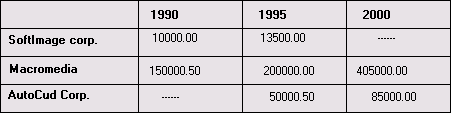
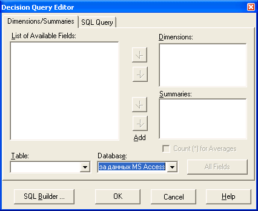
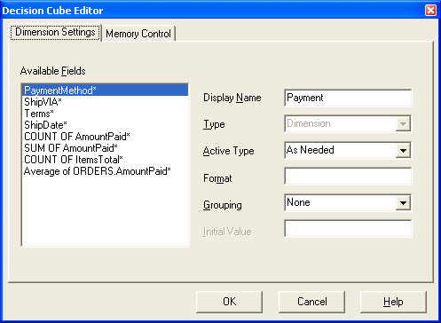
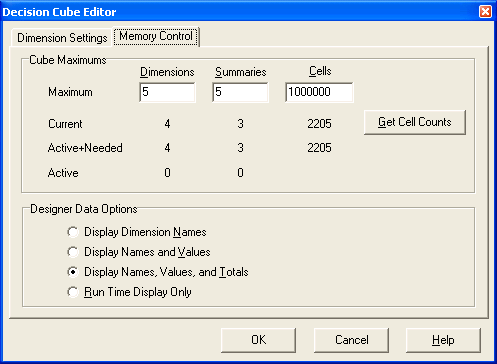
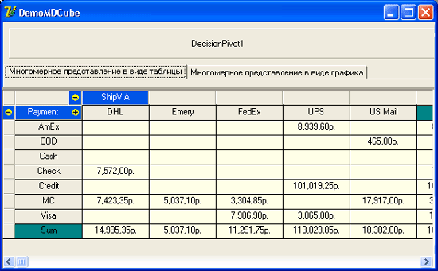

Многомерное представление данных (статья)
=========================================

Помимо стандартных компонентов отображения данных в VCL Delphi имеются
дополнительные компоненты, которые позволяют представлять данные в виде
кросстаба. При этом заставить работать кросстаб с двумя и более полями
почти так же просто, как и обычный компонент TDBGrid. Эти компоненты
расположены на странице **Decision Cube** Палитры компонентов.

Кросстабом называется такое табличное представление данных, которое
имеет переменную структуру по горизонтали и вертикали. Причем
обозначения столбцов по вертикали и строк по горизонтали соответствуют
значениям полей набора данных. В ячейках кросстаба содержатся не данные,
а суммарные значения для двух полей, которые пересекаются в этой ячейке.

В настоящей главе рассматриваются следующие вопросы:

- для чего необходим кросстаб;
- особенности запросов SQL для многомерного представления;
- компоненты многомерного представления и их взаимосвязь.

## Понятие кросстаба

Обычная таблица данных имеет строго заданное число столбцов, причем
каждый столбец всегда предназначен для представления данных из одного
поля. Для кросстаба число и назначение столбцов зависит от значений
какого-либо поля. Число строк в кросстабе не равно числу строк в таблице
БД, а также зависит от значений какого-либо поля. В ячейках кросстаба
всегда располагается суммирующая информация по значениям полей
горизонтали и вертикали.

  
Рис. 30.1. Пример кросстаба

Создать подобную двумерную структуру отображения данных при помощи
обычных компонентов со страницы Data Controls Палитры компонентов очень
непросто и хлопотно.

В общем случае горизонтальную и вертикальную структуры кросстаба могут
составлять несколько полей одновременно, которые сгруппированы
относительно более общих полей.

Для создания наборов данных, которые можно представить в виде кросстаба,
используются запросы SQL с применением группирующего оператора GROUP BY
и агрегатных функций. Если обратиться к топологическим аналогиям, то
набор данных такого запроса представляет собой многомерный гиперкуб,
каждая сторона которого соответствует одному полю набора данных.

Для дальнейшего изложения необходимо ввести еще одно понятие.
Совокупность строк или колонок, имеющих отношение к одному полю набора
данных, будем называть размерностью. Размерность представляет собой
виртуальную плоскость, которая рассекает многомерный куб данных
параллельно какой-либо стороне этого куба. Компоненты многомерного
представления данных как раз предназначены для того, чтобы
визуализировать это n-мерное сечение.

Переходя от пространственных моделей к наборам данных, можно сказать,
что размерность представляет собой совокупность значений какого-либо
поля в кросстабе относительно других полей.

## Взаимосвязь компонентов многомерного представления данных

При создании в приложении формы для многомерного представления данных
следует помнить, что при этом обязательно должны решаться следующие
задачи:

- должен быть создан группирующий и суммирующий запрос SQL, обеспечивающий открытие набора данных для кросстаба;
- перед отображением данных необходимо настроить параметры размерностей кросстаба;
- непосредственный показ данных в кросстабе;
- работающий кросстаб должен эффективно управляться на уровне размерностей.

Для этого в форме приложения требуется разместить как минимум пять
компонентов со страницы **Decision Cube** Палитры компонентов.

Для создания запроса SQL можно использовать компонент TDecisionQuery или
обычный компонент  TQuery.

Запрос должен быть связан с компонентом TDecisionCube, который
осуществляет подготовку набора данных запроса к многомерному показу.

Для соединения многомерного набора данных с компонентом отображения
данных используется компонент TDecisionSource - полный функциональный
аналог TDataSource. Этот компонент, в свою очередь, должен связываться и
с набором данных, и с инструментом многомерного представления данных.

Непосредственный показ многомерного набора данных проводится при помощи
компонентов TDecisionGrid и TDecisionGraph. Они должны поддерживать
соединение с компонентом TDecisionSource.

Наконец, управление многомерным представлением данных реализует
компонент TDecisionPivot, он также должен быть связан с компонентом
TDecisionSource.

Допустим, что на форме расположены следующие компоненты:

- TDecisionQuery по имени DecisionQuery1;
- TDecisionCube по имени DecisionCubel;
- TDecisionSource по имени DecisionSourcel;
- TDecisionGrid по имени DecisionGrid1;
- TDecisionPivot по имени DecisionPivotl.

Тогда для того, чтобы связать все эти компоненты в единый работающий
механизм многомерного представления данных, нужно установить значения
для их важнейших свойств.

Таблица 30.1. Как связать компоненты многомерного представления данных

| Свойство|Значение| Описание|
|--------|--------|--------|
| TBecisionCube|
| DataSet|DecisionQuery1|Определяет компонент доступа к данным,  который создает набор данных |
| TDecisionSource|
| DecisionCube|DecisionCubel|Указывает на компонент формирования многомерного набора данных |
| TDecisionGrid|
| DecisionSource|DecisionSourcel|Ссылается на компонент  TDecisionSource|
| TDecisionPivot|
| DecisionSource|DecisionSourcel| Ссылается на компонент  TDecisionSource|

Если задать текст запроса SQL и открыть набор данных, то вся цепочка
заработает, причем ее поведение ничем не отличается от поведения во
время выполнения приложения.

Теперь, когда мы узнали, как объединить компоненты многомерного
представления данных в единую систему, настало время более подробно
изучить возможности каждого компонента.

## Подготовка набора данных

Компоненты многомерного представления данных работают со специально
созданным и подготовленным набором данных. Эта работа выполняется
специальным компонентом доступа к данным - TDecisionQuery. Его
непосредственным предком является компонент TQuery.

Набор данных формируется при помощи запроса, который основан на
стандартном синтаксисе SQL 92. Для обеспечения работы многомерного
представления данных запрос должен удовлетворять ряду требований.

1. В тексте запроса должны присутствовать только те поля, которые
разработчик хочет показать в компонентах многомерного представления данных.
2. Поля запроса должны быть сгруппированы при помощи оператора GROUP BY.
3. Запрос должен содержать агрегатные функции, которые определяют вид
информации, отображаемой в ячейках кросстаба.

Компонент TDecisionQuery должен только обеспечить выполнение запроса и
создание набора данных, он не имеет никаких дополнительных свойств или
методов. Поэтому для создания набора данных можно использовать и обычный
компонент TQuery. Преимущество компонента TDecisionQuery состоит в том,
что он имеет специализированный редактор для создания текста запроса
(рис. 30.2). Он вызывается командой **Decision Query Editor** из
всплывающего меню компонента или двойным щелчком на компоненте. Элементы
управления страницы **Dimensions/Summaries** позволяют создавать текст
запроса, манипулируя именами полей таблиц. Псевдоним базы данных
выбирается в комбинированном списке Database. После этого в списке **Table**
задается нужная таблица. Если в запросе требуется использовать несколько
таблиц, то для их выбора можно воспользоваться утилитой SQL Builder,
которая вызывается щелчком на одноименной кнопке.

  
Рис. 30.2. Специализированный редактор компонента TDecisionQuery

Из списка доступных полей при помощи кнопок **Add** требуемые поля можно
перенести в список полей - размерностей **Dimensions** и список
суммирующих полей **Summaries**. Поля из этих списков используются при
создании запроса.

Запрос формируется автоматически при работе с описанными элементами
управления. Текст запроса доступен для просмотра и редактирования на
странице SQL Query.

Подготовка набора данных к многомерному представлению осуществляется
компонентом TDecisionCube. Его основная задача - создание размерностей
для многомерной структуры данных на основе каждого поля набора данных.
Для каждой размерности в компоненте можно задать ряд параметров, которые
определяют ее поведение и внешний вид.

Компонент TDecisionCube формирует размерности при открытии набора
данных, причем созданное многомерное представление данных полностью
работоспособно уже во время разработки. Для этого достаточно присвоить
свойству Active Компонентов TDecisionQuery или TQuery значение True.
После этого любой визуальный компонент многомерного представления
начинает работать так же, как и во время выполнения.

Компонент TDecisionCube также позволяет управлять использованием памяти
многомерного представления данных. Дело в том, что при добавлении к
многомерному представлению новой размерности объем занимаемой памяти
возрастает в арифметической прогрессии. Поэтому возможность ограничения
размеров используемой памяти особенно актуальна для больших наборов
данных.

Все основные настройки компонента выполняются при помощи
специализированного редактора свойства DecisionMap

  
Рис. 30.3. Специализированный редактор свойства DecisionMap компонента TDecisionCube (страница **Dimension Settings**)

Для настроек размерностей используется страница Dimension Settings этого
редактора. В расположенном слева списке Available Fields содержатся все
поля набора данных. В элементах управления справа приведены параметры
размерности для выбранного поля.

В однострочном редакторе Display Name задается название поля, которое
будет присутствовать в визуальных компонентах многомерного просмотра.

Неактивный список выбора Туре показывает, является ли поле основой для
размерности или суммы.

Список выбора Active Type определяет, когда данные поля появляются в
визуальных компонентах. Его элементы обозначают следующее:

- Active - данные поля видны сразу после открытия формы и набора данных
во время выполнения или сразу после открытия набора данных во время
разработки;
- AS Needed - данные поля становятся видны после выполнения
пользователем во время выполнения или разработчиком во время разработки
действий по отображению данных;
- inactive - данные поля не видны.

Однострочный редактор **Format** содержит строку форматирования для данных
поля.

Комбинированный список Grouping необходим для того, чтобы определить,
какие значения будут показаны. Варианты Year, Quarter, Month возможны
только для полей с календарным типом данных.

Однострочный редактор **Initial Value** задает начальное значение для поля.

Страница Memory Control используется для управления расходом памяти для
нужд компонента. Однострочные редакторы Dimensions, Summaries и Cells в
ряду Maximum позволяют задать максимальное число размерностей, сумм и
ячеек, соответственно.

  
Рис. 30.4. Специализированный редактор свойства DecisionMap компонента TDecisionCube (страница **Memory Control**)

Аналогичные значения в ряду Current показывают текущее число этих
структур.

Аналогичные значения в ряду Active+Needed показывают общее возможное
число размерностей, сумм и ячеек.

Значения в ряду Active показывают число видимых размерностей сумм и
ячеек.

Кнопка Get Cell Counts выполняет запрос, который возвращает число ячеек
в кросстабе.

Группа радиокнопок Designer Data Options задает режим показа данных во
время разработки:

- Display Dimension Names - отображаются только названия размерностей;
- Display Names and Values - отображаются названия размерностей и значения;
- Display Names, Values, and Totals - отображаются названия, значения и
суммы размерностей;
- Run Time Display Only - визуализация данных осуществляется только во
время выполнения.

Подготовленный к использованию для многомерного отображения набор данных
необходимо связать с визуальными компонентами. Это делается при помощи
компонента TDecisionSource. Через один такой компонент с набором данных
можно связать несколько визуальных компонентов (см. табл. 30.1).

Кроме этого, компонент TDecisionSource позволяет разработчику установить
общие для всех связанных с ним визуальных компонентов многомерного
представления данных настройки отображения данных.

## Компонент TDecisionQuery

Компонент доступа к данным TDecisionQuery предназначен для создания
набора данных, который был бы пригоден для многомерного представления.
Для создания набора данных используется запрос SQL. Требования к запросу
приведены выше.

Этот компонент является прямым наследником компонента TQuery и не имеет
собственных свойств и методов. Для создания запросов можно
воспользоваться специализированным редактором, который автоматизирует
этот процесс.

## Компонент TDecisionCube

Компонент TDecisionCube осуществляет преобразование набора данных,
который содержится в компоненте TDecisionQuery, к виду, доступному для
отображения визуальными компонентами многомерного представления данных
(табл. 30.2). Обычную таблицу набора данных компонент преобразует в
многомерный кросстаб. Число размерностей создаваемого кросстаба зависит
от числа полей данных набора данных. Значения в ячейках кросстаба
зависят от типа агрегатной функции в запросе SQL.

Таблица 30.2. Свойства и методы компонента TDecisionCube

|Объявление|Тип|Описание|
|--------|--------|--------|
|Свойства|
|property Active:   Boolean;|Pu|Разрешает или запрещает преобразование набора данных в кросстаб|
|property BinData:   Boolean;|Ro|Значение  True означает, что хотя бы одна размерность находится в свернутом состоянии (данные не отображаются)|
|property Capacity: Integer;|Pu |Определяет число байтов, используемых для хранения многомерного массива|
|property CurrentSuramary:   Integer;|Pu|Содержит индекс текущей суммы кросстаба|
|property DataSet: TDataSet;|Pb|Ссылка на экземпляр набора данных, который отображается в кросстабе|
|type TCubeDesignState = (dsNoData, dsMetaData, dsDimensionData, dsAHData);property DesignState: TCubeDesignState;|Pu  |Задает режим отображения данных в кросстабе:-  dsNoData — во время разработки             данные не видны;-  dsMetaData — видны             названия размерностей;-  dsDimensionData             — видны названия размерностей и значения, суммы не видны;- dsAHData — видны             все данные|
|property DimensionCount: Integer;|Ro|Возвращает число размерностей|
|property DimensionMap:   TCubeDims;|Pb  |Индексированный список ссылок на объекты параметров размерностей|
|property DimensionMapCount: Integer;|Pb |Общее число полей набора данных, включая поля размерностей и сумм|
|property MaxCells: Integer;|Pb|Задает максимальное число ячеек кросстаба|
|property MaxDimensions: Integer;|Pb|Задает максимальное число размерностей|
|property MaxSummaries: Integer;|Pb|Задает максимальное число сумм|
|property ShowProgressDialog: Boolean;|Pb|При значении  True при подготовке кросстаба отображается индикатор|
|property SummaryCount: Integer;|Ro|Возвращает число активных сумм кросстаба|
|Методы|
|function GetDetailSQL (ValueArray : TSmalllntArray;   SelectList: string;   bActive:   Boolean) :string;|Pu|Возвращает текст запроса SQL, который может быть использован для создания набора данных, включающего данные из кросстаба без сумм|
|function GetSQL(ValueArray: TSrralllntArray; bActive: Boolean): string;|Pu |Возвращает текст запроса SQL, который может быть использован для создания набора данных, включающего данные из кросстаба без сумм|
|procedure ShowCubeDialog;|Pu|Вызывает специализированный редактор компонента|
|procedure Refresh (DimensionMap : TCubeDims; bForce: Boolean) ;||Обновляет список объектов параметров размерностей|
|Методы-обработчики событий|
|type TCubeRefreshEvent = procedure (DataCube: TCustomDataStore; DimMap: TCubeDims) of object;property OnRefresh: TCubeRefreshEvent; property AfterClose: TCubeNotifyEvent;|Pb|Вызывается сразу после закрытиякомпонента  (Active := False)|
|property AfterOpen: TCubeNot if yEvent;|Pb|Вызывается сразу после открытия компонента (Active := False)|
|property BeforeClose: TCubeNotif yEvent ;|Pb|Вызывается перед закрытием компонента (Active := False)|
|property BeforeOpen: TCubeNotifyEvent;|Pb|Вызывается перед открытием компонента (Active := False)|
|TErrorAction = (eaFail, eaContinue) ;TCapacityErrorEvent = procedure (var EAction: TErrorAction) of object;property OnLowCapacity: TCapacityErrorEvent ;|Pb|Вызывается после того, как занимаемый кросстабом объем памяти превысит заданный предел|


При помощи методов GetDetailsQL и GetSQL можно получить тексты запросов,
которые возвращают набор данных, соответствующий кросстабу с заданным
параметрами состояниями. Массив vaiueArray содержит условия для полей
размерностей. Первой размерности соответствует первый элемент массива,
второй размерности - второй элемент и т. д. Если значение элемента
меньше нуля, то в результат запроса попадают все значения поля
размерности. Значение элемента, равное или больше нуля, определяет
индекс значения поля размерности. Параметр selectList содержит
разделенный запятыми список дополнительных полей, которые нужно включить
в запрос. Параметр bActive накладывает дополнительное ограничение на
размерности. При значении True в результат запроса автоматически (без
использования параметра selectList) попадают только активные
размерности.

Ключевым свойством компонента является свойство DecisionMap, которое
позволяет установить параметры размерностей и максимальный размер
используемой памяти. Для этих целей применяется специализированный
редактор (см. рис. 30.4).

Это свойство представляет собой экземпляр класса TCubeDims,
который инкапсулирует индексированный список экземпляров объектов TCubeDim,
каждый из которых содержит информацию о параметрах одной размерности.
Основные свойства этого класса представлены в табл. 30.3.

Таблица 30.3. Основные свойства класса TCubeDim

|Объявление|Тип|Описание|
|--------|--------|--------|
|type TActiveFlags = (diActive, diAsNeeded, dilnactive);property ActiveFlag: TActiveFlags;|Pb |Определяет режим отображения данных размерности |
|property BaseName: string;|Pb| Содержит имя поля размерности  в таблице           базы данных |
|property BinFormat: string;|Pu|Определяет способ форматирования диапазона значений размерности|
|type TBinType = (binNone, binYear, binQuarter, binMonth, binSet, binCustom) ;property BinType: TBinType;|Pb|Определяет способ группирования данных в размерности|
|type TDimFlags = (dimDimension, dimSum, dimCount, dimAverage, dimMin, dimMax, dimGenericAgg, dimUnknown) ;property DimensionType: TDimFlags ;|Pb|Определяет тип размерности|
|property FieldName: String;|Pb|Содержит имя поля в наборе данных|
|property FieldType: TFieldType;|Pu|Определяет тип поля|
|property Format: String;|Pu|Задает форматирование данных размерности|
|property Loaded: Boolean;|Ro|Значение  True говорит о том, что данный элемент загружен в многомерный набор данных|
|property StartDate:   TDate;|Pu|Определяет начальный элемент  для группировки по дате|
|property StartValue: String; |Pu|Определяет начальный элемент : длягруппировки по значению|
|property ValueCount: Integer; |Pb|Возвращает число уникальных  элементов в размерности|


## Компонент TDecisionSource

Компонент TDecisionSource предназначен для связывания визуальных
компонентов многомерного представления с компонентом TDecisionCube
(табл. 30.4). Кроме того, за счет возможности подключения к этому
компоненту нескольких визуальных компонентов одновременно, при изменении
состояния одного визуального компонента осуществляется синхронизация
многомерного представления во всех остальных компонентах.

От набора данных в визуальные компоненты передаются данные, обратно
транслируются команды пользователя по управлению многомерным
представлением данных.

Таблица 30.4. Основные свойства компонента TDecisionSource
|Объявление|Описание|
|--------|--------|
|type TDecisionControlType= (xtCheck, xtRadio, xtRadioEx) ;property ControlT ype: TDecisionControlType;|Определяет способ управления отдельной размерностью в компонентеTDecisionGrid|
|property CurrentSum: Integer;|Содержит индекс текущей суммы в компоненте  TDecisionGrid|
|property DecisionCube: TDecisionCube;|Связывает данный компонент с компонентом TDecisionCube. Содержит ссылку на экземпляр компонента TDecisionCube|
|property Ready: Boolean;|Значение  True означает, что данный компонент связан с активным компонентом TDecisionCube|
|property SparseCols: Boolean;|При значении True из компонента  TDecisionGrid удаляются пустые колонки|
|property SparseRows:   Boolean;|При значении True из компонента  TDecisionGrid удаляются пустые строки|


Компонент имеет средства для управления состоянием многомерного
представления в визуальных компонентах. Для этого используется свойство
ControlType. Рассмотрим его возможные значения:

- xtcheck - щелчок на кнопках размерности в компонентах TDecisionGrid и
TDecisionPivot приводит к открытию или закрытию размерности;
- xtRadio - щелчок на кнопках размерности в компонентах TDecisionGrid и
TDecisionPivot приводит к открытию или закрытию данной размерности и
закрытию всех остальных в этом направлении;
- xtRadioEx - щелчок на кнопках размерности в компонентах TDecisionGrid
и TDecisionPivot приводит к открытию или закрытию данной размерности и
закрытию или открытию всех остальных размерностей в этом направлении.

## Отображение данных

При работе с кросстабом пользователь имеет дело с двумя визуальными
компонентами многомерного представления данных. Это компонент
TDecisionGrid, который представляет данные в табличном виде, и компонент
TDecisionGraph, который представляет данные в виде графика.

С компонентом TDecisionCube они связаны при помощи компонента
TDecisionSource.

Данные в визуальных компонентах появляются после открытия набора данных
в соответствующем компоненте TDecisionQuery. Причем эти компоненты
полностью работоспособны уже во время разработки приложения.

**Компонент TDecisionGrid**

Компонент TDecisionGrid предназначен для многомерного представления
данных в табличном виде. Параметры отображаемого набора данных (какие
размерности будут видны при открытии, как группировать данные, как
управлять размерностями) настраиваются при помощи других компонентов
многомерного представления. В компоненте TDecisionGrid можно настроить
только свойства самой сетки.

Для управления графиком во время выполнения можно использовать компонент
TDecisionPivot.

В табл. 30.5 приведены основные свойства и методы компонента.

Таблица 30.5. Свойства и методы компонента TDecisionGrid


|Объявление| Тип|Описание|
|--------|--------|--------|
|Свойства|
|property  Cells [ACol,   ARow: Integer] :   string;|Ro |Индексированный массив значений всех ячеек компонента в строковом формате|
|property ColCount :   Integer;|RO |Возвращает общее число колонок в сетке|
|property DecisionSource: TDecisionSource;|Рb |Указывает на компонент TDecisionSource, через который осуществляется связь с набором данных|
|property Dimensions: TDisplayDims;|Pb |Объект  TDisplayDims представляет индексированный список объектов визуальных свойств размерностей|
|property FixedCols: Integer;|Ro |Возвращает число фиксированных колонок, которые используются для отображения информации о размерностях (названия, значения, обозначения)|
|property FixedRows: Integer;|Ro|Возвращает число фиксированных строк, которые используются для отображения информации о размерностях (названия, значения, обозначения)|
|typeTDecisionGridOption = (cgGridLines,   cgOutliner, cgPivo table) ;TDecisionGridOptions = set of TDecisionGridOption;property Options: TDecisionGridOptions;|Pb|Определяет общие настройки компонента:- cgGridLines — отображаются вертикальные и горизонтальные             разделительные линии;-  cgOutliner — отображаются элементы управления             в виде знаков "+" и "-" для открытия и закрытия             размерностей;-  cgpivotable — размерности можно переупорядочивать             при помощи перетаскивания|
|property RcwCount:   Integer;|Ro|Возвращает общее число строк в сетке|
|property ShowCubeEditor: Boolean; |Pb|Разрешает или запрещает использование специализированного редактора компонента TDecisionCube|
|property Totals: Boolean; |Pu|При значении True сетка имеет промежуточные суммы по каждой колонке и строке|
|Методы|
|typeTDecisionDrawStates =         i (dsGroupStart, dsRowCaption,  dsColCaption,dsSum,  dsRowValue, dsColValue,  dsData, dsOpenAfter, dsCloseAfter, dsCloseBefore,  dsOpenBefore, dsRowIndicator, dsColIndicator,dsRowPlus, dsColPlus, dsNone);TDecisionDrawState = set of TDecisionDrawStates;function CellDrawState(ACol, ARow: Integer; var Value: string; var DrawState: TDecisionDrawState) : boolean;|Pu|Позволяет определить назначение любой ячейки сетки. Параметры ACol и  ARow определяют положение ячейки в сетке.В параметре  Value возвращается строка, содержащая значение в том виде, как оно представлено в ячейке.Параметр  DrawState возвращает информацию о назначении ячейки|
|function CellValueArray (ACol,  ARow:Integer; var ValueArray: TValueArray): boolean;|Pu|Возвращает индексы всех полей, данные которых суммированы в ячейке.Параметр  ValueArray содержит индексы полей|


Компонент TDecisionGrid является предком класса TCustomGrid и поэтому
обладает всеми базовыми свойствами и методами, присущими сетке.

Для доступа к значению каждой ячейки используется свойство cells.
Адресация ячеек осуществляется с левой верхней ячейки, которая имеет
индексы [0,0].

Свойство Dimensions является экземпляром объекта TDisplayDims, который
инкапсулирует индексированный список указателей на экземпляры объектов
TDispiayDim. Каждый такой объект содержит важнейшие визуальные свойства
размерностей. При щелчке на кнопке в однострочном редакторе свойства в
Инспекторе объектов разворачивается список всех таких объектов.

## Компонент TDecisionGraph

Компонент TDecisionGraph создает график на основе многомерного
представления набора данных. Конкретный вид графика (назначение
горизонтальной и вертикальной осей) зависит от настроек компонентов
TDecisionCube и TDecisionPivot. По умолчанию к оси абсцисс привязывается
первая вертикальная размерность, к оси ординат - первая сумма. Первая
горизонтальная размерность отображается в легенде графика.

Одним из предков компонента TDecisionGraph является класс TChart, от
которого унаследованы все многочисленные свойства и методы для настройки
графика.

Для подключения к графику набора данных используется свойство

    property DecisionSource: TDecisionSource;

которое ссылается на экземпляр компонента источника данных.

Сразу после подключения автоматически строится график с осями, заданными
по умолчанию.

Для управления графиком во время выполнения можно использовать компонент
TDecisionPivot.

## Управление данными

Несомненное преимущество многомерного представления данных в том, что
пользователь может легко изменить взаимное положение размерностей одной
стороны между собой и переносить размерности с горизонтали на вертикаль
и обратно. Для того чтобы сделать размерность видимой или невидимой,
пользователю достаточно щелкнуть на кнопке.

Взаимное положение и расположение размерностей по сторонам кросстаба
никак не связано с местом полей в запросе компонента TDecisionQuery.

Все операции по управлению многомерным представлением сосредоточены в
одном компоненте - TDecisionPivot (см. рис. 30.2). В некоторой степени
это аналог компонента TDBNavigator, только TDecisionPivot управляет не
записями набора данных, а размерностями многомерного представления
данных.

Этот компонент подключается к общей цепочке компонентов многомерного
представления данных через компонент TDecisionSource. Поэтому любые
действия с компонентом TDecisionPivot немедленно отражаются во всех
визуальных компонентах, которые также подключены к этому экземпляру
TDecisionSource.

## Компонент TDecisionPivot

Компонент TDecisionPivot предоставляет пользователю средства управления
размерностями многомерного представления данных. В стандартном состоянии
компонент представляет собой панель, разделенную на три части (табл.
30.6). Каждая часть имеет собственный набор кнопок.

Левая часть имеет единственную кнопку, щелчок на которой позволяет
сделать выбор суммирующего поля из развернувшегося списка. Элементы
списка соответствуют вычисляемым полям с использованием агрегатных
функций из запроса соответствующего компонента TDecisionQuery.

Выбор поля приводит к изменению значений в ячейках кросстаба. Например,
выбор поля с функцией зим изменит значения в ячейках на суммы полей,
поле с функцией COUNT произведет подсчет количества элементов в полях.

Средняя часть панели предназначена для размещения кнопок,
соответствующих горизонтальным размерностям.

Правая часть панели используется для кнопок, соответствующих
вертикальным размерностям.

Кнопка в нажатом состоянии показывает размерность. Одновременно
отображается и общая сумма по размерности.

Размерности можно менять местами и перемещать с вертикали на горизонталь
и обратно. Для этого можно выбрать команду Moved to Column Area из
всплывающего меню кнопки. Во время выполнения можно использовать обычное
перетаскивание кнопок при помощи мыши.

Всплывающее меню кнопки размерности имеет еще одну команду - Drilled
In. По этой команде размерность переходит в режим детального просмотра
по каждому значению поля. Конкретное значение можно выбрать из списка,
который открывается при щелчке на кнопке. В этом случае суммы в ячейках
кросстаба рассчитываются не по всей размерности, а только по выбранному
значению.

Таблица 30.6. Свойства и методы компонента TDecisionPivot

|Объявление |Тип|Описание|
|--------|--------|--------|
|Свойства|
|property DecisionSource:  TDecisionSource; |Рb|Определяет компонент TDecisionSource, через который осуществляется управление многомерным представлением данных|
|type TDecisionButtonPosition = (xtHorizontal, xtVertical, XtLeftTop) ;property GroupLayout: TDecisionButtonPosition;|Рb |Задает способ расположения кнопок на панели:-  xtHorizontal — в ряд слева             направо; -  xtVertical — в             колонку сверху вниз;-  xtLeftTop — кнопки             вертикальных размерностей вдоль верхнего края, кнопки горизонтальных             размерностей вдоль левого края, кнопка сумм в левом верхнем углу|
|typeTDecisionPivotOption = (xtRows, xtColumns, xtSuiranaries);TDecisionPivotOptions = set of TDecisionPivotOption;property Groups : TDecisionPivotOptions;|РЬ|Управляет видимостью трех групп кнопок|
|property GroupSpacing: Integer;|Pb|Определяет размер в пикселах промежутка между группами кнопок|
|Методы|
|procedure SetBounds (Left, Top, Height, Width: Integer); override;|Pu |Переустанавливает размеры компонента в соответствии с параметрами метода||Объявление |Тип|Описание|


Методы-обработчики компонента унаследованы от класса TWinControl.


## Пример многомерного представления данных

В качестве примера использования многомерного представления данных
рассмотрим демонстрационное приложение DemoMDCube (рис. 30.5).

В качестве исходного набора данных используется запрос к таблицам SALES
и CUSTOMER общедоступной базы данных EMPLOYEE.GDB
в составе поставки InterBase следующего вида:

```sql
SELECT С.CUSTOMER, S.ORDERJDATE, SUM(S.DISCOUNT) FROM SALES S
INNER JOIN CUSTOMER С
ON  C.CUST_NO = S.CUST_NO) GROUP BY C.CUSTOMER, S.ORDER_DATE
```

Запрос удовлетворяет всем требованиям для обеспечения многомерного 
представления данных. Для выполнения запроса и создания набора данных в 
проекте существует компонентDecisionQueryl.

Набор данных компонента открыт во время разработки, поэтому все 
компоненты многомерного представления в проекте ведут себя так же, как и
 во время выполнения программы.

С ним связан компонент Decisioncubel, для которого свойство имеет следующее значение:

    DecisionCubel.DataSet := DecisionQueryl;



Рис. 30.5. Главная форма проекта  DemoMDCube

Компонент  Decisioncubel 
выполняет всю работу по созданию многомерного представления набора данных компонента 
DecisionQueryl. Причем, практически все 
делается без вмешательства пользователя. 

При настройке компонента был использован специализированный 
редактор свойства DecisionMap. В нем были 
заданы названия для размерностей и значения для расчета максимального размера 
используемой памяти. Все заданные значения соответствуют рекомендованным. 

Для связывания набора данных с визуальными компонентами 
использован компонент DecisionSource1. 
На него замыкаются все три визуальных компонента многомерного представления, 
использованные в проекте. 

Управление осуществляется компонентом DecisionPivotl. 
Основной визуальный компонент DecisionGrid1 
представляет многомерный набор данных в табличном виде. В исходном состоянии 
по горизонтали расположены размерности номеров накладных и наименований, по 
вертикали размешаются размерности дат заказов и покупателей. 

Дополнительного программного кода проект не имеет.

## Резюме

Многомерное представление данных позволяет
проводить сложный анализ информации, содержащейся в базах данных. 
Основой многомерного представления является группирующий запрос (с 
оператором GROUP BY). С точки зрения пользователя анализ с помощью 
многомерного представления данных очень прост в использовании.
