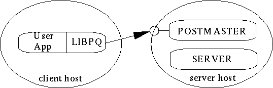

Обучающее руководство по PostgreSQL
===================================

::: {.date}
01.01.2007
:::

Автор: Команда разработчиков PostgreSQL

Под редакцией: Thomas Lockhart

**Авторские права и торговые марки**

Авторское право на PostgreSQL принадлежит Postgres Global Development
Group

Этот документ является пользовательским руководством для систем
управления базами данных PostgreSQL, изначально разработанной в
калифорнийском университете Berkeley. PostgreSQL основан на Postgres
версии 4.2. Проект Postgres,возглавляемый профессором Michael
Stonebraker, был субсидирован в рамках министерства обороны агентством
по перспективным научным проектам (DARPA), Army Research Office (ARO),
национальным научным фондом (NSF), и ESL, Inc.

Резюме

Postgres изначально разрабатывался в UC Berkeley Computer Science
Department, цитадели многих объектно-реляционных концепций, теперь
ставших доступными в некоторых коммерческих базах данных. Он
обеспечивает поддержку языка SQL92/SQL3, целостность транзакций и
расширяемость типов. PostgreSQL является всеобщим достоянием, потомком с
открытыми исходными текстами этого оригинального кода Berkeley.

Глава 1. Введение
-----------------

Оглавление:

Что такое Postgres?

Краткая история Postgres

Об этой версии

Ресурсы

Терминология

Нотация

О Y2K

Что такое Postgres?

Традиционные реляционные системы управления базами данных (DBMSs)
поддерживают модель данных, состоящую из набора именованных отношений,
содержащих атрибуты определенных типов. В настоящий момент, коммерческие
системы включают такие возможные типы: числа с плавающей точкой, целые,
строки символов, денежную единицу и даты. Обычно признаётся, что эта
модель недостаточна для работы приложений с типами данных, которые
появятся в будущем. Реляционная модель успешно замещает предыдущие
модели, в частности, из-за её "спартанской простоты". Однако иногда,
эта простота часто делает реализацию некоторых приложений очень сложной.
Postgres предлагает значительную дополнительную мощность, объединяя
следующие четыре дополнительные концепции с основными таким образом, что
пользователи могут легко расширить систему:

    +-----------------------------------------------------------------------+
    | классы                                                                |
    +-----------------------------------------------------------------------+
    | наследование                                                          |
    +-----------------------------------------------------------------------+
    | типы                                                                  |
    +-----------------------------------------------------------------------+
    | функции                                                               |
    +-----------------------------------------------------------------------+

Прочие свойства обеспечивают дополнительную мощность и гибкость:

    +-----------------------------------------------------------------------+
    | ограничения                                                           |
    +-----------------------------------------------------------------------+
    | триггеры                                                              |
    +-----------------------------------------------------------------------+
    | правила                                                               |
    +-----------------------------------------------------------------------+
    | целостность транзакций                                                |
    +-----------------------------------------------------------------------+

Из-за этих свойств Postgres относят к категории баз данных, называемых
объектно-реляционными. Обратите внимание, что они отличаются от так
называемых объектно-ориентированных, которые, в общем, плохо подходят
для традиционных языков реляционных баз данных. Но хотя Postgres и имеет
некоторые объектно-ориентированные свойства, он остаётся в мире
реляционных баз данных. Фактически, некоторые новые коммерческие базы
данных включают свойства, открытые Postgres.

Краткая история Postgres

Объектно-реляционная система управления базами данных, теперь известная
как PostgreSQL (и сокращённо называемая Postgres95), происходит от
пакета Postgres, написанного в Berkeley. После десятилетия разработки,
PostgreSQL это наиболее прогрессивная база данных с открытыми исходными
текстами, доступная везде, предлагает многовариантное управление
параллелизмом, поддерживает почти все конструкции SQL (включая вложенную
выборку, транзакции, и определяемые пользователем типы и функции), и
имеет широкий ряд связей с языками (включая C, C++, Java, perl, tcl, и
python).

Проект Berkeley Postgres

Реализация Postgres DBMS началась в 1986. Первоначальные концепции
системы представлены в Задачи Postgres, а определение первоначальной
модели данных показано в Модель данных Postgres. Проект правил системы
для этого времени описывается в Проектирование системы правил Postgres.
Логическое обоснование и архитектура администратора хранения описана в
Система хранения Postgres.

Postgres за это время пережил несколько основных версий. Первая система
"demoware" заработала в 1987 и была представлена в 1988 на ACM-SIGMOD
конференции. Мы выпустили Версию 1, описываемую в Реализация Postgres,
для нескольких внешних пользователей в июне 1989. В ответ на критику
первого правила системы (Комментарий к системе правил Postgres), система
правил была переконструирована (О правилах, процедурах, кэшировании и
представлениях в системах баз данных) и Версия 2 увидела свет в июне
1990 с новой системой правил. Версия 3 появилась в 1991 и добавила
поддержку для составного администратора хранения, улучшился исполнитель
запросов, и была переписана система правил перезаписи. По большей части,
после выпуска Postgres95 (смотри ниже) всё внимание было перенесено на
портативность и надёжность.

Postgres использовался для реализации многих различных исследований и
производства приложений. Среди них: система анализа финансовых данных,
пакет контроля за производительностью реактивных двигателей, база данных
передвижения астероидов и несколько географических информационных
систем. Postgres также использовался как учебное пособие в нескольких
университетах. Наконец, Illustra Information Technologies (потом слилась
с Informix) подобрала код и коммерциализовала его. Позже, в 1992 году,
Postgres стал первичным администратором данных для Sequoia 2000,
научного вычислительного проекта.

Размер сообщества внешних пользователей в течении 1993 года практически
удвоился. Становилось всё больше и больше понятно, что сопровождение
прототипа кода и поддержка заберут большое количество времени, которое
должно было быть посвящено исследованию баз данных. Из-за этого
напряжения сократилась поддержка на накладные расходы, и проект
официально прекратился с версией 4.2.

Postgres95

В 1994 году, Andrew Yu и Jolly Chen добавили интерпретатор языка SQL в
Postgres. Впоследствии, Postgres95 был запущен в паутину, найдя свой
собственный путь в мир в качестве всеобщего достояния, как потомок с
открытым исходным текстом, изначально бывшим Berkeley кодом Postgres .

Код Postgres95 был полностью на ANSI C и урезан в размере на 25%. Много
внешних изменений улучшили производительность и обслуживаемость.
Postgres95 v1.0.x запускался на 30-50% быстрее на Wisconsin Benchmark по
сравнению с Postgres v4.2. Кроме исправленных багов, появились такие
улучшения:

::: {style="text-align: justify; text-indent: 0px; padding: 0px 0px 0px 0px; margin: 7px 0px 7px 24px;"}
  --- -------------------------------------------------------------------------------------------------------------------------------------------------------------------------------------------------------------------------------------------------------------------------------------------------------------------------------------------------------------------------------
  ·   Язык запросов Postquel был заменён на SQL (реализован в сервере). Подзапросы не поддерживались до PostgreSQL (смотри ниже), но они могли быть съимитированы в Postgres95 с помощью функций SQL, определённых пользователем. Сложные функции были реализованы заново. Также был добавлен пункт поддержки запросов GROUP BY. Для программ на C остался доступен интерфейс \<\>.
  --- -------------------------------------------------------------------------------------------------------------------------------------------------------------------------------------------------------------------------------------------------------------------------------------------------------------------------------------------------------------------------------
:::

::: {style="text-align: justify; text-indent: 0px; padding: 0px 0px 0px 0px; margin: 7px 0px 7px 24px;"}
  --- ---------------------------------------------------------------------------------------------------------------------------------------------------
  ·   В дополнении к программе мониторинга, появилась программа (psql), которая позволяла выполнять интерактивные запросы SQL, используя GNU readline.
  --- ---------------------------------------------------------------------------------------------------------------------------------------------------
:::

::: {style="text-align: justify; text-indent: 0px; padding: 0px 0px 0px 0px; margin: 7px 0px 7px 24px;"}
  --- ---------------------------------------------------------------------------------------------------------------------------------------------------------------------------------------------
  ·   Новая клиентская библиотека, libpgtcl, стала поддерживать клиентов основанных на Tcl. Пример на shell, pgtclsh, обеспечивал новые Tcl команды для связи tcl программ с Postgres95 сервером.
  --- ---------------------------------------------------------------------------------------------------------------------------------------------------------------------------------------------
:::

::: {style="text-align: justify; text-indent: 0px; padding: 0px 0px 0px 0px; margin: 7px 0px 7px 24px;"}
  --- ---------------------------------------------------------------------------------------------------------------------------------------------------------------------------------------------------------
  ·   Взаимодействие с большими объектами было основательно перестроено. От перестановки больших объектов остался только механизм хранения больших объектов. (Перестановочная файловая система была удалена.)
  --- ---------------------------------------------------------------------------------------------------------------------------------------------------------------------------------------------------------
:::

::: {style="text-align: justify; text-indent: 0px; padding: 0px 0px 0px 0px; margin: 7px 0px 7px 24px;"}
  --- -------------------------------------------------------------------------------------------------
  ·   Объектно-уровневое системное правило было удалено. Правила еще доступны как правила перезаписи.
  --- -------------------------------------------------------------------------------------------------
:::

::: {style="text-align: justify; text-indent: 0px; padding: 0px 0px 0px 0px; margin: 7px 0px 7px 24px;"}
  --- ----------------------------------------------------------------------------------------------------------------------------------------
  ·   Вместе с исходным кодом стало распространяться краткое обучающее руководство по официальным возможностям SQL, работающим в Postgres95.
  --- ----------------------------------------------------------------------------------------------------------------------------------------
:::

::: {style="text-align: justify; text-indent: 0px; padding: 0px 0px 0px 0px; margin: 7px 0px 7px 24px;"}
  --- ----------------------------------------------------------------------------------------------------------------------------------------------------------------------------------------
  ·   Для сборки стал использоваться GNU make (вместо BSD make). Также, Postgres95 может быть скомпилирован с помощью непропатченного gcc (выравнивание данных типа double было исправлено).
  --- ----------------------------------------------------------------------------------------------------------------------------------------------------------------------------------------
:::

PostgreSQL

В 1996 году, стало ясно, что название "Postgres95" не выдержало
испытания временем. Мы выбрали новое имя, PostgreSQL, отражающее
взаимосвязь между первоначальным Postgres и возможностями SQL в более
новых версиях. В тоже время, мы установили нумерацию версий, начиная с
6.0, вернув нумерацию обратно к прежней последовательности изначально
начатой проектом Postgres.

При разработке Postgres95 акцент делался на установление и понимание
существующих проблем в коде сервера. В PostgreSQL акцент был сдвинут на
прибавление свойств и возможностей, хотя работа продолжалась во всех
областях.

Основные улучшения в PostgreSQL включают:

::: {style="text-align: justify; text-indent: 0px; padding: 0px 0px 0px 0px; margin: 7px 0px 7px 24px;"}
  --- -----------------------------------------------------------------------------------------------------------------------------------------------------------------------------------------------------------------------------------------------------------------------------------------------------
  ·   Блокировка на уровне таблиц была заменена на многовариантное управление параллелизмом, который позволяет читающему продолжать чтение согласованных данных во время деятельности пишущего и разрешает горячее резервирование из pg\_dump, и то же время база данных остаётся доступной для запросов.
  --- -----------------------------------------------------------------------------------------------------------------------------------------------------------------------------------------------------------------------------------------------------------------------------------------------------
:::

::: {style="text-align: justify; text-indent: 0px; padding: 0px 0px 0px 0px; margin: 7px 0px 7px 24px;"}
  --- -----------------------------------------------------------------------------------------------------------------------
  ·   Были реализованы важные свойства сервера, включая вложенную выборку, значения по умолчанию, ограничители, и триггеры.
  --- -----------------------------------------------------------------------------------------------------------------------
:::

::: {style="text-align: justify; text-indent: 0px; padding: 0px 0px 0px 0px; margin: 7px 0px 7px 24px;"}
  --- -------------------------------------------------------------------------------------------------------------------------------------------------------------------------------------------------------------------
  ·   Были добавлены дополнительные свойства языка SQL92, включая первичные ключи, объявление идентификаторов, преобразование литерального строкового типа, приведение типа, и ввод двоичных и шестнадцатеричных целых.
  --- -------------------------------------------------------------------------------------------------------------------------------------------------------------------------------------------------------------------
:::

::: {style="text-align: justify; text-indent: 0px; padding: 0px 0px 0px 0px; margin: 7px 0px 7px 24px;"}
  --- --------------------------------------------------------------------------------------------------------------------------------
  ·   Были улучшены встроенные типы, включая новые широкомасштабные типы даты/время и поддержка дополнительных геометрических типов.
  --- --------------------------------------------------------------------------------------------------------------------------------
:::

::: {style="text-align: justify; text-indent: 0px; padding: 0px 0px 0px 0px; margin: 7px 0px 7px 24px;"}
  --- ---------------------------------------------------------------------------------------------------------------------------------------------
  ·   Скорость всего кода сервера была увеличена приблизительно на 20-40%, и время запуска сервера было уменьшено на 80%, начиная с выпуска v6.0.
  --- ---------------------------------------------------------------------------------------------------------------------------------------------
:::

 

Терминология

В последующем тексте, термин сайтозначает хост машину, на которой
установлен Postgres. Т.к. возможно установить более одной базы данных
Postgres на один хост, то этот термин более точно указывает на любой
отдельный набор установленных исполняемых файлов и баз данных Postgres.

Суперпользователь Postgres - это имя пользователя postgres, которому
принадлежат исполняемые и файлы баз данных Postgres. Для
суперпользователя, все механизмы защиты пропускаются и доступны любые
произвольные данные.К тому же, суперпользователю Postgres позволено
запускать некоторые программы поддержки, которые, в основном, недоступны
для всех пользователей. Заметим, что суперпользователь Postgres - это не
суперпользователь Unix (на который будем ссылаться как на root).
Суперпользователь должен иметь не нулевой идентификатор пользователя
(UID) по причинам безопасности.

Администратор базы данных или DBA - это человек, который отвечает за
установку механизмов Postgres в соответствии с политикой безопасности
сайта. DBA может добавлять новых пользователей по методике, описанной
ниже и поддерживать набор шаблонов баз данных для использования с
createdb.

postmaster - это процесс, который работает как расчётная палата для
запросов к системе Postgres. Клиентские приложения подключаются к
postmaster, который отслеживает любые системные ошибки и взаимодействие
с процессами сервера. postmaster может принимать некоторые аргументы из
командной строки для настройки своего поведения. Однако, указывать
аргументы необходимо только если ты намереваешься запускаться на
нескольких сайтах или не на сайте по умолчанию.

Сервер Postgres (т.е. исполняемая программа postgres) может быть
запущена прямо из пользовательского shell суперпользователем Postgres (с
именем базы данных в качестве аргумента). Однако, из-за этого не
принимается во внимание разделяемый буферный пул и блокировка таблиц,
связанных с postmaster/сайтом, поэтому это не рекомендуется на
многопользовательском cайте.

Нотация

"..." или /usr/local/pgsql/ в начале имени файла используются для
представления пути к домашнему каталогу суперпользователя Postgres.

В командном синтаксисе, скобки ("[" и "]") показывают, что выражение
или ключевое слово необязательны. Всё в фигурных скобках ("{" и "}") и
содержащие вертикальные штрихи ("\|") показывают, что ты можешь выбрать
из них что-то одно.

В примерах, круглые скобки ("(" и ")") используются для группировки
логических выражений. "\|" - это логический оператор OR.

В примерах показано выполнение команд из различных бюджетов и программ.
Команды, выполняемые из бюджета root предваряются "\>". Команды,
выполняемые из бюджета суперпользователя Postgres предваряются "%", в то
время как команды выполняемые из бюджета непревелигерованных
пользователей предваряются "$". Команды SQL предваряются "=\>" или не
имеют приглашения, в зависимости от смысла.

Глава 2. SQL
------------

Оглавление:

Реляционная модель данных

Формальное описание реляционной модели данных

Операции в реляционной модели данных

Язык SQL

Эта глава изначально появилась как часть диссертации Stefan Simkovicss
(Simkovics, 1998).

SQL стал наиболее популярным реляционным языком запросов. Название "SQL"
это абривиатура Язык структурированных запросов. В 1974 году Donald
Chamberlin и другие в IBM Research разработали язык SEQUEL (Язык
английских структурированных запросов). Этот язык был впервые реализован
в прототипе IBM названном SEQUEL-XRM в 1974-75 годах. В 1976-77 годах
зародилась пересмотренная версия SEQUEL называемая SEQUEL/2 и
впоследствии название было изменено на SQL.

В 1977 году был разработан новый прототип, названный System R. System R
реализовывал большое подмножество SEQUEL/2 (сейчас SQL) и в течении
проекта SQL было сделано много изменений. System R была установлена на
многих пользовательских сайтах, как на внутренних сайтах IBM так и на
некоторых выбранных клиентских сайтах. Благодаря успеху и приёму System
R на этих пользовательских сайтах IBM начала разрабатывать коммерческие
продукты, которые реализовывали язык SQL, основанный на технологии
System R.

Через несколько лет IBM и еще несколько других продавцов анонсировали
такие SQL продукты как SQL/DS(IBM), DB2 (IBM), ORACLE (Oracle Corp.),
DG/SQL (Data General Corp.), и SYBASE (Sybase Inc.).

SQL стал, также, официальным стандартом. В 1982 году Американский
национальный институт стандартов (ANSI) заказал своему комитету по базам
данных X3H2 разработать план по стандартизации реляционного языка. Этот
план был утверждён в 1986 году и состоял преимущественно из IBM-кого
диалекта SQL. В 1987 году этот ANSI стандарт также был принят в качестве
международного стандарта международной организацией по стандартизации
(ISO). Эту версия первоначального стандарта SQL часто называют
неформально как "SQL/86". В 1989 году первоначальный стандарт был
расширен и этот новый стандарт часто, опять же неформально, стали
называть как "SQL/89". Также в 1989 году, был разработан родственный
стандарт, называемый Встроенный язык баз данных SQL (ESQL).

Комитеты ISO и ANSI много лет работали над определением значительно
дополненной версии изначального стандарта, неформально называемого SQL2
или SQL/92. Эта версия стала утверждённым стандартом - "Международный
стандарт ISO/IEC 9075:1992, языка баз данных SQL" - в конце 1992 года.
SQL/92 - это версия обычно используется людьми, хотя они подразумевают
" стандарт SQL". Подробное описание SQL/92 дано Дейтом и Дарвеном в
1997 году. За время написания этого документа стал разрабатываться новый
стандарт, неформально называемый как SQL3. Планируется сделать SQL
полным языком по Тьюрингу, т.е. сделать возможными все вычислимые
запросы (например рекурсивные запросы). Это очень сложная задача и
поэтому завершения нового стандарта не стоит ждать ранее 1999 года.

Реляционная модель данных

Как упоминалось выше, SQL это реляционный язык. Это значит, что он
основывается на реляционной модели данных, впервые опубликованной E.F.
Codd в 1970 году. Мы дадим формальное описание реляционной модели позже
(в Формальное описание реляционной модели данных), но во-первых, мы
хотели бы взглянуть на неё с интуитивно понятной стороны.

Реляционная база данных это база данных, которая воспринимается
пользователями в виде набора таблиц (и ничего больше кроме таблиц).
Таблица состоит из строк и столбцов, где каждая строка означает запись и
каждый столбец означает атрибут записи, содержащейся в таблице. В База
данных поставщиков и деталей показан пример базы данных, состоящей из
трёх таблиц:

::: {style="text-align: justify; text-indent: 0px; padding: 0px 0px 0px 0px; margin: 7px 0px 7px 24px;"}
  --- ---------------------------------------------------------------------------------------------------
  ·   SUPPLIER это таблица, в которой хранится номер (SNO), название (SNAME) и город (CITY) поставщика.
  --- ---------------------------------------------------------------------------------------------------
:::

::: {style="text-align: left; text-indent: 0px; padding: 0px 0px 0px 0px; margin: 7px 0px 7px 24px;"}
  --- -------------------------------------------------------------------------------------------
  ·   PART это таблица, в которой хранится номер (PNO), название (PNAME) и цена (PRICE) детали.
  --- -------------------------------------------------------------------------------------------
:::

::: {style="text-align: left; text-indent: 0px; padding: 0px 0px 0px 0px; margin: 7px 0px 7px 24px;"}
  --- ---------------------------------------------------------------------------------------------------------------------------------------------------------
  ·   В SELLS хранится информация о том какую деталь (PNO) продаёт поставщик (SNO). Она служит в буквальном смысле для объединения двух других таблиц вместе.
  --- ---------------------------------------------------------------------------------------------------------------------------------------------------------
:::

Пример 2-1. База данных поставщиков и деталей

  SUPPLIER   SNO \|  SNAME  \|  CITY      SELLS   SNO \| PNO

            -----+---------+--------          
-----+-----

              1  \|  Smith  \| London              1  \|  1

              2  \|  Jones  \| Paris               1  \|  2

              3  \|  Adams  \| Vienna              2  \|  4

              4  \|  Blake  \| Rome                3  \|  1

                                                 3  \|  3

                                                 4  \|  2

  PART       PNO \|  PNAME  \|  PRICE              4  \|  3

            -----+---------+---------            4 
\|  4

              1  \|  Screw  \|   10

              2  \|  Nut    \|    8

              3  \|  Bolt   \|   15

              4  \|  Cam    \|   25

Таблицы PART и SUPPLIER можно рассматривать как объекты, а SELLS как
связь между отдельной деталью и отдельным поставщиком.

Как мы увидим позднее, SQL оперирует таблицами подобно тем, что
определены, но перед этим мы изучим теорию реляционной модели.

Формальное описание реляционной модели данных

Математическая концепция, лежащая в основе реляционной модели - это
теоретико-множественное отношение, которое является подмножеством
декартова произведения набора доменов. Это теоретико-множественное
отношение и дало имя этой модели (не путайте с взаимоотношением из
Entity-Relationship model). Формально, домен - это просто набор
значений. Например, набор целых чисел - это домен. Также, набор
символьных строк длинной 20 и дробные числа являются доменами.

Декартово произведение доменов D1, D2, ... Dk записывается как D1 ? D2
? ... ? Dk - это множество всех k-кортежей v1, v2, ... vk, таких что
v1 ? D1, v1 ? D1, ... vk ? Dk.

Например, когда мы имеем k=2, D1={0,1} и D2={a,b,c} то D1 ? D2 is
{(0,a),(0,b),(0,c),(1,a),(1,b),(1,c)}.

Отношение - это любое подмножество декартова произведения одного или
более доменов: R ? D1 ? D2 ? ... ? Dk.

Например, {(0,a),(0,b),(1,a)} - это отношение; фактически, это
подмножество D1 ? D2, упомянутого выше.

Члены отношения называются кортежами. Каждое отношение некоторого
декартова произведения D1 ? D2 ? ... ? Dk, говорят, имеет степень k и
поэтому это множество k-кортежное.

Отношение можно рассматривать как таблицу (мы это уже делали, вспомни
Базу данных поставщиков и деталей, где каждый кортеж представлен строкой
и каждая колонка соответствует одному элементу кортежа. Заданные
названия (называемые атрибутами) колонок приводят к определению
реляционной схемы.

Реляционная схема R - это ограниченное множество атрибутов A1, A2, ...
Ak. Существует домен Di для каждого атрибута Ai, 1 \<= i \<=
\<TTCLASS="LITERAL"k, откуда берутся значения атрибутов. Мы часто
записываем реляционную схему в виде R(A1, A2, ... Ak).

Замечание: Реляционная схема это только шаблон, тогда как отношение -
это экземпляр реляционной схемы. Отношение состоит из кортежей (и
поэтому может отображаться в виде таблицы); в отличие от реляционной
схемы.

Домены и типы данных

В последнем разделе мы часто упоминали о доменах. Вспомним, что домены,
формально, просто набор значений (например, набор целых или дробных
чисел). В терминах систем баз данных мы часто говорим о типах данных
вместо доменов. Когда мы определяем таблицу, мы решаем какие атрибуты
включать. Также, мы решаем, какие данные будут храниться как значения
атрибутов. Например, значениями SNAME из таблицы SUPPLIER будут
символьные строки, тогда как SNO будет содержать целые числа. Мы
определили это, назначив тип данных каждому атрибуту. Типом SNAME
является VARCHAR(20) (это SQL тип для символьных строк длиной \<= 20),
типом SNO является INTEGER. Назначая тип данных, мы также выбираем домен
для атрибута. Доменом SNAME является множество всех символьных строк
длиной \<= 20, доменом SNO является множество всех целых значений.

Операции в реляционной модели данных

В предыдущем разделе (Формальное описание реляционной модели данных), мы
обозначили математическое представление о реляционной модели. Теперь мы
знаем, как можно хранить данные с помощью реляционной модели данных, но
мы не знаем что делать с всеми этими таблицами, чтобы получить от базы
данных что-нибудь ещё. Например, кто-то хочет узнать имена всех
поставщиков, которые продают деталь \'Screw\'. Можно определить два
различных типа записи отражающих операции над отношениями:

::: {style="text-align: justify; text-indent: 0px; padding: 0px 0px 0px 0px; margin: 7px 0px 7px 24px;"}
  --- -------------------------------------------------------------------------------------------------------------------------------
  ·   Реляционная алгебра т.е. алгебраическое изображение, в котором запросы выражаются с помощью специальных операторов отношений.
  --- -------------------------------------------------------------------------------------------------------------------------------
:::

::: {style="text-align: left; text-indent: 0px; padding: 0px 0px 0px 0px; margin: 7px 0px 7px 24px;"}
  --- -----------------------------------------------------------------------------------------------------------------------------------------------------------------------------------
  ·   Реляционное исчисление т.е. логическое изображение, в котором запросы выражаются с помощью формулирования некоторых логических ограничений, которым должны удовлетворять кортежи.
  --- -----------------------------------------------------------------------------------------------------------------------------------------------------------------------------------
:::

Реляционная алгебра

Реляционная алгебра была представлена E. F. Codd в 1972 году. Она
состоит из множества операций над отношениями:

::: {style="text-align: justify; text-indent: 0px; padding: 0px 0px 0px 0px; margin: 7px 0px 7px 24px;"}
  --- --------------------------------------------------------------------------------------------------------------------------------------------------------------------------------------------------------------------------------------------------
  ·   ВЫБОРКА(SELECT) (?): извлечь кортежи из отношения, которые удовлетворяют заданным условиям. Пусть R - таблица, содержащая атрибут A. ?A=a(R) = {t ? R &mid; t(A) = a} где t обозначает кортеж R и t(A) обозначает значение атрибута A кортежа t.
  --- --------------------------------------------------------------------------------------------------------------------------------------------------------------------------------------------------------------------------------------------------
:::

::: {style="text-align: left; text-indent: 0px; padding: 0px 0px 0px 0px; margin: 7px 0px 7px 24px;"}
  --- --------------------------------------------------------------------------------------------------------------------------------------------------------------------------------------------------
  ·   ПРОЕКЦИЯ(PROJECT) (?): извлечь заданные атрибуты (колонки) из отношения. Пусть R отношение, содержащее атрибут X. ?X(R) = {t(X) &mid; t ? R}, где t(X) обозначает значение атрибута X кортежа t.
  --- --------------------------------------------------------------------------------------------------------------------------------------------------------------------------------------------------
:::

::: {style="text-align: left; text-indent: 0px; padding: 0px 0px 0px 0px; margin: 7px 0px 7px 24px;"}
  --- --------------------------------------------------------------------------------------------------------------------------------------------------------------------------------------------------------------------------------------------------------------------------------------------
  ·   ПРОИЗВЕДЕНИЕ(PRODUCT) (?): построить декартово произведение двух отношений. Пусть R - таблица, со степенью k1 и пусть S таблица со степенью k2. R ? S - это множество всех k1 + k2 - кортежей, где первыми являются k1 элементы кортежа R и где последними являются k2 элементы кортежа S.
  --- --------------------------------------------------------------------------------------------------------------------------------------------------------------------------------------------------------------------------------------------------------------------------------------------
:::

::: {style="text-align: left; text-indent: 0px; padding: 0px 0px 0px 0px; margin: 7px 0px 7px 24px;"}
  --- --------------------------------------------------------------------------------------------------------------------------------------------------------------------------------------------------------------------------
  ·   ОБЪЕДИНЕНИЕ(UNION) (?): построить теоретико-множественное объединение двух таблиц. Даны таблицы R и S (обе должны иметь одинаковую степень),объединение R ? S - это множество кортежей, принадлежащих R или S или обоим.
  --- --------------------------------------------------------------------------------------------------------------------------------------------------------------------------------------------------------------------------
:::

::: {style="text-align: left; text-indent: 0px; padding: 0px 0px 0px 0px; margin: 7px 0px 7px 24px;"}
  --- -------------------------------------------------------------------------------------------------------------------------------------------------------------------------------------------------------------------------
  ·   ПЕРЕСЕЧЕНИЕ(INTERSECT) (?): построить теоретико-множественное пересечение двух таблиц. Даны таблицы R и S, R ? S - это множество кортежей, принадлежащих R и S. Опять необходимо, чтобы R и S имели одинаковую степень.
  --- -------------------------------------------------------------------------------------------------------------------------------------------------------------------------------------------------------------------------
:::

::: {style="text-align: left; text-indent: 0px; padding: 0px 0px 0px 0px; margin: 7px 0px 7px 24px;"}
  --- --------------------------------------------------------------------------------------------------------------------------------------------------------------------------------------------
  ·   ВЫЧИТАНИЕ(DIFFERENCE) (? или &setmn;): построить множество различий двух таблиц. Пусть R и S опять две таблицы с одинаковой степенью. R - S - это множество кортежей R,не принадлежащих S.
  --- --------------------------------------------------------------------------------------------------------------------------------------------------------------------------------------------
:::

::: {style="text-align: left; text-indent: 0px; padding: 0px 0px 0px 0px; margin: 7px 0px 7px 24px;"}
  --- ----------------------------------------------------------------------------------------------------------------------------------------------------------------------------------------------------------------------------------------------------------------------------------------------------------------------------------------------------------------------------------------------------------------------------------------------------------------------------------------------------------------------------------------------------------
  ·   СОЕДИНЕНИЕ(JOIN) (?): соединить две таблицы по их общим атрибутам. Пусть R будет таблицей с атрибутами A,B и C и пусть S будет таблицей с атрибутами C,D и E. Есть один атрибут, общий для обоих отношений,атрибут C. R ? S = ?R.A,R.B,R.C,S.D,S.E(?R.C=S.C(R ? S)). Что же здесь происходит? Во-первых, вычисляется декартово произведение R ? S. Затем, выбираются те кортежи, чьи значения общего атрибута C эквивалентны (?R.C = S.C). Теперь мы имеем таблицу, которая содержит атрибут C дважды и мы исправим это, выбросив повторяющуюся колонку.
  --- ----------------------------------------------------------------------------------------------------------------------------------------------------------------------------------------------------------------------------------------------------------------------------------------------------------------------------------------------------------------------------------------------------------------------------------------------------------------------------------------------------------------------------------------------------------
:::

Пример 2-2. Внутреннее соединение

Давайте посмотрим на таблицы, которые получаются в результате шагов,
необходимых для объединения. Пусть даны следующие две таблицы:

        R   A \| B \| C      S   C \| D \| E

           ---+---+---        ---+---+---

            1 \| 2 \| 3          3 \| a \| b

            4 \| 5 \| 6          6 \| c \| d

            7 \| 8 \| 9

Во-первых, мы вычислим декартово произведение R ? S и получим:

      R x S   A \| B \| R.C \| S.C \| D \| E

             ---+---+-----+-----+---+---

              1 \| 2 \|  3  \|  3  \| a \| b

              1 \| 2 \|  3  \|  6  \| c \| d

              4 \| 5 \|  6  \|  3  \| a \| b

              4 \| 5 \|  6  \|  6  \| c \| d

              7 \| 8 \|  9  \|  3  \| a \| b

              7 \| 8 \|  9  \|  6  \| c \| d

После выборки ?R.C=S.C(R ? S)получим:

              A \| B \| R.C \| S.C \| D \| E

             ---+---+-----+-----+---+---

              1 \| 2 \|  3  \|  3  \| a \| b

              4 \| 5 \|  6  \|  6  \| c \| d

Удалить повторяющуюся колонку S.C можно с помощью проекции следующей
операцией: ?R.A,R.B,R.C,S.D,S.E(?R.C=S.C(R ? S))и получим:

                  A \| B \| C \| D \| E

                 ---+---+---+---+---

                  1 \| 2 \| 3 \| a \| b

                  4 \| 5 \| 6 \| c \| d

::: {style="text-align: left; text-indent: 0px; padding: 0px 0px 0px 0px; margin: 7px 0px 7px 24px;"}
  --- -----------------------------------------------------------------------------------------------------------------------------------------------------------------------------------------------------------------------------------------------------------------------------------------------------------------------------------------------------------------------------
  ·   ДЕЛЕНИЕ(DIVIDE) (?): Пусть R будет таблицей с атрибутами A, B, C, и D и пусть S будет таблицей с атрибутами C и D. Мы можем определить деление как: R ? S = {t &mid; ? ts ? S ? tr ? R так, что tr(A,B)=t?tr(C,D)=ts} где tr(x,y)означает кортеж таблицы R, который состоит только из элементов x и y. Заметим, что кортеж t состоит только из элементов A и B отношения R.
  --- -----------------------------------------------------------------------------------------------------------------------------------------------------------------------------------------------------------------------------------------------------------------------------------------------------------------------------------------------------------------------------
:::

Зададим следующие таблицы

         R   A \| B \| C \| D        S   C \| D

            ---+---+---+---          ---+---

             a \| b \| c \| d            c \| d

             a \| b \| e \| f            e \| f

             b \| c \| e \| f

             e \| d \| c \| d

             e \| d \| e \| f

             a \| b \| d \| e

R ? S получается

                        A \| B

                       ---+---

                        a \| b

                        e \| d

Более подробное описание и определение реляционной алгебры смотри у
[Ullman, 1988 год] или [Дейта, 1994 год].

Пример 2-3. Запрос с использованием реляционной алгебры

Вспомним, что мы формулируем все эти реляционные операторы для того
чтобы получить данные из базы данных. Давайте вернёмся к нашему примеру
из предыдущего раздела (Операции в реляционной модели данных), где
кто-то захотел узнать имена всех поставщиков, продающих деталь Screw. На
этот вопрос можно ответить, используя следующие операции реляционной
алгебры:

?SUPPLIER.SNAME(?PART.PNAME=\'Screw\'(SUPPLIER ? SELLS ? PART))

Мы назовём такую операцию запросом. Если мы применим, приведённый выше
запрос к таблицам нашего примера (База данных поставщиков и деталей), то
получим следующий результат:

                            SNAME

                           -------

                            Smith

                            Adams

Реляционное исчисление

Реляционное исчисление основано на логике первого порядка. Если два
варианта реляционного исчисления:

::: {style="text-align: justify; text-indent: 0px; padding: 0px 0px 0px 0px; margin: 7px 0px 7px 24px;"}
  --- -------------------------------------------------------------------------------------
  ·   The Исчисление доменов (DRC), где переменными являются элементы (атрибуты) кортежа.
  --- -------------------------------------------------------------------------------------
:::

::: {style="text-align: left; text-indent: 0px; padding: 0px 0px 0px 0px; margin: 7px 0px 7px 24px;"}
  --- ------------------------------------------------------------------
  ·   The исчисление кортежей (TRC), где переменными являются кортежи.
  --- ------------------------------------------------------------------
:::

Мы хотим обсудить исчисление кортежей потомучто оно лежит в основе
большинства реляционных языков. Подробное обсуждение DRC (и также TRC)
смотри у [Дейта, 1994 год] или [Ullman, 1988 год].

Исчисление кортежей

Запросы, использующие TRC, представлены в следующем виде: x(A) &mid;
F(x) где x - это переменная кортежа, A - это множество атрибутов и F -
формула. Результирующие отношение состоит из всех кортежей t(A), которые
удовлетворяют F(t).

Если мы хотим ответить на вопрос из примера Запрос с использованием
реляционной алгебры, с помощью TRC, то мы сформулируем следующий запрос:

    {x(SNAME) &mid; x ? SUPPLIER ? \\nonumber

                      ? y ? SELLS ? z ? PART (y(SNO)=x(SNO) ? \\nonumber

                       z(PNO)=y(PNO) ? \\nonumber

                       z(PNAME)=\'Screw\')} \\nonumber

Вычисление запроса над таблицами из Базы данных поставщиков и товаров
опять приведёт к тому же результату что и в Запрос с использованием
реляционной алгебры.

Реляционная алгебра и реляционное исчисление

Реляционная алгебра и реляционное исчисление имеют одинаковую выражающую
мощность; т.е. все запросы, которые можно сформулировать с помощью
реляционной алгебры, могут быть также сформулированы с помощью
реляционного исчисления и наоборот. Первым это доказал E. F. Codd в 1972
году. Это доказательство основано на алгоритме ("алгоритм редукции
Кодда") по которому произвольное выражение реляционного исчисления может
быть сокращено до семантически эквивалентного выражения реляционной
алгебры. Более подробное обсуждение смотри у [Дейта, 1994 год] и
[Ullman, 1988 год].

Иногда говорят, что языки, основанные на реляционном исчислении
"высокоуровневые" или "более описательные", чем языки, основанные на
реляционной алгебре, потому что алгебра (частично) задаёт порядок
операций, тогда как исчисление оставляет компилятору или интерпретатору
определять наиболее эффективный порядок вычисления.

Язык SQL

Как и большинство современных реляционных языков, SQL основан на
исчислении кортежей. В результате, каждый запрос, сформулированный с
помощью исчисления кортежей (или иначе говоря, реляционной алгебры),
может быть также сформулирован с помощью SQL. Однако, он имеет
способности, лежащие за пределами реляционной алгебры или исчисления.
Вот список некоторых дополнительных свойств, предоставленных SQL,
которые не являются частью реляционной алгебры или исчисления:

::: {style="text-align: justify; text-indent: 0px; padding: 0px 0px 0px 0px; margin: 7px 0px 7px 24px;"}
  --- -------------------------------------------------
  ·   Команды вставки, удаления или изменения данных.
  --- -------------------------------------------------
:::

::: {style="text-align: left; text-indent: 0px; padding: 0px 0px 0px 0px; margin: 7px 0px 7px 24px;"}
  --- ----------------------------------------------------------------------------------------------------------------------------------------------------------------------------------------------------------------------------------------
  ·   Арифметические возможности: в SQL возможно вызвать арифметические операции, так же как и сравнения, например A \< B + 3. Заметим, что + или других арифметических операторов нет ни в реляционной алгебре ни в реляционном исчислении.
  --- ----------------------------------------------------------------------------------------------------------------------------------------------------------------------------------------------------------------------------------------
:::

::: {style="text-align: left; text-indent: 0px; padding: 0px 0px 0px 0px; margin: 7px 0px 7px 24px;"}
  --- ----------------------------------------------------------------------------------------------------------------------------------
  ·   Команды присвоения и печати: возможно напечатать отношение, созданное запросом и присвоить вычисленному отношению имя отношения.
  --- ----------------------------------------------------------------------------------------------------------------------------------
:::

::: {style="text-align: left; text-indent: 0px; padding: 0px 0px 0px 0px; margin: 7px 0px 7px 24px;"}
  --- -----------------------------------------------------------------------------------------------------------------------------------------
  ·   Итоговые функции: такие операции как average, sum, max, и т.д. могут применяться к столбцам отношения для получения единичной величины.
  --- -----------------------------------------------------------------------------------------------------------------------------------------
:::

Выборка

Наиболее часто используемая команда SQL - это оператор SELECT,
используемый для получения данных. Синтаксис:

  SELECT [ALL\|DISTINCT]

         { * \| expr\_1

         [AS c\_alias\_1] [, ...

         [, expr\_k [AS c\_alias\_k]]]}

         FROM table\_name\_1

         [t\_alias\_1]

         [, ... [, table\_name\_n

         [t\_alias\_n]]]

  [WHERE condition]

  [GROUP BY name\_of\_attr\_i

            [,... [, name\_of\_attr\_j

            ]] [HAVING condition]]

  [{UNION [ALL] \| INTERSECT \| EXCEPT} SELECT ...]

  [ORDER BY name\_of\_attr\_i

  [ASC\|DESC]              [, ... [, name\_of\_attr\_j
[ASC\|DESC]]]];

Сейчас на различных примерах, мы покажем сложные выражения оператора
SELECT. Таблицы, используемые в примерах, определены в Базе данных
поставщиков и деталей.

Простые выборки

Вот несколько простых примеров использования оператора SELECT:

Пример 2-4. Простой ограничивающий запрос

Получить все кортежи из таблицы PART, где атрибут PRICE больше 10:

  SELECT * FROM PART

    WHERE PRICE \> 10;

Получаемая таблица:

                  PNO \|  PNAME  \|  PRICE

                 -----+---------+--------

                   3  \|  Bolt   \|   15

                   4  \|  Cam    \|   25

Использовав "*" в операторе SELECT, получаем все атрибуты из таблицы.
Если мы хотим получить только атрибуты PNAME и PRICE из таблицы PART, то
используем следующее выражение:

  SELECT PNAME, PRICE

  FROM PART

  WHERE PRICE \> 10;

В этом случае получим:

                     PNAME  \|  PRICE

                    --------+--------

                     Bolt   \|   15

                     Cam    \|   25

Заметим, что SQL SELECT соответствует "проекции" в реляционной
алгебре, а не "выборке" (подробней смотри Реляционная алгебра).

Ограничения в операторе WHERE могут также быть логически соединены с
помощью ключевых слов OR, AND, и NOT:

  SELECT PNAME, PRICE

  FROM PART

  WHERE PNAME = \'Bolt\' AND

        (PRICE = 0 OR PRICE \< 15);

приведёт к результату:

                     PNAME  \|  PRICE

                    --------+--------

                     Bolt   \|   15

Арифметические операции могут использоваться в списке объектов и
операторе WHERE. Например, если нам надо знать сколько будут стоить две
штуки одной детали, то используем следующий запрос:

  SELECT PNAME, PRICE * 2 AS DOUBLE

  FROM PART

  WHERE PRICE * 2 \< 50;

и мы получим:

                     PNAME  \|  DOUBLE

                    --------+---------

                     Screw  \|    20

                     Nut    \|    16

                     Bolt   \|    30

Заметим, что слово DOUBLE после ключевого слова AS - это новый заголовок
второго столбца. Эта техника может быть использована для любого элемента
списка объектов, для того чтобы задать новый заголовок столбцу
результата. Этот новый заголовок часто называют псевдонимом. Псевдонимы
не могут просто использоваться в запросе.

Соединения

Следующий пример показывает, как осуществлять соединения в SQL.

Для объединения трёх таблиц SUPPLIER, PART и SELLS по их общим
атрибутам, мы формулируем следующее выражение:

  SELECT S.SNAME, P.PNAME

  FROM SUPPLIER S, PART P, SELLS SE

  WHERE S.SNO = SE.SNO AND

        P.PNO = SE.PNO;

и получаем следующую таблицу в качестве результата:

                      SNAME \| PNAME

                     -------+-------

                      Smith \| Screw

                      Smith \| Nut

                      Jones \| Cam

                      Adams \| Screw

                      Adams \| Bolt

                      Blake \| Nut

                      Blake \| Bolt

                      Blake \| Cam

В операторе FROM мы вводим псевдоним имени для каждого отношения, так
как в отношениях есть общие названия атрибутов (SNO и PNO). Теперь мы
можем различить общие имена атрибутов, просто предварив имя атрибута
псевдонимом с точкой. Соединение вычисляется тем же путём, как показано
во внутреннем соединением. Во-первых, определяется декартово
произведение SUPPLIER ? PART ? SELLS. Потом выбираются только те
кортежи, которые удовлетворяют условиям, заданным в операторе WHERE
(т.е. где общие именованные атрибуты равны).Наконец, убираются все
колонки кроме S.SNAME и P.PNAME.

Итоговые операторы

SQL снабжён итоговыми операторами (например AVG, COUNT, SUM, MIN, MAX),
которые принимают название атрибута в качестве аргумента. Значение
итогового оператора высчитывается из всех значений заданного
атрибута(столбца) всей таблицы. Если в запросе указана группа, то
вычисления выполняются только над значениями группы (смотри следующий
раздел).

Пример 2-5. Итоги

Если мы хотим узнать среднюю стоимость всех деталей в таблице PART, то
используем следующий запрос:

  SELECT AVG(PRICE) AS AVG\_PRICE

  FROM PART;

Результат:

                        AVG\_PRICE

                       -----------

                          14.5

Если мы хотим узнать количество деталей, хранящихся в таблице PART, то
используем выражение:

  SELECT COUNT(PNO)

  FROM PART;

и получим:

                          COUNT

                         -------

                            4

Итоги по группам

SQL позволяет разбить кортежи таблицы на группы. После этого итоговые
операторы, описанные выше, могут применяться к группам (т.е. значение
итогового оператора вычисляется не из всех значений указанного столбца,
а над всеми значениями группы. Таким образом, итоговый оператор
вычисляет индивидуально для каждой группы.)

Разбиение кортежей на группы выполняется с помощью ключевых слов GROUP
BY и следующим за ними списком атрибутов, которые определяют группы.Если
мы имеем GROUP BY A1, &tdot;, Ak мы разделяем отношение на группы так,
что два кортежа будут в одной группе, если у них соответствуют все
атрибуты A1, &tdot;, Ak.

Пример 2-6. Итоги

Если мы хотим узнать сколько деталей продаёт каждый поставщик, то мы так
сформулируем запрос:

  SELECT S.SNO, S.SNAME, COUNT(SE.PNO)

  FROM SUPPLIER S, SELLS SE

  WHERE S.SNO = SE.SNO

  GROUP BY S.SNO, S.SNAME;

и получим:

                    SNO \| SNAME \| COUNT

                   -----+-------+-------

                     1  \| Smith \|   2

                     2  \| Jones \|   1

                     3  \| Adams \|   2

                     4  \| Blake \|   3

Теперь давайте посмотрим что здесь происходит. Во-первых, соединяются
таблицы SUPPLIER и SELLS:

                 S.SNO \| S.SNAME \| SE.PNO

                -------+---------+--------

                   1   \|  Smith  \|   1

                   1   \|  Smith  \|   2

                   2   \|  Jones  \|   4

                   3   \|  Adams  \|   1

                   3   \|  Adams  \|   3

                   4   \|  Blake  \|   2

                   4   \|  Blake  \|   3

                   4   \|  Blake  \|   4

Затем, мы разбиваем кортежи на группы, помещая все кортежи вместе, у
которых соответствуют оба атрибута S.SNO и S.SNAME:

                 S.SNO \| S.SNAME \| SE.PNO

                -------+---------+--------

                   1   \|  Smith  \|   1

                                 \|   2

                --------------------------

                   2   \|  Jones  \|   4

                --------------------------

                   3   \|  Adams  \|   1

                                 \|   3

                --------------------------

                   4   \|  Blake  \|   2

                                 \|   3

                                 \|   4

В нашем примере мы получили четыре группы и теперь мы можем применить
итоговый оператор COUNT для каждой группы для получения итогового
результата запроса, данного выше.

Заметим, что для получения результата запроса, использующего GROUP BY и
итоговых операторов, атрибуты сгруппированных значений должны также быть
в списке объектов. Все остальные атрибуты, которых нет в выражении GROUP
BY, могут быть выбраны при использовании итоговых функций. С другой
стороны ты можешь не использовать итоговые функции на атрибутах,
имеющихся в выражении GROUP BY.

Having

Оператор HAVING выполняет ту же работу что и оператор WHERE, но
принимает к рассмотрению только те группы, которые удовлетворяют
определению оператора HAVING. Выражения в операторе HAVING должны
вызывать итоговые функции. Каждое выражение, использующее только простые
атрибуты, принадлежат оператору WHERE. С другой стороны каждое выражение
вызывающее итоговую функцию должно помещаться в оператор HAVING.

Пример 2-7. Having

Если нас интересуют поставщики, продающие более одной детали, используем
запрос:

  SELECT S.SNO, S.SNAME, COUNT(SE.PNO)

  FROM SUPPLIER S, SELLS SE

  WHERE S.SNO = SE.SNO

  GROUP BY S.SNO, S.SNAME

  HAVING COUNT(SE.PNO) \> 1;

и получим:

                    SNO \| SNAME \| COUNT

                   -----+-------+-------

                     1  \| Smith \|   2

                     3  \| Adams \|   2

                     4  \| Blake \|   3

Подзапросы

В операторах WHERE и HAVING используются подзапросы (вложенные выборки),
которые разрешены в любом месте, где ожидается значение. В этом случае
значение должно быть получено предварительно подсчитав подзапрос.
Использование подзапросов увеличивает выражающую мощность SQL.

Пример 2-8. Вложенная выборка

Если мы хотим узнать все детали, имеющие цену больше чем деталь
\'Screw\', то используем запрос:

  SELECT *

  FROM PART

  WHERE PRICE \> (SELECT PRICE FROM PART

                 WHERE PNAME=\'Screw\');

Результат:

                  PNO \|  PNAME  \|  PRICE

                 -----+---------+--------

                   3  \|  Bolt   \|   15

                   4  \|  Cam    \|   25

Если мы посмотрим на запрос выше, то увидим ключевое слово SELECT два
раза. Первый начинает запрос - мы будем называть его внешним запросом
SELECT - и второй в операторе WHERE, который начинает вложенный запрос -
мы будем называть его внутренним запросом SELECT. Для каждого кортежа
внешнего SELECT внутренний SELECT необходимо вычислить. После каждого
вычисления мы узнаём цену кортежа с названием \'Screw\' и мы можем
проверить выше ли цена из текущего кортежа.

Если мы хотим узнать поставщиков, которые ничего не продают (например,
чтобы удалить этих поставщиков из базы данных) используем:

  SELECT *

  FROM SUPPLIER S

  WHERE NOT EXISTS

            (SELECT * FROM SELLS SE

             WHERE SE.SNO = S.SNO);

В нашем примере результат будет пустым, потому что каждый поставщик
продаёт хотя бы одну деталь. Заметим, что мы использовали S.SNO из
внешнего SELECT внутри оператора WHERE в внутреннем SELECT. Как
описывалось выше подзапрос вычисляется для каждого кортежа из внешнего
запроса т.е. значение для S.SNO всегда берётся из текущего кортежа
внешнего SELECT.

Объединение, пересечение, исключение

Эти операции вычисляют объединение, пересечение и
теоретико-множественное вычитание кортежей из двух подзапросов.

Пример 2-9. Объединение, пересечение, исключение

Следующий запрос - пример для UNION(объединение):

  SELECT S.SNO, S.SNAME, S.CITY

  FROM SUPPLIER S

  WHERE S.SNAME = \'Jones\'

  UNION

  SELECT S.SNO, S.SNAME, S.CITY

  FROM SUPPLIER S

  WHERE S.SNAME = \'Adams\';   

даёт результат:

                    SNO \| SNAME \|  CITY

                   -----+-------+--------

                     2  \| Jones \| Paris

                     3  \| Adams \| Vienna

Вот пример для INTERSECT(пересечение):

  SELECT S.SNO, S.SNAME, S.CITY

  FROM SUPPLIER S

  WHERE S.SNO \> 1

  INTERSECT

  SELECT S.SNO, S.SNAME, S.CITY

  FROM SUPPLIER S

  WHERE S.SNO \> 2;

даёт результат:

                    SNO \| SNAME \|  CITY

                   -----+-------+--------

                     2  \| Jones \| Paris

Возвращаются только те кортежи, которые есть в обоих частях запроса

и имеют $SNO=2$.

Наконец, пример для EXCEPT(исключение):

  SELECT S.SNO, S.SNAME, S.CITY

  FROM SUPPLIER S

  WHERE S.SNO \> 1

  EXCEPT

  SELECT S.SNO, S.SNAME, S.CITY

  FROM SUPPLIER S

  WHERE S.SNO \> 3;

даёт результат:

                    SNO \| SNAME \|  CITY

                   -----+-------+--------

                     2  \| Jones \| Paris

                     3  \| Adams \| Vienna

Определение данных

Существует набор команд, использующихся для определения данных,
включенных в язык SQL.

Создание таблицы

Самая основная команда определения данных - это та, которая создаёт
новое отношение (новую таблицу). Синтаксис команды CREATE TABLE:

  CREATE TABLE table\_name

               (name\_of\_attr\_1

                type\_of\_attr\_1

                [, name\_of\_attr\_2

                type\_of\_attr\_2

                [, ...]];

Пример 2-10. Создание таблицы

Для создания таблиц, определённых в Базе данных поставщиков и деталей,
используются следующие SQL выражения:

  CREATE TABLE SUPPLIER

               (SNO   INTEGER,

                SNAME VARCHAR(20),

                CITY  VARCHAR(20));

  CREATE TABLE PART

               (PNO   INTEGER,

                PNAME VARCHAR(20),

                PRICE DECIMAL(4, 2));

  CREATE TABLE SELLS

               (SNO INTEGER,

                PNO INTEGER);

Типы данных SQL

Вот список некоторых типов данных, которые поддерживает SQL:

::: {style="text-align: justify; text-indent: 0px; padding: 0px 0px 0px 0px; margin: 7px 0px 7px 24px;"}
  --- ----------------------------------------------------------------------------------
  ·   INTEGER: знаковое полнословное двоичное целое (31 бит для представления данных).
  --- ----------------------------------------------------------------------------------
:::

::: {style="text-align: left; text-indent: 0px; padding: 0px 0px 0px 0px; margin: 7px 0px 7px 24px;"}
  --- ---------------------------------------------------------------------------------
  ·   SMALLINT: знаковое полсловное двоичное целое (15 бит для представления данных).
  --- ---------------------------------------------------------------------------------
:::

::: {style="text-align: left; text-indent: 0px; padding: 0px 0px 0px 0px; margin: 7px 0px 7px 24px;"}
  --- ---------------------------------------------------------------------------------------------------------------------------------------------------------------------------------------------------------------------
  ·   DECIMAL (p [,q]: знаковое упакованное десятичное число с p знаками представления данных, с возможным q знаками справа от десятичной точки. (15 ? p ? qq ? 0). Если q опущено, то предполагается что оно равно 0.
  --- ---------------------------------------------------------------------------------------------------------------------------------------------------------------------------------------------------------------------
:::

::: {style="text-align: left; text-indent: 0px; padding: 0px 0px 0px 0px; margin: 7px 0px 7px 24px;"}
  --- ------------------------------------------------------
  ·   FLOAT: знаковое двусловное число с плавающей точкой.
  --- ------------------------------------------------------
:::

::: {style="text-align: left; text-indent: 0px; padding: 0px 0px 0px 0px; margin: 7px 0px 7px 24px;"}
  --- ---------------------------------------------------
  ·   CHAR(n): символьная строка с постоянной длиной n.
  --- ---------------------------------------------------
:::

::: {style="text-align: left; text-indent: 0px; padding: 0px 0px 0px 0px; margin: 7px 0px 7px 24px;"}
  --- --------------------------------------------------------------------------
  ·   VARCHAR(n): символьная строка с изменяемой длиной, максимальная длина n.
  --- --------------------------------------------------------------------------
:::

Создание индекса

Индексы используются для ускорения доступа к отношению. Если отношение R
проиндексировано по атрибуту A, то мы можем получить все кортежи
tимеющие t(A) = a за время приблизительно пропорциональное числу таких
кортежей t, в отличие от времени, пропорциональному размеру R.

Для создания индекса в SQL используется команда CREATE INDEX. Синтаксис:

  CREATE INDEX index\_name

  ON table\_name ( name\_of\_attribute );

Пример 2-11. Создание индекса

Для создания индекса с именем I по атрибуту SNAME отношения SUPPLIER
используем следующее выражение:

  CREATE INDEX I

  ON SUPPLIER (SNAME);

Созданный индекс обслуживается автоматически, т.е. при вставке ново
кортежа в отношение SUPPLIER, индекс I будет перестроен. Заметим, что
пользователь может ощутить изменения в при существовании индекса только
по увеличению скорости.

Создание представлений

Представление можно рассматривать как виртуальную таблицу, т.е. таблицу,
которая в базе данных не существует физически, но для пользователя она
как-бы там есть. По сравнению, если мы говорим о базовой таблице, то мы
имеем в виду таблицу, физически хранящую каждую строку где-то на
физическом носителе.

Представления не имеют своих собственных, физически самостоятельных,
различимых хранящихся данных. Вместо этого, система хранит определение
представления (т.е. правила о доступе к физически хранящимся базовым
таблицам в порядке претворения их в представление) где-то в системных
каталогах (смотри Системные каталоги). Обсуждение различных технологий
реализации представлений смотри в SIM98.

Для определения представлений в SQL используется команда CREATE VIEW.
Синтаксис:

  CREATE VIEW view\_name

  AS select\_stmt

где select\_stmt, допустимое выражение выборки, как определено в
Выборка. Заметим, что select\_stmt не выполняется при создании
представления. Оно только сохраняется в системных каталогах и
выполняется всякий раз когда делается запрос представления.

Пусть дано следующее определение представления (мы опять используем
таблицы из Базы данных поставщиков и деталей):

  CREATE VIEW London\_Suppliers

     AS SELECT S.SNAME, P.PNAME

        FROM SUPPLIER S, PART P, SELLS SE

        WHERE S.SNO = SE.SNO AND

              P.PNO = SE.PNO AND

              S.CITY = \'London\';

Теперь мы можем использовать это виртуальное отношение London\_Suppliers
как если бы оно было ещё одной базовой таблицей:

  SELECT *

  FROM London\_Suppliers

  WHERE P.PNAME = \'Screw\';

которое возвращает следующую таблицу:

                      SNAME \| PNAME

                     -------+-------

                      Smith \| Screw                

Для вычисления этого результата система базы данных в начале выполняет
скрытый доступ к базовым таблицам SUPPLIER, SELLS и PART. Это делается с
помощью выполнения заданных запросов в определении представления к этим
базовым таблицам. После, это дополнительное определедение (заданное в
запросе к представлению) можно использовать для получения результирующей
таблицы.

Drop Table, Drop Index, Drop View

Для уничтожения таблицы (включая все кортежи, хранящиеся в этой таблице)
используется команда DROP TABLE:

  DROP TABLE table\_name;

Для уничтожения таблицы SUPPLIER используется следующее выражение:

  DROP TABLE SUPPLIER;

Команда DROP INDEX используется для уничтожения индекса:

  DROP INDEX index\_name;

Наконец, для уничтожения заданного представления используется

команда DROP VIEW:

  DROP VIEW view\_name;

Манипулирование данными

Insert Into

После создания таблицы (смотри Создание таблицы), её можно заполнять
кортежами с помощью команды INSERT INTO. Синтаксис:

  INSERT INTO table\_name (name\_of\_attr\_1

                            [, name\_of\_attr\_2 [,...]]

  VALUES (val\_attr\_1

             [, val\_attr\_2 [, ...]];

Чтобы вставить первый кортеж в отношение SUPPLIER (из База данных
поставщиков и деталей) мы используем следующее выражение:

  INSERT INTO SUPPLIER (SNO, SNAME, CITY)

  VALUES (1, \'Smith\', \'London\');

Чтобы вставить первый кортеж в отношение SELLS используется:

  INSERT INTO SELLS (SNO, PNO)

  VALUES (1, 1);

Обновление

Для изменения одного или более значений атрибутов кортежей в отношении
используется команда UPDATE. Синтаксис:

  UPDATE table\_name

  SET name\_of\_attr\_1 = value\_1

      [, ... [, name\_of\_attr\_k = value\_k]]

  WHERE condition;

Чтобы изменить значение атрибута PRICE детали \'Screw\' в отношении PART
используется:

  UPDATE PART

  SET PRICE = 15

  WHERE PNAME = \'Screw\';

Новое значение атрибута PRICE кортежа, чьё имя равно \'Screw\' теперь
стало 15.

Удаление

Для удаления кортежа из отдельной таблицы используется команда DELETE
FROM. Синтаксис:

  DELETE FROM table\_name

  WHERE condition;

Чтобы удалить поставщика называемого \'Smith\', из таблицы SUPPLIER
используем следующее выражение:

  DELETE FROM SUPPLIER

  WHERE SNAME = \'Smith\';

Системные каталоги

В каждой системе базы данных SQL определены системные каталоги, которые
используются для хранения записей о таблицах, представлениях, индексах и
т.д. К системным каталогам также можно строить запросы, как если бы они
были нормальными отношениями. Например, один каталог используется для
определения представлений. В этом каталоге хранятся запросы об
определении представлений. Всякий раз когда делается запрос к
представлению, система сначала берёт запрос определения представления из
этого каталога и материализует представление перед тем, как обработать
запрос пользователя (подробное описание смотри в SIM98). Более полную
информацию о системных каталогах смотри у Дейта.

Встраивание SQL

В этом разделе мы опишем в общих чертах как SQL может быть встроен в
конечный язык (например в C). Есть две главных причины, по которым мы
хотим пользоваться SQL из конечного языка:

::: {style="text-align: left; text-indent: 0px; padding: 0px 0px 0px 0px; margin: 7px 0px 7px 24px;"}
  --- ---------------------------------------------------------------------------------------------------------------------------------------------------------------------------------------------------------------
  ·   Существуют запросы, которые нельзя сформулировать на чистом SQL(т.е. рекурсивные запросы). Чтобы выполнить такие запросы, нам необходим конечный язык, обладающий большей мощностью выразительности, чем SQL.
  --- ---------------------------------------------------------------------------------------------------------------------------------------------------------------------------------------------------------------
:::

::: {style="text-align: left; text-indent: 0px; padding: 0px 0px 0px 0px; margin: 7px 0px 7px 24px;"}
  --- ----------------------------------------------------------------------------------------------------------------------------------------------------------------------------------------------------------------------------------------------------------------------------------------------------------------
  ·   Просто нам необходим доступ к базе данных из другого приложения, которое написано на конечном языке (например, система бронирования билетов с графическим интерфейсом пользователя написана на C и информация об оставшихся билетах хранится в базе данных, которую можно получить с помощью встроенного SQL).
  --- ----------------------------------------------------------------------------------------------------------------------------------------------------------------------------------------------------------------------------------------------------------------------------------------------------------------
:::

Программа, использующая встроенный SQL в конечном языке, состоит из
выражений конечного языка и выражений встроенного SQL (ESQL). Каждое
выражение ESQL начинается с ключевых слов EXEC SQL. Выражения ESQL
преобразуются в выражения на конечном языке с помощью прекомпилятора
(который обычно вставляет вызовы библиотечных процедур, которые
выполняют различные команды SQL).

Если мы посмотрим на все примеры из Выборка мы поймём, что результатом
запроса очень часто являются множество кортежей. Большинство конечных
языков не предназначено для работы с множествами, поэтому нам нужен
механизм доступа к каждому отдельному кортежу из множества кортежей,
возвращаемого выражением SELECT. Этот механизм можно предоставить,
определив курсор. После этого, мы можем использовать команду FETCH для
получения кортежа и установления курсора на следующий кортеж.

Архитектурные концепции Postgres

Перед тем как мы начнём, ты должен понимать основы архитектуры системы
Postgres. Понимание того, как части Postgres взаимодействуют друг с
другом, поможет сделать следующую главу отчасти понятней. На жаргоне баз
данных, Postgres использует простую "один процесс на пользователя"
модель клиент/сервер. Работающий Postgres состоит из следующих
взаимодействующих процессов Unix (программ):

::: {style="text-align: justify; text-indent: 0px; padding: 0px 0px 0px 0px; margin: 7px 0px 7px 24px;"}
  --- --------------------------------------------
  ·   Контролирующий процесс демон (postmaster),
  --- --------------------------------------------
:::

::: {style="text-align: justify; text-indent: 0px; padding: 0px 0px 0px 0px; margin: 7px 0px 7px 24px;"}
  --- ----------------------------------------------------------------
  ·   клиентское приложение пользователя (например, программа psql),
  --- ----------------------------------------------------------------
:::

::: {style="text-align: justify; text-indent: 0px; padding: 0px 0px 0px 0px; margin: 7px 0px 7px 24px;"}
  --- ---------------------------------------------------------------------
  ·   одна или более серверных частей базы данных (сам процесс postgres).
  --- ---------------------------------------------------------------------
:::

Отдельный postmaster управляет заданным набором баз данных на отдельном
хосте. Такой набор баз данных называется установочным или сайтом.
Клиентские приложения, которые хотят получить доступ к определенной базе
данных в установочном наборе делают вызовы к библиотеке. Библиотека
посылает запросы пользователя по сети postmaster (Как устанавливается
соединение), который запускает новый очередной серверный процесс

Рисунок 3-1. Как устанавливается соединение

и соединяет клиентский процесс с новым сервером. С этого места,
клиентский процесс и и серверная часть взаимодействуют без вмешательства
postmaster. Поэтому, postmaster всегда запущен, ждет запросов, несмотря
на то, что клиентский и серверный процессы приходят и уходят.

Библиотека libpq позволяет одному клиенту делать несколько подключений к
серверным процессам. Однако, клиентское приложение все же является
однопотоковым процессом. Многопотоковые клиент/серверные соединения в
настоящий момент не поддерживаются в libpq. Смысл этой архитектуры в
том, что postmaster и сервер всегда запущены на одной машине (сервере
баз данных), в то время как клиентское приложение может работать где-то
еще. Ты должен помнить об этом, потому что файлы, которые доступны на
клиентской машине могут быть недоступны (или доступны, но под другим
именем) на машине сервере баз данных.

Также, ты должен знать, что postmaster и postgres сервера запускаются с
id пользователя Postgres "суперпользователь." Заметим, что
суперпользователь Postgres не должен быть специальным пользователем
(например, пользователем с именем "postgres"). Более того,
суперпользователь Postgres определенно не должен быть суперпользователем
Unix ("root")! В любом случае, все файлы относящиеся к базе данных,
должны принадлежать суперпользователю Postgres.

Начнём

Оглавление

Настройка среды

Запуск интерактивного монитора (psql)

Управление базой данных

С чего начать работу с Postgres новому пользователю.

Некоторые шаги, необходимые для использования Postgres могут быть
выполнены любым пользователем Postgres, а некоторые должны выполняться
администратором базы данных сайта. Администратор сайта - это человек,
который устанавливает программное обеспечение, создает каталоги базы
данных и запускает процесс postmaster. Это человек не должен быть
суперпользователем Unix ("root") или компьютерным системным
администратором; человек может устанавливать и использовать Postgres без
специальных бюджетов или привилегий.

Если ты устанавливаешь Postgres сам, то посмотри в Руководстве
администратора инструкции по установке, и вернись к этому руководству
когда установка закончится.

Во всех примерах этого руководства начальным символом "%" отмечены
команды, которые должны быть набраны в командной строке Unix. Примеры,
которые начинаются с символа "*" - это команды на языке запросов
Postgres SQL.

Настройка среды

В этом разделе обсуждается как настроить среду, так чтобы можно было
использовать клиентские приложения. Предполагается, что Postgres был уже
успешно установлен и запущен; смотри Руководство администратора и
замечания по установке, о том как установить Postgres.

Postgres - это приложение клиент/сервер. Пользователю необходим доступ
только к клиентской части установки (например, такое клиентское
приложение как интерактивный монитор psql). Для простоты предполагается,
что Postgres установлен в каталог /usr/local/pgsql. Поэтому, если ты
видишь каталог /usr/local/pgsql, то вместо него нужно подставить
название каталога где установлен Postgres. Все команды Postgres
установлены в каталоге /usr/local/pgsql/bin. Поэтому, нужно добавить
этот каталог в путь к командам shell. Если используются различные
Berkeley C shell, такие как csh или tcsh, то нужно добавить

\% set path = ( /usr/local/pgsql/bin path )

в файл .login в домашний каталог пользователя. Если используются
различные Bourne shell, такие как sh, ksh, или bash, то нужно добавить

\% PATH=/usr/local/pgsql/bin:$PATH

\% export PATH

в файл .profile в домашний каталог пользователя. Отсюда предполагается,
что bin каталог Postgres добавлен в путь. Кроме того, мы будем часто
упоминать "установка переменных shell" или "установка переменных среды"
во всём этом документе. Если ты полностью не понял последний параграф
про изменение пути поиска, то почитай страницы руководства Unix, которые
описывают shell, перед тем как двигаться дальше.

Если администратор сайта не установил это по умолчанию, то тебе
необходимо выполнить еще кое-какую работу. Например, если сервер базы
данных - удаленная машина, то нужно задать в переменной среды PGHOST имя
машины сервера базы данных. Можно также установить PGPORT. И напоследок:
если ты пытаешься запустить программу приложение и она жалуется что не
может подключиться к postmaster, то тебе немедленно нужно
проконсультироваться у администратора сайта чтобы убедиться что среда
правильно настроена.

Запуск интерактивного монитора (psql)

Предполагается, что администратор сайта правильно запустил процесс
postmaster и у тебя есть право использовать базу данных, и ты
(пользователь) можешь запускать приложения. Как упоминалось выше, ты
должен добавить /usr/local/pgsql/bin в свой путь поиска shell. В
большинстве случаев, это все приготовления, которые необходимо сделать.

Как и в Postgres v6.3, есть два стиля подключения. Администратор сайта
может позволить подключаться через сетевое соединение TCP/IP или
ограничиться доступом к базе данных только локальной машиной (той же
машиной) подключением через сокеты. Этот выбор становится значимым, если
ты столкнулся с проблемой в подключении к базе данных.

Если ты получил следующие сообщения об ошибках при командах Postgres
(таких как psql или createdb):

\% psql template1

Connection to database \'postgres\' failed.

connectDB() failed: Is the postmaster running and accepting connections

   at \'UNIX Socket\' on port \'5432\'?

или

\% psql -h localhost template1

Connection to database \'postgres\' failed.

connectDB() failed: Is the postmaster running and accepting TCP/IP

   (with -i) connections at \'localhost\' on port \'5432\'?

то это обычно из-за того что: (1) postmaster не запущен, или (2) ты
попытался подключиться к не тому хосту-серверу. Если ты получил
следующее сообщение об ошибках:

FATAL 1:Feb 17 23:19:55:process userid (2360) != database owner (268)

это значит, что администратор сайта запустил postmaster с неправильным
пользователем. Попроси его перезапуститься как суперпользователь
Postgres.

Управление базами данных

Теперь, когда Postgres установлен и запущен, мы можем создать несколько
баз данных для экспериментирования с ними. Здесь, мы опишем основные
команды для управления базами данных.

Большинство Postgres приложений предполагают, что имя базы данных, если
не задано, то же самое имя что и имя твоего компьютерного бюджета.

Если администратор баз данных создал твой бюджет без права создания баз
данных, то он должен сказать тебе имя твоей базы данных. Если это как
раз твой случай, то ты можешь пропустить разделы по созданию и удалению
баз данных.

Создание базы данных

Скажем, ты хочешь создать базу данным с именем mydb. Это можно сделать с
помощью следующей команды:

\% createdb mydb

Если у тебя нет прав необходимых для создания базы данных, ты увидишь
следующее:

\% createdb mydb

WARN:user "your username" is not allowed to create/destroy databases

createdb: database creation failed on mydb.

Postgres позволяет создавать любое количество баз данных на одном сайте
и ты автоматически становишься администратором только что созданной базы
данных. Имя базы данных должно начинаться с символа алфавита и
ограничиваться длиной в 32 символа. Не каждый пользователь имеет право
быть администратором базы данных. Если Postgres отказал тебе в создании
базы данных, то администратору сайта нужно разрешить тебе создание баз
данных. Поговори с администратором сайта, если это произошло.

Доступ к базе данных

После создания базы данных, ты можешь получить к ней доступ:

::: {style="text-align: justify; text-indent: 0px; padding: 0px 0px 0px 0px; margin: 7px 0px 7px 24px;"}
  --- -----------------------------------------------------------------------------------------------------------------------------------------------------------------
  ·   запустив Postgres программу управления на терминале (например psql), который позволит тебе в диалоговом режиме вводить, редактировать, и выполнять команды SQL.
  --- -----------------------------------------------------------------------------------------------------------------------------------------------------------------
:::

::: {style="text-align: left; text-indent: 0px; padding: 0px 0px 0px 0px; margin: 7px 0px 7px 24px;"}
  --- -----------------------------------------------------------------------------------------------------------------------------------------------------------------------------------------------------------------------------------------------------------
  ·   написав программы на C, с помощью библиотеки подпрограмм LIBPQ. Это позволит тебе использовать команды SQL из C и получать ответы и сообщения о статусе обратно в твою программу. Этот интерфейс обсуждается далее в Руководство программиста PostgreSQL.
  --- -----------------------------------------------------------------------------------------------------------------------------------------------------------------------------------------------------------------------------------------------------------
:::

Ты можешь захотеть запустить psql, чтобы опробовать примеры из этого
руководства. Это может быть выполнено с базой данных mydb при введении
команды:

\% psql mydb

Ты увидишь приветствующее сообщение:

Welcome to the POSTGRESQL interactive sql monitor:

Please read the file COPYRIGHT for copyright terms of POSTGRESQL

  type \\? for help on slash commands

  type \\q to quit

  type \\g or terminate with semicolon to execute query

You are currently connected to the database: template1

mydb=\>

Эта подсказка показывает, что монитор терминала ждет ввода и что ты
можешь вводить SQL запросы в рабочую область, контролируемую монитором
терминала. Программа psql распознает управляющие коды, которые
начинаются с символа обратного слэша "\", например, можно получить
справку о синтаксисе различных команд Postgres SQLнабрав:

mydb=\> \\h

После того как ты закончишь вводить запрос в рабочую область, можно
передать содержимое рабочей области на сервер Postgres, набрав:

mydb=\> \\g

Это приказывает серверу обработать запрос. Если в конце запроса ты
поставил точку с запятой, то "\\g" не нужна. psql автоматически
автоматически обрабатывает запросы, оканчивающиеся точкой с запятой.
Чтобы прочитать запрос из файла myFile, вместо интерактивного ввода,
набери:

mydb=\> \\i fileName

Чтобы выйти из psql и вернуться в Unix, набери

mydb=\> \\q

и psql закроется и ты вернешься в shell. (Другие управляющие коды можно
посмотреть набрав \\h в строке монитора.) Свободное место (т.е.,
пробелы, символы табуляции и новые строки) можно свободно использовать в
SQL запросах. Одностроковые комментарии обозначаются "--". Все после
пунктира игнорируется до конца строки. Многостроковые комментарии - это
комментарии внутри строк, ограниченных "/* ... */"

Удаление базы данных

Если ты являешься администратором базы данных mydb, то можешь удалить
ее, с помощью следующей команды Unix:

\% destroydb mydb

Это действие физически удаляет все файлы Unix, связанные с базой данных,
и обратно вернуть ничего нельзя, поэтому оно должно выполняться только
предвидев, что она уже никому не понадобится.

Язык запросов

Оглавление

Интерактивный монитор

Концепции

Создание нового класса

Заполнение класса экземплярами

Запрос к классу

Перенаправление запросов SELECT

Объединение классов

Обновление

Удаление

Использование итоговых функций

Язык запросов Postgres отличается от проекта SQL3 - следующего поколения
стандарта. Он имеет много расширений, например, расширяемую систему
типов, наследование, функции и образования правил. Эти свойства остались
от первоначального языка запросов Postgres, PostQuel. Этот раздел
содержит краткий обзор того, как использовать Postgres SQL для
выполнения простых операций. Это руководство предназначено только для
того, чтобы показать идеи разновидности нашего SQL и никоим образом не
претендует на полный справочник по SQL. Было написано много книг по SQL,
включая [MELT93] и [DATE97]. Ты должен сознавать, что некоторые
свойства языка расширяют ANSI стандарт.

Интерактивный монитор

В примерах ниже, мы предполагаем, что ты создал базу данных mydb как
описывалось в предыдущем разделе и запустил psql. Примеры из этого
руководства также можно найти в /usr/local/pgsql/src/tutorial/. Обратись
к файлу README в том же каталоге чтобы понять как их использовать. Чтобы
запустить обучающее руководство, сделай следующее:

\% cd /usr/local/pgsql/src/tutorial

\% psql -s mydb

Welcome to the POSTGRESQL interactive sql monitor:

Please read the file COPYRIGHT for copyright terms of POSTGRESQL

  type \\? for help on slash commands

  type \\q to quit

  type \\g or terminate with semicolon to execute query

You are currently connected to the database: postgres

mydb=\> \\i basics.sql

Опция \\i указывает читать запросы из заданных файлов. Опция -s
переключает в пошаговый режим, который делает паузу перед посылкой
запроса на сервер. Запросы этого раздела находятся в файле basics.sql.

У psql есть различные команды \\d для отображения системной информации.
Рассмотри эти команды более подробно; чтобы вывести весь список, набери
\\? в командной строке psql.

Концепции

Основное понятие в Postgres - это класс, т.е. именованный набор
экземпляров объектов. Каждый экземпляр имеет одинаковое множество
именованных атрибутов, а каждый атрибут имеет определенный тип. К тому
же, каждый экземпляр имеет постоянный идентификатор объекта (OID),
который является уникальным во всей установке. Т.к. синтаксис SQL
ссылается на таблицы, мы будем использовать термины таблица и класс как
взаимозаменяемые. Также, SQL строка - это экземпляр и SQL колонки - это
атрибуты. Как уже говорилось, классы группируются в базы данных, а
наборы баз данных управляются одним postmaster процессом, созданным
установкой или сайтом.

Создание нового класса

Можно создать новый класс, указав имя класса вместе со всеми именами
атрибутов и их типами:

CREATE TABLE weather (

   city            varchar(80),

   temp\_lo         int,           -- минимальная температура

   temp\_hi         int,           -- максимальная температура

   prcp            real,          -- осадки

   date            date

);

Заметим, что ключевые слова и идентификаторы регистронезависимы;
идентификаторы могут стать регистрозависимым, если написать их в двойных
кавычках, как в SQL92. Postgres SQL поддерживает обычные для SQL типы
int, float, real, smallint, char(N), varchar(N), date, time, и
timestamp, так и другие типы общих утилит и богатый набор геометрических
типов. Как мы увидим позже, в Postgres можно создать произвольное
количество типов данных, определенных пользователем. Следовательно,
имена типов не должны быть ключевыми словами, кроме необходимой
поддержки специальных случаев в SQL92 стандарте. Несомненно, команда
Postgres create выглядит также как и команда создания таблиц в
традиционной реляционной системе. Однако, вскоре мы увидим, что классы
имеют свойства, которые расширяют реляционную модель.

Заполнение класса экземплярами

Выражение insert используется для заполнения класса экземплярами:

INSERT INTO weather

   VALUES (\'San Francisco\', 46, 50, 0.25, \'11/27/1994\');

Также можно использовать команду copy, чтобы выполнить загрузку большого
количества данных из плоских (ASCII) файлов. Обычно это быстрее,
потомучто данные читаются (или записываются) как единичная атомарная
транзакция напрямую в или из заданной таблицы. Для примера:

COPY INTO weather FROM \'/home/user/weather.txt\'

   USING DELIMITERS \'\|\';

где файл источник должен быть доступен для машины сервера, а не клиента,
т.к. серверная часть читает файл напрямую.

Запрос к классу

Класс weather может быть опрошен с помощью обычных запросов реляционной
выборки и проекции. Для этого используется выражение SQL - select.
Выражение делится на список объектов (часть, которая описывает
возвращаемые атрибуты) и определение (часть, в которой указаны любые
ограничения). Например, получить все строки из weather:

SELECT * FROM WEATHER;

и получим:

CLASS="PROGRAMLISTING"

+--------------+---------+---------+------+------------+

\|city          \| temp\_lo \| temp\_hi \| prcp \| date       \|

+--------------+---------+---------+------+------------+

\|San Francisco \| 46      \| 50      \| 0.25 \| 11-27-1994 \|

+--------------+---------+---------+------+------------+

\|San Francisco \| 43      \| 57      \| 0    \| 11-29-1994 \|

+--------------+---------+---------+------+------------+

\|Hayward       \| 37      \| 54      \|      \| 11-29-1994 \|

+--------------+---------+---------+------+------------+

Можно указывать любые произвольные выражения в списке объектов.
Например:

SELECT city, (temp\_hi+temp\_lo)/2 AS temp\_avg, date FROM weather;

Произвольные логические операторы (and, or и not) разрешены в
определении любого запроса. Например,

SELECT * FROM weather

   WHERE city = \'San Francisco\'

   AND prcp \> 0.0;

в результате:

+--------------+---------+---------+------+------------+

\|city          \| temp\_lo \| temp\_hi \| prcp \| date       \|

+--------------+---------+---------+------+------------+

\|San Francisco \| 46      \| 50      \| 0.25 \| 11-27-1994 \|

+--------------+---------+---------+------+------------+

В качестве последнего замечания, можно указать, чтобы результаты выборки
возвращались в отсортированными и с удалением экземпляров копий.

SELECT DISTINCT city

   FROM weather

   ORDER BY city;

Перенаправление запросов SELECT

Любой запрос выборки можно перенаправить в новый класс

SELECT * INTO TABLE temp FROM weather;

Это формирует неявную команду create, создавая новый класс temp с
именами атрибутов и типами, указанными списке объектов команды select
into. Затем, мы можем, конечно, выполнить любую операцию над классом
результатом, такие какие мы могли выполнять над другими классами.

Соединение классов

До сих пор, наши запросы имели доступ только к одному классу
одновременно. Запросам доступны несколько классов одновременно, или
доступен один класс таким образом, что многочисленные экземпляры класса
обрабатываются одновременно. Запрос, который работает с несколькими
экземплярами одного или разных классов одновременно, называется
соединительный запрос. Например, мы хотим найти все записи, которые
лежат в температурном диапазоне других записей. В действительности, нам
нужно сравнить атрибуты temp\_lo и temp\_hi каждого экземпляра EMP с
атрибутами temp\_lo и temp\_hi всех остальных экземпляров EMP.

Замечание: Это только умозрительная модель. На самом деле, соединение
может выполняться более эффективно, но это незаметно для пользователя.

Мы можем сделать это с помощью следующего запроса:

SELECT W1.city, W1.temp\_lo AS low, W1.temp\_hi AS high,

   W2.city, W2.temp\_lo AS low, W2.temp\_hi AS high

   FROM weather W1, weather W2

   WHERE W1.temp\_lo \< W2.temp\_lo

   AND W1.temp\_hi \> W2.temp\_hi;

+--------------+-----+------+---------------+-----+------+

\|city          \| low \| high \| city          \| low \| high \|

+--------------+-----+------+---------------+-----+------+

\|San Francisco \| 43  \| 57   \| San Francisco \| 46  \| 50   \|

+--------------+-----+------+---------------+-----+------+

\|San Francisco \| 37  \| 54   \| San Francisco \| 46  \| 50   \|

+--------------+-----+------+---------------+-----+------+

Замечание: Семантика такого соединения, означает что ограничение
выражения истинно, для определённого декартова произведения классов,
указанных в запросе. Для тех экземпляров из декартова произведения, для
которых ограничение верно, Postgres вычисляет и возвращает значения,
указанные в списке объектов. Postgres SQL, не принимает в внимание
повторяющие значения в таких выражениях. Это значит, что Postgres иногда
пересчитывает один и тот же объект несколько раз; это часто случается
когда логические выражения соединяются с помощью "or". Для удаления
таких повторений, ты должен использовать выражение select distinct.

В этом случае, оба W1 и W2 заменяются экземпляром класса weather, и он
действует на все экземпляры класса. (По терминологии большинства систем
баз данных, W1 и W2 известны как переменные диапазона.) Запрос может
содержать произвольное число названий классов и суррогатов.

Обновление

Можно обновлять существующие экземпляры с помощью команды update.
Предположим, что температура понизилась на 2 градуса 28 ноября, ты
можешь обновить данные так:

UPDATE weather

   SET temp\_hi = temp\_hi - 2,  temp\_lo = temp\_lo - 2

   WHERE date \> \'11/28/1994\';

Удаление

Удаление выполняется с помощью команды delete:

DELETE FROM weather WHERE city = \'Hayward\';

Все записи о погоде в Hayward будут удалены. Надо быть осторожным с
запросами в форме

DELETE FROM classname;

Без ограничения, delete просто удаляет все экземпляры данного класса,
делая его пустым. Система не запрашивает подтверждения перед тем как
сделать это.

Использование итоговых функций

Как и большинство других языков запросов, PostgreSQL поддерживает
итоговые функции. Текущая реализация Postgres имеет некоторые
ограничения для итоговых функций. Особенно, пока существует подсчет
итогов такими функциями как count, sum, avg (среднее), max (максимум) и
min (минимум) над множествами экземпляров, итоги могут только появляться
в списке объектов запроса, и не прямо в определении (в предложении).
Например,

SELECT max(temp\_lo) FROM weather;

разрешено, хотя в

SELECT city FROM weather WHERE temp\_lo = max(temp\_lo);

нет. Однако, это часто требуется и для достижения нужного

результата может использоваться вложенная выборка:

SELECT city FROM weather WHERE temp\_lo = (SELECT max(temp\_lo) FROM
weather);

Итоги могут также быть при group by предложениях:

SELECT city, max(temp\_lo)

   FROM weather

   GROUP BY city;

Расширенные свойства PostgresSQL

Оглавление

Наследование

Неатомарные значения

Time Travel

Остальные свойства

Получив основы использования e\>Postgre\> SQL для доступа к данным,
теперь мы поговорим о таких свойствах Postgres, которые отличают его от
обычных администраторов данных. Эти свойства включают наследование, time
travel и неатомарные значения данных (массивы и многозначные
атрибуты).Примеры этого раздела можно также найти в advance.sql в
каталоге tutorial. (Смотри Главу 5 как их использовать.)

Наследование

Давайте создадим два класса. Класс capitals содержит столицы штатов,
которые также есть и в cities. Естественно, класс capitals должен
наследоваться от cities.

CREATE TABLE cities (

   name            text,

   population      float,

   altitude        int     -- (in ft)

);

CREATE TABLE capitals (

   state           char(2)

) INHERITS (cities);

В этом случае, экземпляр класса capitals наследует все атрибуты (name,
population, и altitude) от своего родителя, cities. Тип атрибута name -
это text, родной тип Postgres для ASCII строк переменной длины. Тип
атрибута population - это float, родной тип Postgres для дробных чисел
двойной точности. Строение capitals имеет дополнительный атрибут, state,
который отображает штат. В Postgres, классы могут наследоваться от нуля
и более классов, и запросы могут относится или ко всем экземплярам
класса или ко всем экземплярам класса плюс ко всем его потомкам.

Замечание: Наследственная иерархия - это прямой нециклический граф.

Например, следующий запрос ищет все города, которые расположены на
высоте 500ft или выше:

SELECT name, altitude

   FROM cities

   WHERE altitude \> 500;

+----------+----------+

\|name      \| altitude \|

+----------+----------+

\|Las Vegas \| 2174     \|

+----------+----------+

\|Mariposa  \| 1953     \|

+----------+----------+

С другой стороны, вот запрос как найти названия всех городов, включая
столицы штатов, которые расположены на высоте ниже 500ft:

SELECT c.name, c.altitude

   FROM cities* c

   WHERE c.altitude \> 500;

который возвращает:

+----------+----------+

\|name      \| altitude \|

+----------+----------+

\|Las Vegas \| 2174     \|

+----------+----------+

\|Mariposa  \| 1953     \|

+----------+----------+

\|Madison   \| 845      \|

+----------+----------+

Здесь "*" после cities показывает, что запрос должен касаться всего
cities и всех классов ниже cities в наследственной иерархии. Многие из
команд, про которые мы уже говорили (select, and\>upand\> и delete)
поддерживают "*" тип записи, как и другие типа alter.

Неатомарные значения

Одним из принципов реляционной модели является то, что атрибуты
отношения атомарны. Postgres не имеет этого ограничения; атрибуты могут
сами содержать под-значения, которые могут быть доступны из языка
запросов. Например, можно создать атрибут, который является массивом
базового типа.

Массивы

Postgres разрешает атрибуты экземпляров определяемые как многомерные
массивы постоянной или переменной длины. Можно создавать массивы любого
базового типа или типа определенного пользователем. Чтобы
проиллюстрировать их использование, сначала создадим класс с массивами
базовых типов.

CREATE TABLE SAL\_EMP (

   name            text,

   pay\_by\_quarter  int4[],

   schedule        text[][]

);

Запрос выше создает класс SAL\_EMP с text строкой (name), одномерным
массивом int4 (pay\_by\_quarter), который представляет из себя зарплату
рабочему за квартал и двумерный массив text (schedule), который
представляет из себя задание рабочему на неделю. Теперь мы выполним
несколько вставок INSERTS; заметим, что при добавлении в массив, мы
заключаем значения в скобки и разделяем их запятыми. Если ты знаешь язык
C, то это похоже на синтаксис при инициализации структур.

INSERT INTO SAL\_EMP

   VALUES (\'Bill\',

   \'{10000, 10000, 10000, 10000}\',

   \'{{"meeting", "lunch"}, {}}\');

INSERT INTO SAL\_EMP

   VALUES (\'Carol\',

   \'{20000, 25000, 25000, 25000}\',

   \'{{"talk", "consult"}, {"meeting"}}\');

По умолчанию, Postgres использует "начало с единицы" соглашение о
нумерации -- то есть, массив из n элементов начинается с array[1] и
заканчивается array[n]. Теперь, мы можем выполнить несколько запросов
к SAL\_EMP. Во-первых, мы покажем как получить доступ к элементам
массива по одному. Этот запрос возвращает имена рабочих, оплата которых
изменилась во втором квартале:

SELECT name

   FROM SAL\_EMP

   WHERE SAL\_EMP.pay\_by\_quarter[1] \<\>

   SAL\_EMP.pay\_by\_quarter[2];

+------+

\|name  \|

+------+

\|Carol \|

+------+

Этот запрос возвращает зарплату рабочих в третьем квартале:

SELECT SAL\_EMP.pay\_by\_quarter[3] FROM SAL\_EMP;

+---------------+

\|pay\_by\_quarter \|

+---------------+

\|10000          \|

+---------------+

\|25000          \|

+---------------+

Нам также доступны произвольные части массива, или подмассивы. Этот
запрос возвращает первую часть задания Billа для первых двух дней
недели.

SELECT SAL\_EMP.schedule[1:2][1:1]

   FROM SAL\_EMP

   WHERE SAL\_EMP.name = \'Bill\';

+-------------------+

\|schedule           \|

+-------------------+

\|{{"meeting"},{""}} \|

+-------------------+
