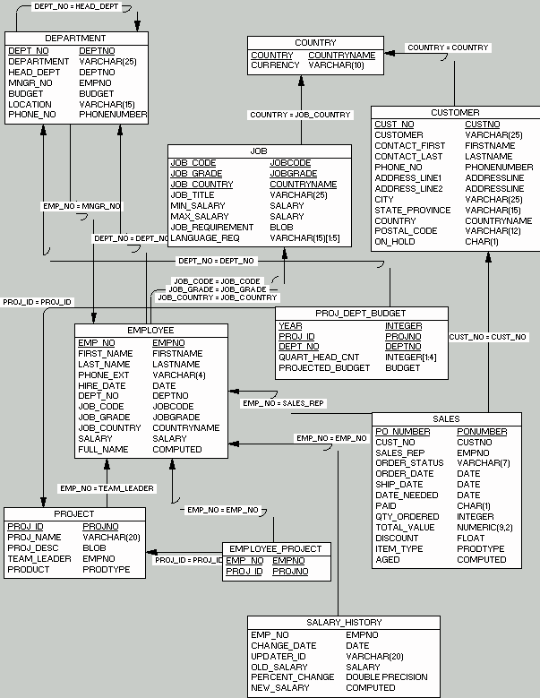
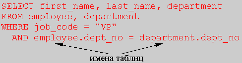
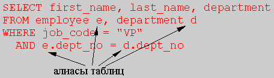

# Основы языка SQL

В статье доступным и понятным языком описываются основы SQL.
Она рассчитана как на профессиональных разработчиков приложений для баз данных,
так и не для особо опытных. 

При написании статьи использовалась следующая литература:

1. Шумаков П.В. - Delphi3 и создание приложений для баз данных;
2. Oracle University - Oracle 8i SQL Fundamentals, Student Guide;
3. Oracle University - PL/SQL Fundamentals, Student Guide;
4. Oracle Press, Christopher Allen - 101: Oracle PL/SQL.

**Примечание:**  
Если что то будет непонятно, или вы встретите по началу какие-либо трудности
в усвоении данного материала, то не отчаивайтесь.
Дальше будет очень подробно и детально рассмотрены все места,
которые могут вызвать у вас на первых порах затруднения. 

**P.S.**  
Ради справедливости, должен заметить, что очень многое, в данной статье
взято из книги Шумакова В.П. - "Delphi3 и создание приложений для баз данных".
Как я уже говорил рашьше, это пожалуй самая лучшая книга
по програмированию приложений для баз данных в среде Delphi.
Доходчивей и понятливей, объяснить данную тематику, чем написано в этой книги,
я думаю очень трудно.

----

Содержание:

- [ОБЗОР](#1)
- [СОСТАВ ЯЗЫКА SQL](#2)
- [РЕЛЯЦИОННЫЕ ОПЕРАЦИИ. КОМАНДЫ ЯЗЫКА МАНИПУЛИРОВАНИЯ ДАННЫМИ](#3)
- [КОМАНДА SELECT](#4)
    - [Простейшие конструкции команды SELECT](#5)
        - [Список полей](#6)
        - [Все поля](#7)
        - [Все поля в произвольном порядке](#8)
        - [Блобы](#9)
        - [Вычисления](#10)
        - [Литералы](#11)
        - [Конкатенация](#12)
        - [Использование квалификатора AS](#13)
        - [Работа с датами](#14)
        - [Агрегатные функции](#15)
        - [Предложение FROM команды SELECT](#16)
    - [Ограничения на число выводимых строк](#17)
        - [Операции сравнения](#18)
        - [BETWEEN](#19)
        - [IN](#20)
        - [LIKE](#21)
        - [CONTAINING](#22)
        - [IS NULL](#23)
        - [Логические операторы](#24)
    - [Преобразование типов (CAST)](#25)
    - [Изменение порядка выводимых строк (ORDER BY)](#26)
        - [Упорядочивание с использованием имен столбцов](#27)
        - [Упорядочивание с использованием номеров столбцов](#28)
    - [Устранение дублирования (модификатор DISTINCT)](#29)
    - [Соединение (JOIN)](#30)
        - [Внутренние соединения](#31)
        - [Самосоединения](#32)
        - [Внешние соединения](#33)

<a name="1"></a>

## Обзор

**SQL** (обычно  произносимый как "СИКВЭЛ" или "ЭСКЮЭЛЬ") символизирует
собой _Структурированный Язык Запросов_. Это - язык, который дает Вам
возможность создавать и работать в реляционных базах данных, являющихся
наборами связанной информации, сохраняемой в таблицах.

Информационное пространство становится более унифицированным. Это
привело к необходимости создания стандартного языка, который мог бы
использоваться в большом количестве различных видов компьютерных сред.
Стандартный язык позволит пользователям, знающим один набор команд,
использовать их для создания, нахождения, изменения и передачи
информации - независимо от того, работают ли они на персональном
компьютере, сетевой рабочей станции, или на универсальной ЭВМ.

В нашем все более и более взаимосвязанном компьютерном мире,
пользователь снабженый таким языком, имеет огромное преимущество в
использовании и обобщении информации из ряда источников с помощью
большого количества способов.

Элегантность и независимость от специфики компьютерных технологий, а
также его поддержка лидерами промышленности в области технологии
реляционных баз данных, сделало SQL (и, вероятно, в течение обозримого
будущего оставит его) основным стандартным языком. По этой причине,
любой, кто хочет работать с базами данных 90-х годов, должен знать SQL.

Стандарт SQL определяется ANSI (_Американским Национальным Институтом
Стандартов_) и в данное время также принимается ISO (Международной
Организацией по Стандартизации). Однако, большинство коммерческих
программ баз данных расширяют SQL без уведомления ANSI, добавляя
различные особенности в этот язык, которые, как они считают, будут
весьма полезны. Иногда они несколько нарушают стандарт языка, хотя
хорошие идеи имеют тенденцию развиваться и вскоре становиться
стандартами "рынка" сами по себе в силу полезности своих качеств.

На данном уроке мы будем, в основном, следовать стандарту ANSI, но
одновременно иногда будет показывать и некоторые наиболее общие
отклонения от его стандарта.

Точное описание особенностей языка приводится в документации на СУБД,
которую Вы используете. SQL системы InterBase 4.0 соответствует
стандарту ANSI-92 и частично стандарту ANSI-III.

<a name="2"></a>

## Состав языка SQL

**Язык SQL** предназначен для манипулирования данными в реляционных базах
данных, определения структуры баз данных и для управления правами
доступа к данным в многопользовательской среде.

Поэтому, в язык SQL в качестве составных частей входят:

- язык манипулирования данными (Data Manipulation Language, DML)
- язык определения данных (Data Definition Language, DDL)
- язык управления данными (Data Control Language, DCL).

Подчеркнем, что это не отдельные языки, а различные команды одного
языка. Такое деление проведено только лишь с точки зрения различного
функционального назначения этих команд.

**Язык манипулирования данными** используется, как это следует из его
названия, для манипулирования данными в таблицах баз данных. Он состоит
из 4 основных команд:

- SELECT (выбрать)
- INSERT (вставить)
- UPDATE (обновить)
- DELETE (удалить)

**Язык определения данных** используется для создания и изменения структуры
базы данных и ее составных частей - таблиц, индексов, представлений
(виртуальных таблиц), а также триггеров и сохраненных процедур.
Основными его командами являются:

- CREATE DATABASE                (создать базу данных)
- CREATE TABLE                (создать таблицу)
- CREATE VIEW                (создать виртуальную таблицу)
- CREATE INDEX                (создать индекс)
- CREATE TRIGGER                (создать триггер)
- CREATE PROCEDURE                (создать сохраненную процедуру)
- ALTER DATABASE                (модифицировать базу данных)
- ALTER TABLE                (модифицировать таблицу)
- ALTER VIEW                (модифицировать виртуальную таблицу)
- ALTER INDEX                (модифицировать индекс)
- ALTER TRIGGER                (модифицировать триггер)
- ALTER PROCEDURE                (модифицировать сохраненную процедуру)
- DROP DATABASE                (удалить базу данных)
- DROP TABLE                (удалить таблицу)
- DROP VIEW                (удалить виртуальную таблицу)
- DROP INDEX                (удалить индекс)
- DROP TRIGGER                (удалить триггер)
- DROP PROCEDURE                (удалить сохраненную процедуру)

**Язык управления данными** используется для управления правами доступа к
данным и выполнением процедур в многопользовательской среде. Более точно
его можно назвать "язык управления доступом". Он состоит из двух
основных команд:

- GRANT                (дать права)
- REVOKE                (забрать права)

С точки зрения прикладного интерфейса существуют две разновидности команд SQL:

- интерактивный SQL
- встроенный SQL.

**Интерактивный SQL** используется в специальных утилитах (типа WISQL или
DBD), позволяющих в интерактивном режиме вводить запросы с
использованием команд SQL, посылать их для выполнения на сервер и
получать результаты в предназначенном для этого окне.

**Встроенный SQL**
используется в прикладных программах, позволяя им посылать запросы к
серверу и обрабатывать полученные результаты, в том числе комбинируя
set-ориентированный и record-ориентированный подходы.

Мы не будем приводить точный синтаксис команд SQL, вместо этого мы
рассмотрим их на многочисленных примерах, что намного более важно для
понимания SQL, чем точный синтаксис, который можно посмотреть в
документации на Вашу СУБД.

Итак, начнем с рассмотрения команд языка манипулирования данными.

<a name="3"></a>

## Реляционные операции. Команды языка манипулирования данными

Наиболее важной командой языка манипулирования данными является команда
SELECT. За кажущейся простотой ее синтаксиса скрывается огромное
богатство возможностей. Нам важно научиться использовать это богатство!

На данном уроке предполагается, если не оговорено противное, что все
команды языка SQL вводятся интерактивным способом. В качестве
информационной основы для примеров мы будем использовать базу данных
"Служащие предприятия" (_employee.gdb_), входящую в поставку Delphi и
находящуюся (по умолчанию) в поддиректории \\IBLOCAL\\EXAMPLES.

:::{.center}
  
Рис. 1: Структура базы данных EMPLOYEE
:::

На рис.1 приведена схема базы данных EMPLOYEE для Local InterBase,
нарисованная с помощью CASE-средства S-Designor (см. доп. урок). На
схеме показаны таблицы базы данных и взаимосвязи, а также обозначены
первичные ключи и их связи с внешними ключами. Многие из примеров,
особенно в конце урока, являются весьма сложными. Однако, не следует на
этом основании делать вывод, что так сложен сам язык SQL. Дело, скорее,
в том, что обычные (стандартные) операции настолько просты в SQL, что
примеры таких операций оказываются довольно неинтересными и не
иллюстрируют полной мощности этого языка. Но в целях системности мы
пройдем по всем возможностям SQL: от самых простых - до чрезвычайно
сложных.

Начнем с базовых операций реляционных баз данных. Таковыми являются:

- выборка (Restriction)
- проекция (Projection)
- соединение (Join)
- объединение (Union)

Операция выборки позволяет получить все строки (записи) либо часть строк
одной таблицы.

```
SELECT * FROM country
```

Получить все строки таблицы Country 

|COUNTRY|CURRENCY|
|--------|--------|
|USA|Dollar|
|England|Pound|
|Canada|CdnDlr|
|Switzerland|SFranc|
|Japan|Yen|
|Italy|Lira|
|France|FFranc|
|Germany|D-Mark|
|Australia|ADollar|
|Hong Kong|HKDollar|
|Netherlands|Guilder|
|Belgium|BFranc|
|Austria|Schilling|
|Fiji|FDollar|

В этом примере и далее - для большей наглядности - все зарезервированные
слова языка SQL будем писать большими буквами. Красным цветом будем
записывать предложения SQL, а светло-синим - результаты выполнения
запросов.

```
SELECT * FROM country
WHERE currency = "Dollar".
```

Получить подмножество строк таблицы Country,
удовлетворяющее условию Currency = "Dollar"

Результат последней операции выглядит следующим образом:

```
COUNTRY         CURRENCY
=============== ==========
USA             Dollar
```

Операция проекции позволяет выделить подмножество столбцов таблицы.
Например:

```
SELECT currency FROM country
```

Получить список денежных единиц

```
CURRENCY
==========
Dollar
Pound
CdnDlr
SFranc
Yen
Lira
FFranc
D-Mark
ADollar
HKDollar
Guilder
BFranc
Schilling
FDollar
```

На практике очень часто требуется получить некое подмножество столбцов и
строк таблицы, т.е. выполнить комбинацию Restriction и Projection. Для
этого достаточно перечислить столбцы таблицы и наложить ограничения на
строки.

```
SELECT currency FROM country
WHERE country = "Japan".
```

Найти денежную единицу Японии

```
CURRENCY
==========
Yen
```

```
SELECT first_name, last_name
FROM employee
WHERE first_name = "Roger"
```

Получить фамилии работников, которых зовут "Roger"

|FIRST_NAME|LAST_NAME|
|--------|--------|
|Roger|De Souza|
|Roger|Reeves|

Эти примеры иллюстрируют общую форму команды SELECT в языке SQL
(для одной таблицы):

|SELECT|(выбрать) специфицированные поля|
|--------|--------|
|FROM|(из) специфицированной таблицы|
|WHERE|(где) некоторое специфицированное условие является истинны|

Операция соединения позволяет соединять строки из более чем одной
таблицы (по некоторому условию) для образования новых строк данных.

```
SELECT first_name, last_name, proj_name
FROM employee, project
WHERE emp_no = team_leader
```

Получить список руководителей проектов

|FIRST_NAME|LAST_NAME|PROJ_NAME|
|--------|--------|--------|
|Ashok|Ramanathan|Video Database|
|Pete|Fisher|DigiPizza|
|Chris|Papadopoulos|AutoMap|
|Bruce|Young|MapBrowser port|
|Mary S.|MacDonald|Marketing project 3|

Операция объединения позволяет объединять результаты отдельных запросов
по нескольким таблицам в единую результирующую таблицу. Таким образом,
предложение UNION объединяет вывод двух или более SQL-запросов в единый
набор строк и столбцов.

```
SELECT first_name, last_name, job_country
FROM employee
WHERE job_country = "France"
UNION
SELECT contact_first, contact_last, country
FROM customer
WHERE country = "France"
```

Получить список работников и заказчиков, проживающих во Франции

|FIRST_NAME|LAST_NAME|JOB_COUNTRY|
|--------|--------|--------|
|Jacques|Glon|France|
|Michelle|Roche|France|

Для справки, приведем общую форму команды SELECT, учитывающую
возможность соединения нескольких таблиц и объединения результатов:

    SELECT    [DISTINCT] список_выбираемых_элементов (полей)
    FROM      список_таблиц (или представлений)
    [WHERE    предикат]
    [GROUP BY поле (или поля) [HAVING предикат]]
    [UNION    другое_выражение_Select]
    [ORDER BY поле (или поля) или номер (номера)];
     
    Рис. 2: Общий формат команды SELECT

Отметим, что под предикатом понимается некоторое специфицированное
условие (отбора), значение которого имеет булевский тип.  Квадратные
скобки означают необязательность использования дополнительных
конструкций команды. Точка с запятой является стандартным терминатором
команды. Отметим, что в WISQL и в компоненте TQuery ставить конечный
терминатор не обязательно. При этом там, где допустим один пробел между
элементами, разрешено ставить любое количество пробелов и пустых строк -
выполняя желаемое форматирование для большей наглядности.

Гибкость и мощь языка SQL состоит в том, что он позволяет объединить все
операции реляционной алгебры в одной конструкции, "вытаскивая" таким
образом любую требуемую информацию, что очень часто и происходит на
практике.

<a name="4"></a>

## Команда SELECT

<a name="5"></a>

### Простейшие конструкции команды SELECT

Итак, начнем с рассмотрения простейших конструкций языка SQL. После
такого рассмотрения мы научимся:

- назначать поля, которые должны быть выбраны
- назначать к выборке "все поля"
- управлять "вертикальным" и "горизонтальным" порядком выбираемых полей
- подставлять собственные заголовки полей в результирующей таблице
- производить вычисления в списке выбираемых элементов
- использовать литералы в списке выбираемых элементов
- ограничивать число возвращаемых строк
- формировать сложные условия поиска, используя реляционные и логические операторы
- устранять одинаковые строки из результата.

Список выбираемых элементов может содержать следующее:

- имена полей
- *
- вычисления
- литералы
- функции
- агрегирующие конструкции

<a name="6"></a>

#### Список полей

```
SELECT first_name, last_name, phone_no
FROM phone_list
```

получить список имен, фамилий и служебных телефонов всех работников предприятия

|FIRST_NAME|LAST_NAME|PHONE_NO|
|--------|--------|--------|
|Terri|Lee|(408) 555-1234|
|Oliver H.|Bender|(408) 555-1234|
|Mary S.|MacDonald|(415) 555-1234|
|Michael|Yanowski|(415) 555-1234|
|Robert|Nelson|(408) 555-1234|
|Kelly|Brown|(408) 555-1234|
|Stewart|Hall|(408) 555-1234|
|... | | |

Отметим, что PHONE\_LIST - это виртуальная таблица (представление),
созданная в InterBase и основанная на информации из двух таблиц -
EMPLOYEE и DEPARTMENT.  Она не показана на рис.1, однако, как мы уже
указывали в общей структуре команды SELECT, к ней можно обращаться так
же, как и к "настоящей" таблице.

<a name="7"></a>

#### Все поля

```
SELECT *
FROM phone_list
```

получить список служебных телефонов всех работников предприятия со всей необходимой информацией

|EMP_NO|FIRST_NAME|LAST_NAME|PHONE_EXT|LOCATION|PHONE_NO|
|--------|--------|--------|--------|--------|--------|
|12|Terri|Lee|256|Monterey|(408) 555-1234|
|105|Oliver H.|Bender|255|Monterey|(408) 555-1234|
|85|Mary S.|MacDonald|477|San Francisco|(415) 555-1234|
|127|Michael|Yanowski|492|San Francisco|(415) 555-1234|
|2|Robert|Nelson|250|Monterey|(408) 555-1234|
|109|Kelly|Brown|202|Monterey|(408) 555-1234|
|14|Stewart|Hall|227|Monterey|(408) 555-1234|
|... | | | | | |

<a name="8"></a>

#### Все поля в произвольном порядке

```
SELECT first_name, last_name, phone_no,
       location, phone_ext, emp_no
FROM phone_list
```

получить список служебных телефонов всех работников предприятия
со всей необходимой информацией, расположив их в требуемом порядке

|FIRST_NAME| LAST_NAME| PHONE_NO|LOCATION|PHONE_EXT| EMP_NO|
|--------|--------|--------|--------|--------|--------|
|Terri|Lee|(408) 555-1234| Monterey|256|12|
|Oliver H.|Bender|(408) 555-1234| Monterey|255|105|
|Mary S.|MacDonald|(415) 555-1234| San Francisco| 477|85|
|Michael|Yanowski|(415) 555-1234| San Francisco| 492|127|
|Robert|Nelson|(408) 555-1234| Monterey|250|2|
|Kelly|Brown|(408) 555-1234| Monterey|202|109|
|Stewart|Hall|(408) 555-1234| Monterey|227|14|
|... | | | | | |

<a name="9"></a>

#### Блобы

Получение информации о BLOb выглядит совершенно аналогично обычным
полям. Полученные значения можно отображать с использованием data-aware
компонент Delphi, например,  TDBMemo или TDBGrid. Однако, в последнем
случае придется самому прорисовывать содержимое блоба (например, через
OnDrawDataCell). Подробнее об этом см. на уроке,  посвященном работе с
полями.

```
SELECT job_requirement
FROM job
```

получить список должностных требований к кандидатам на работу

```
JOB_REQUIREMENT:
No specific requirements.
JOB_REQUIREMENT:
15+ years in finance or 5+ years as a CFO
with a proven track record.
MBA or J.D. degree.
...
```

<a name="10"></a>

#### Вычисления

```
SELECT emp_no, salary, salary * 1.15
FROM employee
```

получить список номеров служащих и их зарплату, в том числе увеличенную на 15%

|EMP_NO|SALARY||
|--------|--------|--------|
| 2|105900.00|121785|
| 4| 97500.00|112125|
| 5|102750.00|118162.5|
| 8| 64635.00|74330.25|
| 9| 75060.00|86319|
|11| 86292.94|99236.87812499999|
|12| 53793.00|61861.95|
|14| 69482.62|79905.01874999999|
|... | | |

Порядок вычисления выражений подчиняется общепринятым правилам: сначала
выполняется умножение и деление, а затем - сложение и вычитание.
Операции одного уровня выполняются слева направо. Разрешено применять
скобки для изменения порядка вычислений.

Например, в выражении col1 + col2 * col3 сначала находится произведение
значений столбцов col2 и col3, а затем результат этого умножения
складывается со значением столбца col1. А в выражении (col1 + col2) *
col3 сначала выполняется сложение значений столбцов col1 и col2, и
только после этого результат умножается на значение столбца col3.

<a name="11"></a>

#### Литералы

Для придания большей наглядности получаемому результату можно
использовать литералы. Литералы - это строковые константы, которые
применяются наряду с наименованиями столбцов и, таким образом, выступают
в роли "псевдостолбцов". Строка символов, представляющая собой
литерал, должна быть заключена в одинарные или двойные скобки.

```
SELECT first_name, "получает", salary,
       "долларов в год"
FROM employee
```

получить список сотрудников и их зарплату

|FIRST_NAME| |SALARY| |
|--------|--------|--------|-------------|
|Robert|получает|105900.00|долларов в год|
|Bruce| получает|97500.00|долларов в год|
|Kim|получает|102750.00|долларов в год|
|Leslie|получает|64635.00|долларов в год|
|Phil|получает|75060.00|долларов в год|
|K. J.|получает|86292.94|долларов в год|
|Terri|получает|53793.00|долларов в год|

<a name="12"></a>

#### Конкатенация

Имеется возможность соединять два или более столбца, имеющие строковый
тип, друг с другом, а также соединять их с литералами. Для этого
используется операция конкатенации (\|\|).

```
SELECT "сотрудник " || first_name || " " ||
         last_name
FROM employee
```

получить список всех сотрудников

```
==============================================
сотрудник    Robert Nelson
сотрудник Bruce Young
сотрудник Kim Lambert
сотрудник Leslie Johnson
сотрудник Phil Forest
сотрудник K. J. Weston
сотрудник Terri Lee
сотрудник Stewart Hall
... 
```

<a name="13"></a>

#### Использование квалификатора AS

Для придания наглядности получаемым результатам наряду с литералами в
списке выбираемых элементов можно использовать квалификатор AS. Данный
квалификатор заменяет в результирующей таблице существующее название
столбца на заданное. Это наиболее эффективный и простой способ создания
заголовков (к сожалению, InterBase, как уже отмечалось, не поддерживает
использование русских букв в наименовании столбцов).

```
SELECT count(*) AS number
FROM employee
```

подсчитать количество служащих

```
     NUMBER
===========
         42
```

```
SELECT "сотрудник " || first_name || " " ||
              last_name AS employee_list
FROM employee
```

получить список всех сотрудников

```
EMPLOYEE_LIST
==============================================
сотрудник Robert Nelson
сотрудник Bruce Young
сотрудник Kim Lambert
сотрудник Leslie Johnson
сотрудник Phil Forest
сотрудник K. J. Weston
сотрудник Terri Lee
сотрудник Stewart Hall
... 
```

<a name="14"></a>

#### Работа с датами

Мы уже рассказывали о типах данных, имеющихся в различных СУБД, в том
числе и в InterBase. В разных системах имеется различное число
встроенных функций, упрощающих работу с датами, строками и другими
типами данных. InterBase, к сожалению, обладает достаточно ограниченным
набором таких функций. Однако, поскольку язык SQL, реализованный в
InterBase, соответствует стандарту, то в нем имеются возможности
конвертации дат в строки и гибкой работы с датами. Внутренне дата в
InterBase содержит значения даты и времени. Внешне дата может быть
представлена строками различных форматов, например:

- "October 27, 1995"
- "27-OCT-1994"
- "10-27-95"
- "10/27/95"
- "27.10.95"

Кроме абсолютных дат, в SQL-выражениях можно также пользоваться
относительным заданием дат:

- "yesterday" - вчера
- "today" - сегодня
- "now" - сейчас (включая время)
- "tomorrow" - завтра

Дата может неявно конвертироваться в строку (из строки), если:

- строка, представляющая дату, имеет один из вышеперечисленных форматов;
- выражение не содержит неоднозначностей в толковании типов столбцов.

```
SELECT first_name, last_name, hire_date
FROM employee
WHERE hire_date > '1-1-94'
```

получить список сотрудников, принятых на работу после 1 января 1994 года

|FIRST_NAME|LAST_NAME| HIRE_DATE|
|--------|--------|--------|
|Pierre|Osborne|3-JAN-1994|
|John|Montgomery|30-MAR-1994|
|Mark|Guckenheimer|2-MAY-1994|

Значения дат можно сравнивать друг с другом, сравнивать с относительными
датами, вычитать одну дату из другой.

```
SELECT first_name, last_name, hire_date
FROM employee
WHERE 'today' - hire_date > 365 * 7 + 1
```

получить список служащих, проработавших на предприятии 
к настоящему времени более 7 лет

|FIRST_NAME|LAST_NAME|HIRE_DATE|
|--------|--------|--------|
|Robert|Nelson|28-DEC-1988|
|Bruce|Young|28-DEC-1988|

<a name="15"></a>

#### Агрегатные функции

К агрегирующим функциям относятся функции вычисления суммы (SUM),
максимального (SUM) и минимального (MIN) значений столбцов,
арифметического среднего (AVG), а также количества строк,
удовлетворяющих заданному условию (COUNT).

 

```
SELECT count(*), sum (budget), avg (budget),
      min (budget), max (budget)
FROM department
WHERE head_dept = 100
```

вычислить: количество отделов, являющихся подразделениями отдела 100
(Маркетинг и продажи), их суммарный, средний, минимальный
и максимальный бюджеты

|COUNT|SUM|AVG|MIN|MAX|
|--------|--------|--------|--------|--------|
|5|3800000.00|760000.00|500000.00|1500000.00|

<a name="16"></a>

#### Предложение FROM команды SELECT

В предложении FROM перечисляются все объекты (один или несколько), из
которых производится выборка данных (рис.2). Каждая таблица или
представление, о которых упоминается в запросе, должны быть перечислены
в предложении FROM.

<a name="17"></a>

### Ограничения на число выводимых строк

Число возвращаемых в результате запроса строк может быть ограничено
путем использования предложения WHERE, содержащего условия отбора
(предикат, рис.2). Условие отбора для отдельных строк может принимать
значения true, false или unnown. При этом запрос возвращает в качестве
результата только те строки (записи), для которых предикат имеет
значение true.

Типы предикатов, используемых в предложении WHERE:

- сравнение с использованием реляционных операторов
    -  =	равно
    -  <\>	не равно
    -  !=	не равно
    -  \>  больше
    -  <  меньше
    -  \>= больше или равно
    -  <= меньше или равно
- BETWEEN
- IN
- LIKE
- CONTAINING
- IS NULL
- EXIST
- ANY
- ALL

<a name="18"></a>

#### Операции сравнения

Рассмотрим операции сравнения. Реляционные операторы могут
использоваться с различными элементами. При этом важно соблюдать
следующее правило: элементы должны иметь сравнимые типы. Если в базе
данных определены домены, то сравниваемые элементы должны относиться к
одному домену.

Что же может быть элементом сравнения? Элементом сравнения может
выступать:

- значение поля
- литерал
- арифметическое выражение
- агрегирующая функция
- другая встроенная функция
- значение (значения), возвращаемые подзапросом.

При сравнении литералов конечные пробелы игнорируются.
Так, предложение

```
WHERE first_name = 'Петр    '
```

будет иметь тот же результат, что и предложение

```
WHERE first_name = 'Петр'
```

```
SELECT first_name, last_name, dept_no
FROM employee
WHERE job_code = "Admin"
```

получить список  сотрудников (и номера их отделов), занимающих должность администраторов

|FIRST_NAME|LAST_NAME |DEPT_NO|
|--------|--------|--------|
|Terri|Leev|000|
|Ann|Bennet|120|
|Sue Anne|O'Brien|670|
|Kelly|Brown|600|

```
SELECT first_name, last_name, dept_no,
       job_country
FROM employee
WHERE job_country <> "USA"
```

получить список сотрудников (а также номера их отделов и страну), работающих вне США

|FIRST_NAME|LAST_NAME| DEPT_NO| JOB_COUNTRY|
|--------|--------|--------|--------|
|Ann|Bennet|120|England|
|Roger|Reeves|120|England|
|Willie|Stansbury|120|England|
|Claudia|Sutherland|140|Canada|
|Yuki|Ichida|115|Japan|
|Takashi|Yamamoto|115|Japan|
|Roberto|Ferrari|125|Italy|
|Jacques|Glon|123|France|
|Pierre|Osborne|121|Switzerland |

<a name="19"></a>

#### BETWEEN

Предикат BETWEEN задает диапазон значений, для которого выражение
принимает значение `true`. Разрешено также использовать конструкцию 
`NOT BETWEEN`.

```
SELECT first_name, last_name, salary
FROM employee
WHERE salary BETWEEN 20000 AND 30000
```

получить список сотрудников, годовая зарплата которых больше 20000 и меньше 30000

|FIRST_NAME|LAST_NAME|SALARY|
|--------|--------|--------|
|Ann|Bennet|22935.00|
|Kelly|Brown|27000.00|

Тот же запрос с использованием операторов сравнения будет выглядеть следующим образом:

```
SELECT first_name, last_name, salary
FROM employee
WHERE salary >= 20000
  AND salary <= 30000
```

получить список сотрудников, годовая зарплата которых больше 20000 и меньше 30000

|FIRST_NAME|LAST_NAME|SALARY|
|--------|--------|--------|
|Ann|Bennet|22935.00|
|Kelly|Brown|27000.00|

Запрос с предикатом BETWEEN может иметь следующий вид:

```
SELECT first_name, last_name, salary
FROM employee
WHERE last_name BETWEEN "Nelson" AND "Osborne"
```

получить список сотрудников, фамилии которых начинаются с "Nelson"
и заканчиваются "Osborne"

|FIRST_NAME|LAST_NAME|SALARY|
|--------|--------|--------|
|Robert|Nelson|105900.00|
|Carol|Nordstrom|42742.50|
|Sue Anne|O'Brien|31275.00|
|Pierre|Osborne|110000.00|

Значения, определяющие нижний и верхний диапазоны, могут не являться
реальными величинами из базы данных. И это очень удобно - ведь мы не
всегда можем указать точные значения диапазонов!

```
SELECT first_name, last_name, salary
FROM employee
WHERE last_name BETWEEN "Nel" AND "Osb"
```

получить список сотрудников, фамилии которых находятся между  "Nel" и "Osb"

|FIRST_NAME|LAST_NAME|SALARY|
|--------|--------|--------|
|Robert|Nelson|105900.00|
|Carol|Nordstrom|42742.50|
|Sue Anne|O'Brien|31275.00|

В данном примере значений "Nel" и "Osb" в базе данных нет. Однако,
все сотрудники, входящие в диапазон, в нижней части которого начало
фамилий совпадает с "Nel" (т.е. выполняется условие "больше или
равно"), а в верхней части фамилия не более "Osb" (т.е. выполняется
условие "меньше или равно" - а именно "O", "Os", "Osb"), попадут
в выборку. Отметим, что при выборке с использованием предиката BETWEEN
поле, на которое накладывается диапазон, считается упорядоченным по
возрастанию.

Предикат BETWEEN с отрицанием NOT (NOT BETWEEN) позволяет получить
выборку записей, указанные поля которых имеют значения меньше нижней
границы и больше верхней границы.

```
SELECT first_name, last_name, hire_date
FROM employee
WHERE hire_date NOT BETWEEN "1-JAN-1989" AND "31-DEC-1993"
```

получить список самых "старых" и самых "молодых" (по времени поступления на работу) сотрудников

|FIRST_NAME|LAST_NAME|HIRE_DATE|
|--------|--------|--------|
|Robert|Nelson|28-DEC-1988|
|Bruce|Young|28-DEC-1988|
|Pierre|Osborne|3-JAN-1994|
|John|Montgomery|30-MAR-1994|
|Mark|Guckenheimer| 2-MAY-1994|

<a name="20"></a>

#### IN

Предикат IN проверяет, входит ли заданное значение, предшествующее
ключевому слову "IN" (например, значение столбца или функция от него)
в указанный в скобках список. Если заданное проверяемое значение равно
какому-либо элементу в списке, то предикат принимает значение `true`.
Разрешено также использовать конструкцию `NOT IN`.

```
SELECT first_name, last_name, job_code
FROM employee
WHERE job_code IN ("VP", "Admin", "Finan")
```

получить список сотрудников, занимающих должности "вице-президент",
"администратор", "финансовый директор"

|FIRST_NAME|LAST_NAME|JOB_CODE|
|--------|--------|--------|
|Robert|Nelson|VP|
|Terri|Lee|Admin|
|Stewart|Hall|Finan|
|Ann|Bennet|Admin|
|Sue Anne|O'Brien |Admin|
|Mary S.|MacDonald|VP|
|Kelly|Brown|Admin|

А вот пример запроса, использующего предикат  NOT  IN:

```
SELECT first_name, last_name, job_country
FROM employee
WHERE job_country NOT IN
      ("USA", "Japan", "England")
```

получить список сотрудников, работающих не в США, не в Японии и не в Великобритании

|FIRST_NAME|LAST_NAME|JOB_COUNTRY|
|--------|--------|--------|
|Claudia |Sutherland|Canada|
|Roberto|Ferrari|Italy|
|Jacques|Glon|France|
|Pierre |Osborne|Switzerland|

<a name="21"></a>

#### LIKE

Предикат LIKE используется только с символьными данными. Он проверяет,
соответствует ли данное символьное значение строке с указанной маской. В
качестве маски используются все разрешенные символы (с учетом верхнего и
нижнего регистров), а также специальные символы:

- % - замещает любое количество символов (в том числе и 0),
- \_  - замещает только один символ.

Разрешено также использовать конструкцию  NOT  LIKE.

```
SELECT first_name, last_name
FROM employee
WHERE last_name LIKE "F%"
```

получить список сотрудников, фамилии которых начинаются с буквы "F"

|FIRST_NAME|LAST_NAME|
|--------|--------|
|Phil|Forest|
|Pete |Fisher|
|Roberto|Ferrari|

```
SELECT first_name, last_name
FROM employee
WHERE first_name LIKE "%er"
```

получить список сотрудников, имена которых заканчиваются буквами "er"

|FIRST_NAME|LAST_NAME|
|----------|---------|
|Roger|De Souza|
|Roger|Reeves|
|Walter|Steadman|

А такой запрос позволяет решить проблему произношения (и написания) имени:

```
SELECT first_name, last_name
FROM employee
WHERE first_name LIKE "Jacq_es"
```

найти сотрудника(ов), в имени  которого неизвестно произношение буквы перед окончанием "es"

FIRST_NAME|LAST_NAME|
|--------|--------|
|Jacques|Glon|

Что делать, если требуется найти строку, которая содержит указанные выше
специальные символы ("%", "\_") в качестве информационных символов?
Есть выход! Для этого с помощью ключевого слова ESCAPE нужно определить
так называемый escape-символ, который, будучи поставленным перед
символом "%" или "\_", укажет, что этот символ является
информационным. Escape-символ не может быть символом "\\" (обратная
косая черта) и, вообще говоря, должен представлять собой символ, никогда
не появляющийся в упоминаемом столбце как информационный символ. Часто
для этих целей используются символы "@" и "~".

```sql
SELECT first_name, last_name
FROM employee
WHERE first_name LIKE "%@_%" ESCAPE "@"
```

получить список сотрудников, в имени которых содержится "\_" (знак подчеркивания)

<a name="22"></a>

#### CONTAINING

Предикат CONTAINING аналогичен предикату LIKE, за исключением того, что
он не чувствителен к регистру букв. Разрешено также использовать
конструкцию `NOT CONTAINING`.

```sql
SELECT first_name, last_name
FROM employee
WHERE last_name CONTAINING "ne"
```

получить список сотрудников, фамилии которых содержат буквы "ne", "Ne", "NE", "nE"

|FIRST_NAME|LAST_NAME|
|--------|--------|
|Robert|Nelson|
|Ann|Bennet|
|Pierre|Osborne|

<a name="23"></a>

#### IS NULL

В SQL-запросах NULL означает, что значение столбца неизвестно. Поисковые
условия, в которых значение столбца сравнивается с NULL, всегда
принимают значение unknown (и, соответственно, приводят к ошибке), в
противоположность true или false, т.е.

```
WHERE dept_no = NULL
```

или даже

```
WHERE NULL = NULL
```

Предикат  IS NULL принимает значение true только тогда, когда выражение
слева от ключевых слов "IS NULL" имеет значение null (пусто, не
определено). Разрешено также использовать конструкцию  IS NOT NULL,
которая означает "не пусто", "имеет какое-либо значение".

```
SELECT department, mngr_no
FROM department
WHERE mngr_no IS NULL
```

получить список отделов, в которых еще не назначены начальники

|DEPARTMENT|MNGR_NO|
|--------|--------|
|Marketing|<null>|
|Software Products Div.|<null>|
|Software Development|<null>|
|Field Office: Singapore|<null>|

Предикаты EXIST, ANY, ALL, SOME, SINGULAR мы рассмотрим в разделе,
рассказывающем о подзапросах.

<a name="24"></a>

#### Логические операторы

К логическим операторам относятся известные операторы AND, OR, NOT,
позволяющие выполнять различные логические действия: логическое
умножение (AND, "пересечение условий"), логическое сложение (OR,
"объединение условий"), логическое отрицание (NOT, "отрицание
условий"). В наших примерах мы уже применяли оператор AND.
Использование этих операторов позволяет гибко "настроить" условия
отбора записей.

Оператор AND означает, что общий предикат будет истинным только тогда,
когда условия, связанные по "AND", будут истинны.

Оператор OR означает, что общий предикат будет истинным, когда хотя бы
одно из условий, связанных по "OR", будет истинным.

Оператор NOT означает, что общий предикат будет истинным, когда условие,
перед которым стоит этот оператор, будет ложным.

В одном предикате логические операторы выполняются в следующем порядке:
сначала выполняется оператор NOT, затем - AND и только после этого -
оператор OR. Для изменения порядка выполнения операторов разрешается
использовать скобки.

```
SELECT first_name, last_name, dept_no,
       job_code, salary
FROM employee
WHERE dept_no = 622
   OR job_code = "Eng"
  AND salary <= 40000
ORDER BY last_name
```

получить список служащих, занятых в отделе 622 или на должности "инженер"
с зарплатой не выше 40000

|FIRST_NAME|LAST_NAME|DEPT_NO|JOB_CODE|SALARY|
|--------|--------|--------|--------|--------|
|Jennifer M.|Burbank|622 |Eng|53167.50|
|Phil|Forest|622|Mngr|75060.00|
|T.J.|Green|621|Eng|36000.00|
|Mark|Guckenheimer|622|Eng|32000.00|
|John|Montgomery|672|Eng|35000.00|
|Bill|Parker|623|Eng|35000.00|
|Willie|Stansbury|120|Eng|39224.06|

```
SELECT first_name, last_name, dept_no,
       job_code, salary
FROM employee
WHERE (dept_no = 622
   OR job_code = "Eng")
  AND salary <= 40000
ORDER BY last_name
```

получить список служащих, занятых в отделе 622 или на должности "инженер",
зарплата которых не выше 40000

|FIRST_NAME |LAST_NAME|DEPT_NO|JOB_CODE|SALARY|
|--------|--------|--------|--------|--------|
|T.J.|Green|621|Eng|36000.00|
|Mark|Guckenheimer|622|Eng|32000.00|
|John|Montgomery|672|Eng|35000.00|
|Bill|Parker|623|Eng|35000.00|
|Willie|Stansbury|120|Eng|39224.06|

<a name="25"></a>

### Преобразование типов (CAST)

В SQL имеется возможность преобразовать значение столбца или функции к
другому типу для более гибкого использования операций сравнения. Для
этого используется функция CAST.

Типы данных могут быть конвертированы в соответствии со следующей
таблицей:

|Из типа данных|В тип данных|
|--------|--------|
|NUMERIC CHAR,|VARCHAR, DATE|
|CHAR, VARCHAR|NUMERIC, DATE|
|DATE CHAR,|VARCHAR, DATE|

```
SELECT first_name, last_name, dept_no
FROM employee
WHERE CAST(dept_no AS char(20))
      CONTAINING "00"
```

получить список сотрудников, занятых в отделах, номера которых содержат "00"

|FIRST_NAME|LAST_NAME |DEPT_NO|
|--------|--------|--------|
|Robert|Nelson|600|
|Terri|Lee|000|
|Stewart|Hall|900|
|Walter|Steadman|900|
|Mary S.|MacDonald|100|
|Oliver H.|Bender|000|
|Kelly|Brown|600|
|Michael|Yanowski|100|

<a name="26"></a>

### Изменение порядка выводимых строк (ORDER BY)

Порядок выводимых строк может быть изменен с помощью опционального
(дополнительного) предложения ORDER BY в конце SQL-запроса.
Это предложение имеет вид:

```
ORDER BY <порядок строк> [ASC | DESC]
```

Порядок строк может задаваться одним из двух способов:

- именами столбцов
- номерами столбцов.

Способ упорядочивания определяется дополнительными зарезервированными
словами ASC и DESC. Способом по умолчанию - если ничего не указано -
является упорядочивание "по возрастанию" (ASC). Если же указано слово
"DESC", то упорядочивание будет производиться "по убыванию".

Подчеркнем еще раз, что предложение ORDER BY должно указываться в самом
конце запроса.

<a name="27"></a>

#### Упорядочивание с использованием имен столбцов

```
SELECT first_name, last_name, dept_no,
       job_code, salary
FROM employee
ORDER BY last_name
```

получить список сотрудников, упорядоченный по фамилиям в алфавитном порядке

|FIRST_NAME|LAST_NAME|DEPT_NO| JOB_CODE|SALARY|
|--------|--------|--------|--------|--------|
|Janet|Baldwin|110|Sales|61637.81|
|Oliver H.|Bender|000|CEO|212850.00|
|Ann|Bennet|120|Admin|22935.00|
|Dana|Bishop|621|Eng|62550.00|
|Kelly|Brown|600|Admin|27000.00|
|Jennifer M.|Burbank|622|Eng|53167.50|
|Kevin|Cook|670|Dir|111262.50|
|Roger|De Souza|623|Eng|69482.62|
|Roberto|Ferrari|125|SRep|99000000.00|

```
SELECT first_name, last_name, dept_no,
       job_code, salary
FROM employee
ORDER BY last_name DESC
```

получить список сотрудников, упорядоченный по фамилиям в порядке, обратном  алфавитному

|FIRST_NAME|LAST_NAME|DEPT_NO|JOB_CODE|SALARY|
|--------|--------|--------|--------|--------|
|Katherine|Young|623|Mngr|67241.25|
|Bruce|Young|621|Eng|97500.00|
|Michael|Yanowski|100|SRep|44000.00|
|Takashi|Yamamoto|115|SRep|7480000.00|
|Randy|Williams|672|Mngr|56295.00|
|K. J.|Weston|130|SRep|86292.94|
|Claudia|Sutherland|140|SRep|100914.00|
|Walter|Steadman|900|CFO|116100.00|
|Willie|Stansbury|120|Eng|39224.06|
|Roger|Reeves|120|Sales|33620.62|

Столбец, определяющий порядок вывода строк, не обязательно должен
присутствовать в списке выбираемых элементов (столбцов):

```
SELECT first_name, last_name, dept_no,
       job_code
FROM employee
ORDER BY salary
```

получить список сотрудников, упорядоченный по их зарплате

|FIRST_NAME|LAST_NAME|DEPT_NO|JOB_CODE|
|--------|--------|--------|--------|
|Ann|Bennet|120|Admin|
|Kelly|Brown|600|Admin|
|Sue Anne|O'Brien|670|Admin|
|Mark|Guckenheimer|622|Eng|
|Roger|Reeves|120|Sales|
|Bill|Parker|623|Eng|

<a name="28"></a>

#### Упорядочивание с использованием номеров столбцов

```
SELECT first_name, last_name, dept_no,
       job_code, salary * 1.1
FROM employee
ORDER BY 5
```

получить список сотрудников, упорядоченный по их зарплате с 10% надбавкой

|FIRST_NAME|LAST_NAME|DEPT_NO|JOB_CODE| |
|--------|--------|--------|--------|--------|
|Ann|Bennet|120|Admin|25228.5|
|Kelly|Brown|600|Admin|29700|
|Sue Anne|O'Brien|670|Admin|34402.5|
|Mark|Guckenheimer|622|Eng|35200|
|Roger|Reeves|120|Sales|36982.6875|
|Bill|Parker |623|Eng|38500|

Допускается использование нескольких уровней вложенности при
упорядочивании выводимой информации по столбцам; при этом разрешается
смешивать оба способа.

```
SELECT first_name, last_name, dept_no,
       job_code, salary * 1.1
FROM employee
ORDER BY dept_no, 5 DESC, last_name
```

получить список сотрудников, упорядоченный сначала по номерам отделов,
в отделах - по убыванию их зарплаты (с 10%),
а в пределах одной зарплаты - по фамилиям

|FIRST_NAME|LAST_NAME|DEPT_NO|JOB_CODE| |
|--------|--------|--------|--------|--------|
|Oliver H.|Bender|000|CEO|234135|
|Terri|Lee|000|Admin|59172.3|
|Mary S.|MacDonald|100|VP|122388.75|
|Michael|Yanowski|100|SRep|48400.000000001|
|Luke|Leung|110|SRep|75685.5|
|Janet|Baldwin|110|Sales|67801.59375|
|Takashi|Yamamoto|115|SRep|8228000.0000001|
|Yuki|Ichida|115|Eng|6600000.0000001 |

<a name="29"></a>

### Устранение дублирования (модификатор DISTINCT)

Дублированными являются такие строки в результирующей таблице, в которых
идентичен каждый столбец.

Иногда (в зависимости от задачи) бывает необходимо устранить все повторы
строк из результирующего набора. Этой цели служит модификатор DISTINCT.
Данный модификатор может быть указан только один раз в списке выбираемых
элементов и действует на весь список.

```
SELECT job_code
FROM employee
```

получить список должностей сотрудников

```
JOB_CODE
========
VP
Eng
Eng
Mktg
Mngr
SRep
Admin
Finan
Mngr
Mngr
Eng
...
```

Данный пример некорректно решает задачу "получения" списка должностей
сотрудников предприятия, так как в нем имеются многочисленные повторы,
затрудняющие восприятие информации. Тот же запрос, включающий
модификатор DISTINCT, устраняющий дублирование, дает верный результат.

```
SELECT DISTINCT job_code
FROM employee
```

получить список должностей сотрудников

```
JOB_CODE
========
Admin
CEO
CFO
Dir
Doc
Eng
Finan
Mktg
Mngr
PRel
SRep
Sales
VP
```

Два следующих примера показывают, что модификатор DISTINCT действует на
всю строку сразу. 

```
SELECT first_name, last_name
FROM employee
WHERE first_name = "Roger"
```

получить список служащих, имена которых - Roger

|FIRST_NAME|LAST_NAME|
|--------|--------|
|Roger|De Souza|
|Roger|Reeves|

```
SELECT DISTINCT first_name, last_name
FROM employee
WHERE first_name = "Roger"
```

получить список служащих, имена которых - Roger

|FIRST_NAME|LAST_NAME  |
|--------|--------|
|Roger|De Souza|
|Roger|Reeves|

<a name="30"></a>

### Соединение (JOIN)

Операция соединения используется в языке SQL для вывода связанной
информации, хранящейся в нескольких таблицах, в одном запросе. В этом
проявляется одна из наиболее важных особенностей запросов SQL -
способность определять связи между многочисленными таблицами и выводить
информацию из них в рамках этих связей. Именно эта операция придает
гибкость и легкость языку SQL.

После изучения этого раздела мы будем способны:

- соединять данные из нескольких таблиц в единую результирующую таблицу;
- задавать имена столбцов двумя способами;
- записывать внешние соединения;
- создавать соединения таблицы с собой.

Операции соединения подразделяются на два вида - внутренние и внешние.
Оба вида соединений задаются в предложении WHERE запроса SELECT с
помощью специального условия соединения. Внешние соединения (о которых
мы поговорим позднее) поддерживаются стандартом ANSI-92 и содержат
зарезервированное слово "JOIN", в то время как внутренние соединения
(или просто соединения) могут задаваться как без использования такого
слова (в стандарте ANSI-89), так и с использованием слова "JOIN" (в
стандарте ANSI-92).

Связывание производится, как правило, по первичному ключу одной таблицы
и внешнему ключу другой таблицы - для каждой пары таблиц. При этом очень
важно учитывать все поля внешнего ключа, иначе результат будет искажен.
Соединяемые поля могут (но не обязаны!) присутствовать в списке
выбираемых элементов. Предложение WHERE может содержать множественные
условия соединений. Условие соединения может также комбинироваться с
другими предикатами в предложении WHERE.

<a name="31"></a>

#### Внутренние соединения

Внутреннее соединение возвращает только те строки, для которых условие
соединения принимает значение true.

```
SELECT first_name, last_name, department
FROM employee, department
WHERE job_code = "VP"
```

получить список сотрудников, состоящих в должности "вице-президент",
а также названия их отделов

|FIRST_NAME|LAST_NAME|DEPARTMENT|
|--------|--------|--------|
|Robert|Nelson|Corporate Headquarters|
|Mary S.|MacDonald|Corporate Headquarters|
|Robert|Nelson|Sales and Marketing|
|Mary S.|MacDonald|Sales and Marketing|
|Robert|Nelson|Engineering|
|Mary S.|MacDonald|Engineering|
|Robert|Nelson|Finance|
|Mary S.|MacDonald|Finance|

Этот запрос ("без соединения") возвращает неверный результат, так как
имеющиеся между таблицами связи не задействованы. Отсюда и появляется
дублирование информации в результирующей таблице. Правильный результат
дает запрос с использованием операции соединения:

```
SELECT first_name, last_name, department
  FROM employee, department
 WHERE job_code = "VP"
   AND employee.dept_no = department.dept_no
```



получить список сотрудников, состоящих в должности "вице-президент",
а также названия их отделов

|FIRST_NAME|LAST_NAME|DEPARTMENT |
|--------|--------|--------|
|Robert|Nelson|Engineering|
|Mary S.|MacDonald|Sales and Marketing|

В вышеприведенном запросе использовался способ непосредственного
указания таблиц с помощью их имен. Возможен (а иногда и просто
необходим) также способ указания таблиц с помощью алиасов (псевдонимов).
При этом алиасы определяются в предложении FROM запроса SELECT и
представляют собой любой допустимый идентификатор, написание которого
подчиняется таким же правилам, что и написание имен таблиц. Потребность
в алиасах таблиц возникает тогда, когда названия столбцов, используемых
в условиях соединения двух (или более) таблиц, совпадают, а названия
таблиц слишком длинны...

**Замечание 1:**
в одном запросе нельзя смешивать использование написания
имен таблиц и их алиасов.

**Замечание 2:**
алиасы таблиц могут совпадать с их именами.



```
SELECT first_name, last_name, department
FROM employee e, department d
WHERE job_code = "VP"
AND e.dept_no = d.dept_no
```

получить список сотрудников, состоящих в должности "вице-президент",
а также названия их отделов

|FIRST_NAME |LAST_NAME |DEPARTMENT|
|--------|--------|--------|
|Robert|Nelson|Engineering|
|Mary S.|MacDonald|Sales and Marketing|

А вот пример запроса, соединяющего сразу три таблицы:

```
SELECT first_name, last_name, job_title,
       department
FROM employee e, department d, job j
WHERE d.mngr_no = e.emp_no
  AND e.job_code = j.job_code
  AND e.job_grade = j.job_grade
  AND e.job_country = j.job_country
```

получить список сотрудников с названиями их должностей и названиями отделов

|FIRST_NAME|LAST_NAME|JOB_TITLE|DEPARTMENT|
|--------|--------|--------|--------|
|Robert|Nelson|Vice President|Engineering|
|Phil|Forest|Manager|Quality Assurance|
|K. J.|Weston|Sales Representative|Field Office: East Coast|
|Katherine|Young|Manager|Customer Support|
|Chris|Papadopoulos|Manager|Research and Development|
|Janet|Baldwin|Sales Co-ordinator|Pacific Rim Headquarters|
|Roger|Reeves|Sales Co-ordinator|European Headquarters|
|Walter|Steadman|Chief Financial Officer|Finance|

В данном примере последние три условия необходимы в силу того, что
первичный ключ в таблице JOB состоит из трех полей - см. рис.1.

Мы рассмотрели внутренние соединения с использованием стандарта ANSI-89.
Теперь опишем новый (ANSI-92) стандарт:

- условия соединения записываются в предложении FROM,
  в котором слева и справа от зарезервированного слова "JOIN"
  указываются соединяемые таблицы;
- условия поиска, основанные на правой таблице, помещаются в предложение ON;
- условия поиска, основанные на левой таблице, помещаются в предложение WHERE.

```
SELECT first_name, last_name, department
FROM employee e JOIN department d
 ON e.dept_no = d.dept_no
AND department = "Customer Support"
WHERE last_name starting with "P"
```

получить список  служащих (а заодно и название отдела),
являющихся сотрудниками отдела "Customer Support",
фамилии которых начинаются с буквы "P"

|FIRST_NAME|LAST_NAME|DEPARTMENT|
|--------|--------|--------|
|Leslie|Phong|Customer Support|
|Bill|Parker|Customer Support|

<a name="32"></a>

#### Самосоединения

В некоторых задачах необходимо получить информацию, выбранную особым
образом только из одной таблицы. Для этого используются так называемые
самосоединения, или рефлексивные соединения. Это не отдельный вид
соединения, а просто соединение таблицы с собой с помощью алиасов.
Самосоединения полезны в случаях, когда нужно получить пары аналогичных
элементов из одной и той же таблицы.

```
SELECT one.last_name, two.last_name,
       one.hire_date
FROM employee one, employee two
WHERE one.hire_date = two.hire_date
  AND one.emp_no < two.emp_no
```

получить пары фамилий сотрудников, которые приняты на работу в один и тот же день

|LAST_NAME|LAST_NAME|HIRE_DATE|
|--------|--------|--------|
|Nelson|Young|28-DEC-1988|
|Reeves|Stansbury|25-APR-1991|
|Bishop|MacDonald|1-JUN-1992|
|Brown|Ichida|4-FEB-1993|

```
SELECT d1.department, d2.department, d1.budget
FROM department d1, department d2
WHERE d1.budget = d2.budget
  AND d1.dept_no < d2.dept_no
```

получить список пар отделов с одинаковыми годовыми бюджетами

|DEPARTMENT|DEPARTMENT|BUDGET|
|--------|--------|--------|
|Software Development|Finance|400000.00|
|Field Office: East Coast|Field Office: Canada |500000.00|
|Field Office: Japan|Field Office: East Coast|500000.00|
|Field Office: Japan|Field Office: Canada|500000.00|
|Field Office: Japan|Field Office: Switzerland|500000.00|
|Field Office: Singapore|Quality Assurance|300000.00|
|Field Office: Switzerland|Field Office: East Coast|500000.00|

<a name="33"></a>

#### Внешние соединения

Напомним, что внутреннее соединение возвращает только те строки, для
которых условие соединения принимает значение true. Иногда требуется
включить в результирующий набор большее количество строк.

Вспомним, запрос вида

```
SELECT first_name, last_name, department
FROM employee e, department d
WHERE e.dept_no = d.dept_no
```

возвращает только те строки, для которых условие соединения
(e.dept\_no = d.dept\_no)  принимает значение true.

Внешнее соединение возвращает все строки из одной таблицы и только те
строки из другой таблицы, для которых условие соединения принимает
значение true. Строки второй таблицы, не удовлетворяющие условию
соединения (т.е. имеющие значение false), получают значение null в
результирующем наборе.

Существует два вида внешнего соединения: LEFT JOIN и RIGHT JOIN.

В левом соединении (LEFT JOIN) запрос возвращает все строки из левой
таблицы (т.е. таблицы, стоящей слева от зарезервированного
словосочетания "LEFT JOIN") и только те из правой таблицы, которые
удовлетворяют условию соединения. Если же в правой таблице не найдется
строк, удовлетворяющих заданному условию, то в результате они замещаются
значениями null.

Для правого соединения - все наоборот.

```
SELECT first_name, last_name, department
FROM employee e
  LEFT JOIN department d
  ON e.dept_no = d.dept_no
```

получить список сотрудников и название их отделов, включая сотрудников,
еще не назначенных ни в какой отдел

|FIRST_NAME|LAST_NAME |DEPARTMENT |
|--------|--------|--------|
|Robert  |Nelson  |Engineering|
|Bruce   |Young   |Software Development|
|Kim     |Lambert |Field Office: East Coast|
|Leslie  |Johnson |Marketing|
|Phil    |Forest  |Quality Assurance|
 
В данном запросе все сотрудники оказались распределены по отделам,
иначе названия отделов заместились бы значением null.

А вот пример **правого** соединения:

```
SELECT first_name, last_name, department
FROM employee e RIGHT JOIN department d
ON e.dept_no = d.dept_no
```

получить список сотрудников и название их отделов,
включая отделы, в которые еще не назначены сотрудники

|FIRST_NAME|LAST_NAME |DEPARTMENT |
|----------|----------|-----------|
|Terri     |Lee       |Corporate Headquarters|
|Oliver H. |Bender    |Corporate Headquarters|
|Mary S.   |MacDonald |Sales and Marketing|
|Michael   |Yanowski  |Sales and Marketing|
|Robert    |Nelson    |Engineering|
|Kelly     |Brown     |Engineering|
|Stewart   |Hall      |Finance
|Walter    |Steadman  |Finance|
|Leslie    |Johnson   |Marketing|
|Carol     |Nordstrom |Marketing|
|<null\>   |<null\>  |Software Products Div.|
|Bruce     |Young     |Software Development|

В результирующий набор входит и отдел "Software Products Div."
(а также отдел "Field Office: Singapore", не представленный здесь),
в котором еще нет ни одного сотрудника.

[В начало статьи](./)
