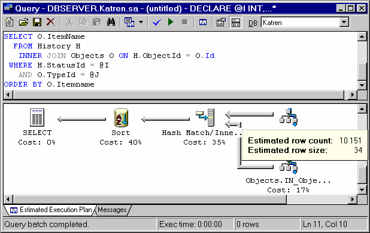
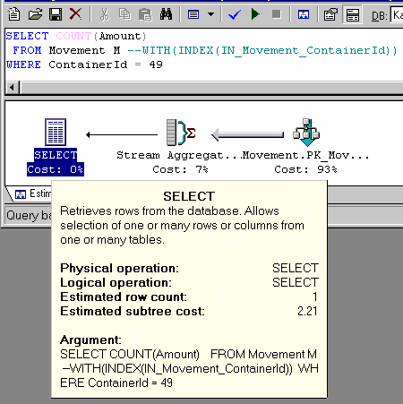
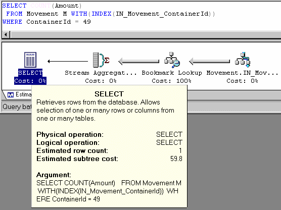

Оптимизатор запросов MS SQL Server
==================================

::: {.date}
01.01.2007
:::

В версии 7.0 существенно переработан оптимизатор запросов. Сервер может
использовать несколько индексов на каждую таблицу в запросе, один запрос
может исполняться параллельно на нескольких процессорах. В нем
реализованы 3 метода выполнения операции слияния таблиц (JOIN):

::: {style="text-align: left; text-indent: 0px; padding: 0px 0px 0px 0px; margin: 0px 0px 0px 24px;"}
  ---- ---------------------------------------------------------------------------------------------------------------------------------------------------------------------------------
  1.   LOOP JOIN - для каждой записи в одной из таблиц производится цикл по связанным записям второй таблицы. Этот метод наиболее эффективен для малых результирующих наборов данных.
  ---- ---------------------------------------------------------------------------------------------------------------------------------------------------------------------------------
:::

::: {style="text-align: left; text-indent: 0px; padding: 0px 0px 0px 0px; margin: 0px 0px 0px 24px;"}
  ---- ----------------------------------------------------------------------------------------------------------------------------------------------------------------------------------------------------------------------------------------------------------------------------------------------------------------------------------------------------------------------------------------------------------
  2.   MERGE JOIN - требует, чтобы оба набора данных были отсортированы по сливаемому полю (набору полей). В этом случае сервер осуществляет слияние за один проход по каждому из наборов данных. Т.к. они уже упорядочены, то нет необходимости просматривать все записи, достаточно выбирать их, начиная с текущей, пока значение поля не изменится. Это самый быстрый метод слияния больших наборов данных.
  ---- ----------------------------------------------------------------------------------------------------------------------------------------------------------------------------------------------------------------------------------------------------------------------------------------------------------------------------------------------------------------------------------------------------------
:::

::: {style="text-align: left; text-indent: 0px; padding: 0px 0px 0px 0px; margin: 0px 0px 0px 24px;"}
  ---- ---------------------------------------------------------------------------------------------------------------------------------------------------------------------------------------------------------------------------------------------------------------------------------------------------------------------------------------------------------
  3.   HASH JOIN - используется, когда невозможно использовать MERGE JOIN, а наборы данных велики. По одному из наборов строится хэш-таблица, а затем для каждой записи из второго набора вычисляется та же хэш функция и производится её поиск в таблице. На больших не отсортированных наборах данных этот алгоритм существенно эффективнее, чем LOOP JOIN.
  ---- ---------------------------------------------------------------------------------------------------------------------------------------------------------------------------------------------------------------------------------------------------------------------------------------------------------------------------------------------------------
:::

При фильтрации по индексу сервер не осуществляет сразу выборку данных из
таблицы. Вместо этого строится набор «закладок» (Bookmark), а затем
производится выборка данных в одной операции (Bookmark Lookup). Это
позволяет резко снизить количество обращений к диску.

Новые стратегии оптимизации требуют учета при проектировании БД и
структуры индексов. Например, для следующей структуры таблиц:

    CREATE TABLE T1 (
     Id INTEGER PRIMARY KEY,
     ...
    )

    CREATE TABLE T2 (
     Id INTEGER PRIMARY KEY,
     ...
    )

    CREATE TABLE T3 (
     Id INTEGER PRIMARY KEY,
     T1Id INTEGER REFERENCES T1(Id),
     T2Id INTEGER REFERENCES T2(Id),
     ...
    )

    Запрос
    SELECT *
      FROM T1
       INNER JOIN T3 ON T1.Id = T3.T1Id
       INNER JOIN T2 ON T2.Id = T3.T2Id
    WHERE ...

Может быть существенно ускорен созданием индексов:

    CREATE INDEX T3_1 ON T3(T1Id, T2Id)

Он позволят после слияния T3 с T1 получить набор данных, упорядоченный
по T2Id, который может быть слит с T2 путем эффективного алгоритма MERGE
JOIN. Впрочем, возможно лучший эффект даст индекс:

    CREATE INDEX T3_2 ON T3(T2Id, T1Id)

Это зависит от количества записей в T1, T2 и распределения их сочетаний
в T3. В OLAP системе (или в слабо загруженной OLTP) лучше построить оба
этих индекса, в то время как при интенсивном обновлении таблицы T3
возможно от одного из них придется отказаться. Сервер может сам выдать
рекомендации по построению индексов - для этого в него включен Index
Tuning Wizard, доступный через Query Analyzer. Он анализирует запрос
(или поток команд, собранный при помощи SQL Trace) и выдает рекомендации
по структуре индексов в конкретной БД.

В процессе работы с MS SQL Server мною были обнаружены два «тонких»
места в оптимизаторе запросов, которые рекомендуется учитывать.

Алгоритм выбора способа объединения таблиц не всегда выдает оптимальный
результат. Это обычно бывает связано, с невозможностью определить точное
количество записей, участвующих в объединении на момент генерации плана
запроса.

    DECLARE @I INTEGER

    SET @I = 10

    SELECT * 
      FROM History H
       INNER JOIN Objects O ON O.Id = H.ObjectId
     WHERE H.StatusId = @I

Сервер сгенерировал следующий план исполнения:

{.center}

Обращаю внимание - в качестве параметра выступает переменная при этом
сервер не может точно оценить в какой диапазон статистики она попадет. В
этом случае он делает предположение, что количество записей, полученных
из History, будет равно средней селективности по используемому полю,
помноженной на количество записей в таблице, в данном случае - 10151.
Исходя из этого выбирается алгоритм слияния HASH JOIN, требующий
значительных накладных расходов на построение хэш-таблицы. В случае,
если реальное количество записей ощутимо меньше (реально этот запрос
выбирает 100-200 записей за последний день, имеющих соответствующий
StatusId), алгоритм LOOP JOIN дает во много раз лучшую
производительность. Итак, если Вы точно знаете, что фильтрация по
конкретному полю даст ограниченный набор данных (не более нескольких
сотен записей), а сервер об этом "не догадывается" - укажите ему
алгоритм слияния явно.

    SELECT * 
      FROM History H
       INNER LOOP JOIN Objects O ON O.Id = H.ObjectId
     WHERE H.StatusId = @I

Делать это надо, только если Вы уверены, что этот запрос будет
выполняться со значениями параметра, имеющими высокую селективность. На
больших наборах данных LOOP JOIN будет гораздо медленнее.

Цена операции Bookmark Lookup (извлечение данных из таблицы по известным
значениям индекса) явно завышена. Поэтому иногда, даже при наличии
подходящего, индекса вместо INDEX SCAN (поиск по индексу) с последующим
Bookmark Lookup (выборка из таблицы) сервер принимает решение о полном
сканировании таблицы (TABLE SCAN или CLUSTERED INDEX SCAN). Пример
такого запроса приведен на рисунке. Обратите внимание на предполагаемую
стоимость запроса (Estimated subtree cost) для случая, когда для таблицы
явно задан поиск по индексу. Она чрезвычайно завышена. Видно, что 100%
расчетной стоимости выполнения дает операция Bookmark Lookup. Реально же
этот запрос выполняется быстрее при индексном доступе, чем при
сканировании таблицы. В этом случае рекомендуется попробовать явно
указать индекс для доступа к таблице.

{.center}

{.center}

Однако считаю нужным предостеречь от слишком частого использования
подсказок оптимизатору. Их можно использовать, только если Вы знаете,
что этот запрос будет выполняться в конкретных условиях и Вам лучше, чем
оптимизатору известно распределение данных в таблице. В большинстве
случаев оптимизатор запросов сам хорошо планирует его выполнение.
Предпочтительным способом оптимизации представляется грамотное
планирование структуры индексов.
