Delphi и SyBase (официальное руководство)
=========================================

::: {.date}
01.01.2007
:::

Borland Delphi         Using                 SQL Anywhere Studio

Sybase, Inc.

415 Phillip St.

Waterloo, ON

Canada

www.sybase.com

OVERVIEW

Borland Delphi is a rapid application development tool for Windows.  Due
to the increasing popularity of developing with Delphi and SQL Anywhere
Studio, Sybase has provided a white paper on how the two work together,
some common issues and methods to resolve those issues.  This document
will provide you an on-ramp to developing your own applications using
Delphi and SQL Anywhere Studio.  Appendix D on page 35 has a table of
products used to discover the issues and solutions discussed, and their
version numbers.  Appendix D also lists the web pages of the interfaces
discussed in this document.

THE DELPHI ENVIRONMENT

By default, Delphi uses the Borland Database Engine (BDE), a generic
Open DataBase Connectivity (ODBC) interface.  For greater programming
flexibility, Delphi can also use different database interfaces, such as
ODBCExpress, Titan SQLAnywhere Developer and NativeDB for SQL Anywhere. 
ODBCExpress is also a generic ODBC interface built by Datasoft Ltd. 
When used, ODBCExpress completely bypasses the BDE and compiles into
your application.  Titan was created by Reggatta Systems and is built
using the Adaptive Server Anywhere (ASA) Embedded SQL interface.  Titan
SQL Anywhere Developer is a set of tools that provide high-speed
performance when working with Sybase's SQL Anywhere database.  NativeDB
was built by Liodden Data A/S and uses the Embedded SQL interface. 
NativeDB was designed to take advantage of the more advanced features of
ASA (e.g. callbacks, canceling server execution, resuming SPs etc.). 
For information regarding setting up ODBCExpress to be used with Delphi,
please refer to Appendix A on page 28.  For information regarding
setting up Titan to be used with Delphi, please refer to Installing
Titan and Creating a Titan Alias on page 4.  For more information
regarding setting up NativeDB to be used with Delphi, please refer to
Installing NativeDB for SQL Anywhere on page 6.

 

SETTING UP ASA FOR DELPHI COMPATIBILITY

 

Creating an ODBC Data Source

Once you have created an Adaptive Server Anywhere (ASA) database it is
easy to set it up to be compatible with Delphi.  If you have not created
an ASA database of your own and would like to modify the ASA 7.0 Sample
database supplied to you, please refer to Appendix B for instructions. 
Since both the BDE and ODBCExpress make use of ODBC, you will need to
set up an ODBC data source for your database, following these steps:

 

::: {style="text-align: left; text-indent: 0px; padding: 0px 0px 0px 0px; margin: 0px 0px 0px 48px;"}
  ---- ---------------------------------------------------------------------------------------------------------------------------------------------------------------------------------------------------------------------------------------------------------------------------------------------------------------------
  1.   Invoke 'Sybase Central 4.0' (located in Start а Programs а Sybase SQL Anywhere 7 а Sybase Central 4.0, by default).  Double click the 'Utilities' folder located on the left-hand side of Sybase Central, under the title Adaptive Server Anywhere 7.  A list of tools appears on the right hand side of the screen
  ---- ---------------------------------------------------------------------------------------------------------------------------------------------------------------------------------------------------------------------------------------------------------------------------------------------------------------------
:::

::: {style="text-align: left; text-indent: 0px; padding: 0px 0px 0px 0px; margin: 0px 0px 0px 48px;"}
  ---- -----------------------------------
  2.   Double click 'ODBC Administrator'
  ---- -----------------------------------
:::

 

(Another way to get into the 'ODBC Administrator' is to click Start а
Programs а Sybase SQL Anywhere 7а Adaptive Server Anywhere 7 а ODBC
Administrator.)

 

::: {style="text-align: left; text-indent: 0px; padding: 0px 0px 0px 0px; margin: 0px 0px 0px 48px;"}
  ---- ------------------------------------------------------------------------------------------------------------------------------------------------------------------------------------------------------------------------------------------------------------------------------------------------------
  3.   If you want a source that is only visible to your login on that machine, make sure you are on the 'User DSN' tab and click on 'Add' (Figure 2).  If you want a source that is visible to all users on this machine, including NT Services, make sure you are on the 'System DSN' tab and click 'Add'
  ---- ------------------------------------------------------------------------------------------------------------------------------------------------------------------------------------------------------------------------------------------------------------------------------------------------------
:::

 
:::{.center}
Figure 2

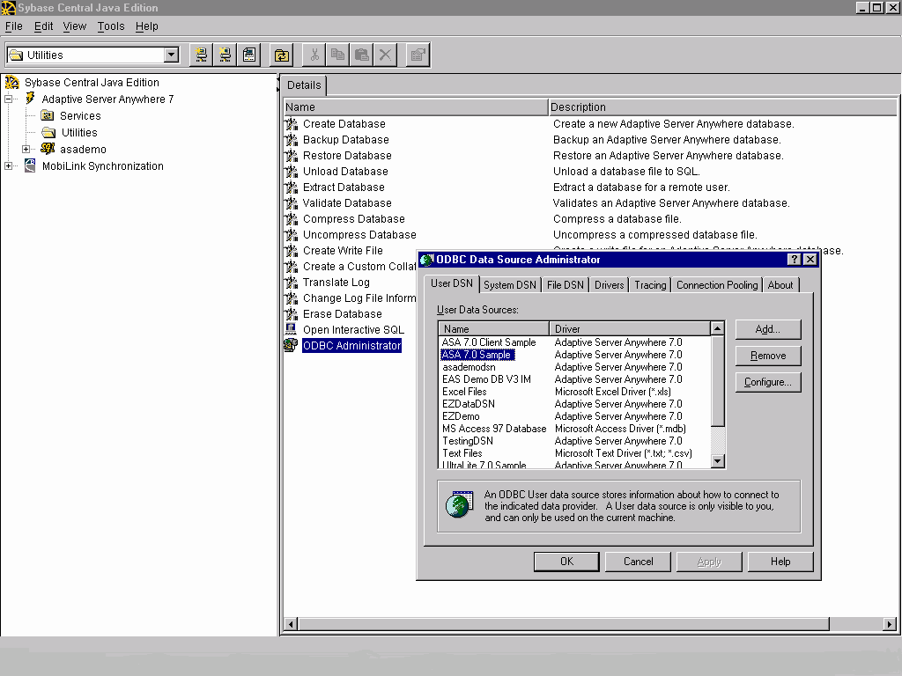
:::

::: {style="text-align: left; text-indent: 0px; padding: 0px 0px 0px 0px; margin: 0px 0px 0px 48px;"}
  ---- ---------------------------------------------------------------------------------------------------------------------------
  4.   Select 'Adaptive Server Anywhere 7.0' and click 'Finish'.  This will bring up another window with several tabs (Figure 3)
  ---- ---------------------------------------------------------------------------------------------------------------------------
:::

 
:::{.center}
Figure 3

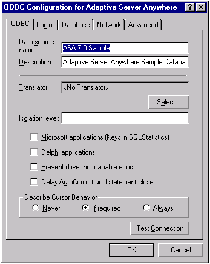
:::
 

5.   The following information must be provided to create an ODBC data
source:

::: {style="text-align: left; text-indent: 0px; padding: 0px 0px 0px 0px; margin: 0px 0px 0px 72px;"}
  ---- -----------------------------------------------------------------------------------------------------------------------------------------------------------
  i.   Under the 'ODBC' tab, type in a 'Data Source Name' that pertains to your database.  This name will identify the ODBC data source that will be worked with
  ---- -----------------------------------------------------------------------------------------------------------------------------------------------------------
:::

::: {style="text-align: left; text-indent: 0px; padding: 0px 0px 0px 0px; margin: 0px 0px 0px 72px;"}
  ----- -------------------------------------------------------------------------------------------------------------------------------------------------
  ii.   Under the 'Login' tab, click the radio button, 'Supply user ID and password' and type in a user name and password in the appropriate text boxes
  ----- -------------------------------------------------------------------------------------------------------------------------------------------------
:::

::: {style="text-align: left; text-indent: 0px; padding: 0px 0px 0px 0px; margin: 0px 0px 0px 72px;"}
  ------ ---------------------------------------------------------------------------------------------------------------------------------------------------------------------------------------------------------------------------------------------------
  iii.   Under the 'Database' tab, it is important to supply a path to where your database is saved in the 'Database File' text box.  Type the path or click on the 'Browse' button, and go to the directory where the database is located and click 'OK'.
  ------ ---------------------------------------------------------------------------------------------------------------------------------------------------------------------------------------------------------------------------------------------------
:::

::: {style="text-align: left; text-indent: 0px; padding: 0px 0px 0px 0px; margin: 0px 0px 0px 72px;"}
  ----- --------------------------------------------------------------------------------------------------------------------------------------------
  iv.   Click the check boxes, 'Automatically start the database if it isn't running' and 'Automatically shut down database after last disconnect'
  ----- --------------------------------------------------------------------------------------------------------------------------------------------
:::

::: {style="text-align: left; text-indent: 0px; padding: 0px 0px 0px 0px; margin: 0px 0px 0px 72px;"}
  ---- ---------------------------------------------------------------------------------------------------------------------------------------------------------------------------------------------------------------------------------------
  v.   To make certain that everything is set properly, select the 'ODBC' tab and click on the button 'Test Connection'.  If everything is correct a window entitled 'Note' will pop up and let you know that your connection was successful
  ---- ---------------------------------------------------------------------------------------------------------------------------------------------------------------------------------------------------------------------------------------
:::

::: {style="text-align: left; text-indent: 0px; padding: 0px 0px 0px 0px; margin: 0px 0px 0px 72px;"}
  ----- --------------------------------------------------------------------------------------------------------------------------------------------------
  vi.   Click 'OK' and you should see the Data Source Name you created in the ODBC Administrator window under the 'User DSN' tab or the 'System DSN' tab
  ----- --------------------------------------------------------------------------------------------------------------------------------------------------
:::

::: {style="text-align: left; text-indent: 0px; padding: 0px 0px 0px 0px; margin: 0px 0px 0px 72px;"}
  ------ ----------------------------------------------------------------------------------------------------------------------
  vii.   Click 'OK' again.  You have now created an ODBC data source for your database that is ready to be accessed in Delphi
  ------ ----------------------------------------------------------------------------------------------------------------------
:::

 

Titan SQL Anywhere for Delphi 3, version 3.02p, is designed for use with
SQL Anywhere versions 5.x.  If you have a database that was created in
ASA 6.x or ASA 7 you have a few extra steps before starting to create
your Delphi application.  These extra steps involve a compatibility
library and setting up a new Titan alias in the registry.  For
information on creating a new alias please refer to Installing Titan and
Creating a Titan Alias on page 4.

The compatibility library works by attempting to connect to an Adaptive
Server Anywhere version 7 interface library, using the supplied
connection string.  If this attempt fails, the compatibility library
attempts to connect to a SQL Anywhere database using the SQL Anywhere
version 5 library.  For Windows 32-bit (Win32), the compatibility
library (dbl50t.dll), the version 5 interface library (dbl50to.dll), and
the version 7 interface library (dblib7.dll), are all installed in the
same directory.  This directory is probably located where you installed
ASA.  For example, by default it will be stored under C:\\Program
Files\\Sybase\\SQL Anywhere 7\\win32.  In order for the compatibility
library to work, the version 7 installation directory must be placed
ahead of the version 5 directory in the system path.  This placement
ensures that the applications locate the compatibility library ahead of
the version 5 interface library.  Assuming that you have installed the
compatibility library in the first place, the version directories will
be placed in the correct order automatically.  For more information,
open the SQL Anywhere documentation, (located in Start а Programs а
Sybase SQL Anywhere 7), do a search for 'compatibility' and double click
'Using the compatibility library'.

 

Installing Titan and Creating a Titan Alias

To set up the Titan SQLAnywhere Developer interface you have to install
a package in Delphi, following these steps.

::: {style="text-align: left; text-indent: 0px; padding: 0px 0px 0px 0px; margin: 0px 0px 0px 48px;"}
  ---- -------------------------------------------------------------------
  1.   Select 'Component' from the tool bar and click 'Install Packages'
  ---- -------------------------------------------------------------------
:::

::: {style="text-align: left; text-indent: 0px; padding: 0px 0px 0px 0px; margin: 0px 0px 0px 48px;"}
  ---- ------------------------------------------------------------------------------------------------------------
  2.   Click the 'Add' button and select the package 'SQATITAN.DPL' from the directory where you downloaded Titan
  ---- ------------------------------------------------------------------------------------------------------------
:::

::: {style="text-align: left; text-indent: 0px; padding: 0px 0px 0px 0px; margin: 0px 0px 0px 48px;"}
  ---- ---------------------------------------
  3.   Click 'Open' and then 'OK' to install
  ---- ---------------------------------------
:::

You will notice that another tab named Titan SQL Anywhere appears on the
Delphi component bar.

 

To set up a new Titan alias in the registry, which must be done in order
to use Titan SQL Anywhere with ASA 7.0, follow these steps:

1.   Click 'Start' and select 'Run' from the menu

::: {style="text-align: left; text-indent: 0px; padding: 0px 0px 0px 0px; margin: 0px 0px 0px 48px;"}
  ---- ----------------------------------
  2.   Type in 'regedit' and click 'OK'
  ---- ----------------------------------
:::

::: {style="text-align: left; text-indent: 0px; padding: 0px 0px 0px 0px; margin: 0px 0px 0px 48px;"}
  ---- ----------------------------------------------------------------------------------------------------------------------
  3.   Open to 'HKEY\_LOCAL\_MACHINE а SOFTWARE а Titan а SqlAnywhere а Aliases' in the 'Registry Editor' window (Figure 4)
  ---- ----------------------------------------------------------------------------------------------------------------------
:::

::: {style="text-align: left; text-indent: 0px; padding: 0px 0px 0px 0px; margin: 0px 0px 0px 48px;"}
  ---- -------------------------------------------------------
  4.   Right click 'Aliases' and select 'New' and then 'Key'
  ---- -------------------------------------------------------
:::

 

 
:::{.center}
Figure 4

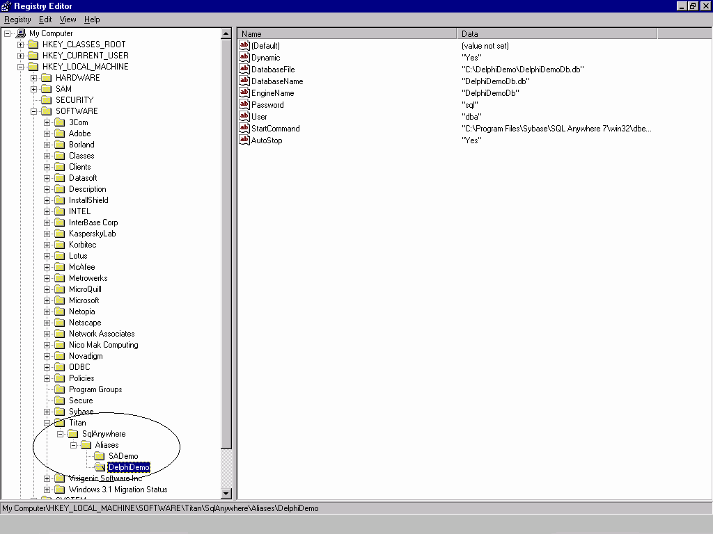
:::
 

::: {style="text-align: left; text-indent: 0px; padding: 0px 0px 0px 0px; margin: 0px 0px 0px 48px;"}
  ---- ---------------------------------------------------------------------------------------------------------------------------------------
  5.   A folder will appear and you can rename the Alias to better describe your database.  This folder will be associated with the database
  ---- ---------------------------------------------------------------------------------------------------------------------------------------
:::

::: {style="text-align: left; text-indent: 0px; padding: 0px 0px 0px 0px; margin: 0px 0px 0px 48px;"}
  ---- -------------------------------------------------------------------------------------------
  6.   Right click the alias name you have just created and select 'New' and then 'String Value'
  ---- -------------------------------------------------------------------------------------------
:::

::: {style="text-align: left; text-indent: 0px; padding: 0px 0px 0px 0px; margin: 0px 0px 0px 48px;"}
  ---- -------------------
  7.   Do the following:
  ---- -------------------
:::

::: {style="text-align: left; text-indent: 0px; padding: 0px 0px 0px 0px; margin: 0px 0px 0px 48px;"}
  ---- -------------------------------------
  8.   Type in 'Dynamic' and press 'Enter'
  ---- -------------------------------------
:::

::: {style="text-align: left; text-indent: 0px; padding: 0px 0px 0px 0px; margin: 0px 0px 0px 48px;"}
  ---- -----------------------------------------------------------------------------------------------------------
  9.   Double click the name 'Dynamic' and a box will appear.  Type in 'Yes' in the edit box labled 'Value data'
  ---- -----------------------------------------------------------------------------------------------------------
:::

::: {style="text-align: left; text-indent: 0px; padding: 0px 0px 0px 0px; margin: 0px 0px 0px 48px;"}
  ----- -----------------------------------------
  10.   Repeat steps 6 and 7 for the following:
  ----- -----------------------------------------
:::

::: {style="text-align: left; text-indent: 0px; padding: 0px 0px 0px 0px; margin: 0px 0px 0px 48px;"}
  ----- ------------------------------------------------------------------------------------------------------------------------------------------------------------------
  11.   'DatabaseFile' (step 7, part i) and the directory where your database is stored, e.g. 'c:\\Program Files\\Sybase\\ SQL Anywhere 7\\asademo.db' (step 7, part ii)
  ----- ------------------------------------------------------------------------------------------------------------------------------------------------------------------
:::

::: {style="text-align: left; text-indent: 0px; padding: 0px 0px 0px 0px; margin: 0px 0px 0px 48px;"}
  ----- -----------------------------------------------------------------
  12.   'DatabaseName' and the name of your database, e.g. 'asademo.db'
  ----- -----------------------------------------------------------------
:::

::: {style="text-align: left; text-indent: 0px; padding: 0px 0px 0px 0px; margin: 0px 0px 0px 48px;"}
  ----- ----------------------------------------------------------------------------------------------------------------------
  13.   'EngineName' and the name of your engine (in most cases it is the same as the name of your database, e.g. 'asademo')
  ----- ----------------------------------------------------------------------------------------------------------------------
:::

::: {style="text-align: left; text-indent: 0px; padding: 0px 0px 0px 0px; margin: 0px 0px 0px 48px;"}
  ----- ---------------------------------------------------------------------------
  14.   'Password' and 'whatever you use for your database password' (e.g. 'sql')
  ----- ---------------------------------------------------------------------------
:::

::: {style="text-align: left; text-indent: 0px; padding: 0px 0px 0px 0px; margin: 0px 0px 0px 48px;"}
  ----- ---------------------------------------------------------------------
  15.   'User' and 'whatever you use for your database user id (e.g. 'dba')
  ----- ---------------------------------------------------------------------
:::

::: {style="text-align: left; text-indent: 0px; padding: 0px 0px 0px 0px; margin: 0px 0px 0px 48px;"}
  ----- --------------------------------------------------------------------------------------------------------------------------------
  16.   'StartCommand' and the location of the dbeng6 executable (e.g. 'c:\\Program Files\\Sybase\\SQL Anywhere 7\\win32\\dbeng7.exe')
  ----- --------------------------------------------------------------------------------------------------------------------------------
:::

::: {style="text-align: left; text-indent: 0px; padding: 0px 0px 0px 0px; margin: 0px 0px 0px 48px;"}
  ----- ----------------------
  17.   'AutoStop' and 'Yes'
  ----- ----------------------
:::

::: {style="text-align: left; text-indent: 0px; padding: 0px 0px 0px 0px; margin: 0px 0px 0px 48px;"}
  ----- ------------------------------------
  18.   Close the 'Registry Editor' window
  ----- ------------------------------------
:::

 

Installing NativeDB for SQL Anywhere

NativeDB does not rely on registry settings, ODBC sources or BDE
aliases, so after the following steps are complete, NativeDB is ready to
be used with Delphi.

 

Similar to installing the Titan interface, you must install two packages
in Delphi.  The order in which these packages are installed is
important, so following these steps carefully.

::: {style="text-align: left; text-indent: 0px; padding: 0px 0px 0px 0px; margin: 0px 0px 0px 48px;"}
  ---- -----------------------------------------------------------------------------
  1.   In Delphi select 'Component' from the tool bar and click 'Install Packages'
  ---- -----------------------------------------------------------------------------
:::

::: {style="text-align: left; text-indent: 0px; padding: 0px 0px 0px 0px; margin: 0px 0px 0px 48px;"}
  ---- -------------------------------------------------------------------------------------------------------------------------------------------------------------------------------------------------------
  2.   Click the 'Add' button and select the package 'NdbPack\*.dpl' from the directory where you downloaded NativeDB\\NativeDB\\Delphi\*, where '\*' should be replaced by the version of Delphi being used
  ---- -------------------------------------------------------------------------------------------------------------------------------------------------------------------------------------------------------
:::

::: {style="text-align: left; text-indent: 0px; padding: 0px 0px 0px 0px; margin: 0px 0px 0px 48px;"}
  ---- -----------------------------------------------------------------------------
  3.   Click 'Open'.  You will notice a new entry in the 'Design Packages' window.
  ---- -----------------------------------------------------------------------------
:::

::: {style="text-align: left; text-indent: 0px; padding: 0px 0px 0px 0px; margin: 0px 0px 0px 48px;"}
  ---- ----------------------------------------------------------------------------------------------------------------------------------------------
  4.   Click the 'Add' button again and this time select the package 'NdbSa\*.dpl where '\*' should be replaced by the version of Delphi being used
  ---- ----------------------------------------------------------------------------------------------------------------------------------------------
:::

::: {style="text-align: left; text-indent: 0px; padding: 0px 0px 0px 0px; margin: 0px 0px 0px 48px;"}
  ---- ---------------------------------------
  5.   Click 'Open' and then 'OK' to install
  ---- ---------------------------------------
:::

::: {style="text-align: left; text-indent: 0px; padding: 0px 0px 0px 0px; margin: 0px 0px 0px 48px;"}
  ---- ----------------------------------------------------------------------
  6.   Now select 'Tools' from the tool bar and click 'Environment Options'
  ---- ----------------------------------------------------------------------
:::

::: {style="text-align: left; text-indent: 0px; padding: 0px 0px 0px 0px; margin: 0px 0px 0px 48px;"}
  ---- --------------------------
  7.   Select the 'Library' tab
  ---- --------------------------
:::

::: {style="text-align: left; text-indent: 0px; padding: 0px 0px 0px 0px; margin: 0px 0px 0px 48px;"}
  ---- -----------------------------------------------------------------------------------------------------------------------------------------------------------------------------
  8.   In the 'Library Path' edit box, add the path to the folder named Delphi\* where '\*' is the version of Delphi being used.  An example path would be 'C:\\NativeDB\\Delphi3'
  ---- -----------------------------------------------------------------------------------------------------------------------------------------------------------------------------
:::

On the component bar in Delphi, you will notice another tab named
NativeDB.

 

 

 

INTRODUCTION TO DELPHI CONTROLS

Simple Case Setting Bound Control Properties

Delphi was designed so that you can accomplish a number of tasks without
ever having to do any actual programming.  Certain components can be
linked or bound to each other through the 'Object Inspector' so that
they actually interact with one another.  For example, using BDE, if you
have a table component, 'Table1', you can set which database you want
the table to be associated with by selecting 'Database Name' in the
'Object Inspector', and selecting from the list.  This list contains all
the ODBC data sources or Aliases found on your machine.  By selecting
one of these you have bound the table component to the database you have
chosen.

 

The diagram below (Figure 5) is an example of how components can be
bound together.  On the form, 'Form1', there are three components from
the BDE interface, which have been bound. To bind these three
components, follow these steps:

::: {style="text-align: left; text-indent: 0px; padding: 0px 0px 0px 0px; margin: 0px 0px 0px 48px;"}
  ---- -------------------------------------------------------------------------
  1.   Place the components, 'TTable', 'TDataSource' and 'DBGrid' on your form
  ---- -------------------------------------------------------------------------
:::

::: {style="text-align: left; text-indent: 0px; padding: 0px 0px 0px 0px; margin: 0px 0px 0px 48px;"}
  ---- -----------------------------------------------------------------------------------------------------------------------------------------------------------------------------
  2.   Bind the 'TTable' component to the ODBC data source 'ASA 7.0 Sample' by setting its 'DatabaseName' property in the 'Object Inspector' to that name using the drop down list
  ---- -----------------------------------------------------------------------------------------------------------------------------------------------------------------------------
:::

::: {style="text-align: left; text-indent: 0px; padding: 0px 0px 0px 0px; margin: 0px 0px 0px 48px;"}
  ---- --------------------------------------------------------------------------------------------------------------------------------------------------------------------------------------------------------------------
  3.   The 'DataSource' component can be linked to the database through 'Table1' by selecting the 'DataSource' component and setting the property 'DataSet' on the 'Object Inspector' to 'Table1' from the drop down list
  ---- --------------------------------------------------------------------------------------------------------------------------------------------------------------------------------------------------------------------
:::

::: {style="text-align: left; text-indent: 0px; padding: 0px 0px 0px 0px; margin: 0px 0px 0px 48px;"}
  ---- ------------------------------------------------------------------------------------------------------------------------------------------------------------------------------------------------------------------------------------------------------------------------------
  4.   The 'DBGrid' component is bound to the database through the 'DataSource'.  This is done by selecting the 'DBGrid' component on 'Form1' and setting its 'DataSource' property, in the 'Object Inspector', to 'DataSource1'.  Now 'DBGrid' can display a table in the database
  ---- ------------------------------------------------------------------------------------------------------------------------------------------------------------------------------------------------------------------------------------------------------------------------------
:::

Setting up a data source is very powerful.  It enables many components
to get access to the database through this data source without requiring
extra programming.  The 'DBGrid' is an example of a component that
accesses the database through the 'DataSource' property.

 
:::{.center}
Figure 5

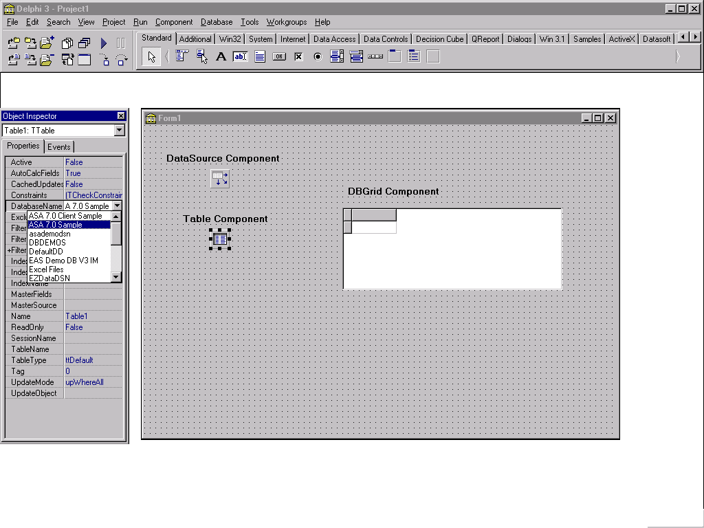
:::
 

When binding components to each other certain errors can occur.  For
example, an 'Access violation' error will occur when binding a 'TTable'
component with a 'DBGrid' component.  This is a bug in Delphi.  For more
information on this error, please refer to the DBGrid Examples section
on page 18.

 

 

Connecting To an ASA Database Through Delphi

BDE

The section above discusses binding controls, including the fact that a
'TTable' component can be bound to an ODBC data source.  The reason for
binding such components to an ODBC data source is to start the ASA
database engine so the other components can access information specific
to the database that the source is associated with.  For the 'TTable'
component the following steps need to be carried out to start an ASA
database engine:

::: {style="text-align: left; text-indent: 0px; padding: 0px 0px 0px 0px; margin: 0px 0px 0px 48px;"}
  ---- -------------------------------------------------------------------------
  1.   Set the  'TableName' property, whether it be at design time or run time
  ---- -------------------------------------------------------------------------
:::

::: {style="text-align: left; text-indent: 0px; padding: 0px 0px 0px 0px; margin: 0px 0px 0px 48px;"}
  ---- ------------------------------------
  2.   Set the 'Active' property to True.
  ---- ------------------------------------
:::

 

Another BDE component that can start an ASA database engine in Delphi is
the 'TDatabase' component.  To do so:

::: {style="text-align: left; text-indent: 0px; padding: 0px 0px 0px 0px; margin: 0px 0px 0px 48px;"}
  ---- -----------------------------------------------
  1.   Select the component and place it on the form
  ---- -----------------------------------------------
:::

::: {style="text-align: left; text-indent: 0px; padding: 0px 0px 0px 0px; margin: 0px 0px 0px 48px;"}
  ---- --------------------------------------------------------------------------------------------------------------------
  2.   In the 'Object Inspector' or when using code, set the 'AliasName' property.  This property is the ODBC data source
  ---- --------------------------------------------------------------------------------------------------------------------
:::

::: {style="text-align: left; text-indent: 0px; padding: 0px 0px 0px 0px; margin: 0px 0px 0px 48px;"}
  ---- -----------------------------------------------------------------------------
  3.   Set the 'DatabaseName' property.  It is usually the same as the 'AliasName'
  ---- -----------------------------------------------------------------------------
:::

::: {style="text-align: left; text-indent: 0px; padding: 0px 0px 0px 0px; margin: 0px 0px 0px 48px;"}
  ---- -------------------------------------------------------------------------------
  4.   Set the 'Connected' property to 'True' and the database engine will start up.
  ---- -------------------------------------------------------------------------------
:::

 

ODBCExpress

Connecting to an ASA database engine using ODBCExpress is similar to
using the 'TDatabase' component using the BDE.  To start a database
engine follow these steps:

::: {style="text-align: left; text-indent: 0px; padding: 0px 0px 0px 0px; margin: 0px 0px 0px 48px;"}
  ---- ----------------------------------------------------------------------------------------------------------
  1.   On the ODBCExpress tab on the component palette, select the 'THdbc' component and place it on the form. 
  ---- ----------------------------------------------------------------------------------------------------------
:::

::: {style="text-align: left; text-indent: 0px; padding: 0px 0px 0px 0px; margin: 0px 0px 0px 48px;"}
  ---- ---------------------------------------------------------------------------------------------------------
  2.   In the 'Object Inspector' or using code, set the 'DataSource' property to the ODBC data source required
  ---- ---------------------------------------------------------------------------------------------------------
:::

::: {style="text-align: left; text-indent: 0px; padding: 0px 0px 0px 0px; margin: 0px 0px 0px 48px;"}
  ---- -----------------------------------------
  3.   Set the 'Connected' property to 'True'.
  ---- -----------------------------------------
:::

 

Titan SQLAnywhere Developer

After creating an Alias name for the database being used (refer to
Installing Titan and Creating a Titan Alias on page 4 for details), one
is ready to work with Titan components. Place a 'TtsTable' component or
a 'TtsDatabase' component on the form.  For the 'TtsTable' component:

::: {style="text-align: left; text-indent: 0px; padding: 0px 0px 0px 0px; margin: 0px 0px 0px 48px;"}
  ---- -----------------------------------------------------------------------------------------------
  1.   Set the 'DatabaseName' property to the Alias name created for the database that is being used
  ---- -----------------------------------------------------------------------------------------------
:::

::: {style="text-align: left; text-indent: 0px; padding: 0px 0px 0px 0px; margin: 0px 0px 0px 48px;"}
  ---- ---------------------------------------------------------
  2.   Set the 'TableName' property to a table in the database
  ---- ---------------------------------------------------------
:::

::: {style="text-align: left; text-indent: 0px; padding: 0px 0px 0px 0px; margin: 0px 0px 0px 48px;"}
  ---- --------------------------------------------
  3.   Set the 'Active' property is set to 'True'
  ---- --------------------------------------------
:::

 

For the 'TtsDatabase' component:

::: {style="text-align: left; text-indent: 0px; padding: 0px 0px 0px 0px; margin: 0px 0px 0px 48px;"}
  ---- --------------------------------------------------------------------------------------------------------------------
  1.   Set the 'AliasName' property and 'DatabaseName' property to the Alias name created for the database being accessed
  ---- --------------------------------------------------------------------------------------------------------------------
:::

::: {style="text-align: left; text-indent: 0px; padding: 0px 0px 0px 0px; margin: 0px 0px 0px 48px;"}
  ---- -----------------------------------------
  2.   Set the 'Connected' property to 'True'.
  ---- -----------------------------------------
:::

There may be a problem auto-starting an ASA database engine when using
the Titan interface. One would like to be able to start the database
engine in a similar manner to BDE and ODBCExpress.  When attempting to
auto-start an ASA engine the error 'Database Name required to start
server' is run into.  One way to get around this error is to follow
these steps:

::: {style="text-align: left; text-indent: 0px; padding: 0px 0px 0px 0px; margin: 0px 0px 0px 48px;"}
  ---- --------------------------------------------------------------------------------------------------------------------------------------------------------------------------------------
  1.   Start the database engine required using BDE or ODBCExpress components.  Make sure that the Alias names between Titan and BDE or ODBCExpress are the same if you choose this option.
  ---- --------------------------------------------------------------------------------------------------------------------------------------------------------------------------------------
:::

::: {style="text-align: left; text-indent: 0px; padding: 0px 0px 0px 0px; margin: 0px 0px 0px 48px;"}
  ---- --------------------------------------------------------------
  2.   Connect to the already started engine using Titan components
  ---- --------------------------------------------------------------
:::

 

 

NativeDB for SQL Anywhere

Starting an ASA database engine using NativeDB components is slightly
different then starting one with any of BDE, ODBCExpress or Titan.  The
NativeDB component 'TAsaSession' allows you to connect to any version of
ASA from Watcom SQL 4 to ASA 7.  For example, to connect to an ASA 7
engine, follow these steps and refer to figure 6:

::: {style="text-align: left; text-indent: 0px; padding: 0px 0px 0px 0px; margin: 0px 0px 0px 48px;"}
  ---- ---------------------------------------------
  1.   Place a 'TAsaSession' component on the form
  ---- ---------------------------------------------
:::

::: {style="text-align: left; text-indent: 0px; padding: 0px 0px 0px 0px; margin: 0px 0px 0px 48px;"}
  ---- -------------------------------------------------------------------------------------------------------------------------------------------------------------------------------------------------------------------------------------------------------------
  2.   Set the 'LibraryFile' property to 'dblib7.dll' in the 'Object Inspector'.  Note that this dll will change depending on which version of ASA you are using.  For example, this property would be set to 'dblib6.dll' for ASA 6, 'dbl50t.dll' for SA5.x, etc.
  ---- -------------------------------------------------------------------------------------------------------------------------------------------------------------------------------------------------------------------------------------------------------------
:::

::: {style="text-align: left; text-indent: 0px; padding: 0px 0px 0px 0px; margin: 0px 0px 0px 48px;"}
  ---- -----------------------------------------------------------------------------------------------------------------------------------------------------------------------------------------------------------------------------------------------------------------------------------------------
  3.   Set the 'LoginDatabase' property to the path and name of where your database is stored (e.g. 'C:\\Program Files\\Sybase\\SQL Anywhere 7\\asademo.db).  Note that if you are connecting to a running engine then it is enough to only supply the database name in the 'LoginDatabase' property
  ---- -----------------------------------------------------------------------------------------------------------------------------------------------------------------------------------------------------------------------------------------------------------------------------------------------
:::

::: {style="text-align: left; text-indent: 0px; padding: 0px 0px 0px 0px; margin: 0px 0px 0px 48px;"}
  ---- ----------------------------------------------------------------------------------------------------------------------------------------------------------------------------------------------------------------------------------------------------------------------------------
  4.   Assign a name to the 'LoginEngineName' property, which will represent the name of your engine.  Typically, this is the same name as your database.  If this property is left blank the name of the database supplied in the 'LoginDatabase' property is used for the engine name
  ---- ----------------------------------------------------------------------------------------------------------------------------------------------------------------------------------------------------------------------------------------------------------------------------------
:::

::: {style="text-align: left; text-indent: 0px; padding: 0px 0px 0px 0px; margin: 0px 0px 0px 48px;"}
  ---- -------------------------------------------------------------
  5.   Set the 'LoginUser' to the appropriate user id (e.g. 'dba')
  ---- -------------------------------------------------------------
:::

::: {style="text-align: left; text-indent: 0px; padding: 0px 0px 0px 0px; margin: 0px 0px 0px 48px;"}
  ---- ----------------------------------------------------------------------------------------------------------------
  6.   Set the 'LoginPassword' to the correct password for the user supplied by the 'LoginUser' property (e.g. 'sql')
  ---- ----------------------------------------------------------------------------------------------------------------
:::

::: {style="text-align: left; text-indent: 0px; padding: 0px 0px 0px 0px; margin: 0px 0px 0px 48px;"}
  ---- ----------------------------------------------------------------------------------------
  7.   Set the 'ServerParams' property to the start line for dbeng7 (e.g. 'start=dbeng7.exe')
  ---- ----------------------------------------------------------------------------------------
:::

::: {style="text-align: left; text-indent: 0px; padding: 0px 0px 0px 0px; margin: 0px 0px 0px 48px;"}
  ---- ---------------------------------------------
  8.   Set the 'ServerType' property to 'stServer'
  ---- ---------------------------------------------
:::

When all of these are set the 'Connected' property can be set to 'True'
and the database engine will start.

 
:::{.center}
Figure 6

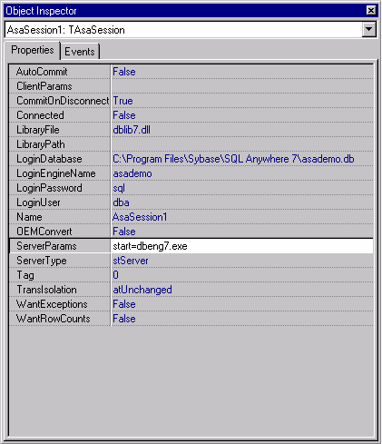
:::
 

Once the 'TAsaSession' component is set up, you are ready to work with
the database access components.  To set up the database access component
follow these steps:

::: {style="text-align: left; text-indent: 0px; padding: 0px 0px 0px 0px; margin: 0px 0px 0px 48px;"}
  ---- ---------------------------------------------
  1.   Place a 'TAsaDataset' component on the form
  ---- ---------------------------------------------
:::

::: {style="text-align: left; text-indent: 0px; padding: 0px 0px 0px 0px; margin: 0px 0px 0px 48px;"}
  ---- ---------------------------------------------------------------------------------------------------------------------------------
  2.   Set the 'Session' property to the name of the TAsaSession component you set above using the drop down menu (e.g. 'AsaSession1')
  ---- ---------------------------------------------------------------------------------------------------------------------------------
:::

::: {style="text-align: left; text-indent: 0px; padding: 0px 0px 0px 0px; margin: 0px 0px 0px 48px;"}
  ---- ---------------------------------------------------------------------------------------------------------------------------------
  3.   Set the 'SQL' property to access one or many tables in the database.  Note that if this property is not set an error will occur
  ---- ---------------------------------------------------------------------------------------------------------------------------------
:::

::: {style="text-align: left; text-indent: 0px; padding: 0px 0px 0px 0px; margin: 0px 0px 0px 48px;"}
  ---- -------------------------------------
  4.   Set the 'Active' property to 'True'
  ---- -------------------------------------
:::

Note that if you set the 'Active' property to true in the 'TAsaDataset'
component then it is unnecessary to set the 'Connected' property to
'True' for the 'TAsaSession' component previously.  When the 'Active'
property is set to 'True' the database engine described in the
'TAsaSession' component is started automatically.

 

 

Blob Examples

One of the most common problems when using an ASA database with Borland
Delphi involves Binary Large OBjects, or BLOB.  A BLOB is a large data
set that must be handled in a special way because of its size.  BLOBs
are typically image or sound files.  Although all of the BLOBs discussed
in this section are bitmaps, a BLOB can be any type of information that
is turned into binary.

 

BDE

A problem involving BLOBs arises when using the BDE for Delphi 3, which
is the default engine.  It seems that the manipulation of BLOBs larger
than 1.4 megabytes is not supported by Delphi.  However, manipulating
BLOBs under this size can be done without incident. An example of
inserting a BLOB into a database using the BDE follows. 

 

Example 1: Inserting a BLOB into a database using BDE

    // This procedure puts the BLOB to the table
    procedure TForm1.LoadBlobClick(Sender: TObject);
    var
       nextnum : Integer;
    begin
       // This part of the code attempts to open the table and if it fails it sends an error message
       try
          Table1.Open;
       except
          ShowMessage('Unable to Open Table');
          Table1.Close;
       end;
    // Checks if the table is open already
       if Table1.Active = True then
       begin
          // If there are no rows in the table then nextnum is set to 0 otherwise it finds the last 
          // row in the table and sets ‘nextnum’ to the last number in the ‘keyfld’ column plus 1
          if(Table1.RecordCount = 0) then
             nextnum := 1
          else
          begin
             // ** Refer to Appendix C: Primary Key Issues for details on why this is not a good 
             //  method for assigning a value to nextnum and a better method for doing so**
             Table1.Last;
             nextnum := Table1.FieldByName('keyfld').asInteger + 1;
          end;
          // This inserts a row into the table, fills the ‘keyfld’ column using ‘nextnum’ and the 
          // ‘imagefld’ column using the path and name specified by the user through the
          // ‘Edit1’ box
          Table1.Insert;
          Table1.FieldByName('keyfld').Value := (nextnum);
          TBlobfield(Table1.FieldByName('imagefld')).LoadFromFile(Edit1.Text);
          Table1.Post;
          Table1.Close;
          // This displays the BLOB in the ‘Image1’ box
          Image1.Picture.LoadFromFile(Edit1.Text);
          StatusBar1.SimpleText := 'Image loaded into table';
       end;
    end;

 

A few things to note are:

::: {style="text-align: left; text-indent: 0px; padding: 0px 0px 0px 0px; margin: 0px 0px 0px 48px;"}
  ---- ----------------------------------------------------------------------------------
  1.   In this example the BLOB is a bitmap file that is displayed using a 'TImage' box
  ---- ----------------------------------------------------------------------------------
:::

::: {style="text-align: left; text-indent: 0px; padding: 0px 0px 0px 0px; margin: 0px 0px 0px 48px;"}
  ---- ----------------------------------------------------------------------------------------------------------------------------------------------------------------------------------------------------------------------------------------------------------------------------------------------------------------------------------------------------------------------------------------------------------------------
  2.   'keyfld' and 'imagefld' are columns in the table.  Keyfld accepts only integer values and is set to the default 'autoincrement' in ASA.  It is also set to be the 'Primary Key'.  This means that every number in the 'keyfld' column must be unique. Refer to Appendix C: Primary Key Issues on page 34, for more details.  'Imagefld' accepts only long binary values.  Long binary values are used to store BLOBs
  ---- ----------------------------------------------------------------------------------------------------------------------------------------------------------------------------------------------------------------------------------------------------------------------------------------------------------------------------------------------------------------------------------------------------------------------
:::

 

(Note: The Create table statement for table 'blob' being used here is
the following. 

'CREATE TABLE blob ( keyfld int primary key default autoincrement,
imagefld long binary)' )

 

::: {style="text-align: left; text-indent: 0px; padding: 0px 0px 0px 0px; margin: 0px 0px 0px 48px;"}
  ---- ----------------------------------------------------------------------------------------
  3.   If the bitmap is larger than 1.4 megabytes you will observe the error message,        
  ---- ----------------------------------------------------------------------------------------
:::

     'Invalid BLOB length'

 

Figure 7 depicts the sample application created with the code used
above.  Under 'Pick your Alias' is a box which lists all the names of
your ODBC data sources at run time.  In this case, 'DelphiDemo' is the
name of the ODBC data source that connects to the database and table
where the images are being stored.  The path and filename displayed in
the first  'Edit box' is the location and name of the image that will be
displayed and added to the DelphiDemoDb database when clicking on the
button 'Load Blob into table'.

 
:::{.center}
Figure 7

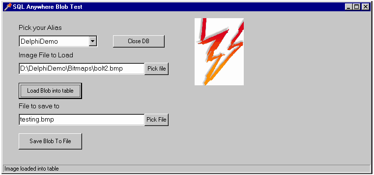
:::
 

Unlike inserting, saving BLOBs of any size to a file creates no problems
using BDE.  The following is an example of how to save a BLOB to a
file.  Keep in mind that 'imagefld' is the name of a column in a table.

 

Example 2 : Saving a BLOB to a file using BDE

    // This procedure gets the BLOB from the Table and saves it to a file
    procedure TForm1.SaveBlobToFileClick(Sender: TObject);
    begin
       // Tries to open table.  If invalid it sends an error message 
       try
          Table1.Open;
       except
          ShowMessage('Unable to Open Table');
          Table1.Close;
       end;
       // If the table is open then it jumps to the last value and saves the image in ‘imagefld’ to  
       //the path and filename provided by the user through the ‘Edit2’ box.
       if Table1.Active = True then
       begin
          Table1.Last;
          TBlobField(Table1.FieldByName('imagefld')).SaveToFile(Edit2.Text);
          Table1.Close;
           // Displays the image in the ‘Image2’ box
          Image2.Picture.LoadFromFile(Edit2.Text);
          StatusBar1.SimpleText := ('Image saved to ' + Edit2.text);
       end;
    end;

ODBCExpress

The ODBCExpress engine can be installed so that it can be used with
Delphi.  For installation instructions, please refer to Appendix A:
Setting up Delphi with the ODBCExpress Interface on page 28.  Upon
installation, Delphi has its own set of ODBCExpress components, which
can be used to create Windows applications using this interface instead
of, or along with the BDE components.  ODBCExpress has full cursor
support, which means that it is possible to move backwards, as well as
forwards, in a result set without having to cache the rows on the
front-end.  Since BLOBs are fetched from the database as they are
needed, you can have as many BLOBs as you want in your result set
without having to worry about running out of memory because of a
front-end cache. When testing this using Delphi 3 with an ASA 6.0.3
database and an ASA 7.0 database, it was found that it is possible to
manipulate BLOBs of multiple sizes, including ones larger than 1.4
megabytes.  Example 3 demonstrates how to insert a BLOB in Delphi using
the ODBCExpress engine. Take note that the BLOB in this example is a
bitmap.  Also recall that 'keyfld' and 'imagefld' are columns in the
table 'blob' with data types integer (and default autoincrement), and
long binary, respectively. 

 

Example 3: Inserting a BLOB into a database using ODBCExpress engine

    // This procedure puts the BLOB into the table and displays the image
    procedure TForm1.LoadBlobClick(Sender: TObject);
    var
       imagefld : TMemoryStream;
       nextnum : integer;
    begin
         // Create a memory stream object
         imagefld := TMemoryStream.Create;
         // Setting the dataset to a specific table (testblob1), opening the dataset and finding the
         // number of rows in the table
         OEDataSet1.Table := 'blob';
         OEDataSet1.Open;
         OEDataSet1.Last;
         // This is the last row in the table plus one
         nextnum := OEDataSet1.FieldValues['keyfld'] + 1;
     
         with Hstmt1 do
         begin
            // Set and prepare an insert statement with a BLOB column, imagefld
            SQL := 'INSERT INTO blob (keyfld, imagefld) VALUES (?, ?)';
            Prepare;
     
            // Assigning values to the parameters
            imagefld.LoadFromFile(Edit1.Text);
     
            // Use the BindBinary method to bind the BLOB
            BindInteger(1, nextnum);
            BindBinary(2, imagefld);
     
            // execute the statement to insert the BLOB at the datasource
            Execute;
         end;
     
         // The memory stream can be destroyed after the execute
         imagefld.Free;
     
         // This displays the image on the screen
         Image1.Picture.LoadFromFile(Edit1.Text);
    end;

 

It should be noted that similar to Example 1, the variable 'nextnum' is
used to provide a value for the 'keyfld' column.  Please refer to
Appendix C: Primary Key Issues on page 33 for details describing a
better method for providing a value.  It should also be noted that the
syntax is slightly different from the BDE.  Also, the line:

OEDataSet1.Table := 'blob';

is the programmatic way of assigning a table name to the data source. 
The alternative method, used for examples one and two, is to select your
'TTable' component on your form and beside the 'Table Name' property in
the 'Object Inspector' type in the name of the table you want to
access.  In addition to manipulating BLOBs of any size, ODBCExpress also
manipulates BLOBs with great speed.

 

Figure 8 is a picture of the application generated by the code outlined
above.  Here, 'DelphiDemo' is the name of the ODBC data source that
connects to the database with the table 'blob'.  The path and filename
written in the first 'Edit' box is the location and name of the image
that will be displayed and loaded into the table when the button 'Load
Blob into Table' is clicked.  The picture displayed here could not be
displayed using the BDE because it is larger then 1.4 megabytes in size.

 

 

 

 

 
:::{.center}
Figure 8

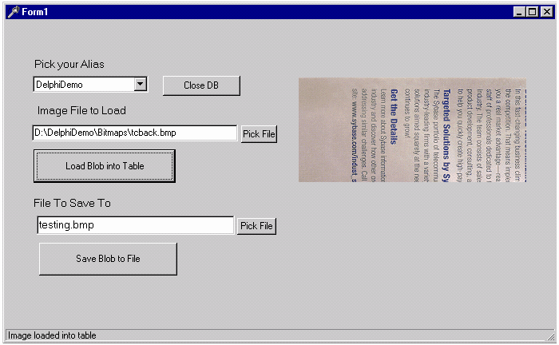
:::
 

Saving BLOBs using ODBCExpress is similar to saving them using BDE.  The
following example displays how this can be accomplished.  Recall that
'blob' is the name of the table being accessed and 'imagefld' is the
name of a column in blob.

 

Example 4: Saving a BLOB to a file using ODBCExpress

    procedure TForm1.SaveBlobClick(Sender: TObject);
    begin
         OEDataSet1.Table := 'blob';
         // Opens the table if possible and if not sends an error message
         try
            OEDataSet1.Open;
         except
            ShowMessage('Unable to Open Table');
            OEDataSet1.Close;
         end;
         // If the table is open, then jump to the last row in the table and save the last value in 
         // the ‘imagefld’ column to the path and filename provided by the user through the 
         // ‘Edit2’ box
         if OEDataSet1.Active = True then
         begin
            OEDataSet1.Last;
            TBlobField(OEDataSet1.FieldByName('imagefld')).SaveToFile(Edit2.Text);
            // This displays the image just saved in the image box Image2
            Image2.Picture.LoadFromFile(Edit2.Text);
         end;
    end;

 

Titan SQLAnywhere Developer

Similar to ODBCExpress, Titan SQLAnywhere Developer can be installed so
that it can interact with Delphi.  Please see Installing Titan and
Creating a Titan Alias on page 4, for more details on how to install
this product.  Although Titan SQLAnywhere Developer has its own set of
components when installed, it was designed so that it could interact
with the standard Delphi components.  When using the Titan components,
manipulating BLOBs of multiple sizes is possible.  Example 5 illustrates
how Titan SQLAnywhere Developer loads a BLOB into a table.  Some things
to note are listed below:

 

::: {style="text-align: left; text-indent: 0px; padding: 0px 0px 0px 0px; margin: 0px 0px 0px 48px;"}
  ---- ------------------------------------------------------------------------------------
  1.   'blob' is the name of the table where the BLOB, which is a bitmap, will be stored.
  ---- ------------------------------------------------------------------------------------
:::

::: {style="text-align: left; text-indent: 0px; padding: 0px 0px 0px 0px; margin: 0px 0px 0px 48px;"}
  ---- ----------------------------------------------------------------------------------------------------------------------------------------------------------------------------------------------------------
  2.   Recall that 'blob' has two columns, 'keyfld' and 'imagefld'.  The column 'keyfld' has the data type of 'integer' and is set to 'autoincrement'.  The column 'imagefld' has the data type 'long binary'. 
  ---- ----------------------------------------------------------------------------------------------------------------------------------------------------------------------------------------------------------
:::

::: {style="text-align: left; text-indent: 0px; padding: 0px 0px 0px 0px; margin: 0px 0px 0px 48px;"}
  ---- -----------------------------------------------------------------------------------------------------------
  3.   The syntax for this example is almost identical to that of Example 1.  The differences are the following:
  ---- -----------------------------------------------------------------------------------------------------------
:::

::: {style="text-align: left; text-indent: 0px; padding: 0px 0px 0px 0px; margin: 0px 0px 0px 48px;"}
  ---- ------------------------------------------------------------------------------------------------------------------------------------------------------
  4.   Since the 'tsTable' component is used instead of the 'TTable' component, the word 'Table1' in Example 1 is replaced with 'tsTable1' in this example.
  ---- ------------------------------------------------------------------------------------------------------------------------------------------------------
:::

::: {style="text-align: left; text-indent: 0px; padding: 0px 0px 0px 0px; margin: 0px 0px 0px 48px;"}
  ---- ---------------------------------------------------------------------------------------------------------------------------------------------------------------------------------------------------------------------------------------------------------------------------------------------------------------------------------------------------------------------------------------------------------------------------
  5.   This example does not insert a number into the column 'keyfld'.  Example 1 does this through the variable nextnum, which is assigned a value by going to the last row in the table and adding one to the value in the 'keyfld' column.  Appendix C: Primary Key Issues discusses different methods for assigning values to nextnum and why the method used in Example 5 is recommended over the method used in Example 1.
  ---- ---------------------------------------------------------------------------------------------------------------------------------------------------------------------------------------------------------------------------------------------------------------------------------------------------------------------------------------------------------------------------------------------------------------------------
:::

::: {style="text-align: left; text-indent: 0px; padding: 0px 0px 0px 0px; margin: 0px 0px 0px 48px;"}
  ---- -----------------------------------------------------------------------------------------------------------------------------------------------------------------------------------------------------------------------------------------------------------------------------------------------------------------------------------------------------------------
  6.   The line 'tsDatabase1.Commit'.  This is necessary when using Titan SQLAnywhere Developer because the default value for committing changes is set differently than the default for BDE or ODBCExpress.  If this line is not placed into the code, the image will be placed into the table initially but when the table is closed the change will be rolled back.
  ---- -----------------------------------------------------------------------------------------------------------------------------------------------------------------------------------------------------------------------------------------------------------------------------------------------------------------------------------------------------------------
:::

 

Example 5:  Loading a BLOB into a file using Titan SQLAnywhere

    procedure TForm1.LoadBlobButtonClick(Sender: TObject);
    begin
       tsTable1.TableName := 'blob';
       try
          tsTable1.Open;
       except
          ShowMessage('Unable to Open Table');
          tsTable1.Close;
       end;
     
       if tsTable1.Active = True then
       begin
          // inserting a BLOB into the table blob
          tsTable1.Fields[0].Required := false;  // this statement allows autoincrement to work
          tsTable1.Insert;
          TBlobField(tsTable1.FieldByName('imagefld')).LoadFromFile(Edit1.Text);
          tsTable1.Post;
          tsDatabase1.Commit;
          tsTable1.Close;
          // Displaying the BLOB in image1
          Image1.Picture.LoadFromFile(Edit1.Text);
       end;
    end;

Saving a BLOB to a file using Titan SQLAnywhere Developer is a simple
task.  Note that the syntax is identical to that of Example 2 with the
exception 'Table1' is replaced by 'tsTable1' in this example.

 

Example 6:  Saving a BLOB to a file using Titan SQLAnywhere

    procedure TForm1.SaveBlobToFileButtonClick(Sender: TObject);
    begin
       // Attempts to open table and sends an error message if this is not possible
       try
          tsTable1.Open;
       except
          ShowMessage('Unable to Open Table');
          tsTable1.Close;
       end;
     
       // if the table is active this code goes to the last row in the table and saves the image in 
       // the ‘imagefld’ to the path and file name written by the user in the ‘Edit2’ box.
       if tsTable1.Active = True then
       begin
          tsTable1.Last;
          TBlobField(tsTable1.FieldByName('imagefld')).SaveToFile(Edit2.Text);
          tsTable1.Close;
          Image2.Picture.LoadFromFile(Edit2.Text);
          StatusBar1.SimpleText := ('Image saved to ' + Edit2.Text);
       end;
    end;

NativeDB for SQL Anywhere

Similar to ODBCExpress and Titan SQLAnywhere Developer, NativeDB can be
installed so that it can interact with Delphi.  For more information
regarding installing NativeDB for SQL Anywhere, please refer to
Installing NativeDB for SQL Anywhere on page 6.  The NativeDB components
were designed to interact with the standard Delphi components, similar
to Titan SQLAnywhere Developer.  The components supplied by NativeDB are
used more for interacting with the database. 

 

BLOBs of all sizes can be manipulated using NativeDB components. 
Example 7 below illustrates how NativeDB loads a BLOB into a table. 

 

Example 7: Loading a BLOB into a database using NativeDB

    procedure TForm1. LoadBlobClick(Sender: TObject);
    begin
          // This attempts to open the table and if it fails it sends an error message
          try
              AsaDataset1.Open;
          except
              ShowMessage(‘Unable to Open Table’);
              AsaDataset1.Close;
          end;
     
          //Checks if the table is open already.  If so, it loads the selected blob into the database
          if AsaDataset1.Active = True then
          begin
              // This inserts a row into the table, fills the 'imagefld' column using the path and 
              // name specified by the user through the 'Edit1' box
              AsaDataset1.Insert;
              TBlobField(AsaDataset1.FieldByName('imagefld')).LoadFromFile(Edit1.Text);
              AsaDataset1.Post;
              AsaSession1.Commit;
              AsaDataset1.Close;
     
              // This displays the BLOB in the 'Image1' box
              Image1.Picture.LoadFromFile(Edit1.Text);
           end;
    end;

 

Some things to note are the following:

::: {style="text-align: left; text-indent: 0px; padding: 0px 0px 0px 0px; margin: 0px 0px 0px 48px;"}
  ---- ------------------------------------------------------------------------------------------------------------------------------------------------------------------------------------------------------------------------------------------------------------------------------------------------------------------------------------------------------------------------------------------------------------------
  1.   It is not obvious which table is being accessed in this example.  The 'SQL' property for the 'TAsaDataset' component is set to 'Select \* from blob' meaning that the table 'blob' is being accessed. Recall that table 'blob' has two columns, 'keyfld' and 'imagefld'.  The column 'keyfld' has the data type of 'integer' and default 'autoincrement'.  The column 'imagefld' has the data type 'long binary'
  ---- ------------------------------------------------------------------------------------------------------------------------------------------------------------------------------------------------------------------------------------------------------------------------------------------------------------------------------------------------------------------------------------------------------------------
:::

::: {style="text-align: left; text-indent: 0px; padding: 0px 0px 0px 0px; margin: 0px 0px 0px 48px;"}
  ---- -------------------------------------------------------------------------------------------------------------------------------------------------------------------------------------------------------------------------------------------------------
  2.   Unlike BDE, ODBCExpress, and Titan, NativeDB deals with the default 'autoincrement' automatically.  It does this by setting AsaDataset.Fields\[0\].Required to false initially.  Please refer to Appendix C: Primary Key Issues, for more information
  ---- -------------------------------------------------------------------------------------------------------------------------------------------------------------------------------------------------------------------------------------------------------
:::

::: {style="text-align: left; text-indent: 0px; padding: 0px 0px 0px 0px; margin: 0px 0px 0px 48px;"}
  ---- ----------------------------------------------------------------------------------------------------------------------------------------------------------------------------------------------------------------------------------------------------------------------------
  3.   It is also not obvious that the 'ReadOnly' property in the 'TAsaDataset' component is automatically set to 'False'.  This means that the BLOBs are not actually loaded into the table.  When this property is set to 'True' then the BLOBs will be inserted into the table
  ---- ----------------------------------------------------------------------------------------------------------------------------------------------------------------------------------------------------------------------------------------------------------------------------
:::

 

Saving a BLOB to a file using NativeDB is almost identical to saving a
file using BDE components.  In fact, the syntax for Example 8, using
NativeDB components is identical to that of Example 2, using BDE
components, with the exception of 'Table1' in Example 2 is replaced by
'AsaDataset1' in Example 8.  Another difference is that NativeDB has to
explicitly commit the postings, similar to Titan, but only if the
'AsaSession1' component has its 'AutoCommit' set to 'False'.

 

Example 8: Saving a BLOB to a file using NativeDB

    procedure TForm1. SaveBlobToFileClick(Sender: TObject);
    begin
          // Tries to open table.  If unsuccessful it sends an error message
          try
              AsaDataset1.Open;
          except
              ShowMessage(‘Unable to Open Table’);
              AsaDataset1.Close;
          end;
     
          // If the table is open then it jumps to the last value and saves the image in ‘imagefld’
          // to the path and name specified by the user in the ‘Edit2’ box
          if AsaDataset1.Active = True then
          begin
              AsaDataset1.Last;
              TBlobField(AsaDataset1.FieldByName(‘imagefld’)).SaveToFile(Edit2.Text);
              AsaDataset1.Close;
     
     
     
              // Displays the image in the ‘Image2’ box
              Image2.Picture.LoadFromFile(Edit2.Text);
          end;
    end;

 

DBGrid Examples

A 'DBGrid' is a data aware component that can be found on the 'Data
Control' tab of the component pallet in Delphi.  A data aware component
is 'aware' of the data stored in a database when it is bound to a data
source.  When working with Delphi and ASA, there have been known
problems in the past when using a 'DBGrid' component.  To solve these
problems Sybase created a check box called 'Delphi applications' that
can be seen when configuring your ODBC data source.  Please refer to
Figure 3 on page 3 to see where this check box can be found.  Any time
you are working with a 'DBGrid' component this check box should be
checked off for your ODBC data source.  Note: it has been found that the
'DBGrid' component uses bookmarks with the ODBCExpress and BDE
interfaces.  For more information on bookmarks refer to ODBCExpress on
page 24.

 

BDE

When just getting started with 'DBGrid' using BDE, there are a few
things that must be set up.

 

::: {style="text-align: left; text-indent: 0px; padding: 0px 0px 0px 0px; margin: 0px 0px 0px 48px;"}
  ---- ----------------------------------------------------------------------------------------------------------------------------------------------------------------------------------------------------------
  1.   The 'Table', 'DataSouce', and 'DBGrid' properties have been bound to each other. (Recall that binding components was talked about in the section Simple Case Setting Bound Control Properties on page 6)
  ---- ----------------------------------------------------------------------------------------------------------------------------------------------------------------------------------------------------------
:::

::: {style="text-align: left; text-indent: 0px; padding: 0px 0px 0px 0px; margin: 0px 0px 0px 48px;"}
  ---- --------------------------------------------------------------------------------------------------------------------------------------------------------------------------------------------------------------------------------------------------------------------------------------------------------------------------------------------------------------------------------------------------------------------------------------------------------------------------------------------------------------------------------
  2.   To ensure that 'DBGrid' will display the information in your database the 'Active' property must be set to true. One way to set this property is to select your 'Table' component on your form, and in the 'Object Inspector' on the 'Properties' tab, the 'Active' property can be seen.  The 'Active' property must be set to True otherwise your data will not appear in the 'DBGrid' even when the application is running.  Note that the 'Active' property can only be set to true once a 'Table Name' has been supplied.
  ---- --------------------------------------------------------------------------------------------------------------------------------------------------------------------------------------------------------------------------------------------------------------------------------------------------------------------------------------------------------------------------------------------------------------------------------------------------------------------------------------------------------------------------------
:::

 

Figure 9 depicts a 'DBGrid' application, whose 'TTable' component is
having its 'Active' property set to true.

 

 
:::{.center}
Figure 9

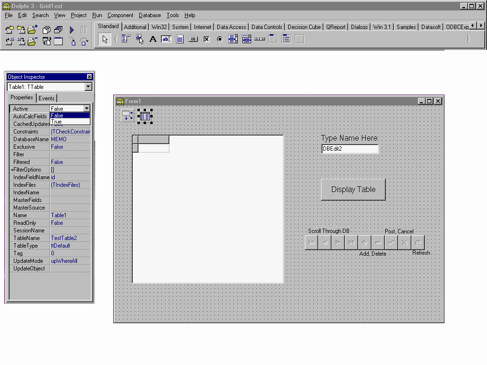{width="1024" height="768"}
:::
 

Setting the 'Active' property to 'True' causes an error when exiting
Delphi.  The error 'Access violation at address 1F4ADCD4.  Read of
address 1F4ADCD4' will appear.  This error is not serious and does not
effect your application in any way.  It is thought that the error comes
about only because Delphi recognizes that the connection is being broken
between the ASA engine and the application, and generates an error
message because it is still trying to display the information from the
database.

 

When an application is compiled and run, an executable file is created
with the same name as what you called your Project.  It can be found in
the same place you saved your Project and if this file is executed (e.g.
from Windows Explorer), it runs your application.  Closing this
executable file does not create the error, which is why the error does
not effect your application.

 

To avoid the above error it is recommended that you write an event that
sets the 'Active' property to true and then sets it back to false when
finished.  For example, a button can be clicked to display the data in
the table, and an 'OnClose' event can be set up so that when the form is
closed, the 'Active' property is set to false.  The following two
procedures can accomplish these tasks.  Note that the 'Active' property
must be set to false and the 'Table Name' property must be blank in the
'Object Inspector' for these procedures to take effect.  Also, the
button that is to be clicked (which can be seen on the form in Figure 9
above, labeled 'Display Table') has the 'Name' DisplayButton, and on the
'Events' tab in the 'Object Inspector', the event 'OnClick' is set to
the procedure 'DisplayButtonClick'.  Lastly, on the 'Events' tab for the
Form, the event 'OnClose' is set to 'FormClose'.

    procedure TForm1.DisplayButtonClick(Sender: TObject);
    begin
         // This binds the table component to the table ‘Grid’
         Table1.TableName := 'Grid';
         // This sets the ‘Active’ property to true
         Table1.Active := True;
    end;
     
    // This procedure sets the ‘Active’ property to false when a user closes the form
    procedure TForm1.FormClose(Sender: TObject; var Action: TCloseAction);
    begin
         Table1.Active := False;
    end; 

When testing this problem using Delphi 5, it was found that using events
to set the 'Active' property to 'True' and 'False' is not necessary. 
The error no longer occurs when closing Delphi.  It is still good
practice to set these events up so that 'Active' is not left set to
'True'.

 

An easy way to add and delete rows, move forwards and backwards through
the records, and edit your table through 'DBGrid' is to use the
component 'DBNavigator'.  In order to do this the component must be
bound to your 'DataSource', by selecting the 'DBNavigator' component,
and setting the 'DataSource' property in the 'Object Inspector'.  A
small problem that you can run into when using 'DBNavigator' occurs when
inserting a row.  If you click on the '+' button located on the
Navigator bar at run time, a blank row is inserted where you type in
values.  To post values that are entered, click on the '3' button which
is also located on the navigation component.  At this point, you cannot
see the row you have just added until you refresh the table.  To perform
a refresh, press the button '?' (Refresh).  However, as a result the
error, 'Table does not support this operation because it is not uniquely
indexed' may occur.  To fix this problem, select the 'Table' component
on your form and set the 'IndexFieldName' property in the 'Object
Inspector' to one of the column names in your table.  When this is done,
it enables identification of the rows in the table and therefore you can
refresh the table so newly entered rows can be seen.  This procedure
also orders the rows in your table by this column.  For example, if you
selected your 'IndexFieldName' to be 'id' which is an integer field,
your rows would be ordered numerically in ascending order. 

 

When the 'Active' property is set to true, whether through code or
through the 'Object Inspector', a SQL statement is executed which
fetches rows in the table.  When the 'IndexFieldName' property is left
blank the SQL statement that is executed is, 'SELECT id, name FROM
Grid'.  In this case, id and name are the names of all the columns in
the table Grid.  When the 'IndexFieldName' is set to one of the columns
in the table, (i.e. id), then the following statement is executed
instead.  SELECT id, name FROM Grid ORDER BY id.  The ORDER BY clause
sorts the rows according to the column specified in the 'IndexFieldName'
property.  Once the rows are fetched in a certain order Delphi
recognizes that the table has a unique index and therefore the table can
be refreshed.  It should be noted that if the column chosen is not the
primary key, then it is a good idea to place an index on the column. 
Doing so will improve performance.  For more information about indexes
please refer to the "SQL Anywhere documentation" (located under Start а
Programs а Sybase SQL Anywhere 7а SQL Anywhere documentation). 

 

Figure 10 depicts the 'IndexFieldName' property being set to the column
'id'.  The 'DBNavigator' component is circled.

 
:::{.center}
Figure 10

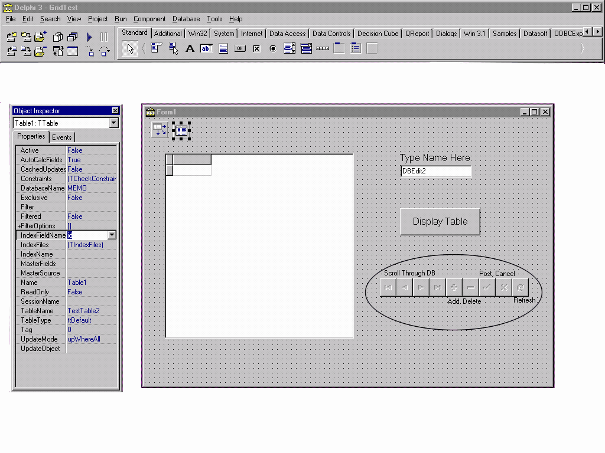
:::
 

A problem may also arise when using an ASA table that has a column with
the data type 'Integer' and the default 'Autoincrement'.  The problem
occurs when inserting a row into the 'DBGrid' using the 'DBNavigator'. 
Delphi does not understand that this column will provide a value for
itself, if one is not specified.  When inserting a row you would like to
be able to simply type values for the rest of the columns and click '3'
on the 'DBNavigator' component to post your new row.  You might expect
the autoincrement will add a number for that row.  What happens is the
error 'Field ID must have a value' occurs where 'ID' is the name of the
column with the autoincrement default which you left blank, assuming it
would increment itself.  This error occurs because Delphi automatically
sets the TField.Required property to True.  To fix this, so that
'DBGrid' makes use of autoincrement, follow these steps:

 

::: {style="text-align: left; text-indent: 0px; padding: 0px 0px 0px 0px; margin: 0px 0px 0px 48px;"}
  ---- ----------------------------------------------------------------------------------------------------------------------------------------------------------------------------------------------------------
  1.   Select the 'Form', making sure that a component on the form is not highlighted.  Make sure that the display on the top of the 'Object Inspector' says Form1 : TForm, or what you named your form : TForm
  ---- ----------------------------------------------------------------------------------------------------------------------------------------------------------------------------------------------------------
:::

::: {style="text-align: left; text-indent: 0px; padding: 0px 0px 0px 0px; margin: 0px 0px 0px 48px;"}
  ---- --------------------------------------------------------------------------------------------------------------------------------------------------------------------------------------------------------------------------------------------------------------------------------------------------------------------------------------------------------------------------------------
  2.   Select the 'Events' tab on the 'Object Inspector' and make the row 'OnShow' the focus.  Double click the white space to the right of the name 'OnShow'.  This will create a procedure header named 'FormShow' where code is to be written.  (Note: creating this procedure in the 'OnShow' event ensures that the autoincrement feature will work as soon as the application is run)
  ---- --------------------------------------------------------------------------------------------------------------------------------------------------------------------------------------------------------------------------------------------------------------------------------------------------------------------------------------------------------------------------------------
:::

::: {style="text-align: left; text-indent: 0px; padding: 0px 0px 0px 0px; margin: 0px 0px 0px 48px;"}
  ---- --------------------------------------------------------------------------------
  3.   Make your procedure 'FormShow' look like the following by adding lines of code
  ---- --------------------------------------------------------------------------------
:::

    procedure TForm1.FormShow(Sender: TObject);
    begin
          Table1.Fields[0].Required := False;
    end;

 

It should be noted that Delphi associates each column in a table with a
number, starting at 0.  In the above code the number 0 represents the
column which has autoincrement set as its default in ASA.

 

The above procedure only works if the 'Active' property is set to
'True'.  If this is not the case then upon running the application, the
error 'List index out of bounds (0)' will occur because the form shows
no columns in 'DBGrid' when the 'Active' property is false.  To get
around this error, the line of code,  

                              Table1.Fields\[0\].Required := False;

should be placed in another event, such as a button click event
discussed above.

A small problem when using 'DBGrid' with an ASA database arises when a
column in the table being displayed has the data type 'long varchar'. 
If this is the case, 'DBGrid' displays '(MEMO)' in place of what is
actually in the database under that column.  It seems that a column in
the 'DBGrid' can not display a string of that size.  A 'DBMemo'
component seems to be the only data aware component that can view a data
type of that size.  To set up a 'DBMemo' component that displays the
values for a particular column do the following:

 

::: {style="text-align: left; text-indent: 0px; padding: 0px 0px 0px 0px; margin: 0px 0px 0px 48px;"}
  ---- -------------------------------------------
  1.   Select the 'DBMemo' component on the form
  ---- -------------------------------------------
:::

::: {style="text-align: left; text-indent: 0px; padding: 0px 0px 0px 0px; margin: 0px 0px 0px 48px;"}
  ---- ---------------------------------------------
  2.   Set the 'DataSource' property appropriately
  ---- ---------------------------------------------
:::

::: {style="text-align: left; text-indent: 0px; padding: 0px 0px 0px 0px; margin: 0px 0px 0px 48px;"}
  ---- -----------------------------------------------------------------------------
  3.   Set the 'DataField' property to the name of the column you wish to display.
  ---- -----------------------------------------------------------------------------
:::

 

All of the examples and problems discussed above use the 'TTable'
component.  Another component that can be used to access a table in a
database is the 'TQuery' component.  Using this component, you can still
display the table using a 'DBGrid' component, however, now there is
greater flexibility.  With 'TTable', 'DBGrid' displays all columns and
all rows in a table.  Using 'TQuery', SQL statements can be made so that
only the columns and rows wanted are displayed.  The records that are
displayed after the SQL statement is executed are called the 'Result
Set' of the query.

 

Figure 11 depicts an application where a result set from a query (the
Query component is circled) is displayed in the 'DBGrid' component. 
When the 'Edit1' box under the title 'Type ORDER BY or WHERE clause
Here' is left empty and the 'Display Table' button is clicked, the
result set is that of the entire table.  When a 'Where' clause is
included and the 'Display Table' button is clicked, a select group of
rows and columns are displayed. 

 

An example of a SQL statement with a 'Where' clause is:

SELECT id FROM Grid WHERE name = 'your name'

In this statement 'id' is the column in the table 'Grid' that will be
displayed, but only those rows where the 'name' column has the value
'your name'. 

When the 'Order By' clause is included and the 'Display Table' button is
clicked, the entire table is displayed in a specific order.  An example
of a SQL statement with an 'Order By' clause is:

SELECT \* FROM Grid ORDER BY id

This statement selects all rows and columns in the table 'Grid' and
orders the rows according to the value in the 'id' column. 

 

When both clauses are included and the button 'Display Table' is
clicked, a select group of rows and columns are displayed in a certain
order.  An example of an SQL statement where both clauses are included
is:

SELECT \* FROM Grid WHERE name = 'your name' ORDER BY id

This statement selects all the columns in the table Grid where the value
in the 'name' column is 'your name' and displays them in order of the
value in the 'id' column. 

 

Since an SQL statement is used to populate the 'DBGrid', the
'IndexFieldNames' property, discussed above, does not exist and is not
needed.  To sort a displayed table, the 'Order By' clause can be placed
in the SQL statement.  To refresh the table after it has been modified,
the SQL statement just has to be rerun. 

 
:::{.center}
Figure 11

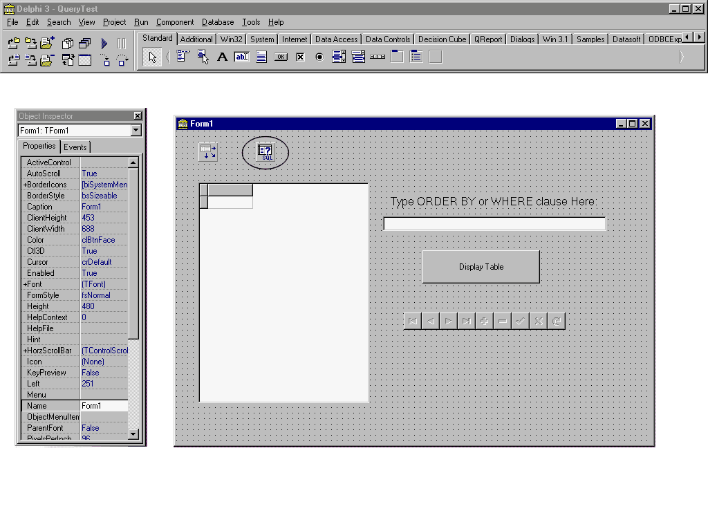
:::
 

The 'TQuery' component, when used with a 'DBGrid' component can do much
more then what is described above.  Not only can you display the result
set of a query done on one table in a database, but you can also display
the result set of a query done on several tables in a database, by
changing the SQL statement that is executed.  An example of an SQL
statement that involves more than one table is:

 

    SELECT * FROM Grid, AnotherGrid WHERE Grid.Name = 'your name'

Assume that 'Name' is a column in the table 'Grid'.  This statement will
take all the columns in both Grid and AnotherGrid, and display only the
rows where Name = 'your name' in Grid. 

 

Since two separate tables are involved in the query above editing the
result set is not an option.  That is, inserting rows, deleting rows or
editing existing rows cannot be done using typical methods with this
interface. 

 

ODBCExpress

Using a 'DBGrid' component with ODBCExpress is slightly different than
using it with the BDE.  ODBCExpress does not have a 'Table' component
but instead uses an 'OEDataSet' component.  Since there needs to be a
way of binding the 'DBGrid' with the 'OEDataSet', the BDE 'DataSource'
component is added to the form.  Now the Grid has a way of communicating
with the database.  An interesting feature of the 'OEDataSet' is that it
has an 'SQL' property.  This means that SQL statements can be run on a
table in a database to display the information in different ways.  This
gives the 'OEDataSet' component similar functionality to the BDE 'Query'
component.  Similar to using a 'DBGrid' component with BDE, the 'Active'
property for the 'OEDataSet' component must be set to True to display a
table in the 'DBGrid'.  If this component is set at design time then the
Access violation error occurs when closing Delphi, similar to BDE.  This
problem is discussed on page 19 and the recommended solution can be
found there. Another notable difference between ODBCExpress and BDE is
that ODBCExpress uses scrollable cursors.  Testing this problem using
Delphi 5 revealed that the problem was fixed for this version.  Although
these problems were discovered using ASA 6.0.3, when tested using ASA
7.0 the problems remain.  Please refer to Appendix D for versions of ASA
where the problems were addressed.

 

Some interesting problems can occur when using ODBCExpress with a
'DBGrid' component.  Inserting rows into a table can be difficult.  It
is not obvious that the 'OEDataSet' component has a default value of
Read Only for the result set from the SQL statement.  This means that
when an attempt to insert, delete, or update a row is done, the error
'Option value out of range' is given.  Follow these steps to avoid this
error:

 

::: {style="text-align: left; text-indent: 0px; padding: 0px 0px 0px 0px; margin: 0px 0px 0px 48px;"}
  ---- -----------------------------------------------
  1.   Select the 'OEDataSet' component on your form
  ---- -----------------------------------------------
:::

::: {style="text-align: left; text-indent: 0px; padding: 0px 0px 0px 0px; margin: 0px 0px 0px 48px;"}
  ---- --------------------------------------------------------------------------------
  2.   Double click '+' to the left of the 'hStmt' property in the 'Object Inspector'
  ---- --------------------------------------------------------------------------------
:::

::: {style="text-align: left; text-indent: 0px; padding: 0px 0px 0px 0px; margin: 0px 0px 0px 48px;"}
  ---- --------------------------------------------------------------------------------------------------------
  3.   Select the property 'Concurrency Type' and choose 'Values' or 'Row Versions' from the drop down list. 
  ---- --------------------------------------------------------------------------------------------------------
:::

::: {style="text-align: left; text-indent: 0px; padding: 0px 0px 0px 0px; margin: 0px 0px 0px 48px;"}
  ---- -----------------------------------------------------------------------------------------------------------------------------------------------------------------------------
  4.   The 'OEDataSet' component also has a property 'Editable' which is automatically set to 'False'.  If data is to be edited at run time, this property must be set to 'True'. 
  ---- -----------------------------------------------------------------------------------------------------------------------------------------------------------------------------
:::

 

Of the three interfaces discussed in this document, ODBCExpress seems to
be the only one where the type of cursor used can be changed.  To change
the type of cursor:

 

::: {style="text-align: left; text-indent: 0px; padding: 0px 0px 0px 0px; margin: 0px 0px 0px 48px;"}
  ---- ----------------------------------------------
  1.   Select the 'OEDataSet' component on the form
  ---- ----------------------------------------------
:::

::: {style="text-align: left; text-indent: 0px; padding: 0px 0px 0px 0px; margin: 0px 0px 0px 48px;"}
  ---- ----------------------------------------------------------------------------------------
  2.   In the 'Object Inspector' double click on the '+' to the left of the 'hStmt' property.
  ---- ----------------------------------------------------------------------------------------
:::

::: {style="text-align: left; text-indent: 0px; padding: 0px 0px 0px 0px; margin: 0px 0px 0px 48px;"}
  ---- -------------------------------------------------------------------------------------------------------------------------------------------------------------
  3.   In the expanded list, the property 'CursorType' can be seen and one of Forward-Only, Dynamic, Keyset-Driven, or Static can be chosen from a drop down list.
  ---- -------------------------------------------------------------------------------------------------------------------------------------------------------------
:::

For more information on these cursors, please refer to the whitepaper,
OEWPaper.pdf, under the section 'Cursor Types', which is provided by
Datasoft when ODBCExpress is downloaded.

Since the rows that make up the result sets in Static and Keyset-Driven
cursors remain static, it is possible to retrieve bookmark values for
these cursors.  Bookmarks are values used to identify rows in a cursor
and are generally based on position in a result set.  They remain valid
for the duration of the result set only.  Forward-only and Dynamic
cursors are generally not able to return bookmark values for rows. 
Therefore, if Dynamic is chosen, a problem occurs when trying to scroll
through result sets containing many rows that are displayed in
data-aware controls.  An attempt to scroll through the result set will
often result in the error 'Fetch type out of range'.  Attempts to
insert, delete or edit rows in the result set produce the same error. 
If the Forward- Only cursor is chosen, it will create the same error
when attempting to scroll backward through the result set.  Again,
inserting, deleting, and editing rows in the result set generate this
error.  Therefore, when using a 'OEDataSet' component where bookmarks
are required, it is recommended that a Keyset-Driven or a Static cursor
be used. There are options in Delphi 5 that can be set so that
Forward-Only and Dynamic cursors can be used without error.  To set
these options:

 

::: {style="text-align: left; text-indent: 0px; padding: 0px 0px 0px 0px; margin: 0px 0px 0px 48px;"}
  ---- ----------------------------------------------
  1.   Select the 'OEDataSet' component on the form
  ---- ----------------------------------------------
:::

::: {style="text-align: left; text-indent: 0px; padding: 0px 0px 0px 0px; margin: 0px 0px 0px 48px;"}
  ---- -------------------------------------------------------------
  2.   In the 'Object Inspector' set the 'Cached' property to true
  ---- -------------------------------------------------------------
:::

::: {style="text-align: left; text-indent: 0px; padding: 0px 0px 0px 0px; margin: 0px 0px 0px 48px;"}
  ---- ----------------------------------------------
  3.   Click on the '+' beside the 'hStmt' property
  ---- ----------------------------------------------
:::

::: {style="text-align: left; text-indent: 0px; padding: 0px 0px 0px 0px; margin: 0px 0px 0px 48px;"}
  ---- -----------------------------------------------------------------
  4.   Set the 'CursorType' property to either Dynamic or Forward-Only
  ---- -----------------------------------------------------------------
:::

 

When this is done scrolling, both backwards and forwards in the result
set is allowed, as well as inserting, deleting and editing rows.

 

When a result set is static (i.e., when using a Static cursor, or a
Keyset-Driven cursor) and the 'OEDataSet' component is used, unexpected
results can occur when inserting a row, deleting a row, or editing a row
in the result set.  When using a Static cursor with ASA version
6.0.3.2747, an error occurs when deleting a row.  When you click 'OK',
all of the rows that were in your table disappear except for one.  This
problem was addressed with in the EBF for ASA 6.0.3.  Instead of the
initial error, the comment 'Invalid cursor state' is given.

 

Using the 'Keyset Driven' cursor allowed rows to be deleted.  However,
when the result set is closed and reopened, the rows that were deleted
will reappear.  This happens even when a 'Commit' is explicitly
written.  The ebf for ASA fixes the problem of the rows reappearing but
leaves another one.  Occasionally the error 'Invalid cursor state' will
arise, due to the following conditions.  Since the result set is static,
a row being manipulated is not physically added, removed or changed. 
Visually this means that inserted rows should disappear, deleted rows
should reappear, and changed rows should remain the same.  However,
since the 'TOEDataSet' component is a descendant of the 'TDataSet'
component, and its required behaviour is to have inserted rows remain,
deleted rows disappear, and edited rows change, ODBCExpress alters its
typical behaviour to behave similar to the 'TDataSet' component.  To
behave similarly to the 'TDataSet' component, 'TOEDataSet' keeps track
of the deleted and modified rows and adjusts the visual display
accordingly.  Therefore, when the result set is reopened, rows deleted
will reappear and rows edited will go back to their original values. 
For rows inserted, the only way to bypass the problem of the rows
disappearing is to keep track of the primary keys of the inserted row,
then close and re-open the result set, and then position to the inserted
row which might now form part of the new result set.

Installing the file dbodbc6.dll, which has the same version number as
the ebf (refer to Appendix D on page 35 for details), into the directory
where all the ASA dll's are, solves the 'Invalid cursor state' error. 
This allows deleting, inserting, and editing rows with Static and
Keyset-Driven cursors to take place with no problems.

Testing these problems with ASA 7.0 yielded some similar and some
different results.  Using the Forward-Only and Dynamic cursors, the
'Fetch type out of range' errors that occurred with ASA 6.0 still occur
with ASA 7.0.  Using the Static and Keyset-Driven cursors with ASA 7.0,
an error occurs when attempting to delete or update a row in the
database.  The error is, 'Syntax error or access violation.  Update
operation attempted on non-updatable query.' Also, when attempting to
insert a row into the database, no error occurs but when you refresh the
table, the row just added will disappear.  These errors occur because of
documented change in behavior from ASA 6.0.3 to ASA 7.0.  To return to
the behavior of ASA 6.0.3 the following can be done:

 

::: {style="text-align: left; text-indent: 0px; padding: 0px 0px 0px 0px; margin: 0px 0px 0px 48px;"}
  ---- -----------------------------------
  1.   From the Start Menu, click 'Run'.
  ---- -----------------------------------
:::

::: {style="text-align: left; text-indent: 0px; padding: 0px 0px 0px 0px; margin: 0px 0px 0px 48px;"}
  ---- ---------------------------------------------------------------------------------------------------------------------------------------------------------------------------
  2.   Type in 'dbisql -c "uid=dba;pwd=sql;dsn=the name of your ODBC source' and click 'OK'.  For example, for the DelphiDemo you would type:                                   
  ---- ---------------------------------------------------------------------------------------------------------------------------------------------------------------------------
:::

dbisql -c \"uid=dba;pwd=sql;dsn=DelphiDemo\"

::: {style="text-align: left; text-indent: 0px; padding: 0px 0px 0px 0px; margin: 0px 0px 0px 48px;"}
  ---- ----------------------------------------------------------------------------------------------------------------
  3.   In the 'SQL Statements' window type,                                                                          
  ---- ----------------------------------------------------------------------------------------------------------------
:::

set option public.ansi\_update\_constraints='off'

      and click the play button.

::: {style="text-align: left; text-indent: 0px; padding: 0px 0px 0px 0px; margin: 0px 0px 0px 48px;"}
  ---- ----------------------------------------------------------------------------------------------------------
  4.   When dbisql is finished executing the statement just typed in will be highlighted in blue.  Exit dbisql.
  ---- ----------------------------------------------------------------------------------------------------------
:::

::: {style="text-align: left; text-indent: 0px; padding: 0px 0px 0px 0px; margin: 0px 0px 0px 48px;"}
  ---- ------------------------------------------------------------------------------------------------------------
  5.   Close down your Delphi application and restart it.  Make sure the database engine shuts down and restarts.
  ---- ------------------------------------------------------------------------------------------------------------
:::

::: {style="text-align: left; text-indent: 0px; padding: 0px 0px 0px 0px; margin: 0px 0px 0px 48px;"}
  ---- ----------------------------------------------------------------------------------------------------------------------
  6.   You should now be able to insert, delete and update rows without problems, using a Static or Keyset\_Driven cursor. 
  ---- ----------------------------------------------------------------------------------------------------------------------
:::

 

Using the component 'OEQuery' instead of 'OEDataSet' makes very little
difference.  The two components are practically the same with only minor
differences.  When using the 'OEQuery' components with a 'DBGrid'
component the same errors arise as when using the 'OEDataSet'
component.  It should be noted that when a query is done involving more
than one table, ODBCExpress cannot handle having two identical column
names in both tables.  Aliases for the column names must be placed in
the SQL Select Statement if selecting two columns with the same name is
to be done.  Also, inserting rows, deleting rows or editing rows in a
result set involving two or more tables falls outside the scope of this
paper.

 

Titan SQLAnywhere Developer

To use a 'DBGrid' component with Titan SQLAnywhere Developer, the BDE
'DataSource' component must be present, and its 'DataSet' property must
be bound to a 'tsTable' component or 'tsQuery' component.  This way the
'DBGrid' component has a way of communicating with the database. 
Similar to the BLOB examples, syntax for using 'DBGrid' and Titan is
almost identical to using 'DBGrid' with BDE.  Unlike BDE and
ODBCExpress, Titan SQLAnywhere Developer does not create the 'Access
violation at address 1F4ADCD4.  Read of address 1F4ADCD4' error when the
'Active' property is set to 'True' and Delphi is closed. 

 

One of the only problems found when using Titan SQLAnywhere Developer
with a 'DBGrid' component is viewing the data in a particular order. 
Recall that with BDE, setting the 'IndexFieldNames' property for the
'TTable' component to a column in the table puts an ORDER BY clause on
the end of the fetch and therefore returns a result set with the rows
ordered by that column.  When this is done using Titan's 'tsTable'
component, the error 'tsTable1 has no index for fields id' occurs where
'id' is the name of the column that the 'IndexFieldNames' was set to. 
There does not appear to be a way of viewing a result set in a
particular order using a 'tsTable' component.

 

Using a 'tsQuery' component instead of a 'tsTable' component with a
'DBGrid' is recommended when ordering data is necessary.  With the
'tsQuery', the 'SQL' property can be set so that many different SQL
statements can be run on the database, leading to greater flexibility
for viewing data.  Using this component, no problems occur with regards
to editing the rows in the result set.  Getting the result set for the
query is fast, and jumping to the last row in the result set takes
relatively little time compared to BDE.  If the query being executed
involves more than one table, then inserting rows, deleting rows, or
editing rows in the result set cannot be done using typical methods.

 

Again, with Titan, when any changes are made to the table, a Commit must
be explicitly written.  The reason for this is that the default value
for committing data is set differently in Titan than in BDE or
ODBCExpress.

 

 

NativeDB for SQL Anywhere

Similar to ODBCExpress, NativeDB does not have a 'Table' component and
instead uses an 'AsaDataset' component.  To bind the 'DBGrid' with the
'AsaDataset', which is used to access your database, the BDE
'DataSource' component is added to the form.  Then set the 'DataSource'
to point to the 'AsaDataset' and the 'DBGrid' to point to the
'DataSource' component.  The 'AsaDataset' component accesses a table
through its 'SQL' property.  Therefore, instead of being limited to
selecting all columns from only one table, an SQL statement can be
written to access any columns of a table as well as multiple tables at
once.  The 'SQL' property gives the 'AsaDataset' component similar
functionality to the ODBCExpress 'OEDataSet' component, as well as BDE
'Query' and Titan 'tsQuery' components.  As with BDE, the 'Active'
property for 'AsaDataset' must be set to 'True' to display a table in
the 'DBGrid'.  Unlike BDE and ODBCExpress, NativeDB does not create the
'Access violation at address 1F4ADCD4' error discussed above.  Also, the
'ReadOnly' property must be set to 'False' in order to insert, delete or
update rows in the result set.

 

An interesting feature with NativeDB is its ability to position the
'DBGrid' vertical scrollbar at the current and accurate row.  BDE,
ODBCExpress and Titan only support a three-state scrollbar, where the
scroll thumb is either at the top, bottom or in the middle.

 

 

 

 

 

 

APPENDIX A

Setting up Delphi with the ODBCExpress Interface

If you are creating your application using the BDE then no set up is
necessary after setting up an ODBC data source for your database.  If,
however, you decided to use the ODBCExpress engine or Titan SQL
Anywhere, you have a few more steps to take before starting in Delphi.

 

For ODBCExpress, the first step is to open Delphi and uninstall older
versions of ODBCExpress.  To do this:

::: {style="text-align: left; text-indent: 0px; padding: 0px 0px 0px 0px; margin: 0px 0px 0px 48px;"}
  ---- -------------------------------------------------------------------
  1.   Select 'Component' from the tool bar and click 'Install Packages'
  ---- -------------------------------------------------------------------
:::

::: {style="text-align: left; text-indent: 0px; padding: 0px 0px 0px 0px; margin: 0px 0px 0px 48px;"}
  ---- ------------------------------------------------------------------------------------------------
  2.   In the 'Design packages' list box select the ODBCExpress package and click the 'Remove' button
  ---- ------------------------------------------------------------------------------------------------
:::

::: {style="text-align: left; text-indent: 0px; padding: 0px 0px 0px 0px; margin: 0px 0px 0px 48px;"}
  ---- ----------------------------------
  3.   Click 'OK' to remove the package
  ---- ----------------------------------
:::

::: {style="text-align: left; text-indent: 0px; padding: 0px 0px 0px 0px; margin: 0px 0px 0px 48px;"}
  ---- ------------------------------------------------------------------
  4.   Select 'Tools' from the tool bar and click 'Environment Options'
  ---- ------------------------------------------------------------------
:::

::: {style="text-align: left; text-indent: 0px; padding: 0px 0px 0px 0px; margin: 0px 0px 0px 48px;"}
  ---- ----------------------------------------------------------------------------------------------------------------------------------------
  5.   Select the 'Library' tab and remove any references to directories that contain ODBCExpress components from the 'Library Path' edit box
  ---- ----------------------------------------------------------------------------------------------------------------------------------------
:::

 

To install ODBCExpress:

::: {style="text-align: left; text-indent: 0px; padding: 0px 0px 0px 0px; margin: 0px 0px 0px 48px;"}
  ---- -------------------------------------------------------------------------------
  1.   Select 'Component' from the tool bar and click 'Install Packages' (Figure 12)
  ---- -------------------------------------------------------------------------------
:::

::: {style="text-align: left; text-indent: 0px; padding: 0px 0px 0px 0px; margin: 0px 0px 0px 48px;"}
  ---- -----------------------------------------------------------------------------------------------------------------------------------
  2.   Click on the 'Add' button and select the file OE.bpl from the 'Package' folder in the directory in which you unzipped ODBCExpress
  ---- -----------------------------------------------------------------------------------------------------------------------------------
:::

 
:::{.center}
Figure 12

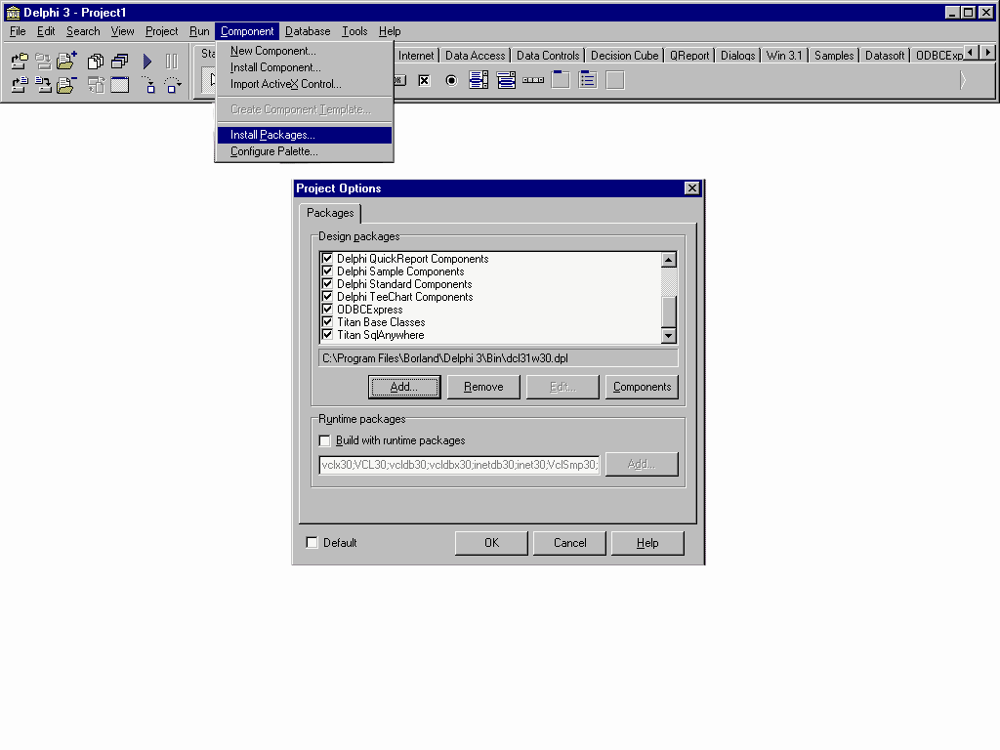
:::

::: {style="text-align: left; text-indent: 0px; padding: 0px 0px 0px 0px; margin: 0px 0px 0px 48px;"}
  ---- -----------------------------------
  3.   Click 'OK' to install the package
  ---- -----------------------------------
:::

::: {style="text-align: left; text-indent: 0px; padding: 0px 0px 0px 0px; margin: 0px 0px 0px 48px;"}
  ---- ------------------------------------------------------------------
  4.   Select 'Tools' from the tool bar and click 'Environment Options'
  ---- ------------------------------------------------------------------
:::

::: {style="text-align: left; text-indent: 0px; padding: 0px 0px 0px 0px; margin: 0px 0px 0px 48px;"}
  ---- --------------------------
  5.   Select the 'Library' tab
  ---- --------------------------
:::

::: {style="text-align: left; text-indent: 0px; padding: 0px 0px 0px 0px; margin: 0px 0px 0px 48px;"}
  ---- --------------------------------------------------------------------------------------------------------------------------
  6.   In the 'Library Path' edit box, add the path to the folders 'Lib' and 'Package', which is where you unzipped ODBCExpress
  ---- --------------------------------------------------------------------------------------------------------------------------
:::

 

To install the help files:

::: {style="text-align: left; text-indent: 0px; padding: 0px 0px 0px 0px; margin: 0px 0px 0px 48px;"}
  ---- ------------------------------------------------------------------------------------------------------
  1.   Copy the help files 'OE32.HLP' and 'OE32.CNT' into the 'Help' folder under the Delphi main directory
  ---- ------------------------------------------------------------------------------------------------------
:::

::: {style="text-align: left; text-indent: 0px; padding: 0px 0px 0px 0px; margin: 0px 0px 0px 48px;"}
  ---- ----------------------------------------------------------------------------------
  2.   Open the DELPHI3.CNT file located in the Delphi Help directory and add the line,
  ---- ----------------------------------------------------------------------------------
:::

       :Index ODBCExpress Reference=oe32.hlp,

      to the 'Index' section at the top of the file

Note that for new versions this is done automatically.

 

When these steps are done, start up Delphi and you should notice a new
tab on the 'Components' palette (the window located at the top of the
screen) with the name ODBCExpress.  Please refer to the Figure 13
below.  Use these components instead of the provided BDE components to
create applications with ODBCExpress capabilities.  If you require help
on the ODBCExpress data types or different functions and procedures you
simply select 'Help' from the tool bar and you can search for the
information you are looking for.

 
:::{.center}
Figure 13

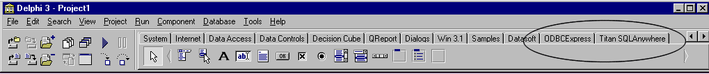
:::
 

These instructions can also be found in the Readme file that is included
when you download ODBCExpress.

 

 

APPENDIX B

Modifying ASA 7.0 Sample

The sample database that comes with ASA 7.0 is called asademo.db and is
located in the directory you installed ASA in.  By default this is
C:\\Program Files\\Sybase\\SQL Anywhere 7\\asademo.db.  First make a
copy of asademo.db, and copy it to another directory and rename it.  For
this example the database was renamed asademoTest.  Renaming the
database should be done so you always have a fresh copy of the original
database in case something goes wrong.  The log file should also be
renamed.  The quickest way to do this is to click on 'Start а Run' and
type in 'dblog --t C:\\asademoTest.log C:\\asademoTest.db'.  Here,
C:\\asademoTest.log is the path and name of where you want the log file
and what you want to call it.  C:\\asademoTest.db is the path and name
of where the renamed database can be found.

 

The simplest way to modify the database is to do the following:

::: {style="text-align: left; text-indent: 0px; padding: 0px 0px 0px 0px; margin: 0px 0px 0px 48px;"}
  ---- -------------------------------------------------------------------------------------------------------------------------------------------------------------------------------------------------------------------------------------------------------------------------------------------------------------------------------------------------------------------------
  1.   Open 'Sybase Central 4.0' by clicking 'Start а Programs а Sybase SQL Anywhere 7 а Sybase Central 4.0'.  When the window appears, you will notice that asademo can be seen on the left-hand side of your screen under the title Adaptive Server Anywhere 7.  You should also notice a database engine icon in the bottom right-hand side of your screen on the Start bar
  ---- -------------------------------------------------------------------------------------------------------------------------------------------------------------------------------------------------------------------------------------------------------------------------------------------------------------------------------------------------------------------------
:::

::: {style="text-align: left; text-indent: 0px; padding: 0px 0px 0px 0px; margin: 0px 0px 0px 48px;"}
  ---- ----------------------------------------------------------------------------------------------------------------------------------------------------------------------------------
  2.   From the menu bar choose 'Tools' and select 'Connect'.  A window called 'New Connection' will appear.  Choose 'Adaptive Server Anywhere 7 from the drop down menu and click 'OK'
  ---- ----------------------------------------------------------------------------------------------------------------------------------------------------------------------------------
:::

::: {style="text-align: left; text-indent: 0px; padding: 0px 0px 0px 0px; margin: 0px 0px 0px 48px;"}
  ---- ---------------------------------------------------------------------------------------------------------------------------------
  3.   On the 'Identification' tab type in the 'User' as 'dba' in the appropriate edit box and the 'Password' as 'sql' in its edit box
  ---- ---------------------------------------------------------------------------------------------------------------------------------
:::

::: {style="text-align: left; text-indent: 0px; padding: 0px 0px 0px 0px; margin: 0px 0px 0px 48px;"}
  ---- ---------------------------------------------------------------------------------------------------------------------------------------------------------------------------------------------
  4.   On the 'Database' tab click on the 'Browse' button located by 'Database File'.  Find the path where you placed your copy of asademo.db and select your database (e.g.  C:\\asademoTest.db )
  ---- ---------------------------------------------------------------------------------------------------------------------------------------------------------------------------------------------
:::

::: {style="text-align: left; text-indent: 0px; padding: 0px 0px 0px 0px; margin: 0px 0px 0px 48px;"}
  ---- ----------------------------------------------------------------------------------------------------------------------------------------------------------------------------------------------------------------------
  5.   Click 'OK'.   It will appear as if nothing happened but if you click on the '+' to the left of asademo, you should see the name of your database (in this case asademoTest) as well as asademo with a different icon
  ---- ----------------------------------------------------------------------------------------------------------------------------------------------------------------------------------------------------------------------
:::

::: {style="text-align: left; text-indent: 0px; padding: 0px 0px 0px 0px; margin: 0px 0px 0px 48px;"}
  ---- ------------------------------------------------------------------------------------------------------------
  6.   Click on the '+' to the left of asademoTest and you will see a list of folders, the top one being 'Tables'
  ---- ------------------------------------------------------------------------------------------------------------
:::

::: {style="text-align: left; text-indent: 0px; padding: 0px 0px 0px 0px; margin: 0px 0px 0px 48px;"}
  ---- -----------------------------------------------------------------------------------------------------------------------------------------------------------------------------------------------------------
  7.   If you click on the '+' to the left of the 'Tables' folder you will see a list of all the names of the tables in the database.  Figure 14 on the following page depicts what you should see at this point
  ---- -----------------------------------------------------------------------------------------------------------------------------------------------------------------------------------------------------------
:::

 

 

 
:::{.center}
Figure 14

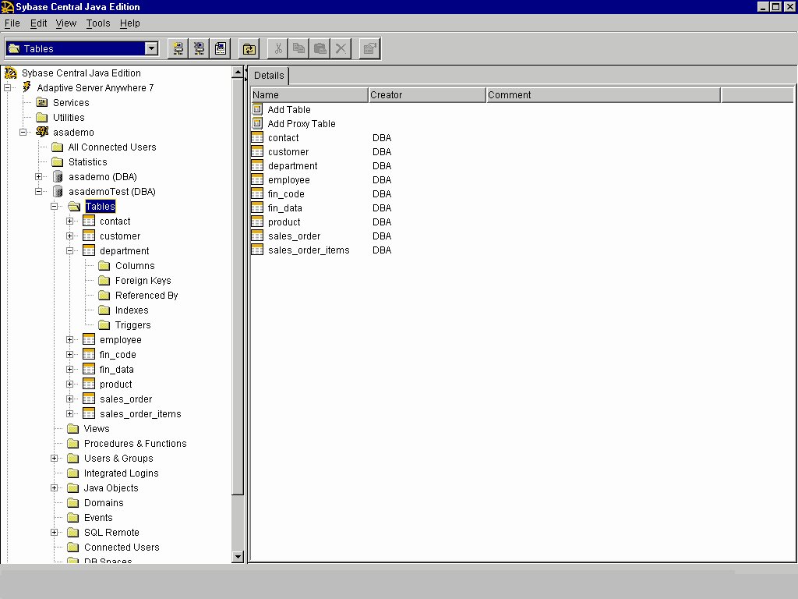
:::
 

::: {style="text-align: left; text-indent: 0px; padding: 0px 0px 0px 0px; margin: 0px 0px 0px 48px;"}
  ---- --------------------------------------------------------------------------------------------------------------------------------------------------------------------------------------------------------------------------------------------------------------------------------------------------------------------------------
  8.   If you want to add a table, click on the 'Tables' folder and on the right hand side double click on 'Add Table'.  This will bring you to a form where you can name the table and add columns to it.  Note that this is not a way of putting information into the table.  It is just a way of creating the names of the columns
  ---- --------------------------------------------------------------------------------------------------------------------------------------------------------------------------------------------------------------------------------------------------------------------------------------------------------------------------------
:::

::: {style="text-align: left; text-indent: 0px; padding: 0px 0px 0px 0px; margin: 0px 0px 0px 48px;"}
  ---- ----------------------------------------------------------------------------------------------------------------------------------------------------------------------------------------------------------------------------------------------------------------------------------------------------------------------------------------------------------------------------------------------------------------------------------------------------------------------------------------------------------------------------------------------------------------------------------------
  9.   If you want to modify data in an existing table, right click on the name of the table you wish to modify and select 'View Data'.  This will bring up a window named 'Interactive SQL', which contains three sections.  The first section, labeled 'SQL Statements' contains the command line 'SELECT \* FROM \"DBA\".\"department\"', where department is the name of the table you chose. The middle section, labeled 'Messages', will be blank.  The last section is labeled 'Results' and contains a list of the column headers and all the information that is associated with it.
  ---- ----------------------------------------------------------------------------------------------------------------------------------------------------------------------------------------------------------------------------------------------------------------------------------------------------------------------------------------------------------------------------------------------------------------------------------------------------------------------------------------------------------------------------------------------------------------------------------------
:::

 

Figure 15 below displays 'Interactive SQL' when the 'View Data' option
is selected on the 'department' table.

 

 
:::{.center}
Figure 15

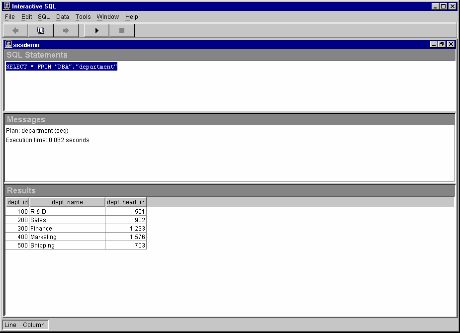
:::
 

To insert a new row, use the following command and then click the play
button: INSERT INTO department VALUES (\'600\', \'HR\', \'501\');.  Note
that 'department' is the name of the table that you are inserting values
into and the values in brackets must correspond to the columns in the
table.  There must be a value for every column in the table otherwise an
error will occur.  Also, the values entered must correspond to the type
assigned to that column.  To delete rows from the table enter the
following line in the command section and click on the play button:
DELETE FROM department WHERE dept\_id=600;.  Note that this command not
only deletes every column in the row where dept\_id (a column in the
table department) equals 600, but it also deletes every row in the table
where dept\_id equals 600

::: {style="text-align: left; text-indent: 0px; padding: 0px 0px 0px 0px; margin: 0px 0px 0px 48px;"}
  ----- ---------------------------------------------------------------------------------------------------------------------------------------------------------------------------------------------------------------------------------------------------------------------------------------------------------------------------------------------------------------------------------------
  10.   When you are done modifying a table, close the 'Interactive SQL' window.  This will bring you back to 'Sybase Central' where you can modify more tables.  If you are finished modifying asademoTest, click on 'Tools' from the menu bar and select 'Disconnect'.  A window will pop up and you should select asademoTest and click 'Disconnect'.  Then you can close 'Sybase Central'
  ----- ---------------------------------------------------------------------------------------------------------------------------------------------------------------------------------------------------------------------------------------------------------------------------------------------------------------------------------------------------------------------------------------
:::

 

 

 

APPENDIX C

 

Primary Key Issues

Adaptive Server Anywhere is a SQL relational database.  Many designers
using this technology adhere to the Third Normal Form design practices. 
These practices utilize the primary key definition.  A primary key (or
unique index) is a column or combination of columns that can be used to
uniquely identify each row in the table, meaning that no two rows in a
table may have the same value for the primary key column(s).  For this
reason, using a column whose data type is 'integer' and whose default is
'autoincrement', is common for a primary key. 

 

In the section BLOB Examples (page 10), the column 'keyfld', for the
table 'blob', is the primary key and has the integer data type and
default autoincrement.  When inserting a blob into the table using ISQL,
a value for the column 'keyfld' can be omitted because of its default. 
Autoincrement will provide a unique value for the newly inserted row. 
In Delphi this is not the case and therefore a value must be supplied
for the 'keyfld' column.  There are several ways in which this value can
be supplied, however, only the fourth method described can guarantee
that problems will not arise. 

 

One method for providing a value for the 'keyfld' column is used in
Example 1, and Example 3.  A variable called nextnum is created and is
assigned a value by the following two lines of code.  For Example 1 they
are:

       Table1.Last;

       nextnum := Table1.FieldByName('keyfld').asInteger + 1;

For Example 3 they are:

       OEDataSet1.Last;

nextnum := OEDataSet1.FieldValues\['keyfld'\] + 1;

These lines of code are jumping to the last row in the table, and
assigning nextnum the value that is in the 'keyfld' column currently
plus one.  Nextnum is then used as the value for the 'keyfld' column
when the new row is inserted.  This seems like it would be a good method
for finding a value for 'keyfld', however a problem can arise.  Doing an
'Insert' on a table does not guarantee that this row will be added to
the end of the table.  Therefore, the last row in the table may not hold
the highest value for the 'keyfld' column and as a result nextnum has
the chance of being assigned a value that already exists in the table. 
If this happens, then the error 'Primary key for blob is not unique'
will be given when the insert is executed.

 

Another method for providing a value for the 'keyfld' column is one that
will get you around the error discussed in the paragraph above.  Instead
of using 'Insert' to add a new row into the table, use the Append
method.  When the Append method is called, it always inserts a new row
at the bottom of the table.  Then the two lines of code discussed above
can be used to find a unique value for the 'keyfld' column.  This method
will work provided that the table has no rows to start or it is known
for certain that the rows currently in the table are already in order. 
Problems with this method may also arise if more then one person is
adding to the table at a time.

 

A third method for supplying a value for the 'keyfld' column is to use a
property called 'RecordCount'.  This property, when used properly, will
give a count of the number of records in a result set.  If the result
set is the entire table then this method is useful for getting a value
for 'keyfld'.  To get this value properly, a jump to the last record in
the table must occur.  For the BDE, the lines of code to accomplish this
task would look like this.

       Table1.Last  // To jump to the last row in the table

       nextnum := Table1.RecordCount + 1;

The major concern with using this method is that the values in the
'keyfld' column must start at 1, and have no numbers missing from 1 to
the last value.  The reason is because of the way ASA deals with
deleting a row which has a column with the autoincrement default.  A
simple example will illustrate how ASA accomplishes deleting a row which
has a column with the autoincrement default.  If there are five rows in
a table, say 1, 2, 3, 4, 5, and rows 4 and 5 are deleted, rows 1, 2, and
3 remain.  If a new row is added now and autoincrement supplies a value,
that value will be 6.  So, if the values for the 'keyfld' column are
missing numbers or do not start with 1, then the number of rows in the
table (which the RecordCount property provides) will not be
representative of the next value, which should be placed in the 'keyfld'
column.  This could lead to a duplicate value for the primary key, which
is not allowed. 

 

The method that is recommended for providing a value for the column
'keyfld', is to get Delphi to recognize that a value is not required on
the ASA end where the default is autoincrement.  The line of code that
can accomplish this for BDE is:

       Table1.Fields\[0\].Required := False;

For ODBCExpress the line of code would be:

       OEDataSet1.Fields\[0\].Required := False;

For Titan SQLAnywhere Developer the line of code would be:

       tsTable1.Fields\[0\].Required := False;

It should be noted that Delphi represents columns in a table through
numbers starting at 0.  In the lines of code above, it is assumed that
the column 0 is the column with the default autoincrement.  More details
on where this line of code can be implemented are included the section
DBGrid Examples on page 18 where autoincrement is discussed.

 

 

 

APPENDIX D

The table below is of all the products and their versions used to
discover the problems and solutions discussed in this paper.  It should
be noted that the ebf for ASA discussed in the section DBGrid Examples
on page 25 has the build number 2934

    +-----------+-----------+-----------+-----------+-----------+-----------+
    |           | ASA       | BDE       | ODBCExpre | Titan     | NativeDB  |
    |           |           |           | ss        |           |           |
    +-----------+-----------+-----------+-----------+-----------+-----------+
    | Delphi 3  | 6.0.3.274 | 4.0       | 4.53      | 3.02p     | 1.84      |
    | Client/Se | 7         |           |           |           |           |
    | rver      |           |           |           |           |           |
    | Suite     | 7.0.0.313 |           |           |           |           |
    | Versions  |           |           |           |           |           |
    | used      |           |           |           |           |           |
    +-----------+-----------+-----------+-----------+-----------+-----------+
    | Delphi 5  | 6.0.3.274 | 5.1.0.4   | 5.05      | 5         | 1.84      |
    | Enterpris | 7         |           |           |           |           |
    | e         |           |           |           |           |           |
    | Versions  | 7.0.0.313 |           |           |           |           |
    | used      |           |           |           |           |           |
    +-----------+-----------+-----------+-----------+-----------+-----------+

More information about the interfaces discussed in this document can be
found on their respective web pages:

 

BDE: http://www.borland.com/delphi

ODBCExpress: http://www.odbcexpress.com

Titan SQL Anywhere Developer: http://www.reggatta.com/sqadev.html

NativeDB: http://www.nativedb.com
