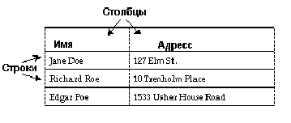
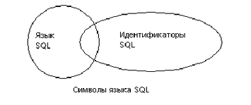

Вступление
==========

::: {.date}
01.01.2007
:::

0. Введение

 

        В этой главе обсуждаются следующие темы:

 

::: {style="text-align: left; text-indent: 0px; padding: 0px 0px 0px 0px; margin: 0px 0px 0px 151px;"}
  --- ---------------------------------------
  ·   Общий обзор языка SQL и его компонент
  --- ---------------------------------------
:::

::: {style="text-align: left; text-indent: 0px; padding: 0px 0px 0px 0px; margin: 0px 0px 0px 151px;"}
  --- ------------------------------------------------------
  ·   Соглашения по терминологии, используемые в языке SQL
  --- ------------------------------------------------------
:::

::: {style="text-align: left; text-indent: 0px; padding: 0px 0px 0px 0px; margin: 0px 0px 0px 151px;"}
  --- -------------------------------------------------------------
  ·   Дополнительные возможности (расширения)  языка Transact-SQL
  --- -------------------------------------------------------------
:::

::: {style="text-align: left; text-indent: 0px; padding: 0px 0px 0px 0px; margin: 0px 0px 0px 151px;"}
  --- ----------------------------------
  ·   Совместимость со стандартом ANSI
  --- ----------------------------------
:::

::: {style="text-align: left; text-indent: 0px; padding: 0px 0px 0px 0px; margin: 0px 0px 0px 151px;"}
  --- ------------------------------------------
  ·   Как запускать Transact-SQL утилитой ISQL
  --- ------------------------------------------
:::

 

 

::: {style="text-align: left; text-indent: 0px; border-color: #000000; border-style: solid; border-width: 1px; border-top: none; border-right: none; border-left: none; padding: 0px 0px 1px 0px; margin: 0px 0px 1px 18px;"}
  -- -------------
     Общий обзор
  -- -------------
:::

 

SQL (Structured Query Languade Структурированный язык запросов) является
языком высокого уровня, предназначенным для реляционных баз данных.
Созданный в исследовательской лаборотории IBM San Jose в конце 70-х
годов, язык SQL был адаптирован ко многим системам управления
реляционными базами данных (СУРБД). Он был принят Американским
Национальным Институтом Стандартов (ANSI) и Международной Организацией
по Стандартизации (ISO) в качестве стандарта для языка запросов к
реляционным базам данных. Язык Transact-SQL совместим с языком IBM SQL и
большинством других коммерческих реализаций языка SQL, и, кроме того,
содержит много дополнительных возможностей и функций.

 

Несмотря на то, что "Q" означает в аббревиатуре SQL слово "Query"
(Запрос), язык SQL содержит не только команды для запросов (извлечения
данных из базы), но и команды для создания новых баз данных и объектов
баз данных, добавления новых данных, изменения существующих данных и
выполнения других функций.

 

::: {style="text-align: left; text-indent: 0px; border-color: #000000; border-style: solid; border-width: 1px; border-top: none; border-right: none; border-left: none; padding: 0px 0px 1px 0px; margin: 0px 0px 1px 36px;"}
  -- --------------------------------------
     Запросы, Модификация данных, Команды
  -- --------------------------------------
:::

 

В данном руководстве query означает запрос на выбор данных с помощью
команды select. Например:

    select au_lname, city, state
    from authors
    where state = 'NY'

 

 

Модификация (изменение) данных означает добавление, удаление или
изменение данных с помощью команд insert (вставка), delete (удаление),
update (обновление), соответственно. Например:

    insert into authors (au_lname, au_fname, au_id)
    values ("Smith", "Gabriella", "999-03-2346")

 

 

Остальные SQL команды являются инструкциями по выполнению
административных функций. Например:

    drop table author

 

 

Каждая команда или SQL оператор начинается с ключевого слова, например
insert (вставить), которое служит названием основной выполняемой
операции. Многие из SQL операторов сопровождаются одной или несколькими
ключевыми фразами или конструкциями, (предложениями) которые уточняют,
что именно нужно сделать. Когда запрос выполнен, Transact-SQL сообщает
его результаты пользователю. Если отсутствуют соответствующие запросу
данные, то пользователь получает об этом сообщение. Операторы
модификации данных и административные операторы не выводят результаты
запроса, поскольку они не выбирают данные из базы. Вместо этого
TRANSACT-SQL сообщает пользователю о том, какая команда выполнилась.

 

::: {style="text-align: left; text-indent: 0px; border-color: #000000; border-style: solid; border-width: 1px; border-top: none; border-right: none; border-left: none; padding: 0px 0px 1px 0px; margin: 0px 0px 1px 36px;"}
  -- --------------------------
     Таблицы, столбцы, строки
  -- --------------------------
:::

 

Язык SQL является языком баз данных, специально разработанных для
реляционной модели управления данными. В реляционных системах данные
представляются в виде таблиц, которые также называются отношениями.

 

Каждая строка (или запись) таблицы описывает один экземпляр сущности,
например, сведения о конкретном человеке, компании, информацию о
конкретной продаже или что-нибудь  подобное. Каждый столбец (или поле)
описывает одну из характеристик этой сущности (атрибут), например, имя
человека или его адрес, название компании или имя ее президента,
названия проданных товаров, их количество, или дату продажи. В целом
база данных представляет собой множество связанных друг с другом
таблиц.

:::{.center}
  
Рисунок 1-1: Таблица в реляционной базе данных
:::
 

::: {style="text-align: left; text-indent: 0px; border-color: #000000; border-style: solid; border-width: 1px; border-top: none; border-right: none; border-left: none; padding: 0px 0px 1px 0px; margin: 0px 0px 1px 36px;"}
  -- ----------------------
     Реляционные операции
  -- ----------------------
:::

 

Основными операциями в реляционной системе являются selection (отбор),
projection (проекция) и join (соединение). Все они объединены в SQL в
команде select (выбор).

 

Selection (известное также как ограничение или селекция) представляет
собой выбор подмножества строк в таблице, удовлетворяющих определенным
условиям. Например, таким подмножеством может быть список всех
писателей, живущих в Калифорнии.

 

Projection (проекция) это подмножество столбцов в таблице. Например, в
результате выполнения запроса в список могут быть включены только имена 
всех авторов и их местожительство, исключая название улицы, телефонный
номер или другую информацию.

 

Join (соединение) соединяет строки из двух (или более) таблиц, путем
сравнения значений в указанных полях. Например, у вас имеется одна
таблица, содержащая информацию о писателях, включая столбцы au\_id
(идентификационный номер автора) и au\_lname (фамилия автора) и вторая
таблица, содержащая информацию о названиях книг, написанных различными
авторами, включая столбец au\_id, который, как было указано, содержит
идентификационный номер автора книги. Необходимо соединить таблицу
авторов с таблицей названий книг, проверяя соответствие значений в
столбце au\_id каждой таблицы. Если значение в этом поле равны, то
создается новая строка, содержащая атрибуты (столбцы) обеих таблиц,
которая включается в результирующую таблицу. Соединения часто
комбинируются с проекциями и селекциями, чтобы выбирать из таблицы
только отдельные столбцы и отобранных строк.

 

::: {style="text-align: left; text-indent: 0px; border-color: #000000; border-style: solid; border-width: 1px; border-top: none; border-right: none; border-left: none; padding: 0px 0px 1px 0px; margin: 0px 0px 1px 18px;"}
  -- ----------------------------
     Соглашения по терминологии
  -- ----------------------------
:::

 

В SQL-операторах нужно придерживаться точных синтаксических и
структурных правил и использовать только ключевые слова, а также
идентификаторы (то есть названия баз данных, названия таблиц или других
объектов базы данных), операторы и константы. Символы, используемые в
различных частях SQL-оператора могут зависеть от реализации (инсталяции)
и определяются в основном тем множеством символов, которое SQL-сервер
использует по умолчанию.

 

Например, множество символов языка SQL, которое можно использовать в
ключевых словах и расширениях языка Transact-SQL, меньше множества
символов, которые можно использовать в идентификаторах. Множество
символов, с помощью которых записываются данные, значительно шире и
включает в себя все символы, используемые в языке SQL и в
идентификаторах.

 

Рисунок 1-2 показывает соотношение между множеством символов,
используемых в ключевых словах, множеством символов, используемых в
идентификаторах, и множеством символов значений
данных.

:::{.center}
  
Рисунок 1-2: Множества символов, используемые в SQL операторах
:::
 

В следующих главах будут описаны множества символов, которые можно
использовать в различных частях SQL выражений. В главе об
идентификаторах описываются соглашения, используемые при описании
объектов базы данных.

 

::: {style="text-align: left; text-indent: 0px; border-color: #000000; border-style: solid; border-width: 1px; border-top: none; border-right: none; border-left: none; padding: 0px 0px 1px 0px; margin: 0px 0px 1px 36px;"}
  -- ------------------------------------------------------
     Символы, с помощью которых записываются данные в SQL
  -- ------------------------------------------------------
:::

 

Множество символов значений данных больше объединения  множества
символов языка SQL,  и множества символов, используемых в
идентификаторах. Любой однобайтовый или многобайтовый символ из
множества символов, используемых в SQL-Сервере, может быть использован
для задания значения данным.

 

::: {style="text-align: left; text-indent: 0px; border-color: #000000; border-style: solid; border-width: 1px; border-top: none; border-right: none; border-left: none; padding: 0px 0px 1px 0px; margin: 0px 0px 1px 36px;"}
  -- -------------------
     Символы языка SQL
  -- -------------------
:::

 

Символы, используемые в ключевых словах языка SQL, в расширениях языка
Transact-SQL, а также специальные знаки, используемые, например, в
операторах сравнения \"\>\",\"\<\", представляются 7-битовым ASCII
кодом, и включают в себя символы А-Z, a-z, 0-9, а также ASCII символы
приведенные в следующей таблице:

 

 

 

    +-----------+-----------+-----------+-----------+-----------+-----------+
    | ;         | (точка с  | (         | (открываю | )         | (закрываю |
    |           | запятой)  |           | щая       |           | щая       |
    |           |           |           | скобка)   |           | скобка)   |
    +-----------+-----------+-----------+-----------+-----------+-----------+
    |,         | (запятая) | :         | (двоеточи | \%        | (знак     |
    |           |           |           | е)        |           | процента) |
    +-----------+-----------+-----------+-----------+-----------+-----------+
    | \-        | (знак     | ?         | (знак     |           | (апостроф |
    |           | минус)    |           | вопроса)  |           | )         |
    +-----------+-----------+-----------+-----------+-----------+-----------+
    | "         | (кавычки) | \+        | (знак     | \_        | (подчерки |
    |           |           |           | плюс)     |           | вание)    |
    +-----------+-----------+-----------+-----------+-----------+-----------+
    | *        | (звездочк | /         | (правая   |           | (пробел)  |
    |           | а)        |           | черта)    |           |           |
    +-----------+-----------+-----------+-----------+-----------+-----------+
    | \<        | (знак     | \>        | (знак     | =         | (знак     |
    |           | меньше)   |           | больше)   |           | равенства |
    |           |           |           |           |           | )         |
    +-----------+-----------+-----------+-----------+-----------+-----------+
    | &         | (амперсан | \|        | (вертикал | \^        | (верхний  |
    |           | д)        |           | ьная      |           | суффикс)  |
    |           |           |           | черта)    |           |           |
    +-----------+-----------+-----------+-----------+-----------+-----------+
    | \[        | (левая    | \]        | (правая   | \\        | (левая    |
    |           | скобка)   |           | скобка)   |           | черта)    |
    +-----------+-----------+-----------+-----------+-----------+-----------+
    | @         | (знак эт) | \~        | (тильда)  | !         | (восклица |
    |           |           |           |           |           | тельный   |
    |           |           |           |           |           | знак)     |
    +-----------+-----------+-----------+-----------+-----------+-----------+
    | \$        | (знак     | \#        | (числовой | .         | (точка)   |
    |           | доллара)  |           | знак)     |           |           |
    +-----------+-----------+-----------+-----------+-----------+-----------+

Таблица 1-1: Символы ASCII, используемые в языке  SQL

 

Идентификаторы

Следующие соглашения используются во всей документации по SQL-серверу.
Идентификатор должен иметь длину до 30 байтов, независимо от того,
используются ли в нем многобайтные символы. Первый символ идентификатора
должен быть буквой из множества символов, используемых SQL-сервером.

 

Замечание: В идентификаторах можно использовать множество многобайтных
символов. Например, для сервера, работающего на японском языке, могут
быть использованы следующие типы символов в качстве первой буквы
идентификатора: Zenkaku или Hankaku Katakana, Hiragana, Kanji, Romaji,
Cyrillic, Greek, или символы ASCII.

 

Также могут быть использованы символы @ (эт) или \_ (подчеркивание).
Например, признаком локальной переменной, является символ @, стоящий на
первой позиции.

 

Названия временных таблиц должны либо начинаться с символа \# (числовой
знак), если они созданы вне базы tempbd, либо предваряться префиксом
\"tempbd..\". Названия временных таблиц, не принадлежащих базе tempbd,
не должны превышать 13 байтов в длину, включая числовой знак, поскольку
SQL- Сервер присваивает названиям временных таблиц внутренний числовой
суффикс.

 

Символ, следующий за первым символом в идентификаторе, может быть
буквенным, числовым или символом : \$ (доллар), \# (числовой знак), @
(эт), Ґ (йена) или Ј (фунт стерлингов).

 

При инсталляции SQL-сервера устанавливается чувствительность к регистру
(case-sensivity), т.е. различаются заглавные и строчные буквы, но эту
установку может изменить Системный Администратор. Чтобы проверить эту
установку, нужно выполнить команду:

sp\_helpsort

 

Если сервер не различает заглавных и строчных букв, то идентификаторы
MYOBJECT, myobject, MyObject (или любые другие комбинации этих букв) не
различаются. Можно создать только один из объектов с таким названием и
использовать любую из указанных комбинаций для обращений к нему.

 

Внутри идентификаторов не должно быть пробелов и зарезервированных
(ключевых) слов.

Список зарезервированных слов приводится в Справочном пособии SQL
Сервера.

 

Можно использовать функцию valid\_ name (правильное имя) для определения
допустимости введенного идентификатора. Например,

 

select valid name ( \"string\"),

 

где string (строка) является проверяемым идентификатором. Если строка не
является допустимым идентификатором, то SQL сервер возвращает 0 (нулевое
значение), в противном случае - ненулевое. SQL-сервер возвратит нуль,
если проверяемый идентификатор содержит недопустимые символы или имеет
длину более 30 байтов.

 

::: {style="text-align: left; text-indent: 0px; border-color: #000000; border-style: solid; border-width: 1px; border-top: none; border-right: none; border-left: none; padding: 0px 0px 1px 0px; margin: 0px 0px 16px 54px;"}
  -- ---------------------------------------
     Ограниченные кавычками идентификаторы
  -- ---------------------------------------
:::

 

Названия таблиц, вьюверов и столбцов (атрибутов) можно заключать в
кавычки. Это позволяет избежать некоторых ограничений, накладываемых на
названия объектов. Но названия других объектов базы данных, кроме
перечисленных, нельзя заключать в кавычки.

 

В кавычки можно также заключать зарезервированные слова, превращая их в
идентификаторы, либо идентификаторы, которые начинаются не с буквы, либо
идентификаторы, содержащие недопустимые символы. Их длина не должна
превышать 28 байтов.

 

Перед заключением идентификаторов в кавычки, необходимо выполнить
следующую команду:

 

set quoted \_identifier on

 

Эта команда позволяет SQL Серверу распознать ограниченные кавычками
идентификаторы. При каждом обращении к такому идентификатору в
операторе, его нужно заключать в кавычки. Например:

    create table "lone" (coll char (3))
    select * from "lone"
    Create table "include spaces" (coll int)

 

 

Замечание: Идентификаторы в кавычках не могут быть параметрами системных
процедур или утилиты BCP и могут не поддерживаться прикладным
программным обеспечением, работающим у пользователя.

 

::: {style="text-align: left; text-indent: 0px; border-color: #000000; border-style: solid; border-width: 1px; border-top: none; border-right: none; border-left: none; padding: 0px 0px 1px 0px; margin: 0px 0px 16px 54px;"}
  -- -------------------------
     Соглашения по названиям
  -- -------------------------
:::

 

Названия объектов в базе данных могут быть не уникальными. Однако,
названия столбцов и индексов внутри таблицы должны быть единственными, а
имена других объектов должны быть единственными для каждого собственника
(owner) внутри базы данных. Названия баз данных должны быть уникальными
для данного SQL Сервера.

 

Если попытаться создать столбец с названием, которое уже использовалось
в таблице, или создать другой объект базы данных, например, таблицу,
вьювер (view) или сохраненную процедуру с названием, которое уже имеется
в базе данных, то SQL Сервер выдаст сообщение об ошибке.

 

Можно сделать уникальным название любой таблицы или столбца, дополняя
название другим именем, например, именем базы данных, именем
собственника (владельца), для столбца - названием таблицы или вьювера.
Каждая из этих характеристик отделяется от предыдущей точкой:

 

database.owner.table\_name.column\_name

database.owner.view\_name.column\_name

 

Например, если пользователь \"sharon\" владеет таблицей authors в базе
данных pubs2, тогда уникальное название столбца city выглядит так:

 

pubs2.sharon.authors.city

 

Это синтаксическое правило применимо к любому объекту базы данных, на
который можно ссылаться аналогичным образом:

 

pubs2.dbo.titleview

dbo.postalcoderule

 

Если включена опция quoted\_identifier (идентификатор в кавычках), то
можно заключать в двойные  кавычки названия объектов базы данных. Нужно
использовать отдельную пару кавычек для каждого дополнения в названии.
Например, следует писать:

 

database.owner.\"table\_name\".\"column\_name\"

 

вместо

 

database.owner.\"table\_name.column\_name\"

 

Не всегда можно использовать полные названия в операторе create,
поскольку нельзя создать вьювер, процедуру, или триггер в базе данных,
отличной от текущей. В этом случае синтаксические правила выглядят
следующим образом:

 

\[\[ database.\] owner.\]object\_name

 

или

 

\[owner.\] object \_name

 

По умолчанию в расширенном названии владельцем считается текущий
пользователь, а базой данных - текущая базы данных. При ссылке на объект
в операторе SQL, отличном от оператора create (создать), без указания
названия базы данных и имени владельца, SQL -Сервер просматривает все
объекты, владельцем которых является текущий пользователь, а затем
объекты в списке Database Owner, который называется \"dbo\". Пока SQL
Сервер обладает достаточной информацией для идентификации объекта, можно
использовать сокращенные названия. Промежуточные элементы названия могут
быть опущены, а их позиции заменены точкой:

 

database .. table\_name

 

В расширенных названиях столбцов и таблиц в операторе create, необходимо
использовать одинаковые аббревиатуры (сокращения) для каждого названия,
поскольку они преобразуются в строки, которые должны совпадать. В
противном случае будет выдано сообщение об ошибке. Ниже приведены два
примера с двумя вариантами названия для одного и того же столбца. Второй
пример не будет работать, поскольку в нем указаны различные названия для
этого столбца.

    select pubs2.dbo.publishers.city
    from pubs2.dbo.publishers

 

 

city

\-\-\-\-\-\-\-\-\-\-\-\-\-\-\-\-\-\-\-\-\-\-\-\-\-\-\-\-\-\-\-\-\-\-\-\-\-\-\-\--

Boston

Washington

Berkeley

 

select pubs2.dbo.publishers.city

from pubs2..publishers

 

Этот запрос вызовет сообщение об ошибке, поскольку префикс
"pubs2.dbo.publishers" не совпадает с названием таблицы во второй
строке.

 

::: {style="text-align: left; text-indent: 0px; border-color: #000000; border-style: solid; border-width: 1px; border-top: none; border-right: none; border-left: none; padding: 0px 0px 1px 0px; margin: 0px 0px 16px 54px;"}
  -- --------------------------
     Вызов удаленных серверов
  -- --------------------------
:::

 

Сохраненные процедуры могут выполняться на удаленном сервере с выводом
результататов на терминал, с которого была вызвана процедура. Синтаксис
вызова сохраненной процедуры на удаленном сервере имеет следующий вид:

 

\[execute\] server.\[database\] .\[owner\].procedure\_name

 

Ключевое слово execute (выполнить) может быть опущено, если вызов
удаленной процедуры является первым оператором пакетного файла. Если
другой SQL оператор предшествует вызову удаленной процедуры, то
необходимо указать execute или exec. Названия сервера и сохраненной
процедуры нужно указывать всегда. Если название базы данных опущено, то
SQL сервер ищет procedure\_name (название процедуры) в текущей базе
данных. Если указывается название базы данных, то, как правило,
необходимо указать и имя владельца процедуры, кроме случаев когда
пользователь, вызывающий процедуру, является ее владельцем или процедура
находится в списке Database Owner (Собственник базы данных).

 

Во всех следующих операторах вызывается сохраненная процедура byroyalty
из базы данных pubs2, расположенной на сервере GATEWAY:

 

    +-----------------------------------+-----------------------------------+
    | Оператор                          | Замечания                         |
    +-----------------------------------+-----------------------------------+
    | GATEWAY.pubs2.dbo.byroyalty       | владельцем byroyalty является в   |
    |                                   | Database Owner                    |
    | GATEWAY.pubs2..byroyalty          |                                   |
    +-----------------------------------+-----------------------------------+
    | GATEWAY...byroyalty              | используется, если pubs2 является |
    |                                   | текущей базой данных              |
    +-----------------------------------+-----------------------------------+
    | declare \@var int                 | используется, если этот оператор  |
    |                                   | не является первым в пакетном     |
    | exec GATEWAY...byroyalty         | файле.                            |
    +-----------------------------------+-----------------------------------+

 

Об установках SQL сервера, касающихся удаленного доступа, можно
посмотреть также в Руководстве системного администратора SQL сервера.
Названия удаленного сервера (GATEWAY в приведенном примере) должно
совпадать с названием этого сервера в локальном интерфейсном файле SQL
сервера (interfaces file) для данного пользователя. Если название
сервера в интерфейсном файле указано заглавными (большими) буквами, то
название сервера при вызове удаленной процедуры также должно быть
указано заглавными буквами.

 

::: {style="text-align: left; text-indent: 0px; border-color: #000000; border-style: solid; border-width: 1px; border-top: none; border-right: none; border-left: none; padding: 0px 0px 1px 0px; margin: 0px 0px 1px 18px;"}
  -- ---------------------------------
     Расширения в языке Transact-SQL
  -- ---------------------------------
:::

 

Язык Transact-SQL был создан для расширения возможностей языка SQL и для
миниминизации, если не исключется вовсе, необходимости программирования
со стороны пользователя для решения поставленной задачи. Язык
Transact-SQL шире стандарта ISO и многих других коммерческих версий
языка SQL. В этом разделе перечислены большинство дополнительных
возможностей языка Transact-SQL (известных также как расширения). Другие
расширения, такие как средства администрирования, описаны в
соответствующих руководствах.

 

::: {style="text-align: left; text-indent: 0px; border-color: #000000; border-style: solid; border-width: 1px; border-top: none; border-right: none; border-left: none; padding: 0px 0px 1px 0px; margin: 0px 0px 1px 36px;"}
  -- ---------------------
     Конструкция compute
  -- ---------------------
:::

 

Конструкция compute (вычислить) является важным дополнительным
средством, содержащимся в Transact-SQL, которое используется вместе с
агрегирующими по строкам функциями sum (сумма), max (максимум), min
(минимум), avg (среднее) и count (число) для вычисления итоговых
значений. Результаты запроса, включающего конструкцию compute, выводятся
вместе с результирующими строками и по внешнему виду напоминают отчеты,
полученные с помощью генератора отчетов, в которых также
предусматриваются специальные строки, содержащие итоговые значения.
Конструкция compute рассматривается в главе 3 \"Подведение итогов,
Группировка и Сортировка Результатов Запроса\".

 

::: {style="text-align: left; text-indent: 0px; border-color: #000000; border-style: solid; border-width: 1px; border-top: none; border-right: none; border-left: none; padding: 0px 0px 1px 0px; margin: 0px 0px 1px 36px;"}
  -- -----------------------
     Управляющие Операторы
  -- -----------------------
:::

 

В языке Transact-SQL имеются управляющие операторы, которые могут
использоваться в составе SQL запросов или в пакетных файлах. К ним
относятся: begin...end (начало...конец), break (прервать), continue
(продолжить), declare (объявить), goto label (перейти на метку),
if...else (если...иначе), print (печать), raiserror (генерация
ошибки), return (вернуть), waitfor (ожидать для) и while (до тех пор
пока). Локальные переменные могут быть определены оператором declare
вместе с начальным значением. В системе также имеются несколько заранее
определенных глобальных переменных.

 

::: {style="text-align: left; text-indent: 0px; border-color: #000000; border-style: solid; border-width: 1px; border-top: none; border-right: none; border-left: none; padding: 0px 0px 1px 0px; margin: 0px 0px 1px 36px;"}
  -- -----------------------
     Сохраненные процедуры
  -- -----------------------
:::

 

Одним из важнейших дополнительных средств в языке Transact-SQL является
возможность создания сохраненных процедур. Эти процедуры могут содержать
почти любые SQL операторы вместе с операторами управления. Программист
может определить в них параметры, значения которых передаются в момент
вызова процедуры. Сохраненные процедуры существенно повышают
возможности, эффективность и гибкость языка баз данных SQL. Повторное
выполнение этих процедур происходит значительно быстрее отдельных
операторов, поскольку план выполнения процедуры сохраняется после ее
выполнения.

 

SQL-Сервер также содержит сохраненные процедуры, которые называются
системными процедурами и служат для системного администрирования. В
главе 14 "Использование Сохраненных Процедур" рассматриваются системные
процедуры и объясняется как создавать сохраненные процедуры. Системные
процедуры также подробно рассматриваются в Справочном руководстве SQL
Сервера.

 

Пользователь может вызывать сохраненные процедуры на удаленном сервере.
Язык Transact-SQL позволяет также возвращать значения, параметры и
состояния, определенные пользователем, из сохраненных процедур.

 

::: {style="text-align: left; text-indent: 0px; border-color: #000000; border-style: solid; border-width: 1px; border-top: none; border-right: none; border-left: none; padding: 0px 0px 1px 0px; margin: 0px 0px 1px 36px;"}
  -- ----------
     Триггера
  -- ----------
:::

 

Триггер - это сохраненная процедура специального вида, которая
предназначена для защиты ссылочной (referential) целостности данных, т.
е. для отслеживания правил и соотношений, которым должны подчиняться
данные из различных таблиц. Триггер активизируется, когда пользователь
добавляет или модифицирует (изменяет) данные с помощью операторов insert
(вставить), delete (удалить) и update (обновить).

 

Триггер может вызвать в системе целую цепочку действий, когда происходит
попытка изменения данных. Триггера помогают сохранить целостность базы
данных путем предотвращения неправильного, неавторизованного или
некорректного изменения данных.

 

Триггера могут вызывать локальные или удаленные сохраняемые процедуры
или другие триггера. Глубина вложенности при вызове триггеров может
достигать 16 уровней.

 

::: {style="text-align: left; text-indent: 0px; border-color: #000000; border-style: solid; border-width: 1px; border-top: none; border-right: none; border-left: none; padding: 0px 0px 1px 0px; margin: 0px 0px 1px 36px;"}
  -- ---------------------------------
     Правила и Значения по умолчанию
  -- ---------------------------------
:::

 

В языке Transact-SQL предусмотрены ключевые слова для сохранения
смысловой целостности данных (в любом поле должна находиться некоторая
величина, если она там предусмотрена) и прикладной целостности данных
(значение любого поля должно соответствовать его типу). Триггера,
упомянутые выше, помогают сохранить ссылочную целостность данных.
Правила и значения по умолчанию налагают ограничения на вводимые и
модифицируемые данные.

 

Значение по умолчанию относится к значению поля данных, которое
устанавливается по умолчанию, если никакое значение не было введено в
это поле. Правило вводится пользователем и представляет собой
ограничения на значение или тип связанного с ним поля данных, оно
действует во время ввода данных. Правила и соглашения рассматриваются в
главе 12 "Введение Правил и Соглашений для данных ".

 

::: {style="text-align: left; text-indent: 0px; border-color: #000000; border-style: solid; border-width: 1px; border-top: none; border-right: none; border-left: none; padding: 0px 0px 1px 0px; margin: 0px 0px 1px 36px;"}
  -- ------------------------------------
     Обработка ошибок и Установка Опций
  -- ------------------------------------
:::

 

Программисту в языке Transact-SQL предоставляется много возможностей для
обработки ошибочных ситуаций, включая перехват кода состояния,
возвращаемого из сохраняемой процедуры, определение специальных кодов
возврата для этих процедур, передачу параметров из вызываемой процедуры
в вызывающую и, наконец, получение информации из глобальных переменных
таких, как @\@error (ошибка). С помощью операторов raiserror (генерация
ошибки) и print (печать) можно направить сообщение об ошибке
непосредственно пользователю Transact-SQL приложения. Разработчики могут
вызывать операторы raiserror и print из других языков программирования.

 

Установка опций с помощью оператора set (установить) позволяет настроить
вывод результатов и статистики, подключить диагностическую помощь при
отладке Transact-SQL программ.

 

::: {style="text-align: left; text-indent: 0px; border-color: #000000; border-style: solid; border-width: 1px; border-top: none; border-right: none; border-left: none; padding: 0px 0px 1px 0px; margin: 0px 0px 1px 36px;"}
  -- ----------------------------------------
     Дополнительные возможности SQL-Сервера
  -- ----------------------------------------
:::

 

Отметим другие отличительные особенности языка Transact-SQL:

::: {style="text-align: left; text-indent: 0px; padding: 0px 0px 0px 0px; margin: 0px 0px 0px 113px;"}
  --- ---------------------------------------------------------------------------------------------------------------------------------------------------------------------------------
  ·   Вводятся некоторые ограничения на конструкции group by (группировать) и order by (сортировать). См. главу 3 "Подведение итогов, Группировка и Сортировка Результатов Запросов".
  --- ---------------------------------------------------------------------------------------------------------------------------------------------------------------------------------
:::

::: {style="text-align: left; text-indent: 0px; padding: 0px 0px 0px 0px; margin: 0px 0px 0px 113px;"}
  --- ------------------------------------------------------------------------------------------------------------------------------------------------------
  ·   В запросах можно использовать подзапросы почти везде, где допускаются выражения. См. главу 5 "Подзапросы: Использование Запросов в других Запросах".
  --- ------------------------------------------------------------------------------------------------------------------------------------------------------
:::

::: {style="text-align: left; text-indent: 0px; padding: 0px 0px 0px 0px; margin: 0px 0px 0px 113px;"}
  --- ------------------------------------------------------------------------------------------------------------------------------------------------------------------------------------------------------
  ·   Язык допускает создание временных таблиц и других временных объектов, которые существуют только во время сеанса работы и удаляются после его завершения. См. главу 7 "Создание Баз Данных и Таблиц".
  --- ------------------------------------------------------------------------------------------------------------------------------------------------------------------------------------------------------
:::

::: {style="text-align: left; text-indent: 0px; padding: 0px 0px 0px 0px; margin: 0px 0px 0px 113px;"}
  --- ------------------------------------------------------------------------------------------------------------------------------------------------
  ·   В SQL-Сервере допускается создание типов данных, определенных пользователем. См. главу 7 и главу 12 "Введение правил и соглашений для Данных".
  --- ------------------------------------------------------------------------------------------------------------------------------------------------
:::

::: {style="text-align: left; text-indent: 0px; padding: 0px 0px 0px 0px; margin: 0px 0px 0px 113px;"}
  --- -----------------------------------------------------------------------------------------------------------------------------------------------------
  ·   Оператор insert (вставить) можно использовать для вставки данных из таблицы в ту же таблицу. См. главу 8 "Добавление, Изменение и Удаление Данных".
  --- -----------------------------------------------------------------------------------------------------------------------------------------------------
:::

::: {style="text-align: left; text-indent: 0px; padding: 0px 0px 0px 0px; margin: 0px 0px 0px 113px;"}
  --- ------------------------------------------------------------------------------------------------------------------
  ·   Опрератор update (обновление) допускает извлечение данных из одной таблицы и их пересылку в другую. См. главу 8.
  --- ------------------------------------------------------------------------------------------------------------------
:::

::: {style="text-align: left; text-indent: 0px; padding: 0px 0px 0px 0px; margin: 0px 0px 0px 113px;"}
  --- ------------------------------------------------------------------------------------------------------------
  ·   Оператор delete (удалить) можно применять для удаления связанных данных из нескольких таблиц. См. главу 8.
  --- ------------------------------------------------------------------------------------------------------------
:::

::: {style="text-align: left; text-indent: 0px; padding: 0px 0px 0px 0px; margin: 0px 0px 0px 113px;"}
  --- -------------------------------------------------------------------------------------------------------------------------------------------------------------
  ·   Оператор truncate table (очистка таблицы) можно использовать для быстрого удаления всех строк из таблицы и освобождения занимаемой ими памяти. См. главу 8.
  --- -------------------------------------------------------------------------------------------------------------------------------------------------------------
:::

::: {style="text-align: left; text-indent: 0px; padding: 0px 0px 0px 0px; margin: 0px 0px 0px 113px;"}
  --- ------------------------------------------------------------------------------------------------------------------------------------------------------------------------------------------------------------------------------------------------------------------------------------------------------
  ·   Допускается просмотр и обновление данных через вьювер. В отличие от других версий языка SQL язык Transact-SQL не накладывает никаких ограничений на выбор данных через вьювер и показывает относительно небольшие ограничения на их обновление. См. глава 9 "Вьюверы: Ограниченный Доступ к Данным".
  --- ------------------------------------------------------------------------------------------------------------------------------------------------------------------------------------------------------------------------------------------------------------------------------------------------------
:::

::: {style="text-align: left; text-indent: 0px; padding: 0px 0px 0px 0px; margin: 0px 0px 0px 113px;"}
  --- ---------------------------------------------------------------------------------------------------------------
  ·   В языке имеется большой набор встроенных функций. См. главу 10 "Использование Встроенных Функций в Запросах".
  --- ---------------------------------------------------------------------------------------------------------------
:::

::: {style="text-align: left; text-indent: 0px; padding: 0px 0px 0px 0px; margin: 0px 0px 0px 113px;"}
  --- -------------------------------------------------------------------------------------------------------------------------------------------------------------------------------------------------------------------------------------
  ·   Опции в операторе create index (создание индекса) позволяют повысить эффективность выполнения запросов, использующих этот индекс, и управлять обработкой повторяющихся ключей и строк. См. главу 11 "Создание Индексов в Таблицах".
  --- -------------------------------------------------------------------------------------------------------------------------------------------------------------------------------------------------------------------------------------
:::

::: {style="text-align: left; text-indent: 0px; padding: 0px 0px 0px 0px; margin: 0px 0px 0px 113px;"}
  --- --------------------------------------------------------------------------------------------------------------------------------------------------------
  ·   Пользователь может управлять реакцией системы при появлении повторяющихся ключей в уникальном индексе или повторяющихся строк в таблице. См. главу 11.
  --- --------------------------------------------------------------------------------------------------------------------------------------------------------
:::

::: {style="text-align: left; text-indent: 0px; padding: 0px 0px 0px 0px; margin: 0px 0px 0px 113px;"}
  --- ----------------------------------------------------------------------------------------------------------------------------
  ·   Можно использовать битовые операции над данными типа interger (целое) и bit (бит). См. Справочное руководство SQL Сервера.
  --- ----------------------------------------------------------------------------------------------------------------------------
:::

::: {style="text-align: left; text-indent: 0px; padding: 0px 0px 0px 0px; margin: 0px 0px 0px 113px;"}
  --- --------------------------------------------------------------------------------------------------------------------
  ·   В языке поддерживаются типы данных text (текстовый) и image (графический). См. Справочное руководство SQL Сервера.
  --- --------------------------------------------------------------------------------------------------------------------
:::

 

::: {style="text-align: left; text-indent: 0px; border-color: #000000; border-style: solid; border-width: 1px; border-top: none; border-right: none; border-left: none; padding: 0px 0px 1px 0px; margin: 0px 0px 1px 18px;"}
  -- -------------------------
     Соответствие Стандартам
  -- -------------------------
:::

 

В настоящее время продолжается развитие стандартов по реляционным СУБД.
Эти стандарты принимаются Международным Институтом Стандартов (ISO) и
некоторыми национальными агенствами. Первым из этих стандартов был
SQL86. Он был заменен стандартом SQL89, который в свою очередь был
заменен стандартом SQL92, который и действует в настоящее время. SQL92
предусматривает три уровня согласованности: Входной (Entry), Средней
(Intermediate) и Полной (Full). В США Национальным Институтом Стандартов
(NIST) был введен Переходный уровень, расположенный между Входным и
Средним.

 

Некоторые требования стандартов не согласуются с существующими
приложениями SQL-серверов. Язык Transact-SQL содержит опцию set
(установить), которая позволяет учитывать эти расхождения.

 

Поведение, соответсующее стандарту, устанавливается по умолчанию во всех
приложениях, использующих встроенный SQL™ прекомпилятор. Другие
приложения, которые необходимо согласовать с входным стандартом SQL92,
могут использовать опции, указанные в таблице 1-2.

 

    +-----------------------------------+-----------------------------------+
    | Опции                             | Установки                         |
    +-----------------------------------+-----------------------------------+
    | ansi\_permissions                 | on (включить)                     |
    +-----------------------------------+-----------------------------------+
    | ansinull                          | on                                |
    +-----------------------------------+-----------------------------------+
    | arithabort                        | off(выключить)                    |
    +-----------------------------------+-----------------------------------+
    | arithabort numeric\_truncation    | on                                |
    +-----------------------------------+-----------------------------------+
    | arithignore                       | off                               |
    +-----------------------------------+-----------------------------------+
    | chained                           | on                                |
    +-----------------------------------+-----------------------------------+
    | close on endtran                  | on                                |
    +-----------------------------------+-----------------------------------+
    | fipsflagger                       | on                                |
    +-----------------------------------+-----------------------------------+
    | quoted\_identifier                | on                                |
    +-----------------------------------+-----------------------------------+
    | string\_rtruncation               | on                                |
    +-----------------------------------+-----------------------------------+
    | transaction isolation level       | 3                                 |
    +-----------------------------------+-----------------------------------+

Таблица 1-2: Установка опций соответствия ANSI стандартам

 

В следующих разделах описываются расхождения между стандартным
поведением и поведением, по умолчанию принятым в языке Transact-SQL.

 

::: {style="text-align: left; text-indent: 0px; border-color: #000000; border-style: solid; border-width: 1px; border-top: none; border-right: none; border-left: none; padding: 0px 0px 1px 0px; margin: 0px 0px 1px 36px;"}
  -- -------------------
     FIPS сигнализатор
  -- -------------------
:::

 

Для пользователей, создающих приложения, которые должны соответствовать
стандарту, в SQL-сервере предусмотрена опция set fipsflagger. Когда эта
опция включена, все команды из расширения Transact-SQL, которые не
соответствуют входному уровню стандарта SQL92, сопровождаются
информационным сообщением.

 

::: {style="text-align: left; text-indent: 0px; border-color: #000000; border-style: solid; border-width: 1px; border-top: none; border-right: none; border-left: none; padding: 0px 0px 1px 0px; margin: 0px 0px 1px 36px;"}
  -- ------------------------------------
     Режим транзакций и уровни изоляции
  -- ------------------------------------
:::

 

В SQL-сервере теперь предусмотрен стандартный для SQL режим "сцепленных"
(chained) транзакций в качестве опции. В этом режиме все операторы
поиска и модификации данных (delete, insert, open, fetch, select, и
update) неявно порождают транзакцию. Поскольку этот режим несовместим со
многими Transact-SQL приложениями, то режим, в котором отсутствуют
транзакции, устанавливается по умолчанию.

 

Режим сцепленных транзакций можно ввести с помощью новой опции set
chained. Новая опция set transaction isolation level управляет уровнями
изоляции транзакций. Информацию об этом см. в главе 17 "Транзакции:
Сохранение целостности данных и восстановление".

 

::: {style="text-align: left; text-indent: 0px; border-color: #000000; border-style: solid; border-width: 1px; border-top: none; border-right: none; border-left: none; padding: 0px 0px 1px 0px; margin: 0px 0px 1px 36px;"}
  -- -----------------------
     Использование кавычек
  -- -----------------------
:::

 

SQL-сервер теперь допускает использование идентификаторов в кавычках
(delimited) для названий таблиц, вьюверов и столбцов. Использование
кавычек позволяет ослабить некоторые ограничения, накладываемые на
названия объектов.

 

Для использования идентификаторов в кавычках нужно включить опцию set
quoted\_identifiers. После этого всепоследовательности символов,
заключенные в  двойные кавычки, трактуются как идентификаторы. Поскольку
подобный режим несовместим со многими существующими приложениями, то по
умолчанию он отключен (off).

 

::: {style="text-align: left; text-indent: 0px; border-color: #000000; border-style: solid; border-width: 1px; border-top: none; border-right: none; border-left: none; padding: 0px 0px 1px 0px; margin: 0px 0px 1px 36px;"}
  -- -------------------
     Комментарии в SQL
  -- -------------------
:::

 

Комметарии в языке Transact-SQL заключаются в комбинированные скобки /*
*/ и могут быть вложенными. Комментарии могут также начинаться с двух
знаков минус, как это предусмотрено в стандарте языка SQL, и
заканчиваться в конце строки (возвратом каретки):

select "hello" --- this is comment

 

Внутри комментария, заключенного в скобки /* */, двойной минус "\--"
не распознается.

 

::: {style="text-align: left; text-indent: 0px; border-color: #000000; border-style: solid; border-width: 1px; border-top: none; border-right: none; border-left: none; padding: 0px 0px 1px 0px; margin: 0px 0px 1px 36px;"}
  -- -------------------------------
     Обрыв справа символьных строк
  -- -------------------------------
:::

 

В языке имеется новая опция string\_rtruncation команды set, которая
согласует со стандартом обрыв справа символьных строк. Если эта опция
установлена (on), то строки не обрываются справа по умолчанию, а их
обрыв согласуется с требованиями стандарта языка SQL.

 

::: {style="text-align: left; text-indent: 0px; border-color: #000000; border-style: solid; border-width: 1px; border-top: none; border-right: none; border-left: none; padding: 0px 0px 1px 0px; margin: 0px 0px 1px 36px;"}
  -- ---------------------------------------------------------
     Ограничения на использования операторов update и delete
  -- ---------------------------------------------------------
:::

 

Имеется новая опция ansi\_permissions команды set, которая регулирует
использование операторов update (обновление) и delete (удаление). Когда
эта опция включена (on), то SQL-сервер придерживается более жестких
ограничений на использование этих операторов, предусмотренных стандартом
SQL92. Поскольку такое соглашение несовместимо с большинством
существующих приложений, то по умолчанию эта опция выключена (off).

 

::: {style="text-align: left; text-indent: 0px; border-color: #000000; border-style: solid; border-width: 1px; border-top: none; border-right: none; border-left: none; padding: 0px 0px 1px 0px; margin: 0px 0px 1px 36px;"}
  -- -----------------------
     Арифметические ошибки
  -- -----------------------
:::

 

Опции arithabort и arithignore команды set были переопределены, чтобы
соответствовать стандарту SQL92:

 

::: {style="text-align: left; text-indent: 0px; padding: 0px 0px 0px 0px; margin: 0px 0px 0px 114px;"}
  --- -------------------------------------------------------------------------------------------------------------------------------------------------------------------------------------------------------------------------------------------------------------------------------------------------------------------------------------------------------------------------------------------------------------------------------------------------------------------------------------------------------------------------------------------------------------------------------------------------------
  ·   Опция arithabort arith\_overflow определяет поведение после попыток деления на ноль или потери точности. По умолчанию эта опция включена (on), поэтому при появлении арифметической ошибки происходит отказ от выполнения (откат назад) всей транзакции или пакетного файла, где произошла ошибка. Если эта опция выключена (off), SQL-сервер прекращает выполнение оператора, вызвавшего ошибку, но продолжает выполнение других операторов из текущей транзакции или пакетного файла. Для соответствия стандарту SQL92 эта опция должна быть выключена командой set arithabort arith\_overflow off.
  --- -------------------------------------------------------------------------------------------------------------------------------------------------------------------------------------------------------------------------------------------------------------------------------------------------------------------------------------------------------------------------------------------------------------------------------------------------------------------------------------------------------------------------------------------------------------------------------------------------------
:::

::: {style="text-align: left; text-indent: 0px; padding: 0px 0px 0px 0px; margin: 0px 0px 0px 114px;"}
  --- ----------------------------------------------------------------------------------------------------------------------------------------------------------------------------------------------------------------------------------------------------------------------------------------------------------------------------------------------------------------------------------------------------------------------------------------------------------------------------------------------------------------------------------------------
  ·   Опция arithabort numeric\_truncation определяет поведение при необходимости усечения в точных числовых типах. По умолчанию эта опция включена (on), поэтому при появлении ошибки прекращается выполнение оператора, вызвавшего ошибку, но продолжается выполнение остальных операторов из текущей транзакции или пакетного файла. Если эта опция отключена, то SQL-Сервер усекает результаты запроса и продолжает обработку. Для соответствия стандарту SQL92 эта опция должна быть включена командой set arithabort numeric\_truncation on.
  --- ----------------------------------------------------------------------------------------------------------------------------------------------------------------------------------------------------------------------------------------------------------------------------------------------------------------------------------------------------------------------------------------------------------------------------------------------------------------------------------------------------------------------------------------------
:::

::: {style="text-align: left; text-indent: 0px; padding: 0px 0px 0px 0px; margin: 0px 0px 0px 114px;"}
  --- -----------------------------------------------------------------------------------------------------------------------------------------------------------------------------------------------------------------------------------------------------------------------------------------------------------------------------------------------------------------------------------------------------------------------------------------------------------------
  ·   Опция arithignore arith\_overflow определяет, будет ли SQL-Сервер должен выдавать сообщение после попыток деления на ноль или потери точности. По умолчанию эта опция выключена (off), поэтому выдается  предупреждающее сообщение после этих ошибок. Установка этой опции (arithignore arith\_overflow on) отменяет выдачу сообщений об этих ошибках. Для соответствия стандарту SQL92 нужно отключить эту опцию командой set arithignore arith\_overflow off.
  --- -----------------------------------------------------------------------------------------------------------------------------------------------------------------------------------------------------------------------------------------------------------------------------------------------------------------------------------------------------------------------------------------------------------------------------------------------------------------
:::

 

::: {style="text-align: left; text-indent: 0px; padding: 0px 0px 0px 0px; margin: 0px 0px 0px 36px;"}
  -- ----------------------------
     Синонимы в ключевых словах
  -- ----------------------------
:::

 

Несколько ключевых слов было добавлено для совместимости со стандартным
SQL. Эти слова которые являются синонимами уже существующих в языке
Transact-SQL ключевых слов.

 

    +-----------------------------------+-----------------------------------+
    | Текущее название                  | Добавленный термин                |
    +-----------------------------------+-----------------------------------+
    | tran                              | work                              |
    |                                   |                                   |
    | transaction                       |                                   |
    +-----------------------------------+-----------------------------------+
    | any                               | some                              |
    +-----------------------------------+-----------------------------------+
    | grant all                         | grant all privileges              |
    +-----------------------------------+-----------------------------------+
    | revoke all                        | revoke all privileges             |
    +-----------------------------------+-----------------------------------+
    | max (выражение)                   | max \[all distinct\] (выражение)  |
    +-----------------------------------+-----------------------------------+
    | user\_name (встроенная функция)   | user (ключевое слово)             |
    +-----------------------------------+-----------------------------------+

                               Таблица 1-3: Синонимы для стандартных
ключевых слов

::: {style="text-align: left; text-indent: 0px; border-color: #000000; border-style: solid; border-width: 1px; border-top: none; border-right: none; border-left: none; padding: 0px 0px 1px 0px; margin: 0px 0px 1px 36px;"}
  -- -----------------
     Трактовка нулей
  -- -----------------
:::

 

В язык включена новая опция ansinull команды set, которая согласует
трактовку неопределенного значения (null) в равенствах (=), неравенствах
(!=) и агрегирующих функциях со стандартом SQL. Эта опция не влияет на
оценку неопределенных значений в других SQL операторах, таких, например,
как creat table (создать таблицу).

 
