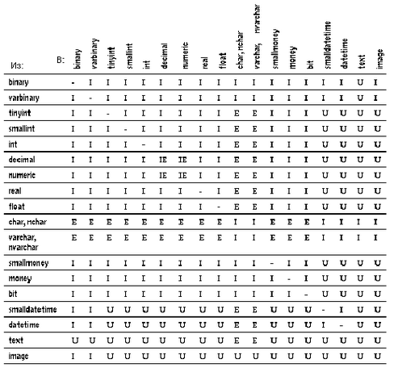

Использование встроенных функций
================================

## Системные функции

Системные функции позволяют получить специализированную информацию из
базы данных. Применение большинства таких функций является самым простым
способом получения информации из системных таблиц.

Общий синтаксис вызова системных функций выглядит следующим образом:

    select название_функции(аргумент[ы])

Системные функции могут использоваться в списке выбора оператора select,
в конструкции where, а также в любом другом месте, где допускается
использование выражений.

Например, чтобы найти идентификационный номер коллеги,
зарегистрированного в системе как "harold", следует выполнить оператор:

    select user_id("harold")

Если предположить, что идентификационный номер пользователя, работающего
под именем "harold", равен 13, то результат этого запроса будет
выглядеть так:

    ---------------------
             13
    (Выбрана 1 строка)

Вообще говоря, название системной функции говорит о том, информация
какого типа будет возвращена.

Системная функция user\_name (имя пользователя) использует в качестве
аргумента идентификационный номер (ID) пользователя и возвращает имя
пользователя:

    select user_name(13)

    --------
    harold

    (Выбрана 1 строка)

Для нахождения имени текущего пользователя, т.е. пользователя
выполняющего запрос, аргумент этой функции можно опустить:

    select user_name()

    ------------------
    dbo

    (Выбрана 1 строка)

Заметим, что системный администратор является владельцем любой базы
данных, предполагая, что его серверный идентификатор ID равен 1.
Пользователь-гость (guest) всегда получает серверный идентификатор,
равный -1. Внутри базы данных значением функции user\_name для владельца
базы данных всегда является значение "dbo", а его или ее 
пользовательский идентификатор (ID) равен 1. Внутри базы данных
пользователь-гость всегда получает идентификатор 2.

Ниже приведен список названий системных функций, а также их аргументов и
возвращаемых результатов:

Таблица 10-1: Системные функции, аргументы и результаты

Название функции       | Аргумент                           | Результат
-----------------------|------------------------------------|-----------------------
col_name               |(object_id, column_id [, database_id]) | Возвращает название столбца.
col_length             |(название\_объекта, название\_столбца) | Возвращает указанную длину столбца. Действительную длину столбца можно узнать с помощью функции datalength.
Curunreservedpgs       |(dbid, lstart, unreservedpgs)       | Возвращает количество свободных страниц на диске. Если база данных открыта, то это значение берется из памяти; если же база данных закрыта, то значение функции берется из столбца unreservedpgs таблицы sysusages.
data\_pgs               |(object\_id, {doampg \| ioampg})    | Возвращает количество страниц, занимаемых таблицей (doampg)  или индексами (ioampg). В результат не включаются страницы, которые используются для внутренних структур.
Datalength             |(выражение)                         | Возвращает длину выражения в байтах. Выражением обычно является название столбца. Если выражение это символьная константа, то она должна быть заключена в кавычки.
db\_id                  |([название\_базы\_данных])        | Возвращает идентификатор базы данных. Название базы данных должно быть символьным выражением; если же это константа, то она должна быть заключена в кавычки. Если же название базы данных вообще не указано, то функция db\_id возвращает идентификатор  текущей базы данных.
db\_name               |([database\_id])                  | Возвращает название базы данных. Аргумент database\_id должен быть числовым выражением. Если же аргумент не указан, то функция db\_name возвращает название текущей базы данных.
host\_id               |()                                | Возвращает идентификатор текущего клиентского процесса на сервере.
host\_name             |()                                  | Возвращает название текущего клиентского процесса на сервере.
index\_col             |(object\_name, index\_id, key\_# [, user\_id]) | Возвращает название индексированного столбца; если аргумент object\_name не является названием таблицы или вьювера, то возвращается NULL.
isnull                 |(выражение1, выражение2)           | Возвращается значение выражения2, если значение выражение1 равно NULL. Типы данных этих выражений должны неявно преобразовываться друг в друга, в противном случае нужно использовать функцию convert.
lct\_admin             |({{ "lastchance" \| "logfull" \| "unsuspend" }, database\_id} \| "reserve", log\_pages}) | Эта функция управляет пороговым значением для числа повторных обращений к сегментам журнала транзакций (last-chance thresold).      Аргумент lastchance задает пороговое значение для числа повторений в указанной базе данных.      Аргумент logfull возвращает 1, если чило попыток превысило пороговое значение в указанной базе данных, и 0 в противном случае.      Аргумент unsuspend разблокирует отложенные задания в указанной базе данных и обнуляет число повторений, если оно превысило пороговое значение.      Аргумент reserve возвращает число свободных страниц журнала транзакций указанного размера, которые необходимы для успешного завершения транзакции.
object\_id             |(название\_объекта)                 | Возвращает идентификатор (ID) объекта.
object\_name           |(object\_id[, database\_id])          | Возвращает название объекта.
proc\_role             |("sa\_role" \| "sso\_role" \| "oper\_role") | Проверяет, имеет ли пользователь, вызывающий процедуру, право на выполнение этой процедуры. Если такое право есть, то возвращается 1, иначе возвращается 0.
reserved\_pgs          |(object\_id, {doampg \| ioampg})    | Возвращает количество страниц, отведенных для таблицы или индекса. В результате этой функции учитываются страницы, предназначенные для внутренних структур.
rowcnt                 |(doampg)                            | Возращает число строк в таблице.
show\_role             |()                                  | Возвращает текущий статус пользователя, если он есть в списке (sa\_role, sso\_role, oper\_role). В противном случае возращается NULL.
suser\_id              |([серверное\_имя\_пользователя])  | Возвращает серверный идентификационный номер (ID) пользователя, взятый из таблицы syslogins. Если имя пользователя  не указано, то возвращается серверный идентификатор (ID) текущего пользователя.
suser\_name            |([server\_user\_id])              | Возвращает серверное имя пользователя по указанному серверному  идентификатору пользователя (ID), которые хранятся в таблице syslogins. Если аргумент (server\_user\_id) не указывается, то возвращается имя текущего пользователя.
used\_pgs              |(object\_id, doampg, ioampg)       | Выводит общее число страниц, используемых для хранения таблицы и ее кластеризованного индекса.
tsequal                |(timestamp,timestamp2)              | Сравнивает значения в столбце timestamp с указанным временем, чтобы не обновлять строку, кото-рая модифицируется в режиме просмотра (browsing). Аргумент timestamp указывает на время в просматриваемой строке, а timestamp2 в сохраняемой строке. Это позволяет использовать режим просмотра без вызова DB-Library. (См. "Режим просмотра").
user                   |                                    | Возвращает имя пользователя
user\_id               |([имя\_пользователя])             | Возвращает идентификационный номер пользователя. Этот номер берется из таблицы sysusers текущей базы данных. Если имя пользователя не указывается, то возвращается идентификатор  текущего пользователя.
user\_name             |([user\_id])                      | Возвращает имя пользователя по его идентификтору в текущей базе данных. Если аргумент (user\_id) не указывается, то возвращается имя текущего пользователя.
valid\_name            |(символьное\_выражение)            | Возвращает 0, если символьное выражение является некоректным идентификатором (т.е. содержит недопустимые символы или его длина превышает 30 байтов), и ненулевое число, если аргумент является правильным идентификатором.
valid\_user            |(server\_user\_id)                  | Возвращает 1, если указанный аргумент является правильным идентификатором пользователя, по крайней мере, одной базы данных SQL Сервера. Пользователь должен иметь права (уровень) sa\_role или sso\_role, чтобы вызывать эту функцию с аргументом, отличным от своего идентификатора.

Если аргумент системной функции является необязательным, то в качестве
него подразумевается текущая база данных, сервер (host computer),
текущий пользователь сервера или текущий пользователь базы данных. Во
всех встроенных функциях (за исключением функции user) аргумент всегда
заключается в скобки, даже если он является пустым.

## Примеры использования системных функций

### Функция col\_length

В следующем запросе определяется длина столбца title из таблицы titles
(выражение "х=" указывается для того, чтобы результат запроса имел
заголовок):

    select x = col_length("titles", "title")

       x
    --------
       80
    (Выбрана 1 строка)

### Функция datalength

В отличие от функции col\_length, которая находит длину столбца,
определенную при создании таблицы, функция datalength показывает
действительную длину (в байтах) всех данных, хранящихся в таблице. Эта
функция полезна для данных типа varchar, nvarchar, varbinary, text и
image, поскольку размер этих данных может изменяться. Функция datalength
возвращает неопределенное значение NULL, если аргумент равен NULL. Для
всех остальных типов данных, кроме перечисленных выше, функция
datalength показывает длину, которая была указана при их определении.
Ниже приведен пример, в которым находится длина данных из столбца
pub\_name таблицы publishers:

    select Length=datalength(pub_name), pub_name
    from publishers

    Length   pub_name
    -------  ------------------------
    13       New Age Books
    16       Binnet & Hardley
    20       Algodata Infosystems

    (Выбрано 3 строки)

### Функция isnull

Следующий запрос находит среднюю цену всех книг из таблицы titles, при
этом заменяя неопределенные значения NULL в столбце price значением
"$10.00":

    select avg(isnull(price,$10.00))
    from titles
    ------------
          14.24
    (Выбрана 1 строка)

### Функция user\_name

В следующем запросе ищется строка из таблицы sysusers, в которой имя
пользователя совпадает с результатом применения системной функции
user\_name к идентификатору пользователя, равному 1: 

    select name
    from sysusers
    where name = user_name(1)

    name
    ------------------------
    dbo
    (Выбрана 1 строка)

## Строковые функции

Строковые функции используются для выполнения различных операций над
символьными строками и выражениями. Некоторые из строковых функций могут
выполняться как с двоичными, так и с символьными данными. Можно также
приписывать (соединять) двоичные данные к символьным строкам или
выражениям.

Встроенные строковые функции обычно используются для выполнения
различных операций над символьными данными. Названия строковых функций
не являются ключевыми словами.

Синтаксис строковых функций имеет следующий общий вид:

    select название_функции(аргументы)

Можно выполнить конкатенацию (приписывание) двоичных или символьных
выражений следующим образом:

    select (выражение + выражение + [выражение]...)

При конкатенации несимвольных или недвоичных выражений нужно
использовать функцию преобразования данных convert, как показано ниже:

    select "The price is " + convert(varchar(12),price)
    from titles

Большинство строковых функций выполняются только над данными типа char,
nchar, varchar и nvarchar и над данными, которые неявно можно
преобразовать в данные типа char и varchar. Однако некоторые строковые
функции могут также выполняться над данными типа binary и varbinary.
Функция patindex может выполняться над данными типа text, char, nchar,
varchar, nvarchar.

Конкатенация может выполняться с данными типа binary или varbinary, а
также char, nchar, varchar и nvarchar. Однако, конкатенация данных из
столбцов типа text не разрешается.

Строковые функции могут быть вложенными одна в другую и могут
применяться везде, где допустимы выражения. Константы в строковых
функциях  должны быть заключены в простые или двойные кавычки.

В таблице 10-2 перечислены аргументы, которые используются в строковых
функциях. Если функция имеет несколько аргументов одного типа, то они
нумеруются по порядку char\_expr1, char\_expr2.

Таблица 10-2: Аргументы строковых функций

Тип аргумента    |Может быть заменен
-----------------|------------------------------------------------------------------------------------------------------------------------------------------------------------------------------------------------------------------------------------------------------------
char\_expr       |Названием столбца, содержащим символьные данные, переменной или выражением типа char, varchar, nchar и nvarchar. Особо отмечается случай, когда в качестве выражения можно задавать текст (text). Символические константы должны быть заключены в кавычки.
expression       |Названием столбца, содержащим двоичные или символьные данные, переменной или константой. Данные могут иметь тип char, varchar, nchar, nvarchar, как для аргумента char\_expr, а также  binary и varbinary.
pattern          |Символьным выражением типа char, nchar, varchar, или nvarchar, которое кроме того может содержать символы замены, поддерживаемые SQL Сервером.
approx\_numeric  |Названием столбца, содержащим данные типа (float, real, double precision), переменной, константой или выражением.
integer\_expr    |Любым целым числом (типа tinyint, smallint или int), названием столбца, переменной или выражением целого типа. Максимальная величина числа отмечается в пояснении, если это необходимо.
start            |Выражением вида integer\_expr.
length           |Выражением вида integer\_expr.

Каждой строковой функции можно также задавать аргументы, которые неявно
преобразуются к нужному типу. Например, функции, имеющие  аргументы
приближенного числового типа (approximate numeric), будут также работать
и с аргументами целого типа. В этом случае SQL Сервер автоматически
преобразует аргумент функции к нужному типу.

Таблица 10-3: Строковые функции, аргументы и результаты

Функция                 |Аргумент               | Результат
------------------------|-----------------------| -----------------------
ascii                   |(char\_expr)            |Возвращает ASCII код первого символа в аргументе.
char                    |(integer\_expr)         |Преобразует однобайтовое значение типа integer в значение типа character. Функция char обычно используется как обратная к функции ascii. Значение аргумента integer\_expr должно находиться между 0 до 255. Результат будет иметь тип char. Если  результирующее значение будет первым байтом многобайтового символа, то результат может быть не определен.
charindex               |(expression1, expression2) | В выражении expression2 проводится поиск первого вхождения выражения expression1 и возвращается номер позиции, с которой оно начинается. Если выражение expression1 не было найдено, то возвращается 0. Если же выражение expression1 содержит символы замены, то при выполнении функции charindex они рассматриваются как литералы.
char\_length            |(char\_expr)            |Возвращает длину (число символов)  в символьном выражении или тексте. Для данных, имеющих переменную длину, функция char\_length не учитывает концевые пробелы. Длина выражений с многобайтовыми символами обычно меньше, чем число байтов, поэтому для определения числа байтов  в этом случае следует использовать системную функцию datalength.
difference              |(char\_expr1, char\_expr2) | Возвращает целое число, являющееся разностью двух значений  soundex. Функция soundex рассматривается ниже.
lower                   |(char\_expr)            |Преобразует символы верхнего регистра в нижний. Результат имеет символьный тип.
ltrim                   |(char\_expr)            |Удаляет пробелы в начале  символьного выражения. Удаляются только те символы, которые эквивалентны пробелу в спецификации специальных символов SQL Сервера.
patindex                |("%pattern%", char\_expr [using {bytes \| chars \| characters}]) | Возвращает номер позиции, с которой  начинается первое вхождение строки pattern (образца) в указанное символьное выражение char\_expr, и 0, если образец pattern не входит в нее. По умолчанию, функция patindex возвращает номер символа. Чтобы получить смещение в байтах для строк в многобайтовых алфавитах, необходимо указать опцию using bytes. Символ '%' должен находиться до и после образца pattern, за исключением  случаев, когда поиск происходит с начала или с конца строки. Об использовании символов замены в этой функции подробнее можно посмотреть в разделе "Символы замены" Справочного Руководства по SQL Серверу. Она может также использоваться для текстовых данных.
replicate               |(char\_expr, integer\_expr) | Возвращает строку того же типа, что и аргумент char\_expr, состоящую из повторения выражения char\_expr, указанное число раз, или столько раз, сколько умещается в 255 байтах, в зависимости от того, что меньше.
reverse                 |(char\_expr)            |Возвращает символьное выражение char\_expr в обратном порядке (перевернутым). Например, если char\_expr это строка "abcd", то обратной будет "dcba".
right                   |(char\_expr, integer\_expr) | Возвращает правую часть символьного выражения, начиная с указанного номера. Результат имеет тот же тип, что и символьное выражение.
rtrim                   |(char\_expr)            |Удаляет концевые пробелы. Удаляются только те символы, которые эквивалентны пробелу в спецификации специальных символов SQL Сервера.
soundex                 |(char\_expr)            |Возвращает четырехсимвольный код soundex заданной строки, который строится из последовательности одно и двухбайтовых латинских символов.
space                   |(integer\_expr)         |Возвращает строку, состоящую из  указанного числа однобайтовых пробелов.
str                     |(approx\_numeric[, length [, decimal]] | Возвращает символьное представление  числа с плавающей точкой.  Параметр  length задает общее число возвращаемых символов (включая десятичную точку и все разряды слева и справа от нее), а параметр decimal задает число возвращаемых десятичных разрядов.    Параметры length  и decimal являются необязательными. Если они указываются, то они должны быть неотрицательными. По умолчанию, значение length равно 10, а decimal равно 0. Функция str округляет число таким образом, чтобы результат не превышал заданную длину length.
stuff                   |(char\_expr1, start, length, char\_expr2) | Из строки char\_expr1 удаляются символы, начиная с позиции, заданной параметром start. Число удаляемых символов определяется параметром length. После этого строка char\_expr2 вставляется в строку char\_expr1, начиная с позиции start. Чтобы просто удалить символы из строки, нужно задать строку char\_expr2 равной NULL, но не пробелу " ", который является обычным символом.
substring               |(expression, start, length) | Возвращает часть символьной или двоичной строки (подстроку). Параметр start указывает позицию первого символа подстроки, а параметр length определяет число символов в подстроке. 
upper                   |(char\_expr)            |Преобразует символы с нижнего регистра в верхний. Результат имеет символьный тип.

## Примеры использования строковых функций

### Функции charindex и patindex

Функции charindex и patindex возвращают начальную позицию строки-образца
(pattern), которая задается пользователем. Обе функции имеют по два
аргумента, но выполняются по разному. Функция patindex допускает
использование символов замены в искомой строке, а функция charindex нет.
Функцию charindex можно применять только к данным типа char, nchar,
varchar и nvarchar, а функцию patindex, кроме вышеуказанных типов, можно
применять к текстовым данным (text).

Каждая из этих функций имеет два аргумента. Первый аргумент является
искомой строкой (pattern), которую нужно найти. Для функции patindex
этот аргумент заключается с двух сторон в символы процента %, за
исключением тех случаев, когда происходит поиск с начала строки (тогда
следует опустить начальный символ %) или с конца строки (тогда следует
опустить последний символ %). Для функции charindex образец не может
содержать символов замены. Вторым аргументом для обеих функций является
символьное выражение, которое обычно задается названием табличного
столбца и в котором происходит поиск указанного образца.

Следующий запрос демонстрирует использование этих функций для нахождения
вхождения слова "wonderfull" в символьную строку, находящуюся в столбце
notes таблицы titles:

    select charindex("wonderful", notes), patindex("%wonderful%", notes)
    from titles
    where title_id = "TC3218"
 
    ------------    -------------
             46            46
    (Выбрана 1 строка)

Если не указывать строки, в которых нужно проводить поиск, то в
результате будут указаны все строки таблицы, при этом для строк, не
содержащих образца, будет выводиться нулевое значение 0. В следующем
примере показано, как с помощью функции patindex находятся все строки в
таблице sysobject, которые начинаются с символов "sys" и в которых
четвертым символом является любой из символов a,b,c, или d:

    select name
    from sysobjects
    where patindex("sys[a-d]%", name) > 0

    name
    ------------------------------ 
    sysalternates
    sysattributes
    syscharsets
    syscolumns
    syscomments
    sysconfigures
    sysconstraints
    syscurconfigs
    sysdatabases
    sysdepends
    sysdevices

    (Выбрано 11 строк)

### Функция str

Функция str преобразует числа в строки символов. Ее необходимыми
аргументами являются длина результирующей строки (включая знак,
десятичную точку, и разряды справа и слева от десятичной точки) и число
разрядов после десятичной точки.

Если указываются аргументы этой функции, то они должны быть
положительными. По умолчанию будет возвращаться строка длиной 10
символов без дробной части. Длина строки должна быть достаточной для
того, чтобы включить в нее знак и десятичную точку. Дробная часть числа
округляется, чтобы длина результирующей строки не превышала заданной
величины. Если же длина целой части результата также не умещается в
указанное число разрядов, то функция str возвращает строку звездочек
указанной длины.

Например:

    select str(123.456, 2, 4)

    --
    **
    (Выбрана 1 строка)

Данные короткого типа approx\_numeric выравниваются вправо до указанной
длины, а данные длинного типа approx\_numeric укорачиваются до
указанного числа десятичных разрядов.

 
### Функция stuff

Функция stuff выполняет подстановку одной строки в другую. Эта функция
удаляет указанное число символов из строки expr1, начиная с указанной
позиции, а затем вставляет строку expr2 на это место вместо удаленных
символов. Если в качестве начальной позиции или длины указано
отрицательное число, то возвращается неопределенное значение NULL.

Если начальный номер превосходит длину строки expr1, то также
возвращается неопределенное значение. Если же длина удаляемой подстроки
превышает длину строки expr1, то удаляется вся часть слова вплоть до
последнего символа. Например:

    select stuff("abc", 2, 3, "xyz")

    ----
    axyz
    (Выбрана 1 строка)

Для того, чтобы с помощью функции stuff удалить символы из строки,
следует аргументу expr\_2 присвоить неопределенное значение NULL, но не
символ пробела в кавычках. Использование символа " " приведет к вставке
пробела вместо удаленных символов. Например:

    select stuff("abcdef", 2, 3, null)

    ---
    aef
    (Выбрана 1 строка)

    select stuff("abcdef", 2, 3, " ")

    ----
    a ef
    (Выбрана 1 строка)

## Функции soundex и difference

Функция soundex преобразует символьную строку в четырехразрядный код,
используемый при сравнении строк. Гласные буквы игнорируются при
сравнении. Неалфавитные символы рассматриваются как терминаторы строки
при вычислении функции soundex. Эта функция всегда возвращает некоторое
значение. Следующие два имени имеют одинаковый код soundex:

    select soundex("smith"), soundex("smythe")

    ----- ----- 
    S530  S530

Функция difference (различие) производит сравнение кодов soundex двух
строк и оценивает числом от 0 до 4 степень их сходства друг с другом.
Значение 4 означает максимальное сходство. Например:

    select difference("smithers", "smothers")

    ---------
          4

    select difference("smothers", "brothers")

    ---------
           2

Большинство оставшихся строковых функций легки для понимания и
использования. Например:

Таблица 10-4: Примеры строковых функций

Оператор                  | Результат
--------------------------|-----------
select right("abcde",3)   | cde
select right("abcde", 6)  | abcde
select upper("torso")     | TORSO
select ascii("ABC")       | 65

## Функция substring

В следующем примере демонстируется применение функции substring.  Здесь
выбираются фамилии и инициалы каждого автора из таблицы authors,
например, "Bennet A".

    select au_lname, substring (au_f name, 1, 1)
    from authors

Функция substring (подстрока) действительно соответствует своему
названию: ее результатом является часть символьной или двоичной строки.

Для функции substring всегда нужно указывать три аргумента. Первый
аргумент может быть символьной или двоичной строкой, названием столбца
таблицы, или выражением, включающем название столбца. Второй аргумент
указывает позицию, с которой должна начинаться подстрока. А третий
определяет число символов (длину) возвращаемой подстроки.

Синтаксис функции substring имеет следующий вид:

    substring(выражение, начальная позиция, длина)

Например, в следующем операторе показано, как получить второй, третий и
четвертый символы из строки "abcdef":

    select x = substring("abcdef", 2, 3)

    x
    ---------
    bcd

## Конкатенация

С помощью операции конкатенации (+) можно приписывать (соединять)
символьные или двоичные строки друг с другом.

Если соединяются между собой символьные строки, то их нужно заключать в
одинарные или двойные кавычки.

Эта операция имеет следующий вид:

    select (выражение + выражение [+ выражение]...)

В следующем примере показано, как можно соединить две символьных строки:

    select ("abc" + "def")

    -------
    abcdef
    (Выбрана 1 строка)

В следующем запросе выбираются фамилии и имена всех авторов, живущих в
Калифорнии, причем фамилия отделяются от имени запятой и пробелом:

    select Moniker = (au_lname + ", " + au_fname)
    from authors
    where state = "CA"

    Moniker
    -----------------------
    White, Johnson
    Green, Marjorie
    Carson, Cheryl
    O'Leary, Michael
    Straight, Dick
    Bennet, Abraham
    Dull, Ann
    Gringlesby, Burt
    Locksley, Chastity
    Yokomoto, Akiko
    Stringer, Dirk
    MacFeather, Stearns
    Karsen, Livia
    Hunter, Sheryl
    McBadden, Heather

    (Выбрано 15 строк)

Для конкатенации числовых данных или данных типа даты необходимо
использовать функцию преобразования типов convert:

    select "The due date is " + convert(varchar(30), pubdate) 
    from titles
    where title_id = "BU1032"

    ---------------------------------------
    The due date is Jun 12 1985 12:00AM

    (Выбрана 1 строка)

## Конкатенация и пустая строка

При конкатенации пустая строка ("" или ") заменяется одним пробелом,
например следующий оператор:

    select "abc" + "" + "def"

выдаст следующий результат:

    abc def

## Композиция строковых функций

Строковые функции можно применять одну за другой, т.е. выполнять
композицию (суперпозицию) функций. Например, следующий оператор выводит
фамилию и инициалы каждого автора, причем после фамилии следует запятая,
а  инициалы заканчиваются точкой:

    select (au_lname + "," + "" + substring(au_fname, 1, 1) + ".")
    from authors
    where city = "Oakland"

    ----------------------
    Green, M.
    Straight, D.
    Stringer, D.
    MacFeather, S.
    Karsen, L.

    (Выбрано 5 строк)

Чтобы получить идентификатор издателя, за которым следуют два первых
символа идентификатора книги, стоящей больше 20 долларов, можно
воспользоваться следующим оператором:

    select substring(pub_id + title_id, 1, 6)
    from titles
    where price > $20

    --------------
    1389PC
    0877PS
    0877TC

    (Выбрана 1 строка)

## Текстовые функции

Встроенные текстовые функции используются для обработки текстовых (text)
и графических (image) данных. Текстовые функции перечислены в следующей
таблице.

Таблица 10-5: Встроенные текстовые функции

Функция       |Аргументы                                                         | Описание
--------------|------------------------------------------------------------------| --------------------------------------------------------------------------------------------------------------------------------------------------------------------------------------------------------------------------------------------------------------------------------------------------------------------------------------------------------------------------------------------------------------------------------------------------------------------------------------------------------------------------------------------------------------------------------------------------------------------------------------------
patindex      |("%pattern%", char_expr [using {bytes \| chars \| characters}] ) | Возвращает номер позиции, с которой  начинается первое вхождение строки pattern (образца) в указанное символьное выражение char_expr, и 0, если образец pattern не входит в нее. По умолчанию, функция patindex возвращает номер символа. Чтобы получить смещение в байтах для строк в многобайтовых алфавитах, необходимо указать опцию using bytes. Символ '%' должен находиться до и после образца pattern, за исключением  случаев, когда поиск происходит с начала или с конца строки. Об использовании символов замены в этой функции подробнее можно посмотреть в разделе "Символы замены" Справочного Руководства по SQL Серверу.
textptr       |(название_столбца)                                               | Возвращает текстовый указатель, который является 16-ти байтовым адресом. Указатель должен указывать на первую текстовую страницу.
textvalid     |("название_таблицы.. название_столбца", текстовый_указатель)   | Проводится проверка правильности тектового указателя. Отметим, что название столбца должно быть расширено названием таблицы. Возвращает 1, если указатель правильный, и 0, в противном случае.
set textsize  |{ n \| 0}                                                         | Указывает ограничение на объем текстовых или графических данных в  байтах, которые можно возвратить оператором select. Текущая установка хранится в глобальной переменной @@textsize. Параметр n определяет число возвращаемых байтов, а 0 устанавливает значение по умолчанию, равное 32К.

Кроме этих функций для текстовых данных можно использовать функцию
datalength, которая была описана в разделе о системных функциях.
Пользователь может также использовать глобальные переменные
@@textcolid, @@textdbid, @@textobjid, @@textptr и @@textsize для
обработки текстовых и графических данных.

## Примеры использования текстовых функций

В следующем примере фунция textptr используется для локализации
текстового поля blurb книги с идентификатором BU7832 в таблице texttest.
Текстовый указатель, являющийся 16-ти байтовой двоичной строкой,
хранится в текстовой переменной @val и передается как параметр команде
readtext. Эта команда возвращает 5 байтов текста, начиная со второго
байта со смещением в один байт.

    create table texttest (
      title_id varchar(6),
      blurb text null,
      pub_id char(4)
    )

    insert texttest values ("BU7832", "Straight Talk About Computers is an annotated
         analysis of what computers can do for you: a no-hype guide for the critical user",
         "1389")

    declare @val varbinary(16)

    select @val = textptr(blurb) from texttest where title_id = "BU7832"

    readtext texttest.blurb @val 1 5

Фунция textptr возвращает 16-ти байтовый адрес. Целесообразно сохранить
значение этого указателя в локальной переменной, как было показано,
чтобы затем использовать его для ссылки на текстовое поле.

Еще один способ (альтенативный использованию фунции textptr) связан  с
глобальной переменной @@textptr и приведен в следующем примере:

    create table texttest (
      title_id varchar(6),
      blurb text null,
      pub_id char(4)
    )

    insert texttest values ("BU7832", "Straight Talk About Computers is an annotated
         analysis of what computers can do for you: a no-hype guide for the critical user",
         "1389")

    readtext texttest.blurb @@textptr 1 5

Значение глобальной переменной @@textptr устанавливается при последнем
по времени выполнении оператора вставки или обновления, который
обращается к текстовому или графическому полю в текущем процессе SQL
Сервера. Операторы модификации, выполняемые в других процессах, не
влияют на эту переменную в текущем процессе.

Для преобразования текстовых данных в типы char, nchar, varchar или
nvarchar, а также для преобразования графических данных в типы binary
или varbinary, необходимо явно выполнить функцию преобразования типов
convert, но при этом текстовые или графические данные укорачиваются до
255 байтов. Не допускается преобразование текстовых и графических данных
в другие типы ни явно, ни неявно.

## Математические функции

Встроенные математические функции предназначены для выполнения часто
встречающихся математических операций.

Вызов математических функций имеет следующий общий вид:

    название_функции(аргументы)

В следующей таблице приведены типы аргументов, используемые во
встроенных математических функциях.

Таблица 10-6: Аргументы математических функций

Тип аргумента  |Может быть заменен на
---------------|-----------------------------------
approx\_numeric |Любое название табличного столбца приближенного числового типа (float, real, double precision), переменная, константа или выражение этого типа.
integer        |Любое название табличного столбца целого типа (tinyint, smallint, int), переменная, константа или выражение этого типа.
numeric        |Любое название табличного столбца приближенного числового (float, real, double precision), точного числового (numeric, dec, decimal, tinyint, smallint, int) или денежного (money) типа, переменная, константа или выражение этих типов или их комбинация.
power          |Любое название табличного столбца приближенного числового, точного числового или денежного типа, переменная, константа или выражение этих типов или их комбинация.

Каждой функции можно также задавать аргументы, которые неявно
преобразуются к нужному типу. Например, функции, имеющие  аргументы
приближенного числового типа (approximate numeric), будут также работать
и с аргументами целого типа. В этом случае SQL Сервер автоматически
преобразует аргумент функции к нужному типу.

Если функция имеет несколько аргументов одного типа, то они нумеруются
по порядку (например, approx\_numeric1, approx\_numeric2).

В следующей таблице приведены математические функции, их аргументы и
возвращаемые результаты.

Таблица 10-7:

Функция  |Аргумент                              |Результат
---------|--------------------------------------|-------------------------------------------------------------------------------------------------------------------------------------------------------------------------------------------------------------------------------------------------------------------------------------------------------------------------------------------------------------------------------------------------------------------------------------------
abs      |(numeric)                             |Возвращает абсолютную величину указанного выражения. Результат имеет тот же тип, точность и шкалу, что и аргумент.
acos     |(approx\_numeric)                     |Возвращает значение угла (в радианах), косинус которого равен указанной величине.
asin     |(approx\_numeric)                     |Возвращает значение угла (в радианах), синус которого равен указанной величине.
atan     |(approx\_numeric)                     |Возвращает значение угла (в радианах), тангенс которого равен указанной величине.
atn2     |(approx\_numeric1, approx\_numeric2)  |Возвращает значение угла (в радианах), тангенс которого равен частному от деления первого аргумента на второй.
ceiling  |(numeric)                             |Возвращает наименьшее целое число, большее или равное указанной величине. Результат имеет тот же тип, что и аргумент. Для аргументов типа numeric и decimal результат будет иметь ту же точность, что и аргумент, и нулевую шкалу.
cos      |(approx\_numeric)                     |Возвращает значение тригонометрического косинуса указанного угла (заданного в радианах).
cot      |(approx\_numeric)                     |Возвращает значение тригонометрического котангеса указанного угла (заданного в радианах).
degrees  |(numeric)                             |Преобразует радианы в градусы. Результат имеет тот же тип, что и аргумент. Для аргументов типа numeric и decimal результат будет иметь внутреннюю точность, равную 77 и шкалу, равную шкале аргумента. Когда аргумент имеет денежный тип, то внутреннее преобразование к типу float может привести к потере точности.
exp      |(approx\_numeric)                     |Возвращает экспоненту указанной величины.
floor    |(numeric)                             |Возвращает целую часть числа (наибольшее целое число, меньшее или равное указанной величине). Результат имеет тот же тип, что и аргумент. Для аргументов типа numeric и decimal результат будет иметь ту же точность, что и аргумент, и нулевую шкалу.
log      |(approx\_numeric)                     |Возвращает натуральный логарифм указанной величины.
log10    |(approx\_numeric)                     |Возвращает десятичный логарифм указанной величины.
pi       |()                                    |Возвращает константу пи, равную 3.1415926535897931.
power    |(numeric, power)                      |Возвращает значение степени, основанием которой является первый аргумент numeric, а показателем второй аргумент power. Для выражений типа numeric и decimal результат будет иметь внутреннюю точность, равную 77 и шкалу, равную шкале выражения.
radians  |(numeric\_expr)                       |Преобразует градусы в радианы. Результат имеет тот же тип, что и аргумент. Для аргументов типа numeric и decimal результат будет иметь внутреннюю точность, равную 77 и шкалу, равную шкале аргумента. Когда аргумент имеет денежный тип, то внутреннее преобразование к типу float может привести к потере точности.
rand     |([integer]                            |Возвращает случайное число, заключенное между 0 и 1. Необязательный аргумент используется в качестве параметра.
round    |(numeric, integer)                    |Округляет первый аргумент numeric до указанного числа (integer) значящих цифр. Если второй аргумент положителен, то он определяет число  знаков после десятичной точки. Если второй аргумент отрицателен, то он определяет число  знаков до десятичной точки. Результат имеет тот же тип, что и первый аргумент и для выражений типа numeric и decimal будет иметь внутреннюю точность, равную 77, а шкалу, равную шкале этого выражения.
sign     |(numeric)                             |Возвращает знак аргумента, а именно возвращает +1, если он положителен, ноль, если он равен нулю (0) и -1, если он отрицателен. Результат имеет тот же тип и ту же точность и шкалу, что и аргумент.
sin      |(approx\_numeric)                     |Возвращает значение тригонометрического синуса указанного угла (заданного в радианах).
sqrt     |(approx\_numeric)                     |Возвращает значение квадратного корня указанной величины.
tan      |(approx\_numeric)                     |Возвращает значение тригонометрического тангеса указанного угла (заданного в радианах).

## Примеры использования математических функций

Встроенные математические функции работают с числовыми данными.
Аргументы этих функций должны иметь целочисленный или приближенный тип.
Многие функции выполняются с точными или приближенными числовыми
значениями, или с данными денежного типа. Точность вычисления встроенных
функций для данных типа float составляет по умолчанию  6 десятичных
знаков.

При вычислении математических функций предусматривается реакция на
возникновение ситуаций, связанных с ошибками в типах данных или выходом
за указанный диапазон. Пользователь может установить опции arithabot или
arithignore, чтобы определить вид ошибки, возникшей при вычислении
функции. Более подробно об этих опциях будет рассказано в разделе
"Ошибки преобразования".

Ниже приведены простые примеры вычисления математических функций: 

Функция                     |Результат
----------------------------|------------:
select floor(123)           |123
select floor(123.45)        |123.000000
select floor(1.2345E2)      |123.000000
select floor(-123.45)       |-124.000000
select floor(-1.2345E2)     |-124.000000
select floor($123.45)       |123.00
select ceiling(123.45)      |124.000000
select ceiling(-123.45)     |-123.000000
select ceiling(1.2345E2)    |124.000000
select ceiling(-1.2345E2)   |-123.000000
select ceiling($123.45)     |124.00
select round(123.4545, 2)   |123.4500
select round(123.45, -2)    |100.00
select round(1.2345E2, 2)   |123.450000
select round(1.2345E2, -2)  |100.000000

Функция round(numeric,integer) всегда возвращает некоторую величину.
Если второй аргумент (integer) отрицателен и по величине превосходит
число значащих цифр в первом аргументе (numeric), то SQL Сервер
округляет только  старший разряд. Например следующий оператор:

    select round(55.55, -3)

возвращает число 100.000000. (Число разрядов после десятичной точки
равно шкале первого аргумента numeric.)

## Календарные функции

Встроенные календарные функции используются для получения информации о
датах и времени. Они выполняют арифметические операции над  данными типа
datetime и smalldatetime.

Каледарные функции можно использовать в списке выбора оператора select,
в конструкции where, а также в любом месте, где допускаются выражения.

Данные типа datatime представляются в SQL Сервере двумя 4-х байтовыми
целыми числами. Первые четыре байта предназначены для хранения числа
дней перед или после базовой даты, которая для этой системы установлена
на 1 января 1900 года. Тип данных datatime не допускает дат,
предшествующих 1 января 1753. Вторые четыре байта внутреннего
представления даты предназначены для хранения моментов времени с
точностью до 1/3000 доли секунды.

Данные типа smalldatetime представляют даты и моменты времени с меньшей
точностью чем данные типа datatime. Данные типа smalldatetime
представляются двумя 2-х байтовыми целыми числами. В первых двух байтах
хранится число дней после 1 января 1900 года. В следующих двух байтах
хранится число минут, прошедших после полуночи до указанного момента
времени. Таким образом, с помощью данных этого типа можно представлять
даты из диапазона от 1 января 1900 года до 6 июня 2079 года с точностью
до минуты.

Формат вывода дат, принимаемый по умолчанию, выглядит следующим образом:

    Apr 15 1987 10:23PM

В одном из последующих разделов этой главы, в котором рассматривается
функция преобразования типов convert, будет дана информация об изменении
форматов вывода даты для типов данных datatime и smalldatetime. Когда
вводятся данные этих типов, их следует заключать в простые или двойные
кавычки. SQL Сервер распознает большое число форматов для данных типа
даты и времени. Дополнительную информацию о данных типа datatime и
smalldatetime можно посмотреть в главе 7 "Создание баз данных и таблиц"
и главе 8 "Добавление, изменение и удаление данных".

В следующей таблице приведены календарные функции и их результаты.

Таблица 10-9: Календарные функции

Функция   |Аргумент                |Результат
----------|------------------------|---------------------------------------------------------------------------------------------------------------------
getdate   |()                      |Текущая дата и время.
datename  |(datepart,date)         |Возвращает указанную часть значения типа datatime и smalldatetime как строку символов (ASCII строку). 
datepart  |(datepart,date)         |Возвращает указанную часть значения типа datatime и smalldatetime, например, месяц, день или час, как целое число. 
datediff  |(datepart,date, date)   |Количество времени между первой и второй датами, выраженное в месяцах, днях или часах.
dateadd   |(datepart,number,date)  |Дата, полученная из указанной даты добавлением указанного временного интервала.

Функции datename, datepart и dateadd получают в качестве аргумента часть
даты, т.е. год, месяц, час и т.д. В следующей таблицы перечислены части
даты, их сокращения (если оно есть) и возможные целочисленные значения
для этой части. Функция datename выдает строку символов там, где это
имеет смысл, например, для названия дней недели.

Таблица 10-10: Части даты

Часть даты   |Сокращение  |Интервал значений
-------------|------------|---------------------------------------------
year         |yy          |1753-9999
quarter      |qq          |1 - 4
month        |mm          |1 - 12
week         |wk          |1 - 366
day          |dd          |1 - 31
dayofyear    |dy          |1 - 54
weekday      |dw          |1 - 7 (Воскресенье 1 день для us\_english).
hour         |hh          |0 - 23
minute       |mi          |0 - 59
second       |ss          |0 - 59
millisecond  |ms          |0 - 999

Заметим, что названия дней недели могут зависеть от установленного языка
(language setting).

## Получение текущей даты: getdate

Функция getdate возвращает текущую дату и время во внутреннем формате
SQL Сервера, который используется данных типа datatime и smalldatetime.
Эта функция не имеет аргументов, поэтому при ее вызове нужно указать
только скобки ().

Например, чтобы определить текущую дату и время, можно выполнить
следующий оператор:

    select getdate()

    --------------------------
    Jul 29 1991  2:50  PM

    (Выбрана 1 строка)

Эту функцию можно использовать при печати отчетов, чтобы текущая дата
автоматически печалась в момент вывода отчета. Эта функция также полезна
для регистрации моментов выполнения транзакции.

## Получение частей даты в виде числа или строки

Функции datepart и datename возвращают указанную часть даты, т.е. год,
квартал, день, час и т.д., либо в виде числа, либо в виде строки
символов. Поскольку данные типа smalldatetime представляют время только
с точностью до минут, то, когда в качестве аргумента этих функций
используются данные этого типа, количество секунд и миллисекунд всегда
равно нулю.

В следующих примерах предполагается, что текущей датой является 29 июля,
как и в предыдущем примере.

    select datepart(month, getdate())

    --------------
               7
    (Выбрана 1 строка)

    select datename(month, getdate())

    -------------
    July
    (Выбрана 1 строка)

## Вычисленные календарных интервалов

Функция datediff вычисляет промежуток времени между указанными второй и
первой датами, другими словами она находит календарный интервал между
двумя датами. Результатом будет целое число со знаком, являющееся
разностью между указанными частями второй и первой даты (date2 - date1).

В следующем запросе используется дата, равная 30 ноября 1985 года, для
подсчета числа дней между этой датой и датами публикации книг,
находящимися в столбце pubdate: 

    select newdate = datediff(day, pubdate, "Nov 30 1985")
    from titles

Для книги, опубликованной 21 октября 1985 года, в предыдущем запросе
будет получено число 40, т.е. число дней между 21 октября и 30 ноября. В
следующем запросе календарный интервал вычисляется в месяцах:

    select interval = datediff(month, pubdate,  "Nov 30 1985")
    from titles

Этот запрос укажет интервал в 1 месяц для книг, опубликованных в
октябре, и 5 месяцев для книг, опубликованных в июне. Если первый
аргумент функции datediff является более поздней датой по сравнению со
вторым, то результат будет отрицательным. Поскольку для двух книг в
таблице titles по умолчанию в столбце pubdate была указана функция
getdate, то для них в этом столбце будет указана дата создания базы
данных pubs. По этой причине в предыдущих запросах для этих книг будут
получены отрицательные результаты.

Если один или оба аргумента этой функции имеют тип smalldatetime, то в
процессе ее выполнения они преобразуются к типу datetime, чтобы
вычисление было более точным. Секунды и миллисекунды для этого типа
автоматически устанавливаются равными нулю при вычислении временного
интервала.

## Добавление календарного интервала: dateadd

Функция dateadd добавляет календарный интервал к указанной дате.
Например, даты публикации всех книг из таблицы titles, увеличенные на
три дня, можно получить с помощью следующего оператора:

    select dateadd(day, 3, pubdate)
    from titles

    -----------------------
    Jun 15 1985 12:00AM
    Jun 12 1985 12:00AM
    Jul  3 1985 12:00AM
    Jun 25 1985 12:00AM
    Jun 12 1985 12:00AM
    Jun 21 1985 12:00AM
    Sep 11 1986 11:02AM
    Jul  3 1985 12:00AM
    Jun 15 1985 12:00AM
    Sep 11 1986 11:02AM
    Oct 24 1985 12:00AM
    Jun 18 1985 12:00AM
    Oct  8 1985 12:00AM
    Jun 15 1985 12:00AM
    Jun 15 1985 12:00AM
    Oct 24 1985 12:00AM
    Jun 15 1985 12:00AM
    Jun 15 1985 12:00AM

    (Выбрано 18 строк)

Если в качестве аргумента этой функции указана дата типа smalldatetime,
то результат также будет иметь этот тип. Фунцию dateadd можно
использовать для добавления секунд или миллисекунд к дате типа
smalldatetime, но результат будет иметь смысл только в том случае, если
добавляется больше одной минуты.

## Функции преобразования типов данных

Функции преобразования типов данных, как следует из их названия,
преобразуют типы выражений из одного типа в другой и переформатируют
информацию о датах и времени. SQL Сервер автоматически выполняет
некоторые преобразования типов. Это называется неявным (implicit)
преобразованием. Например, если пользователь сравнивает выражение типа
char с выражением типа datetime, или выражение типа smallint с
выражением типа int, или выражения типа char, имеющие различную длину,
то SQL Сервер автоматически преобразует эти типы друг к другу.

Другие преобразования пользователь должен выполнять явно (explicitly),
используя встроенные функции преобразования типов данных. Например,
перед конкатенацией числовых выражений, их необходимо преобразовать к
строковому типу.

SQL Сервер имеет три функции преобразования типов: convert
(преобразовать), inttohex (целое в 16-ричное), hextoint (16-ричное в
целое). Эти функции можно использовать в списке выбора, в предложении
where, и везде, где допускаются выражения.

SQL Сервер не допускает некоторых преобразований типов данных. Например,
нельзя преобразовать тип smallint к типу datetime или наоборот. Попытка
выполнения недопустимого преобразования приводит к сообщению об ошибке.

## Допустимые преобразования

На рисунке 10-1 показаны преобразования типов данных, поддерживаемые SQL
Сервером:

- Преобразования, помеченные буквой "I", выполняются автоматически (неявно). Для них можно не указывать функции преобразования типа, хотя использование функции convert в этих случаях не является ошибкой;
- Преобразования, помеченные буквой "Е", должны выполняться пользователем явным образом с помощью соответствующей функции преобразования типов;
- Преобразования, помеченные буквой "IЕ", выполняются автоматически в том случае, если при преобразовании не теряется точность или шкала и  установлена опция arithabort numeric\_truncation, в противном случае эти преобразования нужно выполнить явно.
- Преобразования, помеченные буквой "U", недопустимы и не поддерживаются SQL Сервером. Если пользователь попытается выполнить такое преобразование, то SQL Сервер выдаст сообщение об ошибке;
- Преобразования типа к самому себе, помещены символом "\_". В общем случае SQL Сервер допускает явное преобразование типа к самому себе, но такие преобразования не имют смысла.

:::{.center}
  
Рис. 10-1: Явные, неявные и недопустимые преобразования типов данных
:::

## Использование функции convert

Функция преобразования общего назначения convert предназначена для
выполнения разнообразных преобразований типов данных и изменения
форматов представления даты и времени. Она имеет следующий общий вид:

    convert(тип_данных, выражение [, стиль] )

В следующем примере функция преобразования используется в списке выбора:

    select title, convert(char(5), total_sales)
    from titles
    where type = "trad_cook"

    title
    -----------------------------------------------------------------  -------
    Onions, Leeks, and Garlic: Cooking Secrets of the Mediterranean        125
    Fifty Years in Buckingham Palace Kitchens                            15096
    Sushi, Anyone?                                                        5405

    (Выбрано 3 строки)

В этом примере данные из столбца total\_sales, имеющие тип int,
преобразуются к типу char(5), чтобы их можно использовать при поиске по
образцу с ключевым словом like:

    select title, total_sales
    from titles
    where convert(char(5), total_sales) like "15%"  and type = "trad_cook"

    title
    -----------------------------------------  --------
    Fifty Years in Buckingham Palace Kitchens     15096

    (Выбрана 1 строка)

Некоторые типы данных имеют либо длину, либо точность и шкалу. Если
длина не указана, то SQL Сервер по умолчанию устанавливает длину, равную
30 символам, для строковых и двоичных данных. Если не указана точность
или шкала, то SQL Сервер по умолчанию устанавливает для них значения 18
и 0 соответственно.

## Правила преобразования

В следующих разделах описываются правила преобразования, которых нужно
придерживаться при преобразовании различных типов информации.

### Преобразование строковых данных к нестроковому типу

Строку символов можно преобразовать к нестроковому типу, такому как
денежный тип, тип даты или времени, приближенный числовый тип, если все
символы этой строки являются допустимыми для нового типа. Начальные
пробелы при этом игнорируются. Если строка содержит недопустимые
символы, то выдается сообщение о синтаксической ошибке. Ниже приводятся
несколько примеров, когда выдаются сообщения о синтаксических ошибках:

- Запятая или точка в данных целого типа;
- Запятая в данных денежного типа;
- Буквы в данных точного или приближенного числового типа или в строке битов;
- Неправильное название месяца в данных типа даты.

### Преобразование одного строкового типа к другому

Когда преобразуются символы из мультибайтового алфавита в однобайтовый,
то символы, не имеющие эквивалента в однобайтовом алфавите, заменяются
пробелами.

Текстовые данные (text) можно явно преобразовывать в типы char, nchar,
varchar и nvarchar. Максимальная длина строковых типов данных составляет
255 байтов. Если длина строки не указана, то по умолчанию
устанавливается длина, равная 30 байтам.

### Преобразование чисел к строковому типу

Как точные, так и приближенные числовые значения можно преобразовывать к
строковому типу. Если длина строки не позволяет разместить все цифры
числа, то выдается сообщение о недостаточности этой длины. Например, при
попытке разместить 5 байтовое число в одном байте выдается следующее
сообщение об ошибке:

    select convert(char(1), 12.34)

    Insufficient result space for explicit conversion
    of NUMERIC value '12.34' to a CHAR field.

    (Недостаточно места для размещения числового
    значения "12.34" в строковом поле).

### Округление при преобразовании к денежному типу

Денежные типы данных money и smallmoney позволяют сохранять четыре знака
после десятичной точки, но при выводе они округляются до сотых долей
(0.01) денежной единицы. Когда данные преобразуются к денежному типу, то
они округляются до четырех знаков в дробной части.

Значения, которые преобразуются из денежного типа, округляются таким же
образом, если это возможно. Если денежное значение преобразуется к
точному числовому типу с менее чем тремя знаками после точки, то оно
округляется в соответствии со шкалой, определенной для этого типа.
Например, значение $4.50 преобразуется в целое число следующим образом:

    select convert(int, $4.50)

    -----------
             4

Предполагается, что значения, преобразуемые к денежному типу, измеряются
в полных (основных) денежных единицах, т.е. в долларах, а не в центах.
Например, если установлена языковая опция (опция страны) us\_english
(американский английский), то целое число 4 эквивалентно 4 долларам, а
не 4 центам.

### Преобразование дат и моментов времени

Значения, эквивалентные календарным датам, можно преобразовывать к типам
datetime и smalldatetime. Неправильно указанное название месяца приводит
к сообщениям о синтаксической ошибке. Данные, которые не попадают в
диапазон значений календарного типа, вызывают сообщение об
арифметическом переполнении.

Когда значение типа datetime преобразуется к типу smalldatetime, то оно
округляется до минут.

### Преобразование числовых типов

Числовые значения можно преобразовывать из одного типа в другой. Если
значение преобразуется к точному числовому типу и установленная для него
точность и шкала являются недостаточными для размещения нового числа, то
может появиться сообщение об ошибке. Пользователь может использовать
опции arithabort и arithignore, чтобы подготовить реакцию на
возникновение этой ситуации.

> **Замечание.**  
> Опции arithabort и arithignore были переопределены в версии
> 10.0 SQL Сервера. Если пользователь использует эти опции в своем
> приложении, то необходимо убедиться в том, что они соответствуют своему
> функциональному назначению.

### Преобразование двоичных типов

Типы данных SQL Сервера binary и varbinary зависят от аппаратной
платформы, т.е. от аппаратуры компьютера. На некоторых платформах первый
байт, следующий за префиксом 0х, является старшим, а на других -
младшим.

Функция convert трактует двоичные данные как строки символов, а не как
числовые значения. Эта функция не учитывает, принятое для данной
платформы, старшинство байтов, когда преобразует двоичное значение к
целому числу или наоборот. Поэтому результат преобразования может быть
различным на различных платформах.

Перед тем как преобразовать двоичную строку в целое число, функция
convert удаляет начальный префикс 0х. Если строка состоит из нечетного
числа цифр, то впереди добавляется 0. Если строка слишком велика для
целого типа, то функция convert укорачивает ее. Если значение слишком
мало, то функция convert выравнивает его вправо и добавляет нули.

Предположим, что надо преобразовать строку 0х00000100 в целое число. На
некоторых платформах эта строка представляет число 1, на других число
256. В зависимости от того, на какой платформе выполняется функция
convert, результат будет равен 1 или 256.

### Преобразование шестнадцатиричных данных

Для того, чтобы результат преобразования не зависел от платформы,
следует использовать функции hextoint и inttohex.

Аргументами функции hextoint являются литералы или переменные, состоящие
из цифр и букв от A до F (заглавных или строчных) с префиксом 0х или без
него. Ниже приводятся примеры допустимых аргументов для функции
hextoint:

    hextoint("0x00000100FFFFF")
    hextoint("0x00000100")
    hextoint("100")

Функция hextoint удаляет у них префикс 0х. Если строка состоит более чем
из восьми цифр, то функция hextoint укорачивает ее. Если длина строки
меньше восьми, то функция hextoint выравнивает ее вправо и добавляет
впереди нули. Затем функция hextoint вычисляет эквивалентное целое
число, которое не зависит от платформы. Для вышеуказанного значения
всегда будет выдаваться число 256 независимо от платформы.

Функция inttohex преобразует целое число в шестнадцатиричную строку из 8
символов без префикса 0х. Функция inttohex также возвращает всегда одно
и то же значение независимо от платформы.

### Преобразование графических данных в тип binary и varbinary

Пользователь может использовать функцию convert для преобразования
графических данных типа image в данные типа binary или varbinary.
Ограничением здесь является длина строки для типа binary, которая должна
быть не больше 255 байтов. Если длина не указывается, то по умолчанию
устанавливается длина в 30 символов.

## Ошибки преобразования

В следующих разделах, описываются ошибки, которые могут возникнуть при
преобразовании данных.

### Арифметическое переполнение и деление на ноль

Ошибка, связанная с делением на ноль, может возникнуть, если число
делится на ноль. Ошибки, связанные с арифметическим переполнением, могут
возникнуть, если новый тип данных не позволяет разместить все цифры
результата. Переполнение может возникнуть в следующих ситуациях:  

- При явном или неявном преобразовании точных числовых типов, когда указаны слишком маленькие значения для точности или шкалы;
- При явном или неявном преобразовании данных, когда результирующее значение не попадает в диапазон, отведенный для денежного или календарного типа;
- При преобразовании строк с длиной большей 4-х байтов с помощью функции hextoint.

Как ошибки переполнения, так и деление на ноль, рассматриваются как
серьезные ошибки, даже если они возникли в процессе явного или неявного
преобразования. В этом случае следует использовать опцию arithabort
arith\_overflow, чтобы указать SQL Серверу как обработать эту ошибку. По
умолчанию опция arithabort arith\_overflow является включенной, что
вызывает откат всей транзакции или всего пакета, в котором произошла
такая ошибка. Если выключить опцию arithabort arith\_overflow, то SQL
Сервер прервет лишь выполнение текущего оператора, в котором появилась
ошибка, но продолжит процесс выполнения других операторов в транзакции
или в пакете. Пользователь может использовать глобальную переменную
@@error, чтобы проверить результаты ошибочного оператора.

Опция arithignore arith\_overflow определяет должен ли SQL Сервер
выводить сообщение об ошибке после появления таких ошибок. По умолчанию
эта опция выключена, т.е. выводится предупреждающее сообщение об ошибке
при делении на ноль или потере точности. Включив эту опцию, можно
устранить предупреждающее сообщение после появления таких ошибок.
Необязательное ключевое слово arith\_overflow можно не указывать в этих
опциях.

### Ошибки при выборе шкалы

Если в процессе явного преобразования происходит переполнение шкалы, то
результаты округляются без предупреждающего сообщения. Например, если
пользователь явно преобразует один из типов float, numeric или decimal в
целый тип, то SQL Сервер автоматически отбрасывает дробную часть числа.

В процессе неявного преобразования типов numeric или decimal
переполнение шкалы вызывает сообщение об ошибке. В этом случае следует
использовать опцию arithabort numeric\_truncation, чтобы указать
насколько серьезной нужно считать эту ошибку. По умолчанию опция
arithabort numeric\_truncation, включена, что вызывает прерывание
ошибочного оператора, но разрешает дальнейшее выполнение других
операторов в транзакции или пакете. Если эта опция выключена, то SQL
Сервер автоматически округляет результат и продолжает обработку запроса.

### Ошибки при выборе диапазона

Функция convert выдает сообщение об ошибке диапазона (области), когда
аргумент этой функции не попадает в определенный для него диапазон. Это
случается достаточно редко.

## Преобразования между двоичными и целыми типами данных

Данные типа binary и varbinary можно рассматривать как шестнадцатиричные
числа, состоящие из префикса 0х, за которым следует строка из цифр и
букв. Эти числа интерпретируются различным образом на различных
платформах. Например, строка 0х0000100 представляет число 65536 на
платформах, у которых нулевой байт является самым старшим, и число 256
на платформах, у которых нулевой байт является самым младшим.

### Функция convert и неявные преобразования

Данные двоичного типа могут преобразовываться в целые числа как явно с
использованием функции convert, так и неявно. При этом от двоичного
значения отбрасывается префикс 0х, затем добавляются слева нули, если
оно слишком короткое, или отбрасываются лишняя часть, если оно слишком
длинное.

Как явное, так и неявное преобразование двоичных типов зависит от
платформы. По этой причине результат преобразования может быть различным
на различных платформах. Чтобы сделать эти результаты независимыми от
платформы, следует использовать функцию hextoint при преобразовании
16-ричных строк в целые числа и функцию inttohex при обратном
преобразовании.

### Функция hextoint

Функция hextoint выполняет независимое от платформы преобразование
16-ричных строк в целые числа. Эта функция получает в качестве аргумента
правильную 16-ричную строку с префиксом 0х или без него, заключенную в
скобки, или название переменной, или название столбца строкового типа.

Функция hextoint возвращает целое число, эквивалентное 16-ричной строке.
Функция hextoint возвращает всегда одно и то же эквивалентное
целочисленное значение независимо от платформы.

### Функция inttohex

Функция inttohex выполняет независимое от платформы преобразование целых
чисел в 16-ричные строки. Аргументом этой функции может быть любое
выражение, имеющее целочисленное значение. Эта функция всегда возвращает
одну и ту же эквивалентную заданному аргументу 16-ричную строку
независимо от платформы.

## Преобразование графических данных в двоичный вид

Функция convert может использоваться для преобразования графических
данных (image) в типы binary и varbinary. Единственным ограничением
здесь является длина двоичных данных, которая должна быть не больше 255
байтов. Если длина двоичной строки не указывается, то по умолчанию она
устанавливается равной 30 символам.

## Преобразование других типов данных в битовый тип

Точные и приближенные числовые типы могут преобразовываться к битовому
типу неявно. Строковые типы нужно явно конвертировать в битовый тип с
помощью функции convert.

Преобразуемое строковое выражение может содержать только цифры,
десятичную точку, символ валюты, а также знаки плюс и минус. Присутствие
других символов недопустимо и вызывает сообщение о синтаксической
ошибке. Битовый эквивалент нуля равен 0. Битовый эквивалент любого
другого числа равен 1.

## Изменение форматов представления даты

Параметр style (стиль) функции convert предоставляет возможность выбора
большого числа форматов для представления данных типа datetime и
smalldatetime, когда они преобразуются в типы char и varchar. Числовой
аргумент этой функции указывает номер стиля и тем самым влияет на форму
представления данных. Например, год в дате может представляться двумя
или четырьмя цифрами. Чтобы год выводился в формате (yyyy), т.е.
четырьмя цифрами с указанием столетия (века), нужно прибавить число 100
к значению параметра style.

В следующей таблице указаны возможные значения парметра style и
связанные с этим значением форматы представления даты. Если этот
параметр используется с данными типа smalldatetime, то в форматах,
содержащих значения секунд и миллисекунд, будут выводиться нули на
соответствующих местах.

Таблица 10-11: Значения стилевого параметра, определяющего формат даты

Без века (уу) | С веком (уууу) | Стандарт | Выходной формат
-----------------|-----------------|-----------------|-----------------
-                |0 или 100        |По умолчанию     |мес дд гггг ча:ми AM (PM)
1                |101              |США              |мм/дд/гг
2                |2                |SQL стандарт     |гг.мм.дд
3                |103              |Англия/Франция   |дд/мм/гг
4                |104              |Германия/Россия  |дд.мм.гг
5                |105              |                 |дд-мм-гг
6                |106              |                 |дд мес гг
7                |107              |                 |мес дд, гг
8                |108              |                 |ча:ми:се
-                |109              |По умолчанию + мс|мес дд гггг ча:ми:мсе AM (PM)
10               |110              |США              |мм-дд-гг
11               |111              |Япония           |гг/мм/дд
12               |112              |ISO              |ггммдд

По умолчанию для стилевого параметра устанавливаются значения 0 или 100,
а также 9 или 109, т.е. всегда указывается столетие (уууу) в дате.

В следующем примере показано, как используется параметр style в функции
convert:

    select convert(char(12), getdate(), 3)

Этот оператор конвертирует текущую дату в строковый тип и представляет
ее в соответствии с третьим форматом (style = 3), т.е. в виде дд/мм/гг.
