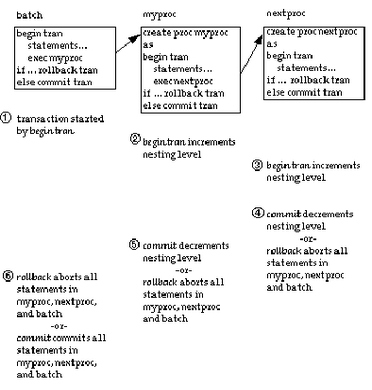

Транзакции
==========

::: {.date}
01.01.2007
:::

Транзакции: Поддержка корректности данных и их восстановление

 

Транзакции позволяют объединить в одну группу несколько SQL операторов и
интерпретировать их как один составной оператор. В этой группе будут
выполнены либо все операторы, либо ни один из них не будет выполнен.

В этой главе обсуждаются следующие темы:

 

::: {style="text-align: left; text-indent: 0px; padding: 0px 0px 0px 0px; margin: 0px 0px 0px 114px;"}
  --- --------------------------
  ·   Дается обзор транзакций;
  --- --------------------------
:::

::: {style="text-align: left; text-indent: 0px; padding: 0px 0px 0px 0px; margin: 0px 0px 0px 114px;"}
  --- ----------------------------------------------------------------
  ·   Объясняется, как использовать групповые операции в транзакции;
  --- ----------------------------------------------------------------
:::

::: {style="text-align: left; text-indent: 0px; padding: 0px 0px 0px 0px; margin: 0px 0px 0px 114px;"}
  --- ------------------------------------------------------------------
  ·   Объясняется, как определить режимы транзакций и уровни изоляции;
  --- ------------------------------------------------------------------
:::

::: {style="text-align: left; text-indent: 0px; padding: 0px 0px 0px 0px; margin: 0px 0px 0px 114px;"}
  --- --------------------------------------------------------------------------
  ·   Обсуждается, как сохраненные процедуры и триггеры работают в транзакции;
  --- --------------------------------------------------------------------------
:::

::: {style="text-align: left; text-indent: 0px; padding: 0px 0px 0px 0px; margin: 0px 0px 0px 114px;"}
  --- -------------------------------------
  ·   Как курсоры работают в транзакциях;
  --- -------------------------------------
:::

::: {style="text-align: left; text-indent: 0px; padding: 0px 0px 0px 0px; margin: 0px 0px 0px 114px;"}
  --- -------------------------------------
  ·   Отмена и восстановление транзакций.
  --- -------------------------------------
:::

 

::: {style="text-align: left; text-indent: 0px; border-color: #000000; border-style: solid; border-width: 1px; border-top: none; border-right: none; border-left: none; padding: 0px 0px 1px 0px; margin: 0px 0px 1px 21px;"}
  -- ----------------------
     Что такое транзакции
  -- ----------------------
:::

 

Транзакция - это механизм объединения одного или нескольких SQL
операторов в единое целое. SQL Сервер автоматически выполняет все
операторы модификации данных, включая одношаговые изменения, как
транзакции. По умолчанию каждый оператор вставки, обновления и удаления
выполняется как простая транзакция.

Пользователь может сгруппировать множество SQL операторов в транзакцию с
помощью команд begin transaction (начать транзакцию), commit transaction
(подтвердить транзакцию), rollback transaction (откатить транзакцию).
Команда begin transaction отмечает начало транзакции. Все остальные
операторы вплоть до оператора rollback transaction или соответствующего
оператора commit transaction включаются в эту транзакцию.

Транзакции позволяют гарантировать следующие свойства:

 

::: {style="text-align: left; text-indent: 0px; padding: 0px 0px 0px 0px; margin: 0px 0px 0px 114px;"}
  --- --------------------------------------------------------------------------------------------------------------------------------------------------------------------------------------------------
  ·   Корректность - Одновременные запросы и изменения данных не противоречат друг другу и пользователь никогда не видит и не работает с данными, которые являются только частью некоторого изменения;
  --- --------------------------------------------------------------------------------------------------------------------------------------------------------------------------------------------------
:::

::: {style="text-align: left; text-indent: 0px; padding: 0px 0px 0px 0px; margin: 0px 0px 0px 114px;"}
  --- --------------------------------------------------------------------------------------------------------
  ·   Восстанавливаемость - В случае системного сбоя база данных полностью  автоматически восстанавливается.
  --- --------------------------------------------------------------------------------------------------------
:::

 

Для поддержки транзакций, удовлетворяющих SQL стандарту, SQL Сервер
предоставляет опции, которые позволяют выбрать режим и уровень изоляции
(isolation level) транзакции. В приложениях, где используются
транзакции, удовлетворяющие стандарту, необходимо устанавливать эти
опции в начале каждой сессии. Режимы транзакций и уровни изоляции
обсуждается далее в этой главе.

 

::: {style="text-align: left; text-indent: 0px; border-color: #000000; border-style: solid; border-width: 1px; border-top: none; border-right: none; border-left: none; padding: 0px 0px 1px 0px; margin: 0px 0px 1px 42px;"}
  -- -----------------------------------
     Транзакции и достоверность данных
  -- -----------------------------------
:::

 

В многопользовательской среде SQL Сервер должен предотвращать
одновременные запросы и попытки одновременного изменения данных со
стороны различных пользователей. Это очень важно, поскольку в противном
случае данные, обрабатываемые одним запросом, могут быть модифицированы
другим пользователем, что может привести к противоречивому результату.

SQL Сервер автоматически устанавливает соответствующий уровень
блокировки для каждой транзакции. Можно установить более сильную
разделяемую блокировку (shared locks) для поочередных запросов, указав
ключевое слово holdlock в операторе выбора select.

Пользователь может определить транзакцию, указать SQL Серверу, что
последовательность SQL операторов нужно выполнить как единый блок. Эта
возможность обсуждается далее в этой главе.

 

::: {style="text-align: left; text-indent: 0px; border-color: #000000; border-style: solid; border-width: 1px; border-top: none; border-right: none; border-left: none; padding: 0px 0px 1px 0px; margin: 0px 0px 1px 42px;"}
  -- ------------------------------------
     Транзакции и восстановление данных
  -- ------------------------------------
:::

 

Транзакции являются как единицей работы, так и единицей восстановления
данных. Тот факт, что SQL Сервер выполняет одношаговые (простые) запросы
как транзакции означает, что база данных может быть полностью
восстановлена в случае возникновения ошибок.

Время восстановления измеряется в секундах и минутах. Можно указать
максимально допустимое время восстановления.

SQL операторы, связанные с восстановлением и отменой изменения данных,
обсуждаются в разделе «Отмена и восстановление транзакций».

 

::: {style="text-align: left; text-indent: 0px; border-color: #000000; border-style: solid; border-width: 1px; border-top: none; border-right: none; border-left: none; padding: 0px 0px 1px 0px; margin: 0px 0px 1px 21px;"}
  -- --------------------------
     Использование транзакций
  -- --------------------------
:::

 

Команды begin transaction (начать транзакцию) и commit transaction
(закончить транзакцию) указывают SQL Серверу, что последовательность
операторов, расположенную между ними, нужно выполнить как единый блок.
Команда rollback transaction (откат транзакции) отменяет изменения,
произведенные транзакцией, возвращаясь либо к исходному состоянию, в
котором находилась система до начала транзакции, либо к состоянию,
соответствующему точке сохранения (save point). Можно определить точку
сохранения внутри транзакции с помощью команды save transaction
(сохранить транзакцию).

С помощью этих команд пользователь может влиять на выполнение
транзакций. Кроме того, они улучшают производительность, поскольку
системные накладные расходы будут связаны с транзакцией, а не с
отдельной командой.

 

Замечание. Группировка большого числа SQL команд в одну большую
транзакцию может повлиять на время восстановления. Если SQL Сервер
обнаружит ошибку до окончания транзакции, то время восстановления будет
больше, поскольку потребуется время на отмену произведенных изменений.

 

Любой пользователь может определить транзакцию. Для использования
транзакций не требуется никаких разрешений.

В следующих разделах обсуждается общие темы, относящиеся к транзакциям,
а также команды, связанные с транзакциями, вместе с примерами их
использования. Дополнительная информация о транзакциях приводится в
Справочном руководстве SQL Сервера.

 

::: {style="text-align: left; text-indent: 0px; border-color: #000000; border-style: solid; border-width: 1px; border-top: none; border-right: none; border-left: none; padding: 0px 0px 1px 0px; margin: 0px 0px 1px 42px;"}
  -- ------------------------------------------
     Команды определения данных в транзакциях
  -- ------------------------------------------
:::

 

Можно использовать некоторые команды определения данных (ddl - data
definition language)  в транзакциях, если установлена (в состояние true)
опция ddl in tran. В этом случае в текущей базе данных внутри транзакций
можно пользоваться такими командами, как creat table (создать таблицу),
alter table (изменить таблицу) и grant (предоставить права). Если опция
ddl in tran установлена в базе данных model, то указанные команды можно
использовать во всех базах данных, созданных после установке этой опции
в базе данных model.

 

Предупреждение! Только в сценарии create schema объясняется
использование команд определения данных. Эти команды блокируют системные
таблицы, такие как sysobjects. Поэтому транзакции, в которых есть эти
команды, нужно делать короткими.

               В частности, следует избегать использования этих команд в
транзакциях, работающих с временной базой данных tempdb, чтобы система
полностью не остановилась. Поэтому опция ddl in tran всегда должна быть
в состоянии false в базе данных tempdb.

 

Чтобы установить опцию ddl in tran, можно использовать, например,
следующую команду:

 

sp\_dboption mydb, "ddl in tran", true

 

Первым параметром здесь указывается название базы данных, в которой
устанавливается эта опция. Пользователь должен работать с базой данных
master, чтобы выполнить команду sp\_dboption. Любой пользователь может
выполнить команду sp\_dboption без параметров, чтобы увидеть текущую
установку опций. Тем не менее, чтобы установить опцию нужно быть
системным администратором либо владельцем базы данных.

Следующие команды допускаются внутри транзакций пользователя, если
установлена опция ddl in tran:

 

Таблица 17-1: DDL команды, допускаемые в транзакциях

 

    +-----------------+-----------------+-----------------+-----------------+
    | alter table     | create default  | drop default    | grant           |
    | (допускаются    |                 |                 |                 |
    | все предложения | create index    | drop index      | revoke          |
    | кроме partion и |                 |                 |                 |
    | unpartion)      | create          | drop procedure  |                 |
    |                 | procedure       |                 |                 |
    |                 |                 | drop rule       |                 |
    |                 | create rule     |                 |                 |
    |                 |                 | drop table      |                 |
    |                 | create schema   |                 |                 |
    |                 |                 | drop trigger    |                 |
    |                 | create table    |                 |                 |
    |                 |                 | drop view       |                 |
    |                 | create trigger  |                 |                 |
    |                 |                 |                 |                 |
    |                 | create view     |                 |                 |
    +-----------------+-----------------+-----------------+-----------------+

 

Системные процедуры, которые изменяют базу данных master или временные
таблицы, нельзя использовать в транзакциях пользователей.

Никогда не следует использовать следующие команды внутри транзакций:

 

Таблица 17-2: DDL команды, которые нельзя использовать в транзакциях

 

    +-----------------+-----------------+-----------------+-----------------+
    | alter database  | disk init       | load            | select into     |
    |                 |                 | transaction     |                 |
    | alter           | dump database   |                 | update          |
    | table...partit |                 | load database   | statistics      |
    | ion             | dump            |                 |                 |
    |                 | transaction     | reconfigure     | truncate table  |
    | alter table     |                 |                 |                 |
    | unpartition     | drop database   |                 |                 |
    |                 |                 |                 |                 |
    | create database |                 |                 |                 |
    +-----------------+-----------------+-----------------+-----------------+

 

С помощью процедуры sp\_helpdh можно определить текущую установку опции
ddl in tran.

 

::: {style="text-align: left; text-indent: 0px; border-color: #000000; border-style: solid; border-width: 1px; border-top: none; border-right: none; border-left: none; padding: 0px 0px 1px 0px; margin: 0px 0px 1px 42px;"}
  -- -------------------------------
     Начало и окончание транзакций
  -- -------------------------------
:::

 

Между командами begin transaction (начать транзакцию) commit transaction
(закончить (подтвердить) транзакцию) можно расположить любое число SQL
операторов и сохраненных процедур. Эти команды имеют следующий
синтаксис:

 

begin {transaction \| tran} [название\_транзакции]

commit {transaction \| tran \| work} [название\_транзакции]

 

Название транзакции должно удовлетворять правилам, установленным для
идентификаторов.

Ключевые слова transaction, tran и work (для команды commit) являются
синонимами, поэтому можно использовать любое из них. Однако transaction
и tran являются словами расширенного языка Transact-SQL; только work
является словом стандартного языка SQL.

Схематично транзакция выглядит следующим образом:

 

begin tran

       оператор

       процедура

       оператор

commit tran

 

Команда commit transaction не выполняется SQL Сервером, если транзакция
не является активной.

 

::: {style="text-align: left; text-indent: 0px; border-color: #000000; border-style: solid; border-width: 1px; border-top: none; border-right: none; border-left: none; padding: 0px 0px 1px 0px; margin: 0px 0px 1px 42px;"}
  -- --------------------------------
     Откат назад и точки сохранения
  -- --------------------------------
:::

 

Если транзакция должна быть прекращена до того, как она окончится, то
все выполненные в ней операторы или процедуры должны быть отменены.
Преждевременное прекращение выполнения транзакции может произойти либо
из-за появления ошибки, либо по требованию пользователя.

Транзакцию можно прекратить (откатить) в любое время до выполнения
команды commit transaction с помощью команды rollback transaction
(откатить транзакцию). Используя точки сохранения, можно откатить только
часть транзакции. Нельзя откатить транзакцию после ее окончания и
подтверждения изменений.

Команда rollback transaction имеет следующий синтаксис:

 

rollback {transaction \| tran \| work} [название\_транзакции \|
название\_точки]

 

Точка сохранения - это метка (маркер), которой помечается место отката
внутри транзакции.

Точки сохранения вводятся командой save transaction, которая имеет
следующий синтаксис:

 

save {transaction \| tran} название\_точки\_сохранения

 

Название точки сохранения должно удовлетворять правилам, установленным
для идентификаторов.

Если в команде rollback transaction не указывается название транзакции
или точки сохранения, то транзакция откатывается до первого оператора
begin transaction в пакете.

Далее приводится пример использования команд save transaction и rollback
transaction:

 

begin tran название\_транзакции

       оператор

       оператор

процедура

save tran название\_точки\_сохранения

       оператор

rollback tran название\_точки\_сохранения

       оператор

       оператор

rollback tran

 

Первая команда rollback transaction возвращает вычислительный процесс в
состояние, соответствующее точке сохранения внутри транзакции. Вторая
команда rollback transaction возвращает процесс в состояние,
соответствующее началу транзакции. Если транзакция возвращается к точке
сохранения, то она должна в дальнейшем либо закончится, либо будет
откачена полностью.

Пока не выполнена команда commit transaction SQL Сервер выполняет все
последующие операторы как часть транзакции, до тех пор пока не появится
другая команда begin transaction. С этого момента SQL Сервер начинает
выполнение новой вложенной (nested) транзакции. Вложенные транзакции
описываются в следующем разделе.

SQL Сервер не выполняет команды rollback transaction и save transaction
и не выдает сообщений об ошибке, если транзакция является неактивной.

 

::: {style="text-align: left; text-indent: 0px; border-color: #000000; border-style: solid; border-width: 1px; border-top: none; border-right: none; border-left: none; padding: 0px 0px 1px 0px; margin: 0px 0px 1px 42px;"}
  -- -------------------------------
     Проверка состояния транзакций
  -- -------------------------------
:::

 

Глобальная переменная @\@transtate служит для запоминания текущего
состояния транзакции. SQL Сервер определяет состояние путем запоминания
изменений, возникающих после выполнения операторов. Эта переменная может
содержать следующие значения:

 

Таблица 17-3: Значения переменной @\@transtate

 

  ---------- --------------------------------------------------------------------------------
  Значение   Смысл
  0          Транзакция выполняется. Предыдущий оператор выполнился успешно.
  1          Транзакция закончилась и произошло подтверждение всех произведенных изменений.
  2          Выполнение предыдущего оператора было прервано. Изменений не произошло.
  3          Транзакция прервана и отменены все произведенные изменения.
  ---------- --------------------------------------------------------------------------------

 

В транзакции можно использовать значение переменной @\@transtate после
выполнения оператора (такого как insert) для проверки правильности его
выполнения. В следующем примере значение переменной @\@transtate
проверяется в процессе выполнения транзакции после оператора вставки и
после окончания транзакции:

 

begin transaction

insert into publishers (pub\_id) values (\'9999\')

 

(1 row affected)

 

select @\@transtate

 

----------

       0

 

(1 row affected)

 

commit transaction

 

select @\@transtate

----------

        1

 

(1 row affected)

 

В следующем примере значение переменной @\@transtate проверяется после
выполнения ошибочного оператора вставки (который нарушает правило) и
после отката всей транзакции:

 

begin transaction

insert into publishers (pub\_id) values (\'7777\')

 

Msg 552, Level 16, State 1:

A column insert or update conflicts with a rule bound to the column. The
command is aborted. The conflict occured in database \'pubs2\', table
\'publishers\', rule \'pub\_idrule\', column \'pub\_id\'.

 

select @\@transtate

----------

       2

 

(1 row affected)

 

rollback transaction

select @\@transtate

----------

       3

 

(1 row affected)

 

Однако в противоположность переменной @\@error, SQL Сервер не
восстанавливает значение переменной @\@transtate после каждого
оператора. Значение этой переменной изменяется только в процессе
выполнения транзакций.

 

::: {style="text-align: left; text-indent: 0px; border-color: #000000; border-style: solid; border-width: 1px; border-top: none; border-right: none; border-left: none; padding: 0px 0px 1px 0px; margin: 0px 0px 1px 42px;"}
  -- ----------------------
     Вложенные транзакции
  -- ----------------------
:::

 

Можно поместить транзакцию внутри другой транзакции. В этом случае
действительное подтверждение изменений происходит после окончания самой
внешней транзакции. Внутренняя пара команд begin transaction и commit
transaction лишь указывают уровень вложенности. SQL Сервер не фиксирует
изменений до те пор, пока не появится самая внешняя команда commit
transaction, которая соответствует самой внешней команде begin
transaction.

SQL Сервер содержит глобальную переменную @\@trancount, в которой
запоминается уровень вложенности транзакций. Самая первая явная или
неявная команда begin transaction устанавливает значение этой переменной
равным 1. Каждая последующая команда begin transaction увеличивает
значение этой переменной (на единицу), а команда commit transaction
уменьшает его (на единицу). Запуск триггера также приводит к увеличению
этой переменной и транзакция начинается с оператора, который запустил
триггер. Изменения, сделанные во вложенных транзакциях, не фиксируются
(committed) до тех пор, пока не значение переменной @\@trancount не
станет равным нулю.

Например, изменения, сделанные в следующих вложенных группах операторов,
не подтверждаются до тех пор, пока не выполнится последний оператор
commit transaction:

 

begin tran

   select @\@trancount

   /* @\@trancount = 1 */

   begin tran

       select @\@trancount

       /* @\@trancount = 2 */

       begin tran

           select @\@trancount

           /* @\@trancount = 3 */

       commit tran

   commit tran

commit tran

select @\@trancount

/* @@ trancount = 0 */

 

Если во вложенной транзакции встречается оператор rollback transaction
без указания названия транзакции или точки сохранения, то всегда
откатывается самая внешняя транзакция и выполнение транзакции
прекращается.

 

::: {style="text-align: left; text-indent: 0px; border-color: #000000; border-style: solid; border-width: 1px; border-top: none; border-right: none; border-left: none; padding: 0px 0px 1px 0px; margin: 0px 0px 1px 42px;"}
  -- --------------------------------
     Пример транзакции пользователя
  -- --------------------------------
:::

 

Следующий пример показывает как можно определить транзакцию
пользователя:

 

begin transaction royalty\_change

 

/* A user sets out to change the royalty split */

/* for the two authors of The Gourmet Microwave. */

/* Since the database would be inconsistent */

/* between the two updates, they must be grouped */

/* into a transaction. */

 

update titleauthor

set royaltyper = 65

from titleauthor, titles

where royaltyper = 75

and titleauthor.title\_id = titles.title\_id

and title = "The Gourmet Microwave"

 

update titleauthor

set royaltyper = 35

from titleauthor, titles

where royaltyper = 25

and titleauthor.title\_id = titles.title\_id

and title = "The Gourmet Microwave"

 

save transaction percent\_changed

 

/* After updating the royaltyper entries for */

/* the two authors, the user inserts the */

/* savepoint "percent\_changed," and then checks */

/* to see how a 10 percent increase in the

/* price would affect the authors\' royalty */

/* earnings. */

 

update titles

set price = price * 1.1

where title = "The Gourmet Microwave"

 

select (price * royalty * total\_sales) * royaltyper

from titles, titleauthor, roysched

where title = "The Gourmet Microwave"

and titles.title\_id = titleauthor.title\_id

and titles.title\_id =roysched.title\_id

 

rollback transaction percent\_changed

 

/* The transaction rolls back to the savepoint */

/* with the rollback transaction command. */

/* Without a savepoint, it would roll back to */

/* the begin transaction. */

 

commit transaction

 

::: {style="text-align: left; text-indent: 0px; border-color: #000000; border-style: solid; border-width: 1px; border-top: none; border-right: none; border-left: none; padding: 0px 0px 1px 0px; margin: 0px 0px 1px 21px;"}
  -- -------------------------------------------
     Выбор режима транзакции и уровня изоляции
  -- -------------------------------------------
:::

 

SQL Сервер предоставляет две опции, которые предназначены для выполнения
транзакций, удовлетворяющих стандарту языка SQL. Эти опции определяют
режим транзакции (transaction mode) и уровень изоляции (isolation
level). Эти опции необходимо устанавливать в начале каждой сессии, в
которой транзакции должны удовлетворять стандарту SQL.

SQL Сервер поддерживает следующие режимы транзакций:

 

::: {style="text-align: left; text-indent: 0px; padding: 0px 0px 0px 0px; margin: 0px 0px 0px 114px;"}
  --- ------------------------------------------------------------------------------------------------------------------------------------------------------------------------------------------------------------------------------------------------------------------------------------------------------------
  ·   По умолчанию устанавливается режим, называемый несвязанным (unchained) или режимом Transact-SQL, в котором для начала транзакции требуется явное указание оператора begin transaction, а для ее окончания требуется указать соответствующий (парный) оператор commit transaction или rollback transaction;
  --- ------------------------------------------------------------------------------------------------------------------------------------------------------------------------------------------------------------------------------------------------------------------------------------------------------------
:::

::: {style="text-align: left; text-indent: 0px; padding: 0px 0px 0px 0px; margin: 0px 0px 0px 114px;"}
  --- -------------------------------------------------------------------------------------------------------------------------------------------------------------------------------------------------------------------------------------------------------------------------------------------------------------------------------------------------------------------------
  ·   Можно установить режим, который в стандарте SQL называется связанным (chained), когда транзакция начинается неявно при выполнении любого оператора выбора или модификации данных. К этим операторам относятся: delete, insert, open, fetch, select и update. Но для окончания транзакции здесь нужно явно указать оператор commit transaction или rollback transaction.
  --- -------------------------------------------------------------------------------------------------------------------------------------------------------------------------------------------------------------------------------------------------------------------------------------------------------------------------------------------------------------------------
:::

 

Можно установить любой их этих режимов, включив опцию chained командой
set. Однако не следует смешивать режимы транзакций в своих прикладных
программах. Выполнение сохраненных процедур и триггеров может зависеть
от режима транзакций, поэтому могут потребоваться дополнительные усилия,
чтобы процедура, созданная в одном режиме, могла запускаться в другом
режиме.

SQL Сервер поддерживает следующие уровни изоляции транзакций:

 

::: {style="text-align: left; text-indent: 0px; padding: 0px 0px 0px 0px; margin: 0px 0px 0px 114px;"}
  --- -----------------------------------------------------------------------------------------------------------------------------------------------------------------------------------------------------------------------------------------------------
  ·   Уровень 0 - На этом уровне предполагается, что каждая транзакция записывает фактические данные. На этом уровне не допускается запись данных в то же место пока транзакция не окончится. Другие транзакции могут считывать не подтвержденные данные;
  --- -----------------------------------------------------------------------------------------------------------------------------------------------------------------------------------------------------------------------------------------------------
:::

::: {style="text-align: left; text-indent: 0px; padding: 0px 0px 0px 0px; margin: 0px 0px 0px 114px;"}
  --- -------------------------------------------------------------------------------------------------------------------------------------------------------------------------------------------------------------------------------------------------------------------------------------------
  ·   Уровень 1 - Здесь предполагается, что в каждой транзакции считываются фактические данные, а не данные, записанные не окончившейся транзакцией. Другими словами, здесь не допускается считывание неподтвержденных данных. Этот уровень изоляции устанавливается по умолчанию SQL Сервером;
  --- -------------------------------------------------------------------------------------------------------------------------------------------------------------------------------------------------------------------------------------------------------------------------------------------
:::

::: {style="text-align: left; text-indent: 0px; padding: 0px 0px 0px 0px; margin: 0px 0px 0px 114px;"}
  --- --------------------------------------------------------------------------------------------------------------------------------------------------------------------------------------------------------------------------------------------------------------------------
  ·   Уровень 3 - Здесь предполагается, что данные, считываемые в процессе выполнения транзакции,  не должны изменяться до окончания транзакции. Этот уровень можно установить, указав ключевое слово holdlock в операторе выбора, и тем самым блокировать считываемые данные.
  --- --------------------------------------------------------------------------------------------------------------------------------------------------------------------------------------------------------------------------------------------------------------------------
:::

 

В каждом сеансе работы можно установить командой set уровень изоляции с
помощью опции transaction isolation level. В качестве альтернативы можно
установить уровень изоляции только для текущего запроса, указав
предложение at isolation в операторе выбора select.

В следующих разделах эти возможности будут описаны более детально.

 

::: {style="text-align: left; text-indent: 0px; border-color: #000000; border-style: solid; border-width: 1px; border-top: none; border-right: none; border-left: none; padding: 0px 0px 1px 0px; margin: 0px 0px 1px 42px;"}
  -- -------------------------
     Выбор режима транзакции
  -- -------------------------
:::

 

Стандарт языка SQL требует чтобы каждый SQL оператор, который выбирает
или модифицирует данные, выполнялся внутри транзакции. Транзакция должна
начинаться автоматически в начале рабочего сеанса или после окончания
предыдущей транзакции при выполнении оператора, обращающегося к данным.
Это - связанный режим транзакций.

Этот режим можно установить путем установки опции chained командой set.
Например:

 

set chained on

 

Однако эту опцию нельзя устанавливать внутри транзакции. Для возврата в
несвязанный режим транзакций следует выключить эту опции, установив ее в
состояние off командой set. По умолчанию устанавливается несвязанный
режим.

Если установлен связанный режим транзакций, то SQL Сервер неявно
выполняет команду begin transaction непосредственно перед следующими
операторами, выбирающими или модифицирующими данные: delete, insert,
open, fetch, select и update. Например, следующая группа операторов
будет выдавать различные результаты в зависимости от используемого
режима транзакций:

 

insert into publishers

   values (\'9999\', null, null, null)

begin transaction

delete from publishers where pub\_id = \'9999\'

rollback transaction

 

В несвязанном режиме команда rollback затронет только оператор delete,
поэтому таблица publishers будет содержать вставленную строку. В
связанном режиме оператор insert неявно начинает транзакцию, поэтому
откатываться будут все операторы вплоть до начала транзакции, включая и
оператор insert.

Хотя в связанном режиме транзакция начинается неявно при выполнении
операторов, обращающихся к данным, тем не менее для вложенных транзакций
необходимо явно указать оператор begin transaction. После неявного
начала транзакции следующие операторы уже не начинают транзакции до тех
пор, пока начатая транзакция не будет окончена или отменена. Например, в
следующем запросе первая команда commit transaction подтверждает все
изменения, сделанные в связанном режиме, поэтому вторая подтверждающая
команда является лишней:

 

insert into publishers

   values (\'9999\', null, null, null)

   insert into publishers

       values (\'9997\', null, null, null)

   commit transaction

commit transaction

 

Замечание: В связанном режиме любой оператор, выбирающий или
модифицирующий данные, начинает транзакцию независимо от того насколько
успешно он был выполнен. Даже простой оператор select, не обращающийся к
таблице, начинает транзакцию.

 

Режим транзакций можно проверить по значению глобальной переменной
@\@tranchained. В несвязанном режиме эта переменная устанавливается в 0,
а в связанном - в 1.

 

::: {style="text-align: left; text-indent: 0px; border-color: #000000; border-style: solid; border-width: 1px; border-top: none; border-right: none; border-left: none; padding: 0px 0px 1px 0px; margin: 0px 0px 1px 42px;"}
  -- -----------------------
     Выбор уровня изоляции
  -- -----------------------
:::

 

В стандарте языка SQL от 1992 года определяется четыре уровня изоляции
для транзакций. Каждый уровень изоляции определяет (квалифицирует)
действия, которые недопустимы при выполнении параллельных (concurrent)
транзакций. Более высокие уровни изоляции включают все ограничения,
установленные на более низких уровнях:

 

::: {style="text-align: left; text-indent: 0px; padding: 0px 0px 0px 0px; margin: 0px 0px 0px 114px;"}
  --- -----------------------------------------------------------------------------------------------------------------------------------------------------------------------------------------------------------------------------------------------------------------------------------------------------------------------------------------------------------------------------------------------------------
  ·   На нулевом уровне запрещается изменение данных со стороны других транзакций, если эти данные модифицируются еще не окончившейся транзакцией. Иначе говоря, другие транзакции блокируются по записи для этих данных до тех пор, пока не окончится текущая транзакция. Однако другим транзакциям разрешается считывать еще не подтвержденные данные, что классифицируется как грязное чтение (dirty reads);
  --- -----------------------------------------------------------------------------------------------------------------------------------------------------------------------------------------------------------------------------------------------------------------------------------------------------------------------------------------------------------------------------------------------------------
:::

::: {style="text-align: left; text-indent: 0px; padding: 0px 0px 0px 0px; margin: 0px 0px 0px 114px;"}
  --- ----------------------------------------------------------------------------------------------------------------------------------------------------------------------------------------------------------------------------------------------------------------------------------------------------------------------------------------------------------
  ·   На первом уровне запрещается грязное чтение. Такое чтение возникает тогда, когда в одной транзакции строка модифицируется, а во второй транзакции эта строка считывается, прежде чем первая транзакция будет окончена или отменена. Если первая транзакция будет откачена (отменена), то информация, полученная во второй транзакции, окажется неверной;
  --- ----------------------------------------------------------------------------------------------------------------------------------------------------------------------------------------------------------------------------------------------------------------------------------------------------------------------------------------------------------
:::

::: {style="text-align: left; text-indent: 0px; padding: 0px 0px 0px 0px; margin: 0px 0px 0px 114px;"}
  --- --------------------------------------------------------------------------------------------------------------------------------------------------------------------------------------------------------------------------------------------------------------------------------------------------------
  ·   На втором уровне запрещается неповторяемое чтение (nonrepeatable reads). Такое чтение возникает, когда в одной транзакции строка считывается, а во второй транзакции эта строка модифицируется. В этом случае результат  считывания будет зависеть от того, какая из транзакций будет окончена первой;
  --- --------------------------------------------------------------------------------------------------------------------------------------------------------------------------------------------------------------------------------------------------------------------------------------------------------
:::

::: {style="text-align: left; text-indent: 0px; padding: 0px 0px 0px 0px; margin: 0px 0px 0px 114px;"}
  --- ----------------------------------------------------------------------------------------------------------------------------------------------------------------------------------------------------------------------------------------------------------------------------------------------------------------------------------------------------------------------------------
  ·   На третьем уровне запрещаются фантомы (phantoms). Они возникают, когда в одной транзакции считывается множество строк, удовлетворяющее некоторому условию, а в другой транзакции эти данные модифицируются (одним из операторов модификации данных). Если в первой транзакции будет выполнено повторное считывание при том же условии, то будет получено другое множество строк.
  --- ----------------------------------------------------------------------------------------------------------------------------------------------------------------------------------------------------------------------------------------------------------------------------------------------------------------------------------------------------------------------------------
:::

 

По умолчанию для SQL Сервера устанавливается первый уровень изоляции
транзакций. В стандарте языка SQL от 1992 года требуется, чтобы по
умолчанию устанавливался третий уровень изоляции для всех транзакций.
Это предотвращает грязные чтения, неповторяемые чтения и фантомы. Чтобы
установить этот уровень по умолчанию, в SQL Сервере имеется опция
transaction isolation level 3, которую можно установить командой set.
Установка этой опции вызывает автоматическое включение блокировки
(holdlock) во всех операторах выбора select в транзакции. Например:

 

set transaction isolation level 3

 

Приложения, которые требуют третьего уровня изоляции, должны
устанавливать его в начале каждого рабочего сеанса. Однако, установка
этого уровня вызывает блокировку данных при любом считывании в процессе
выполнения транзакции. Если к тому же установлен связанный режим
транзакций, то установленный уровень изоляции будет действовать при
выполнении любого оператора, обращающегося к данным, поскольку при этом
будет неявно начинаться транзакция. Это может привести к проблемам при
распределенном выполнении (concurrency problem) некоторых приложений,
поскольку длительное время будут действовать много блокировок.

Чтобы вернуться к первому уровню изоляции, который в SQL Сервере
устанавливается по умолчанию, следует выполнить команду:

 

set transaction isolation level 1

 

Прикладные программы, которые не критичны к грязному чтению, можно
сделать более быстрыми и уменьшить в них вероятность тупиков
(deadlocks), если установить нулевой уровень изоляции в начале рабочего
сеанса. В качестве примера можно привести программу, которая находит
среднее значение баланса по всем счетам, записанным в таблице. Весьма
вероятно, что это значение будет часто изменяться, поэтому его можно
вычислять по таблице на нулевом уровне изоляции. Приложения, которые
критичны к согласованности данных, такие, как начисление и снятие денег
с конкретного счета в таблице, не должны выполняться на нулевом уровне
изоляции.

Запросы, которые выполняются на нулевом уровне изоляции, не
предусматривают никаких блокировок во время чтения данных, поэтому они
не блокируют другие транзакции, которые записывают данные в то же место,
и наоборот. Однако, даже на нулевом уровне изоляции некоторые утилиты
(такие как dbcc) и операторы модификации данных (такие как update)
блокируют чтение данных, чтобы сохранить целостность базы данных и
гарантировать правильность считываемых данных.

Глобальная переменная @\@isolation указывает на текущий уровень
изоляции, установленный для рабочего сеанса. В ответ на запрос этой
переменной выдается значение текущего уровня (0,1 или 3). Например:

 

select @\@isolation

 

--------

      1

 

(1 row affected)

 

Дополнительную информацию об уровнях изоляции и блокировках можно
посмотреть в Руководстве по оптимизации и настройке SQL Сервера.

 

::: {style="text-align: left; text-indent: 0px; border-color: #000000; border-style: solid; border-width: 1px; border-top: none; border-right: none; border-left: none; padding: 0px 0px 1px 0px; margin: 0px 0px 16px 63px;"}
  -- -----------------------------------
     Изменение уровня изоляции запроса
  -- -----------------------------------
:::

 

Можно изменить уровень изоляции запроса с помощью предложения at
isolation в операторах select и readtext. Опции read uncommitted, read
committed и serializable предложения at isolation соответствуют
следующим уровням изоляции:

 

    +-----------------------------------+-----------------------------------+
    | Опции                             | Уровень изоляции                  |
    +-----------------------------------+-----------------------------------+
    | read uncommitted                  | 0                                 |
    +-----------------------------------+-----------------------------------+
    | read committed                    | 1                                 |
    +-----------------------------------+-----------------------------------+
    | serializable                      | 3                                 |
    +-----------------------------------+-----------------------------------+

 

Например, в следующих двух операторах запрашивается одна и та же таблица
на уровнях изоляции 0 и 3 соответственно:

 

select *

from titles

at isolation read uncommitted

select *

from titles

at isolation serializable

 

Предложение at isolation действует только на один оператор select, 
readtext или declare cursor, в котором оно указано. SQL Сервер
возвращает сообщение о синтаксической ошибке, если предложение at
isolation используется в следующих ситуациях:

 

::: {style="text-align: left; text-indent: 0px; padding: 0px 0px 0px 0px; margin: 0px 0px 0px 113px;"}
  --- -----------------------------------------------------------
  ·   Когда оно указано в запросе, содержащем предложение into;
  --- -----------------------------------------------------------
:::

::: {style="text-align: left; text-indent: 0px; padding: 0px 0px 0px 0px; margin: 0px 0px 0px 113px;"}
  --- --------------------------------------
  ·   Когда оно используется в подзапросе;
  --- --------------------------------------
:::

::: {style="text-align: left; text-indent: 0px; padding: 0px 0px 0px 0px; margin: 0px 0px 0px 113px;"}
  --- ------------------------------------------------------------------
  ·   Когда оно используется в операторе create view (создать вьювер);
  --- ------------------------------------------------------------------
:::

::: {style="text-align: left; text-indent: 0px; padding: 0px 0px 0px 0px; margin: 0px 0px 0px 113px;"}
  --- --------------------------------------------
  ·   Когда оно используется в операторе insert;
  --- --------------------------------------------
:::

::: {style="text-align: left; text-indent: 0px; padding: 0px 0px 0px 0px; margin: 0px 0px 0px 113px;"}
  --- -----------------------------------------------------------------
  ·   Когда оно указано в запросе, содержащем предложение for browse.
  --- -----------------------------------------------------------------
:::

 

Если в запросе есть оператор union (объединить), то предложение at
isolation должно указываться после последнего оператора select.

Стандарт языка SQL от 1992 года определяет фразы read uncommitted, read
committed и serializable как опции предложения at isolation (а также
команды set transaction isolation level). В языке Transact-SQL для
указания уровня изоляции можно также просто указать цифру 0,1 или 3 в
предложении at isolation. Чтобы упростить изложение уровней изоляции, в
данном руководстве это расширение не будет использоваться.

Третий уровень изоляции можно ввести, указав ключевое слово holdlock в
операторе выбора select. Однако, нельзя указывать ключевые слова
holdlock, noholdlock или shared в запросе, содержащем предложение at
isolation read uncommitted. Когда используются различные способы
установки уровня изоляции ключевое слово holdlock является старше, чем
предложение at isolation (за исключением нулевого уровня изоляции),
которое, в свою очередь, старше установки set transaction isolation
level, действующей для рабочего сеанса.

 

::: {style="text-align: left; text-indent: 0px; border-color: #000000; border-style: solid; border-width: 1px; border-top: none; border-right: none; border-left: none; padding: 0px 0px 1px 0px; margin: 0px 0px 16px 63px;"}
  -- ---------------------------
     Курсоры и уровни изоляции
  -- ---------------------------
:::

Оператор выбора, содержащий предложение at isolation, можно использовать
для изменения уровня изоляции при определении курсора. Например:

 

declare commit\_crsr cursor

for select *

from titles

at isolation read committed

 

Этот оператор устанавливает для работы с курсором первый уровень
изоляции, независимо от уровня изоляции, установленного для транзакций
или рабочего сеанса. Если курсор объявляется с нулевым уровнем изоляции,
то его можно использовать только для чтения. Нельзя указывать
предложение at isolation с опцией read uncommitted в конструкции for
update оператора declare cursor.

SQL Сервер устанавливает уровень изоляции курсора, когда он открывается,
а не когда он объявляется. В момент открытия курсора его уровень
изоляции выбирается, исходя из следующих обстоятельств:

 

::: {style="text-align: left; text-indent: 0px; padding: 0px 0px 0px 0px; margin: 0px 0px 0px 114px;"}
  --- ------------------------------------------------------------------------------------------------------------------------------------------------
  ·   Если курсор объявлен с указанием уровня изоляции, то этот уровень имеет приоритет перед уровнем изоляции транзакции, в которой он открывается;
  --- ------------------------------------------------------------------------------------------------------------------------------------------------
:::

::: {style="text-align: left; text-indent: 0px; padding: 0px 0px 0px 0px; margin: 0px 0px 0px 114px;"}
  --- ----------------------------------------------------------------------------------------------------------------------------------------------------------------------------------------------------------------------------------------
  ·   Если курсор объявлен без уровня изоляции, то для него используется уровень изоляции, при котором он был открыт. Если курсор был закрыт, а затем позднее вновь открыт, то для него устанавливается уровень изоляции текущей транзакции.
  --- ----------------------------------------------------------------------------------------------------------------------------------------------------------------------------------------------------------------------------------------
:::

 

В последнем случае необходимо отметить, что курсоры некоторых типов
(языковые и клиентские), объявленные в транзакции с первым или третьим
уровнем изоляции, не могут быть открыты в транзакции с нулевым уровнем
изоляции. Более подробно об этих ограничениях и об курсорах различных
типов можно посмотреть в Справочном руководстве SQL Сервера.

 

::: {style="text-align: left; text-indent: 0px; border-color: #000000; border-style: solid; border-width: 1px; border-top: none; border-right: none; border-left: none; padding: 0px 0px 1px 0px; margin: 0px 0px 16px 63px;"}
  -- -----------------------------------------
     Сохраненные процедуры и уровни изоляции
  -- -----------------------------------------
:::

Все системные сохраненные процедуры всегда Sybase работают на 1 уровне
изоляции, независимо от уровня изоляции транзакции или рабочего сеанса.
Сохраненные процедуры пользователя работают с уровнем изоляции
транзакции, в которой они вызываются. Если уровень изоляции изменяется
внутри сохраненной процедуры, то он действует только во время выполнения
этой процедуры.

 

::: {style="text-align: left; text-indent: 0px; border-color: #000000; border-style: solid; border-width: 1px; border-top: none; border-right: none; border-left: none; padding: 0px 0px 1px 0px; margin: 0px 0px 16px 63px;"}
  -- ----------------------------
     Триггеры и уровни изоляции
  -- ----------------------------
:::

Поскольку триггеры запускаются во время выполнения операторов
модификации данных (таких как insert), то все триггеры выполняются либо
на уровне изоляции транзакции, либо на первом уровне изоляции, в
зависимости от того, какой из этих уровней больше. Таким образом, если
триггер был запущен в транзакции нулевого уровня, то SQL Сервер перед
выполнением его первого оператора устанавливает для этого триггера
первый уровень изоляции.

 

::: {style="text-align: center; text-indent: 0px; border-color: #000000; border-style: solid; border-width: 1px; border-top: none; border-right: none; border-left: none; padding: 0px 0px 1px 0px; margin: 0px 0px 1px 21px;"}
  -- -------------------------------------------------
     Транзакции в сохраненных процедурах и триггерах
  -- -------------------------------------------------
:::

 

Транзакции можно использовать внутри сохраненных процедур и триггеров, а
также внутри операторных пакетов. Если транзакция в пакете или
сохраненной процедуре вызывает другую сохраненную процедуру или триггер,
которые в свою очередь содержат транзакцию, то вторая транзакция будет
вложена в первую.

Первая явная или неявная (в связанном режиме) команда begin transaction
начинает транзакцию в пакете, сохраненной процедуре или триггере. Каждая
последующая команда begin transaction увеличивает уровень вложенности на
единицу. Каждая последующая команда commit transaction уменьшает уровень
вложенности, пока не будет достигнут 0. После этого SQL Сервер
заканчивает всю транзакцию. Команда rollback transaction отменяет всю
транзакцию вплоть до первой команды begin transaction независимо от
уровня вложенности и числа промежуточных процедур и триггеров.

В процедурах и триггерах число команд begin transaction должно
соответствовать числу команд commit transaction. Это также относится к
сохраненным процедурам, использующим связанный режим. Первый оператор,
который неявно начинает транзакцию также должен иметь соответствующий
закрывающий оператор commit transaction.

Следующий рисунок иллюстрирует использование транзакций внутри вложенных
процедур.

:::{.center}
  
Рисунок 17-1: Вложенные транзакции
:::
 

Команда rollback transaction в сохраненной процедуре не влияет на
последующие операторы процедуры или пакета, которые расположены за
оператором вызова этой процедуры. Другими словами, SQL Сервер выполнит
оставшиеся операторы процедуры или пакета. Однако команда rollback
transaction в триггере отменяет выполнение всего пакета, поэтому
оставшиеся операторы в этом случае не выполняются.

Например, в следующем пакете вызывается процедура myproc, в которой
расположен оператор rollback transaction:

 

begin tran

update titles set ...

insert into titles ...

execute myproc

delete titles where ...

 

Если этот оператор будет выполнен, то операторы обновления (update) и
вставки (insert) отменяются и транзакция прерывается. После этого SQL
Сервер продолжит выполнение пакета и выполнит оператор удаления
(delete). Однако, если с таблицей связан вставляющий триггер, в котором
была выполнена команда rollback transaction, то отменяется выполнение
всего пакета, и следовательно в этом случае оператор удаления не будет
выполняться. Например:

 

begin tran

update authors set ...

insert into authors ...

delete authors where ...

 

Имеются определенные требования к режимам транзакций и уровням изоляции
в сохраненных процедурах, которые описываются в следующем разделе. На
триггера не влияет текущий режим транзакций, поскольку они всегда
вызываются как часть оператора модификации данных.

 

::: {style="text-align: left; text-indent: 0px; border-color: #000000; border-style: solid; border-width: 1px; border-top: none; border-right: none; border-left: none; padding: 0px 0px 1px 0px; margin: 0px 0px 1px 42px;"}
  -- --------------------------------------------
     Режимы транзакций в сохраненных процедурах
  -- --------------------------------------------
:::

 

Сохраненные процедуры, в которых используется несвязанный режим
транзакций, могут быть несовместимы с транзакциями, использующими
связанный режим, и наоборот.

Например, следующая сохраненная процедура является правильной при
использовании связанного режима транзакций:

 

create proc myproc

as

insert into publishers

   values (\'9999\', null, null, null)

commit work

 

Программа, выполняющаяся в несвязанном режиме транзакций, может
оказаться ошибочной, если она обратиться к этой процедуре, поскольку
команда commit не имеет парной себе команды begin. Могут также
возникнуть следующие проблемы:

 

::: {style="text-align: left; text-indent: 0px; padding: 0px 0px 0px 0px; margin: 0px 0px 0px 114px;"}
  --- ------------------------------------------------------------------------------------------------------------------------------------------------------------------------------------------------------------------------------------
  ·   Приложения, которые начинаются в связанном режиме, могут образовать очень длинные транзакции, которые невозможно выполнить, или на весь сеанс работы заблокировать данные. Это приводит к снижению производительности SQL Сервера;
  --- ------------------------------------------------------------------------------------------------------------------------------------------------------------------------------------------------------------------------------------
:::

::: {style="text-align: left; text-indent: 0px; padding: 0px 0px 0px 0px; margin: 0px 0px 0px 114px;"}
  --- -------------------------------------------------------------------------------------------------------------------------------------------------------
  ·   Время выполнения вложенных транзакций может оказаться непредсказуемым. Это может привести к различным результатам в зависимости от режима транзакций.
  --- -------------------------------------------------------------------------------------------------------------------------------------------------------
:::

 

Как правило, приложения, использующие определенный режим транзакций,
должны вызывать процедуры, написанные для того же режима. Исключением из
этого правила являются системные процедуры фирмы Sybase (сюда не
включается процедура sp\_procxmode, описанная ниже), которые можно
вызывать в любом режиме. Если во время выполнения системной процедуры
нет активных транзакций, то SQL Сервер выключает связанный режим на
время выполнения этой процедуры. Перед выходом из процедуры он
восстанавливает тот режим, который был установлен до входа в процедуру.

SQL Сервер помечает (tags) все процедуры ("связанная" или
"несвязанная") в зависимости от режима транзакций сеанса, в котором
они были созданы. Это помогает избежать проблем, связанных с
несоответствием режимов транзакций. Сохраненную процедуру, помеченную
как "связанная", нельзя выполнять в рабочем сеансе, использующим
несвязанный режим транзакций, и наоборот.

 

Предупреждение! Когда используется режимы транзакций, нужно следить за
последствиями, которые может вызвать в приложении каждая установка.

 

::: {style="text-align: left; text-indent: 0px; border-color: #000000; border-style: solid; border-width: 1px; border-top: none; border-right: none; border-left: none; padding: 0px 0px 1px 0px; margin: 0px 0px 16px 63px;"}
  -- -------------------------------------------------------
     Установка режимов транзакций в сохраненных процедурах
  -- -------------------------------------------------------
:::

 

С помощью системной процедуры sp\_procxmode можно изменить пометку (tag
value), связанную с сохраненной процедурой. Чтобы указать, что данная
процедура может исполняться в любом режиме, ей можно присвоить  пометку
"anymode" (любой режим) с помощью процедуры sp\_procxmode. Например:

 

sp\_procxmode byroyalty, "anymode"

 

Если вызвать процедуру sp\_procxmode без аргументов, то выдается список
режимов транзакций для всех сохраненных процедур в текущей базе данных:

 

sp\_procxmode

 

procedure name               transaction mode

----------------------      
--------------------

byroyalty                        Unchained

discount\_proc                  Unchained

insert\_sales\_proc              Unchained

insert\_salesdetail\_proc       Unchained

storeid\_proc                    Unchained

storename\_proc                Unchained

title\_proc                        Unchained

titleid\_proc                     Unchained

 

(8 rows affected, return status = 0)

 

Процедуру sp\_procxmode можно использовать только в несвязанном режиме
транзакций.

Чтобы изменить режим транзакций процедуры, необходимо иметь права
системного администратора, владельца базы данных или владельца
процедуры.

 

::: {style="text-align: left; text-indent: 0px; border-color: #000000; border-style: solid; border-width: 1px; border-top: none; border-right: none; border-left: none; padding: 0px 0px 1px 0px; margin: 0px 0px 1px 21px;"}
  -- --------------------------------------
     Использование курсоров в транзакциях
  -- --------------------------------------
:::

 

По умолчанию SQL Сервер не изменяет состояние курсора (открытый или
закрытый), когда транзакция заканчивается через подтверждение или откат.
Однако, стандарт SQL связывает открытый курсор с его активной
транзакцией. Подтверждение или откат транзакции автоматически закрывает
любой открытый в ней курсор.

Чтобы соответствовать этому стандарту SQL, в SQL Сервере предусмотрена
опция close on endtran (закрыть по окончанию транзакции),
устанавливаемая командой set. Кроме того, в связанном режиме SQL Сервер
автоматически начинает транзакцию, когда открывается курсор, и закрывает
этот курсор, когда транзакция подтверждается или откатывается.

Например, следующая последовательность операторов по умолчанию вызовет
сообщение об ошибке:

 

open cursor test

commit tran

open cursor test

 

Если же будет установлена опция close on endtran или опция chained
(связанный режим), то состояние курсора изменится с открытого на
закрытое после команды подтверждения (commit). После этого его можно
снова открыть.

Любые исключающие блокировки, установленные для курсора в транзакции,
сохраняются до окончания транзакции. Это также справедливо при
разделяющих блокировках, когда используется ключевое слово holdlock,
предложение at isolation serializable или при установке опции set
isolation level 3. Однако, если опция close on endtran не установлена,
то курсор остается открытым после окончания транзакции и текущая
страницы остается блокированной. Объем блокированных данных может
продолжать увеличиваться по мере загрузки новых строк.

 

::: {style="text-align: left; text-indent: 0px; border-color: #000000; border-style: solid; border-width: 1px; border-top: none; border-right: none; border-left: none; padding: 0px 0px 1px 0px; margin: 0px 0px 1px 21px;"}
  -- -----------------------------------------------
     Резервирование и восстановление в транзакциях
  -- -----------------------------------------------
:::

 

Каждое изменение в базе данных, произведенное отдельным оператором
обновления или группой операторов, автоматически регистрируется в
системной таблице syslogs. Эта таблица также называется журналом
регистрации транзакций (transaction log).

Некоторые команды, такие как очистка таблицы (truncate table),
копирование большого объема данных в таблицу без индексов, команды
select into, writetext, dump transaction with no\_log, изменяют базу
данных, но не регистрируются в журнале.

В журнале транзакций регистрируются все операторы модификации данных в
том порядке, в каком они выполнялись. Когда начинается транзакция, то
это событие регистрируется в журнале. По мере выполнения каждый оператор
модификации данных регистрируется в журнале.

Каждое изменение всегда сначала регистрируется в журнале прежде чем
происходит изменение в самой базе данных. Такой тип регистрации,
называемый предваряющим (write-ahead log), гарантирует полное
восстановление базы данных в случае появления ошибки.

Ошибки могут возникать из-за неисправностей аппаратуры, проблем
окружения, проблем, возникающих в системном или прикладном программном
обеспечении, а также программном или принудительном со стороны
пользователя прекращении транзакций.

В любом из этих случаев журнал транзакций служит для восстановления
состояния базы данных, путем выполнения операторов из журнала в обратном
порядке, начиная с резервной копии, созданной по команде dump.

Для восстановления после ошибки необходимо также откатить транзакции,
которые в момент появлении ошибки были выполнены не полностью, поскольку
частично выполненные транзакции могут привести к некорректному изменению
базы данных. Законченные транзакции нужно выполнить еще раз, если нет
гарантии, что они были записаны на системное устройство.

Если в момент появления ошибки выполнялась длинная (по времени)
транзакция, которая не была подтверждена, то время восстановления может
быть сравнимо с временем, затраченным на выполнение этой транзакции.
Такая ситуация может также возникнуть, если оператор begin transaction
не имеет парного оператора commit transaction или rollback transaction.
Это не позволяет SQL Серверу зафиксировать какие-либо изменения и
увеличивает время восстановления.

Динамическое копирование (dump) позволяет резервировать состояние базы
данных и журнала транзакций. Нужно чаще резервировать журнал транзакций.
Чем чаще создается резервная копия (backup) данных, тем меньше времени
нужно на их восстановление в случае появления системной ошибки.

Владелец каждой базы данных или пользователь наделенный правом OPER
несут ответственность за резервное копирование базы данных и ее журнала
транзакций с помощью команды dump, хотя право копирования может быть
передано другим пользователям. Однако, право на выполнение команды load
(загрузка) по умолчанию принадлежит владельцу базы данных и не может
передаваться.

После загрузки базы данных SQL Сервер управляет всеми аспектами процесса
ее восстановления. SQL Сервер также автоматически управляет контрольными
точками (checkpoint), т.е. точками в которых гарантируется присутствие
всех измененных страниц данных на устройстве базы данных. Пользователь
может явно ввести  точку с помощью команды checkpoint.
