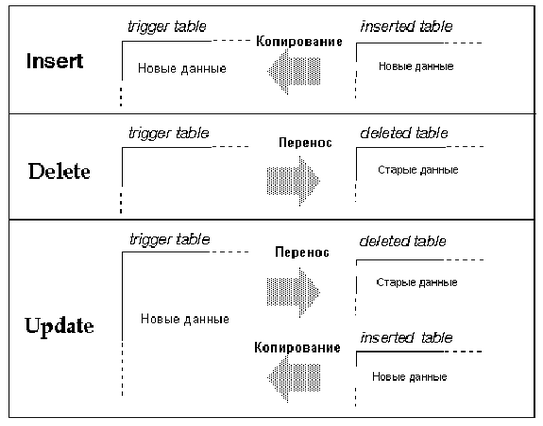

Триггера: поддержка ссылочной целостности
=========================================

::: {.date}
01.01.2007
:::

Триггера: поддержка ссылочной целостности

 

Пользователь может использовать триггера для обеспечения ссылочной
целостности данных в базе. Триггера позволяют также проводить
"каскадное" изменение данных в связанных таблицах, поддерживают более
сложные ограничения целостности данных в таблице по сравнению с
правилами,  позволяют сравнивать модифицированные данные и выполнять
некоторые действия в результате этого сравнения.

В данной главе обсуждаются следующие темы:

 

::: {style="text-align: left; text-indent: 0px; padding: 0px 0px 0px 0px; margin: 0px 0px 0px 113px;"}
  --- -------------------------------
  ·   Дается общий обзор триггеров;
  --- -------------------------------
:::

::: {style="text-align: left; text-indent: 0px; padding: 0px 0px 0px 0px; margin: 0px 0px 0px 113px;"}
  --- ---------------------------------------------
  ·   Показано, как создавать и удалять триггера;
  --- ---------------------------------------------
:::

::: {style="text-align: left; text-indent: 0px; padding: 0px 0px 0px 0px; margin: 0px 0px 0px 113px;"}
  --- --------------------------------------------------------------------------------
  ·   Описываются способы обеспечения целостности данных в базе с помощью триггеров;
  --- --------------------------------------------------------------------------------
:::

::: {style="text-align: left; text-indent: 0px; padding: 0px 0px 0px 0px; margin: 0px 0px 0px 113px;"}
  --- --------------------------------------------
  ·   Показано, как связать правило с триггером;
  --- --------------------------------------------
:::

::: {style="text-align: left; text-indent: 0px; padding: 0px 0px 0px 0px; margin: 0px 0px 0px 113px;"}
  --- -------------------------------------------------------
  ·   Описываются способы получения информации о триггерах.
  --- -------------------------------------------------------
:::

 

::: {style="text-align: left; text-indent: 0px; border-color: #000000; border-style: solid; border-width: 1px; border-top: none; border-right: none; border-left: none; padding: 0px 0px 1px 0px; margin: 0px 0px 1px 21px;"}
  -- ---------------------
     Что такое триггер ?
  -- ---------------------
:::

 

Триггер - это сохраняемая процедура специального вида, которая
запускается в момент модификации данных в таблице. Триггеры помогают
сохранить ссылочную целостность данных пользователя, проверяя их
согласованность в логически связанных таблицах. Ссылочная целостность
означает, что значения главного ключа (primary key) и значение
соответствующего внешнего ключа (foreign key) должны в точности
совпадать.

Основным достоинством триггеров является то, что они вызываются
автоматически. Они будут работать независимо от причины, которая вызвала
модификацию данных, как, например, после ввода данных клерком, так и при
выполнении некоторой прикладной процедуры. Триггер может быть связан с
одним или несколькими операторами модификации, такими как update, insert
или delete. Триггер исполняется один раз в одном SQL операторе.

Триггер "зажигается" (вызывается) только после окончания оператора
модификации данных. После запуска триггера SQL Сервер проверяет условия
целостности модифицированных данных по типу, соответствию правилам и
ограничениям целостности. Триггер и оператор, который вызвал его запуск,
рассматриваются как одна транзакция, в рамках которой триггер может
вызвать восстановление исходных данных (rolled back) при появлении 
ошибки. Другими словами, если в процессе проверки обнаруживается
серьезная ошибка, то вся транзакция откатывается назад (rolled back).

Триггера особенно полезны в следующих ситуациях:

 

::: {style="text-align: left; text-indent: 0px; padding: 0px 0px 0px 0px; margin: 0px 0px 0px 113px;"}
  --- -----------------------------------------------------------------------------------------------------------------------------------------------------------------------------------------------------------------------------------------------------------------------------------------------------------------
  ·   Триггер может "каскадно" вносить изменения во взаимосвязанные таблицы базы данных. Например, удаляющий триггер, связанный со столбцом title\_id таблицы titles, может также удалить соответствующие строки из таблиц titleauthor, sales и roysched, используя значение в столбце title\_id как уникальній ключ;
  --- -----------------------------------------------------------------------------------------------------------------------------------------------------------------------------------------------------------------------------------------------------------------------------------------------------------------
:::

::: {style="text-align: left; text-indent: 0px; padding: 0px 0px 0px 0px; margin: 0px 0px 0px 113px;"}
  --- ------------------------------------------------------------------------------------------------------------------------------------------------------------------------------------------------------------------------------------------------------------------------------------------------------------------------------------------------------------------------------------------------------------------------------------------------------------------------------------------------------------------------------------------------
  ·   Триггер может запретить или "откатить" изменения данных, вызывающие нарушение ссылочной целостности, путем нейтрализации транзакции, которая вносит эти изменения. Такой триггер может запуститься, если пользователь попытается указать значение внешнего ключа, которое не совпадает с главным ключом. Например, пользователь может создать вставляющий триггер, связанный с таблицей titleauthor и откатывающий любые вставки строк, в которых значение в столбце title\_id не совпадает ни с одним из значений в столбце titles.title\_id;
  --- ------------------------------------------------------------------------------------------------------------------------------------------------------------------------------------------------------------------------------------------------------------------------------------------------------------------------------------------------------------------------------------------------------------------------------------------------------------------------------------------------------------------------------------------------
:::

::: {style="text-align: left; text-indent: 0px; padding: 0px 0px 0px 0px; margin: 0px 0px 0px 113px;"}
  --- -------------------------------------------------------------------------------------------------------------------------------------------------------------------------------------------------------------------------------------------------------------------------------------------------
  ·   Триггера могут отслеживать значительно более сложные ограничения по сравнению с правилами. В противоположность правилам, в триггерах можно ссылаться на табличные столбцы и объекты базы данных. Например, триггер может запретить увеличение цены книги, превосходящее один процент от аванса;
  --- -------------------------------------------------------------------------------------------------------------------------------------------------------------------------------------------------------------------------------------------------------------------------------------------------
:::

::: {style="text-align: left; text-indent: 0px; padding: 0px 0px 0px 0px; margin: 0px 0px 0px 113px;"}
  --- ----------------------------------------------------------------------------------------------------------------------------------------------------------------------------------------------------------
  ·   Триггера могут выполнять простейший "что, если" анализ. Например, триггер может сравнить состояние таблицы до и после модификации данных и предпринять некоторое действие, основанное на этом сравнении.
  --- ----------------------------------------------------------------------------------------------------------------------------------------------------------------------------------------------------------
:::

 

В этой главе дается синтаксис определения триггеров, обсуждаются
вопросы, связанные с их использованием, и приводятся примеры триггеров.
В последнем разделе этой главы описываются правила, которых нужно
придерживаться при использовании триггеров, и объясняется как запускать
системные процедуры помощи, дающие информацию о триггерах.

 

Замечание: За исключением триггера deltitle, триггеров, описанных в
данной главе, нет в базе данных pubs2, копия которой поставляется с SQL
Сервером. Чтобы работать с этими триггерами, пользователь должен создать
их с помощью оператора creat trigger. Каждый новый триггер, который
определяется для операции  вставки, обновления или удаления, связанных с
одной и той же таблицей или столбцом, записывается на место предыдущего
без предупреждения и прежний триггер автоматически удаляется.

 

::: {style="text-align: left; text-indent: 0px; border-color: #000000; border-style: solid; border-width: 1px; border-top: none; border-right: none; border-left: none; padding: 0px 0px 1px 0px; margin: 0px 0px 1px 42px;"}
  -- -------------------------------------------------
     Сравнение триггеров с ограничениями целостности
  -- -------------------------------------------------
:::

 

Альтернативой использованию триггеров является введение ограничений
ссылочной целостности в операторе создания таблицы creat table. Однако,
с помощью этих ограничений невозможно решить следующие задачи:

 

::: {style="text-align: left; text-indent: 0px; padding: 0px 0px 0px 0px; margin: 0px 0px 0px 113px;"}
  --- --------------------------------------------------------------------------
  ·   Выполнить "каскадное" изменение данных в связанных таблицах базы данных;
  --- --------------------------------------------------------------------------
:::

::: {style="text-align: left; text-indent: 0px; padding: 0px 0px 0px 0px; margin: 0px 0px 0px 113px;"}
  --- ---------------------------------------------------------------------------------------------------------
  ·   Обеспечить соблюдение сложных ограничений целостности, включающих другие таблицы и объекты базы данных;
  --- ---------------------------------------------------------------------------------------------------------
:::

::: {style="text-align: left; text-indent: 0px; padding: 0px 0px 0px 0px; margin: 0px 0px 0px 113px;"}
  --- ----------------------------------------
  ·   Выполнить анализ "что-если" (what if).
  --- ----------------------------------------
:::

 

Кроме того, ограничения ссылочной целостности не откатывают текущую
транзакцию в результате защиты целостности данных. Триггер может
нейтрализовать изменения, произошедшие в текущей транзакции, или
продолжить ее выполнение в зависимости от того, как пользователь
трактует ссылочную целостность. Информация о транзакциях будет дана в
главе 17 "Транзакции: сохранение корректности данных и их
восстановление".

Если в приложении пользователя требуется выполнить одно из описанных
действий, то ему необходимо использовать триггера. В противном случае,
простейшим способом защиты целостности данных является введение
ограничений ссылочной целостности. Заметим, что SQL Сервер проверяет
справедливость ограничений ссылочной целостности перед запуском любых
триггеров, поэтому оператор модификации данных, который нарушает эти
ограничения, не вызовет запуска триггера. Более детальная информация об
ограничениях ссылочной целостности приводится в главе 7 "Создание баз
данных и таблиц".

 

::: {style="text-align: left; text-indent: 0px; border-color: #000000; border-style: solid; border-width: 1px; border-top: none; border-right: none; border-left: none; padding: 0px 0px 1px 0px; margin: 0px 0px 1px 21px;"}
  -- --------------------
     Создание триггеров
  -- --------------------
:::

 

Триггер является объектом базы данных. Когда создается триггер,
пользователь должен указать таблицу и оператор модификации данных,
которые должны "зажигать" (активизировать) этот триггер. Затем
пользователь указывает действия, которые должен выполнить этот триггер.

Рассмотрим простой пример. Следующий триггер посылает сообщение каждый
раз, когда пользователь пытается вставить, удалить или обновить данные в
таблице titles:

 

create trigger t1

on titles

for insert, update, delete

as

print \"Now modify the titleauthor table the same way.\"

 

::: {style="text-align: left; text-indent: 0px; border-color: #000000; border-style: solid; border-width: 1px; border-top: none; border-right: none; border-left: none; padding: 0px 0px 1px 0px; margin: 0px 0px 1px 42px;"}
  -- ---------------------------------------------------
     Синтаксис команды создания триггера creat trigger
  -- ---------------------------------------------------
:::

 

Полный синтаксис команды создания триггера имеет следующий вид:

 

creat trigger \[владелец.\]название\_триггера

on \[владелец.\]название\_таблицы

for {insert, update, delete}

as SQL\_операторы

 

Можно также определить триггер с помощью предложения if update:

 

creat trigger \[владелец.\]название\_триггера

on \[владелец.\]название\_таблицы

for {insert, update}

as

\[if update (название\_столбца) \[{and \| or} update
(название\_столбца)\] ... \]

      SQL\_операторы

\[if update (название\_столбца) \[{and \| or} update
(название\_столбца)\] ...

       SQL\_операторы\] ...

 

В предложении creat создается триггер и ему присваивается название. Это
название должно удовлетворять правилам, установленным для
идентификаторов.

В предложении on указывается название таблицы, которая активизирует этот
триггер. Эта таблица иногда называется триггерной таблицей.

Триггер создается в текущей базе данных, хотя в нем можно ссылаться на
объекты, расположенные в других базах данных. Владелец триггера должен
быть тем же, что и владелец таблицы. Никто, кроме владельца таблицы, не
может создать для нее триггер. Если явно указывается владелец триггера в
предложении creat trigger (создать триггер), то он также должен быть
явно указан в предложении on как владелец таблицы и наоборот.

В предложении for указываются операторы модификации данных, которые
активизируют триггер при обращении к триггерной таблице. В предыдущем
примере сообщение будет выдаваться при выполнении любого из операторов
insert, update или delete, которые обращаются к таблице titles.

SQL операторы определяют триггерные условия или триггерные действия. В
триггерных условиях задаются дополнительные критерии, которые
определяют, надо ли после выполнения операторов вставки, удаления или
обновления вызывать триггер или нет. Если в предложении if надо
выполнить несколько операторов, то они должны быть заключены в
операторные скобки begin и end.

В предложении if update (если обновление) проверяется, надо ли вставлять
или обновлять данные в указанном табличном столбце. Условие в
предложении if update проверяется на истинность, если название столбца
присутствует в предложении set оператора update, даже в том случае,
когда обновление не изменяет значение в этом столбце. Предложение if
update не используется при удалении данных оператором delete. В этом
предложении можно указать несколько столбцов и в одном операторе
создания триггера можно поместить несколько предложений if update.
Поскольку название таблицы указывается в предложении on, не следует
указывать его перед названием столбца в предложении if update.

 

::: {style="text-align: left; text-indent: 0px; border-color: #000000; border-style: solid; border-width: 1px; border-top: none; border-right: none; border-left: none; padding: 0px 0px 1px 0px; margin: 0px 0px 16px 63px;"}
  -- ----------------------------------------------------
     Операторы, которые нельзя использовать в триггерах
  -- ----------------------------------------------------
:::

 

Поскольку триггера выполняются как части транзакций, следующие операторы
нельзя использовать в определении триггеров:

 

::: {style="text-align: left; text-indent: 0px; padding: 0px 0px 0px 0px; margin: 0px 0px 0px 113px;"}
  --- -----------------------------------------------------------------------------------------------------------------------------------
  ·   Все команды создания объектов, включая создание базы данных, таблицы, индекса, процедуры, умолчания, правила, триггера и вьювера;
  --- -----------------------------------------------------------------------------------------------------------------------------------
:::

::: {style="text-align: left; text-indent: 0px; padding: 0px 0px 0px 0px; margin: 0px 0px 0px 113px;"}
  --- ---------------------------------------
  ·   Все команды удаления объектов (drop);
  --- ---------------------------------------
:::

::: {style="text-align: left; text-indent: 0px; padding: 0px 0px 0px 0px; margin: 0px 0px 0px 113px;"}
  --- ----------------------------------------------------------------------------
  ·   Изменение структуры таблицы или базы данных (alter table, alter database);
  --- ----------------------------------------------------------------------------
:::

::: {style="text-align: left; text-indent: 0px; padding: 0px 0px 0px 0px; margin: 0px 0px 0px 113px;"}
  --- ------------------------------------
  ·   Удаление таблицы (truncate table);
  --- ------------------------------------
:::

::: {style="text-align: left; text-indent: 0px; padding: 0px 0px 0px 0px; margin: 0px 0px 0px 113px;"}
  --- -------------------------
  ·   Команды grant и revoke;
  --- -------------------------
:::

::: {style="text-align: left; text-indent: 0px; padding: 0px 0px 0px 0px; margin: 0px 0px 0px 113px;"}
  --- --------------------------------------------
  ·   Обновление статистики (update statistics);
  --- --------------------------------------------
:::

::: {style="text-align: left; text-indent: 0px; padding: 0px 0px 0px 0px; margin: 0px 0px 0px 113px;"}
  --- -------------------------------
  ·   Реконфигурации (reconfigure);
  --- -------------------------------
:::

::: {style="text-align: left; text-indent: 0px; padding: 0px 0px 0px 0px; margin: 0px 0px 0px 113px;"}
  --- -------------------------------------------------------------------------------
  ·   Загрузки транзакции и загрузки базы данных (load database, load transaction);
  --- -------------------------------------------------------------------------------
:::

::: {style="text-align: left; text-indent: 0px; padding: 0px 0px 0px 0px; margin: 0px 0px 0px 113px;"}
  --- ----------------------------------------------------------------------------------------------
  ·   Команды работы с диском (disk init, disk mirror, disk reinit, disk remirror, disk unmirror);
  --- ----------------------------------------------------------------------------------------------
:::

::: {style="text-align: left; text-indent: 0px; padding: 0px 0px 0px 0px; margin: 0px 0px 0px 113px;"}
  --- -----------------------
  ·   Оператор select into.
  --- -----------------------
:::

 

::: {style="text-align: left; text-indent: 0px; border-color: #000000; border-style: solid; border-width: 1px; border-top: none; border-right: none; border-left: none; padding: 0px 0px 1px 0px; margin: 0px 0px 1px 21px;"}
  -- --------------------
     Удаление триггеров
  -- --------------------
:::

 

Пользователь может удалить триггер с помощью команды удаления (drop) или
путем удаления всей таблицы, с которой он связан.

Команда удаления триггера drop trigger имеет следующий вид:

 

drop trigger \[владелец.\]название\_триггера

    \[, \[владелец.\]название\_триггера\] ...

 

Когда удаляется таблица, то вместе с ней автоматически удаляются любые
связанные с ней триггеры. Команда удаления триггера может выполняться
только владельцем триггерной таблицы, и нельзя передавать права на ее
использование.

 

::: {style="text-align: center; text-indent: 0px; border-color: #000000; border-style: solid; border-width: 1px; border-top: none; border-right: none; border-left: none; padding: 0px 0px 1px 0px; margin: 0px 0px 1px 21px;"}
  -- --------------------------------------------------------------
     Использование триггеров для сохранения ссылочной целостности
  -- --------------------------------------------------------------
:::

 

Триггера используются для сохранения ссылочной целостности данных, т.е.
сохранения жизненно важных свойств данных, таких, например, как
уникальность некоторых идентификаторов, в процессе изменения базы
данных. Ссылочная целостность обеспечивается через главные (primary) и
внешние (foreign) ключи.

Главный ключ - это значение в столбце или комбинация значений в
нескольких столбцах, которая однозначно определяет строку. Эти столбцы
не могут содержать неопределенных значений и с ними должен быть связан
уникальный индекс. Главный ключ таблицы может использоваться для ее
соединения через внешние ключи с другими таблицами. Таблица, содержащая
главный ключ, может рассматриваться как главная (master) таблица, а
связь по ключу, как связь типа главное-детали. В базе данных может быть
много таких групп, состоящих из главной таблицы и ее детализаций.

Пользователь может использовать процедуру sp\_primarykey для определения
главного ключа. После этого ключ добавляется в таблицу syskeys
(системные ключи) и может использоваться в процедуре sp\_helpjoins.

Например, в базе данных pubs2 столбец title\_id является главным ключом
таблицы titles. Значение в этом столбце однозначно идентифицирует книгу
в таблице titles и этот ключ может использоваться для соединения по
столбцу title\_id c таблицами titleauthor, salesdetail и roysched. Таким
образом, в данном случае таблица titles является главной по отношению к
таблицам titleauthor, salesdetail и roysched. Эти взаимосвязи между
таблицами показаны на диаграмме в первой главе "База данных pubs2"
Справочного пособия SQL Сервера.

Внешний ключ - это значение в столбце или комбинация значений в
нескольких столбцах, которая совпадает со значением главного ключа.
Внешний ключ может быть не уникальным. Обычно они находятся в
соответствии многие-к-одному по отношению к значению главного ключа.
Значения внешнего ключа должны быть копией значений главного ключа. Это
означает, что любое значение внешнего ключа должно содержаться среди
значений главного ключа. Внешний ключ может содержать неопределенные
значения. Если какая-либо составная часть внешнего ключа является
неопределенной, то и полное значение внешнего ключа должно быть
неопределенным. Таблицы с внешними ключами часто называются
детализациями или зависимыми таблицами по отношению к главной таблице.

Пользователь может использовать процедуру sp\_foreignkey для определения
внешних ключей в базе данных. Это позволяет использовать их в процедуре
sp\_helpjoins и в других процедурах, которые обращаются к таблице
syskeys.

Таким образом, столбец title\_id в таблицах titleauthor, salesdetail и
roysched является внешним ключом, а сами эти таблицы являются
детализациями главной таблицы.

 

::: {style="text-align: left; text-indent: 0px; border-color: #000000; border-style: solid; border-width: 1px; border-top: none; border-right: none; border-left: none; padding: 0px 0px 1px 0px; margin: 0px 0px 1px 42px;"}
  -- -----------------------
     Как работают триггера
  -- -----------------------
:::

 

Триггеры для обеспечения ссылочной целостности запоминают значения
внешних ключей вместе со значением главного ключа. После модификации
ключевого значения триггер сравнивает новое значение со связанными с ним
ключевыми значениями с помощью временных таблиц, которые называются
триггерными тестовыми таблицами (trigger test tables). Если пользователь
определил свой триггер, то его данные будут сравниваться с данными,
которые временно запоминаются в тестовых таблицах.

 

::: {style="text-align: left; text-indent: 0px; border-color: #000000; border-style: solid; border-width: 1px; border-top: none; border-right: none; border-left: none; padding: 0px 0px 1px 0px; margin: 0px 0px 1px 42px;"}
  -- -----------------------------------------------------------
     Проверка модификации данных и триггерные тестовые таблицы
  -- -----------------------------------------------------------
:::

 

При вызове триггеров используются две специальные таблицы: таблица
удаления (deleted table) и таблица добавления (inserted table). Они
используются для проверки операторов модификации данных и создания
условий для работы триггеров. Пользователь не может непосредственно
изменять данные в этих таблицах, но может использовать находящуюся в них
информацию для проверки последствий выполнения операторов insert, update
или delete.

 

::: {style="text-align: left; text-indent: 0px; padding: 0px 0px 0px 0px; margin: 0px 0px 0px 114px;"}
  --- -------------------------------------------------------------------------------------------------------------------------------------------------------------------------------------------------------------------------------------------------------------------------------
  ·   В таблице удаления сохраняются копии строк, которые удаляются операторами update или delete. В процессе выполнения этих операторов строки удаляются из триггерной таблицы и помещаются в таблицу удаления. Обычно триггерная таблица и таблица удаления не имеют общих строк.
  --- -------------------------------------------------------------------------------------------------------------------------------------------------------------------------------------------------------------------------------------------------------------------------------
:::

::: {style="text-align: left; text-indent: 0px; padding: 0px 0px 0px 0px; margin: 0px 0px 0px 114px;"}
  --- --------------------------------------------------------------------------------------------------------------------------------------------------------------------------------------------------------------------------------------------------------------------------------------------------------------------------------------------
  ·   В таблице добавления сохраняются копии строк, которые вставляются операторами insert или update. В процессе выполнения этих операторов новые строки вставляются в таблицу добавления и триггерную таблицу одновременно. Таким образом,  таблица добавления всегда содержит копии новых строк, которые были добавлены в триггерную таблицу.
  --- --------------------------------------------------------------------------------------------------------------------------------------------------------------------------------------------------------------------------------------------------------------------------------------------------------------------------------------------
:::

 
:::{.center}

Рис. 15-1: Использование триггерных тестовых таблиц при изменении данных
:::
 

При установке условий запуска триггера следует использовать  проверочную
таблицу, которая соответствует оператору модификации данных. Хотя,
вообще говоря, можно обратиться к таблице удаления в процессе проверки
оператора insert или к таблице добавления в процессе проверки оператора
delete, но в этих случаях эти таблицы будут пусты.

 

Замечание: Каждый триггер запускается только один раз в процессе
выполнения запроса. Поэтому, если действия триггера зависят от числа
модифицируемых строк, то нужно обратиться к глобальной переменной
@\@rowcount и выполнить для каждой строки соответствующую проверку.

 

В следующем примере триггера как раз проводится проверка, где это
необходимо, всех модифицированных строк. Глобальная переменная
@\@rowcount, в которой хранится число строк, модифицированных последним
оператором insert delete или update, используется для проверки
корректности всех модифицированных строк. Если в триггере используется
еще один оператор выбора до того как проверяется значение переменной
@\@rowcount, то ее значение следует запомнить в локальной переменной,
поскольку любой Transact-SQL оператор, который не возвращает никакого
значения сбрасывает переменную @\@rowcount в ноль.

 

::: {style="text-align: left; text-indent: 0px; border-color: #000000; border-style: solid; border-width: 1px; border-top: none; border-right: none; border-left: none; padding: 0px 0px 1px 0px; margin: 0px 0px 1px 42px;"}
  -- ------------------------------
     Пример вставляющего триггера
  -- ------------------------------
:::

 

Когда добавляется строка в таблицу с внешним ключом, то необходимо
убедиться, что заданное значение внешнего ключа встречается среди
значений главного ключа. Триггер может проверить это условие путем
соединения добавляемых строк с исходной таблицей, содержащей главный
ключ, с последующим откатом добавления в случае несовпадения этих
значений. В следующем примере отменяются любые изменения, производимые
оператором insert в случае нарушения условия согласованности ключей хотя
бы в одной строке. Позже будет показано как отменять изменения
выборочно.

При выполнении оператора insert новые строки добавляются в триггерную
таблицу и в триггерную тестовую таблицу добавления. Для проверки
совпадения добавленных ключей с главными ключами, образуется соединение
между таблицей добавления и главной таблицей (с главными ключами).

Следующий триггер сравнивает значения в столбце title\_id таблицы
добавления со значениями в одноименном столбце таблицы titles.
Предполагается, что пользователь указал для внешнего ключа некоторое
непустое значение. Если соединение не может быть выполнено, то
транзакция откатывается назад.

 

create trigger forinsertrig1

on salesdetail

for insert

as

if (select count(\*)

   from titles, inserted

   where titles.title\_id = inserted.title\_id) != @\@rowcount

/\* cancel the insert and print a message.\*/

begin

   rollback transaction

   print \"No, a title\_id does not exist in titles\"

end 

/\* Otherwise, allow it. \*/   

else

print \"Added! All title\_id\'s exist in titles.\"

 

В этом примере глобальная переменная @\@rowcount указывает число
добавляемых строк в таблицу salesdetail. Ее значение также совпадает с
числом строк вставленных в таблицу добавление. Проверка наличия всех
значений ключа из столбца title\_id, добавленных в таблицу salesdetail,
в таблице titles осуществляется путем соединения таблицы titles и
таблицы добавления. Если число соединенных строк, которые подсчитываются
в операторе select count(\*), отличается от значения переменной
@\@rowcount, то некоторые из добавленных строк были неправильными и
поэтому все изменения, произведенные этой транзакцией, будут отменены.

Этот триггер выдает сообщение об ошибке в случае отката и об успешном
завершении транзакции, если все строки правильные.

 

::: {style="text-align: left; text-indent: 0px; border-color: #000000; border-style: solid; border-width: 1px; border-top: none; border-right: none; border-left: none; padding: 0px 0px 1px 0px; margin: 0px 0px 1px 42px;"}
  -- ----------------------------
     Пример удаляющего триггера
  -- ----------------------------
:::

 

Когда удаляется строка, содержащая значение главного ключа, то
необходимо также удалить все строки в зависимых таблицах, которые
содержат то же значение внешнего ключа. Это позволяет сохранить
ссылочную целостность, поскольку детализирующие строки удаляются вместе
с главной строкой. Если этого не сделать, то в базе данных могут
появиться недоступные или лишние строки. Для выполнения этой задачи
необходим триггер, который осуществляет каскадное удаление.

Рассмотрим следующий пример. Когда из таблицы titles удаляются несколько
строк, то после удаления они добавляются в таблицу удаления. Триггер
может проверить зависимые таблицы titleauthor, salesdetail и roysched на
наличие строк со значением удаляемого ключа в столбце title\_id. Если
триггер найдет такую строку, то он удаляет ее.

 

create trigger delcascadetrig

on titles

for delete

as

delete titleauthor

from titleauthor, deleted

where titleauthor.title\_id = deleted.title\_id

       /\* Remove titleauthor rows

       \*\* that match deleted (titles) rows.\*/

delete salesdetail

from salesdetail, deleted

where salesdetail.title\_id = deleted.title\_id

       /\* Remove salesdetail rows

       \*\* that match deleted (titles) rows.\*/

delete roysched

from roysched, deleted

where roysched.title\_id = deleted.title\_id

       /\* Remove roysched rows

       \*\* that match deleted (titles) rows.\*/

 

На практике может возникнуть ситуация, когда необходимо сохранить
некоторые из детализирующих строк. Такая необходимость может возникнуть
по историческим причинам (например, чтобы проверить, сколько было
продано  давно изданных книг) или потому, что транзакции с
детализирующими строками еще не были полностью выполнены. Хорошо
написанный триггер должен учитывать эти факторы.

В следующем примере триггер deltitle, поставляемый вместе с базой данных
pubs2, предотвращает удаление строки с главным ключом, если значение
этого ключа встречается в таблице salesdetail. Таким образом, этот
триггер сохраняет возможность последующего выбора строк из таблицы
salesdetail.

 

create trigger deltitle

on titles

for delete

as

if (select count(\*)

   from deleted, salesdetail

   where salesdetail.title\_id =

   deleted.title\_id) \> 0

begin

   rollback transaction

   print \"You can\'t delete a title with sales.\"

end

 

Этот триггер соединяет удаляемые из таблицы строки titles строки с
таблицей salesdetail. Если произошло хотя бы одно соединение, то
транзакция откатывается.

 

::: {style="text-align: left; text-indent: 0px; border-color: #000000; border-style: solid; border-width: 1px; border-top: none; border-right: none; border-left: none; padding: 0px 0px 1px 0px; margin: 0px 0px 1px 42px;"}
  -- -------------------------------
     Примеры обновляющих триггеров
  -- -------------------------------
:::

 

Поскольку значения главного ключа являются уникальными, то к обновлению
этих значений нужно подходить очень внимательно. В этом случае для
сохранения ссылочной целостности допускаются лишь транзакции,
удовлетворяющие определенным условиям.

Вообще говоря, лучше всего запретить любое редактирование значений
главного ключа путем, например, отмены всех прав на этот столбец. Но
если необходимо в некоторых случаях разрешить обновление, то следует
использовать триггер.

В следующем примере триггер запрещает обновления в столбце таблицы
titles.title\_id в конце недели (суббота и воскресенье). Предложение if
update триггера stopupdatetrig позволяет перенести фокус внимания на
столбец titles.title\_id. Поэтому данный триггер будет запускаться при
попытке обновления значений в этом столбце. Изменения значений в других
столбцах не будут приводить к запуску. Когда триггер определит, что
нарушены условия обновления, он запрещает изменения и выдает сообщение.
Это можно проверить просто записав текущий день недели вместо "Saturday"
(суббота) или "Sunday" (воскресенье).

 

create trigger stopupdatetrig

on titles

for update

as

/\* If an attempt is made to change titles.title\_id

\*\* on Saturday or Sunday, cancel the update.

\*/

if update (title\_id)

   and datename(dw, getdate())

   in (\"Saturday\", \"Sunday\")

begin

   rollback transaction

   print \"We don\'t allow changes to\"

   print \"primary keys on the weekend!\"

end

 

Пользователь может с помощью триггера реагировать на обновление данных в
нескольких столбцах. В следующем примере приводится модифицированный
триггер stopupdatetrig, который реагирует также на обновление данных в
столбцах titles.price и titles.advance. Кроме запрещения обновления
главного ключа в конце недели, этот триггер также запрещает обновление
цены книги или выданного аванса, если общий доход от продажи этой книги
меньше величины аванса. Для этого триггера можно использовать то же
название, поскольку в этом случае прежний триггер автоматически
удаляется.

 

create trigger stopupdatetrig

on titles

for update

as

if update (title\_id)

and datename(dw, getdate())

in (\"Saturday\", \"Sunday\")

begin

   rollback transaction

   print \"We don\'t allow changes to\"

   print \"primary keys on the weekend!\"

end

if update (price) or update (advance)

if (select count(\*) from inserted

   where (inserted.price \* inserted.total\_sales)

   \< inserted.advance) \> 0

   begin

     rollback transaction

     print \"We don\'t allow changes to price or\"

     print \"advance for a title until its total\"

     print \"revenue exceeds its latest advance.\"

   end

 

::: {style="text-align: left; text-indent: 0px; border-color: #000000; border-style: solid; border-width: 1px; border-top: none; border-right: none; border-left: none; padding: 0px 0px 1px 0px; margin: 0px 0px 16px 63px;"}
  -- ---------------------------
     Обновление внешнего ключа
  -- ---------------------------
:::

 

Изменение или обновление значения внешнего ключа само по себе, скорее
всего, свидетельствует об ошибке. Значения внешнего ключа всегда должны
быть копиями значений главного ключа. Эти значения никогда не должны
изменяться независимо друг от друга. Если по каким-то причинам нужно
обновить значение внешнего ключа, то для сохранения ссылочной
целостности необходимо определить триггер, который бы проверял значение
ключа по таблице master и отменял бы изменение, если новое значение
ключа не соответствует значению главного ключа.

В следующем примере триггер проверяет два возможных источника ошибок:
либо обновляемое значение не встречается в столбце title\_id таблицы
salesdetail, либо нового значения ключа нет в таблице titles.

В этом примере используется составной оператор if...else. Первое условие
в операторе if будет истинным, если ни одна строка таблицы salesdetail
не удовлетворяет условию, указанному в предложении where оператора
update, и следовательно в этом случае оператор выбора select выдаст
пустой список. Если при этой проверке был выдан непустой список, то
выполняется второй условный оператор, который проверяет встречаются ли
новые значения ключа, находящиеся в строках таблицы inserted, в таблице
titles. Если при соединении таблиц inserted и titles по столбцу
title\_id хотя бы одна строка не удовлетворяет условию соединения, то
транзакция откатывается и выдается сообщение об ошибке. Если все строки
удовлетворяют условию соединения, то выдается сообщение об успешном
обновлении таблицы salesdetail.

 

create trigger forupdatetrig

on salesdetail

for update

as

declare \@row int

/\* save value of rowcount \*/

select \@row = @\@rowcount 

if update (title\_id)

begin

   if (select distinct inserted.title\_id

       from inserted) is null

     begin

       rollback transaction

       print \"No!  Old title\_id must be in

             salesdetail\"

     end

   else

     if (select count(\*)

         from titles, inserted

         where titles.title\_id =

         inserted.title\_id) != \@row

       begin

         rollback transaction

         print \"No! New title\_id not in titles\"

       end

     else

       print \"salesdetail table updated\"

end

 

::: {style="text-align: left; text-indent: 0px; border-color: #000000; border-style: solid; border-width: 1px; border-top: none; border-right: none; border-left: none; padding: 0px 0px 1px 0px; margin: 0px 0px 1px 21px;"}
  -- ---------------------------
     Операции с группами строк
  -- ---------------------------
:::

 

Иногда бывает важно различать запросы, выдающие одну строку и более
одной строки (группу строк). Это особенно важно, когда триггер должен
автоматически перевычислять итоговые значения.

Триггер, использующийся для вычисления итоговых значений, должен
содержать предложение group by или подзапросы, которые выполняют неявную
группировку, когда вставляется, обновляется или удаляется более одной
строки. Поскольку группировка занимает дополнительные ресурсы, то в
следующем примере проверяется равна ли единице величина переменной
@\@rowcount, чтобы специально выделить случай, когда запрос обрабатывает
только одну строку в триггерной таблице. Если значение переменной
@\@rowcount равно единице, то триггер выполняет свои действия без
группировки.

В этом примере вставляющий триггер обновляет значение в столбце
total\_sales таблицы titles каждый раз, когда добавляется новая строка к
таблице salesdetail. При этом значение в столбце total\_sales
устанавливается равным прежнему значению плюс значение, указанное в
столбце salesdetail.qty. Это позволяет своевременно обновлять итоговое
значение продаж и поддерживать его соответствующим числу продаж,
указанных в столбце salesdetail.qty.

 

create trigger intrig

on salesdetail

for insert as

   /\* check value of @\@rowcount \*/

if @\@rowcount = 1

   update titles

     set total\_sales = total\_sales + qty

     from inserted

     where titles.title\_id = inserted.title\_id

else

   /\* when rowcount is greater than 1,

      use a group by clause \*/

   update titles

     set total\_sales =

       total\_sales + (select sum(qty)

     from inserted

     group by inserted.title\_id

     having titles.title\_id = inserted.title\_id)

 

 

В следующем примере удаляющий триггер обновляет значение в столбце
total\_sales таблицы titles каждый раз, когда удаляется одна или
несколько строк из таблицы salesdetail.

 

create trigger deltrig

on salesdetail

for delete

as

   /\* check value of @\@rowcount \*/

if @\@rowcount = 1

   update titles

     set total\_sales = total\_sales - qty

     from deleted

     where titles.title\_id = deleted.title\_id

else

   /\* when rowcount is greater than 1,

      use a group by clause \*/

   update titles

     set total\_sales =

       total\_sales - (select sum(qty)

     from deleted

     group by deleted.title\_id

     having titles.title\_id = deleted.title\_id)

 

 

Этот триггер запускается всякий раз, когда происходит удаление строк из
таблицы salesdetail. Он устанавливает значение в столбце total\_sales,
равным прежнему значению минус сумма значений в удаляемых строках по
столбцу salesdetail.qty.

В следующем примере обновляющий триггер обновляет значение в столбце
total\_sales таблицы titles каждый раз, когда обновляется значение в
столбце qty таблицы salesdetail. Напомним, что обновление - это
добавление, за которым следует удаление. Поэтому этот триггер обращается
как к тестовой таблице inserted, так и к тестовой таблице deleted.

 

create trigger updtrig

on salesdetail

for update

as

if update (qty)

begin

   /\* check value of @\@rowcount \*/

   if @\@rowcount = 1

       update titles

         set total\_sales = total\_sales +

           inserted.qty - deleted.qty

         from inserted, deleted

         where titles.title\_id = inserted.title\_id

         and inserted.title\_id = deleted.title\_id

   else

   /\* when rowcount is greater than 1,

      use a group by clause \*/

   begin

       update titles

         set total\_sales = total\_sales +

           (select sum(qty)

               from inserted

               group by inserted.title\_id

               having titles.title\_id =

               inserted.title\_id)

       update titles

         set total\_sales = total\_sales -

           (select sum(qty)

               from deleted

               group by deleted.title\_id

               having titles.title\_id =

               deleted.title id)

   end

end

 

::: {style="text-align: left; text-indent: 0px; border-color: #000000; border-style: solid; border-width: 1px; border-top: none; border-right: none; border-left: none; padding: 0px 0px 1px 0px; margin: 0px 0px 1px 42px;"}
  -- ------------------------------
     Условный вставляющий триггер
  -- ------------------------------
:::

 

Триггера, которые рассматривались до сих пор, трактовали каждый оператор
модификации данных в целом. Другими словами, если одна или четыре
вставляемые строки были неверными, то весь оператор трактовался как
неправильный, и вся транзакция откатывалась.

Однако, вообще говоря, не обязательно отменять все модифицируемые
данные, если некоторые из них являются неверными. Используя в триггере
коррелирующиеся подзапросы, можно проверять модифицируемые строк одну за
другой. Напомним, что коррелирующиеся подзапросы рассматривались в главе
5 "Подзапросы: Использование запросов внутри других запросов". В этом
случае триггер может отделить правильные строки от неправильных.

В следующем примере триггера предполагается существование таблицы
newsales. Эта таблица создается с помощью следующего оператора:

 

create table newsales

(stor\_id    char(4)     not null,

ord\_num     varchar(20) not null,

title\_id    tid         not null,

qty         smallint    not null,

discount    float       not null)

 

В эту таблицу нужно записать четыре строки, чтобы проверить действие
условного триггера. В двух из этих строк записаны коды книг в столбце
title\_id, которые не совпадают ни с одним из таких кодов в таблице
titles. Ниже приводятся данные, расположенные в этой таблице:

 

newsales

stor\_id  ord\_num    title\_id        qty     discount

\-\-\-\-\-\-- \-\-\-\-\-\-\-\-\--  \-\-\-\-\-\-\-\--       \-\-\--   
\-\-\-\-\-\-\-\--

 

7066    BA27619     PS1372         75    40.000000

7066    BA27619     BU7832       100    40.000000

7067    NB-1.242    PSxxxx          50    40.000000

7131    Asoap433    PSyyyy          50    40.000000

 

Для перемещения данных из таблицы newsales в таблицу salesdetail можно
использовать следующий оператор:

 

insert salesdetail

select \* from newsales

 

Предположим, что пользователь хочет проверить каждую из добавляемых
строк. Триггер conditionalinsert, приводимый ниже, анализирует каждую из
добавляемых строк одну за другой и удаляет те строки, которые содержат
неправильный код книги в столбце title\_id. Этот триггер имеет следующий
вид:

 

create trigger conditionalinsert

on salesdetail

for insert as

if

(select count(\*) from titles, inserted

where titles.title\_id = inserted.title\_id)

   != @\@rowcount

begin

delete salesdetail from salesdetail, inserted

   where salesdetail.title\_id = inserted.title\_id

   and inserted.title\_id not in

   (select title\_id from titles)

print \"Only records with matching title\_ids

   added.\"

end

 

Этот триггер осуществляет по существу ту же проверку, что и триггер
intrig, но транзакция при этом не откатывается. Вместо этого триггер
просто удаляет из таблицы неправильные строки. Таким образом, когда
триггер запускается он может изменить порядок обработки данных и удалить
строки, которые уже вставлены. Сначала строки вставляются в основную
таблицу и в таблицу inserted, а затем запускается триггер.

 

::: {style="text-align: left; text-indent: 0px; border-color: #000000; border-style: solid; border-width: 1px; border-top: none; border-right: none; border-left: none; padding: 0px 0px 1px 0px; margin: 0px 0px 1px 21px;"}
  -- -----------------------
     Откатывающие триггера
  -- -----------------------
:::

 

Пользователь может с помощью триггера выполнить откат (roll back),
используя либо оператор rollback trigger (откатить триггер), либо
оператор rollback transaction (если триггер запускается как часть
транзакции). Однако, оператор rollback trigger отменяет действие только
оператора, запустившего этот триггер, в то время как оператор rollback
transaction (откатить транзакцию) отменяет всю транзакцию. Например:

 

begin tran

insert into publishers (pub\_id) values (\'9999\')

insert into publishers (pub\_id) values (\'9998\')

commit tran

 

Если второй оператор вставки запускает триггер, связанный с таблицей
publisher, который выдает команду rollback trigger, то откатывается лишь
второй оператор вставки, а первая вставка отстанется в таблице. Если же
этот триггер выдаст команду rollback transaction, то откатываются оба
оператора вставки как части одной транзакции.

Оператор rollback trigger имеет следующий вид:

 

rollback trigger

   \[with raiserror\_оператор\]

 

Синтаксис оператора rollback transaction описывается в главе 17
"Транзакции: сохранение целостности данных и восстановление".

В операторе сигнализации ошибки указывается оператор raiserror
(возникновение ошибки), который выдает сообщение об ошибке, определенное
пользователем, и устанавливает системный флаг, сигнализирующий о
возникновении ошибочной ситуации. Это позволяет сообщить клиенту о
возникновении ошибки, когда выполняется оператор rollback trigger, и
передать информацию о виде ошибки. Например:

 

rollback trigger with raiserror 25002

   \"title\_id does not exist in titles table.\"

 

Дополнительную информацию об операторе raiserror можно найти в главе 13
"Использование пакетов и язык управления заданиями".

Когда исполняется оператор rollback trigger, SQL Сервер прерывает
исполнение текущей команды и прекращает выполнение команд триггера. Если
триггер, выдавший команду rollback trigger, был вызван из другого
триггера (более высокого уровня), то SQL Сервер отменяет (откатывает)
результаты всей работы, выполненной этими триггерами, включая оператор
обновления, который запустил первый триггер (более высокого уровня).

В следующем примере вставляющий триггер выполняет функцию, аналогичную
ранее описанной в триггере forinsertrig1. Однако в этом триггере
используется команда rollback trigger вместо команды rollback
transaction, чтобы откатывался только оператор вставки, а не вся
транзакция.

 

create trigger forinsertrig2

on salesdetail

for insert

as

if (select count(\*) from titles, inserted

   where titles.title\_id = inserted.title\_id) !=

   @\@rowcount

  rollback trigger with raiserror 25003

    \"Trigger rollback: salesdetail row not added

    because a title\_id does not exist in titles.\"

 

Если триггер, содержащий команду rollback transaction, исполняется в
пакете, то в случае отката прекращается выполнение всего пакета. В
следующем примере оператор вставки запускает триггер, содержащий команду
rollback transaction (как и триггер forinsertrig1), поэтому в случае
отката оператор удаления не будет выполняться, поскольку выполнение
команд в пакете будет прекращено:

 

insert salesdetail values (\"7777\", \"JR123\",

   \"PS9999\", 75, 40)

delete salesdetail where stor\_id = \"7067\"

 

Если триггер, содержащий команду rollback transaction, исполняется в
транзакции, заданной пользователем (user-defined transaction), то
команда rollback transaction отменяет результаты работы всего пакета. В
следующем примере оператор вставки запускает триггер, содержащий команду
rollback transaction, поэтому результаты работы оператора обновления
также будут отменены:

 

begin tran

update stores set payterms = \"Net 30\"

   where stor\_id = \"8042\"

insert salesdetail values (\"7777\", \"JR123\",

   \"PS9999\", 75, 40)

 

В главе 17 "Транзакции: сохранение корректности данных и их
восстановление" дается информации о транзакциях, определенных (заданных)
пользователями.

SQL Сервер игнорирует команду rollback trigger, если она расположена вне
тела триггера и не выполняет связанную с ним команду raiserror. Однако
команда rollback trigger будет выполняться, если она расположена вне
триггера, но внутри трианзакции. При этом SQL Сервер откатывает
транзакцию и прекращает выполнение текущего оператора пакета.

 

::: {style="text-align: left; text-indent: 0px; border-color: #000000; border-style: solid; border-width: 1px; border-top: none; border-right: none; border-left: none; padding: 0px 0px 1px 0px; margin: 0px 0px 1px 21px;"}
  -- ---------------------------------
     Многоуровневые вызовы триггеров
  -- ---------------------------------
:::

 

Триггера могут иметь до 16 уровней по глубине вложенности вызовов.
Количество уровней определяется при инсталляции. Системный администратор
может либо разрешить, либо запретить многоуровневые триггера с помощью
процедуры sp\_configure (конфигурация). Чтобы запретить
многоуровневость, нужно выполнить команду:

 

sp\_configure "allow nested triggers", 0

 

Если разрешен многоуровневый вызов триггеров, то триггер, изменяющий
таблицу, может запустить триггер на втором уровне, а тот в свою очередь
триггер на третьем уровне и т.д. Если какой-либо триггер в этой цепочке
запустит один из предшествующих триггеров, то возникнет бесконечный
цикл, который в конце концов приведет к превышению допустимого уровня
вложенности и выполнение всей цепочки будет прекращено. Многоуровненвые
триггера полезны при выполнении вспомогательных функций таких, как
сохранение копий строк, которые были изменены предшествующим триггером.

Например, можно создать триггер для таблицы titleauthor, который создает
резервную копию строк, которые были удалены триггером delcascadetrig.
Когда триггер delcascadetrig удаляет из таблицы titles, например, книгу
с кодом "PS2091", то он также удаляет этот код из таблицы titleauthor.
Чтобы сохранить этот код, можно создать удаляющий триггер для таблицы
titleauthor, который сохраняет удаленные строки в другой таблице
del\_save:

 

create trigger savedel

on titleauthor

for delete

as

insert del\_save

select \* from deleted

 

Нежелательно, чтобы использование многоуровневых триггеров зависело от
порядка их вызова. Следует использовать отдельные триггеры при каскадной
модификации данных, как это было показано в примере с триггером
delcascadetrig.

 

Замечание: Если триггеры находятся внутри транзакции, то ошибка,
произошедшая на любом уровне (включая превышение допустимого уровня
вложенности) вызывает прекращение выполнения всей транзакции. При этом
все произошедшие изменения данных будут откачены (отменены). Поэтому
следует предусматривать в триггерах операторы print или raiseerror,
чтобы определить, где произошла ошибка.

 

Оператор rollback transaction, исполняющийся в триггере на любом уровне,
откатывает изменения, сделанные всеми триггерами, и прекращает
выполнение всей транзакции. Оператор rollback trigger касается только
вложенных триггеров и оператора изменения данных, который запустил
первый триггер цепочки.

 

::: {style="text-align: left; text-indent: 0px; border-color: #000000; border-style: solid; border-width: 1px; border-top: none; border-right: none; border-left: none; padding: 0px 0px 1px 0px; margin: 0px 0px 1px 42px;"}
  -- --------------------------
     Саморекурсивные триггера
  -- --------------------------
:::

 

По умолчанию триггера не вызывают сами себя рекурсивным образом. Другими
словами, обновляющий триггер не вызывает сам себя в ответ на обновление
этой таблицы самим триггером. Если обновляющий триггер вызывается при
обновлении некоторого столбца таблицы и сам обновляет значение в другом
столбце, то второй раз он уже не вызывается. Однако пользователь может
включить опцию self\_recursion (саморекурсия) командой set (установить),
что позволяет триггерам вызывать себя рекурсивно. Для саморекурсии
необходимо также, чтобы была включена конфигурационная переменная nested
triggers (допустить многоуровневые триггера).

Установка опции self\_recursion остается в силе только в течении
текущего сеанса работы. Если эта опция устанавливается в теле триггера,
то она действует только для триггера, в котором была установлена. Если
триггер, в котором была установлена эта опция, завершается или запускает
другой триггер, то опция self\_recursion выключается. Триггер, в котором
была установлена опция self\_recursion, может многократно запускать сам
себя, если производмые им изменения, приводят к его повторному запуску,
но в любом случае глубина вложенности этих самозапусков не должна
превышать 16.

Для примера предположим, что в базе данных pubs2 существует следующая
таблица new\_budget:

 

select \* from new\_budget

unit                  parent\_unit       budget

\-\-\-\-\-\-\-\-\-\-\-\-\-\--    \-\-\-\-\-\-\-\-\-\-\-\--    
\-\-\-\-\-\--

 

one\_department  one\_division          10

one\_division        company\_wide    100

company\_wide     NULL             1000

 

(3 rows affected)

 

Можно создать следующий триггер, который будет рекурсивно обновлять
таблицу new\_budget, когда изменяются данные в столбце budget:

 

create trigger budget\_change

on new\_budget

for update as

if exists (select \* from inserted

           where parent\_unit is not null)

begin

   set self\_recursion on

   update new\_budget

   set new\_budget.budget = new\_budget.budget +

       inserted.budget - deleted.budget

   from inserted, deleted, new\_budget

   where new\_budget.unit = inserted.parent\_unit

       and new\_budget.unit = deleted.parent\_unit

end

 

Если пользователь обновляет данные в столбце new\_budget.budget,
увеличив на три его значения на уровне отдела (one\_department), то SQL
Сервер будет выполнять следующие действия (при условии, что разрешены
многоуровневые триггера):

 

::: {style="text-align: left; text-indent: 0px; padding: 0px 0px 0px 0px; margin: 0px 0px 0px 114px;"}
  ---- -------------------------------------------------------------------------------------------------------------
  1.   Увеличивает на три значение бюджета с 10 до 13 в строке one\_department и запускает триггер budget\_change;
  ---- -------------------------------------------------------------------------------------------------------------
:::

::: {style="text-align: left; text-indent: 0px; padding: 0px 0px 0px 0px; margin: 0px 0px 0px 114px;"}
  ---- ---------------------------------------------------------------------------------------------------------------------------------------------
  2.   Триггер обновляет значение бюджета для вышестоящего подразделения (в данном случае one\_division) со 100 на 103 и вновь запускает сам себя;
  ---- ---------------------------------------------------------------------------------------------------------------------------------------------
:::

::: {style="text-align: left; text-indent: 0px; padding: 0px 0px 0px 0px; margin: 0px 0px 0px 114px;"}
  ---- -------------------------------------------------------------------------------------------------------------------------------------------------------
  3.   Триггер вновь обновляет значение бюджета для вышестоящей структуры (в данном случае company\_wide) со 1000 на 1003 и в третий раз запускает сам себя;
  ---- -------------------------------------------------------------------------------------------------------------------------------------------------------
:::

::: {style="text-align: left; text-indent: 0px; padding: 0px 0px 0px 0px; margin: 0px 0px 0px 114px;"}
  ---- -------------------------------------------------------------------------------------------------------------------------------------------------------------------------------------------------------------------------------------------------------------------------------------------------------------------------
  4.   Теперь триггер пытается найти строку соответствующую вышестоящей структуре для всей компании (company\_wide), но поскольку такой не существует (соответствующее поле равно NULL), то следующего обновления не происходит и саморекурсия прекращается. Заключительное состояние таблицы new\_budget имеет следующий вид:
  ---- -------------------------------------------------------------------------------------------------------------------------------------------------------------------------------------------------------------------------------------------------------------------------------------------------------------------------
:::

 

select \* from new\_budget

unit                   parent\_unit     budget

\-\-\-\-\-\-\-\-\-\-\-\-\-\-- \-\-\-\-\-\-\-\-\-\-\-\-\-\--    
\-\-\-\-\-\--

 

one\_department  one\_division        13

one\_division       company\_wide    103

company\_wide    NULL                 1003

 

(3 rows affected)

 

Триггер может запускать себя рекурсивно и другими способами. Например,
триггер может вызвать сохраненную процедуру, которая своими действиями
приводит к запуску этого триггера (при условии допустимости вложенных
запусков). Если в этом триггере не предусмотрено условия, которое
ограничивает число рекурсий, то произойдет превышение допустимого уровня
вложенности запусков.

Например, если обновляющий триггер вызывает сохраненную процедуру,
которая выполняет обновление, то триггер и процедура исполняться ровно
один раз, если выключена опция nested triggers (многоуровневые
триггера). Если она включена, и отсутствует условие,  ограничивающее 
число обновлений в триггере или процедуре 16-ю, то цикл, состоящий из
поочередных вызовов триггера и процедуры, будет продолжаться до тех пор,
пока не будет превышен порог в 16 уровней.

 

::: {style="text-align: left; text-indent: 0px; border-color: #000000; border-style: solid; border-width: 1px; border-top: none; border-right: none; border-left: none; padding: 0px 0px 1px 0px; margin: 0px 0px 1px 21px;"}
  -- --------------------------------
     Правила связанные с триггерами
  -- --------------------------------
:::

 

Таким образом, при создании триггеров нужно обращать внимание на
мультистрочные изменения данных, откат триггеров и их многоуровневые
запуски. Кроме того, имеются также другие факторы, которые требуют
внимания со стороны пользователя.

 

::: {style="text-align: left; text-indent: 0px; border-color: #000000; border-style: solid; border-width: 1px; border-top: none; border-right: none; border-left: none; padding: 0px 0px 1px 0px; margin: 0px 0px 1px 42px;"}
  -- --------------------------
     Триггера и права доступа
  -- --------------------------
:::

 

Триггер связывается с определенной таблицей. Только владелец таблицы
имеет права на выполнение команд create trigger и drop trigger. Эти
права нельзя передавать другим лицам.

SQL Сервер допускает создание триггеров, в которых используются команды,
на которые у пользователя нет разрешения. Существование такого триггера
блокирует всевозможные последующие попытки модификации триггерной
таблицы, поскольку триггер запускается при отсутствии соответствующих
полномочий и поэтому транзакция прерывается. Пользователь должен либо
получить соответствующие права, либо удалить триггер.

Предположим, например, что Жозе (Jose) владеет таблицей salesdetail и
создает для нее триггер. Триггер предназначен для обновления значения в
столбце titles.total\_sales, если обновляется значение в столбце
salesdetail.qty. Однако Мария, которая владеет таблицей titles, не
предоставила Жозе прав на использование этой таблицы. Когда Жозе
попытался обновить таблицу salesdetail, SQL Сервер обнаружил, что Жозе
не имеет соответствующих прав и откатил всю обновляющую транзакцию.
Таким образом, Жозе должен либо получить от Марии права на обновление
столбца titles.total\_sales, либо удалить триггер, связанный с таблицей
salesdetail.

 

::: {style="text-align: left; text-indent: 0px; border-color: #000000; border-style: solid; border-width: 1px; border-top: none; border-right: none; border-left: none; padding: 0px 0px 1px 0px; margin: 0px 0px 1px 42px;"}
  -- ---------------------------
     Ограничения для триггеров
  -- ---------------------------
:::

 

SQL Сервер накладывает на триггера следующие ограничения:

 

::: {style="text-align: left; text-indent: 0px; padding: 0px 0px 0px 0px; margin: 0px 0px 0px 114px;"}
  --- -------------------------------------------------------------------------------------------------------------------------
  ·   С одной таблицей может быть связано не более трех триггеров: один на обновление, один на добавление и один на удаление;
  --- -------------------------------------------------------------------------------------------------------------------------
:::

::: {style="text-align: left; text-indent: 0px; padding: 0px 0px 0px 0px; margin: 0px 0px 0px 114px;"}
  --- ----------------------------------------------------------------------------------------------------------------------------------------------------------------
  ·   Каждый триггер должен быть связан только с одной таблицей, но один и тот же триггер может запускаться при различных действиях: обновлении, вставке и удалении;
  --- ----------------------------------------------------------------------------------------------------------------------------------------------------------------
:::

::: {style="text-align: left; text-indent: 0px; padding: 0px 0px 0px 0px; margin: 0px 0px 0px 114px;"}
  --- -----------------------------------------------------------------------------------------------------------------
  ·   Триггер нельзя связывать с вьювером или временной таблицей, хотя из триггеров можно обращаться к этим объектам;
  --- -----------------------------------------------------------------------------------------------------------------
:::

::: {style="text-align: left; text-indent: 0px; padding: 0px 0px 0px 0px; margin: 0px 0px 0px 114px;"}
  --- ------------------------------------------------------------------------------------------------------------------------------------------------------------------------------------------------------------------------------------------------------------------------------------------------------------------------------------------------------------
  ·   Хотя оператор truncate table по своему действию аналогичен оператору delete без предложения where, поскольку оба этих оператора удаляют из таблицы все строки, тем не менее первый из них не может запустить триггер, так как он применяется ко всей таблицы в целом, когда отдельные строки таблицы не логируются (не запоминаются в журнале транзакций).
  --- ------------------------------------------------------------------------------------------------------------------------------------------------------------------------------------------------------------------------------------------------------------------------------------------------------------------------------------------------------------
:::

::: {style="text-align: left; text-indent: 0px; border-color: #000000; border-style: solid; border-width: 1px; border-top: none; border-right: none; border-left: none; padding: 0px 0px 1px 0px; margin: 0px 0px 1px 42px;"}
  -- -----------------------------------------
     Явные и неявные неопределенные значения
  -- -----------------------------------------
:::

 

Условие if update(название\_столбца) в операторе вставки insert
выполняется всякий раз, когда в столбец записывается новое значение,
которое берется либо из списка выбора оператора select, либо из
предложения values. Если происходит явное присваивание неопределенного
значения или если это  значение связано со столбцом по умолчанию, то
происходит запуск триггера. Если неопределенное значение присваивается
неявно, то триггер не запускается.

Следующий пример поясняет эту ситуацию:

 

create table junk

(a int null,

b int not null)

 

create trigger junktrig

on junk

for insert

as

if update(a) and update(b)

       print \"FIRING\"

   /\*\"if update\" is true for both columns.

     The trigger is activated.\*/

insert junk (a, b) values (1, 2)

   /\*\"if update\" is true for both columns.

     The trigger is activated.\*/

insert junk values (1, 2)

   /\*Explicit NULL:

     \"if update\" is true for both columns.

     The trigger is activated.\*/

insert junk values (NULL, 2)

   /\* If default exists on column a,  

     \"if update\" is true for either column.  

     The trigger is activated.\*/

insert junk (b) values (2)

   /\* If no default exists on column a,  

     \"if update\" is not true for column a.  

     The trigger is not activated.\*/

insert junk (b)values (2)

 

Такой же результат может быть получен, если использовать только одно
следующее предложение:

 

if update(a)

 

Чтобы создать триггер, который запрещает неявное присваивание
неопределенного значения, можно воспользоваться следующим условием:

 

if update(a) or update(b)

 

Затем внутри тела триггера можно указать SQL операторы, которые
проверяют является ли значение в столбце a или b неопределенным.

 

::: {style="text-align: left; text-indent: 0px; border-color: #000000; border-style: solid; border-width: 1px; border-top: none; border-right: none; border-left: none; padding: 0px 0px 1px 0px; margin: 0px 0px 1px 42px;"}
  -- -------------------------------
     Триггеры и производительность
  -- -------------------------------
:::

 

Уменьшение производительности, связанное с использованием триггеров,
обычно очень мало. Основное время при работе триггера тратится на
обращение к другим таблицам, которые могут быть расположены как в
оперативной памяти, так и на диске.

Триггерные таблицы добавления и удаления всегда располагаются в
оперативной памяти. Расположение других таблиц, к которым обращается
триггер, в основном, определяется временем его работы.

 

::: {style="text-align: left; text-indent: 0px; border-color: #000000; border-style: solid; border-width: 1px; border-top: none; border-right: none; border-left: none; padding: 0px 0px 1px 0px; margin: 0px 0px 1px 42px;"}
  -- -----------------------------------
     Команда установки set в триггерах
  -- -----------------------------------
:::

 

Команду установки опций set можно использовать внутри триггера. Опция,
устанавливаемая этой командой, будет действовать только во время
выполнения триггера, а затем ее значение восстанавливается.

 

::: {style="text-align: left; text-indent: 0px; border-color: #000000; border-style: solid; border-width: 1px; border-top: none; border-right: none; border-left: none; padding: 0px 0px 1px 0px; margin: 0px 0px 1px 42px;"}
  -- ---------------------------
     Переименование и триггера
  -- ---------------------------
:::

 

Если происходит переименование объекта, к которому обращается триггер,
необходимо удалить этот триггер, а затем снова создать его таким
образом, чтобы в его тексте использовались только новые названия
объектов. Лучше всего вообще воздержаться от переименования объектов, к
которым обращаются триггера.

 

::: {style="text-align: left; text-indent: 0px; border-color: #000000; border-style: solid; border-width: 1px; border-top: none; border-right: none; border-left: none; padding: 0px 0px 1px 0px; margin: 0px 0px 1px 21px;"}
  -- ----------------------------------
     Получение информации о триггерах
  -- ----------------------------------
:::

 

Названия всех триггеров находятся в таблице sysobject, как и всех других
объектов базы данных. В поле тип (type) этой таблицы для триггеров
указано значение «TR». Следующий запрос находит все триггера текущей
базы данных:

 

select \*

from sysobjects

where type = «TR»

 

Все операторы, образующие тело триггера и указанные в команде create
trigger, запоминаются в таблице syscomments. Тело триггера можно увидеть
с помощью системной процедуры sp\_helptext.

Планы исполнения (execution plans) для триггеров хранятся в таблице
sysprocedures. Некоторые системные процедуры предоставляют информацию о
триггерах из системных таблиц.

 

::: {style="text-align: left; text-indent: 0px; border-color: #000000; border-style: solid; border-width: 1px; border-top: none; border-right: none; border-left: none; padding: 0px 0px 1px 0px; margin: 0px 0px 1px 42px;"}
  -- --------------------
     Процедура sp\_help
  -- --------------------
:::

 

С помощью системной процедуры sp\_help можно получить информацию о
триггере. Например, можно получить информацию о триггере deltitle
следующим образом:

 

sp\_help deltitle

 

Name        Owner   Type       

\-\-\-\-\-\-\-\-\-\--  \-\-\-\-\-\--   \-\-\-\-\-\-\-\-\-\--

deltitle        dbo      trigger    

 

Data\_located\_on\_segment  When\_created

\-\-\-\-\-\-\-\-\-\-\-\-\-\-\-\-\-\-\-\-\-\--       
\-\-\-\-\-\-\-\-\-\-\-\-\-\-\-\--

not applicable                   Feb 9 1987  3:56PM

 

(return status = 0)

 

::: {style="text-align: left; text-indent: 0px; border-color: #000000; border-style: solid; border-width: 1px; border-top: none; border-right: none; border-left: none; padding: 0px 0px 1px 0px; margin: 0px 0px 1px 42px;"}
  -- ------------------------
     Процедура sp\_helptext
  -- ------------------------
:::

 

Чтобы увидеть текст тела триггера, нужно выполнить системную процедуру
sp\_helptext:

 

sp\_helptext deltitle

 

\# Lines of Text

\-\-\-\-\-\-\-\-\-\-\-\-\-\--

 

             1

 

text

\-\-\-\-\-\-\-\-\-\-\-\-\-\-\-\-\-\-\-\-\-\-\-\-\-\-\-\-\-\-\-\-\-\-\-\-\-\-\-\-\-\-\-\--

 

create trigger deltitle

on titles

for delete

as

if (select count(\*) from deleted, salesdetail

where salesdetail.title\_id = deleted.title\_id) \>0

begin

rollback transaction

print \"You can\'t delete a title with sales.\"

end

 

::: {style="text-align: left; text-indent: 0px; border-color: #000000; border-style: solid; border-width: 1px; border-top: none; border-right: none; border-left: none; padding: 0px 0px 1px 0px; margin: 0px 0px 1px 42px;"}
  -- -----------------------
     Процедура sp\_depends
  -- -----------------------
:::

 

Системная процедура sp\_depends перечисляет все триггера, которые
обращаются к некоторому объекту, или указывает все таблицы и вьюверы, к
которым обращается данный триггер. Следующий пример показывает как
использовать процедуру sp\_depends для получения списка объектов, к
которым обращается триггер deltitle:

 

sp\_depends deltitle

Things the object references in the current database.

 

object                  type       updated  selected

\-\-\-\-\-\-\-\-\-\-\-\-\-\-\--   \-\-\-\-\-\-\-\-\--  \-\-\-\-\-\--  
\-\-\-\-\-\-\--

dbo.salesdetail     user table     no        no

dbo.titles            user table     no        no

 

(return status = 0)

 

Следующий оператор перечисляет все объекты, которые связаны с таблицей
salesdetail:

 

sp\_depends salesdetail

 

Things inside the current database that reference the object.

 

object                               type        

\-\-\-\-\-\-\-\-\-\-\-\-\-\-\-\-\-\-\-\-\-\-\-\-\-\-- 
\-\-\-\-\-\-\-\-\-\-\-\-\-\-\-- 

 

dbo.deltitle                         trigger        

dbo.history\_proc                  stored procedure 

dbo.insert\_salesdetail\_proc     stored procedure

dbo.totalsales\_trig                 trigger        

 

(return status = 0)

 
