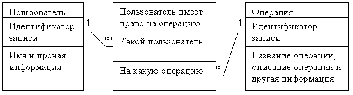
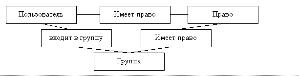
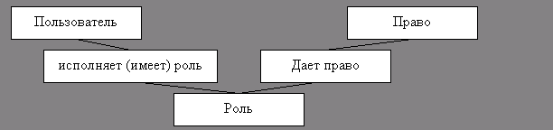
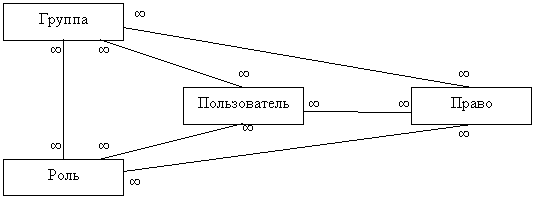
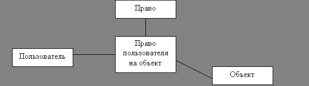

Доступ в программах
===================

В данной работе рассматриваются способы хранения информации о правах
доступа к различным частям программ и данных. Работа может быть
интересна программистам, реализующим многопользовательские системы.

**Термины**

При создании приложения, которое используют несколько пользователей,
возникает задача ограничения доступа. Существует несколько способов
решения этой задачи. Выбор оптимального способа зависит от
дополнительных условий и особенностей приложения.

Самый простой способ ограничения доступа - когда есть список
пользователей, которым разрешено работать со всей программой целиком.
Для его реализации потребуется одна таблица с полем «пользователь».
Проверка на входе в программу - единственная проверка.

В более сложном случае нужно разграничивать доступ к отдельным частям
(функциям) программы и проверок становится много, а не одна. Поэтому
есть понятия:

- пользователь;
- программа;
- функция программы  
  часть программы,
  позволяющая пользователю выполнить некоторое
  осмысленное и нужное действие)
- право  
  пользователю может быть дано или не дано право использовать некоторую
  функцию программы.
- роль (набор прав);
- группа пользователей.

**1. Пользователи, права, роли и группы**

Роли и группы могут быть использованы как дополняющие друг друга
(ортогональные) концепции. Поэтому есть четыре варианта их применения:
не использовать ни одну из них, использовать по только группировку
пользователей, использовать только группировку прав, использовать
группировку пользователей и прав одновременно.

**1.1. Набор прав**

В этом случае некоторому пользователю дается (или не дается) право
выполнять некоторую операцию. Так как операции и пользователи связаны
отношением «многие - ко - многим» здесь потребуются уже три таблицы:
«пользователи», «операции», «пользователь имеет право на операцию».

{.center}

**1.2. Группы пользователей**

В случае если программой пользуется большое количество пользователей, то
назначать права каждому пользователю становится неудобно. Тогда вводят
понятие «группа пользователей». Сначала пользователей объединяют в
группы (например, на территориальной основе, по возрастному признаку,
совершеннолетние - несовершеннолетние), а затем определяют права для
групп. При этом при добавлении нового пользователя в систему вместо
назначения ему прав достаточно просто добавить пользователя в нужную
группу. Пользователи и группы в общем случае связаны соотношением
«многие - ко - многим». При этом иногда возникает потребность
запретить какое-то право отдельному пользователю группы. Кроме того,
права могут назначаться как группам, так и отдельным пользователям.

Для этого потребуется следующая структура:

{.center}

**1.3. Ролевая модель**

Если у программы много функций, которые удобно логически сгруппировать,
то вводят понятие «роль» - набор функций, необходимых для выполнения
некоторой работы. Так, например, для программы автоматизации школы
такими ролями могут быть «ученик», «учитель», «родитель», «завуч».
Пользователь может иметь несколько ролей, например, быть одновременно
учителем и родителем. Т.е. пользователи и роли связаны отношением
"многие - ко - многим", так же как и пользователи и группы в схеме с
группами пользователей. В обеих схемах можно не давать возможности
назначать индивидуальным пользователям индивидуальные права. В этом
случае потребуется такая схема:

{.center}

**1.4. Модель с ролями и группами**

Чтобы обеспечить максимальную гибкость для ограничения доступа ролевую
модель и группы пользователей объединяют в общую модель. В этом случае
роли могут назначаться группам, что еще уменьшает объем
администрирования.

В итоге получается тетраэдр, в вершинах которого находятся пользователи,
группы, роли и права, а на ребрах - таблицы для моделирования отношения
«многие - ко - многим»

{.center}

**1.5. Оптимизация**

**1.5.1. Маски прав**

Если прав фиксированное количество, то можно завести в таблицах
«пользователь-право», «группа-право» и «роль-право» дополнительные поля,
например по одному полю на каждое право. Тогда таблицу «право» можно
сделать подразумеваемой. Если прав меньше 32, то можно все
дополнительные поля объединить в одно и назвать это «маской прав».

**1.5.2. Эффективные права**

Кроме того, можно вычислить эффективные права и добавить поле в таблицу
«пользователь-право». Это потребует обновления этого поля при каждом
изменении других таблиц, однако существенно ускорит проверку прав.

**2. Объекты**

Права в программе могут разграничиваться не только по функциям, но и по
объектам. К примеру, один и тот же пользователь может иметь право
«только чтение» для одной папки и «полный доступ» для другой папки.

**2.1. Права на объекты**

В этом случае права должны даваться не вообще, а на конкретные объекты.
Однако так как на разные объекты могут даваться одинаковые права, то
можно воспользоваться следующей структурой:

{.center}

Т.е. дополнить таблицу «пользователь - право» колонкой, в которой будет
указано, к какому объекту это право дано. Точно так же должны быть
расширены таблицы: роль--право, группа--право и группа--роль. Таким
образом, разграничивая доступ к объектам, мы добавляем новое измерение к
модели.

Если же позволить назначать права не только на объекты, но и на группы
объектов (т. к. назначать права на каждый объект в отдельности
трудоемко), то получаем шесть сущностей (пользователь, группа, право,
роль, объект, группа), которые объединяются восемью тройными связями.
Восемью, так как у нас три пары сущностей, а 2^3 = 8. Еще есть три
двойные связи (право-роль, пользователь-группа и объект-группа).

Это подводит к мысли - нельзя ли обойтись общей таблицей «право на»?

**2.2. Иерархии объектов**

Объектов, как правило, очень много, существенно больше, чем
пользователей и прав. Поэтому объекты не только объединяют в группы, но
и организовывают в иерархии (вероятно, появятся системы, в которых
группы и роли так же образуют иерархии). Иерархию можно изобразить в
виде дерева. При этом права могут назначаться непосредственно листу или
узлу, либо могут браться права узла более близкого к корню. Это
называется наследованием прав.

В случае наследования прав возникает вопрос - что делать, если
установлен флаг «права наследуются» и права определены непосредственно
для самого объекта. Одно из решений - объединять такие права (как на
допуск, так и на недопуск), другое - не позволять определять права для
объекта, если установлен флаг «права наследуются».

В случае если берутся либо права предка, либо права объекта, можно
завести у объекта поле - откуда брать права. Это поле является кешем и
должно обновляться при изменении поля «права наследуются» у объекта и у
его предков.

**Заключение**

В данной работе рассмотрены различные схемы хранения информации о правах
доступа. Для конкретной системы нужно строить свою схему исходя из
требований по быстродействию и уровню ограничения доступа.

Сергей Радкевич (mailto:level3@mail.ru, ICQ:15320127)

