Delphi и Windows API для защиты секретов
========================================

Как реализовать методы криптографической защиты информации при помощи
подручных средств - Windows и Delphi

## Часть 1

Мы вступили в цифровой век. На смену бумажным документам пришли
электронные, а личные контакты все чаще уступают место переписке по
e-mail. Поэтому «шпионские штучки» вроде паролей и шифровок становятся
все более привычными и необходимыми инструментами безопасности.

### Криптографические возможности Windows

Сразу договоримся, что никакая система защиты информации не может быть
абсолютно надежной. Речь может идти лишь о некоторой степени надежности
и рисках, связанных со взломом защиты. Поэтому с практической точки
зрения есть смысл оценить важность данных и экономно подстелить соломку
на случай неудачи. В наших приложениях, например, мы выдаем кредит
доверия операционной системе Windows, несмотря на закрытость ее кода.

Итак, ОС мы доверяем. Чтобы криптозащиту нельзя было «обойти» с другой
стороны - к примеру, перехватить из незащищенной области памяти
секретные пароли - криптографические функции должны быть частью
операционной системы. В семействе Windows, начиная с Windows 95,
обеспечивается реализация шифрования, генерации ключей, создания и
проверки цифровых подписей и других криптографических задач. Эти функции
необходимы для работы операционной системы, однако ими может
воспользоваться и любая прикладная программа - для этого программисту
достаточно обратиться к нужной подпрограмме так, как предписывает
криптографический интерфейс прикладных программ (CryptoAPI).

Разумеется, по мере совершенствования Windows расширялся и состав ее
криптографической подсистемы. Помимо базовых операций, в настоящее время
в CryptoAPI 2.0 поддерживается работа с сертификатами, шифрованными
сообщениями в формате PKCS #7 и пр.

Описание функций CryptoAPI, помимо специальных книг, можно найти на сайте
[Microsoft](https://learn.microsoft.com/ru-ru/windows/win32/seccrypto/using-cryptography),
или в CD-версии, в файле crypto.chm.

### Взаимодействие с CryptoAPI

Функции CryptoAPI можно вызвать из программы, написанной на любимом
многими (в том числе и авторами) языке С++. Тем не менее, Pascal
де-факто признан стандартом в области обучения программированию. (Не
будем спорить о том, хорошо это или плохо, чтобы не ввязываться в драку,
пусть даже и виртуальную.) Кроме того, в ряде отечественных компаний
Delphi является базовым средством разработки. Поэтому все примеры были
реализованы в среде Delphi. Хотя в качестве инструмента можно было бы
выбрать и MS Visual C++.

Код функций криптографической подсистемы содержится в нескольких
динамически загружаемых библиотеках Windows (advapi32.dll, crypt32.dll).
Для обращения к такой функции из прикладной программы на Object Pascal
следует объявить ее как внешнюю. Заголовок функции в интерфейсной части
модуля будет выглядеть, например, так:

```delphi
function CryptAcquireContext (
  phPROV: PHCRYPTPROV;
  pszContainer: LPCTSTR;
  pszProvider: LPCTSTR;
  dwProvType: DWORD;
  dwFlags: DWORD): BOOL; stdcall;
```

а в исполняемой части вместо тела функции нужно вписать директиву extern
с указанием библиотеки, в которой содержится функция, и, возможно, ее
имени в этой библиотеке (если оно отличается от имени функции в
создаваемом модуле), например:

```delphi
function CryptAcquireContext; external 'advapi32.dll'
         name 'CryptAcquireContextA';
```

Таким образом, имея описание функций CryptoAPI, можно собрать заголовки
функций в отдельном модуле, который будет обеспечивать взаимодействие
прикладной программы с криптографической подсистемой. Разумеется, такая
работа была проделана программистами Microsoft, и соответствующий
заголовочный файл (wincrypt.h) был включен в поставку MS Visual C++. К
счастью, появилась и Delphi-версия (wcrypt2.pas). Ее можно найти здесь.
Подключив модуль к проекту, вы сможете использовать не только функции
CryptoAPI, но и мнемонические константы режимов, идентификаторы
алгоритмов и прочих параметров, необходимых на практике.

И последнее замечание перед тем, как опробовать CryptoAPI в деле. Ряд
функций был реализован только в Windows 2000. Но и на старушку Windows
98 можно найти управу: при установке Internet Explorer 5 интересующие
нас библиотеки обновляются, позволяя использовать новейшие
криптографические возможности. Нужно лишь задать для Delphi-проекта
параметр условной компиляции NT5, после чего вызовы функций, появившихся
лишь в Windows 2000, будут нормально работать.

### Знакомство с криптопровайдерами

Функции CryptoAPI обеспечивают прикладным программам доступ к
криптографическим возможностям Windows. Однако они являются лишь
«передаточным звеном» в сложной цепи обработки информации. Основную
работу выполняют скрытые от глаз программиста функции, входящие в
специализированные программные (или программно-аппаратные) модули -
провайдеры (поставщики) криптографических услуг (CSP - Cryptographic
Service Providers), или криптопровайдеры (рис. 1).

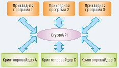{.center}

Программная часть криптопровайдера представляет собой dll-файл,
подписанный Microsoft; периодически Windows проверяет цифровую подпись,
что исключает возможность подмены криптопровайдера.

Криптопровайдеры отличаются друг от друга:

- составом функций (например, некоторые криптопровайдеры не выполняют шифрование данных, ограничиваясь созданием и проверкой цифровых подписей);
- требованиями к оборудованию (специализированные криптопровайдеры могут требовать устройства для работы со смарт-картами для выполнения аутентификации пользователя);
- алгоритмами, осуществляющими базовые действия (создание ключей, хеширование и пр.).

По составу функций и обеспечивающих их алгоритмов криптопровайдеры
подразделяются на типы. Например, любой CSP типа PROV\_RSA\_FULL
поддерживает как шифрование, так и цифровые подписи, использует для
обмена ключами и создания подписей алгоритм RSA, для шифрования -
алгоритмы RC2 и RC4, а для хеширования - MD5 и SHA.

В зависимости от версии операционной системы состав установленных
криптопровайдеров может существенно изменяться. Однако на любом
компьютере с Windows можно найти Microsoft Base Cryptographic Provider,
относящийся к уже известному нам типу PROV\_RSA\_FULL. Именно с этим
провайдером по умолчанию будут взаимодействовать все программы.

Использование криптографических возможностей Windows напоминает работу
программы с графическим устройством. Криптопровайдер подобен
графическому драйверу: он может обеспечивать взаимодействие программного
обеспечения с оборудованием (устройство чтения смарт-карт, аппаратные
датчики случайных чисел и пр.). Для вывода информации на графическое
устройство приложение не должно непосредственно обращаться к драйверу -
вместо этого нужно получить у системы контекст устройства,
посредством которого и осуществляются все операции. Это позволяет
прикладному программисту использовать графическое устройство, ничего не
зная о его аппаратной реализации. Точно так же для использования
криптографических функций приложение обращается к криптопровайдеру не
напрямую, а через CryptoAPI. При этом вначале необходимо запросить у
системы контекст криптопровайдера.

Первым делом, хотя бы из любопытства, выясним, какие же криптопровайдеры
установлены в системе. Для этого нам понадобятся четыре функции
CryptoAPI (выходные параметры выделены жирным шрифтом, а входные -
курсивом):

- CryptEnumProviders (i, резерв, флаги, тип, имя, длина\_имени) - возвращает имя и тип i-го по порядку криптопровайдера в системе (нумерация начинается с нуля);
- CryptAcquireContext (провайдер, контейнер, имя, тип, флаги) - выполняет подключение к криптопровайдеру с заданным типом и именем и возвращает его дескриптор (контекст). При подключении мы будем передавать функции флаг CRYPT\_VERIFYCONTEXT, служащий для получения контекста без подключения к контейнеру ключей;
- CryptGetProvParam (провайдер, параметр, данные, размер\_данных, флаги) - возвращает значение указанного параметра провайдера, например, версии (второй параметр при вызове функции - PP\_VERSION), типа реализации (программный, аппаратный, смешанный - PP\_IMPTYPE), поддерживаемых алгоритмов (PP\_ENUMALGS). Список поддерживаемых алгоритмов при помощи этой функции может быть получен следующим образом: при одном вызове функции возвращается информация об одном алгоритме; при первом вызове функции следует передать значение флага CRYPT\_FIRST, а при последующих флаг должен быть равен 0;
- CryptReleaseContext (провайдер, флаги) - освобождает дескриптор криптопровайдера.

Каждая из этих функций, как и большинство других функций CryptoAPI,
возвращает логическое значение, равное true, в случае успешного
завершения, и false - если возникли ошибки. Код ошибки может быть
получен при помощи функции GetLastError. Возможные значения кодов ошибки
приведены в упоминавшейся выше документации. Например, при вызове
функции CryptGetProvParam для получения версии провайдера следует учесть
возможность возникновения ошибок следующим образом:

```delphi
if not CryptGetProvParam(hProv, PP_VERSION, (@vers), @DataLen, 0) then
begin
  case int64(GetLastError) of
    ERROR_INVALID_HANDLE: err := 'ERROR_INVALID_HANDLE';
    ERROR_INVALID_PARAMETER: err := 'ERROR_INVALID_PARAMETER';
    ERROR_MORE_DATA: err := 'ERROR_MORE_DATA';
    ERROR_NO_MORE_ITEMS: err := 'ERROR_NO_MORE_ITEMS';
    NTE_BAD_FLAGS: err := 'NTE_BAD_FLAGS';
    NTE_BAD_TYPE: err := 'NTE_BAD_TYPE';
    NTE_BAD_UID: err := 'NTE_BAD_UID';
  else
    err := 'Unknown error';
  end;
  MessageDlg('Error of CryptGetProvParam: ' + err, mtError, [mbOK], 0);
  exit;
end;
```

Текст процедуры, выводящей в Memo-поле FileMemo формы информацию об
установленных в системе криптопровайдерах, приведен ниже:

```delphi
type
  algInfo = record
    algID: ALG_ID;
    dwBits: DWORD;
    dwNameLen: DWORD;
    szName: array[0..100] of char;
  end;

{ вспомогательная функция, преобразующая тип провайдера в строку }
function ProvTypeToStr(provType: DWORD): string;
begin
  case provType of
    PROV_RSA_FULL: ProvTypeToStr := 'RSA full provider';
    PROV_RSA_SIG: ProvTypeToStr := 'RSA signature provider';
    PROV_DSS: ProvTypeToStr := 'DSS provider';
    PROV_DSS_DH: ProvTypeToStr := 'DSS and Diffie-Hellman provider';
    PROV_FORTEZZA: ProvTypeToStr := 'Fortezza provider';
    PROV_MS_EXCHANGE: ProvTypeToStr := 'MS Exchange provider';
    PROV_RSA_SCHANNEL: ProvTypeToStr := 'RSA secure channel provider';
    PROV_SSL: ProvTypeToStr := 'SSL provider';
  else
    ProvTypeToStr := 'Unknown provider';
  end;
end;

{ вспомогательная функция, преобразующая тип реализации в строку }
function ImpTypeToStr(it: DWORD): string;
begin
  case it of
    CRYPT_IMPL_HARDWARE: ImpTypeToStr := 'аппаратный';
    CRYPT_IMPL_SOFTWARE: ImpTypeToStr := 'программный';
    CRYPT_IMPL_MIXED: ImpTypeToStr := 'смешанный';
    CRYPT_IMPL_UNKNOWN: ImpTypeToStr := 'неизвестен';
  else
    ImpTypeToStr := 'неверное значение';
  end;
end;

{ процедура вывода информации о криптопровайдерах }
procedure TMainForm.InfoItemClick(Sender: TObject);
var
  i: DWORD;
  dwProvType, cbName, DataLen: DWORD;
  provName: array[0..200] of Char;
  vers: array[0..3] of Byte;
  impType: DWORD;
  ai: algInfo;
  err: string;
begin
  i := 0;
  FileMemo.Clear;
  { проверяем наличие еще одного }
  while (CryptEnumProviders(i, nil, 0, @dwProvType, nil, @cbName)) do	
  begin
    { получаем имя CSP }
    if CryptEnumProviders(i, nil, 0, @dwProvType, @provName, @cbName) then
    begin
      FileMemo.Lines.Add('Криптопровайдер: ' + provName);
      FileMemo.Lines.Add('Тип: ' + IntToStr(dwProvType) + ' - ' + ProvTypeToStr(dwProvType));
      if not CryptAcquireContext(@hProv, nil, provName, dwProvType, CRYPT_VERIFYCONTEXT) then
      begin
        { обработка ошибок }
      end;
      DataLen := 4;
      if not CryptGetProvParam(hProv, PP_VERSION, (@vers), @DataLen, 0) then
      begin
        { обработка ошибок }
      end;
      FileMemo.Lines.Add('Версия: ' + Chr(vers[1] + $30) + '.' + Chr(vers[0] + $30));
      if not CryptGetProvParam(hProv, PP_IMPTYPE, @impType, @DataLen, 0) then
      begin
        { обработка ошибок }
      end;
      FileMemo.Lines.Add('Тип реализации: ' + ImpTypeToStr(impType));
      FileMemo.Lines.Add('Поддерживает алгоритмы:');
      DataLen := SizeOf(ai);
      if not CryptGetProvParam(hProv, PP_ENUMALGS, @ai, @DataLen, CRYPT_FIRST) then
      begin
        { обработка ошибок }
      end;
      with ai do
        FileMemo.Lines.Add(szName + #9 + 'длина ключа - ' + IntToStr(dwBits) + ' бит' + #9 + 'ID: ' + IntToStr(AlgID));
      DataLen := SizeOf(ai);
      while CryptGetProvParam(hProv, PP_ENUMALGS, @ai, @DataLen, 0) do
      begin
        with ai do
          FileMemo.Lines.Add(szName + #9 + 'длина ключа - ' + IntToStr(dwBits) + ' бит' + #9 + 'ID: ' + IntToStr(AlgID));
        DataLen := SizeOf(ai);
      end;
      FileMemo.Lines.Add('');
      CryptReleaseContext(hProv, 0);
    end;
    Inc(i);
  end;
end;
```

Предполагается, что процедура вызывается при выборе соответствующего
элемента в главном меню формы. Для краткости в тексте программы опущены
фрагменты, выполняющие обработку ошибок.

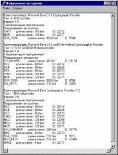{.center}

На рис. 2 показан пример отчета, выдаваемого приведенным выше кодом,
выполненным в среде Windows 98.

### Шифрование с использованием паролей

После того как мы узнали кое-что о структуре CryptoAPI, можно
воспользоваться ею в практических целях. Пожалуй, самым ожидаемым
действием криптографической подсистемы является шифрование файлов - так,
чтобы лишь пользователь, знающий определенный пароль, мог получить к ним
доступ.

Для шифрования данных в CryptoAPI применяются симметричные алгоритмы.
Симметричность означает, что для шифрования и расшифровки данных
используется один и тот же ключ, известный как шифрующей, так и
расшифровывающей стороне. При этом плохо выбранный ключ шифрования может
дать противнику возможность взломать шифр. Поэтому одной из функций
криптографической подсистемы должна быть генерация «хороших» ключей либо
случайным образом, либо на основании некоторой информации,
предоставляемой пользователем, например пароля.

В случае создания ключа на основании пароля должно выполняться следующее
обязательное условие: при многократном повторении процедуры генерации
ключа на одном и том же пароле должны получаться идентичные ключи. Ключ
шифрования имеет, как правило, строго определенную длину, определяемую
используемым алгоритмом, а длина пароля может быть произвольной. Даже
интуитивно понятно, что для однозначной генерации ключей нужно привести
разнообразные пароли к некоторой единой форме. Это достигается с помощью
хеширования.

Хешированием (от англ. hash - разрезать, крошить, перемешивать)
называется преобразование строки произвольной длины в битовую
последовательность фиксированной длины (хеш-значение, или просто хеш) с
обеспечением следующих условий:

- по хеш-значению невозможно восстановить исходное сообщение;
- практически невозможно найти еще один текст, дающий такой же хеш, как и наперед заданное сообщение;
- практически невозможно найти два различных текста, дающих одинаковые хеш-значения (такие ситуации называют коллизиями).

При соблюдении приведенных условий хеш-значение служит компактным
цифровым отпечатком (дайджестом) сообщения. Существует множество
алгоритмов хеширования. CryptoAPI поддерживает, например, алгоритмы MD5
(MD - Message Digest) и SHA (Secure Hash Algorithm).

Итак, чтобы создать ключ шифрования на основании пароля, нам нужно
вначале получить хеш этого пароля. Для этого следует создать с помощью
CryptoAPI хеш-объект, воспользовавшись функцией CryptCreateHash
(провайдер, ID\_алгоритма, ключ, флаги, хеш), которой нужно передать
дескриптор криптопровайдера (полученный с помощью CryptAcquireContext) и
идентификатор алгоритма хеширования (остальные параметры могут быть
нулями). В результате мы получим дескриптор хеш-объекта. Этот объект
можно представить себе как черный ящик, который принимает любые данные и
«перемалывает» их, сохраняя внутри себя лишь хеш-значение. Подать данные
на вход хеш-объекта позволяет функция CryptHashData (дескриптор, данные,
размер\_данных, флаги).

Непосредственно создание ключа выполняет функция CryptDeriveKey
(провайдер, ID\_алгоритма, хеш-объект, флаги, ключ), которая принимает
хеш-объект в качестве исходных данных и строит подходящий ключ для
алгоритма шифрования, заданного своим ID. Результатом будет дескриптор
ключа, который можно использовать для шифрования (рис. 3).

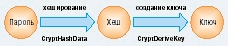{.center}

Следует обратить внимание, что при работе с CryptoAPI мы все время имеем
дело не с самими объектами или их адресами, а с дескрипторами - целыми
числами, характеризующими положение объекта во внутренних таблицах
криптопровайдера. Сами таблицы располагаются в защищенной области
памяти, так что программы-«шпионы» не могут получить к ним доступ.

Алгоритмы шифрования, поддерживаемые CryptoAPI, можно разделить на
блочные и поточные: первые обрабатывают данные относительно большими по
размеру блоками (например, 64, 128 битов или более), а вторые - побитно
(теоретически, на практике же - побайтно). Если размер данных,
подлежащих шифрованию, не кратен размеру блока, то последний, неполный
блок данных, будет дополнен необходимым количеством случайных битов, в
результате чего размер зашифрованной информации может несколько
увеличиться. Разумеется, при использовании поточных шифров размер данных
при шифровании остается неизменным.

Шифрование выполняется функцией CryptEncrypt (ключ, хеш, финал, флаги,
данные, рамер\_данных, размер\_буфера):

- через параметр ключ передается дескриптор ключа шифрования;
- параметр хеш используется, если одновременно с шифрованием нужно вычислить хеш-значение шифруемого текста;
- параметр финал равен true, если шифруемый блок текста - последний или единственный (шифрование можно осуществлять частями, вызывая функцию CryptEncrypt несколько раз);
- значение флага должно быть нулевым;
- параметр данные представляет собой адрес буфера, в котором при вызове функции находится исходный текст, а по завершению работы функции - зашифрованный;
- следующий параметр, соответственно, описывает размер входных/выходных данных,
- последний параметр задает размер буфера - если в результате шифрования зашифрованный текст не уместится в буфере, возникнет ошибка.

Для расшифровки данных используется функция CryptDecrypt (ключ, хеш,
финал, флаги, данные, рамер\_данных), отличающаяся от шифрующей функции
только тем, что размер буфера указывать не следует: поскольку размер
данных при расшифровке может только уменьшиться, отведенного под них
буфера наверняка будет достаточно.

Приведем лишь фрагменты программы, реализующей шифрование файла с
использованием заданного пароля, опустив громоздкие проверки успешности
выполнения криптографических операций (что в реальной программе делать
крайне нежелательно).

Полный пример приложения в формате Delphi 4 можно взять
[здесь](Project01.zip).

```delphi
{ «описание» используемых переменных }
var
  hProv: HCRYPTPROV;
  hash: HCRYPTHASH;
  password: string;
  key: HCRYPTKEY;
  plaintext, ciphertext: string;
  inFile, outFile: file;
  data: PByte;
  l: DWORD;
begin
  { получаем контекст криптопровайдера }
  CryptAcquireContext(@hProv, nil, nil, PROV_RSA_FULL, CRYPT_VERIFYCONTEXT);
  { создаем хеш-объект }
  CryptCreateHash(hProv, CALG_SHA, 0, 0, @hash);
  { хешируем пароль }
  CryptHashData(hash, @password[1], length(password), 0);
  { создаем ключ на основании пароля для потокового шифра RC4 }
  CryptDeriveKey(hProv, CALG_RC4, hash, 0, @key);
  { уничтожаем хеш-объект }
  CryptDestroyHash(hash);
  { открываем файлы }
  AssignFile(inFile, plaintext);
  AssignFile(outFile, ciphertext);
  Reset(inFile, 1);
  Rewrite(outFile, 1);
  { выделяем место для буфера }
  GetMem(data, 512);
  { шифруем данные }
  while not Eof(inFile) do
  begin
    BlockRead(inFile, data^, 512, l);
    CryptEncrypt(key, 0, eof(inFile), 0, data, @l, l);
    BlockWrite(outFile, data^, l);
  end;
  { освобождаем место и закрываем файлы }
  FreeMem(data, 512);
  CloseFile(inFile);
  CloseFile(outFile);
  { освобождаем контекст криптопровайдера }
  CryptReleaseContext(hProv, 0);
end;
```

Конечно, шифрование вами всех файлов одним и тем же паролем облегчает
«противнику» задачу их расшифровки, запоминание огромного числа паролей
сильно усложняет жизнь, а их записывание в незашифрованном виде создает
опасность раскрытия всей системы. CryptoAPI может предложить на этот
случай ряд решений. О них поговорим ниже.

## Часть 2

В арсенале защиты должны быть не только методы, обеспечивающие
секретность передачи информации (о них мы говорили в первой части
статьи). Не менее важными инструментами безопасности являются процедуры,
позволяющие убедиться в целости и аутентичности данных. Кроме того,
необходимо решать проблемы безопасного хранения и распределения ключей.

### Проблема распределения ключей

В прошлый раз при помощи CryptoAPI мы решали такую "классическую"
задачу как шифрование на основе пароля. Напомним, что пароль
использовался для создания ключа шифрования какого-либо симметричного
алгоритма. В таком случае расшифровать файл может лишь тот, кто знает
пароль. А значит, для обеспечения конфиденциальности нужно держать
пароль в строжайшем секрете - желательно, чтобы его знали лишь
отправитель и получатель информации. (А еще лучше, если отправитель и
получатель - одно и то же лицо.)

Предположим, что отправитель и получатель при личной встрече
договорились использовать для конфиденциальной переписки определенный
пароль. Но если они будут шифровать все свои сообщения одним и тем же
ключом, то возможный противник, перехватив корреспонденцию, будеть иметь
хорошие шансы взломать шифр: при современных методах криптоанализа
наличие нескольких шифртекстов, полученных путем использования одного и
того же ключа, почти гарантирует успешный результат. Поэтому при
использовании симметричных алгоритмов шифрования настоятельно
рекомендуется не применять один и тот же ключ дважды!

Однако помнить отдельный пароль для каждого зашифрованного сообщения -
задача достаточно трудоемкая. А для корреспондентов, не имеющих
возможности встретиться лично для согласования ключей шифрования,
конфиденциальный обмен сообщениями вообще становится недоступным. Такая
практическая трудность называется проблемой распределения ключей.

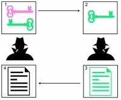{.center}

Спасительный способ, позволяющий шифровать сообщения, обмениваясь
ключами по открытым каналам связи, был придуман в середине 70-х годов
прошлого столетия, а в начале восьмидесятых появился первый реализующий
его алгоритм - RSA. Теперь пользователь может сгенерировать два
связанных между собой ключа - ключевую пару. Один из этих ключей по
несекретным каналам рассылается всем, с кем пользователь хотел бы
обмениваться конфиденциальными сообщениями (рис. 4). Этот ключ называют
открытым (англ. public key). Зная открытый ключ пользователя, можно
зашифровать адресованное ему сообщение, но вот расшифровать его
позволяет лишь вторая часть ключевой пары - закрытый ключ (private key).
При этом открытый ключ не дает "практической" возможности вычислить
закрытый: такая задача, хоть и разрешима в принципе, но при достаточно
большом размере ключа требует многих лет машинного времени. Для
сохранения конфиденциальности получателю необходимо лишь хранить в
строгом секрете свой закрытый ключ, а отправителю - убедиться, что
имеющийся у него открытый ключ действительно принадлежит адресату.

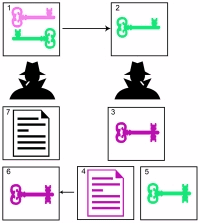{.center}

Так как для шифрования и расшифровки используются различные ключи,
алгоритмы такого рода назвали асимметричными. Наиболее существенным их
недостатком является низкая производительность - они примерно в 100 раз
медленнее симметричных алгоритмов. Поэтому были созданы
криптографические схемы, использующие преимущества как симметричных, так
и асимметричных алгоритмов (рис. 5):

- для шифрования файла или сообщения используется быстрый симметричный алгоритм, причем ключ шифрования генерируется случайным образом с обеспечением "хороших" статистических свойств;
- небольшой по размерам симметричный ключ шифрования шифруется при помощи асимметричного алгоритма с использованием открытого ключа адресата и в зашифрованном виде пересылается вместе с сообщением;
- получив сообщение, адресат своим закрытым ключом расшифровывает симметричный ключ, а с его помощью - и само сообщение.

Описанная схема реализована и в CryptoAPI.

### Целостность и аутентичность информации

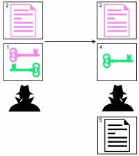{.center}

Как удостовериться в том, что пришедшее сообщение действительно
отправлено тем, чье имя стоит в графе "отправитель"? Асимметричные
схемы шифрования дают нам элегантный способ аутентификации. Если
отправитель зашифрует сообщение своим закрытым ключом, то успешное
расшифровывание убедит получателя в том, что послать корреспонденцию мог
только хозяин ключевой пары, и никто иной (рис. 6). При этом расшифровку
может выполнить любой, кто имеет открытый ключ отправителя. Ведь наша
цель - не конфиденциальность, а аутентификация.

Чтобы избежать шифрования всего сообщения при помощи асимметричных
алгоритмов, используют хеширование: вычисляется хеш-значение исходного
сообщения, и только эта короткая последовательность байтов шифруется
закрытым ключом отправителя. Результат представляет собой электронную
цифровую подпись. Добавление такой подписи к сообщению позволяет
установить:

- аутентичность сообщения - создать подпись на основе закрытого ключа мог только его хозяин;
- целостность данных - легко вычислить хеш-значение полученного сообщения и сравнить его с тем, которое хранится в подписи: если значения совпадают, значит, сообщение не было изменено злоумышленником после того, как отправитель его подписал.

Таким образом, асимметричные алгоритмы позволяют решить две непростые
задачи: обмена ключами шифрования по открытым каналам связи и подписи
сообщения. Чтобы воспользоваться этими возможностями, нужно
сгенерировать и сохранить две ключевые пары - для обмена ключами и для
подписей. В этом нам поможет CryptoAPI.

### Контейнеры ключей

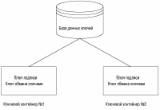{.center}

Каждый криптопровайдер располагает базой данных, в которой хранятся
долговременные ключи пользователей. База данных содержит один или более
контейнеров ключей (рис. 7). Пользователь может создать несколько
контейнеров с различными именами (именем контейнера по умолчанию
является имя пользователя в системе).

Подключение к контейнеру производится одновременно с получением
контекста криптопровайдера при вызове функции CryptAcquireContext - имя
контейнера ключей передается функции вторым ее аргументом. Если второй
аргумент содержит пустой указатель (nil), то используется имя по
умолчанию, т. е. имя пользователя. В том случае, если доступ к
контейнеру не нужен, можно передать в последнем аргументе функции флаг
CRYPT\_VERIFYCONTEXT; при необходимости создать новый контейнер
используется флаг CRYPT\_NEWKEYSET; а для удаления существующего
контейнера вместе с хранящимися в нем ключами - CRYPT\_DELETEKEYSET.

Каждый контейнер может содержать, как минимум, две ключевые пары - ключ
обмена ключами и ключ подписи. Ключи, используемые для шифрования
симметричными алгоритмами, не сохраняются. Как мы уже говорили, такие
ключи не рекомендуется применять более одного раза, поэтому их называют
сеансовыми (англ. session key).

### Создание ключевых пар

После создания контейнера ключей необходимо сгенерировать ключевые пары
обмена ключами и подписи. Эту работу в CryptoAPI выполняет функция
CryptGenKey (провайдер, алгоритм, флаги, ключ):

- провайдер - дескриптор криптопровайдера, полученный в результате обращения к функции CryptAcquireContext;
- алгоритм - указывает, какому алгоритму шифрования будет соответствовать создаваемый ключ. Информация об алгоритме, таким образом, является частью описания ключа. Каждый криптопровайдер использует для обмена ключами и подписи строго определенные алгоритмы. Так, провайдеры типа PROV\_RSA\_FULL, к которым относится и Microsoft Base Cryptographic Provider, реализуют алгоритм RSA. Но при генерации ключей знать это не обязательно: достаточно указать, какой ключ мы собираемся создать - обмена ключами или подписи. Для этого используются мнемонические константы AT\_KEYEXCHANGE и AT\_SIGNATURE;
- флаги - при создании асимметричных ключей управляет их размером. Используемый нами криптопровайдер позволяет генерировать ключ обмена ключами длиной от 384 до 512 бит\*\*,
  а ключ подписи - от 512 до 16384 бит. Чем больше длина ключа, тем выше его надежность, поэтому трудно найти причины для использования ключа обмена ключами длиной менее 512 бит, а длину ключа подписи не рекомендуется делать меньше 1024 бит\*\*.
  По умолчанию криптопровайдер создает оба ключа длиной 512 бит. Необходимую длину ключа можно передать в старшем слове параметра флаги;
- ключ - в случае успешного завершения функции в этот параметр заносится дескриптор созданного ключа.

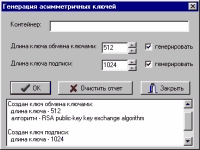{.center}

Рассмотрим пример создания ключевых пар при помощи формы, показанной на
рис. 8. В поле "Контейнер" можно указать имя контейнера ключей; если
оставить это поле пустым, будет использован контейнер по умолчанию.
Назначение остальных элементов управления должно быть интуитивно
понятным. После генерации ключа в memo-поле выводится отчет о его
параметрах. Для этого используется функция CryptGetKeyParam (ключ,
параметр, буфер, размер, флаги). Чтобы получить информацию о требуемом
параметре, нужно через второй аргумент функции передать соответствующую
константу: KP\_ALGID - идентификатор алгоритма, KP\_KEYLEN - размер
ключа, и т. д. См. текст процедуры генерации ключей без операторов
обработки ошибок.

```delphi
procedure TGenerateForm.OKBtnClick(Sender: TObject);
var
  cont: PChar;
  err: string;
  hProv: HCRYPTPROV;
  KeyExchKey, SignKey: HCRYPTKEY;
  flag, keyLen: DWORD;
begin
  { если ни один ключ не выбран - выход }
  if not (KEKCheckBox.Checked or SKCheckBox.Checked) then exit;
  { "считываем" имя контейнера }
  if Length(ContainerEdit.Text) = 0 then
    cont := nil
  else
  begin
    err := ContainerEdit.Text;
    cont := StrAlloc(Length(err) + 1);
    StrPCopy(cont, err);
  end;
  CryptAcquireContext(@hProv, cont, nil, PROV_RSA_FULL, 0);
  { генерация ключа обмена ключами (Key Exchange Key) }
  if KEKCheckBox.Checked then
  begin
    { "считываем" длину ключа и помещаем ее в старшее слово параметра ФЛАГИ }
    keyLen := StrToInt(KeyExchLenEdit.Text);
    flag := keyLen shl 16;
    if not CryptGenKey(hProv, AT_KEYEXCHANGE, flag, @KeyExchKey) then
    begin
      { обработка ошибок }
    end
    else
    begin
      ReportMemo.Lines.Add('');
      ReportMemo.Lines.Add('Создан ключ обмена ключами:');
      flag := 4;
      if not CryptGetKeyParam(KeyExchKey, KP_KEYLEN, @keyLen, @flag, 0) then
      begin
        { обработка ошибок }
      end
      else
        ReportMemo.Lines.Add(' длина ключа - ' + IntToStr(keyLen));
      flag := 4;
      if not CryptGetKeyParam(KeyExchKey, KP_ALGID, @keyLen, @flag, 0) then
      begin
        { обработка ошибок }
      end
      else
        ReportMemo.Lines.Add(' алгоритм - ' + algIDtostr(keyLen));
      { функция algIDtostr здесь не приводится. Она состоит из единственного
        оператора case, отображающего целый идентификатор алгоритма в строку }
    end;
  end;
  { генерация ключа подписи (Signature Key) }
  if SKCheckBox.Checked then
  begin
    { выполняется аналогично генерации ключа обмена ключами }
  end;
  CryptReleaseContext(hProv, 0);
end;
```

### Обмен ключами

Теперь мы располагаем набором ключей, однако все они останутся мертвым
грузом, до тех пор пока мы не получим возможности обмена с другими
пользователями открытыми ключами. Для этого необходимо извлечь их из
базы данных ключей и записать в файл, который можно будет передать своим
корреспондентам. При экспорте данные ключа сохраняются в одном из трех
возможных форматов:

- PUBLICKEYBLOB - используется для сохранения открытых ключей. Поскольку открытые ключи не являются секретными, они сохраняются в незашифрованном виде;
- PRIVATEKEYBLOB - используется для сохранения ключевой пары целиком (открытого и закрытого ключей). Эти данные являются в высшей степени секретными, поэтому сохраняются в зашифрованном виде, причем для шифрования используется сеансовый ключ (и, соответственно, симметричный алгоритм);
- SIMPLEBLOB - используется для сохранения сеансовых ключей. Для обеспечения секретности данные ключа шифруются с использованием открытого ключа получателя сообщения.

Экспорт ключей в CryptoAPI выполняется функцией CryptExportKey
(экспортируемый ключ, ключ адресата, формат, флаги, буфер, размер
буфера):

- экспортируемый ключ - дескриптор нужного ключа;
- ключ адресата - в случае сохранения открытого ключа должен быть равен нулю (данные не шифруются);
- формат - указывается один из возможных форматов экспорта (PUBLICKEYBLOB, PRIVATEKEYBLOB, SIMPLEBLOB);
- флаги - зарезервирован на будущее (должен быть равен нулю);
- буфер - содержит адрес буфера, в который будет записан ключевой BLOB (Binary Large OBject - большой двоичный объект);
- размер буфера - при вызове функции в этой переменной должен находиться доступный размер буфера, а по окончании работы в нее записывается количество экспортируемых данных. Если размер буфера заранее не известен, то функцию нужно вызвать с параметром буфер, равным пустому указателю, тогда размер буфера будет вычислен и занесен в переменную размер буфера.

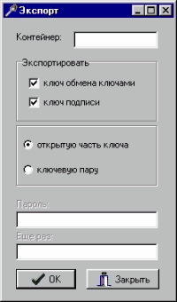{.center}

Экспорт ключевой пары целиком, включая и закрытый ключ, может
понадобиться для того, чтобы иметь возможность подписывать документы на
различных компьютерах (например, дома и на работе), или для сохранения
страховочной копии. В этом случае нужно создать ключ шифрования на
основании пароля и передать дескриптор этого ключа в качестве второго
параметра функции CryptExportKey.

Запросить у криптопровайдера дескриптор самого\' экспортируемого ключа
позволяет функция CryptGetUserKey (провайдер, описание ключа, дескриптор
ключа). Описание ключа - это либо AT\_KEYEXCHANGE, либо AT\_SIGNATURE.

Экспорт асимметричных ключей во всем возможном многообразии можно
осуществить при помощи формы, показанной на рис. 9.

В Листинге приведены наиболее важные фрагменты программы

```delphi
procedure TExportForm.OKBtnClick(Sender: TObject);
var
  cont: PChar;
  err: string;
  hProv: HCRYPTPROV;
  key, expKey: HCRYPTKEY;
  pbuf: PBYTE;
  buflen: DWORD;
  f: file;
  hash: HCRYPTHASH;
begin
  { если ни один ключ не выбран - выход }
  if not (KEKCheckBox.Checked or SKCheckBox.Checked) then exit;
  { если нужен пароль, т.е. экспортируется ключевая пара целиком }
  if PasswEdit.Enabled and (PasswEdit.Text <> Passw2Edit.Text) then
  begin
    MessageDlg('Ошибка при вводе пароля! Повторите ввод.', mtError, [mbOK], 0);
    exit;
  end;

  { "считываем" имя контейнера и подключаемся к криптопровайдеру }
  { если нужен ключ шифрования - создаем его на основании пароля }

  { ключ обмена ключами }
  if KEKCheckBox.Checked then
  repeat
    { получаем дескриптор ключа }
    CryptGetUserKey(hProv, AT_KEYEXCHANGE, @key);
    { пытаемся определить размер буфера для экспорта ключа }
    if (WhatRadioGroup.ItemIndex = 0) then
      CryptExportKey(key, 0, PUBLICKEYBLOB, 0, nil, @bufLen)
    else
      CryptExportKey(key, expKey, PRIVATEKEYBLOB, 0, nil, @bufLen);
    GetMem(pbuf, bufLen);
    { экспортируем данные }
    if (WhatRadioGroup.ItemIndex = 0) then
      CryptExportKey(key, 0, PUBLICKEYBLOB, 0, pbuf, @bufLen)
    else
      CryptExportKey(key, expKey, PRIVATEKEYBLOB, 0, pbuf, @bufLen);
    { освобождаем дескриптор ключа обмена ключами (сам ключ при этом не уничтожается) }
    CryptDestroyKey(key);
    SaveDialog1.Title := 'Укажите файл для сохранения ключа обмена ключами';
    if SaveDialog1.Execute then
    begin
      AssignFile(f, SaveDialog1.FileName);
      Rewrite(f, 1);
      BlockWrite(f, pbuf^, bufLen);
      CloseFile(f);
      MessageDlg('Ключ обмена ключами успешно сохранен', mtInformation, [mbOK], 0);
    end;
  until True; { KeyExchange }

  { ключ подписи }
  if SKCheckBox.Checked then
  repeat
    { аналогично ключу обмена ключами }
  until True; { Signature }

  { если создавался ключ на основании пароля - уничтожаем его,
    после чего освобождаем контекст криптопровайдера }
end;
```

Экспортированные таким образом открытые части ключей понадобятся нам для
проверки подписи и расшифровки сеансового ключа.

Импорт ключевых пар во вновь созданный контейнер - это самостоятельная
процедура. Необходимо запросить у пользователя название контейнера и
пароль, подключиться к провайдеру, создать на основании пароля ключ,
считать из файла импортируемые данные в буфер, после чего
воспользоваться функцией CryptImportKey (провайдер, буфер, длина буфера,
ключ для расшифровки, флаги, импортируемый ключ). Если нужно обеспечить
возможность экспорта импортируемой ключевой пары впоследствии, то в
параметре флаги необходимо передать значение CRYPT\_EXPORTABLE; в
противном случае вызов для данной ключевой пары функции CryptExportKey
приведет к ошибке.

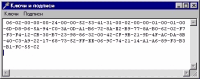{.center}

Мы уже обсуждали, что при работе с асимметричными алгоритмами важно
убедиться, что открытый ключ действительно принадлежит тому, кого вы
считаете его хозяином, и не был подменен злоумышленником. Простейшим
способом обеспечить аутентичность ключа является побайтная сверка с
оригиналом, хранящимся у его хозяина. Для этого можно просто позволить
пользователю просмотреть экспортированные данные в шестнадцатеричном
виде - например, открыть файл, в который был записан открытый ключ, и
вывести его содержимое в окно просмотра.
Примерный результат показан на рис. 10.

### Электронная цифровая подпись

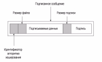{.center}

Для создания электронной цифровой подписи необходимо вычислить хеш
заданного файла и зашифровать этот "цифровой отпечаток сообщения"
своим закрытым ключом - "подписать". Чтобы подпись впоследствии можно
было проверить, необходимо указать, какой алгоритм хеширования
использовался при ее создании. Поэтому подписанное сообщение должно
иметь структуру, показанную на рис. 11.

Подписать вычисленный хеш в CryptoAPI позволяет функция CryptSignHash
(хеш, описание ключа, комментарий, флаги, подпись, длина подписи).
Вторым параметром может быть либо AT\_KEYEXCHANGE, либо AT\_SIGNATURE (в
нашем случае логичнее использовать ключ подписи). Третий параметр в
целях безопасности настоятельно рекомендуется оставлять пустым (nil).
Флаги в настоящее время также не используются - на месте этого аргумента
должен быть нуль. Готовую электронную подпись функция запишет в буфер,
адрес которого содержится в предпоследнем параметре, последний же
параметр будет содержать длину подписи в байтах.

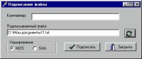{.center}

На рис. 12 показана форма, позволяющая подписать заданный файл. См.
процедуру, реализующую процесс подписания; результатом ее работы
является файл, имеющий структуру, показанную на рис. 11.

```delphi
procedure TSigningForm.SignBtnClick(Sender: TObject);
var
  cont: PChar;
  err: string;
  hProv: HCRYPTPROV;
  key: HCRYPTKEY;
  alg: ALG_ID;
  hash: HCRYPTHASH;
  infile, outfile: file;
  size: DWORD;
  buf: array [0..511] of byte;
  signature: PBYTE;
begin
  { проверка существования выбранного файла }
  if not FileExists(DataNameEdit.Text) then
  begin
    MessageDlg('Неверное имя файла!', mtError, [mbOK], 0);
    exit;
  end;
  AssignFile(infile, DataNameEdit.Text);

  { "считываем" имя контейнера и подключаемся к нему }

  case HashRadioGroup.ItemIndex of
    0: alg := CALG_MD5;
    1: alg := CALG_SHA;
  end;
  CryptCreateHash(hProv, alg, 0, 0, @hash);
  SaveDialog1.Title := 'Задайте имя файла для хранения подписанных данных';
  if SaveDialog1.Execute then
  begin
    AssignFile(outfile, SaveDialog1.FileName);
    Rewrite(outfile, 1);
    { записываем в файл идентификатор алгоритма хеширования }
    BlockWrite(outfile, alg, 4);
    Reset(infile, 1);
    size := FileSize(infile);
    { записываем размер подписываемых данных }
    BlockWrite(outfile, size, 4);
    { пишем сами данные и вычисляем хеш: }
    while not Eof(infile) do
    begin
      BlockRead(infile, buf, 512, size);
      BlockWrite(outFile, buf, size);
      CryptHashData(hash, @buf, size, 0);
    end;
    CloseFile(infile);
    { выясняем размер подписи }
    CryptSignHash(hash, AT_SIGNATURE, nil, 0, nil, @size);
    { создаем подпись }
    GetMem(signature, size);
    CryptSignHash(hash, AT_SIGNATURE, nil, 0, signature, @size);
    BlockWrite(outfile, size, 4);
    BlockWrite(outfile, signature^, size);
    CloseFile(outfile);
  end;

  { уничтожаем хеш-объект и освобождаем контекст }
end;
```

Чтобы проверить правильность подписи, получатель подписанного сообщения
должен иметь файл с открытым ключом подписи отправителя. В процессе
проверки подписи этот ключ импортируется внутрь криптопровайдера.
Проверка выполняется функцией CryptVerifySignature (хеш, подпись, длина
подписи, открытый ключ, комментарий, флаги). О последних двух аргументах
можно сказать то же, что и о параметрах комментарий и флаги функции
CryptSignHash, назначение же остальных должно быть понятно. Если подпись
верна, функция возвращает true. Значение false в качестве результата
может свидетельствовать либо о возникновении ошибки в процессе проверки,
либо о том, что подпись оказалась неверной. В последнем случае функция
GetLastError вернет ошибку NTE\_BAD\_SIGNATURE.

Для примера приведем
наиболее значимые фрагменты программы проверки подписи:

```delphi
procedure TMainForm.VerifyItemClick(Sender: TObject);
var
  err: string;
  hProv: HCRYPTPROV;
  key: HCRYPTKEY;
  alg: ALG_ID;
  hash: HCRYPTHASH;
  infile: file;
  size, test, textsize: DWORD;
  buf: PBYTE;
  signature, signkey: PBYTE;
begin
  { получаем контекст криптопровайдера }

  OpenDialog1.Title := 'Укажите файл с подписанными данными';
  if OpenDialog1.Execute then
  begin
    AssignFile(infile, OpenDialog1.FileName);
    Reset(infile, 1);
    { считываем идентификатор алгоритма хеширования }
    BlockRead(infile, alg, 4);
    { считываем размер подписанных данных и сами данные }
    BlockRead(infile, textsize, 4);
    GetMem(buf, textsize);
    BlockRead(infile, buf^, textsize, test);
    if test < textsize then
    begin
      MessageDlg('Неверный формат файла! Процесс прерван.', mtError, [mbOK], 0);
      exit;
    end;
    { считываем размер подписи и саму подпись }
    BlockRead(infile, test, 4);
    GetMem(signature, test);
    BlockRead(infile, signature^, test);
    CloseFile(infile);
  end
  else
    exit;

  { создаем хеш-объект и хешируем данные }

  OpenDialog1.Title := 'Укажите файл с открытым ключом подписи';
  if OpenDialog1.Execute then
  begin
    AssignFile(infile, OpenDialog1.FileName);
    Reset(infile, 1);
    size := FileSize(infile);
    GetMem(signkey, size);
    BlockRead(infile, signkey^, size);
    CloseFile(infile);
  end
  else
    exit;

  { импортируем открытый ключ подписи отправителя }
  CryptImportKey(hProv, signkey, size, 0, 0, @key);
  FreeMem(signkey, size);
  { проверяем подпись }
  if CryptVerifySignature(hash, signature, test, key, nil, 0) then
  begin
    MessageDlg('Подпись верна.', mtInformation, [mbOK], 0);
    { сохраняем подписанные данные }
    SaveDialog1.Title := 'Укажите имя файла для сохранения данных';
    if SaveDialog1.Execute then
    begin
      AssignFile(infile, SaveDialog1.FileName);
      Rewrite(infile, 1);
      BlockWrite(infile, buf^, textsize);
      CloseFile(infile);
    end;
  end
  else
  begin
    case Int64(GetLastError) of
      NTE_BAD_SIGNATURE: err := 'Подпись неверна!';
      { обработка других ошибок }
    else
      err := 'Ошибка при проверке подписи: Unknown error';
    end;
    MessageDlg(err, mtError, [mbOK], 0);
  end;

  { уничтожаем хеш-объект и импортированный ключ и освобождаем контекст криптопровайдера }
end;
```

Полный Delphi-проект примера можно найти [здесь](Project02.zip).

## Часть 3

Для конфиденциального обмена информацией с корреспондентом в любой точке
земного шара приходится использовать целый арсенал современных
криптографических инструментов: симметричные и асимметричные алгоритмы
шифрования, механизмы генерирования криптографических ключей и случайных
последовательностей, специфические режимы работы шифров и пр. Продолжая
тему, начатую в первой и второй частях статьи, рассмотрим реализацию
этих инструментов в CryptoAPI и воспользуемся ими для шифрования файла
случайным ключом.

### Цифровые конверты

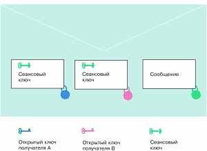{.center}

Асимметричные алгоритмы позволяют легко обменяться ключами шифрования по
открытому каналу связи - но работают слишком медленно. Симметричные
алгоритмы работают быстро - но для обмена ключами требуют наличия
защищенного канала связи и, к тому же, нуждаются в частой смене ключей.
Поэтому в современных криптосистемах используются сильные стороны обоих
подходов. Так, для шифрования сообщения используется симметричный
алгоритм со случайным ключом шифрования, действующим только в пределах
одного сеанса, - сеансовым ключом. Чтобы впоследствии сообщение могло
быть расшифровано, сеансовый ключ подвергается шифрованию асимметричным
алгоритмом с использованием открытого ключа получателя сообщения.
Зашифрованный таким образом сеансовый ключ сохраняется вместе с
сообщением, образуя цифровой конверт. При необходимости цифровой конверт
может содержать сеансовый ключ в нескольких экземплярах - зашифрованный
открытыми ключами различных получателей (рис. 13).

### Создание сеансовых ключей

CryptoAPI позволяет генерировать сеансовые ключи случайным образом - эту
работу выполняет функция CryptGenKey, о которой шла речь ранее. Однако
при использовании этой возможности за пределами США и Канады приходится
учитывать американские ограничения на экспорт средств "сильной
криптографии". В частности, до января 2000 года был запрещен экспорт
программного обеспечения для шифрования с использованием ключей длиной
более 40 бит. Этим объясняется разработка Microsoft двух версий своего
криптопровайдера - базовой и расширенной. Базовая версия предназначалась
на экспорт и поддерживала симметричные ключи длиной 40 бит; расширенная
же версия (Microsoft Enhanced Cryptographic Provider) работала с
"полной" длиной ключа (128 бит). Поскольку алгоритм шифрования, как
правило, требует использования ключа строго определенной длины,
недостающее количество битв в урезанном "экспортном" ключе могло быть
заполнено либо нулями, либо случайными данными, которые предлагалось
передавать открыто.

В криптографической практике внесение в состав ключа определенной части
несекретных данных, которые сменяются несколько раз в ходе обработки
исходного или шифр-текста, используется для того, чтобы
воспрепятствовать взлому шифра атакой "по словарю". В английской
терминологии такие вставки называются salt values: их назначение -
"подсолить" ключ (с учетом нашей ментальности можно перевести как
"насолить" противнику). Поскольку этот термин используется и в
CryptoAPI, будем употреблять его в транслитерированном виде -
солт-значения.

Итак, CryptoAPI, в экспортном исполнении практически вынуждает нас
использовать солт-значения, составляющие бОльшую часть ключа - 88 бит из
128-ми для симметричных алгоритмов в RC2; и RC4. Конечно, при такой
эффективной длине ключа криптозащита не может считаться достаточно
надежной. В реальной ситуации выход один - воспользоваться
криптопровайдером, не ограничивающим длину ключа. Обладатели Windows XP
могут прибегнуть к услугам расширенных версий провайдера Microsoft
(Enhanced или Strong). Пользователям более старых версий Windows,
по-видимому, придется воспользоваться продуктами сторонних
разработчиков. Например, свои версии криптопровайдеров предлагают
российская компания ["Крипто-Про"](http://www.cryptopro.ru/) и шведская ["StreamSec"](http://www.streamsec.com/).
В Украине, насколько известно авторам, разработкой национального провайдера
криптографических услуг занимается коллектив харьковских ученых под
руководством профессора Горбенко, однако до широкого внедрения дело пока
не дошло. Тем не менее, благодаря архитектуре CryptoAPI, прикладные
программы могут разрабатываться и отлаживаться и с базовым провайдером
Microsoft - так как интерфейс взаимодействия остается неизменным.
Поэтому вернемся к обсуждению создания случайных сеансовых ключей.

Солт может быть сгенерирован вместе с ключом: для этого нужно в качестве
флага передать функции CryptGenKey (или CryptDeriveKey) константу
CRYPT\_CREATE\_SALT. Правда, при сохранении ключа (с помощью функции
CryptExportKey) система уже не заботится о солт-значении, перекладывая
ответственность на прикладную программу. Таким образом, корректная
процедура создания и сохранения симметричного ключа предполагает:

1. при создании ключа функции CryptGenKey передается значение флага
   CRYPT\_EXPORTABLE or CRYPT\_CREATE\_SALT;
2. с помощью функции CryptGetKeyParam с параметром KP\_SALT
   сгенерированное солт-значение сохраняется в буфере;
3. ключ в зашифрованном виде сохраняется в буфере при помощи функции
   CryptExportKey, которой передается открытый ключ обмена ключами
   адресата;
4. зашифрованные ключевые данные сохраняются или передаются адресату
   вместе с экспортированным на втором шаге солт-значением.

С другой стороны, солт-значение может быть сгенерировано и отдельно от
ключа. Для этого используется функция CryptGenRandom (провайдер, длина,
буфер). Здесь параметр длина задает размер генерируемой случайной
последовательности в байтах, а последний аргумент задает адрес буфера, в
который будет записан результат. Полученное таким образом солт-значение
может быть внесено в ключ с помощью функции CryptSetKeyParam (ключ,
параметр, данные, флаги). Ей вторым аргументом нужно передать KP\_SALT,
а третьим - адрес буфера, содержащего сгенерированную
последовательность. (Последний аргумент функции зарезервирован на
будущее и должен быть равен нулю.)

### Блочные шифры

Блочные шифры считаются более надежными, нежели поточные, поскольку
каждый блок текста подвергается сложным преобразованиям. Тем не менее,
одних только этих преобразований оказывается недостаточно для
обеспечения должного уровня безопасности - важно, каким образом они
применяются к исходному тексту в процессе шифрования.

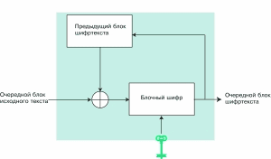{.center}

Наиболее простой и интуитивно понятный способ состоит в том, чтобы
разбить исходный текст на блоки соответствующего размера, а затем
отдельно каждый блок подвергнуть шифрующему преобразованию. Такой режим
использования блочных шифров называют электронной кодовой книгой (ECB -
electronic codebook). Его главный недостаток состоит в том, что
одинаковые блоки исходного текста при шифровании дадут одинаковые же
блоки шифр-текста - а это может существенно облегчить противнику задачу
взлома. Поэтому режим ECB не рекомендуется использовать при шифровании
текстов, по длине превышающих один блок - в таких случаях лучше
воспользоваться одним из режимов, связывающих различные блоки между
собой. По умолчанию в CryptoAPI блочные шифры используются в режиме
сцепления блоков шифр-текста (CBC - cipher block chaining). В этом
режиме при шифровании очередной блок исходного текста вначале
комбинируется с предыдущим блоком шифр-текста (при помощи побитового
исключающего ИЛИ), а затем полученная последовательность битов поступает
на вход блочного шифра (рис. 14). Образующийся на выходе блок
шифр-текста используется для шифрования следующего блока. Самый первый
блок исходного текста также должен быть скомбинирован с некоторой
последовательностью битов, но "предыдущего блока шифр-текста" еще нет;
поэтому режимы шифрования с обратной связью требуют использования еще
одного параметра - он называется инициализирующим вектором (IV -
initialization vector).

Инициализирующий вектор должен генерироваться отдельно с помощью уже
известной нам функции CryptGenRandom и, как и солт-значение,
передаваться вместе с ключом в открытом виде. Размер IV равен длине
блока шифра. Например, для алгоритма RC2, поддерживаемого базовым
криптопровайдером Microsoft, размер блока составляет 64 бита (8 байтов).

### От слов - к делу

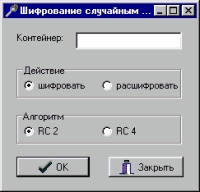{.center}

Настало время применить все сказанное на практике, создав приложение,
предназначенное для шифрования и расшифровки файлов с использованием
случайных сеансовых ключей. Окно приложения показано на рис. 15. Для
успешной работы программы нужно создать на компьютере собственный
ключевой контейнер, экспортировать из него открытый ключ обмена ключами
и обменяться открытыми ключами с адресатом. Все эти операции подробно
обсуждались ранее. В простейшем случае "отправитель" сообщения может
являться и "получателем" - тогда нужно просто экспортировать свой
открытый ключ обмена ключами и сохранить его в каком-нибудь файле на
диске.

{.center}

Шифруемый файл помещается в цифровой конверт. Как мы знаем, вместе с
ключом необходимо сохранить солт-значение, а при использовании блочного
шифра - еще и инициализирующий вектор. В соответствии с этим наш
цифровой конверт будет иметь структуру, показанную на рис. 16.

Приведем основные фрагменты процедуры, осуществляющей шифрование и
расшифровку файла (обработка ошибок опущена):

```delphi
procedure TMainForm.BitBtn1Click (Sender: TObject);
var
  hProv: HCRYPTPROV;
  KeyExchKey, SessionKey: HCRYPTKEY;
  flag, keyLen: DWORD;
  infile, outfile: file;
  tmp: PBYTE;
  buf: array [0..511] of Byte;
  alg: ALG_ID;
  stream: Boolean;
begin
  { подключение к криптопровайдеру }

  { шифрование }
  if ActionRadioGroup.ItemIndex = 0 then
  begin
    OpenDlg.Title := 'Укажите файл для шифрования';
    if OpenDlg.Execute then
      AssignFile(infile, OpenDlg.FileName)
    else
      exit;
    OpenDlg.Title := 'Укажите файл с открытым ключом обмена ключами получателя';
    if OpenDlg.Execute then
    begin
      AssignFile(outfile, OpenDlg.FileName);
      Reset(outfile, 1);
      keyLen := FileSize (outfile);
      GetMem(tmp, keyLen);
      BlockRead(outfile, tmp^, keyLen);
      CloseFile(outfile);
    end
    else
      exit;
    CryptImportKey(hProv, tmp, keyLen, 0, 0, @KeyExchKey);
    FreeMem(tmp, keyLen);
    SaveDlg.Title := 'Задайте имя файла для зашифрованных данных';
    if SaveDlg.Execute then
      AssignFile(outfile, SaveDlg.FileName)
    else
      exit;
    Rewrite(outfile, 1);
    { установка алгоритма шифрования }
    case AlgRadioGroup.ItemIndex of
      0:
      begin
        alg := CALG_RC2;  { алгоритм RC2 }
        stream := False;  { блочный шифр }
      end;
      1:
      begin
        alg := CALG_RC4;  { алгоритм RC4 }
        stream := True;	  { поточный шифр }
      end;
    end;
    { создание сеансового ключа }
    CryptGenKey(hProv, alg, CRYPT_EXPORTABLE or CRYPT_CREATE_SALT, @SessionKey);
    { размер буфера "с запасом" }
    keyLen := 128;
    GetMem(tmp, keyLen);
    CryptExportKey(SessionKey, KeyExchKey, SIMPLEBLOB, 0, tmp, @keyLen);
    BlockWrite(outfile, keyLen, 4);	{ запись в файл размера ключа }
    BlockWrite(outfile, tmp^, keyLen);	{ и самого зашифрованного ключа }
    CryptDestroyKey(KeyExchKey);
    { размер буфера "с запасом" }
    keyLen := 512;
    CryptGetKeyParam(SessionKey, KP_SALT, @buf, @keyLen, 0);
    BlockWrite(outfile, keyLen, 4); 	{ запись в файл размера солта }
    BlockWrite(outfile, buf, keyLen); 	{ и самого солт-значения }
    { если шифр - блочный }
    if not stream then
    begin
      // генерируем IV
      keyLen := 512; { размер буфера "с запасом" }
      // запрос IV ради выяснения его размера
      CryptGetKeyParam(SessionKey, KP_IV, @buf, @keyLen, 0);
      CryptGenRandom(hProv, keyLen, @buf); { генерация IV }
      CryptSetKeyParam(SessionKey, KP_IV, @buf, 0);
      BlockWrite(outfile, keyLen, 4);   { запись в файл размера IV }
      BlockWrite(outfile, buf, keyLen); { и самого IV }
    end;
    Reset(infile, 1);
    { собственно шифрование и запись в файл }
    while not Eof(infile) do
    begin
      BlockRead(infile, buf, 496, keyLen);
      CryptEncrypt(SessionKey, 0, Eof(infile), 0, @buf, @keyLen, 512);
      BlockWrite(outfile, buf, keyLen);
    end;
    CloseFile(infile);
    CloseFile(outfile);
    CryptDestroyKey(SessionKey);
  end
  else { расшифровывание }
  begin
    { получаем дескриптор своего ключа обмена ключами }
    CryptGetUserKey(hProv, AT_KEYEXCHANGE, @KeyExchKey);
    OpenDlg.Title := 'Укажите файл с зашифрованными данными';
    if OpenDlg.Execute then
      AssignFile(infile, OpenDlg.FileName)
    else
      exit;
    Reset(infile, 1);
    BlockRead(infile, keyLen, 4);  { читаем размер ключа }
    GetMem(tmp, keyLen);
    BlockRead(infile, tmp^, keyLen);  { читаем сам ключ }
    CryptImportKey(hProv, tmp, keyLen, KeyExchKey, 0, @SessionKey);
    FreeMem(tmp, keyLen);
    CryptDestroyKey(KeyExchKey);
    BlockRead(infile, keyLen, 4);  { читаем солт-значение }
    BlockRead(infile, buf, keyLen);
    CryptSetKeyParam(SessionKey, KP_SALT, @buf, 0);
    keyLen := 4;
    { выясняем алгоритм шифрования }
    CryptGetKeyParam(SessionKey, KP_ALGID, @alg, @keyLen, 0);
    case alg of
      CALG_RC2: stream:= False;
      CALG_RC4: stream:= True;
    end;
    { если шифр - блочный }
    if not stream then
    begin
      // читаем и устанавливаем IV
      BlockRead(infile, keyLen, 4);
      BlockRead(infile, buf, keyLen);
      CryptSetKeyParam(SessionKey, KP_IV, @buf, 0);
    end;
    SaveDlg.Title := 'Задайте имя файла для расшифрованных данных';
    if SaveDlg.Execute then
    begin
      AssignFile(outfile, SaveDlg.FileName);
      Rewrite(outfile, 1);
      while not Eof(infile) do
      begin
        { собственно расшифровывание }
        BlockRead(infile, buf, 512, keyLen);
        CryptDecrypt(SessionKey, 0, Eof(infile), 0, @buf, @keyLen);
        BlockWrite(outfile, buf, keyLen);
      end;
      CloseFile(outfile);
    end;
    CloseFile(infile);
    CryptDestroyKey(SessionKey);
  end;
  CryptReleaseContext(hProv, 0);
end;
```

Полный Delphi-проект можно взять [здесь](Project03.zip).

В рассмотренной нами процедуре обмена шифрованными сообщениями остается
одно слабое звено - обмен открытыми ключами. Ведь при этом мы не
обеспечиваем подлинность полученного ключа - во время пересылки его
может подменить злоумышленник. CryptoAPI для решения этой проблемы
предполагает использование сертификатов. Но об этом - в следующий раз.


## Часть 4


Что такое сертификат? Какова его роль в защите информации?
И, самое главное, - как можно использовать на практике механизм сертификации?
Об этом и пойдет речь в нашей статье

Предположим, две стороны (назовем их по традиции Алисой и Бобом)
решили обменяться открытыми ключами по незащищенному каналу связи,
например по телефонной линии или интернету.
Некто третий (по имени Ева) во время пересылки может подменить ключи
и получить таким образом доступ к секретной переписке.
Чтобы исключить эту угрозу безопасности,
нужно иметь возможность подтвердить подлинность полученного открытого ключа.
Для этого и предусмотрены сертификаты.

### Сертификаты

Представим себе, что существует организация, которой Боб полностью доверяет. Назовем ее Центром сертификации (Certification Authority). Алиса отсылает свой открытый ключ в Центр сертификации (ЦС). Там у нее запрашивают документы и устанавливают, действительно ли она та особа, за которую себя выдает. Затем ЦС генерирует электронный документ, содержащий информацию об Алисе и ее открытый ключ, и подписывает его своим закрытым ключом. Этот цифровой документ и является сертификатом. Сертификат может не только служить для аутентификации личности (как в случае с Алисой), но и подтверждать подлинность оборудования, веб-сайта, организации и т.п. Поэтому набор сведений, входящих в его состав, может изменяться и удовлетворять одному из стандартов.

Как правило, сертификат содержит следующие данные:

- серийный номер сертификата;
- ФИО (название) владельца сертификата;
- открытый ключ владельца;
- срок действия (даты начала и конца пригодности сертификата);
- название ЦС;
- электронная цифровая подпись ЦС.

Итак, ЦС удостоверяет личность Алисы и своей подписью заверяет связь между ней и ее ключом.

Поскольку сведения об Алисе подписаны, Боб может убедиться в их целостности. Для этого ему нужно обратиться в ЦС и проверить цифровую подпись, входящую в состав сертификата. Даже если Ева, о который мы упомянули вначале, перехватит сертификат и изменит сведения об Алисе, то ей придется подделывать подпись ЦС. Кроме того, Боб тоже может получить в ЦС "электронное удостоверение личности" - и тогда уверенностью в подлинности открытых ключей будут обладать оба корреспондента.

Остался один невыясненный вопрос: на чем держится доверие к Центру сертификации? Если Алиса и Боб - сотрудники одной и той же организации, а переписку ведут в деловых целях, то в качестве ЦС может выступить сама организация. Для этого ей потребуется обзавестись штатным специалистом по защите информации и поручить ему выполнение всех процедур, связанных с выдачей и проверкой сертификатов. Ну а на чем должно основываться доверие фирмы к своему сотруднику, думаем, объяснять не нужно.

В случае же, если Алиса и Боб - представители различных организаций, им придется обращаться в независимый центр сертификации. Деятельность таких центров, как правило, лицензируется службами безопасности страны или другими государственными органами. Например, украинские организации, работающие в сфере защиты информации, должны получить лицензию СБУ. Сертификату, выданному таким ЦС, можно доверять в той же степени, в какой вы доверяете паспорту гражданина некого государства.

Центры сертификации могут находиться в различных странах, работать с различным программным обеспечением, поддерживать разные стандарты сертификатов и отличающиеся процедуры их выдачи. Поэтому возникает необходимость наладить отношения доверия между самими ЦС. Эта система доверительных отношений может строиться по иерархическому принципу. Существует небольшое число ЦС, называющихся корневыми (Root Certification Authority). Они удостоверяют сертификаты дочерних центров, которые, в свою очередь, подтверждают подлинность других ЦС и т.д. В глобальном масштабе структура ЦС представляет собой несколько иерархий (см. рис. 1).

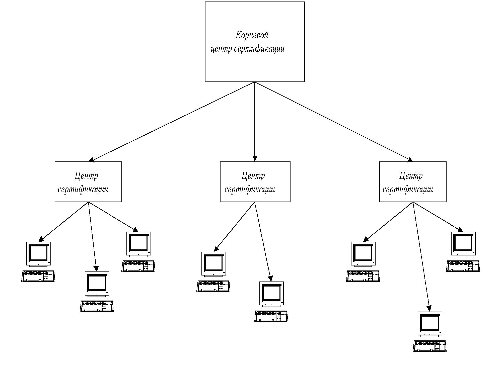


### Поддержка сертификатов в CryptoAPI

Рассмотрим решение основных задач, возникающих при выпуске и обслуживании сертификатов на уровне библиотеки ОС Windows - CryptoAPI. Кстати говоря, для "внутреннего" употребления сертификатов (в рамках одной организации) процедуру лицензирования проходить не нужно. Никто ведь не может запретить вам обмениваться файлами, которые по секрету от СБУ вы будете считать цифровыми документами.

Чтобы обзавестись собственным сертификатом, прежде всего нужно создать запрос специального формата, который должен содержать ваше имя, открытые ключи обмена ключами и подписи. Этот запрос подписывается отправителем при помощи личного закрытого ключа и отсылается в центр сертификации.


### Запрос на получение сертификата

Рассмотрим процесс создания запроса более подробно. Для хранения данных запроса в CryptoAPI предназначена специальная структура - CERT_REQUEST_INFO. Она содержит ссылки на другие структуры, хранящие имя владельца сертификата, информацию об открытых ключах и, возможно, некоторые дополнительные атрибуты (рис. 2).

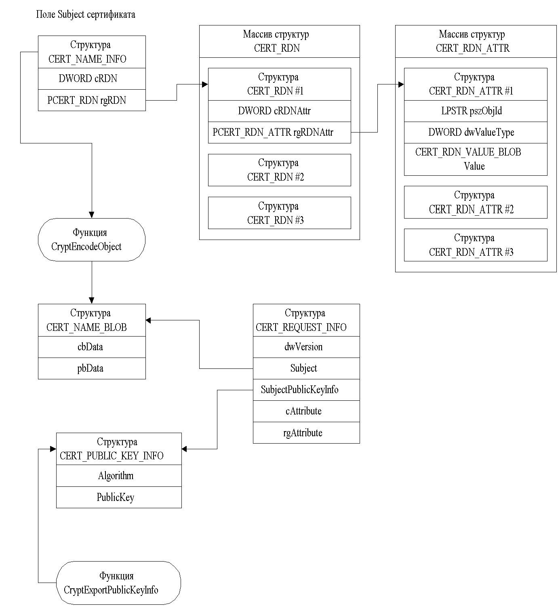{.center}

В результате для создания запроса сертификата следует выполнить следующие шаги:

1. Создать строку, содержащую поле Subject сертификата.
2. Создать массив структур CERT_RDN_ATTR (в простейшем случае он будет состоять из единственного элемента) и инициализировать каждый его элемент следующими данными: строкой идентификатора объекта, типом хранимого значения, длиной строки, созданной на первом шаге, и самой этой строкой, приведенной к типу PBYTE. Аббревиатура RDN означает Relative Distinguished Name (относительные отличительные признаки). Структура RDN может хранить, например, имя пользователя, адрес, страну, наименование подразделения организации и т.п. При этом хранимые данные характеризуются идентифицирующей строкой: скажем, имя владельца сертификата должно иметь строку-идентификатор "2.5.4.3", двухбуквенный код страны - "2.5.4.6", и т.д. (подробное описание можно найти в справке по CryptoAPI). Способ представления данных строки описывается типом хранимого значения - например, CERT_RDN_PRINTABLE_STRING или CERT_RDN_ENCODED_BLOB.
3. Создать массив структур CERT_RDN (в простейшем случае и он будет содержать лишь один элемент) и инициализировать каждый его элемент количеством элементов в соответствующем массиве CERT_RDN_ATTR, созданном на шаге 2, и ссылкой на первый элемент этого массива.
4. Создать структуру CERT_NAME_INFO и инициализировать ее поля значениями количества элементов массива, созданного на шаге 3, и ссылкой на первый элемент этого массива.
5. Вызвать функцию CryptEncodeObject, передав ей в качестве соответствующего параметра структуру CERT_NAME_INFO из шага 4. Результатом работы функции будет структура типа CERT_NAME_BLOB, содержащая входную информацию в закодированном виде. При обращении к функции следует указать тип кодировки; документация по CryptoAPI рекомендует использовать кодировку в виде комбинации следующих констант: PKCS_7_ASN_ENCODING or X509_ASN_ENCODING (другие типы могут не поддерживаться).
6. Записать в поле Subject структуры CERT_REQUEST_INFO ссылку на структуру CERT_NANE_BLOB, созданную и инициализированную на шаге 5.
7. Если в запрос сертификата должна быть включена некоторая дополнительная информация, нужно поместить ее в заранее созданный массив структур CRYPT_ATTR_BLOB, а ссылками на такие массивы инициализировать массив CRYPT_ATTRIBUTE. Ссылка на последний массив и количество элементов в нем записывается в соответствующие поля структуры CERT_REQUEST_INFO. Для ясности изложения этот этап рассматривать не будем.
8. В структуру CERT_REQUEST_INFO необходимо вписать номер версии сертификата. CryptoAPI поддерживает сертификаты трех версий:
    - 1 - сертификат содержит минимальный набор данных (работу именно с такими сертификатами мы и рассмотрим);
    - 2 - сертификат содержит дополнительно уникальные идентификаторы владельца и издателя;
    - 3 - сертификат включает дополнительную информацию об издателе (Центре сертификации), например его адрес электронной почты или лицензию на выпуск сертификатов.
9. Вызвать функцию CryptExportPublicKeyInfo, которая вернет инициализированную структуру CERT_PUBLIC_KEY_INFO, содержащую открытые части ключей пользователя.
10. Записать в поле SubjectPublicKeyInfo структуры CERT_REQUEST_INFO ссылку на структуру, созданную на шаге 9.
11. Вызвать функцию CryptSignAndEncodeCertificate, передав ей в качестве аргумента структуру CERT_REQUEST_INFO. Эта функция закодирует структуру CERT_REQUEST_INFO и все данные, на которые в этой структуре имеются ссылки, подпишет эту закодированную информацию и еще раз закодирует уже подписанные данные.

Полученный в результате подписанный и закодированный запрос сертификата нужно сохранить в файле и отправить в центр сертификации. Далее приведен текст процедуры (без обработки ошибок), реализующей описанный выше алгоритм:

```delphi
{ SubjectEdit - поле формы, в которое пользователь вводит текст
  поля Subject сертификата; поле формы ContainerEdit может содержать
  имя контейнера ключей (если остается пустым, используется контейнер
  по умолчанию) }
procedure TCreateReqForm.OKBtnClick(Sender: TObject);
var
  nameAttr: CERT_RDN_ATTR;
  nameString: PChar;
  rdn: CERT_RDN;
  nameInfo: CERT_NAME_INFO;
  certReqInfo: CERT_REQUEST_INFO;
  subjNameBlob: CERT_NAME_BLOB;
  encNameLen: DWORD;
  encName: PBYTE;
  prov: HCRYPTPROV;
  pubKeyInfoLen: DWORD;
  pubKeyInfo: PCERT_PUBLIC_KEY_INFO;
  encCertReqLen: DWORD;
  params: CRYPT_OBJID_BLOB;
  sigAlg: CRYPT_ALGORITHM_IDENTIFIER;
  signedEncCertReq: PBYTE;
  cont: PChar;
  err: string;
  encType: DWORD;
  f: file;
begin
  encType := PKCS_7_ASN_ENCODING or X509_ASN_ENCODING;
  nameString := StrAlloc(Length(SubjectEdit.Text) + 1);
  StrPCopy(nameString, SubjectEdit.Text);
  nameAttr.pszObjId := '2.5.4.3';
  nameAttr.dwValueType := CERT_RDN_PRINTABLE_STRING;
  nameAttr.Value.cbData := Length(SubjectEdit.Text);
  nameAttr.Value.pbData := PBYTE(nameString);
  rdn.cRDNAttr := 1;
  rdn.rgRDNAttr := @nameAttr;
  nameInfo.cRDN := 1;
  nameInfo.rgRDN := @rdn;
  { выясняем размер закодированного имени пользователя }
  CryptEncodeObject(encType, X509_NAME, @nameInfo, nil, @encNameLen) or (encNameLen < 1);
  GetMem(encName, encNameLen);
  { кодируем имя пользователя }
  CryptEncodeObject(PKCS_7_ASN_ENCODING or X509_ASN_ENCODING, X509_NAME, @nameInfo, encName, @encNameLen) or (encNameLen < 1);
  subjNameBlob.cbData := encNameLen;
  subjNameBlob.pbData := encName;
  certReqInfo.Subject := subjNameBlob;
  certReqInfo.cAttribute := 0;
  certReqInfo.rgAttribute := nil;
  certReqInfo.dwVersion := CERT_REQUEST_V1;
  if Length(ContainerEdit.Text) = 0 then
    cont := nil
  else
  begin
    err := ContainerEdit.Text;
    cont := StrAlloc(Length(err) + 1);
    StrPCopy(cont, err);
  end;
  CryptAcquireContext(@prov, cont, nil, PROV_RSA_FULL, 0);
  CryptExportPublicKeyInfo(prov, AT_SIGNATURE, encType, nil, @pubKeyInfoLen);
  GetMem(pubKeyInfo, pubKeyInfoLen);
  CryptExportPublicKeyInfo(prov, AT_SIGNATURE, encType, pubKeyInfo, @pubKeyInfoLen);
  certReqInfo.SubjectPublicKeyInfo := pubKeyInfo^;
  FillChar(params, SizeOf(params), 0);
  sigAlg.pszObjId := szOID_OIWSEC_sha1RSASign;
  sigAlg.Parameters := params;
  CryptSignAndEncodeCertificate(prov, AT_SIGNATURE, encType, X509_CERT_REQUEST_TO_BE_SIGNED,
    @certReqInfo, @sigAlg, nil, nil, @encCertReqLen);
  GetMem(signedEncCertReq, encCertReqLen);
  CryptSignAndEncodeCertificate(prov, AT_SIGNATURE, encType, X509_CERT_REQUEST_TO_BE_SIGNED,
    @certReqInfo, @sigAlg, nil, signedEncCertReq, @encCertReqLen);
  if SaveDlg.Execute then
  begin
    AssignFile(f, SaveDlg.FileName);
    Rewrite(f, 1);
    BlockWrite(f, signedEncCertReq^, encCertReqLen);
    CloseFile(f);
  end;
  StrDispose(nameString);
  FreeMem(encName, encNameLen);
  if cont <> nil then
    StrDispose(cont);
  FreeMem(pubKeyInfo, pubKeyInfoLen);
  FreeMem(signedEncCertReq, encCertReqLen);
  CryptReleaseContext(prov, 0);
end;
```

Итак, запрос сертификата создан, но что с ним делать? Если вам нужен сертификат, который можно использовать для организации безопасной связи с зарубежными партнерами, нужно отправить созданный запрос в центр сертификации, предоставив необходимые подтверждающие личность документы и уплатив соответствующую сумму. Если вы собираетесь обмениваться только в рамках сети предприятия, располагающей сервером Windows 2000 и выше, можно воспользоваться Microsoft Certificate Server. Если же вашей целью, например, является только отладка программ, или если группа, внутри которой вы собираетесь организовать обмен информацией, располагает лишь компьютерами под Windows 98 (и ниже), то можно подписать сертификат самостоятельно.


### Подписание сертификата

При этом важно не забыть цель создания сертификата - он создавался, чтобы связь между именем пользователя и его открытым ключом удостоверялась подписью некоторой доверенной стороны. Такой "доверенный" пользователь внутри группы (будем называть его администратором) должен создать ключевую пару администратора и создать для нее сертификат, который он подписывает тем же закрытым ключом администратора. Этот сертификат называется корневым. Ключ администратора используется и для подписания сертификатов пользователей. Когда один пользователь хочет проверить подлинность сертификата другого пользователя, он проверяет подпись под ним администратора, используя для проверки тот самый корневой сертификат.

Итак, сделаем из только что созданного запроса сертификата подписанный корневой сертификат.
Это можно проделать при помощи функций CryptoAPI.
Сама процедура в документации даже не упоминается,
однако ее можно "вывести" из описания соответствующих функций.
Проследим ее на примере программы, позволяющей открыть файл с запросом сертификата,
проверить подпись под ним и выпустить подписанный сертификат с заданным сроком действия.
Программа управляется формой, показанной на рис. 3.

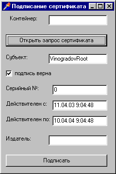{.center}

- Вначале необходимо открыть запрос и проверить подпись под ним.
- Проверяем, задано ли нестандартное имя контейнера, и подключаемся к криптопровайдеру.
- Открываем файл с закодированным запросом сертификата и считываем его содержимое в память (указатель reqEncoded).
- Декодируем запрос:

```delphi
var
  encType, size, rsize: DWORD;
  buf: PBYTE;
begin
  encType := PKCS_7_ASN_ENCODING or X509_ASN_ENCODING;
  GetMem(buf, 2048);
  rsize := 2048;
  CryptDecodeObject(encType, X509_CERT, reqEncoded, size, 0, buf, @rsize);
end;
```

- В декодированном запросе выделяем и декодируем информацию, предназначенную для подписания - уже знакомую нам структуру CERT_REQUEST_INFO:

```delphi
var
  p: pointer;
  signedContent: PCERT_SIGNED_CONTENT_INFO;
  DERBLOB: CRYPT_DER_BLOB;
  buf2: PBYTE;
  pCertReqInfo: PCERT_REQUEST_INFO;
begin
  p := buf;
  signedContent := p;
  DERBLOB := signedContent^.toBeSigned;
  rsize := 512;
  GetMem(buf2, rsize);
  CryptDecodeObject (encType, X509_CERT_REQUEST_TO_BE_SIGNED,
    DERBLOB.pbData, DERBLOB.cbData, 0, buf2, @rsize);
  p := buf2;
  pCertReqInfo := p;
end;
```

- Извлекаем из полученной информации строку с именем (названием) владельца сертификата, чтобы отобразить ее на форме:

```delphi
var
  subjNameBLOB: CERT_NAME_BLOB;
  subjNameString: PChar;
begin
  subjNameBLOB := pCertReqInfo^.Subject;
  rsize := CertNameToStr(encType, @subjNameBLOB, CERT_SIMPLE_NAME_STR, subjNameString, 512);
  subjectEdit.Text := subjNameString;
end;
```

- Проверяем подпись под запросом сертификата:

```delphi
signCheckBox.Checked := CryptVerifyCertificateSignature(prov, encType, reqEncoded, size, @(pCertReqInfo^.SubjectPublicKeyInfo));
```

- Напоследок - заполняем поля формы "Действителен с" и "Действителен по" текущей датой и датой, отстоящей на год вперед:

```delphi
NotBeforeEdit.Text := DateTimeToStr(Now);
NotAfterEdit.Text := DateTimeToStr(Now + 365);
```

- Освобождаем выделенную память и отключаемся от криптопровайдера.
- После того, как пользователь убедился в правильности подписи под запросом, откорректировал при необходимости срок действия создаваемого сертификата, указал его серийный номер, вписал название издателя (администратора, центра сертификации) и указал в поле "Контейнер" имя контейнера ключей администратора, начинаем процесс подписания. Для этого следует создать и заполнить структуру CERT_INFO, являющуюся, как сказано в документации, "сердцем сертификата" (рис. 4 - серым цветом обозначены поля, содержащие закодированную информацию).

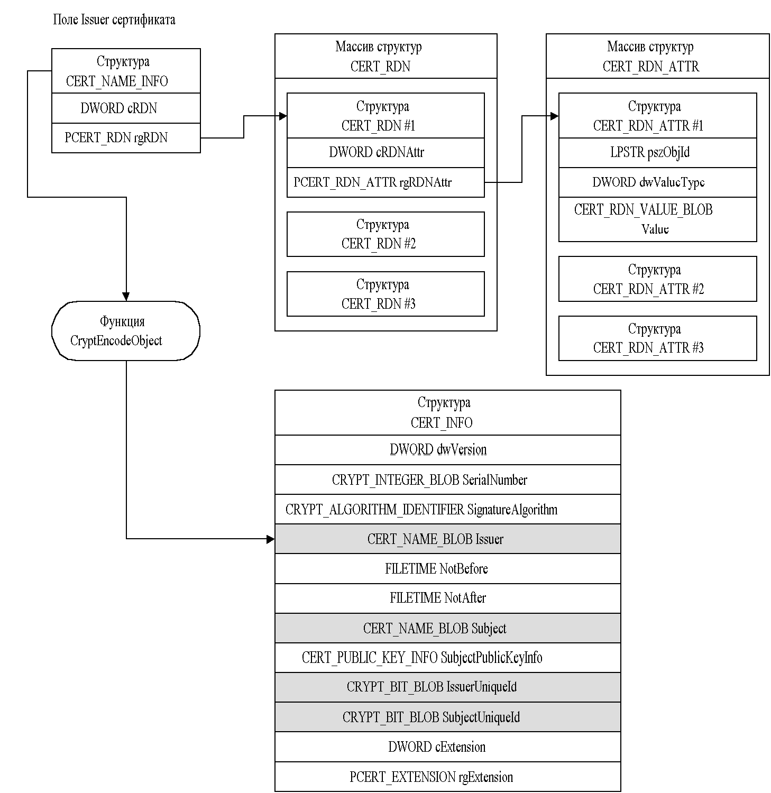{.center}

- Подключаемся к контейнеру ключей администратора.
- Заполняем поля сертификата, представленного структурой CERT_INFO:

```delphi
var
  certInfo: CERT_INFO;
  serNum: int64;
  params: CRYPT_OBJID_BLOB;
  nameStr: PChar;
  nameAttr: CERT_RDN_ATTR;
  rdn: CERT_RDN;
  nameInfo: CERT_NAME_INFO;
begin
  certInfo.dwVersion := CERT_V1; { версия 1 }
  serNum := StrToInt64(serNumEdit.Text);
  certInfo.SerialNumber.cbData := SizeOf(serNum);
  certInfo.SerialNumber.pbData := @serNum;
  FillChar(params, SizeOf(params), 0);
  certInfo.SignatureAlgorithm.pszObjId := szOID_OIWSEC_sha1RSASign;
  certInfo.SignatureAlgorithm.Parameters := params;
  nameStr := StrAlloc(Length(IssuerEdit.Text) + 1);
  StrPCopy(nameStr, IssuerEdit.Text);
  nameAttr.pszObjId := '2.5.4.3';
  nameAttr.dwValueType := CERT_RDN_PRINTABLE_STRING;
  nameAttr.Value.cbData := Length(IssuerEdit.Text);
  nameAttr.Value.pbData := PBYTE(nameStr);
  rdn.cRDNAttr := 1;
  rdn.rgRDNAttr := @nameAttr;
  nameInfo.cRDN := 1;
  nameInfo.rgRDN := @rdn;
end;
```

- Кодируем строку, содержащую название издателя сертификата:

```delphi
var
  encNameLen: DWORD;
  encName: PBYTE;
  issNameBLOB: CERT_NAME_BLOB;
begin
  CryptEncodeObject(encType, X509_NAME, @nameInfo, nil, @encNameLen);
  GetMem(encName, encNameLen);
  CryptEncodeObject(encType, X509_NAME, @nameInfo, encName, @encNameLen);
  issNameBlob.cbData := encNameLen;
  issNameBlob.pbData := encName;
  certInfo.Issuer := issNameBLOB;
end;
```

- Кодируем даты начала и конца срока действия сертификата:

```delphi
var
  sysTime: TSystemTime;
begin
  DateTimeToSystemTime(StrToDateTime(NotBeforeEdit.Text), sysTime);
  SystemTimeToFileTime(sysTime, certInfo.notBefore);
  DateTimeToSystemTime(StrToDateTime(NotAfterEdit.Text), sysTime);
  SystemTimeToFileTime(sysTime, certInfo.notAfter);
end;
```

- Поля сертификата, содержащие информацию о его владельце, заполняем на основании данных, содержащихся в декодированном запросе сертификата:

```delphi
  certInfo.Subject := pCertReqInfo.Subject;
  certInfo.SubjectPublicKeyInfo := pCertReqInfo.SubjectPublicKeyInfo;
```

- В неиспользуемые поля вписываем нули и пустые указатели:

```delphi
  certInfo.IssuerUniqueId.cbData := 0;
  certInfo.IssuerUniqueId.pbData := nil;
  certInfo.IssuerUniqueId.cUnusedBits := 0;
  certInfo.SubjectUniqueId.cbData := 0;
  certInfo.SubjectUniqueId.pbData := nil;
  certInfo.SubjectUniqueId.cUnusedBits := 0;
  certInfo.cExtension := 0;
  certInfo.rgExtension := nil;
```

- Подписываем и кодируем сертификат:

```delphi
var
  encCertLen: DWORD;
  encCert: PByte;
begin
  CryptSignAndEncodeCertificate(prov, AT_SIGNATURE, encType,
    X509_CERT_TO_BE_SIGNED, @certInfo,
    @(certInfo.SignatureAlgorithm), 
    nil, nil, @encCertLen);
  GetMem(encCert, encCertLen);
  CryptSignAndEncodeCertificate(prov, AT_SIGNATURE, encType,
    X509_CERT_TO_BE_SIGNED, @certInfo, 
    @(certInfo.SignatureAlgorithm), nil, 
    encCert, @encCertLen);
end;
```

- Сохраняем подписанный и закодированный сертификат в файле, освобождаем память и дескриптор криптопровайдера.

### Хранение сертификатов

Созданный сертификат владелец может отправлять своим корреспондентам для организации безопасной связи. Чтобы сделать полученный сертификат доступным системе, его нужно поместить в одно из хранилищ сертификатов. Windows предусматривает существование нескольких системных хранилищ сертификатов: MY (для хранения сертификатов отдельного пользователя), СА (от Certification Authority - для хранения сертификатов центров сертификации) и ROOT (для хранения корневых сертификатов). Открытое (загруженное в память) хранилище сертификатов представляет собой связанный список блоков данных, каждый из которых содержит ссылку на следующий блок и на данные сертификата. Каждое хранилище сертификатов физически размещается либо в отдельном файле, либо в реестре Windows. При этом для работы с системными хранилищами не нужно знать их местоположения - достаточно указать приведенные выше имена.

Для помещения сохраненного в файле подписанного сертификата в системное хранилище нужно выполнить следующие шаги.

- Открыть файл и считать его содержимое в буфер.

- При помощи специальной функции создать контекст сертификата:

```delphi
var
  encCertLen: DWORD; // размер закодированного сертификата
  encCert: PByte; // данные сертификата
  context: PCCERT_CONTEXT;
  encType: DWORD;
  store: HCERTSTORE;
begin
  { Открыть файл и считать его содержимое в буфер. }

  { При помощи специальной функции создать контекст сертификата: }
  encType:= PKCS_7_ASN_ENCODING or X509_ASN_ENCODING;
  context := CertCreateCertificateContext(encType, encCert, encCertLen);

  { Открыть системное хранилище сертификатов: }
  store := CertOpenSystemStore(0, 'MY');

  { Добавить контекст сертификата в открытое хранилище: }
  n := nil;
  CertAddCertificateContextToStore(store, context, CERT_STORE_ADD_REPLACE_EXISTING, n);
end;
```

Функции CertAddCertificateContextToStore, кроме дескрипторов хранилища и добавляемого контекста сертификата, передается параметр, определяющий действия системы в том случае, если в данном хранилище уже имеется идентичный сертификат. Использованная константа CERT_STORE_ADD_REPLACE_EXISTING предписывает в таком случае удалить старый сертификат и заменить его новым. Последний параметр функции позволяет получить указатель на указатель на копию сертификата, созданную при добавлении контекста в хранилище (если параметр равен пустому указателю, то ссылка не возвращается).

- Закрыть хранилище, освободить контекст сертификата и память.

```delphi
CertCloseStore(store, 0);
CertFreeCertificateContext(context);
FreeMem(encCert, encCertLen);
```

Просмотреть имеющиеся в хранилище сертификаты можно с помощью функции CertEnumCertificatesInStore. Ей нужно передать дескриптор нужного хранилища и, при первом вызове, пустой указатель, а при последующих - указатель на предыдущий сертификат. Например, для просмотра содержимого одного из системных хранилищ сертификатов может быть использован следующий фрагмент программы (форма, из которой он вызывается, с результатами работы показана на рис. 5):

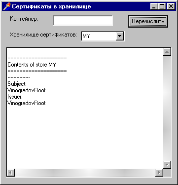


```delphi
var
  store: HCERTSTORE;
  cont, stor: PChar;
  err: string;
  cert: PCCERT_CONTEXT;
  nameString: PChar;
  size: DWORD;
  nameBLOB: CERT_NAME_BLOB;
begin
  { подключение к криптопровайдеру считается выполненным! }
  err:= CertStoreBox.Text;
  RepMemo.Lines.Add('');
  RepMemo.Lines.Add('====================');
  RepMemo.Lines.Add('Contents of store ' + err);
  RepMemo.Lines.Add('====================');
  stor := StrAlloc(Length(err) + 1);
  StrPCopy(stor, err);
  store := CertOpenSystemStore(prov, stor);
  cert := CertEnumCertificatesInStore(store, nil);
  nameString := StrAlloc(512);
  while cert <> nil do
  begin
    RepMemo.Lines.Add('---------------');
    RepMemo.Lines.Add('Subject:');
    nameBLOB := cert^.pCertInfo^.Subject;
    size := CertNameToStr(encType, @nameBlob, CERT_SIMPLE_NAME_STR, nameString, 512);
    if size > 1 then
      RepMemo.Lines.Add(nameString)
    else
      RepMemo.Lines.Add('Error');
    RepMemo.Lines.Add('Issuer:');
    nameBLOB := cert^.pCertInfo^.Issuer;
    size := CertNameToStr(encType, @nameBlob, CERT_SIMPLE_NAME_STR, nameString, 512);
    if size > 1 then
      RepMemo.Lines.Add(nameString)
    else
      RepMemo.Lines.Add('Error');
    cert := CertEnumCertificatesInStore(store, cert);
  end;
  StrDispose(nameString);
end;
```

### Проверка сертификата

Получив новый сертификат, конечно, следует убедиться в корректности подписи под ним. При этом сам сертификат, скорее всего, будет помещен в личное хранилище пользователя (MY), а сертификат его издателя может находиться в хранилищах CA или ROOT. Кстати, при установке Windows в эти хранилища помещается множество сертификатов признанных центров сертификации, список которых можно просмотреть при помощи приведенной выше программы.

Для выполнения проверки следует считать из проверяемого сертификата строку с именем его издателя и найти в одном из системных хранилищ его сертификат. Для облегчения операции поиска в нескольких хранилищах CryptoAPI 2.0 поддерживает механизм коллекций (или логических хранилищ) сертификатов. Коллекция может объединять данные из нескольких физических хранилищ и выполнять операции над всеми их сертификатами одновременно. Кстати говоря, в Windows 2000 и выше системные хранилища сертификатов сами представляют собой коллекции.

Поиск сертификата издателя и проверка заданного сертификата выполняются одновременно функцией CertGetIssuerCertificateFromStore. Ей следует передать дескриптор хранилища сертификатов, ссылку на контекст проверяемого сертификата, возможно - ссылку на предыдущий найденный сертификат издателя (если вызов функции производится повторно) и ссылку на флаговую переменную. Эта переменная при вызове функции задает режим проверки, а при возврате - служит индикатором успеха проверки. Функция поддерживает несколько режимов проверки, которые могут комбинироваться; мы воспользуемся сочетанием двух из них - CERT_STORE_SIGNATURE_FLAG (проверить подпись издателя под заданным сертификатом) и CERT_STORE_TIME_VALIDITY_FLAG (проверить срок действия заданного сертификата).

Рассмотрим процедуру проверки сертификата с заданным полем Subject на примере программы.

- Подключаемся к криптопровайдеру.
- Открываем выбранное хранилище сертификатов.
- Считываем из формы поле Subject и ищем соответствующий сертификат в хранилище:

```delphi
{subj: PWideChar;
 err: string;
 cert: PCCERT_CONTEXT;
 тип и значение encType - см. выше}
err := SubjectEdit.Text;
GetMem(subj, 2 * Length(err) + 1);
StringToWideChar(err, subj, 2 * Length(err) + 1);
cert := CertFindCertificateInStore(store, encType, 0, CERT_FIND_SUBJECT_STR, subj, nil);
FreeMem(subj, 2 * Length(err) + 1);
if cert = nil then
begin
  MessageDlg('Certificate not found', mtError, [mbOK], 0);
  CertCloseStore(store, 0);
  exit;
end;
```

- Создаем коллекцию (логическое хранилище) сертификатов:

```delphi
{collect: HCERTSTORE;}
collect := CertOpenStore(CERT_STORE_PROV_COLLECTION, 0, 0, 0, nil);
```

- Открываем и помещаем в коллекцию интересующие нас системные хранилища сертификатов - MY, CA, ROOT:

```delphi
{mystore, castore, rootstore: HCERTSTORE;}
mystore := CertOpenSystemStore(prov, 'MY');
CertAddStoreToCollection(collect, mystore, 0, 0);
castore := CertOpenSystemStore(prov, 'CA');
CertAddStoreToCollection(collect, castore, 0, 2);
rootstore := CertOpenSystemStore(prov, 'ROOT');
CertAddStoreToCollection(collect, rootstore, 0, 1)
```

Последним параметром функции CertAddStoreToCollection задается приоритет добавляемого хранилища в коллекции. Мы ожидаем, что сертификат издателя окажется в хранилище СА, поэтому для этого хранилища задан самый высокий приоритет, для ROOT - более низкий, а для MY - низший.

- Устанавливаем режим проверки:

```delphi
{flags: DWORD;}
flags := CERT_STORE_SIGNATURE_FLAG or CERT_STORE_TIME_VALIDITY_FLAG;
```

- Выполняем поиск сертификата издателя и проверку заданного сертификата:

```delphi
{icert: PCCERT_CONTEXT;}
icert := CertGetIssuerCertificateFromStore(collect, cert, nil, @flags);
if icert = nil then
begin
  case Int64(GetLastError) of
    CRYPT_E_NOT_FOUND: MessageDlg('Issuer certificate not found',  mtError, [mbOK], 0);
    CRYPT_E_SELF_SIGNED: MessageDlg('This is root certificate',  mtWarning, [mbOK], 0);
  else
    MessageDlg('Invalid arguments', mtError, [mbOK], 0);
  end;
end
else if flags = 0 then
  MessageDlg('Certificate is valid', mtInformation, [mbOK], 0)
else
  MessageDlg('Certificate is invalid', mtError, [mbOK], 0);
```

В результате при правильном обращении к функции может возникнуть одна из четырех ситуаций:

- сертификат издателя не найден - в этом случае нужно узнать издателя данного сертификата (по строке, выдаваемой, например, рассмотренной выше программой просмотра содержимого хранилища) и на его сайте взять сертификат для проверки;
- проверяемый сертификат является корневым - использование таких сертификатов (если, конечно, это не ваш собственный сертификат, созданный под впечатлением этой статьи) требует предельного внимания, так как в этом случае подлинность данных сертификата ничем не подтверждается. Принимая такой сертификат, вы должны любыми путями убедиться, что он поступил из надежного источника (например, был помещен в хранилище ROOT при установке Windows). В противном случае вы рискуете подвергнуться такой, например, атаке: злоумышленник может прислать вам по электронной почте сообщение об обновлении корневого сертификата, заменит своими данными хранящийся у вас сертификат и сможет присылать вам фальшивые сертификаты пользователей, якобы заверенные подписью корневого центра сертификации;
- сертификат верен - подпись издателя под проверяемым сертификатом верна, срок действия проверяемого сертификата включает текущую системную дату;
- сертификат не прошел проверку - проверяемый сертификат либо просрочен, либо является подделкой. Правда, возможен еще один вариант: издатель имеет несколько сертификатов - и проверяемый сертификат подписан с использованием ключа из другого сертификата данного издателя. В таком случае нужно вызвать функцию CertGetIssuerCertificateFromStore повторно, передав в качестве третьего параметра контекст текущего сертификата издателя.

Итак, мы рассмотрели механизмы создания и управления сертификатами безопасности на основе CryptoAPI. Используя сертификаты, вы сможете выполнять действия с сообщениями при помощи многочисленных функций CryptoAPI, автоматизирующих процессы шифрования и расшифровки, подписания и проверки подписи, и представляющие результаты своих действий в соответствии с существующими стандартами.

Приложение. [Архив (rar, 84,3 KB)](project4.rar)


