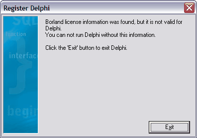

Проблемы регистрации Delphi
===========================

::: {.date}
01.01.2007
:::

>После горячей перезагрузки компьютера Delphi 7 при запуске стала
>выдавать такое окошечко:
>
>{.center}
>
>Переустановка не помогла. Подскажите, как решить проблему.

**Ответ 1.**
С файлом чистки реестра соседствует программа регистрации D7Reg.exe.
Она и позволяет ввести ключ заново.

Автор: Domino

**Ответ 2.**
Вообще можно просто один раз сохранить файлы из

    c:\Documents and Settings\username\.borland\

и жить спокойно

Автор: andrey\_pst

Взято из <https://forum.sources.ru>
