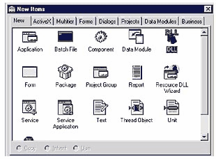
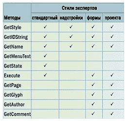
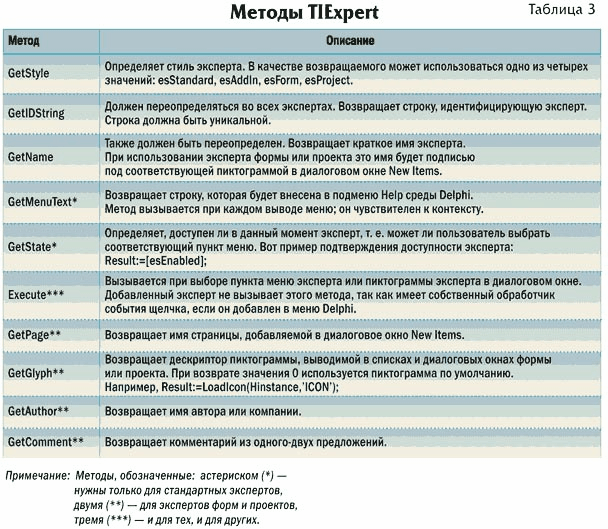
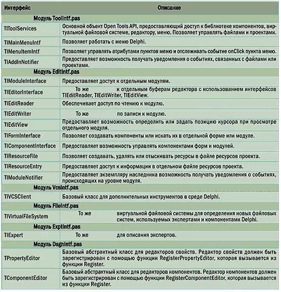

Эксперты в Delphi или Программист, упростите себе жизнь
=======================================================

::: {.date}
01.01.2007
:::

Имеющее множество достоинств и довольно популярное средство разработки
Delphi позволяет расширять функциональные возможности среды
разработчика. Речь идет не о косметических изменениях в интерфейсе и не
о добавлении компонентов или их наборов, а о придании рабочему окружению
программиста новых полезных возможностей, не предусмотренных его
создателями. Для решения подобной задачи в Delphi можно воспользоваться
так называемыми экспертами. Вспомните, как удобно, ответив на несколько
вопросов, создать готовую форму для вывода содержимого таблиц. Или,
щелкнув мышью на нужном элементе в списке New Items, получить "костяк"
вашего будущего проекта (рис. 1).

:::{.center}

Рис. 1. Многие возможности Delphi реализуются с помощью экспертов
:::

Что это --- стандартные возможности рабочей среды? Да, но применить их
можно лишь с помощью эксперта. О том, как это сделать, и пойдет речь
далее.

Эксперты в Delphi --- что это такое?

Если не хватает возможностей среды или какие-то операции кажутс слишком
громоздкими, то эксперты --- именно то, что нужно. С помощью экспертов
вы словно проникаете внутрь среды Delphi и без труда дополняете ее.
Естественно, такое проникновение должно быть осторожным и аккуратным,
потому как неправильное обращение с объектами и интерфейсами может
вызвать сбои в работе среды или даже ее разрушение. Эксперты могут
существовать в виде библиотек DLL либо компилированных модулей DCU.
Выбор "формы жизни" будущего эксперта остается за вами, но имейте в
виду, что расширение файла эксперта определяет способ его регистрации. О
способах регистрации чуть далее --- сперва давайте рассмотрим стили
экспертов Delphi. Их всего четыре, и все они приведены в таблице.

Стили экспертов

{.center}

Главное отличие между стилями заключается в способе вызова эксперта
пользователем в среде Delphi. Как видите, можно определить самый удобный
из них. Реализация экспертов предполагает использование интерфейса Open
Tools API --- набора классов, позволяющего обращатьс ко множеству
функций среды Delphi. В экспертах Open Tools API может использоватьс
для:

- Получения информации о проекте;
- Получения информации о модуле или форме;
- Управления модулями проекта (дл открытия, закрытия, добавления, создания);
- Управления ресурсами проекта;
- Модификации меню Delphi;
- Регистрации изменений в проекте;
- Регистрации изменений в модуле.

Следует заметить, что интерфейс Open Tools API доступен только из
программ, запущенных как часть интегрированной среды Delphi. В следующем
разделе мы рассмотрим несколько полезных экспертов.

Реализация класса TIExpert

Для создания нового эксперта необходимо наследовать новый класс от
класса TIExpert, переопределив при этом часть его методов (таблица 2)

Возможность переопределени методов экспертов тех или иных стилей

{.center}

Все девять методов (таблица 3) предоставляют информацию об эксперте и
организуют его взаимодействие со средой. TIExpert --- это абстрактный
виртуальный класс с заданными, но не реализованными функциональными
возможностями. От этого класса будут порождены другие, имеющие
необходимые возможности.

{.center}

Определение класса TIExpert приведено далее.

    TIExpert = class(TInterface)
    public
    { Методы пользовательского
    интерфейса с экспертом }
    function GetName: string;
    virtual; stdcall; abstract;
    function GetAuthor: string;
    virtual; stdcall; abstract;
    function GetComment: string;
    virtual; stdcall; abstract;
    function GetPage: string;
    virtual; stdcall; abstract;
    function GetGlyph: HICON;
    virtual; stdcall; abstract;
    function GetStyle:
    TExpertStyle; virtual; stdcall;
    abstract;
    function GetState:
    TExpertState; virtual; stdcall;
    abstract;
    function GetIDString: string;
    virtual; stdcall; abstract;
    function GetMenuText: string;
    virtual; stdcall; abstract;
    { Запуск эксперта }
    procedure Execute; virtual;
    stdcall; abstract;
    end; 

**Open Tools API**

Open Tools API --- это набор интерфейсов; они предоставляют доступ к
среде Delphi и позволяют управлять файлами и проектами. Основной объект
Open Tools API --- ToolServices --- это глобальная переменная. При
запуске Delphi создается экземпляр класса TIToolServices, и переменной
ToolServices присваивается ссылка на него. Эксперты могут использовать
ToolServices дл доступа к функциям среды разработки.

{.center}

Любой сервис, предоставляемый Open Tools API, прямо или косвенно
вызывается через ToolServices. В таблице приведено краткое описание Open
Tools API.

Переопределение методов --- задача довольно простая; она предполагает
написание всего нескольких строк кода. Например, реализация метода
GetStyle вряд ли отнимет у вас много времени:

    function MyExpert.GetStyle:
    TexpertStyle
    begin
    Result := [esStandard];
    end; 

Регистрация экспертов

Зарегистрировать эксперт можно одним из двух способов. Первый способ
сводится к определению эксперта как компонента путем вызова процедуры
RegisterLibraryExpert из процедуры Register. Второй способ заключается в
создании DLL-библиотеки эксперта. Преимущество первого способа в том,
что не приходитс закрывать среду Delphi при внесении изменений в эксперт
--- достаточно его перекомпилировать. Сперва рассмотрим регистрацию
эксперта как компонента. Необходимо добавить в модуль эксперта процедуру
Register:

    Procedure Register;
    Implementation {$R*.DFM}
    Procedure Register;
    Begin
    RegisterLibraryExpert
    (TPowerExpert. Create);
    // TpowerExpert — это класс регистрируемого эксперта
    End; 

Для регистрации эксперта как DLLбиблиотеки следует выполнить две
операции: реализовать новый проект DLL и изменить содержимое системного
реестра Windows. Итак, создаем DLL. Выполните команду File р New, а
затем укажите Delphi, что необходимо создать DLL. В результате появится
новое окно модуля с неким набором исходного кода. После этого следует
экспортировать функцию InitExpert. Обратите внимание, что эта функция
экспортируется с помощью специальной константы ExpertEntryPoint, которую
Delphi определяет для всех экспертов, создаваемых в виде DLL. Основное
назначение функции InitExpert --- возврат ссылки на объект ToolServices
для дальнейшего использования и вызова процедуры RegisterProc, которая,
собственно, и регистрирует эксперт. Ниже приведена реализация этой
функции:

    Function InitExpert(
    ToolServices:ToolServices;
    RegisterProc:TexpertRegisterProc;
    var
    Terminate:TExpertTerminateProc):
    Boolean; export; stdcall;
    implementation
    procedure TerminateExpert;
    begin
    // завершение работы эксперта
    end;
    function InitExpert(
    ToolServices:ToolServices;
    RegisterProc:TExpertRegisterProc;
    var
    Terminate:TExpertTerminateProc):
    Boolean; export; stdcall;
    begin
    Result:=False;
    end;
    // проверка, является ли запущенное приложение единственным
    if (ToolServices=nil) or Assigned(ExptIntf.ToolServices)
    then Exit;
    ExptIntf.ToolServices:=ToolServices;
    //сохраняем указатель на ToolServices
    Application.Handle:=
    ToolServices.GetParentHandle;
    //сохраняем указатель на
    ToolServices для родительского
    окна
    Terminate:=TerminateExpert;
    //устанавливаем процедуру завершения
    RegisterProc(TGenericExpert.Create);
    //регистрация эксперта
    Result:=True;
    end; 

Когда DLL с экспертом будет готова, от вас потребуется лишь изменить
системный реестр так, чтобы Delphi "знала" расположение библиотеки с
экспертом и смогла ее загрузить. Для этого с помощью редактора реестра
(regedit.exe) добавьте в реестр такую запись:

HKEY\_CURRENT\_USER\\Software\\Borland\\ Delphi\\4.0\\Experts
MyExpert=C:\\MyExpertts\\MyExpert.DLL

Для того чтобы среда зарегистрировала DLL, Delphi необходимо
перезапустить. Вариант реализации эксперта в виде DLL кажетс автору
менее удобным: перезагрузка среды отнимает больше времени по сравнению с
перекомпиляцией библиотеки компонентов, что особенно ощутимо при отладке
эксперта. Еще одна проблема --- неполна совместимость экспертов в виде
DLL, которые были созданы и скомпилированы для других версий Delphi.
Автор надеется, что эта стать поможет профессионалам поближе
познакомиться с экспертами Delphi. Возможно, ее публикация подтолкнет
многих программистов к изучению темы.

Некоторые полезные эксперты

Знаете ли вы, что в Internet есть предостаточно мест, где можно найти
эксперты для Delphi. Одно из таких мест --- польский сервер "Delphi
Super Page" (http://sunsite.icm.edu.pl/delphi/). Там вы найдете
множество различных экспертов и полезных компонентов. Давайте рассмотрим
самый интересный, по мнению автора, набор экспертов, предоставляющий
возможность ускорить разработку приложений на Delphi. Его можно
загрузить по адресу:
http://sunsite.icm.edu.pl/delphi/ftp/d40free/myexp100.zip.

Рассмотрим вкратце эти маленькие "добавки". Набор содержит эксперт ---
редактор префиксов для имен компонентов. После того, как он будет
установлен в инспекторе объектов, напротив свойства Name появится кнопка
с многоточием. Это говорит о том, что можно воспользоватьс редактором
для изменения свойства Name. С его помощью можно указывать префикс для
данного класса компонента. Строго говоря, использование префиксов в
названиях компонентов --- это правило хорошего тона. В меню Tools теперь
появляется новое подменю Prefix list editor, с помощью которого можно
изменять и добавлять такие префиксы.

Как известно, некоторые компоненты являются контейнерами для других
(например, TPanel, TGroupBox, TScrollBox и т. п.). Установленный набор
позволит управлять выравниванием дочерних компонентов. Для этого
достаточно щелкнуть правой кнопкой мыши и выбрать в контекстном меню
пункт Align controls. В Delphi есть мастер создания элементов
управления, работающих с данными.

Однако в рассматриваемом наборе имеется эксперт, благодаря которому
можно создавать компоненты для работы с данными более совершенным
способом. С помощью эксперта, вызываемого командой Tools р Shortcut list
editor, можно определить свой набор клавиатурных эквивалентов для
главного меню Delphi. Кроме всего прочего, после установки набора вы
обнаружите, что палитра компонентов Delphi стала многострочной
(рисунок). Так вы получите возможность просматривать больше закладок,
чем ранее.

{.center}

2004.11.03

Автор: Олег Гопанюк, ведущий программист департамента
\"KM-Solution\" корпорации \"Квазар-Микро\"
<https://www.cpp.com.ua>
