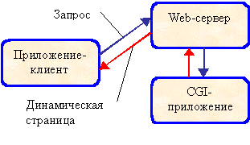
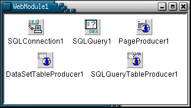
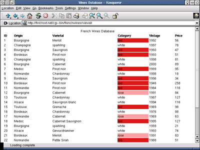

Программирование интернет-приложений в Borland Kylix. Часть II
==============================================================

::: {.date}
01.01.2007
:::

Разработка приложений для Web-сервера.

Автор: Андрей Боровский
([www.kylixportal.chat.ru](https://www.myhomepage.com/index.html))

Эта статья продолжает серию, посвященную программированию
Интернет-приложений в Borland Kylix. На этот раз речь пойдет о
CGI-приложениях и модулях сервера Apache.

CGI-приложения

Изначально протокол HTTP создавался для передачи по Сети документов в
формате HTML и сопутствующей им графики, однако Web-броузеры оказались
настолько удобны, что всемирная паутина очень быстро начала обрастать
различными дополнительными функциями. Весьма заманчиво выглядит
возможность использовать броузер клиента в качестве интерфейса для
взаимодействия с удаленным приложением. Такое взаимодействие,
разумеется, требует наличия механизма передачи команд и данных от
клиента серверу. Для стандартизации механизма передачи команд клиента
серверу был разработан стандарт CGI. В общих чертах работа CGI выглядит
следующим образом: клиент загружает HTML страницу, содержащую форму и
посылает серверу определенный в форме запрос (request), в котором
указано

{width="311" height="180"}

действие (action) и список параметров. Действие представляет собой
указатель на CGI-приложение, которое должно выполнить запрос. Например
действие /cgi-bin/frenchwines указывает на приложение frenchwines. Для
одного приложения можно определить несколько действий, которые
идентифицируются как отдельные сетевые ресурсы: /cgi-bin/frenchwines,
/cgi-bin/frenchwines/, /cgi-bin/frenchwines/welcome -- это разные
действия приложения frenchwines. Список параметров представляет собой
перечень имен параметров и их значений. Если HTML форма использует для
передачи параметров метод GET, список параметров можно увидеть в
адресной строке броузера после идентификатора ресурса (он отделен от
идентификатора символом \'?\'). С точки зрения протокола HTTP CGI-запрос
является командой на загрузку некоторого ресурса. В ответ на запрос
сервер обычно посылает клиенту HTML документ, который как правило
является динамической страницей, т. е. не хранится на диске в виде
файла, а генерируется приложением.

CGI--функции могут быть реализованы на сервере в двух вариантах: в форме
CGI-сценариев (CGI scripts) и в виде CGI приложений. CGI приложения
представляют собой исполнимые модули, вызываемые Web-сервером. Схема
взаимодействия между броузером, сервером и CGI-модулем приводится на
рисунке. По своей структуре CGI приложение является обычной консольной
программой. Сервер передает данные CGI приложению через переменные
окружения и стандартный поток ввода, а CGI приложение передает данные
серверу через свой стандартный поток вывода. Сервер запускает новую
копию приложения для обработки каждого запроса. По окончании обработки
запроса CGI-приложение завершается.

Далее следует пример простейшего CGI приложения, написанного в Borland
Kylix. Этот пример не использует специальные средства разработки CGI
приложений, входящие в состав Kylix. Модуль Libc используется для того,
чтобы сделать приложение более компактным. В принципе нам было бы
достаточно одного модуля SysUtils.

    program simplecgi;
     
    {$APPTYPE CONSOLE}
     
    uses
      Libc;
     
    var
      Method : PChar;
      Query : String;
     
    begin
      Method := getenv( 'REQUEST_METHOD' );
      if Method = nil then
      begin
        WriteLn( 'Error : no request method' );
        Halt(0);
      end;
      WriteLn( 'Content-Type: text/html' );
      WriteLn;
      Write( '<HTML><HEAD><TITLE>Simple CGI Application</TITLE><BODY>' );
      Write( '<H2>This page was generated on the fly by the CGI application</H2>' );
      Write( '
You have sent data by ', String(Method), ' method
' );
      Write( '
The user agent is "', String(getenv('HTTP_USER_AGENT')), '"
' );
      Write( '
The HTTP_REFERER variable is "', String(getenv('HTTP_REFERER')), '"
' );
      if Method = 'GET' then
      Write( '
The query string is "', String(getenv('QUERY_STRING')), '"
' )
      else begin
        Write( '
The content length is ', String(getenv('CONTENT_LENGTH')), '
' );
        Read( Query );
        Write( '
The query string is "', Query, '"
' )
      end;
      Write( '</BODY></HTML>' );
    end.

Для того, чтобы проверить работу примера, скомпилируйте проект
simplecgi.dpr (исходный текст лежит здесь) и скопируйте полученный
исполнимый файл в каталог CGI-приложений Web-сервера. В Linux Mandrake
этим каталогом по умолчанию является /var/www/cgi-bin/ (естественно, сам
Web-сервер должен быть установлен и запущен в вашей системе). Затем
откройте в броузере страницу TestCGI.html. Страница TestCGI содержит две
формы для передачи параметров приложению. Одна форма использует для
передачи данных метод GET, другая -- метод POST.

Кроме возможности создания CGI-приложений \"с нуля\", Borland Kylix
располагает весьма удобными специальными средствами разработки
приложений для Web-сервера. Kylix может создать для вас \"заготовку\"
CGI-приложения. В окне New выберите элемент Web Server Application и в
открывшемся диалоговом окне -- пункт CGI standalone executable.

В качестве примера такого приложения мы рассмотрим программу,
реализующую Web-интерфейс к базе данных Borland Interbase. Для
компиляции и выполнения этого примера вам понадобится сервер баз данных
Interbase (входит в комплект поставки Kylix SDE). Перед началом работы с
примером Web-интерфейса базы данных, убедитесь, что серверы Web и
Interbase установлены и нормально работают.

Приложение-пример (исходный текст лежит здесь) называется fenchwines и
представляет собой Web-интерфейс к базе данных французских вин.
(Напомню, что \"Kylix\" в переводе означает \"винная чаша\", так что
\"винная\" тематика вполне соответствует рассматриваемому продукту. Для
правильной компиляции и запуска демонстрационного приложения необходимо
выполнить следующее: скачайте архив с базой данных, распакуйте его,
скопируйте файл vina.gdb в какой-нибудь каталог. В корневом каталоге
http документов вашего сервера (часто это /var/www/html) создайте
каталог wdb и скопируйте в него файлы wctempl.html и barrels.jpg из
архива приложения. Теперь откройте приложение в среде Kylix. При помощи
менеджера проекта откройте окно Web-модуля, которое связано с модулем
main. В окне Web-модуля щелкните правой кнопкой мыши по компоненту
SQLConnection1 и в открывшемся меню выберите пункт Edit Connection
Properties. В открывшемся диалоговом окне создайте новое соединение. В
качестве драйвера базы данных выберите INTERBASE. В поле Database
задайте абсолютный путь к файлу vina.gdb. Убедитесь, что поля Password и
User\_Name содержат значения masterkey и SYSDBA соответственно. Свойство
Connection компонента SQLConnection1 должно указывать на новое
соединение. Далее отредактируйте свойство HTMLFile компонента
PageProducer1 так, чтобы оно содержало полный путь к файлу wctempl.html.
Скомпилируйте приложение frenchwines и скопируйте исполнимый файл в
каталог CGI-приложений (cgi-bin). Для того, чтобы проверить работу
нашего приложения в окне броузера наберите
http://localhost/cgi-bin/frenchwines. При этом в окне броузера появится
приветственная HTML-страница. Форма на странице позволяет выбирать вина
из базы данных по происхождению и категории. Для того, чтобы отобразить
все вина, содержащиеся в базе, необходимо ввести \"any\" в обоих полях
формы.

Структура CGI-приложения очень похожа на структуру обычного приложения
Kylix. Вместо объекта TApplication в Web-приложении используется объект
TWebApplication, а роль класса TForm выполняет класс TWebModule. Потомок
класса TWebModule является владельцем всех компонентов, используемых в
Web-приложении и ему же принадлежат методы обработки событий.

{width="324" height="183"}

Окно компонента TWebModule с дочерними компонентами

Важнейшим элементом TWebModule является список действий Actions. В этом
списке хранятся объекты TWebActionItem, определяющие действия
приложения. Свойство PathInfo объекта TWebActionItem позволяет задать
идентификатор действия. Если свойство PathInfo содержит пустую строку,
идентификатором данного действия является само имя CGI-приложения. В
других случаях идентификатор действия должен предваряться символом
\"/\". В следующей таблице показаны примеры значений PathInfo и
соответствующие им действия для приложения frenchwines, расположенного в
директории /cgi-bin/.

Значение PathInfo        Действие        

\"\"        /cgi-bin/frenchwines        

\"/\"        /cgi-bin/frenchwines/        

\"/welcome\"        /cgi-bin/frenchwines/welcome        

/error        /cgi-bin/frenchwines/error        

Список Actions можно заполнить в процессе разработки приложения при
помощи редактора списка. Для того, чтобы открыть окно редактора нужно в
окне инспектора объектов щелкнуть по кнопке с многоточием в поле
свойства Actions.

Свойство MethodType объекта TWebActionItem позволяет указать метод
передачи параметров для данного действия. Метод, указанный в свойстве
MethodType должен соответствовать методу, указанному в тэге FORM HTML
страницы, генерирующей запрос. Значение mtAny позволяет действию
обрабатывать любые запросы.

Для объекта TWebActionItem определено единственное событие -- OnAction.
Когда Web-сервер получает CGI-запрос, он запускает соответствующее
CGI-приложение и передает ему всю необходимую информацию. В
Kylix-приложении диспетчер запросов определяет, какому действию
адресован запрос, и вызывает обработчик события OnAction этого действия.
После выполнения обработчика OnAction приложение завершается.

Заголовок обработчика выглядит следующим образом:

type THTTPMethodEvent = procedure (Sender: TObject; Request:
TWebRequest; Response: TWebResponse; var Handled: Boolean) of object;

Объект Request содержит данные о поступившем запросе. Свойства этого
объекта позволяют получить сведения об адресе удаленной машины,
программном обеспечении клиента, методе запроса и т. п. Для CGI-запроса
в объекте Request передается также список параметров запроса. Список
параметров хранится в свойстве ContentFields (если запрос передан
посредством метода POST) или QueryFields (если использовался метод GET).
Оба свойства имеют тип TStrings и содержат набор строк вида

ParamName=ParamValue

Объект Response описывает ответные действия приложения. Текст HTML
страницы, возвращаемой приложением, передается в свойстве Content
объекта Response. В простейшем CGI-приложении обработчик OnAction может
выглядеть следующим образом:

    procedure TWebModule1.WebModule1WebActionItem1Action(Sender: TObject;
      Request: TWebRequest; Response: TWebResponse; var Handled: Boolean);
    begin
      Response.Content := '<HTML><BODY><H2>Hello, World!</H2></BODY></HTML>';
    end;

Рассмотрим другие примеры. В приложении frenchwines главная
HTML-страница выводится при выполнении действия frenchwines/welcome.
Однако, пользователь может набрать в строке броузера просто
\.../frenchwines или \.../frenchwines/ и было бы очень удобно, если бы в
этой ситуации приложение автоматически перенаправляло броузер
пользователя на страницу frenchwines/welcome. Для того, чтобы приложение
fenchwines выполняло такое перенаправление, в нем заданы два действия,
значениями PathInfo которых являются соответственно пустая строка и
символ \"/\". Обоим действиям можно назначить один и тот же обработчик
OnAction:

    procedure TWebModule1.WebModule1WebActionItem3Action(Sender: TObject;
      Request: TWebRequest; Response: TWebResponse; var Handled: Boolean);
    begin
      Response.Location := Request.InternalScriptName+'/welcome';
      Response.StatusCode := 301;
      Response.Content := '<HTML><BODY><H2>This page is
                                            redirected to <A HREF='+ Response.Location +'/>' 
        + Request.Host + Response.Location + '</A></H2></BODY></HTML>';
    end;

Статус-код 301 сообщает клиенту о необходимости перенаправить запрос по
новому адресу. А что произойдет, если клиент пошлет запрос на выполнение
действия, которое не определено в CGI-приложении, например
frenchwines/querydb ? В этом случает Kylix-приложение сгенерирует
исключение и Web-сервер выдаст неприятное сообщение о внутренней ошибке.
Для того, чтобы обращение к неопределенному действию не приводило к
исключительной ситуации, необходимо создать еще одно действие и
присвоить свойству Default соответствующего объекта TWebActionItem
значение True. Теперь это действие будет вызываться для всех запросов,
вызывающих неопределенные действия. Обработчик события OnAction этого
действия может выглядеть следующим образом:

    procedure TWebModule1.WebModule1WebActionItem4Action(Sender: TObject;
      Request: TWebRequest; Response: TWebResponse; var Handled: Boolean);
    begin
      Response.Title := 'Resource Not Found';
      Response.StatusCode := 404;
      Response. Content := '<HTML><BODY><H2>Error 404</H2>
Requested resource "' 
        + Request.InternalScriptName+Request.PathInfo + '" is not found
                                                               on this server.</BODY></HTML>';
    end;

Генераторы контента

Во всех приведенных выше примерах HTML страницы, возвращаемые сервером
задавались в явном виде, путем присвоения строки HTML команд свойству
Content. Очевидно, что для вывода сложных страниц с большим числом
элементов такой подход непригоден. Для облегчения решения этой проблемы
Kylix предоставляет несколько специальных компонентов-генераторов
контента (content producers). На вкладке Internet панели компонентов
Kylix раположены четыре компонента-генератора: TPageProducer,
TDataSetTableProducer, TSQLQueryTableProducer и TDataSetPageProducer.

Компонент TPageProducer генерирует страницу на основе заданного шаблона.
Идея этого компонента заключается в том, что на многих динамических HTML
страницах изменяются только отдельные фрагменты, основная же часть
страницы остается неизменной. Шаблоном для компонента TPageProducer
может служить обычная HTML-страница, в которую добавлены специальные
тэги, невидимые для броузера. Формат тэга имеет следующий вид:

\<\#TagName Param1=Value1 Param2=Value2 \...\>

Шаблон может быть задан в свойстве HTMLDoc (в виде набора строк) или в
свойстве HTMLFile (как имя файла). Для получения HTML страницы,
построенной на основе шаблона, никаких специальных команд вызывать не
нужно. Необходимо лишь прочитать свойство Content компонента
TPageProducer. При этом функция, лежащая в основе свойства Content,
анализирует заданный шаблон и всякий раз, когда в шаблоне встречается
тэг, описанный выше, вызывает обработчик события OnHTMLTag, которому
передается информация о тэге, вызвавшем событие. Обработчик события
OnHTMLTag обычно возвращает строку, которой следует заменить
соответствующий тэг в готовой странице. Таким образом, при обращении к
свойству content возвращается строка HTML команд, в которой прозрачные
тэги уже заменены динамическими значениями. При использовании компонента
TPageProducer, обработчик события OnAction, возвращающий клиенту
динамическую страницу, мог бы выглядеть следующим образом:

    procedure TWebModule1.WebModule1WebActionItem4Action(Sender: TObject;   Request: TWebRequest; Response: TWebResponse; var Handled: Boolean); 
    begin    
    Response.Content := PageProducer1.Content;  
    end;        

Код выглядит очень просто, однако все можно упростить еще больше. Если
все, что нужно сделать в ответ на запрос, это передать страницу,
созданную компонентом-генератором контента, можно вообще обойтись без
обработчика OnAction. Достаточно присвоить свойству Producer
соответствующего объекта TWebActionItem ссылку на компонент-генератор.

Специально для отображения содержимого баз данных в Kylix и Delphi
существуют еще три компонента-генератора Web-страниц:
TDataSetTableProducer, TSQLQueryTableProducer и TDataSetPageProducer.

Компонент TDataSetTableProducer генерирует HTML страницу, на которой
записи из базы данных отображаются в виде таблицы. Для того, чтобы
связать компонент TDataSetTableProducer с базой данных, необходимо
указать соответствующее значение в свойстве DataSet. HTML-страница
генерируется при обращении к свойству Content, также, как и в случае с
TPageProducer. Компонент TDataSetTableProducer обладает множеством
свойств, позволяющих задать различные элементы и внешний вид
генерируемой страницы. Событие OnFormatCell, возникающее в процессе
генерации страницы, позволяет динамически форматировать отдельные ячейки
создаваемой таблицы.

{width="400" height="300"}

TSQLQueryTableProducer выполняет те же функции, что и
TDataSetTableProducer с тем отличием, что TSQLQueryTableProducer
работает с SQL запросами к базам данных, содержащими параметры, что
позволяет не отображать всю таблицу целиком, а производить выборку
данных на основе некоторого признака. Источником данных для компонента
TSQLQueryTableProducer является компонент TSQLQuery, на который должно
указывать свойство TSQLQueryTableProducer.Query. Примеры использования
компонентов TDataSetTableProducer и TSQLQueryTableProducer можно видеть
в приложении frenchwines. Компонент TDataSetPageProducer позволяет
создавать Web-страницу, содержащую информацию из одной (текущей) записи
базы данных.

Разделяемые модули для сервера Apache.

Рассмотренные в предыдущей части приложения используют универсальный
интерфейс CGI и могут работать совместно с любым Web-сервером.
Web-сервер Apache позволяет также использовать модули, обладающие более
широкой функциональностью. Модули могут быть скомпилированы как часть
ядра Apache или же реализованы в виде разделяемых библиотек. Borland
Kylix позволяет создавать только модули в виде разделяемых библиотек.
Для того, чтобы сервер Apache мог подключать разделяемые библиотеки,
необходимо пересобрать ядро сервера, установив опцию, разрешающую
загрузку разделяемых модулей. Для пересборки ядра вам потребуются
исходные тексты apache (скачать их можно с www.apache.org ). Распакуйте
архив дистрибутива и в коневом каталоге дистрибутива создайте файл
config.status, содержащий следующий текст:

\#!/bin/sh

LIBS=\"/usr/lib/libpthread.so\" \

./configure \

\"\--with-layout=Apache\" \

\"\--enable-module=so\" \

\"\--enable-rule=SHARED\_CORE\" \

\"\$@\"

Далее этому файлу следует присвоить статус исполнимого:

chmod 755 config.status

запускаем созданный скрипт:

./config.status

и даем команду

make

Теперь у нас есть версия Apache, поддерживающая разделяемые модули. Для
того, чтобы установить сервер автоматически, необходимо в режиме root
дать команду

make install

Учтите при этом, что после выполнения этой команды новая версия Apache
может быть установлена в каталог, отличный от того, в который она была
установлена ранее. Возможно, вам придется отредактировать файлы
сценариев запуска и файл httpd.conf.

Если Apache был установлен в каталог /usr/local/apache/, то для запуска
сервера вручную можно воспользоваться командой:

/usr/local/apache/bin/apachectl start

а для остановки:

/usr/local/apache/bin/apachectl stop

Теперь можно перейти к написанию простейшего модуля. Для создания
заготовки модуля Apache в Kylix в окне New выберите элемент Web Server
Application и в открывшемся диалоговом окне -- пункт Apache shared
module (DSO). Kylix создаст новый проект и в нем Web-модуль, аналогичный
Web-модулю CGI-приложения. Разработка модулей для Apache практически
аналогична разработке CGI-приложений. Сохраните ваш модуль под именем
apachedemo. Создайте новое действие (при помощи свойства Actions объекта
TWebModule1 и назначьте следующий обработчик событию OnAction созданного
объекта-действия:

    procedure TWebModule1.WebModule1WebActionItem1Action(Sender: TObject;
      Request: TWebRequest; Response: TWebResponse; var Handled: Boolean);
    begin 
      Response.Content := '<HTML><BODY><H2>Hello,
        World!</H2></BODY></HTML>'; 
    end;

 

Откройте окно исходного текста проекта (Project\|View Source) и
отредактируйте текст, так чтобы он выглядел следующим образом:

    library apachedemo;
    uses
      WebBroker, HTTPD, ApacheApp, Main in 'Main.pas' {WebModule1: TWebModule};
    exports
      apache_module name 'hello_module';
    begin
      ModuleName := 'Hello_Module';
      ContentType := 'hello-handler';
      Application.Initialize;
      Application.CreateForm(TWebModule1, WebModule1);
      Application.Run;
    end.

Значения переменных ModuleName и ContentType необходимы серверу Apache
для идентификации модуля.

Модуль для сервера готов! Скомпилируйте проект. В результате компиляции
должен быть создан файл libapachedemo.so. Скопируйте этот файл в каталог
разделяемых модулей сервера Apache (если сервер был установлен в каталог
/usr/local/apache/, каталогом разделяемых модулей будет
/usr/local/apache/libexec. Далее внесите следующие строки в файл
httpd.conf:

LoadModule hello\_module libexec/libHelloModule.so

\<Location /hello\>

SetHandler hello-handler

\</Location\>

После директивы LoadModule следует имя модуля (указанное в директиве
exports библиотеки) и путь к файлу, в котором размещен модуль. Команда
Location позволяет задать URL, соответствующую обработчику
hello-handler. Для того, чтобы проверить работу модуля, перезапустите
Web-сервер и в окне броузера наберите:

https://localhost/hello.

Теперь рассмотрим более интересный пример. Допустим, на вашем
Web-сервере размещены файлы с исходными текстами Kylix-программ (файлы
\*.pas и \*.dpr) и вы хотите, чтобы пользователям эти файлы передавались
не в текстовом формате, а в формате HTML, с разметкой синтаксиса,
характерной для Delphi и Kylix. Конечно, эту проблему можно решить,
конвертируя все файлы исходных текстов в формат HTML перед размещением
их на сервере, но мы пойдем другим путем. Файлы исходных текстов
размещаются на сервере в обычном текстовом формате, а специальный модуль
сервера Apache будет конвертировать их в формат HTML \"налету\", перед
посылкой клиенту. Исходный текст модуля находится здесь. Текстовый файл
reserved содержит список зарезервированных слов (которые выделяются
жирным шрифтом). Скопируйте этот файл в какой-нибудь каталог (например
/usr/local/apache/libexec/) и укажите путь к этому файлу в константе
ReservedPath в файле main.pas. Скомпилируйте проект и скопируйте
полученную библиотеку libpas2html.so в каталог libexec. В файл
httpd.conf добавьте следующие строки:

LoadModule pas2html\_module libexec/libpas2html.so

AddType text/html .pas

AddHandler pas2html-handler .pas

AddType text/html .dpr

AddHandler pas2html-handler .dpr 

После этого следует перезапустить Web-сервер. Теперь все файлы с
расширениями .pas и .dpr, находящиеся в Web-подкаталогах, будут
автоматически конвертироваться в формат HTML перед посылкой клиенту.

Статья и примеры программ © 2001 Андрей Наумович Боровский.

Взято из <https://forum.sources.ru>
