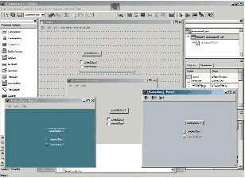
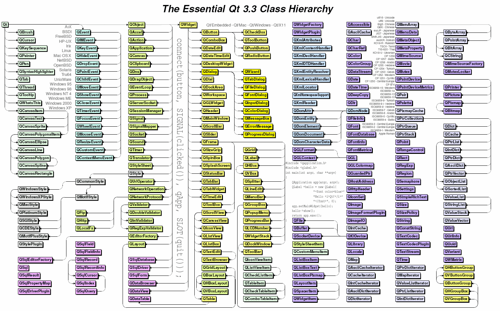
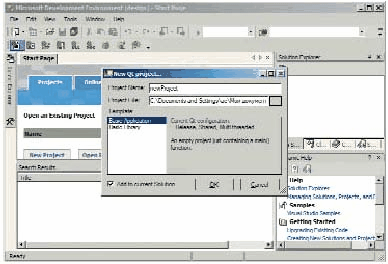

Qt: интерфейс, и не только
==========================

::: {.date}
01.01.2007
:::

QT: интерфейс, и не только...

 

Если вы связаны с программированием, то наверняка уже встречали
сочетание Qt. Многие (0,1%) из вас даже использовали Qt в своих
разработках, пусть даже как следствие инсталляции Borland Kylix. В
общем, самое время посмотреть на Qt, что называется, "в упор, двумя
глазами"...

Этот продукт на слуху у всех разработчиков, которые программируют для
Linux. И не только у них --- например, самый модный и удобный
многоплатформенный клиент для сетей AIM/ICQ (точнее, ICQ/AIM), sim,
написанный питерцем Володей Шутовым, создан именно с использованием Qt.
Не говоря уже о Borland Kylix --- там вообще все работает поверх Qt.

Такие совпадения --- там вилочка, тут ножичек --- поневоле
задумаешься...

Идея

Норвежская компания Trolltech AG (изначально называвшаяся Quasar
Technologies, откуда, собственно, и пошла аббревиатура Qt) образовалась
из двух (хм...) норвежцев, Эйрика Енга (Eirik Eng) и Хаварда Норта
(Haavard Nort) с целью... короче, как всегда, с целью подрубить бабла.
Но, кроме того, еще и создать пару нетленок из разряда универсальных
библиотек, которые завоюют весь мир. Уж такой народ норвежцы --- не
могут без славы и денег.

Дело было в 1994 г. в городе Осло. Само сочетание "Qt" некоторые
произносят как "кьют" ака cute --- то есть "мило, прикольно". В
общем-то, так оно и есть, если, конечно, вы способны оценить красоту,
выраженную в терминах С++.

Говоря более конкретно, во главу угла были поставлены две вещи. Первое:
библиотеки создавались для языка С++. Второе: основой всему был именно
интерфейс пользователя, поскольку это самый несовместимый и позорный
момент во всем софтвере --- полностью разные парадигмы графического
пользовательского интерфейса.

Как известно, MS Windows использует "локальный" GUI API, который,
однако, недавно был транспонирован на сетевые подключения в XP Remoting.
Все UNIX-like, и Linux в том числе, были изначально (ну, как изначально
--- как только рабочие станции доросли до графики, естественно) завязаны
на X Windows, который, хоть и работает от рождения по сети, но локально
показывает худшие характеристики быстродействия и реактивности из всех
рассматриваемых интерфейсов. Наконец, графика Mac OS, зашитая
полуаппаратно в фирменных BIOS-"тулбоксах", всегда показывала скорость
и красоту, даже когда Windows еще под стол пешком ходила. Но это было:
а) проприетарно, б) ни с чем не совместимо --- даже приблизительно.

Короче --- бардак и брожение умов. Вот прибалты и задумались...

Точнее задумались-то не только они. В качестве переносимого графического
интерфейса можно использовать хоть Java, хоть Tk/Tcl, а хоть и
Macromedia Flash --- на последних версиях этого Flash можно писать
вполне приличные приложения. Это только те "задумавшиеся", у кого
получилось,--- об остальных мы просто не знаем.

Да, так вот, у Trolltech тоже неплохо получилось, как именно --- сейчас
посмотрим.

Кю-тэшное семейство, обзор

На самом деле существует несколько продуктов Qt, хотя все они
"завязаны" на одном и том же коде. Собственно Qt --- это
межплатформенная библиотека для С++. Более конкретно --- библиотека
классов, "цешники"-натуралы отдыхают. То есть это даже и
библиотекой-то не назовешь --- сами создатели именуют это как framework,
то есть программная оболочка. Но, конечно, от этого она не перестает
быть обычной библиотекой.

{.center}

Применение нового "стиля" в Qt может мгновенно придать вашему
приложению новый вид

Помимо переносимого интерфейса библиотека также занимается
интернационализацией, то есть располагает инструментом для перевода
интерфейса на ваш родной китайский язык (сделано это, кстати, очень
прикольно). Менеджер релизов выкусывает из кода все строки, подлежащие
переводу. Они должны быть, правда, особого формата, чтоб не было
накладок с непереводимыми фразами. Короче, полученные таблицы фраз
поступают в средство перевода --- Linguist. Сам он ничего не переводит
(это делаете вы) --- но зато помогает сохранять уже переведенные фразы в
словарях. Так что вы можете менять программу как вам угодно, и то, что
уже переведено, уже никогда не будет требовать перевода.

Третье, что было сделано (кстати, уже по ходу разработки --- по просьбе
многих клиентов), это системно-независимые механизмы доступа к базам
данных. Конечно, я уже не говорю о таких вещах, как унифицированный
сетевой доступ, XML, трехмерная графика и так далее --- просто различия
в этих сферах не так разительны, как в перечисленных выше.

Выходит, что Qt --- это как бы "мегапатч" к стареньким си-либам,
позволяющий:

::: {style="text-align: left; text-indent: 0px; padding: 0px 0px 0px 0px; margin: 7px 0px 7px 24px;"}
  ---- ---------------------
  1.   работать в графике;
  ---- ---------------------
:::

::: {style="text-align: left; text-indent: 0px; padding: 0px 0px 0px 0px; margin: 7px 0px 7px 24px;"}
  ---- -----------------------
  1.   переводить программы;
  ---- -----------------------
:::

::: {style="text-align: left; text-indent: 0px; padding: 0px 0px 0px 0px; margin: 7px 0px 7px 24px;"}
  ---- -------------------------
  1.   выполнять запросы к БД;
  ---- -------------------------
:::

::: {style="text-align: left; text-indent: 0px; padding: 0px 0px 0px 0px; margin: 7px 0px 7px 24px;"}
  ---- ----------------------------------------------------------------
  1.   унифицированно реализовывать все остальное, вроде мультимедиа.
  ---- ----------------------------------------------------------------
:::

Помимо основной библиотеки, существует основанный на том же коде
framework для всякой мобильной живности вроде смарт-фонов и PDA под
управлением Embedded Linux (особенно засветился в этом секторе Sharp).
Называется эта штуковина Qtopia. Инструмент для разработки встроенных
систем с ограниченной функциональностью называется Qt/Embedded.

Далее, QSA --- скриптовый язык, позволяющий управлять готовыми
приложениями на Qt/C и расширять их возможности в скриптовом контексте.

Teambuilder --- средство компиляции, которое собирает статистику
утилизации CPU по целой рабочей группе и позволяет оптимизировать
процесс сборки на менее загруженных станциях.

Ко всему, существует несколько "плугов" для известных сред разработки
(говоря проще --- для Visual Studio и Borland Builder), упрощающих
разработку под Qt,--- Qt Solutions.

В качестве визуального инструмента разработки используется Qt Designer
--- это "малевалка" интерфейса, подобная всем "клик-энд-го".
Конечно, еще полно полезного хелпняка: просто тысячи артиклов, плюс
девяносто шесть (проверьте) примеров --- и это есть гуд.

Однако сосредоточимся на Qt --- все остальное вторично.

Инсталл

Конечно же, сначала следует проинсталлировать систему. Под Windows нужно
обратить внимание на три вещи. Во-первых, потребуется ввести имя
пользователя, компанию и сериал. Вводите их точно в таком же виде, как
указано в письме, которое вам придет (сериал является хеш-фанкшином от
даты активации и двух остальных полей) --- иначе ничего работать не
будет.

Во-вторых, при инсталляции предпоследним пунктом идет установка
примеров. Они приходят в виде исходных текстов, но в процессе установки
будут компилироваться. Компиляция происходит в командной строке, так что
без установленных переменных окружения это не сработает, получите ошибку
"где линкер дел, гад?". Пофиксить проблему просто: создайте и
запустите bat-файл типа:

call "C:\\Program Files\\Microsoft Visual Studio .NET
2003\\Common7\\Tools\\vsvars32.bat"

qt-win-eval-msvc-3.3.3.exe

Третья заморочка: примеры и туторы тоже так просто работать не станут.
Они не могут найти свою библиотеку, хотя в переменной пути к ней все
вроде и указано. На самом деле для правильной работы нужно установить
переменные окружения --- а они, в свою очередь, устанавливаются при
загрузке профиля пользователя. Даже и перезагружаться не нужно, просто
отлогоньтесь-прилогоньтесь. Кстати, о необходимости такой операции
пишется в конце инсталляции --- но кто же такое читает?

Если вы инсталлируетесь под Linux и BSD, то я вам ничего не стану
рассказывать --- сами с ушами. Скажу только, что уровень проблем при
инсталляции под этой ОС может колебаться в очень больших пределах, в
зависимости от поддержки вашего дистрибутива и его "комплектации" на
момент установки. Я ставил на Slakware, RH и Mandrake без особых
проблем. В любом случае Qt нужно ставить на KDE.

Библиотека, learning curve

Как я уже говорил, Qt --- это библиотека классов. Классов там более
четырехсот, так что, если начальник требует, чтобы вы начали кодить на
Qt с завтрашнего дня, то лучше послать его к ежам. Придется, как
минимум, пару недель изучать доки, а лучше прочитать книжку. Я за целую
ночь не смог воткнуть даже простецкие вещи. Вам тоже торопиться не
советую, лучше делать все правильно --- от простого к сложному.

Может быть, не первая по важности, но несомненно нужная после
инсталляции вещь --- просмотр, распечатка, (а возможно, и татуировка на
груди --- вверх ногами, чтобы читать было удобно) иерархии классов Qt.

Это, в общем-то, относится к любой библиотеке. Но в некоторых "системах
ценностей" вы можете прожить три жизни, и проходить при этом "в
лаптях", то есть использовать 3% от всех возможностей, обходя стороной
то, что, собственно, и составляет ценность продукта. Пример: множество
малопонятных функций в MS Exсel, масса никому не нужных
ActiveX-компонент (помните, как они продавались почти по одной штучке
--- во цирк!) и т.д. В Qt все несколько иначе --- вы в конце концов
будете использовать 50-80% всех классов, так что "отбыть номер" не
удастся.

:::{.center}
  
Общий вид иерархии классов Qt
:::

Непременно прочитайте whitepapers --- в отличие от других "белок", это
не просто набор рекламных лозунгов. После чтения приведенных там
примеров вы даже сможете построить несколько приложений.

Как маршрут для вечерних прогулок вы должны избрать посещение сайта
http://doc.trolltech.com/3.3/ --- вас там многое заинтересует, начиная,
конечно, с How To Learn Qt. Собственно, всегда лучше начинать с голого
кодирования, не пользуясь автогенераторами --- или пользуясь, но при
этом тщательно разбирая код. В противном случае вы напишете что-то, что
потом не сможете ни объяснить, ни поддержать, ни модифицировать.

Как оно работает

Говоря в общем, все вращается вокруг событий, называемых сигналами, и
слотов --- то есть регистрируемых реакций на эти события. В отличие от
других "закрытых" событийных множеств (вроде тех, что встречаются в
Active Script) система сигналов Qt полностью динамическая --- каждый
участок кода может регистрировать или обрабатывать сигналы. Это
напоминает механизм, условно известный как WM\_USER+1.

Сигналы имеют отдаленное отношение к системным событиям и являются их
произвольной трансляцией --- так же как это реализовано в Delphi.
Естественно, что ни одна система не должна порождать таких шквалов
нотификаций, как Windows. Обеспечивать приложению доступ к событиям
неклиентской области --- по-моему, большая ошибка архитекторов этой
системы, породившая немало "смешных" интерфейсов.

Что касается графического интерфейса, то он более всего похож на Java
Swing --- тут тоже существуют схемы стилей, например Windows, CDE,
Motif, копирующие известные оболочки. Присутствуют также layout'ы,
автоматически размещающие элементы управления; кроме того, есть такие
"пружинки", или "спейсеры", которые расталкивают сопредельные
компоненты.

Есть также немало вещей, напоминающих Delphi: хинты размеров (то есть
"как было бы лучше"), масштабирование компонент и прочие вещи,
претендующие на красивость.

Как и в Swing, все элементы перерисованы от руки, то есть стандартные
механизмы рисования элементов управления не применяются --- вместо этого
используется, например, GDI WinAPI. Автоматически определяется версия ОС
и, соответственно, реализуются или игнорируются те или иные свойства,
вроде прозрачности или XP-прибамбасов. В качестве небольшого попуска Qt
использует стандартные диалоговые окна Windows, в частности диалоги
открытия файла и настойки печати.

Под X11 Qt не использует тулкиты вроде Motif или Xt --- ну, Qt вроде и
сам такой же тулкит (то есть --- зачем же?). Вместо этого напрямую
используется Xlib --- с расширениями вроде RENDER, если они доступны.

Схема "генеральной помпы", то есть основного цикла событий, не очень
отличается от всех подобных во всех ОС --- от MS Windows до PalmOS.
Приложение строится просто, если не сказать примитивно: создается
главное окно, устанавливаются его параметры, после чего приложение
непосредственно "ранится". Вот как выглядит известный всем "Привет,
мир!":

    #include < qapplication.h >
    #include < qlabel.h >
    int main( int argc, char **argv )
    {
    QApplication app( argc, argv );
    QLabel *hello = new QLabel( "Привет, мир!", 0 );
    app.setMainWidget( hello );
    hello->show();
    return app.exec();
    }

Естественно, это вам не Visual Basic: вы можете создавать собственные
элементы управления --- это, как и в Delphi, поощряется, а не наоборот.
Писать их не сложнее, чем дельфийские, а то и проще. Вот, к примеру, как
реализуются LCD-часы на основе класса, отрисовывающего LCD-строку:

    #include < qdatetime.h >
    #include "clock.h"
    Clock::Clock( QWidget *parent, const char *name )
    : QLCDNumber( parent, name ), showingColon( true ) {
    showTime();
    startTimer( 1000 );
    }
    void Clock::timerEvent( QTimerEvent * ) { showTime(); }
    void Clock::showTime() {
    QString time = QTime::currentTime().toString().left( 5 );
    if ( !showingColon ) time[2] = ’ ’;
    display( time );
    showingColon = !showingColon;
    }

Не сложно --- а если б выключить мигание двух точек, так и вовсе
тривиально. Кстати, мне показалось что знак "!" перед showingColon
можно "сэкономить" --- ну, конечно, заменив для мнемоничности
showcolon на hidecolon. Да и showTime() в конструкторе можно бы
убрать...

Короче, в полном ходу лозунг Trolltech: code\_less && create\_more ---
только не стоит вычислять эту выражение по короткой схеме :).

Интеграция

Это, конечно, не бог весть что, но, тем не менее, приятно и весьма
полезно --- Qt во время инсталляции интегрируется в Visual Studio, так
что вы сможете добавлять потом новые проекты, формы и т.д. прямо из
дополнительной панельки. Кроме того, там доступно быстрое переключение
на подсказку в QtAssistant --- раз уж вся среда не зависит от платформы,
было бы просто позором сделать справку по ее системе. В результате
html'ные "хелпы" от Microsoft тут нет --- вместо них используются
похожие, но собственного формата и, естественно, с оболочкой на самом
Qt.

{.center}

Qt также хорошо интегрируется в Visual Studio, хотя это и не совсем то,
для чего он создавался

Аллилуя, то есть Славься!

Я не преследовал цели посвятить вас в самые сложные вещи Qt --- точнее,
таких вещей я там и не заметил. Всё ровно, логично, слаженно, сбито и
задокументированно. Конечно, были и будут баги, возникают новые
возможности --- но для этого есть огромное сообщество разработчиков, да
и конфы в Сети просто ужасно большое количество. В общем, с проблемами
не "подвиснете". Кстати, и исходный код можно посмотреть, если уж
что-то совсем непонятно, а при желании можно даже частично
перекомпилировать. Этого я, правда, делать не советую --- расстанетесь с
совместимостью. Лучше станьте контрибьютором --- а там, чего доброго,
дорастете до должности "платного друга Trolltech", я бы гордился.

В заключение хочу сказать, что в процессе "кьютизаци" вы можете круто
сэкономить на интернете --- на КП-диске лежат отличные фрагменты видео,
поясняющие концепции Qt, что называется, устами создателей. Там же ---
whitepapers. Там же --- триальные инсталляшки Qt и QSA для Windows и
X11. Для регистрации триала зайдите на сайт
www.trolltech.com/download/index.html?cid=20 и зарегистрируйтесь без
закачки, ключи придут по почте. Бесплатные версии для Линукс лучше всего
закачать с сайта дистрибутива в виде пакета, чтобы не морочиться с
компиляций --- в последние дистро все и так наверняка включено,
просмотрите список доступных пакетов, если что.

Короче: надумаете начинать новый портабельный "высокооктановый"
проект... ну вы уже поняли, что делать. После "пингвинизации" Китая
компанией Sun (контракт на поставку 200 миллионов пингвинов...) вам
будет просто скучно писать для MS Windows. Хотя, с другой стороны, Билла
Гейтса тоже еще никто не отменял, так что не без этого --- лучше
сохранять совместимость.

Кстати, кто первый создаст аутсорсинг "QTWorks.ua" --- тот может
реально подрубить не только у нас на районе, но и в окружающих
поселениях, типа России, Германии и Кореи, поскольку в ближайшее время
значение Linux-приложений во "взрослых" странах будет только расти.

В статье использованы материалы и примеры с сайта trolltech.com.

2004.10.25 Автор: Арсений Чеботарев
<https://www.cpp.com.ua/>
